# 📊 Arrays & Strings — Problems 1–20

> Part 1 of the Arrays & Strings book. Every problem shows **all approaches**, worst to best, with the reasoning that gets you from one to the next.

**Prerequisite:** [Patterns & Foundations](00-patterns.md) · **Format:** [see the sample](FORMAT-SAMPLE.md)

| Part | Problems | Focus |
|---|---|---|
| **1 (this file)** | 1–20 | Fundamentals, Kadane, binary search, prefix sums |
| [Part 2](01b-arrays-strings.md) | 21–45 | Sorting, in-place, matrix |
| [Part 3](01c-arrays-strings.md) | 46–70 | Strings |

---

## 📑 Contents

| # | Problem | Difficulty | Optimal |
|---|---|---|---|
| [1](#1-two-sum) | Two Sum | 🟢 | O(n) hash map |
| [2](#2-best-time-to-buy-and-sell-stock) | Best Time to Buy/Sell Stock | 🟢 | O(n) running min |
| [3](#3-contains-duplicate) | Contains Duplicate | 🟢 | O(n) set |
| [4](#4-product-of-array-except-self) | Product of Array Except Self | 🟡 | O(n), O(1) extra |
| [5](#5-maximum-subarray-kadane) | Maximum Subarray | 🟡 | O(n) Kadane |
| [6](#6-maximum-product-subarray) | Maximum Product Subarray | 🟡 | O(n) track max+min |
| [7](#7-find-minimum-in-rotated-sorted-array) | Find Min in Rotated Sorted | 🟡 | O(log n) |
| [8](#8-search-in-rotated-sorted-array) | Search in Rotated Sorted | 🟡 | O(log n) |
| [9](#9-search-in-rotated-sorted-array-ii) | Search Rotated II (dupes) | 🟡 | O(log n) avg |
| [10](#10-find-first-and-last-position) | First and Last Position | 🟡 | O(log n) |
| [11](#11-missing-number) | Missing Number | 🟢 | O(n), O(1) XOR |
| [12](#12-single-number) | Single Number | 🟢 | O(n), O(1) XOR |
| [13](#13-range-sum-query--immutable) | Range Sum Query | 🟢 | O(1) query |
| [14](#14-subarray-sum-equals-k) | Subarray Sum Equals K | 🟡 | O(n) prefix+map |
| [15](#15-continuous-subarray-sum) | Continuous Subarray Sum | 🟡 | O(n) remainder map |
| [16](#16-subarray-sums-divisible-by-k) | Subarrays Divisible by K | 🟡 | O(n) |
| [17](#17-contiguous-array) | Contiguous Array | 🟡 | O(n) map 0→−1 |
| [18](#18-maximum-size-subarray-sum-equals-k) | Max Size Subarray Sum K | 🟡 | O(n) |
| [19](#19-range-addition) | Range Addition | 🟡 | O(u+n) diff array |
| [20](#20-corporate-flight-bookings) | Corporate Flight Bookings | 🟡 | O(n) diff array |

---

# 1. Two Sum

🟢 **Easy** · Hash map complement

> Given `nums` and `target`, return **indices** of two numbers adding to target. Exactly one solution; can't reuse an element.

```
   Input:  nums = [2, 7, 11, 15],  target = 9
   Output: [0, 1]        because 2 + 7 = 9
```

## 🗺️ Approach Ladder

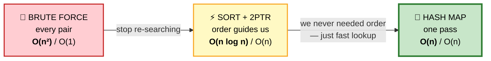

## 1️⃣ Brute Force — O(n²) / O(1)

Check every pair. Literal reading of the problem.

```cpp
vector<int> twoSumBrute(const vector<int>& nums, int target) {
    int n = nums.size();
    for (int i = 0; i < n; ++i)
        for (int j = i + 1; j < n; ++j)     // j = i+1 avoids self-pair & repeats
            if (nums[i] + nums[j] == target) return {i, j};
    return {};
}
```

⚠️ n=10⁵ → 5 billion comparisons. Far too slow.

## 2️⃣ Sort + Two Pointers — O(n log n) / O(n)

#### 💬 Why this is better
Brute force searches blindly. **Sorting creates structure**: if the sum is too big, only moving `right` left can help. Each comparison eliminates a whole row of the pair space.

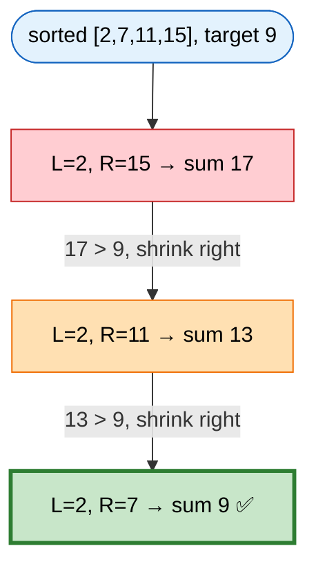

⚠️ Sorting destroys indices — pair values with indices first.

```cpp
vector<int> twoSumSort(vector<int> nums, int target) {
    int n = nums.size();
    vector<pair<int,int>> v;                       // {value, original index}
    for (int i = 0; i < n; ++i) v.push_back({nums[i], i});
    sort(v.begin(), v.end());

    int l = 0, r = n - 1;
    while (l < r) {
        int sum = v[l].first + v[r].first;
        if (sum == target) return {min(v[l].second, v[r].second),
                                   max(v[l].second, v[r].second)};
        if (sum < target) ++l; else --r;
    }
    return {};
}
```

## 3️⃣ Hash Map — O(n) / O(n) ⭐ OPTIMAL

#### 💬 The key question
**What was brute force redoing?** *Searching* for `target - nums[i]`. Sorting made that O(log n); a hash map makes it **O(1)** — and we never needed order at all.

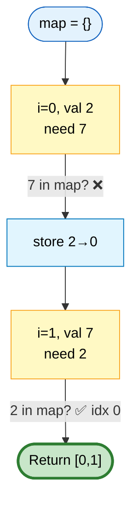

```
   TRACE  [3, 2, 4], target 6
   ┌───┬─────┬──────┬──────────────┬─────────────┐
   │ i │ val │ need │ in map?      │ map after   │
   ├───┼─────┼──────┼──────────────┼─────────────┤
   │ 0 │  3  │  3   │ ❌ empty     │ {3:0}       │
   │ 1 │  2  │  4   │ ❌           │ {3:0, 2:1}  │
   │ 2 │  4  │  2   │ ✅ idx 1     │ → [1,2]     │
   └───┴─────┴──────┴──────────────┴─────────────┘
   ⭐ At i=0, need=3 and val=3 — but map is empty, so no
     self-match. That's WHY we insert after checking.
```

```cpp
vector<int> twoSum(const vector<int>& nums, int target) {
    unordered_map<int,int> seen;                   // value → index
    seen.reserve(nums.size());                     // ⭐ avoid rehashing

    for (int i = 0; i < (int)nums.size(); ++i) {
        auto it = seen.find(target - nums[i]);
        if (it != seen.end()) return {it->second, i};
        seen[nums[i]] = i;                         // ⭐ insert AFTER checking
    }
    return {};
}
```

## 📊 Comparison

| Approach | Time | Space | When to use |
|---|---|---|---|
| Brute force | O(n²) | O(1) | Never (unless n < 100) |
| Sort + 2ptr | O(n log n) | O(n) | Already sorted, or need all pairs |
| **Hash map** | **O(n)** | O(n) | ✅ Default |

⭐ **If the array is already sorted**, two pointers wins: O(n) time, **O(1) space**.

## ⚠️ Edge Cases
`[3,3]` t=6 → `[0,1]` (insert-after-check) · negatives · `[5,2]` t=10 must NOT return `[0,0]` · overflow in `target - nums[i]` for extreme values.

## 📌 Pattern Card
```
SIGNAL   "pair summing to X", unsorted
OPTIMAL  O(n) hash map, one pass
KEY      insert AFTER checking
RELATED  3Sum · 4Sum · Two Sum II · Subarray Sum = K
```

---

# 2. Best Time to Buy and Sell Stock

🟢 **Easy** · Running minimum

> One buy, one sell (buy before sell). Maximize profit. Return 0 if none possible.

```
   Input:  [7, 1, 5, 3, 6, 4]
   Output: 5      buy at 1 (day 1), sell at 6 (day 4)
```

## 🗺️ Approach Ladder

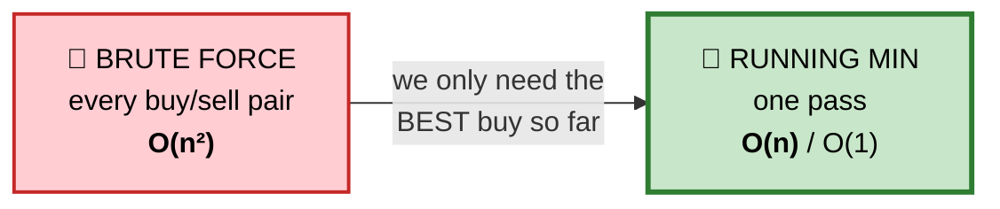

## 1️⃣ Brute Force — O(n²)

```cpp
int maxProfitBrute(vector<int>& p) {
    int best = 0;
    for (int i = 0; i < (int)p.size(); ++i)
        for (int j = i + 1; j < (int)p.size(); ++j)
            best = max(best, p[j] - p[i]);
    return best;
}
```

## 2️⃣ Running Minimum — O(n) / O(1) ⭐ OPTIMAL

#### 💬 The insight
To sell on day `i` for maximum profit, you want to have bought at the **cheapest price seen before day `i`**. You don't need to remember *all* previous prices — just the minimum.

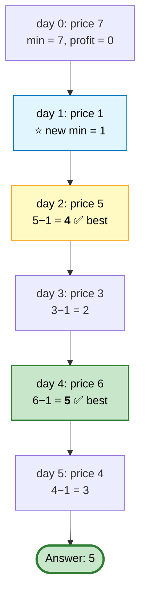

```cpp
int maxProfit(vector<int>& p) {
    int lo = INT_MAX, best = 0;
    for (int x : p) {
        lo   = min(lo, x);          // cheapest buy price so far
        best = max(best, x - lo);   // best profit if we sell today
    }
    return best;
}
```

⭐ **This is Kadane's algorithm in disguise** — running the max-subarray algorithm on the *difference* array `[p1−p0, p2−p1, ...]` gives the identical answer.

## ⚠️ Edge Cases
Strictly decreasing `[7,6,4,3,1]` → 0 · single element → 0 · empty → 0.

## 📌 Pattern Card
```
SIGNAL   "max difference where the smaller comes first"
OPTIMAL  O(n)/O(1) running min
RELATED  Stock II/III/IV/cooldown/fee · Maximum Subarray
```

---

# 3. Contains Duplicate

🟢 **Easy** · Set

> Return true if any value appears at least twice.

## 🗺️ Approach Ladder

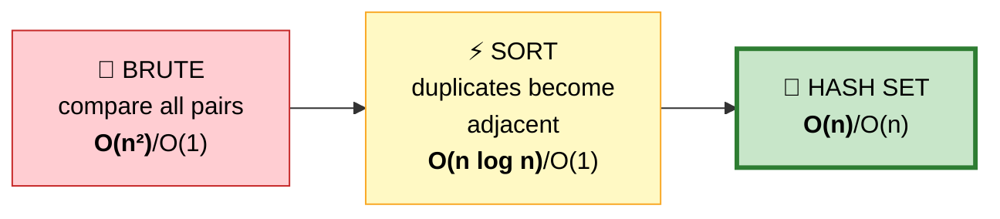

```cpp
// 1️⃣ Brute — O(n²)
// 2️⃣ Sort then check neighbours — O(n log n) time, O(1) space ⭐ if space matters
bool containsDuplicateSort(vector<int> a) {
    sort(a.begin(), a.end());
    for (int i = 1; i < (int)a.size(); ++i) if (a[i] == a[i-1]) return true;
    return false;
}

// 3️⃣ Hash set — O(n) time ⭐ OPTIMAL for time
bool containsDuplicate(vector<int>& nums) {
    unordered_set<int> s(nums.begin(), nums.end());
    return s.size() != nums.size();
}

// ⭐ Early-exit version uses less memory in practice
bool containsDuplicateEarly(vector<int>& nums) {
    unordered_set<int> s;
    for (int x : nums) if (!s.insert(x).second) return true;
    return false;
}
```

⭐ **Genuine tradeoff:** sorting is O(1) space if you may modify the input. State both.

---

# 4. Product of Array Except Self

🟡 **Medium** · Prefix × suffix

> `out[i]` = product of all elements except `nums[i]`. **No division.** O(n).

```
   Input:  [1, 2, 3, 4]
   Output: [24, 12, 8, 6]
```

## 🗺️ Approach Ladder

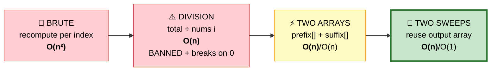

## 1️⃣ Brute Force — O(n²)
```cpp
for (int i = 0; i < n; ++i) {
    int prod = 1;
    for (int j = 0; j < n; ++j) if (j != i) prod *= a[j];
    out[i] = prod;
}
```

## 2️⃣ Division — O(n) but ❌ disallowed
```
   ⚠️ Even if allowed, zeros break it:
     one zero  → every other index is 0, that index is the rest's product
     two zeros → everything is 0
   You'd need to count zeros and branch. Fragile.
```

## 3️⃣ Prefix + Suffix Arrays — O(n) / O(n)

#### 💬 The reframe
"Everything except me" = **everything left of me × everything right of me.** Two independent halves.

```
   nums:      1     2     3     4
   prefix:    1     1     2     6      (product of everything BEFORE)
   suffix:   24    12     4     1      (product of everything AFTER)
              ×     ×     ×     ×
   result:   24    12     8     6   ✅
```

## 4️⃣ Two Sweeps, O(1) Extra — ⭐ OPTIMAL

Store prefixes directly in the output, then multiply suffixes in on a reverse pass.

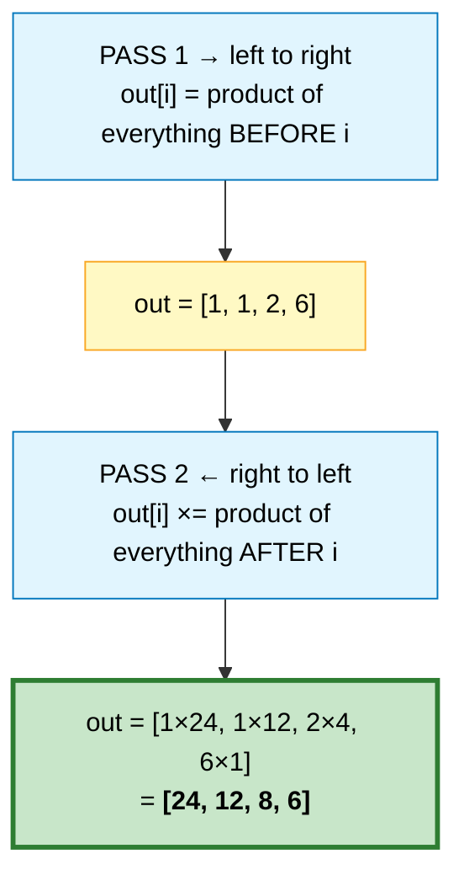

```cpp
vector<int> productExceptSelf(vector<int>& nums) {
    int n = nums.size();
    vector<int> out(n, 1);

    int pre = 1;
    for (int i = 0; i < n; ++i) {
        out[i] = pre;          // ⭐ store BEFORE updating — excludes nums[i]
        pre *= nums[i];
    }

    int suf = 1;
    for (int i = n - 1; i >= 0; --i) {
        out[i] *= suf;         // ⭐ same rule, mirrored
        suf *= nums[i];
    }
    return out;
}
```

⭐ **Zeros need no special case** — a zero simply zeroes one running product, which propagates correctly.

## 📌 Pattern Card
```
SIGNAL   "all except me" / needs left AND right context
OPTIMAL  two sweeps, O(1) extra space
RELATED  Trapping Rain Water · Candy · prefix-sum family
```

---

# 5. Maximum Subarray (Kadane)

🟡 **Medium** · Kadane's algorithm

> Find the contiguous subarray with the largest sum.

```
   Input:  [-2, 1, -3, 4, -1, 2, 1, -5, 4]
   Output: 6        the subarray [4, -1, 2, 1]
```

## 🗺️ Approach Ladder

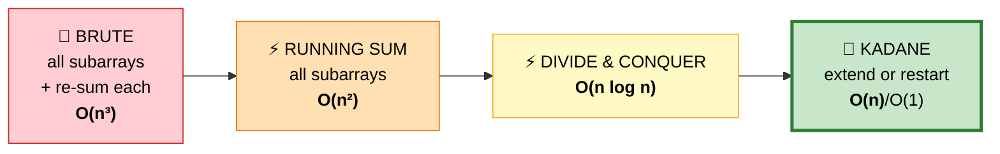

## 1️⃣ Brute Force — O(n³)
Every start, every end, re-sum the range.

## 2️⃣ Running Sum — O(n²)
Keep a running sum as `end` extends — drops one loop.
```cpp
for (int i = 0; i < n; ++i) {
    int sum = 0;
    for (int j = i; j < n; ++j) { sum += a[j]; best = max(best, sum); }
}
```

## 3️⃣ Divide & Conquer — O(n log n)
Max subarray is entirely left, entirely right, or **crosses the middle**. Compute all three.
```
   ⭐ Worth mentioning in interviews — it shows range,
     and it's the approach that generalizes to segment trees
     for the "query any range" version.
```

## 4️⃣ Kadane — O(n) / O(1) ⭐ OPTIMAL

#### 💬 The one question
At each element, ask: **"is the baggage I'm carrying helping me?"**
If the running sum is negative, it can only *hurt* whatever comes next. Drop it and start fresh.

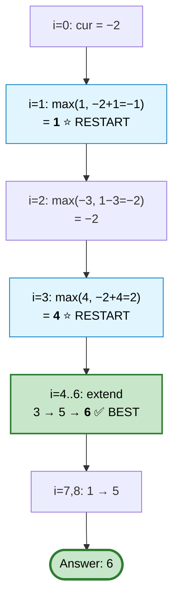

```cpp
int maxSubArray(vector<int>& nums) {
    int cur = nums[0], best = nums[0];
    for (int i = 1; i < (int)nums.size(); ++i) {
        cur  = max(nums[i], cur + nums[i]);   // ⭐ restart vs extend
        best = max(best, cur);
    }
    return best;
}
```

#### Variant — return the actual indices
```cpp
int cur = nums[0], best = nums[0], s = 0, bl = 0, br = 0;
for (int i = 1; i < n; ++i) {
    if (nums[i] > cur + nums[i]) { cur = nums[i]; s = i; }   // restart here
    else cur += nums[i];
    if (cur > best) { best = cur; bl = s; br = i; }
}
```

## ⚠️ Edge Cases
**All negative** `[-3,-1,-2]` → `-1`, not 0. ⭐ Initializing `best = 0` is the classic bug — it wrongly returns 0 by allowing an empty subarray.

## 📌 Pattern Card
```
SIGNAL   "maximum contiguous sum"
OPTIMAL  Kadane, O(n)/O(1)
KEY      init best = nums[0], NOT 0
RELATED  Max Product Subarray · Best Time to Buy/Sell · Circular Max Sum
```

---

# 6. Maximum Product Subarray

🟡 **Medium** · Track max **and** min

> Largest **product** of a contiguous subarray.

```
   Input:  [2, 3, -2, 4]  → 6      ([2,3])
   Input:  [-2, 0, -1]    → 0
   Input:  [-2, 3, -4]    → 24     ⭐ ([-2,3,-4]) — two negatives!
```

## 🗺️ Approach Ladder

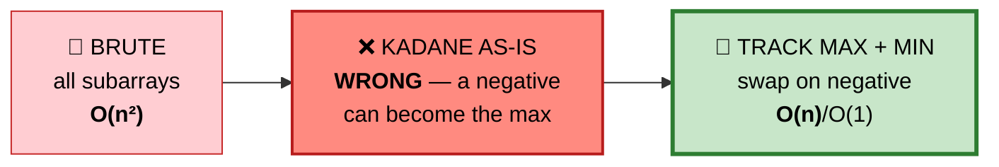

## 💬 Why plain Kadane fails

With sums, a big negative running total is simply bad. With **products**, a big negative is potentially *fantastic* — multiply by another negative and it becomes a big positive.

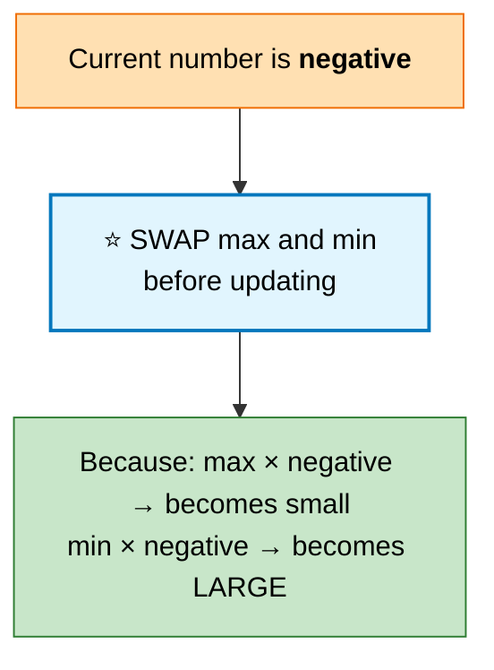

```
   TRACE  [2, 3, -2, 4]
   ┌───┬─────┬────────────┬─────────────┬──────┐
   │ i │ val │ mx         │ mn          │ best │
   ├───┼─────┼────────────┼─────────────┼──────┤
   │ 0 │  2  │  2         │  2          │  2   │
   │ 1 │  3  │  6         │  3          │  6   │
   │ 2 │ −2  │ ⭐SWAP → mx=3, mn=6      │      │
   │   │     │ max(−2,−6)=−2│ min(−2,−12)=−12│ 6 │
   │ 3 │  4  │ max(4,−8)=4│ min(4,−48)=−48│  6  │
   └───┴─────┴────────────┴─────────────┴──────┘
   ⭐ We keep −12 because a future negative could flip it huge.
```

```cpp
int maxProduct(vector<int>& nums) {
    int mx = nums[0], mn = nums[0], best = nums[0];
    for (int i = 1; i < (int)nums.size(); ++i) {
        int x = nums[i];
        if (x < 0) swap(mx, mn);          // ⭐ negative flips the roles
        mx = max(x, mx * x);              // restart vs extend
        mn = min(x, mn * x);
        best = max(best, mx);
    }
    return best;
}
```

⭐ **Zeros reset naturally** — `max(0, anything*0) = 0` restarts both trackers.

## 📌 Pattern Card
```
SIGNAL   "maximum product subarray"
KEY      track BOTH max and min; swap when the value is negative
RELATED  Maximum Subarray (the additive version)
```

---

# 7. Find Minimum in Rotated Sorted Array

🟡 **Medium** · Binary search

> A sorted array rotated at an unknown pivot. Find the minimum in O(log n).

```
   Input:  [4, 5, 6, 7, 0, 1, 2]  → 0
   Input:  [3, 4, 5, 1, 2]        → 1
   Input:  [1, 2, 3]              → 1   (not rotated)
```

## 🗺️ Approach Ladder

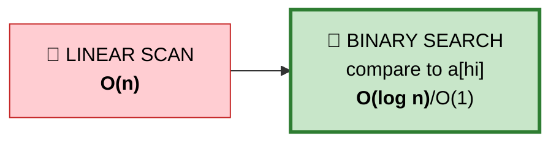

## 💬 The shape of the array

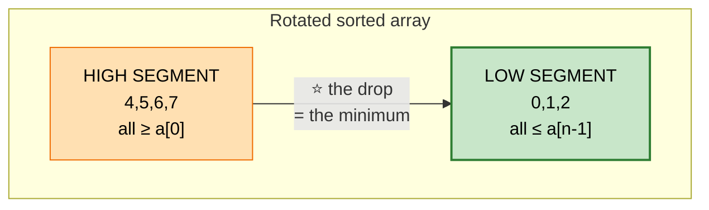

⭐ **Compare `a[mid]` with `a[hi]`, not `a[lo]`:**

```
   if a[mid] > a[hi]  →  mid is in the HIGH segment
                          the minimum must be to the RIGHT
                          lo = mid + 1

   else               →  mid is in the LOW segment (or IS the min)
                          hi = mid          ⭐ keep mid — it might be the answer
```

```
   TRACE  [4,5,6,7,0,1,2]
   ┌────────┬─────┬────────────┬──────────────────────┐
   │ lo, hi │ mid │ a[mid] vs  │ action               │
   │        │     │ a[hi]      │                      │
   ├────────┼─────┼────────────┼──────────────────────┤
   │  0, 6  │  3  │ 7 > 2      │ min is right → lo=4  │
   │  4, 6  │  5  │ 1 < 2      │ min is here/left→hi=5│
   │  4, 5  │  4  │ 0 < 1      │ hi = 4               │
   │  4, 4  │  —  │ lo == hi   │ ⭐ answer = a[4] = 0  │
   └────────┴─────┴────────────┴──────────────────────┘
```

```cpp
int findMin(vector<int>& a) {
    int lo = 0, hi = a.size() - 1;
    while (lo < hi) {                       // ⭐ note: lo < hi, not <=
        int mid = lo + (hi - lo) / 2;       // ⭐ overflow-safe
        if (a[mid] > a[hi]) lo = mid + 1;   // min strictly right
        else                hi = mid;       // ⭐ mid could BE the min
    }
    return a[lo];
}
```

⚠️ **Why not compare with `a[lo]`?** It's ambiguous. In `[1,2,3]` (unrotated), `a[mid] > a[lo]` is true — same as in a rotated array — so you can't distinguish the cases. `a[hi]` has no such ambiguity.

## 📌 Pattern Card
```
SIGNAL   rotated sorted array
KEY      compare mid to HI, not LO. Use lo<hi and hi=mid.
RELATED  Search in Rotated Sorted (I & II) · Peak Element
```

---

# 8. Search in Rotated Sorted Array

🟡 **Medium** · Binary search with a sorted half

> Rotated sorted array with **distinct** values. Find `target`'s index, or −1. O(log n).

## 💬 The key observation

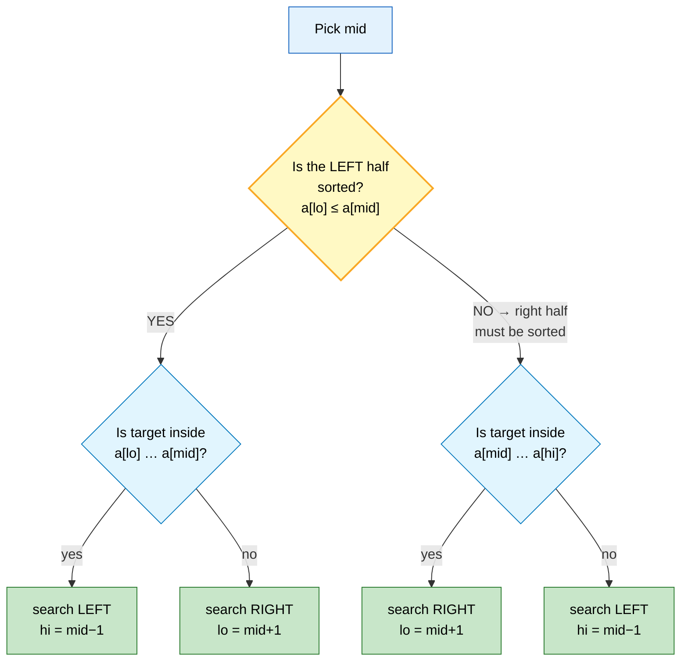

⭐ **However you cut a rotated array, at least one half is fully sorted.** Identify which, check if the target lies in its known range, and discard the other half.

```cpp
int search(vector<int>& a, int t) {
    int lo = 0, hi = a.size() - 1;
    while (lo <= hi) {
        int mid = lo + (hi - lo) / 2;
        if (a[mid] == t) return mid;

        if (a[lo] <= a[mid]) {                    // LEFT half is sorted
            if (a[lo] <= t && t < a[mid]) hi = mid - 1;
            else                          lo = mid + 1;
        } else {                                   // RIGHT half is sorted
            if (a[mid] < t && t <= a[hi]) lo = mid + 1;
            else                          hi = mid - 1;
        }
    }
    return -1;
}
```

#### Alternative: two binary searches
Find the pivot with problem #7, then binary search the correct segment. Same complexity, arguably easier to reason about, but two passes.

## 📌 Pattern Card
```
SIGNAL   search in a rotated sorted array
KEY      one half is ALWAYS sorted — identify it, then decide
RELATED  Find Min in Rotated · Search Rotated II
```

---

# 9. Search in Rotated Sorted Array II

🟡 **Medium** · Rotated + **duplicates**

> Same as #8, but values may repeat. Return true/false.

## ⚠️ Why duplicates break the previous solution

```
   a = [3, 1, 3, 3, 3]
        ▲     ▲     ▲
       lo    mid    hi

   a[lo] == a[mid] == a[hi] == 3

   ⭐ Is the left half sorted? Can't tell.
     [3,1,3] is not sorted, but [3,3,3] would be.
     The comparison gives us NO information.
```

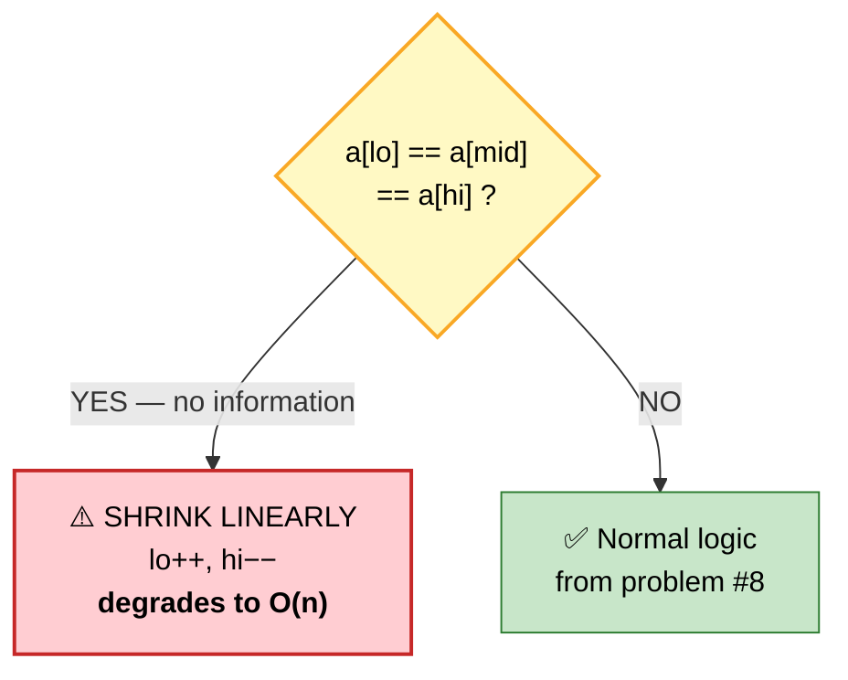

```cpp
bool search(vector<int>& a, int t) {
    int lo = 0, hi = a.size() - 1;
    while (lo <= hi) {
        int mid = lo + (hi - lo) / 2;
        if (a[mid] == t) return true;

        // ⭐ Ambiguous case — shed one element from each end
        if (a[lo] == a[mid] && a[mid] == a[hi]) { ++lo; --hi; continue; }

        if (a[lo] <= a[mid]) {
            if (a[lo] <= t && t < a[mid]) hi = mid - 1; else lo = mid + 1;
        } else {
            if (a[mid] < t && t <= a[hi]) lo = mid + 1; else hi = mid - 1;
        }
    }
    return false;
}
```

**Complexity:** O(log n) average, ⚠️ **O(n) worst case** (all values identical). ⭐ Say this explicitly — it's the whole point of the problem.

---

# 10. Find First and Last Position

🟡 **Medium** · Two binary searches

> Sorted array with duplicates. Find the first and last index of `target`. O(log n).

```
   Input:  [5,7,7,8,8,10], target 8  → [3, 4]
   Input:  [5,7,7,8,8,10], target 6  → [-1, -1]
```

## 💬 lower_bound vs upper_bound

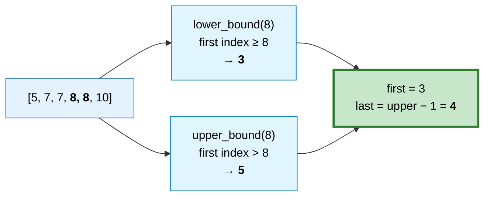

```cpp
// ⭐ Know how to write these by hand — interviewers often ban STL here
int lowerBound(vector<int>& a, int t) {      // first index with a[i] >= t
    int lo = 0, hi = a.size();               // ⭐ hi = n, not n-1
    while (lo < hi) {
        int mid = lo + (hi - lo) / 2;
        if (a[mid] < t) lo = mid + 1; else hi = mid;
    }
    return lo;
}

vector<int> searchRange(vector<int>& a, int t) {
    int first = lowerBound(a, t);
    if (first == (int)a.size() || a[first] != t) return {-1, -1};
    int last = lowerBound(a, t + 1) - 1;      // ⭐ upper_bound(t) == lower_bound(t+1)
    return {first, last};
}
```

⭐ **The trick worth remembering:** `upper_bound(t) == lower_bound(t+1)` for integers, so you only need one helper function.

---

# 11. Missing Number

🟢 **Easy** · XOR / Gauss

> `n` distinct numbers from `[0, n]`. One is missing. Find it.

## 🗺️ Approach Ladder

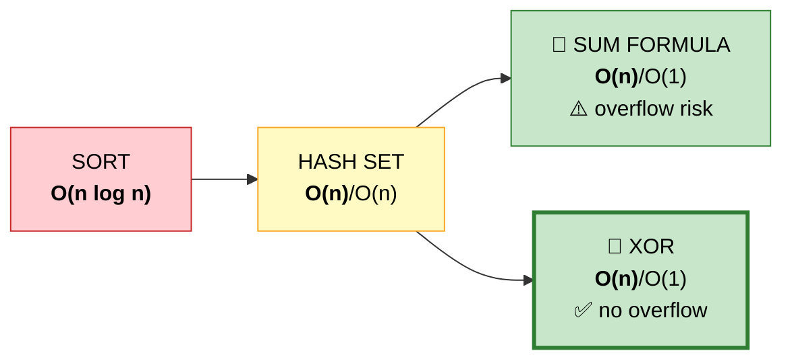

## 3️⃣ Sum formula
```cpp
int missingNumberSum(vector<int>& a) {
    long long n = a.size();
    long long expected = n * (n + 1) / 2;         // ⭐ long long to avoid overflow
    long long actual = accumulate(a.begin(), a.end(), 0LL);
    return (int)(expected - actual);
}
```

## 4️⃣ XOR — ⭐ OPTIMAL (no overflow at all)

#### 💬 Why XOR works
`a ^ a = 0` and `a ^ 0 = a`, and XOR is commutative. So XOR every index *and* every value together — each present number appears exactly twice and cancels, leaving only the missing one.

```
   a = [3, 0, 1],  n = 3

   XOR of indices 0..3  :  0^1^2^3
   XOR of values        :  3^0^1
   ─────────────────────────────────
   combined             :  (0^0)^(1^1)^(3^3)^2  =  2  ⭐
                            └─ everything paired cancels ─┘
```

```cpp
int missingNumber(vector<int>& a) {
    int res = a.size();                      // start with n (never a valid index)
    for (int i = 0; i < (int)a.size(); ++i) res ^= i ^ a[i];
    return res;
}
```

---

# 12. Single Number

🟢 **Easy** · XOR

> Every element appears twice except one. Find it. O(n) time, O(1) space.

```cpp
int singleNumber(vector<int>& a) {
    int r = 0;
    for (int x : a) r ^= x;      // ⭐ pairs cancel, the loner survives
    return r;
}
```

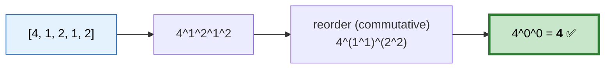

⭐ **Related:** [Single Number II](10-greedy-backtracking-misc.md#34-single-number-ii-others-appear-3-) (others appear 3×) and [III](10-greedy-backtracking-misc.md#35-single-number-iii-two-loners-) (two loners) — both use cleverer bit tricks.

---

# 13. Range Sum Query — Immutable

🟢 **Easy** · Prefix sum

> Many `sumRange(l, r)` queries on a fixed array. Make queries O(1).

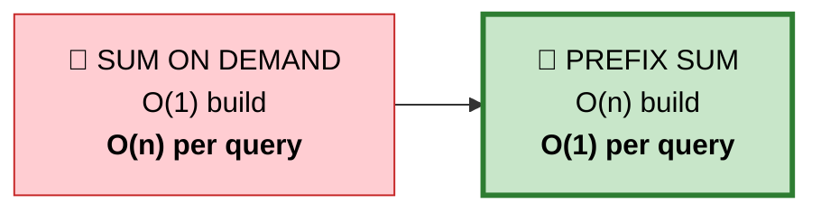

```
   nums:        [ -2,  0,  3, -5,  2, -1 ]
   prefix:  [0,   -2, -2,  1, -4, -2, -3 ]
             ▲
        ⭐ leading 0 removes the l==0 special case

   sumRange(2, 5) = prefix[6] − prefix[2] = −3 − (−2) = −1 ✅
```

```cpp
class NumArray {
    vector<long long> pre;                     // ⭐ long long avoids overflow
public:
    NumArray(vector<int>& a) : pre(a.size() + 1, 0) {
        for (int i = 0; i < (int)a.size(); ++i) pre[i+1] = pre[i] + a[i];
    }
    int sumRange(int l, int r) { return (int)(pre[r+1] - pre[l]); }
};
```

⭐ **If updates were allowed**, prefix sums break (an update costs O(n) to rebuild). You'd need a **Fenwick tree** or **segment tree** for O(log n) update *and* query.

---

# 14. Subarray Sum Equals K

🟡 **Medium** · Prefix sum + hash map ⭐ **very high frequency**

> Count subarrays summing to `k`. **Values may be negative.**

```
   Input:  [1, 1, 1], k = 2  → 2
   Input:  [1, 2, 3], k = 3  → 2      ([1,2] and [3])
```

## 🗺️ Approach Ladder

```mermaid
flowchart LR
    A["🐌 BRUTE<br/>all subarrays, re-sum<br/><b>O(n³)</b>"] --> B["⚡ RUNNING SUM<br/><b>O(n²)</b>/O(1)"]
    B --> C["❌ SLIDING WINDOW<br/><b>WRONG</b> — negatives<br/>break monotonicity"]
    C --> D["🚀 PREFIX + HASHMAP<br/><b>O(n)</b>/O(n)"]

    style A fill:#ffcdd2,stroke:#c62828,color:#000
    style B fill:#ffe0b2,stroke:#ef6c00,color:#000
    style C fill:#ff8a80,stroke:#b71c1c,stroke-width:2px,color:#000
    style D fill:#c8e6c9,stroke:#2e7d32,stroke-width:3px,color:#000
```

## ⚠️ Why sliding window fails here

```
   Sliding window needs: growing the window MONOTONICALLY
   changes the sum in one direction.

   With negatives, adding an element can DECREASE the sum —
   so there's no valid shrink condition. The technique
   simply doesn't apply.

   ⭐ This is the key distinction to state in an interview:
     all-positive → sliding window
     negatives    → prefix sum + hash map
```

## 4️⃣ Prefix Sum + Hash Map — ⭐ OPTIMAL

#### 💬 The reframe

```
   sum(l..r)  =  prefix[r]  −  prefix[l−1]

   So "which subarrays ending at r sum to k?" becomes:
   "how many earlier prefixes equal prefix[r] − k?"
   → a hash map lookup.
```

```mermaid
flowchart TD
    S(["sum=0, map={0:1}, ans=0"]) --> A["i=0, x=1 → sum=1<br/>need 1−3 = −2 ❌"]
    A --> B["i=1, x=2 → sum=3<br/>need 3−3 = <b>0</b> ✅ found ×1<br/>ans=1 (subarray [1,2])"]
    B --> C["i=2, x=3 → sum=6<br/>need 6−3 = <b>3</b> ✅ found ×1<br/>ans=2 (subarray [3])"]
    C --> R(["Answer: 2"])

    style S fill:#e3f2fd,stroke:#1565c0,color:#000
    style A fill:#ffe0b2,stroke:#ef6c00,color:#000
    style B fill:#c8e6c9,stroke:#2e7d32,color:#000
    style C fill:#c8e6c9,stroke:#2e7d32,color:#000
    style R fill:#c8e6c9,stroke:#2e7d32,stroke-width:3px,color:#000
```

#### ⭐ Why the `{0: 1}` seed is essential

```
   At i=1 above, the running sum IS exactly 3 = k.
   That subarray [1,2] starts at index 0, so the "prefix
   before it" is the EMPTY prefix, whose sum is 0.

   ⭐ Seeding {0:1} declares "I have seen a prefix summing
     to 0, once — the empty one." Without it, every subarray
     starting at index 0 is missed.
```

```cpp
int subarraySum(vector<int>& a, int k) {
    unordered_map<long long,int> cnt;
    cnt[0] = 1;                                // ⭐ the empty prefix
    long long sum = 0;
    int ans = 0;

    for (int x : a) {
        sum += x;
        auto it = cnt.find(sum - k);           // ⭐ find, not [] — avoids
        if (it != cnt.end()) ans += it->second; //    inserting junk keys
        cnt[sum]++;
    }
    return ans;
}
```

## 📌 Pattern Card
```
SIGNAL   "count/find subarrays with sum = k" WITH NEGATIVES
OPTIMAL  prefix sum + hash map, O(n)
KEY      seed {0:1} · use find() not operator[]
RELATED  Subarrays Div by K · Contiguous Array · Max Size Subarray Sum K
         Path Sum III (same idea, on a TREE)
```

---

# 15. Continuous Subarray Sum

🟡 **Medium** · Prefix remainder

> Is there a subarray of length **≥ 2** whose sum is a multiple of `k`?

## 💬 The modular insight

```mermaid
flowchart TD
    A["Two prefixes with the<br/><b>SAME REMAINDER mod k</b>"] --> B["Their difference is<br/>divisible by k"]
    B --> C["⭐ So the subarray between<br/>them sums to a multiple of k"]

    style A fill:#e1f5fe,stroke:#0277bd,color:#000
    style B fill:#fff9c4,stroke:#f9a825,color:#000
    style C fill:#c8e6c9,stroke:#2e7d32,stroke-width:3px,color:#000
```

```
   TRACE  [23, 2, 4, 6, 7], k = 6

   ┌───┬─────┬──────────┬───────────┬────────────────────────┐
   │ i │ val │ prefix   │ mod 6     │ seen before?           │
   ├───┼─────┼──────────┼───────────┼────────────────────────┤
   │ − │  −  │    0     │     0     │ store {0: −1}          │
   │ 0 │ 23  │   23     │  ⭐ 5     │ no → store {5: 0}      │
   │ 1 │  2  │   25     │     1     │ no → store {1: 1}      │
   │ 2 │  4  │   29     │  ⭐ 5     │ ✅ seen at index 0     │
   │   │     │          │           │ length = 2−0 = 2 ≥ 2 ✅ │
   └───┴─────┴──────────┴───────────┴────────────────────────┘
   → subarray [2,4] sums to 6 ✅
```

```cpp
bool checkSubarraySum(vector<int>& a, int k) {
    unordered_map<int,int> first;              // remainder → EARLIEST index
    first[0] = -1;                             // ⭐ handles prefixes ending at i
    int sum = 0;

    for (int i = 0; i < (int)a.size(); ++i) {
        sum = (sum + a[i]) % k;
        auto it = first.find(sum);
        if (it != first.end()) {
            if (i - it->second >= 2) return true;   // ⭐ length ≥ 2 required
        } else {
            first[sum] = i;                    // ⭐ store only the EARLIEST
        }                                      //    to maximize length
    }
    return false;
}
```

⭐ **Two subtleties:** store only the *earliest* index per remainder (maximizes subarray length), and the `-1` seed lets a prefix from index 0 count correctly.

---

# 16. Subarrays Sums Divisible by K

🟡 **Medium** · Count version of #15

```cpp
int subarraysDivByK(vector<int>& a, int k) {
    vector<int> cnt(k, 0);
    cnt[0] = 1;                                // ⭐ empty prefix
    int sum = 0, ans = 0;

    for (int x : a) {
        sum = ((sum + x) % k + k) % k;         // ⭐⭐ normalize NEGATIVE mod
        ans += cnt[sum]++;                     // count then increment
    }
    return ans;
}
```

```
   ⚠️⚠️ THE C++ NEGATIVE MODULO TRAP

   In C++, (-7) % 3 == -1, NOT 2.

   So remainders can be negative, and −1 and 2 represent the
   SAME residue class but hash to different buckets.

   ⭐ FIX:  ((x % k) + k) % k     always yields [0, k)
```

⭐ **Counting pairs:** if a remainder is seen `m` times, that gives `m(m−1)/2` valid subarrays. The `ans += cnt[sum]++` idiom accumulates that incrementally.

---

# 17. Contiguous Array

🟡 **Medium** · The 0→−1 trick

> Longest subarray with an **equal number of 0s and 1s**.

## 💬 The transformation

```mermaid
flowchart LR
    A["[0, 1, 0, 1]"] -->|"map 0 → −1"| B["[−1, 1, −1, 1]"]
    B --> C["⭐ 'equal counts'<br/>becomes<br/>'sum = 0'"]
    C --> D["Now it's the standard<br/>prefix-sum problem"]

    style A fill:#e3f2fd,stroke:#1565c0,color:#000
    style B fill:#fff9c4,stroke:#f9a825,color:#000
    style C fill:#e1f5fe,stroke:#0277bd,stroke-width:2px,color:#000
    style D fill:#c8e6c9,stroke:#2e7d32,stroke-width:3px,color:#000
```

```
   TRACE  [0, 1, 0, 0, 1, 1]

   mapped:  −1   1  −1  −1   1   1
   prefix:  −1   0  −1  −2  −1   0
             ▲   ▲               ▲
             │   └── sum 0 at i=1 → length 2
             │       (seed {0:−1} makes this work)
             └────── sum 0 again at i=5 → length 6 ⭐ BEST
```

```cpp
int findMaxLength(vector<int>& a) {
    unordered_map<int,int> first;
    first[0] = -1;                             // ⭐ empty prefix at index −1
    int sum = 0, best = 0;

    for (int i = 0; i < (int)a.size(); ++i) {
        sum += (a[i] == 1 ? 1 : -1);           // ⭐ THE TRICK
        auto it = first.find(sum);
        if (it != first.end()) best = max(best, i - it->second);
        else first[sum] = i;                   // earliest only → longest span
    }
    return best;
}
```

⭐ **Generalizable:** mapping two categories to `+1`/`−1` turns "equal counts" into "sum zero" — works for any balanced-partition problem.

---

# 18. Maximum Size Subarray Sum Equals K

🟡 **Medium** · Longest version of #14

```cpp
int maxSubArrayLen(vector<int>& a, int k) {
    unordered_map<long long,int> first;
    first[0] = -1;
    long long sum = 0;
    int best = 0;

    for (int i = 0; i < (int)a.size(); ++i) {
        sum += a[i];
        auto it = first.find(sum - k);
        if (it != first.end()) best = max(best, i - it->second);
        if (!first.count(sum)) first[sum] = i;   // ⭐ EARLIEST index only
    }
    return best;
}
```

```
   ⭐ COUNTING vs LONGEST — the difference in one line

   COUNT  (#14):  map stores HOW MANY times each prefix appeared
                  cnt[sum]++

   LONGEST (#18): map stores the EARLIEST index of each prefix
                  if (!first.count(sum)) first[sum] = i
                  ⭐ earliest gives the longest possible span
```

---

# 19. Range Addition

🟡 **Medium** · Difference array

> Apply `u` range updates `[start, end, val]` to a zero array of length `n`. Return the final array.

## 🗺️ Approach Ladder

```mermaid
flowchart LR
    A["🐌 NAIVE<br/>loop each range<br/><b>O(u × n)</b>"] --> B["🚀 DIFFERENCE ARRAY<br/>2 writes per update<br/><b>O(u + n)</b>"]

    style A fill:#ffcdd2,stroke:#c62828,color:#000
    style B fill:#c8e6c9,stroke:#2e7d32,stroke-width:3px,color:#000
```

## 💬 The difference array — prefix sums, inverted

```mermaid
flowchart TD
    U["Update: add v to range [l, r]"] --> D["⭐ Only TWO writes:<br/>diff[l] += v<br/>diff[r+1] −= v"]
    D --> P["At the end, one prefix-sum<br/>pass materializes everything"]

    style U fill:#e3f2fd,stroke:#1565c0,color:#000
    style D fill:#e1f5fe,stroke:#0277bd,stroke-width:2px,color:#000
    style P fill:#c8e6c9,stroke:#2e7d32,stroke-width:3px,color:#000
```

```
   n = 5, updates = [[1,3,2], [2,4,3]]

   diff after update 1 (add 2 to [1..3]):
     index:   0   1   2   3   4  (5)
     diff:    0  +2   0   0  −2   0
                  ▲           ▲
              turn ON     turn OFF

   diff after update 2 (add 3 to [2..4]):
     diff:    0  +2  +3   0  −2  −3

   PREFIX SUM to materialize:
     result:  0   2   5   5   3
              └─ running total of diff ─┘   ✅
```

```cpp
vector<int> getModifiedArray(int n, vector<vector<int>>& updates) {
    vector<int> diff(n + 1, 0);                // ⭐ n+1 so r+1 is always valid

    for (auto& u : updates) {
        diff[u[0]]     += u[2];                // turn the increment ON
        diff[u[1] + 1] -= u[2];                // turn it OFF after the range
    }

    vector<int> out(n);
    int run = 0;
    for (int i = 0; i < n; ++i) { run += diff[i]; out[i] = run; }
    return out;
}
```

⭐ **The duality worth remembering:**
```
   PREFIX SUM     → O(1) range QUERY,  O(n) update
   DIFFERENCE ARR → O(1) range UPDATE, O(n) query
   FENWICK TREE   → O(log n) for BOTH
```

---

# 20. Corporate Flight Bookings

🟡 **Medium** · Difference array applied

> `bookings[i] = [first, last, seats]`. Return total seats booked per flight (1-indexed).

```cpp
vector<int> corpFlightBookings(vector<vector<int>>& b, int n) {
    vector<int> d(n + 1, 0);

    for (auto& x : b) {
        d[x[0] - 1] += x[2];                   // ⭐ convert 1-indexed → 0-indexed
        d[x[1]]     -= x[2];                   // x[1] is already "last+1" after
    }                                          //    the index shift

    for (int i = 1; i < n; ++i) d[i] += d[i-1];
    d.pop_back();
    return d;
}
```

⭐ **Same technique as #19.** Once you recognize "many range updates, one final read," the difference array is automatic.

---

## 📋 Part 1 Recall

```mermaid
mindmap
  root(("Arrays<br/>Part 1"))
    Hash Map
      Two Sum
      Contains Duplicate
      insert AFTER checking
    Prefix Sum
      Subarray Sum = K
      seed with 0:1
      COUNT→frequency<br/>LONGEST→earliest index
      0→−1 trick
      normalize negative mod
    Difference Array
      Range Addition
      O(1) update, O(n) read
      inverse of prefix sum
    Kadane
      Maximum Subarray
      extend or restart
      Max PRODUCT tracks max AND min
    Binary Search
      Rotated array
      compare mid to HI not LO
      one half is always sorted
      duplicates → O(n) worst
    XOR
      Missing Number
      Single Number
      pairs cancel
```

```
╔══════════════════════════════════════════════════════════════════════╗
║               ARRAYS & STRINGS PART 1 — PATTERN RECALL               ║
╠══════════════════════════════════════════════════════════════════════╣
║ "pair summing to X"            → hash map, insert AFTER checking     ║
║ "subarray sum = k" + NEGATIVES → prefix sum + hashmap, seed {0:1}    ║
║ "subarray sum = k" all positive→ sliding window                      ║
║ "equal counts of A and B"      → map one to −1, find sum 0           ║
║ "many range updates"           → difference array                    ║
║ "max contiguous sum"           → Kadane (init best = a[0], NOT 0)    ║
║ "max contiguous PRODUCT"       → track max AND min, swap on negative ║
║ "rotated sorted array"         → binary search, compare mid to HI    ║
║ "appears twice except one"     → XOR everything                      ║
║ "all except me"                → prefix × suffix, two sweeps         ║
╠══════════════════════════════════════════════════════════════════════╣
║ ⚠️ TRAPS                                                              ║
║   C++ negative modulo → ((x%k)+k)%k                                  ║
║   Kadane with best=0 → wrong on all-negative input                   ║
║   mid = lo + (hi−lo)/2 → overflow safety                             ║
║   map[key] INSERTS on read → use find()                              ║
╚══════════════════════════════════════════════════════════════════════╝
```

---

**Next:** [Arrays Part 2 — Sorting, In-Place & Matrix →](01b-arrays-strings.md)
