# 📊 Arrays & Strings — Part 2: Sorting, In-Place & Matrix

> Problems 21–45. **Full approach ladders** for problems introducing a new technique; **compact entries** for variations that reuse a ladder you've already seen.

**Prerequisite:** [Part 1](01-arrays-strings.md) · **Format:** [see the sample](FORMAT-SAMPLE.md)

---

## 📑 Contents

| # | Problem | Diff | Type | Optimal |
|---|---|---|---|---|
| [21](#21-merge-sorted-array) | Merge Sorted Array | 🟢 | 🔵 **Full** | O(m+n), O(1) — fill backwards |
| [22](#22-sort-colors-dutch-national-flag) | Sort Colors | 🟡 | 🔵 **Full** | O(n) one pass, 3 pointers |
| [23](#23-merge-intervals) | Merge Intervals | 🟡 | 🔵 **Full** | O(n log n) sort by start |
| [24](#24-insert-interval) | Insert Interval | 🟡 | ⚪ Variation | O(n) — already sorted |
| [25](#25-non-overlapping-intervals) | Non-overlapping Intervals | 🟡 | 🔵 **Full** | O(n log n) sort by **END** |
| [26](#26-minimum-number-of-arrows) | Minimum Arrows | 🟡 | ⚪ Variation | same as #25 |
| [27](#27-meeting-rooms-ii) | Meeting Rooms II | 🟡 | 🔵 **Full** | O(n log n) sweep line |
| [28](#28-largest-number) | Largest Number | 🟡 | 🔵 **Full** | O(n log n) custom comparator |
| [29](#29-h-index) | H-Index | 🟡 | ⚪ Variation | O(n) counting sort |
| [30](#30-top-k-frequent-elements) | Top K Frequent | 🟡 | 🔵 **Full** | O(n) bucket sort |
| [31](#31-remove-duplicates-from-sorted-array) | Remove Duplicates | 🟢 | 🔵 **Full** | O(n) slow/fast |
| [32](#32-remove-duplicates-ii-allow-2) | Remove Duplicates II | 🟡 | ⚪ Variation | generalized k |
| [33](#33-remove-element--move-zeroes) | Remove Element / Move Zeroes | 🟢 | ⚪ Variation | same pattern |
| [34](#34-rotate-array) | Rotate Array | 🟡 | 🔵 **Full** | O(n), O(1) triple reverse |
| [35](#35-first-missing-positive) | First Missing Positive | 🔴 | 🔵 **Full** | O(n), O(1) cyclic sort |
| [36](#36-find-all-duplicates--disappeared) | Find All Duplicates / Disappeared | 🟡 | ⚪ Variation | sign marking |
| [37](#37-next-permutation) | Next Permutation | 🟡 | 🔵 **Full** | O(n) pivot + reverse |
| [38](#38-set-matrix-zeroes) | Set Matrix Zeroes | 🟡 | 🔵 **Full** | O(1) space, row/col 0 as flags |
| [39](#39-rotate-image) | Rotate Image | 🟡 | 🔵 **Full** | transpose + reverse |
| [40](#40-spiral-matrix) | Spiral Matrix | 🟡 | 🔵 **Full** | 4 shrinking boundaries |
| [41](#41-spiral-matrix-ii) | Spiral Matrix II | 🟡 | ⚪ Variation | same, writing |
| [42](#42-search-a-2d-matrix) | Search 2D Matrix | 🟡 | ⚪ Variation | flatten + binary search |
| [43](#43-search-a-2d-matrix-ii) | Search 2D Matrix II | 🟡 | 🔵 **Full** | O(m+n) staircase |
| [44](#44-game-of-life) | Game of Life | 🟡 | 🔵 **Full** | bit encoding, O(1) space |
| [45](#45-max-sum-rectangle-in-2d-matrix) | Max Sum Rectangle 2D | 🔴 | 🔵 **Full** | O(R²C) collapse + Kadane |

🔵 **Full** = complete approach ladder · ⚪ **Variation** = reuses a ladder, showing only what changes

---

# 21. Merge Sorted Array

🟢 **Easy** · 🔵 Full ladder · **Fill from the back**

> Merge sorted `b` (length n) into sorted `a`, which has exactly n trailing empty slots. **In place.**

```
   a = [1, 2, 3, _, _, _]   m = 3
   b = [2, 5, 6]            n = 3
   →   [1, 2, 2, 3, 5, 6]
```

## 🗺️ Approach Ladder

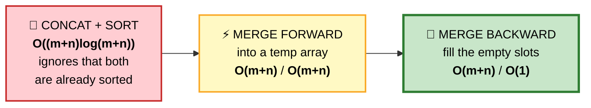

## 1️⃣ Concatenate + Sort — O((m+n) log(m+n))
Throws away the fact that both inputs are sorted. Works, but wasteful.

## 2️⃣ Merge Forward — O(m+n) time, O(m+n) space
Standard two-pointer merge into a temporary array, then copy back.

⚠️ **Why we can't merge forward in place:** writing to `a[0]` would overwrite a value we haven't consumed yet.

## 3️⃣ Merge Backward — ⭐ OPTIMAL, O(1) space

#### 💬 The insight
The empty space is at the **end**. So fill from the end — the largest values go there first, and you're always writing into a slot that's either empty or already consumed.

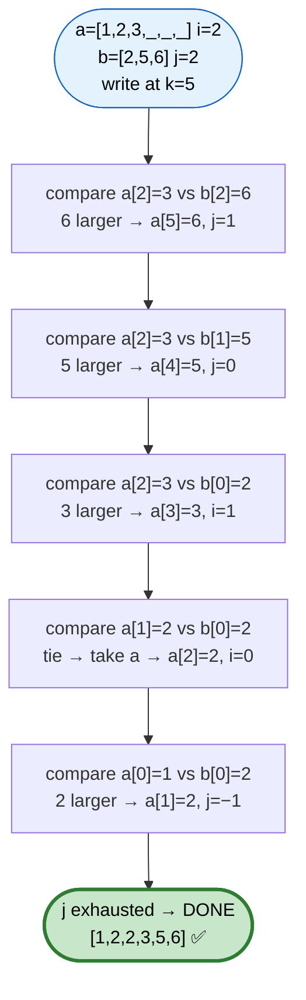

```cpp
void merge(vector<int>& a, int m, vector<int>& b, int n) {
    int i = m - 1, j = n - 1, k = m + n - 1;

    while (j >= 0) {                    // ⭐ only j matters — see below
        a[k--] = (i >= 0 && a[i] > b[j]) ? a[i--] : b[j--];
    }
}
```

```
   ⭐ WHY THE LOOP CONDITION IS `j >= 0` AND NOT `i >= 0 || j >= 0`

   If b is exhausted first, everything left in a is ALREADY
   in its correct final position — nothing to do.

   If a is exhausted first, the remaining b elements still
   need copying, which the loop handles via the i>=0 guard.

   ⭐ So only j needs checking. Elegant, and worth pointing out.
```

## 📌 Pattern Card
```
SIGNAL   merge sorted data in place with trailing space
KEY      FILL FROM THE BACK to avoid overwriting
RELATED  Merge Two Sorted Lists · Merge k Sorted · merge sort itself
```

---

# 22. Sort Colors (Dutch National Flag)

🟡 **Medium** · 🔵 Full ladder · **Three-way partition**

> Sort an array of only 0s, 1s, 2s **in one pass, in place**.

## 🗺️ Approach Ladder

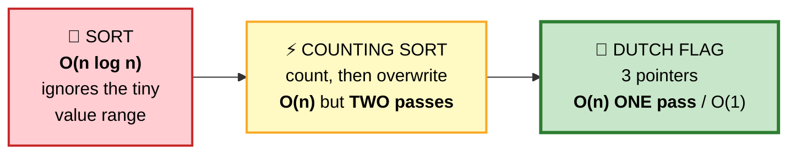

## 2️⃣ Counting Sort — O(n), two passes
```cpp
int cnt[3] = {};
for (int x : a) cnt[x]++;
int k = 0;
for (int v = 0; v < 3; ++v) while (cnt[v]--) a[k++] = v;
```
✅ Simple and genuinely fine. ⚠️ But the follow-up is always *"can you do it in one pass?"*

## 3️⃣ Dutch National Flag — ⭐ OPTIMAL, one pass

#### 💬 The invariant
Maintain **three regions** and a scanner. Everything before `lo` is 0, everything after `hi` is 2, and `[lo, mid)` is 1. The unexplored region shrinks to nothing.

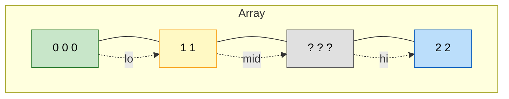

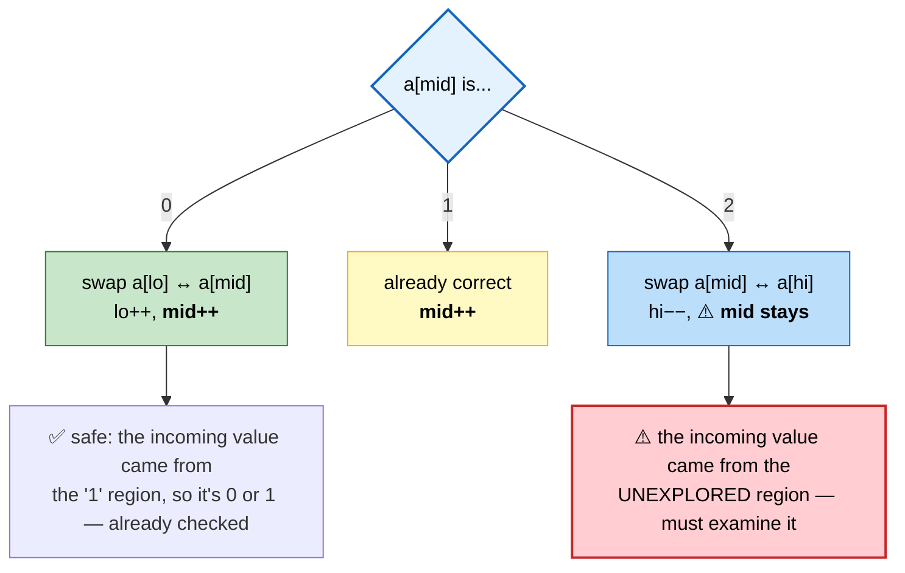

```cpp
void sortColors(vector<int>& a) {
    int lo = 0, mid = 0, hi = a.size() - 1;

    while (mid <= hi) {
        if      (a[mid] == 0) swap(a[lo++], a[mid++]);
        else if (a[mid] == 2) swap(a[mid], a[hi--]);   // ⭐ mid does NOT advance
        else                  ++mid;
    }
}
```

```
   ⭐⭐ THE ASYMMETRY IS THE WHOLE PROBLEM

   After swapping with lo: the value coming back is from the
   region we've already classified as 1s → safe to advance mid.

   After swapping with hi: the value coming back is from the
   UNEXPLORED region → we must examine it, so mid stays put.

   ⚠️ Advancing mid in the '2' case is THE classic bug here.
```

## 📌 Pattern Card
```
SIGNAL   partition into 3 groups, one pass, in place
KEY      after swapping with HI, do NOT advance mid
RELATED  quicksort 3-way partition · Sort Array by Parity
```

---

# 23. Merge Intervals

🟡 **Medium** · 🔵 Full ladder · **Sort by START**

> Merge all overlapping intervals.

```
   Input:  [[1,3],[2,6],[8,10],[15,18]]
   Output: [[1,6],[8,10],[15,18]]
```

## 🗺️ Approach Ladder

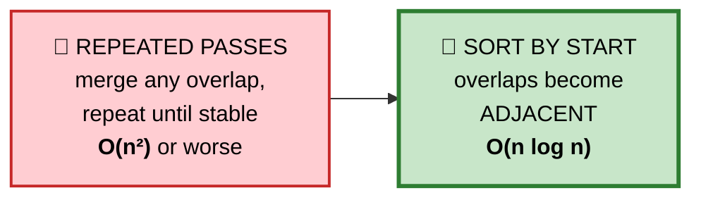

## 💬 Why sorting by start is the whole trick

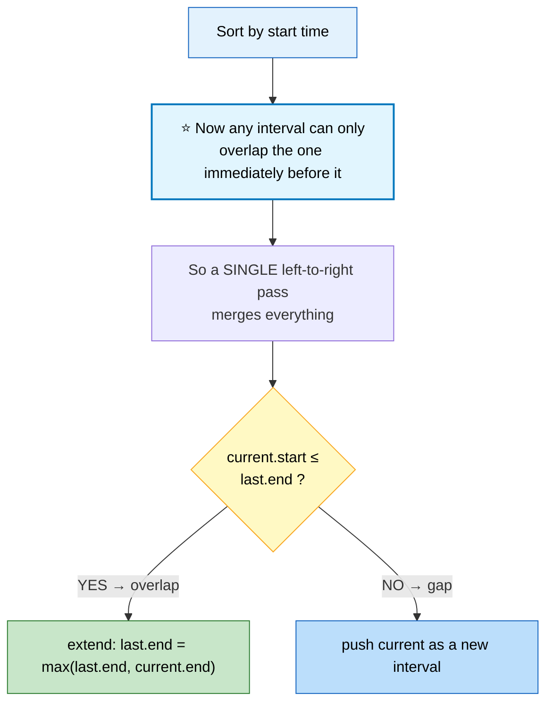

```
   TRACE  [[1,3],[2,6],[8,10],[15,18]]

   ┌─────────┬──────────────┬────────────────────────────────┐
   │ current │ last in out  │ action                         │
   ├─────────┼──────────────┼────────────────────────────────┤
   │  [1,3]  │  (empty)     │ push → out=[[1,3]]             │
   │  [2,6]  │  [1,3]       │ 2 ≤ 3 ⭐ OVERLAP               │
   │         │              │ end = max(3,6)=6 → out=[[1,6]] │
   │  [8,10] │  [1,6]       │ 8 > 6 → gap → push             │
   │ [15,18] │  [8,10]      │ 15 > 10 → gap → push           │
   └─────────┴──────────────┴────────────────────────────────┘
   RESULT: [[1,6],[8,10],[15,18]] ✅
```

```cpp
vector<vector<int>> merge(vector<vector<int>>& iv) {
    if (iv.empty()) return {};
    sort(iv.begin(), iv.end());              // ⭐ by START (default pair order)

    vector<vector<int>> out;
    for (auto& cur : iv) {
        if (out.empty() || out.back()[1] < cur[0]) {
            out.push_back(cur);              // no overlap → new interval
        } else {
            out.back()[1] = max(out.back()[1], cur[1]);   // ⭐ EXTEND
        }
    }
    return out;
}
```

⚠️ **`max` is required**, not just `cur[1]`. Consider `[[1,10],[2,3]]` — the second is fully *nested*, and blindly assigning would shrink the merged interval to `[1,3]`.

## 📌 Pattern Card
```
SIGNAL   "merge/combine overlapping ranges"
KEY      sort by START · use max() when extending (nesting!)
RELATED  Insert Interval · Employee Free Time · Meeting Rooms
```

---

# 24. Insert Interval
🟡 ⚪ **Variation of #23** — same merge logic, but the input is **already sorted**, so no sort needed → **O(n)**.

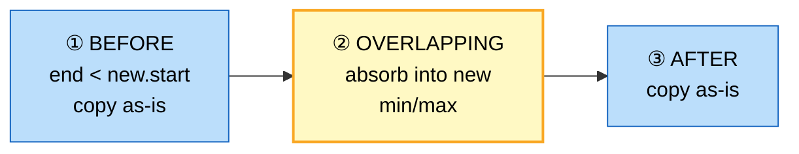

```cpp
vector<vector<int>> insert(vector<vector<int>>& iv, vector<int> ni) {
    vector<vector<int>> out;
    int i = 0, n = iv.size();

    while (i < n && iv[i][1] < ni[0]) out.push_back(iv[i++]);      // ① before
    while (i < n && iv[i][0] <= ni[1]) {                            // ② absorb
        ni[0] = min(ni[0], iv[i][0]);
        ni[1] = max(ni[1], iv[i][1]);
        ++i;
    }
    out.push_back(ni);
    while (i < n) out.push_back(iv[i++]);                           // ③ after
    return out;
}
```

---

# 25. Non-overlapping Intervals

🟡 **Medium** · 🔵 Full ladder · ⭐ **Sort by END** — the key distinction

> Minimum intervals to **remove** so none overlap.

## ⚠️ Why sorting by START is wrong here

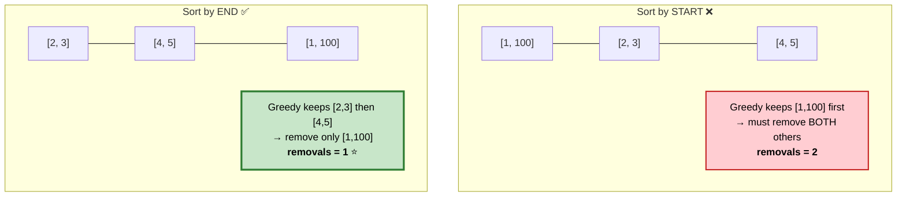

```
   ⭐⭐ THE GREEDY PROOF (activity selection)

   Keeping the interval that FINISHES EARLIEST always leaves
   the maximum possible room for everything after it.

   EXCHANGE ARGUMENT: take any optimal solution. If it doesn't
   start with the earliest-finishing interval, swap that one in.
   It finishes no later, so nothing else breaks, and the count
   is unchanged. Therefore greedy is at least as good. ∎
```

```cpp
int eraseOverlapIntervals(vector<vector<int>>& iv) {
    if (iv.empty()) return 0;
    sort(iv.begin(), iv.end(),
         [](const auto& a, const auto& b){ return a[1] < b[1]; });  // ⭐ by END

    int end = INT_MIN, keep = 0;
    for (auto& x : iv) {
        if (x[0] >= end) { end = x[1]; ++keep; }   // no overlap → keep it
    }
    return iv.size() - keep;                       // removals = total − kept
}
```

⭐ **Maximize what you keep, then subtract.** Directly counting removals is harder to reason about.

## 📌 Pattern Card
```
SIGNAL   "max non-overlapping" / "min removals"
KEY      ⭐ SORT BY END (activity selection), not start
RELATED  Minimum Arrows · Meeting Rooms · Job Scheduling
```

---

# 26. Minimum Number of Arrows
🟡 ⚪ **Variation of #25** — identical greedy, phrased as "shoot at the earliest end point."

```cpp
int findMinArrowShots(vector<vector<int>>& pts) {
    sort(pts.begin(), pts.end(),
         [](const auto& a, const auto& b){ return a[1] < b[1]; });
    int arrows = 0;
    long long end = LLONG_MIN;                     // ⚠️ long long — coords can be
    for (auto& p : pts)                            //    INT_MIN/INT_MAX
        if (p[0] > end) { ++arrows; end = p[1]; }
    return arrows;
}
```
⚠️ **Only difference from #25:** touching endpoints (`p[0] == end`) count as *overlapping* here — one arrow pops both — so the comparison is `>` not `>=`.

---

# 27. Meeting Rooms II

🟡 **Medium** · 🔵 Full ladder · **Sweep line**

> Minimum meeting rooms needed for all meetings.

## 🗺️ Approach Ladder

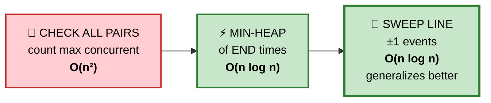

## 2️⃣ Min-Heap of End Times

#### 💬 The idea
The heap holds the end time of every **currently occupied** room. Its size *is* the room count.

```cpp
int minMeetingRooms(vector<vector<int>>& iv) {
    sort(iv.begin(), iv.end());
    priority_queue<int, vector<int>, greater<int>> ends;   // min-heap

    for (auto& m : iv) {
        if (!ends.empty() && ends.top() <= m[0]) ends.pop();  // ⭐ reuse a room
        ends.push(m[1]);
    }
    return ends.size();
}
```

## 3️⃣ Sweep Line — ⭐ generalizes to "max concurrent anything"

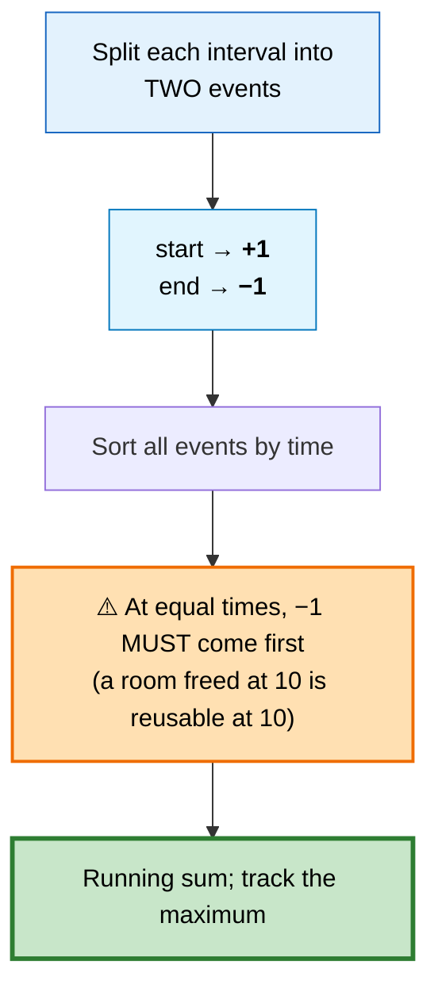

```
   TRACE  [[0,30],[5,10],[15,20]]

   events: (0,+1) (5,+1) (10,−1) (15,+1) (20,−1) (30,−1)

   time:     0    5   10   15   20   30
   delta:   +1   +1   −1   +1   −1   −1
   active:   1    2    1    2    1    0
                  ▲         ▲
              ⭐ MAX = 2 rooms
```

```cpp
int minMeetingRooms(vector<vector<int>>& iv) {
    vector<pair<int,int>> ev;
    for (auto& m : iv) {
        ev.push_back({m[0],  1});
        ev.push_back({m[1], -1});
    }
    sort(ev.begin(), ev.end());        // ⭐ pair sort: at equal time, −1 < +1 ✅

    int cur = 0, best = 0;
    for (auto& [t, d] : ev) { cur += d; best = max(best, cur); }
    return best;
}
```

⭐ **`pair` sorting gives the tie-break for free** — since `−1 < 1`, ends naturally sort before starts at the same timestamp.

## 📌 Pattern Card
```
SIGNAL   "max concurrent" / "minimum resources"
KEY      sweep line: +1/−1 events, ends BEFORE starts on ties
RELATED  Car Pooling · My Calendar I/II/III · The Skyline Problem
```

---

# 28. Largest Number

🟡 **Medium** · 🔵 Full ladder · **Custom comparator**

> Arrange numbers to form the largest possible number.

```
   Input:  [3, 30, 34, 5, 9]
   Output: "9534330"
```

## ⚠️ Why the obvious comparators fail

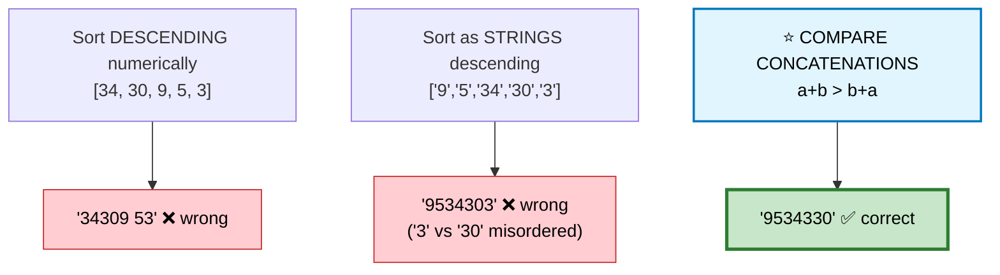

## 💬 The comparator

```
   Which comes first, "3" or "30"?

     "3" + "30" = "330"
     "30" + "3" = "303"

   ⭐ 330 > 303, so "3" comes FIRST.

   That's the whole rule: a before b if (a+b) > (b+a).
```

```cpp
string largestNumber(vector<int>& a) {
    vector<string> s;
    s.reserve(a.size());
    for (int x : a) s.push_back(to_string(x));

    sort(s.begin(), s.end(), [](const string& x, const string& y) {
        return x + y > y + x;            // ⭐ compare CONCATENATIONS
    });

    if (s[0] == "0") return "0";          // ⚠️ all zeros → "0" not "000...0"

    string out;
    for (auto& t : s) out += t;
    return out;
}
```

⭐ **This comparator is a valid strict weak ordering** — it's transitive and antisymmetric, which is what `sort` requires. Worth stating if asked; a comparator that isn't a valid ordering causes undefined behaviour in `std::sort`.

---

# 29. H-Index
🟡 ⚪ **Variation** — counting sort beats the O(n log n) sort.

```cpp
int hIndex(vector<int>& c) {
    int n = c.size();
    vector<int> bucket(n + 1, 0);
    for (int x : c) bucket[min(x, n)]++;      // ⭐ cap at n — h can't exceed n

    int total = 0;
    for (int h = n; h >= 0; --h) {            // scan from high h downward
        total += bucket[h];                   // papers with ≥ h citations
        if (total >= h) return h;
    }
    return 0;
}
```
⭐ **O(n) instead of O(n log n)** because the answer is bounded by `n`, making counting sort applicable.

---

# 30. Top K Frequent Elements

🟡 **Medium** · 🔵 Full ladder · **Bucket sort**

## 🗺️ Approach Ladder

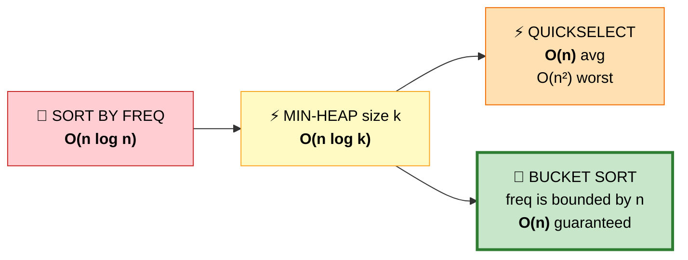

## 2️⃣ Min-Heap of size k — O(n log k)
```cpp
// ⭐ MIN-heap for the k LARGEST — counterintuitive but correct:
//    we pop the SMALLEST whenever size exceeds k
priority_queue<pair<int,int>, vector<pair<int,int>>, greater<>> pq;
for (auto& [val, freq] : cnt) {
    pq.push({freq, val});
    if ((int)pq.size() > k) pq.pop();
}
```

## 4️⃣ Bucket Sort — ⭐ OPTIMAL, O(n)

#### 💬 The key observation
**A frequency can never exceed `n`.** So index an array *by frequency* and walk it downward.

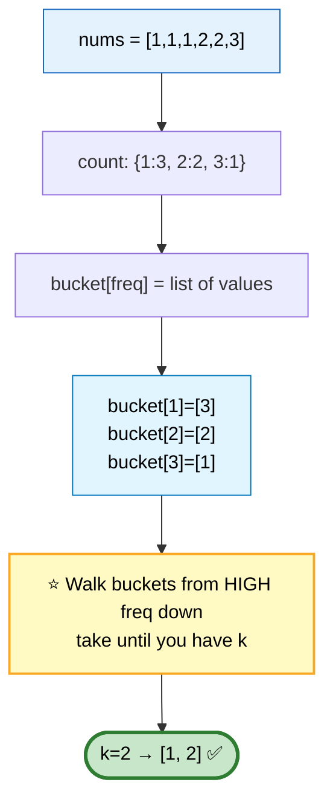

```cpp
vector<int> topKFrequent(vector<int>& a, int k) {
    unordered_map<int,int> cnt;
    for (int x : a) cnt[x]++;

    vector<vector<int>> bucket(a.size() + 1);      // ⭐ index BY frequency
    for (auto& [val, freq] : cnt) bucket[freq].push_back(val);

    vector<int> out;
    for (int f = a.size(); f >= 1 && (int)out.size() < k; --f)
        for (int v : bucket[f]) {
            out.push_back(v);
            if ((int)out.size() == k) break;
        }
    return out;
}
```

⭐ **When a value is bounded by n, counting/bucket sort turns O(n log n) into O(n).** Same idea powers H-Index and Sort Characters by Frequency.

---

# 31. Remove Duplicates from Sorted Array

🟢 **Easy** · 🔵 Full ladder · **Slow/fast pointers**

> Remove duplicates in place; return the new length.

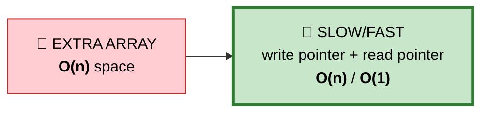

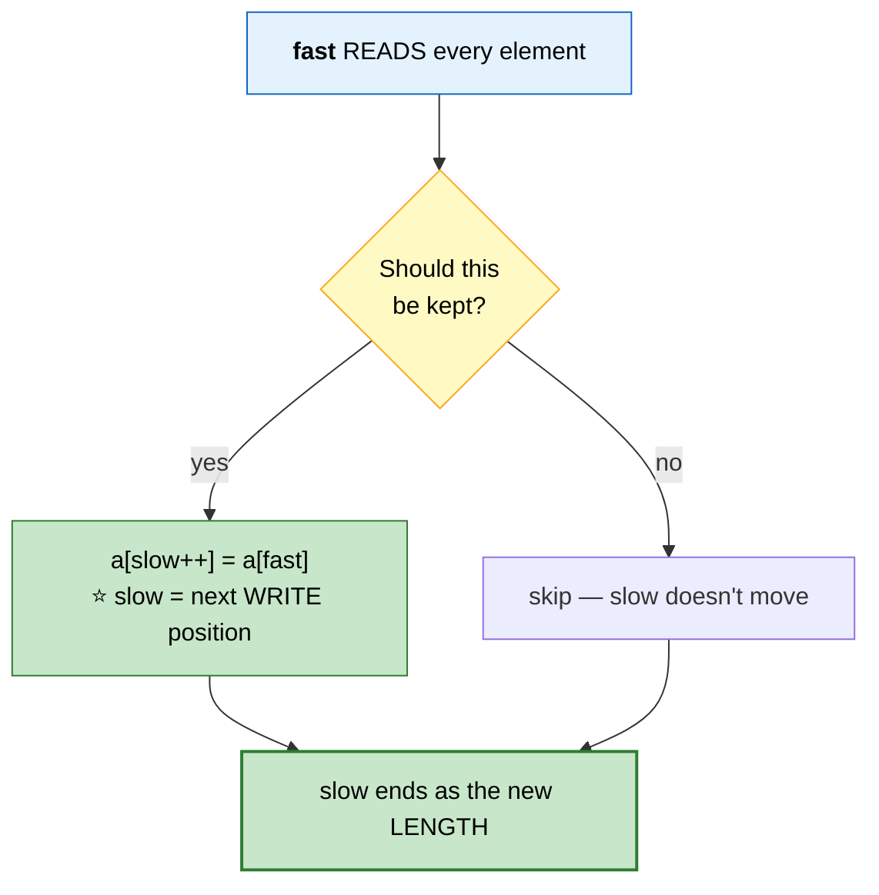

```
   TRACE  [0,0,1,1,1,2,2]

   fast:  0  1  2  3  4  5  6
   val:   0  0  1  1  1  2  2
   keep:  ✓  ✗  ✓  ✗  ✗  ✓  ✗
   slow:  1     2           3
                                → length 3, array starts [0,1,2] ✅
```

```cpp
int removeDuplicates(vector<int>& a) {
    if (a.empty()) return 0;
    int slow = 1;
    for (int fast = 1; fast < (int)a.size(); ++fast)
        if (a[fast] != a[slow - 1]) a[slow++] = a[fast];
    return slow;
}
```

## 📌 Pattern Card
```
SIGNAL   in-place filter / compaction
KEY      slow = write position, fast = read position
RELATED  Remove Element · Move Zeroes · Remove Dups II
```

---

# 32. Remove Duplicates II (allow 2)
🟡 ⚪ **Variation of #31** — one changed condition, and it generalizes.

```cpp
int removeDuplicates(vector<int>& a) {
    int k = 0;
    for (int x : a)
        if (k < 2 || x != a[k - 2]) a[k++] = x;   // ⭐ compare against a[k−2]
    return k;
}
```
```
   ⭐ THE GENERALIZATION
     allow m copies  →  compare against a[k − m]

   m=1 → a[k−1]  (problem #31)
   m=2 → a[k−2]  (this problem)
```

---

# 33. Remove Element / Move Zeroes
🟢 ⚪ **Variations of #31** — same slow/fast skeleton.

```cpp
// Remove all occurrences of val
int removeElement(vector<int>& a, int val) {
    int k = 0;
    for (int x : a) if (x != val) a[k++] = x;
    return k;
}

// Move all zeroes to the end, PRESERVING order of non-zeroes
void moveZeroes(vector<int>& a) {
    int k = 0;
    for (int i = 0; i < (int)a.size(); ++i)
        if (a[i]) swap(a[k++], a[i]);      // ⭐ swap, not assign — zeroes the tail
}                                          //    in the same pass
```

---

# 34. Rotate Array

🟡 **Medium** · 🔵 Full ladder · **Triple reverse**

> Rotate right by `k` steps, in place.

## 🗺️ Approach Ladder

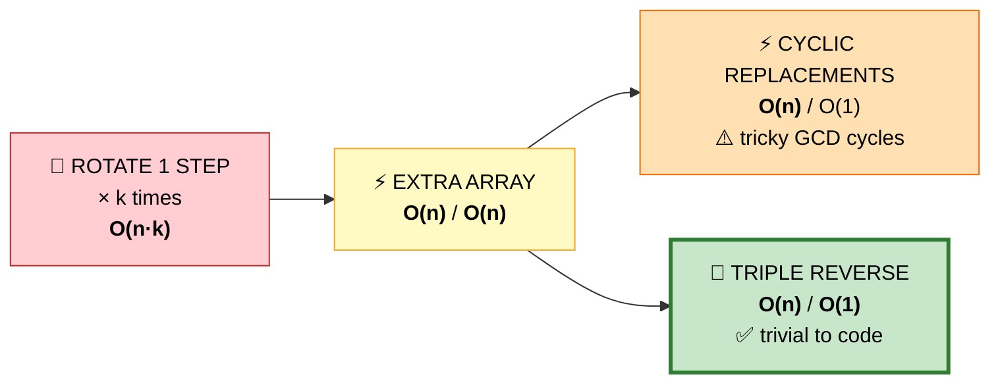

## 4️⃣ Triple Reverse — ⭐ OPTIMAL

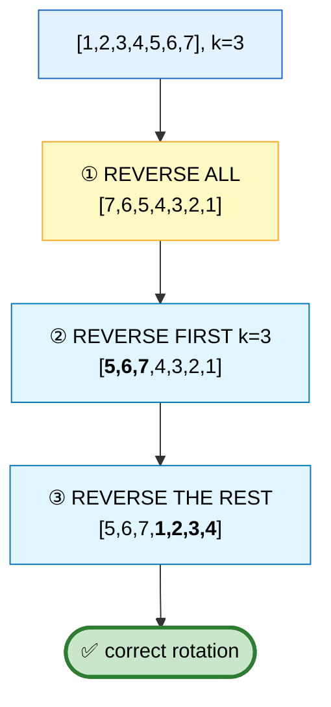

```
   ⭐ WHY IT WORKS
     Reversing everything puts the last k elements at the FRONT,
     but in reverse order. Reversing each of the two blocks
     individually restores their internal order.
```

```cpp
void rotate(vector<int>& a, int k) {
    int n = a.size();
    k %= n;                                     // ⭐ k can exceed n
    reverse(a.begin(), a.end());
    reverse(a.begin(), a.begin() + k);
    reverse(a.begin() + k, a.end());
}
```

⭐ **The same triple-reverse trick** solves [Reverse Words in a String](01c-arrays-strings.md#64-reverse-words-in-a-string).

---

# 35. First Missing Positive

🔴 **Hard** · 🔵 Full ladder · **Cyclic sort / array as hash table**

> Smallest missing positive integer. **O(n) time, O(1) space.**

## 🗺️ Approach Ladder

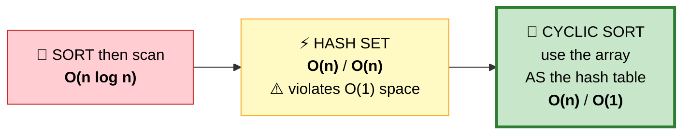

## 💬 Two insights unlock it

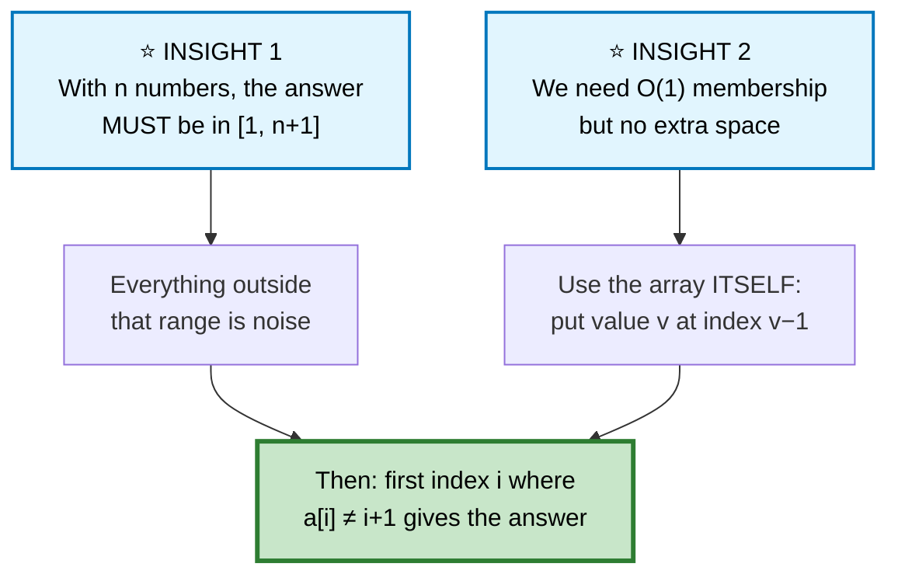

```
   TRACE  [3, 4, −1, 1]

   ┌──────────────────────────────────────────────────────────┐
   │ i=0: a[0]=3 → belongs at idx 2. swap.  [−1, 4, 3, 1]     │
   │      ⭐ don't advance — the incoming value is unexamined  │
   │ i=0: a[0]=−1 → out of range. advance.                    │
   │ i=1: a[1]=4 → belongs at idx 3. swap.  [−1, 1, 3, 4]     │
   │ i=1: a[1]=1 → belongs at idx 0. swap.  [1, −1, 3, 4]     │
   │ i=1: a[1]=−1 → out of range. advance.                    │
   │ i=2: a[2]=3, idx 2 → ✅ already home                      │
   │ i=3: a[3]=4, idx 3 → ✅ already home                      │
   └──────────────────────────────────────────────────────────┘

   FINAL SCAN
   index:      0     1     2     3
   a:          1    −1     3     4
   expected:   1     2     3     4
                     ▲
              ⭐ MISMATCH → answer = 2
```

```cpp
int firstMissingPositive(vector<int>& a) {
    int n = a.size();

    for (int i = 0; i < n; ++i) {
        // Keep swapping until a[i] is either out of range or already home
        while (a[i] > 0 && a[i] <= n && a[a[i] - 1] != a[i])
            swap(a[i], a[a[i] - 1]);
    }

    for (int i = 0; i < n; ++i)
        if (a[i] != i + 1) return i + 1;
    return n + 1;                              // ⭐ array was exactly 1..n
}
```

```
   ⭐ WHY THIS IS O(n) DESPITE THE NESTED LOOP

   Every swap places at least one value in its FINAL correct
   position, and a placed value is never moved again.
   With only n values, there are at most n swaps TOTAL across
   the entire run.

   Total = n iterations + ≤ n swaps = O(n) ✅
```

⚠️ **The `a[a[i]-1] != a[i]` condition** (not `a[i] != i+1`) prevents an infinite loop on duplicates.

## 📌 Pattern Card
```
SIGNAL   values in a known range 1..n, need O(1) space
KEY      array AS hash table: value v → index v−1
RELATED  Find All Duplicates · Find Disappeared · Find the Duplicate
```

---

# 36. Find All Duplicates / Disappeared
🟡 ⚪ **Variations of #35** — instead of swapping, use the **sign bit** as a "seen" marker.

```mermaid
flowchart LR
    A["value v seen"] --> B["negate a[|v|−1]"]
    B --> C["⭐ sign encodes presence<br/>magnitude preserves the value"]

    style B fill:#e1f5fe,stroke:#0277bd,color:#000
    style C fill:#c8e6c9,stroke:#2e7d32,stroke-width:2px,color:#000
```

```cpp
// Appears TWICE → the marker is already negative when we arrive
vector<int> findDuplicates(vector<int>& a) {
    vector<int> out;
    for (int x : a) {
        int i = abs(x) - 1;
        if (a[i] < 0) out.push_back(abs(x));    // already marked → duplicate
        else a[i] = -a[i];                      // mark as seen
    }
    return out;
}

// NEVER appears → still positive after the marking pass
vector<int> findDisappearedNumbers(vector<int>& a) {
    for (int x : a) a[abs(x) - 1] = -abs(a[abs(x) - 1]);
    vector<int> out;
    for (int i = 0; i < (int)a.size(); ++i) if (a[i] > 0) out.push_back(i + 1);
    return out;
}
```

---

# 37. Next Permutation

🟡 **Medium** · 🔵 Full ladder · **Pivot + swap + reverse**

> Rearrange into the next lexicographically greater permutation, in place. If none, sort ascending.

## 💬 The three-step algorithm

```mermaid
flowchart TD
    A["[1, 3, 5, 4, 2]"] --> S1
    S1["① FIND THE PIVOT<br/>rightmost i with a[i] &lt; a[i+1]<br/>⭐ here i=1, value 3"] --> S2
    S2["② FIND THE SWAP TARGET<br/>rightmost j with a[j] &gt; a[i]<br/>⭐ here j=3, value 4"] --> S3
    S3["③ SWAP → [1, <b>4</b>, 5, <b>3</b>, 2]"] --> S4
    S4["④ REVERSE the suffix after i<br/>[1, 4, <b>2, 3, 5</b>]"] --> R(["✅ next permutation"])

    style A fill:#e3f2fd,stroke:#1565c0,color:#000
    style S1 fill:#fff9c4,stroke:#f9a825,color:#000
    style S2 fill:#fff9c4,stroke:#f9a825,color:#000
    style S3 fill:#e1f5fe,stroke:#0277bd,color:#000
    style S4 fill:#e1f5fe,stroke:#0277bd,color:#000
    style R fill:#c8e6c9,stroke:#2e7d32,stroke-width:3px,color:#000
```

```
   ⭐ WHY EACH STEP IS WHAT IT IS

   ① The suffix after the pivot is NON-INCREASING — it's already
      the largest arrangement of those values, so no change
      there can increase the number. The pivot is the rightmost
      position that CAN be increased.

   ② We want the SMALLEST increase, so swap in the smallest
      value that's still larger than the pivot. Because the
      suffix is non-increasing, scanning from the right finds
      exactly that.

   ③ After swapping, the suffix is STILL non-increasing.
      Reversing makes it ascending = the SMALLEST arrangement,
      which is what "next" requires.
```

```cpp
void nextPermutation(vector<int>& a) {
    int n = a.size(), i = n - 2;

    while (i >= 0 && a[i] >= a[i + 1]) --i;          // ① find the pivot

    if (i >= 0) {
        int j = n - 1;
        while (a[j] <= a[i]) --j;                    // ② rightmost value > pivot
        swap(a[i], a[j]);                            // ③
    }
    reverse(a.begin() + i + 1, a.end());             // ④ ⭐ works even if i == −1
}
```

⭐ **When `i == -1`** (the whole array is descending, e.g. `[3,2,1]`), step ④ reverses everything into `[1,2,3]` — the required "wrap to smallest" behaviour, with no special case.

---

# 38. Set Matrix Zeroes

🟡 **Medium** · 🔵 Full ladder · **Use the matrix as its own storage**

> If a cell is 0, zero its entire row and column. **In place.**

## 🗺️ Approach Ladder

```mermaid
flowchart LR
    A["❌ ZERO IN PLACE<br/>as you scan<br/><b>WRONG</b> — cascades"] --> B["⚡ COPY MATRIX<br/><b>O(mn)</b> space"]
    B --> C["⚡ TWO SETS<br/>rows[] + cols[]<br/><b>O(m+n)</b> space"]
    C --> D["🚀 ROW 0 &amp; COL 0<br/>AS THE FLAGS<br/><b>O(1)</b> space"]

    style A fill:#ff8a80,stroke:#b71c1c,stroke-width:2px,color:#000
    style B fill:#ffcdd2,stroke:#c62828,color:#000
    style C fill:#fff9c4,stroke:#f9a825,color:#000
    style D fill:#c8e6c9,stroke:#2e7d32,stroke-width:3px,color:#000
```

⚠️ **Why zeroing as you scan is wrong:** the zeroes you write are indistinguishable from original zeroes, so they cascade and blank the whole matrix.

## 4️⃣ Row 0 and Column 0 as Flags — ⭐ OPTIMAL

```mermaid
flowchart TD
    A["⭐ Store 'this row needs zeroing'<br/>in m[i][0]<br/>and 'this column needs zeroing'<br/>in m[0][j]"] --> B["⚠️ CONFLICT: m[0][0] would have<br/>to encode BOTH row 0 and column 0"]
    B --> C["✅ FIX: track column 0 in a<br/>separate boolean variable"]
    C --> D["⚠️ Then write BACKWARDS,<br/>so the flags aren't destroyed<br/>before they're read"]

    style A fill:#e1f5fe,stroke:#0277bd,color:#000
    style B fill:#ffe0b2,stroke:#ef6c00,stroke-width:2px,color:#000
    style C fill:#c8e6c9,stroke:#2e7d32,color:#000
    style D fill:#ffe0b2,stroke:#ef6c00,stroke-width:2px,color:#000
```

```cpp
void setZeroes(vector<vector<int>>& m) {
    int R = m.size(), C = m[0].size();
    bool firstCol = false;                    // ⭐ column 0 needs its own flag

    // PASS 1 — record which rows/cols need zeroing, in row 0 and col 0
    for (int i = 0; i < R; ++i) {
        if (m[i][0] == 0) firstCol = true;
        for (int j = 1; j < C; ++j)           // ⭐ start at j=1, not 0
            if (m[i][j] == 0) { m[i][0] = 0; m[0][j] = 0; }
    }

    // PASS 2 — apply, going BACKWARDS so flags survive until used
    for (int i = R - 1; i >= 0; --i) {
        for (int j = C - 1; j >= 1; --j)
            if (m[i][0] == 0 || m[0][j] == 0) m[i][j] = 0;
        if (firstCol) m[i][0] = 0;            // ⭐ handle column 0 last
    }
}
```

---

# 39. Rotate Image

🟡 **Medium** · 🔵 Full ladder · **Transpose + reverse**

> Rotate an n×n matrix 90° clockwise, in place.

```mermaid
flowchart TD
    A["1 2 3<br/>4 5 6<br/>7 8 9"] -->|"① TRANSPOSE<br/>(reflect across the<br/>main diagonal)"| B["1 4 7<br/>2 5 8<br/>3 6 9"]
    B -->|"② REVERSE<br/>each ROW"| C["7 4 1<br/>8 5 2<br/>9 6 3"]
    C --> D(["✅ 90° clockwise"])

    style A fill:#e3f2fd,stroke:#1565c0,color:#000
    style B fill:#fff9c4,stroke:#f9a825,color:#000
    style C fill:#c8e6c9,stroke:#2e7d32,color:#000
    style D fill:#c8e6c9,stroke:#2e7d32,stroke-width:3px,color:#000
```

```cpp
void rotate(vector<vector<int>>& m) {
    int n = m.size();
    for (int i = 0; i < n; ++i)
        for (int j = i + 1; j < n; ++j)       // ⭐ j starts at i+1 — swap each
            swap(m[i][j], m[j][i]);           //    pair ONCE, not twice
    for (auto& row : m) reverse(row.begin(), row.end());
}
```

```
   ⭐ THE FOUR ROTATIONS
     90° clockwise         → transpose, then reverse each ROW
     90° counter-clockwise → transpose, then reverse each COLUMN
                             (equivalently: reverse rows first,
                              then transpose)
     180°                  → reverse rows AND reverse each row
```

⚠️ **`j = i + 1` is essential.** Starting at `j = 0` swaps every pair twice, returning the matrix to its original state.

---

# 40. Spiral Matrix

🟡 **Medium** · 🔵 Full ladder · **Four shrinking boundaries**

```mermaid
flowchart TD
    A["Four boundaries:<br/>top, bottom, left, right"] --> B["→ traverse TOP row, then top++"]
    B --> C["↓ traverse RIGHT col, then right−−"]
    C --> D["← traverse BOTTOM row, then bottom−−"]
    D --> E["↑ traverse LEFT col, then left++"]
    E -->|"repeat while<br/>top ≤ bottom AND left ≤ right"| B

    style A fill:#e3f2fd,stroke:#1565c0,color:#000
    style B fill:#c8e6c9,stroke:#2e7d32,color:#000
    style C fill:#fff9c4,stroke:#f9a825,color:#000
    style D fill:#bbdefb,stroke:#1565c0,color:#000
    style E fill:#e1bee7,stroke:#6a1b9a,color:#000
```

```cpp
vector<int> spiralOrder(vector<vector<int>>& m) {
    if (m.empty()) return {};
    int top = 0, bot = m.size() - 1, left = 0, right = m[0].size() - 1;
    vector<int> out;

    while (top <= bot && left <= right) {
        for (int j = left; j <= right; ++j) out.push_back(m[top][j]);
        ++top;
        for (int i = top; i <= bot; ++i) out.push_back(m[i][right]);
        --right;

        if (top <= bot) {                     // ⭐ RE-CHECK after shrinking
            for (int j = right; j >= left; --j) out.push_back(m[bot][j]);
            --bot;
        }
        if (left <= right) {                  // ⭐ RE-CHECK again
            for (int i = bot; i >= top; --i) out.push_back(m[i][left]);
            ++left;
        }
    }
    return out;
}
```

```
   ⚠️⚠️ THE RE-CHECKS ARE NOT OPTIONAL

   For a single-row matrix [[1,2,3]]:
     • the top-row pass consumes everything and sets top=1
     • without the `if (top <= bot)` guard, the bottom-row pass
       would re-traverse the SAME row, duplicating values

   Same for a single-column matrix and the left-column pass.
```

---

# 41. Spiral Matrix II
🟡 ⚪ **Variation of #40** — identical boundary walk, but **writing** `1..n²` instead of reading. Guaranteed square, so the re-checks aren't needed.

```cpp
vector<vector<int>> generateMatrix(int n) {
    vector<vector<int>> m(n, vector<int>(n));
    int v = 1, top = 0, bot = n - 1, left = 0, right = n - 1;
    while (v <= n * n) {
        for (int j = left; j <= right; ++j) m[top][j] = v++;      ++top;
        for (int i = top; i <= bot;  ++i)   m[i][right] = v++;    --right;
        for (int j = right; j >= left; --j) m[bot][j] = v++;      --bot;
        for (int i = bot; i >= top;  --i)   m[i][left] = v++;     ++left;
    }
    return m;
}
```

---

# 42. Search a 2D Matrix
🟡 ⚪ **Variation** — rows are sorted *and chained* (first of each row > last of previous), so the matrix is one sorted array in disguise.

```mermaid
flowchart LR
    A["[[1,3,5],<br/>[7,10,11],<br/>[16,20,30]]"] -->|"⭐ treat as flat"| B["[1,3,5,7,10,11,16,20,30]"]
    B --> C["standard binary search<br/>row = mid / C<br/>col = mid % C"]

    style A fill:#e3f2fd,stroke:#1565c0,color:#000
    style B fill:#fff9c4,stroke:#f9a825,color:#000
    style C fill:#c8e6c9,stroke:#2e7d32,stroke-width:3px,color:#000
```

```cpp
bool searchMatrix(vector<vector<int>>& m, int t) {
    int R = m.size(), C = m[0].size();
    int lo = 0, hi = R * C - 1;
    while (lo <= hi) {
        int mid = lo + (hi - lo) / 2;
        int v = m[mid / C][mid % C];          // ⭐ flat index → 2D coordinates
        if (v == t) return true;
        if (v < t) lo = mid + 1; else hi = mid - 1;
    }
    return false;
}
```
**O(log(R·C))**

---

# 43. Search a 2D Matrix II

🟡 **Medium** · 🔵 Full ladder · **Staircase search**

> Rows sorted left→right, columns sorted top→bottom, but rows **don't chain**.

## 🗺️ Approach Ladder

```mermaid
flowchart LR
    A["🐌 SCAN ALL<br/><b>O(R·C)</b>"] --> B["⚡ BINARY SEARCH<br/>each row<br/><b>O(R log C)</b>"]
    B --> C["🚀 STAIRCASE<br/>from the TOP-RIGHT<br/><b>O(R + C)</b> / O(1)"]

    style A fill:#ffcdd2,stroke:#c62828,color:#000
    style B fill:#fff9c4,stroke:#f9a825,color:#000
    style C fill:#c8e6c9,stroke:#2e7d32,stroke-width:3px,color:#000
```

## 💬 Why the top-right corner is special

```mermaid
flowchart TD
    TR["⭐ Start at the TOP-RIGHT"] --> Q{"compare with target"}
    Q -->|"current &gt; target"| L["move LEFT<br/>⭐ eliminates the whole COLUMN<br/>(everything below is even larger)"]
    Q -->|"current &lt; target"| D["move DOWN<br/>⭐ eliminates the whole ROW<br/>(everything left is even smaller)"]
    Q -->|"equal"| F(["✅ found"])

    style TR fill:#e1f5fe,stroke:#0277bd,stroke-width:2px,color:#000
    style Q fill:#fff9c4,stroke:#f9a825,color:#000
    style L fill:#bbdefb,stroke:#1565c0,color:#000
    style D fill:#bbdefb,stroke:#1565c0,color:#000
    style F fill:#c8e6c9,stroke:#2e7d32,stroke-width:3px,color:#000
```

```
   ⭐ THE TOP-RIGHT IS THE ONLY CORNER WHERE THE TWO MOVES
     GO IN OPPOSITE DIRECTIONS

     moving LEFT strictly DECREASES the value
     moving DOWN strictly INCREASES it

   ⚠️ At the top-LEFT, both moves increase — so a comparison
     gives you no way to eliminate anything.
   ⭐ Bottom-left works too (up decreases, right increases).
```

```cpp
bool searchMatrix(vector<vector<int>>& m, int t) {
    if (m.empty()) return false;
    int r = 0, c = m[0].size() - 1;           // ⭐ TOP-RIGHT

    while (r < (int)m.size() && c >= 0) {
        if (m[r][c] == t) return true;
        if (m[r][c] > t) --c;                 // eliminate a column
        else             ++r;                 // eliminate a row
    }
    return false;
}
```

⭐ **Each step eliminates an entire row or column**, so at most R+C steps.

---

# 44. Game of Life

🟡 **Medium** · 🔵 Full ladder · **Bit encoding for in-place state**

> Update the board **simultaneously** and **in place**.

## ⚠️ The core difficulty

```mermaid
flowchart TD
    P["All cells must update<br/>SIMULTANEOUSLY"] --> Q["But if we write in place,<br/>later cells read ALREADY-UPDATED<br/>neighbours ❌"]
    Q --> S1["Option A: copy the board<br/><b>O(mn) space</b>"]
    Q --> S2["⭐ Option B: encode BOTH states<br/>in one integer using BITS<br/><b>O(1) space</b>"]

    style P fill:#e3f2fd,stroke:#1565c0,color:#000
    style Q fill:#ffe0b2,stroke:#ef6c00,stroke-width:2px,color:#000
    style S1 fill:#fff9c4,stroke:#f9a825,color:#000
    style S2 fill:#c8e6c9,stroke:#2e7d32,stroke-width:3px,color:#000
```

```
   ⭐ THE BIT ENCODING

   bit 0 (value 1) = CURRENT state    ← neighbours read this
   bit 1 (value 2) = NEXT state       ← we write this

   00 = dead → dead        10 = dead → alive
   01 = alive → dead       11 = alive → alive

   ⭐ Reading `cell & 1` always gives the ORIGINAL state,
     even after we've written the next state into bit 1.
   Then one final pass shifts right to commit.
```

```cpp
void gameOfLife(vector<vector<int>>& b) {
    int R = b.size(), C = b[0].size();

    for (int i = 0; i < R; ++i)
        for (int j = 0; j < C; ++j) {
            int live = 0;
            for (int di = -1; di <= 1; ++di)
                for (int dj = -1; dj <= 1; ++dj) {
                    if (!di && !dj) continue;
                    int ni = i + di, nj = j + dj;
                    if (ni >= 0 && ni < R && nj >= 0 && nj < C)
                        live += b[ni][nj] & 1;      // ⭐ read the ORIGINAL bit
                }

            // Write the next state into bit 1
            if ( (b[i][j] & 1) && (live == 2 || live == 3)) b[i][j] |= 2;
            if (!(b[i][j] & 1) &&  live == 3)              b[i][j] |= 2;
        }

    for (auto& row : b) for (int& x : row) x >>= 1;   // ⭐ commit bit 1 → bit 0
}
```

🎤 **Follow-up: infinite board?** Store only the live cells as a set of coordinates, and evaluate only live cells plus their neighbours. Memory becomes proportional to live cells, not board area.

---

# 45. Max Sum Rectangle in 2D Matrix

🔴 **Hard** · 🔵 Full ladder · ⭐ **Reduce 2D to 1D**

> Find the maximum sum of any sub-rectangle.

## 🗺️ Approach Ladder

```mermaid
flowchart LR
    A["🐌 ALL RECTANGLES<br/>+ re-sum each<br/><b>O(R³C³)</b>"] --> B["⚡ 2D PREFIX SUM<br/><b>O(R²C²)</b>"]
    B --> C["🚀 COLLAPSE + KADANE<br/><b>O(R²C)</b>"]

    style A fill:#ffcdd2,stroke:#c62828,color:#000
    style B fill:#fff9c4,stroke:#f9a825,color:#000
    style C fill:#c8e6c9,stroke:#2e7d32,stroke-width:3px,color:#000
```

## 💬 The reduction — the key idea

```mermaid
flowchart TD
    A["Fix a TOP row and a BOTTOM row"] --> B["⭐ Collapse that horizontal strip<br/>into a 1D array by summing<br/>each column within the strip"]
    B --> C["Now: 'best rectangle in this strip'<br/>= 'best SUBARRAY in the 1D array'"]
    C --> D["⭐ Run KADANE — a solved problem"]
    D --> E["Repeat for all O(R²) row pairs"]

    style A fill:#e3f2fd,stroke:#1565c0,color:#000
    style B fill:#e1f5fe,stroke:#0277bd,stroke-width:2px,color:#000
    style C fill:#fff9c4,stroke:#f9a825,color:#000
    style D fill:#c8e6c9,stroke:#2e7d32,stroke-width:2px,color:#000
    style E fill:#c8e6c9,stroke:#2e7d32,stroke-width:3px,color:#000
```

```
   VISUAL — fixing top=1, bottom=2

   matrix:              collapsed (column sums for rows 1..2):
     1   2  −1            ┌─────┬─────┬─────┐
   ┌───┬───┬───┐          │ 3+0 │ 4+1 │ 2−3 │
   │ 3 │ 4 │ 2 │ ← top    │ = 3 │ = 5 │ =−1 │
   │ 0 │ 1 │−3 │ ← bottom └─────┴─────┴─────┘
   └───┴───┴───┘
    −2  5   1            ⭐ Kadane on [3, 5, −1] → 8

   ⭐ The best rectangle spanning rows 1-2 IS the best
     subarray of the collapsed array. Same problem, one
     dimension lower.
```

```cpp
int maxSumRectangle(vector<vector<int>>& m) {
    int R = m.size(), C = m[0].size(), best = INT_MIN;

    for (int top = 0; top < R; ++top) {
        vector<int> col(C, 0);                    // ⭐ reset per top row

        for (int bot = top; bot < R; ++bot) {
            // Extend the strip downward — O(C) incremental, not O(R·C)
            for (int c = 0; c < C; ++c) col[c] += m[bot][c];

            // Kadane on the collapsed 1D array
            int cur = col[0], local = col[0];
            for (int c = 1; c < C; ++c) {
                cur   = max(col[c], cur + col[c]);
                local = max(local, cur);
            }
            best = max(best, local);
        }
    }
    return best;
}
```

⭐ **The incremental column sum is what keeps it O(R²C).** Recomputing the strip from scratch for each `(top, bot)` pair would make it O(R²C²).

## 📌 Pattern Card
```
SIGNAL   2D optimization that has a known 1D solution
KEY      ⭐ FIX two boundaries, COLLAPSE to 1D, apply the 1D algorithm
RELATED  Maximal Rectangle (per-row histogram + largest rectangle)
         Max Sum Rectangle ≤ K (collapse + sorted-set search)
```

---

## 📋 Part 2 Recall

```mermaid
mindmap
  root(("Arrays<br/>Part 2"))
    In-Place
      slow/fast write pointer
      fill from the BACK
      triple reverse
      array AS hash table
      sign bit as marker
    Intervals
      sort by START → merge
      sort by END → max non-overlap
      sweep line ±1 → max concurrent
      ends before starts on ties
    Matrix
      transpose + reverse = rotate
      4 shrinking boundaries = spiral
      top-right staircase = O(R+C) search
      row0/col0 as flags = O(1) space
      COLLAPSE 2D to 1D then reuse
    Sorting
      counting/bucket when bounded
      custom comparator (concatenation)
      Dutch flag 3-way partition
```

```
╔══════════════════════════════════════════════════════════════════════╗
║               ARRAYS PART 2 — PATTERN RECALL                         ║
╠══════════════════════════════════════════════════════════════════════╣
║ "merge in place, space at the end"  → fill from the BACK             ║
║ "3 categories, one pass"            → Dutch flag (mid stays on hi-swap)║
║ "merge overlapping ranges"          → sort by START, extend with max ║
║ "max non-overlapping / min removal" → ⭐ sort by END                  ║
║ "max concurrent / min resources"    → sweep line, ends before starts ║
║ "top k frequent"                    → bucket sort by frequency, O(n) ║
║ "in-place filter"                   → slow(write)/fast(read)         ║
║ "rotate array"                      → triple reverse                 ║
║ "values 1..n, O(1) space"           → array as hash table / sign bit ║
║ "rotate matrix"                     → transpose + reverse rows       ║
║ "sorted rows AND columns"           → ⭐ staircase from top-right     ║
║ "best 2D rectangle"                 → ⭐ collapse to 1D + Kadane      ║
╠══════════════════════════════════════════════════════════════════════╣
║ ⚠️ TRAPS                                                              ║
║   merge intervals: use max() — nested intervals!                     ║
║   Dutch flag: do NOT advance mid after swapping with hi              ║
║   spiral: re-check bounds before the bottom/left passes              ║
║   rotate image: j starts at i+1 or you swap twice                    ║
║   cyclic sort: guard with a[a[i]-1] != a[i] to avoid infinite loops  ║
╚══════════════════════════════════════════════════════════════════════╝
```

---

**Next:** [Arrays Part 3 — Strings →](01c-arrays-strings.md) · **Back:** [Part 1](01-arrays-strings.md)
