# 🔤 Arrays & Strings — Part 3: Strings

> Problems 46–70. **Full approach ladders** for problems introducing a new technique; **compact entries** for variations.

**Prerequisites:** [Part 1](01-arrays-strings.md) · [Part 2](01b-arrays-strings.md) · **Format:** [see the sample](FORMAT-SAMPLE.md)

---

## 📑 Contents

| # | Problem | Diff | Type | Optimal |
|---|---|---|---|---|
| [46](#46-valid-anagram) | Valid Anagram | 🟢 | 🔵 **Full** | O(n) frequency array |
| [47](#47-group-anagrams) | Group Anagrams | 🟡 | ⚪ Variation | O(nk) count-signature |
| [48](#48-valid-palindrome) | Valid Palindrome | 🟢 | 🔵 **Full** | O(n) two pointers |
| [49](#49-valid-palindrome-ii) | Valid Palindrome II | 🟢 | ⚪ Variation | one deletion allowed |
| [50](#50-longest-palindromic-substring) | Longest Palindromic Substring | 🟡 | 🔵 **Full** | O(n²) expand · O(n) Manacher |
| [51](#51-palindromic-substrings) | Palindromic Substrings | 🟡 | ⚪ Variation | count instead of max |
| [52](#52-longest-common-prefix) | Longest Common Prefix | 🟢 | 🔵 **Full** | O(S) vertical scan |
| [53](#53-string-to-integer-atoi) | String to Integer (atoi) | 🟡 | 🔵 **Full** | O(n) + overflow handling |
| [54](#54-add-strings--multiply-strings) | Add / Multiply Strings | 🟡 | 🔵 **Full** | grade-school arithmetic |
| [55](#55-valid-number) | Valid Number | 🔴 | 🔵 **Full** | state machine |
| [56](#56-implement-strstr-needle-search) | Implement strStr | 🟡 | 🔵 **Full** | O(n+m) KMP |
| [57](#57-repeated-substring-pattern) | Repeated Substring Pattern | 🟢 | ⚪ Variation | KMP failure function |
| [58](#58-shortest-palindrome) | Shortest Palindrome | 🔴 | ⚪ Variation | KMP on s + '#' + rev(s) |
| [59](#59-longest-substring-without-repeating) | Longest Substring w/o Repeating | 🟡 | 🔵 **Full** | O(n) sliding window |
| [60](#60-longest-repeating-character-replacement) | Longest Repeating Char Replacement | 🟡 | ⚪ Variation | window + maxCount |
| [61](#61-minimum-window-substring) | Minimum Window Substring | 🔴 | ⚪ Variation | shrinking window |
| [62](#62-string-compression) | String Compression | 🟡 | ⚪ Variation | in-place slow/fast |
| [63](#63-encode-and-decode-strings) | Encode and Decode Strings | 🟡 | 🔵 **Full** | length-prefix framing |
| [64](#64-reverse-words-in-a-string) | Reverse Words in a String | 🟡 | ⚪ Variation | triple reverse |
| [65](#65-basic-calculator-ii) | Basic Calculator II | 🟡 | 🔵 **Full** | stack / running last |
| [66](#66-decode-string) | Decode String | 🟡 | ⚪ Variation | two stacks |
| [67](#67-valid-parentheses) | Valid Parentheses | 🟢 | 🔵 **Full** | stack matching |
| [68](#68-longest-valid-parentheses) | Longest Valid Parentheses | 🔴 | 🔵 **Full** | stack of indices / O(1) two-pass |
| [69](#69-text-justification) | Text Justification | 🔴 | 🔵 **Full** | greedy line packing |
| [70](#70-word-break) | Word Break | 🟡 | 🔵 **Full** | O(n²) DP |

---

# 46. Valid Anagram

🟢 **Easy** · 🔵 Full ladder · **Frequency counting**

## 🗺️ Approach Ladder

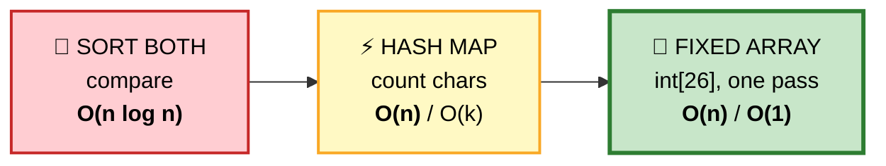

## 💬 The one-pass trick

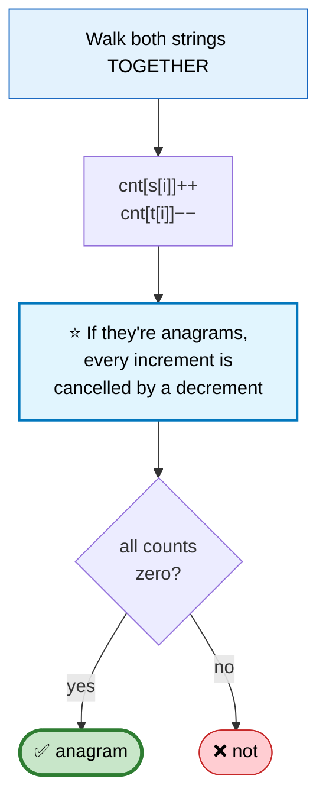

```cpp
bool isAnagram(string s, string t) {
    if (s.size() != t.size()) return false;   // ⭐ cheap early exit

    int cnt[26] = {};
    for (int i = 0; i < (int)s.size(); ++i) {
        cnt[s[i] - 'a']++;                    // ⭐ single pass, both strings
        cnt[t[i] - 'a']--;
    }
    for (int c : cnt) if (c) return false;
    return true;
}
```

🎤 **Follow-up: Unicode?** `int[26]` breaks. Use `unordered_map<char32_t,int>` over code points — and note that "anagram" gets murky with combining characters, so normalize (NFC) first.

## 📌 Pattern Card
```
SIGNAL   "same characters, any order"
KEY      frequency signature · int[26] when alphabet is bounded
RELATED  Group Anagrams · Find All Anagrams in a String
```

---

# 47. Group Anagrams
🟡 ⚪ **Variation of #46** — the *signature* becomes a hash-map key.

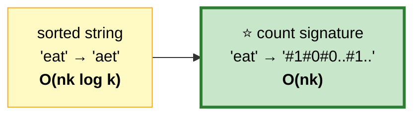

```cpp
vector<vector<string>> groupAnagrams(vector<string>& v) {
    unordered_map<string, vector<string>> g;
    for (auto& s : v) {
        int cnt[26] = {};
        for (char c : s) cnt[c - 'a']++;

        string key;                            // ⭐ build a count-based key
        for (int i = 0; i < 26; ++i) { key += '#'; key += to_string(cnt[i]); }

        g[key].push_back(s);
    }
    vector<vector<string>> out;
    for (auto& [k, grp] : g) out.push_back(move(grp));
    return out;
}
```
⚠️ **The `#` separators matter** — without them `cnt=[1,11,...]` and `cnt=[11,1,...]` produce the same key.

---

# 48. Valid Palindrome

🟢 **Easy** · 🔵 Full ladder · **Two pointers with filtering**

> Ignore non-alphanumerics and case.

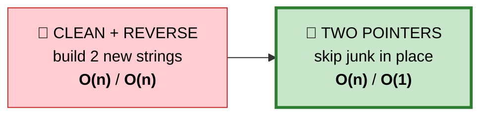

```
   TRACE  "A man, a plan, a canal: Panama"

    A   m a n ,   a   p l a n ...  P a n a m a
    ▲                                        ▲
    l                                        r

   step 1: 'A' vs 'a' → equal (case-folded) ✅ → move both
   step 2: l lands on ' ' → ⭐ SKIP, don't compare
   step 3: 'm' vs 'm' ✅
   ... pointers meet → PALINDROME ✅
```

```cpp
bool isPalindrome(string s) {
    int l = 0, r = s.size() - 1;
    while (l < r) {
        while (l < r && !isalnum((unsigned char)s[l])) ++l;   // ⭐ skip junk
        while (l < r && !isalnum((unsigned char)s[r])) --r;
        if (tolower((unsigned char)s[l]) != tolower((unsigned char)s[r]))
            return false;
        ++l; --r;
    }
    return true;
}
```
⚠️ **The inner `l < r` guards are required** — an all-punctuation string like `",.;"` would otherwise run the pointers past each other.
⚠️ **Cast to `unsigned char`** before `isalnum`/`tolower` — passing a negative `char` is undefined behaviour.

---

# 49. Valid Palindrome II
🟢 ⚪ **Variation of #48** — allow **one** deletion.

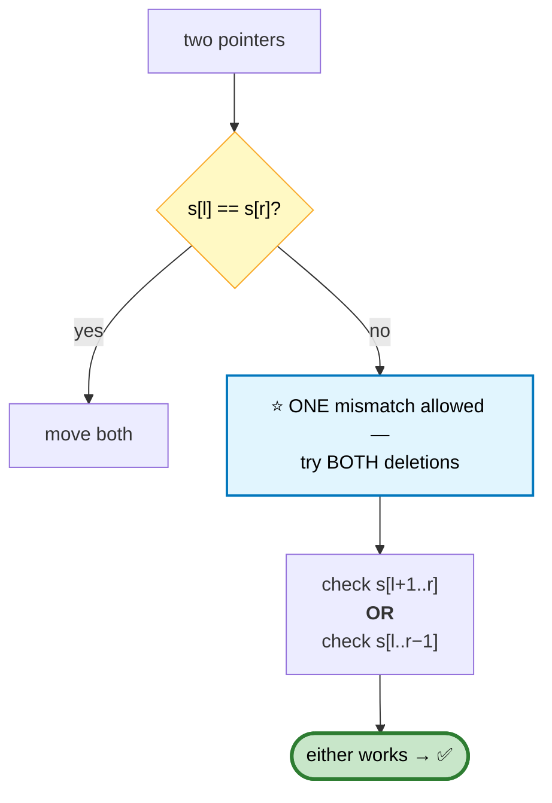

```cpp
bool check(const string& s, int l, int r) {
    while (l < r) if (s[l++] != s[r--]) return false;
    return true;
}
bool validPalindrome(string s) {
    int l = 0, r = s.size() - 1;
    while (l < r) {
        if (s[l] != s[r])
            return check(s, l + 1, r) || check(s, l, r - 1);  // ⭐ branch once
        ++l; --r;
    }
    return true;
}
```
⭐ **Still O(n)** — the branch happens at most once, and each sub-check is a single linear scan.

---

# 50. Longest Palindromic Substring

🟡 **Medium** · 🔵 Full ladder · **Expand around centre → Manacher**

## 🗺️ Approach Ladder

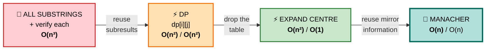

| Approach | Time | Space | Verdict |
|---|---|---|---|
| Brute force | O(n³) | O(1) | ❌ too slow |
| DP table | O(n²) | O(n²) | ⚠️ space-heavy |
| **Expand around centre** | O(n²) | **O(1)** | ✅ **interview answer** |
| Manacher | **O(n)** | O(n) | 🏆 optimal, rarely required |

## 2️⃣ DP — O(n²) space

#### 💬 The recurrence
`s[i..j]` is a palindrome ⟺ `s[i] == s[j]` **and** `s[i+1..j-1]` is a palindrome.

```cpp
// dp[i][j] = is s[i..j] a palindrome?
// ⚠️ Must iterate by INCREASING LENGTH — dp[i][j] depends on the shorter
//    interval dp[i+1][j-1], which must already be computed.
```

## 3️⃣ Expand Around Centre — ⭐ THE ANSWER TO GIVE

#### 💬 The idea
Every palindrome has a centre. There are only **2n−1** possible centres (n characters + n−1 gaps). Try each and grow outward.

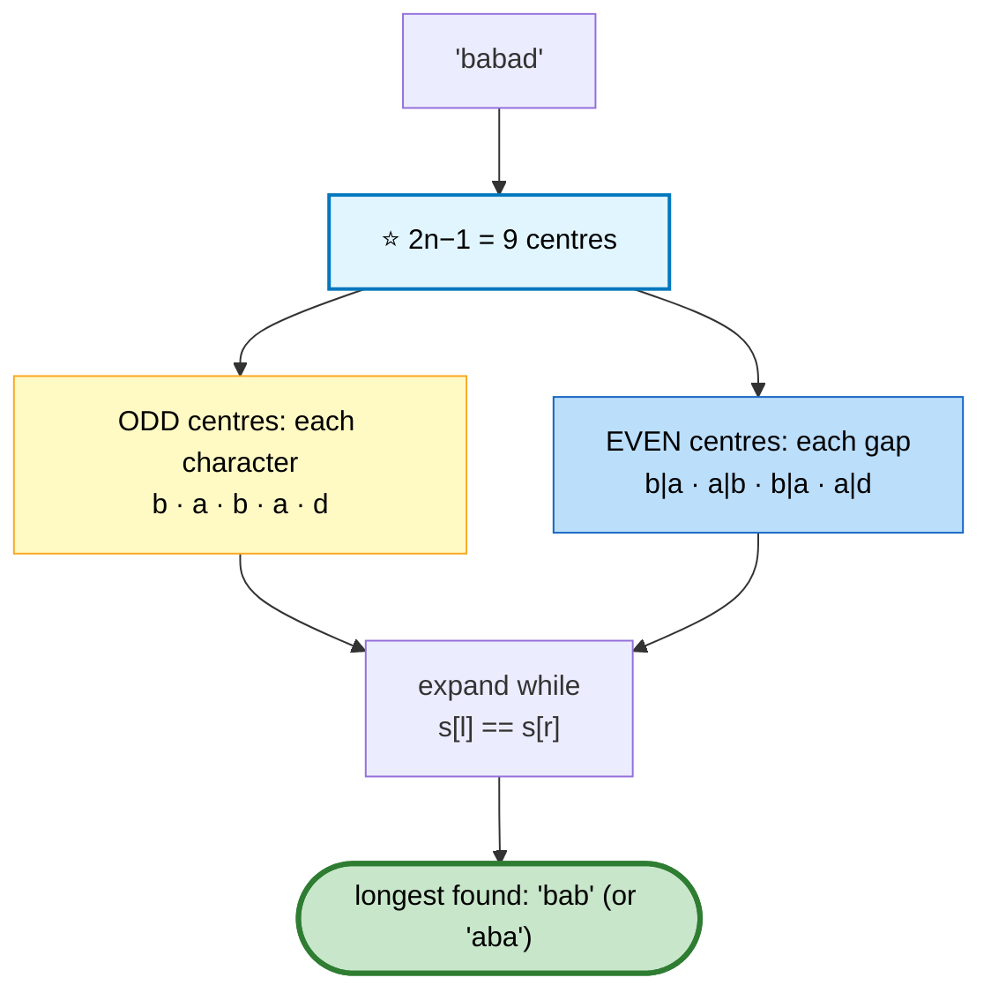

```
   EXPANDING FROM CENTRE i=2 in "babad"

     b  a  b  a  d
           ▲
        l=r=2

   step 1: l=2 r=2  'b'          → length 1
   step 2: l=1 r=3  'a' == 'a' ✅ → "aba", length 3
   step 3: l=0 r=4  'b' vs 'd' ❌ → stop

   ⭐ Best from this centre: "aba"
```

```cpp
string longestPalindrome(string s) {
    if (s.empty()) return "";
    int bestL = 0, bestLen = 1;

    auto expand = [&](int l, int r) {
        while (l >= 0 && r < (int)s.size() && s[l] == s[r]) { --l; ++r; }
        // ⭐ loop exits one step PAST the palindrome
        int len = r - l - 1;
        if (len > bestLen) { bestLen = len; bestL = l + 1; }
    };

    for (int i = 0; i < (int)s.size(); ++i) {
        expand(i, i);          // odd-length centre
        expand(i, i + 1);      // ⭐ even-length centre
    }
    return s.substr(bestL, bestLen);
}
```

⚠️ **Forgetting the even-length centres** is the most common bug — `"cbbd"` would return `"b"` instead of `"bb"`.

## 4️⃣ Manacher — O(n)

#### 💬 The insight
Palindromes are **symmetric**, so if you're inside a known palindrome, the radius at position `i` mirrors the radius at its reflection — you can skip re-checking those characters.

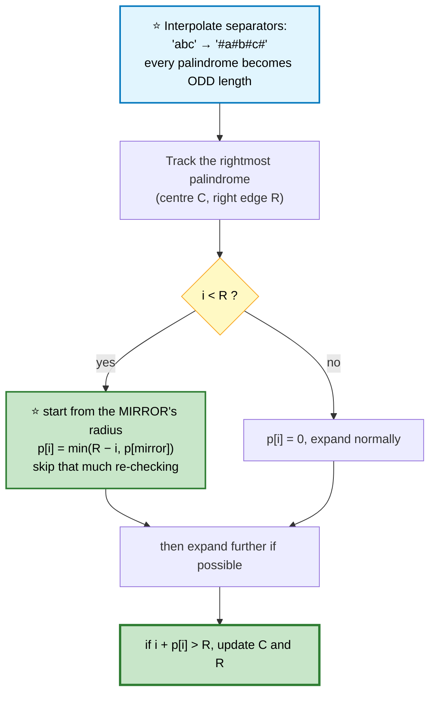

```cpp
string longestPalindromeManacher(string s) {
    if (s.empty()) return "";

    string t = "#";                            // ⭐ interpolation
    for (char c : s) { t += c; t += '#'; }

    int n = t.size(), C = 0, R = 0;
    vector<int> p(n, 0);

    for (int i = 0; i < n; ++i) {
        if (i < R) p[i] = min(R - i, p[2 * C - i]);      // ⭐ mirror reuse

        while (i - p[i] - 1 >= 0 && i + p[i] + 1 < n
               && t[i - p[i] - 1] == t[i + p[i] + 1]) ++p[i];

        if (i + p[i] > R) { C = i; R = i + p[i]; }        // extend the window
    }

    int best = max_element(p.begin(), p.end()) - p.begin();
    // ⭐ p[best] IS the length in the original string
    return s.substr((best - p[best]) / 2, p[best]);
}
```

⭐ **Why the interpolation works:** with `#` between every character, a length-2 palindrome `"bb"` becomes `"#b#b#"` — length 5, odd. Every case collapses into one.

## 📌 Pattern Card
```
SIGNAL   longest/count palindromic substrings
KEY      2n−1 centres, expand outward · Manacher reuses mirrors
RELATED  Palindromic Substrings · Palindrome Partitioning · Shortest Palindrome
```

---

# 51. Palindromic Substrings
🟡 ⚪ **Variation of #50** — count instead of tracking the max.

```cpp
int countSubstrings(string s) {
    int total = 0;
    auto expand = [&](int l, int r) {
        while (l >= 0 && r < (int)s.size() && s[l] == s[r]) {
            ++total;                           // ⭐ every expansion IS a palindrome
            --l; ++r;
        }
    };
    for (int i = 0; i < (int)s.size(); ++i) { expand(i, i); expand(i, i + 1); }
    return total;
}
```
⭐ **Each successful expansion step counts as one palindrome** — no separate bookkeeping needed.

---

# 52. Longest Common Prefix

🟢 **Easy** · 🔵 Full ladder · **Vertical scanning**

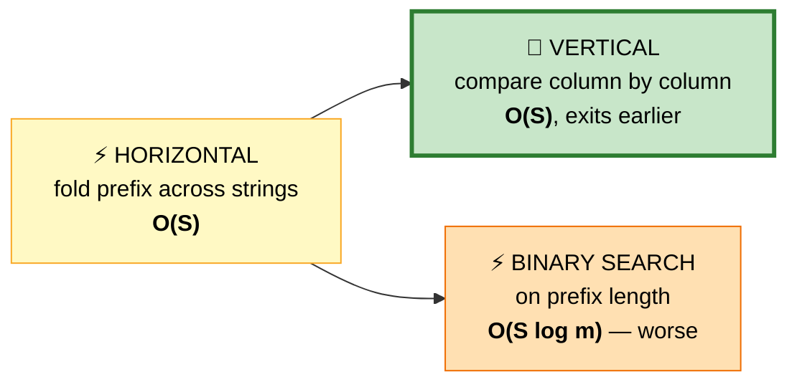

```
   VERTICAL SCAN

     f l o w e r
     f l o w
     f l i g h t
     ▲ ▲ ▲
     ✅✅❌ ← column 2: 'o','o','i' mismatch → stop

   ⭐ ANSWER: "fl"
```

```cpp
string longestCommonPrefix(vector<string>& v) {
    if (v.empty()) return "";
    for (int col = 0; col < (int)v[0].size(); ++col) {
        char c = v[0][col];
        for (int i = 1; i < (int)v.size(); ++i)
            if (col >= (int)v[i].size() || v[i][col] != c)
                return v[0].substr(0, col);    // ⭐ mismatch OR string ended
    }
    return v[0];                               // v[0] is entirely a prefix
}
```
⭐ **Vertical exits as soon as any column disagrees** — best case O(m·n) where m is the answer length, not the total input size.

---

# 53. String to Integer (atoi)

🟡 **Medium** · 🔵 Full ladder · **Overflow without 64-bit**

> Parse: skip whitespace → optional sign → digits → clamp to int32 range.

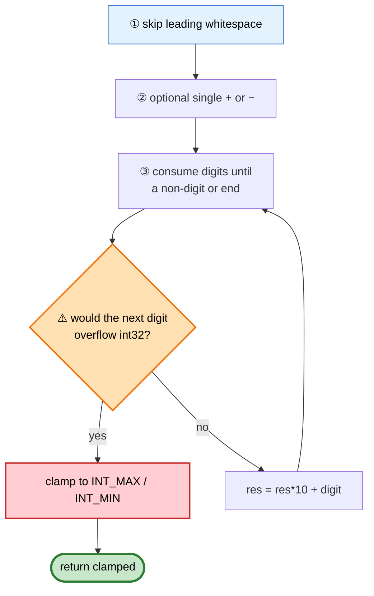

```
   ⭐⭐ DETECTING OVERFLOW *BEFORE* IT HAPPENS

   Signed overflow in C++ is UNDEFINED BEHAVIOUR — you cannot
   compute the value and then check whether it wrapped.

   Check first:
     res will overflow if
        res >  INT_MAX/10                     (any digit overflows)
     or res == INT_MAX/10 && digit > 7        (INT_MAX = 2147483647)

   ⭐ Building the number as NEGATIVE is also common, because
     the negative range is one larger — it avoids a special
     case for INT_MIN.
```

```cpp
int myAtoi(string s) {
    int i = 0, n = s.size();

    while (i < n && s[i] == ' ') ++i;                     // ① whitespace

    int sign = 1;
    if (i < n && (s[i] == '+' || s[i] == '-'))            // ② sign
        sign = (s[i++] == '-') ? -1 : 1;

    int res = 0;
    while (i < n && isdigit((unsigned char)s[i])) {       // ③ digits
        int d = s[i++] - '0';

        // ⭐ check BEFORE multiplying — no UB
        if (res > INT_MAX / 10 || (res == INT_MAX / 10 && d > 7))
            return sign == 1 ? INT_MAX : INT_MIN;

        res = res * 10 + d;
    }
    return res * sign;
}
```

⚠️ **Edge cases that trip people:** `"+-12"` → 0 (only one sign allowed) · `"   "` → 0 · `"words 42"` → 0 (no leading digits) · `"-91283472332"` → INT_MIN · `"3.14"` → 3 (stops at `.`).

---

# 54. Add Strings / Multiply Strings

🟡 **Medium** · 🔵 Full ladder · **Grade-school arithmetic**

> Numbers too large for any primitive type. No built-in bignum.

## Add Strings

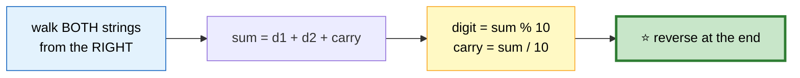

```cpp
string addStrings(string a, string b) {
    int i = a.size() - 1, j = b.size() - 1, carry = 0;
    string out;

    while (i >= 0 || j >= 0 || carry) {        // ⭐ carry keeps the loop alive
        int s = carry;
        if (i >= 0) s += a[i--] - '0';
        if (j >= 0) s += b[j--] - '0';
        out += char('0' + s % 10);
        carry = s / 10;
    }
    reverse(out.begin(), out.end());
    return out;
}
```

## Multiply Strings

```
   ⭐⭐ THE POSITION RULE

     a[i] × b[j] contributes to result positions i+j and i+j+1

           1  2  3        i: 0 1 2
         ×    4  5        j:   0 1
         ─────────
   result has at most len(a) + len(b) digits

   VISUAL for a="123", b="45":

        i=2,j=1: 3×5=15 → pos 3 (ones), carry to pos 2
        i=2,j=0: 3×4=12 → pos 2 (tens), carry to pos 1
        i=1,j=1: 2×5=10 → pos 2, carry to pos 1
        ...
   ⭐ Accumulate everything first, then normalize carries.
```

```cpp
string multiply(string a, string b) {
    if (a == "0" || b == "0") return "0";      // ⚠️ else you get "0000"

    int m = a.size(), n = b.size();
    vector<int> res(m + n, 0);                 // ⭐ max possible width

    for (int i = m - 1; i >= 0; --i)
        for (int j = n - 1; j >= 0; --j) {
            int prod = (a[i] - '0') * (b[j] - '0');
            int lo = i + j + 1, hi = i + j;

            int sum = prod + res[lo];          // ⭐ add into the ones position
            res[lo] = sum % 10;
            res[hi] += sum / 10;               // carry — may exceed 9 temporarily
        }

    string out;
    for (int d : res) if (!(out.empty() && d == 0)) out += char('0' + d);
    return out.empty() ? "0" : out;            // ⭐ strip leading zeros
}
```

⭐ **`res[hi] += sum / 10` can leave `res[hi] > 9` temporarily** — that's fine, because when the loop later reaches position `hi` as a `lo`, the `% 10` and `/ 10` normalize it.

---

# 55. Valid Number

🔴 **Hard** · 🔵 Full ladder · **State machine**

> Is the string a valid decimal? `"0"`, `"-.5e-3"`, `"+6e-1"` ✅ · `"e"`, `"."`, `"1e"`, `"99e2.5"` ❌

## 💬 Why a state machine, not a pile of ifs

Ad-hoc flag checks get unmanageable fast. A state machine makes every rule explicit and provably complete.

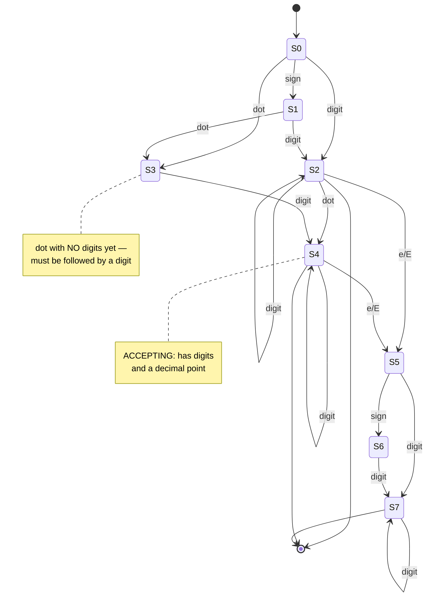

**Accepting states: S2** (integer), **S4** (decimal), **S7** (exponent complete).

```cpp
bool isNumber(string s) {
    bool seenDigit = false, seenDot = false, seenExp = false;

    for (int i = 0; i < (int)s.size(); ++i) {
        char c = s[i];

        if (isdigit((unsigned char)c)) {
            seenDigit = true;
        } else if (c == '+' || c == '-') {
            // ⭐ a sign is only legal at the very start, or right after e/E
            if (i > 0 && s[i-1] != 'e' && s[i-1] != 'E') return false;
        } else if (c == '.') {
            if (seenDot || seenExp) return false;   // ⚠️ no dot after e
            seenDot = true;
        } else if (c == 'e' || c == 'E') {
            if (seenExp || !seenDigit) return false; // ⚠️ need digits before e
            seenExp = true;
            seenDigit = false;                       // ⭐⭐ RESET — the exponent
        } else {                                     //    needs its OWN digits
            return false;
        }
    }
    return seenDigit;                                // ⭐ must end with a digit
}
```

```
   ⭐⭐ THE `seenDigit = false` RESET IS THE KEY LINE

   It enforces "the exponent must have at least one digit"
   using the SAME final check. Without it, "1e" passes.
```

---

# 56. Implement strStr (Needle Search)

🟡 **Medium** · 🔵 Full ladder · **KMP**

## 🗺️ Approach Ladder

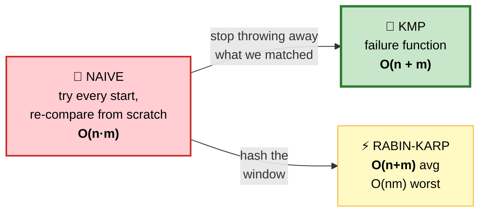

## 💬 What naive search wastes

```
   text:   A A A A A B
   pat:    A A A B

   NAIVE at start 0: matches AAA, fails on the 4th → restart at 1
   ⭐ But we ALREADY KNOW positions 1,2,3 are 'A' — we just read them.
     Restarting rereads them. That's the waste.
```

## 💬 The failure function (LPS array)

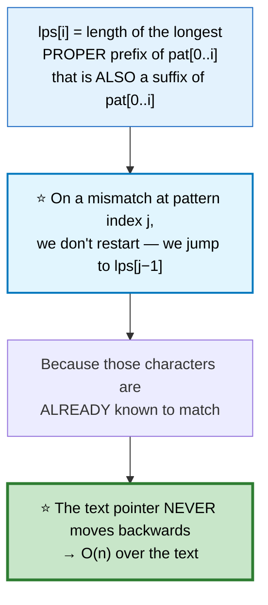

```
   LPS FOR "ABABC"

   ┌───┬───────┬────────────────────────────────┬─────┐
   │ i │ pat[i]│ prefix that's also a suffix    │ lps │
   ├───┼───────┼────────────────────────────────┼─────┤
   │ 0 │  A    │ (proper prefixes only) none    │  0  │
   │ 1 │  B    │ "AB" — none                    │  0  │
   │ 2 │  A    │ "ABA" — ⭐ "A"                  │  1  │
   │ 3 │  B    │ "ABAB" — ⭐ "AB"                │  2  │
   │ 4 │  C    │ "ABABC" — none                 │  0  │
   └───┴───────┴────────────────────────────────┴─────┘

   ⭐ Mismatch at j=4 → jump to lps[3]=2, meaning "AB" is
     already matched. Resume comparing at pattern index 2.
```

```cpp
vector<int> buildLPS(const string& p) {
    int m = p.size();
    vector<int> lps(m, 0);
    int len = 0;                                // length of the current border

    for (int i = 1; i < m; ) {
        if (p[i] == p[len]) {
            lps[i++] = ++len;
        } else if (len) {
            len = lps[len - 1];                 // ⭐ fall back, don't reset to 0
        } else {
            lps[i++] = 0;
        }
    }
    return lps;
}

int strStr(string t, string p) {
    if (p.empty()) return 0;
    vector<int> lps = buildLPS(p);

    for (int i = 0, j = 0; i < (int)t.size(); ) {
        if (t[i] == p[j]) {
            ++i; ++j;
            if (j == (int)p.size()) return i - j;   // ⭐ full match
        } else if (j) {
            j = lps[j - 1];                     // ⭐ i does NOT move back
        } else {
            ++i;
        }
    }
    return -1;
}
```

## 📌 Pattern Card
```
SIGNAL   substring search · periodicity · prefix==suffix
KEY      LPS array: never re-read the text
RELATED  Repeated Substring Pattern · Shortest Palindrome · Z-algorithm
```

---

# 57. Repeated Substring Pattern
🟢 ⚪ **Variation of #56** — the LPS array reveals periodicity for free.

```
   ⭐⭐ THE PERIODICITY THEOREM

   Let n = length, k = lps[n−1] (longest proper border).
   The string is built from a repeated block
     ⟺  n % (n − k) == 0  AND  k > 0

   The period is (n − k).

   "abcabcabc": n=9, lps[8]=6 → period = 3, 9 % 3 == 0 ✅
   "aba":       n=3, lps[2]=1 → period = 2, 3 % 2 ≠ 0  ❌
```

```cpp
bool repeatedSubstringPattern(string s) {
    int n = s.size();
    vector<int> lps = buildLPS(s);
    int k = lps[n - 1];
    return k > 0 && n % (n - k) == 0;
}
```

⭐ **A cute alternative:** `(s+s).find(s, 1) != n`. Doubling the string and searching for the original past index 0 finds it early exactly when the string is periodic.

---

# 58. Shortest Palindrome
🔴 ⚪ **Variation of #56** — a clever KMP application.

> Add the fewest characters **to the front** to make `s` a palindrome.

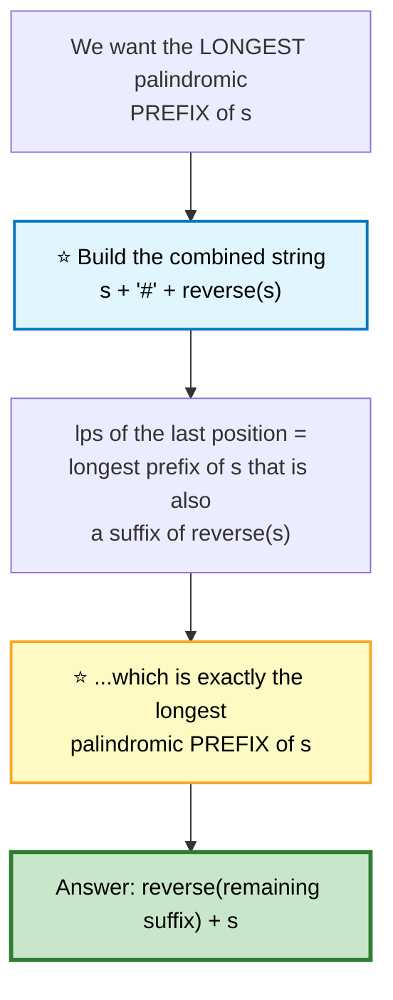

```cpp
string shortestPalindrome(string s) {
    if (s.empty()) return "";
    string r(s.rbegin(), s.rend());
    string comb = s + '#' + r;                 // ⚠️ '#' prevents overlap across
                                               //    the boundary
    vector<int> lps = buildLPS(comb);
    int longestPalPrefix = lps.back();

    return r.substr(0, s.size() - longestPalPrefix) + s;
}
```
⚠️ **The `#` separator is mandatory.** Without it, `"aaa"` would let the match run past the join and report a bogus length.

---

# 59. Longest Substring Without Repeating Characters

🟡 **Medium** · 🔵 Full ladder · **Sliding window**

## 🗺️ Approach Ladder

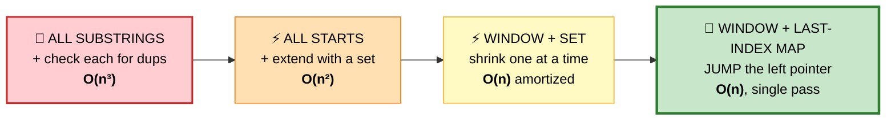

## 4️⃣ Window + Last-Index Map — ⭐ OPTIMAL

#### 💬 The idea
Store *where* each character was last seen. On a repeat, jump `left` straight past that position instead of stepping one at a time.

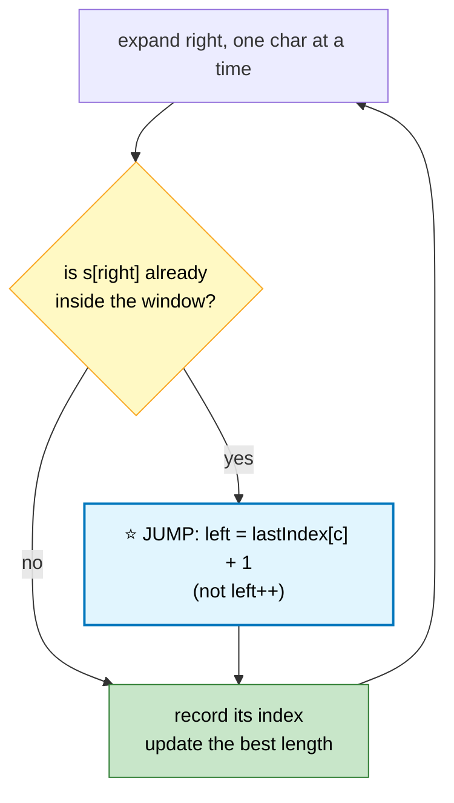

```
   TRACE  "abcabcbb"

   ┌───────┬──────┬──────┬────────┬───────────────────────┐
   │ right │ char │ left │ window │ note                  │
   ├───────┼──────┼──────┼────────┼───────────────────────┤
   │   0   │  a   │  0   │  "a"   │ len 1                 │
   │   1   │  b   │  0   │  "ab"  │ len 2                 │
   │   2   │  c   │  0   │ "abc"  │ ⭐ len 3 — BEST       │
   │   3   │  a   │  1   │ "bca"  │ 'a' seen at 0 → jump  │
   │   4   │  b   │  2   │ "cab"  │ 'b' seen at 1 → jump  │
   │   5   │  c   │  3   │ "abc"  │ 'c' seen at 2 → jump  │
   │   6   │  b   │  5   │  "cb"  │ 'b' seen at 4 → jump  │
   │   7   │  b   │  7   │  "b"   │ 'b' seen at 6 → jump  │
   └───────┴──────┴──────┴────────┴───────────────────────┘
   ⭐ ANSWER: 3
```

```cpp
int lengthOfLongestSubstring(string s) {
    vector<int> last(128, -1);                 // ⭐ ASCII → last seen index
    int left = 0, best = 0;

    for (int right = 0; right < (int)s.size(); ++right) {
        char c = s[right];
        // ⭐ max() is CRITICAL — never let left move backwards
        if (last[c] >= left) left = last[c] + 1;

        last[c] = right;
        best = max(best, right - left + 1);
    }
    return best;
}
```

⚠️ **The `last[c] >= left` guard** (equivalently `left = max(left, last[c]+1)`) prevents a stale index *outside* the window from dragging `left` backwards. On `"abba"` without it, you get a wrong answer.

## 📌 Pattern Card
```
SIGNAL   longest/shortest window satisfying a constraint
KEY      expand right, shrink/jump left, track the best
RELATED  Longest Repeating Char Replacement · Min Window Substring
         Fruit Into Baskets · Longest Substring with K Distinct
```

---

# 60. Longest Repeating Character Replacement
🟡 ⚪ **Variation of #59** — the window is valid while `windowLen − maxCount ≤ k`.

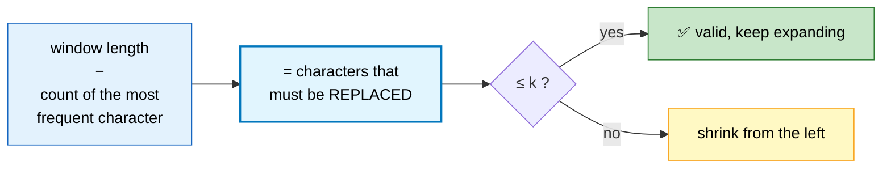

```cpp
int characterReplacement(string s, int k) {
    int cnt[26] = {}, left = 0, maxCount = 0, best = 0;

    for (int right = 0; right < (int)s.size(); ++right) {
        maxCount = max(maxCount, ++cnt[s[right] - 'A']);

        // ⭐ maxCount is never decreased — see the note below
        while (right - left + 1 - maxCount > k)
            --cnt[s[left++] - 'A'];

        best = max(best, right - left + 1);
    }
    return best;
}
```

```
   ⭐⭐ WHY NOT DECREASING maxCount IS CORRECT (AND SUBTLE)

   maxCount can become STALE — larger than the true max in the
   current window. That looks like a bug, but:

   The window only ever GROWS when a genuinely larger maxCount
   appears. A stale maxCount can't produce a longer answer,
   because `best` is only updated with the actual window size,
   and the window can't grow past what a real maxCount permits.

   ⭐ The window never shrinks below the best length found so far.
     That's the invariant that makes it work.
```

---

# 61. Minimum Window Substring
🔴 ⚪ **Variation of #59** — expand to become valid, then shrink while still valid.

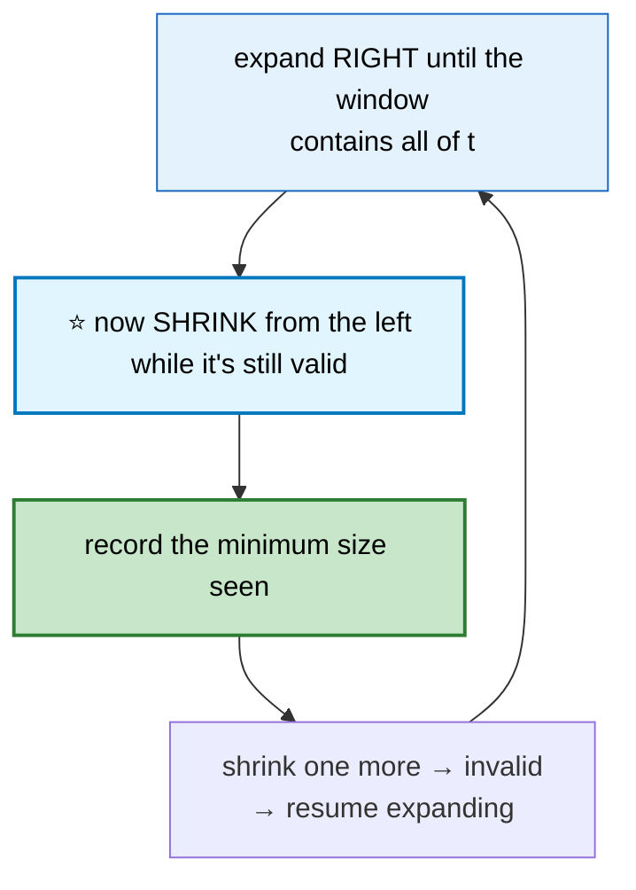

```cpp
string minWindow(string s, string t) {
    if (t.empty() || s.size() < t.size()) return "";

    vector<int> need(128, 0);
    for (char c : t) need[c]++;

    int missing = t.size(), left = 0, bestL = 0, bestLen = INT_MAX;

    for (int right = 0; right < (int)s.size(); ++right) {
        if (need[s[right]]-- > 0) --missing;    // ⭐ >0 means it was actually wanted

        while (missing == 0) {                  // window is valid → shrink
            if (right - left + 1 < bestLen) { bestLen = right - left + 1; bestL = left; }
            if (++need[s[left++]] > 0) ++missing;  // ⭐ we just broke validity
        }
    }
    return bestLen == INT_MAX ? "" : s.substr(bestL, bestLen);
}
```
⭐ **A single `missing` counter replaces comparing two maps** — it's the difference between O(n) and O(n·k).

---

# 62. String Compression
🟡 ⚪ **Variation of the slow/fast pattern** ([#31](01b-arrays-strings.md#31-remove-duplicates-from-sorted-array)) — in place, `O(1)` extra space.

```
   ["a","a","b","b","c","c","c"]  →  ["a","2","b","2","c","3"], return 6

   ⚠️ A run of 12 writes TWO characters: '1' then '2'
   ⚠️ A run of length 1 writes NO count at all
```

```cpp
int compress(vector<char>& c) {
    int write = 0, read = 0, n = c.size();

    while (read < n) {
        char ch = c[read];
        int run = 0;
        while (read < n && c[read] == ch) { ++read; ++run; }

        c[write++] = ch;
        if (run > 1)                            // ⭐ length 1 gets no digits
            for (char d : to_string(run)) c[write++] = d;   // ⭐ multi-digit
    }
    return write;
}
```
⭐ **`write` never overtakes `read`** — the compressed form is never longer than the original for runs ≥ 1, so in-place is safe.

---

# 63. Encode and Decode Strings

🟡 **Medium** · 🔵 Full ladder · **Framing / delimiter injection**

> Encode a list of strings into one string; decode it back. Strings may contain **any** character.

## ⚠️ Why delimiters don't work

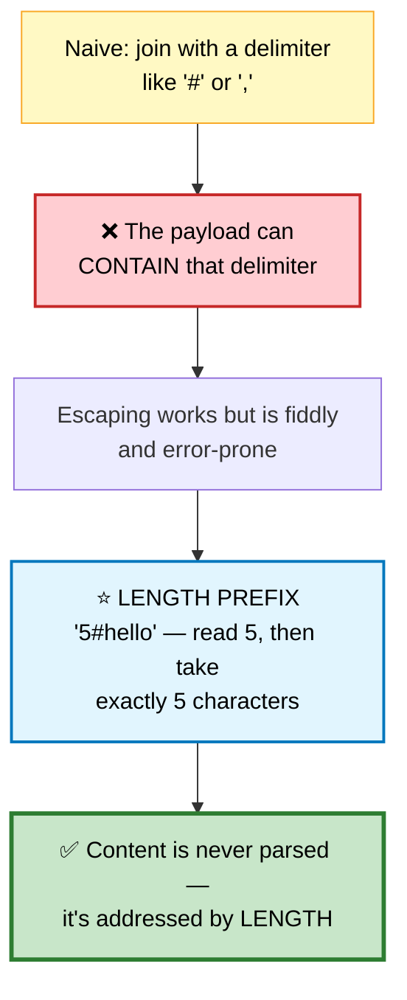

```
   ENCODING  ["hi", "a#b", ""]
   →  "2#hi3#a#b0#"

   DECODING
     read digits until '#'      → 2   → take 2 chars → "hi"
     read digits until '#'      → 3   → take 3 chars → "a#b"  ⭐ '#' inside is fine
     read digits until '#'      → 0   → take 0 chars → ""
```

```cpp
string encode(vector<string>& v) {
    string out;
    for (auto& s : v) out += to_string(s.size()) + "#" + s;
    return out;
}

vector<string> decode(string s) {
    vector<string> out;
    int i = 0;
    while (i < (int)s.size()) {
        int j = s.find('#', i);                 // ⭐ the FIRST # is the separator
        int len = stoi(s.substr(i, j - i));
        out.push_back(s.substr(j + 1, len));    // ⭐ take exactly len characters
        i = j + 1 + len;
    }
    return out;
}
```

⭐ **This is exactly how real protocols work** — HTTP `Content-Length`, Redis RESP, and Protocol Buffers all use length-prefix framing for the same reason: it makes the payload opaque to the parser.

---

# 64. Reverse Words in a String
🟡 ⚪ **Variation of Rotate Array** ([#34](01b-arrays-strings.md#34-rotate-array)) — the same triple-reverse idea.

```mermaid
flowchart TD
    A["'  the sky  is blue '"] --> B["① trim + collapse<br/>internal spaces"]
    B --> C["② REVERSE the whole string<br/>'eulb si yks eht'"]
    C --> D["③ REVERSE each WORD<br/>'blue is sky the'"]
    D --> E(["✅"])

    style A fill:#e3f2fd,stroke:#1565c0,color:#000
    style C fill:#fff9c4,stroke:#f9a825,color:#000
    style D fill:#e1f5fe,stroke:#0277bd,color:#000
    style E fill:#c8e6c9,stroke:#2e7d32,stroke-width:3px,color:#000
```

```cpp
string reverseWords(string s) {
    // ① compact in place: single spaces, no leading/trailing
    int write = 0, n = s.size();
    for (int i = 0; i < n; ) {
        while (i < n && s[i] == ' ') ++i;
        if (i == n) break;
        if (write) s[write++] = ' ';            // ⭐ separator before all but the first
        int start = write;
        while (i < n && s[i] != ' ') s[write++] = s[i++];
        reverse(s.begin() + start, s.begin() + write);   // ③ reverse this word
    }
    s.resize(write);
    reverse(s.begin(), s.end());                // ② reverse everything
    return s;
}
```
⭐ **Reversing each word during the compaction pass** means only one extra full reverse is needed at the end.

---

# 65. Basic Calculator II

🟡 **Medium** · 🔵 Full ladder · **Precedence without recursion**

> Evaluate `"3+2*2"` = 7. Integers, `+ - * /`, spaces. Integer division truncates toward zero.

## 🗺️ Approach Ladder

```mermaid
flowchart LR
    A["⚡ TWO PASSES<br/>resolve × ÷ first,<br/>then + −<br/><b>O(n)</b> / O(n)"] --> B["⚡ STACK<br/>push terms, sum at the end<br/><b>O(n)</b> / <b>O(n)</b>"]
    B --> C["🚀 RUNNING 'LAST'<br/>no stack at all<br/><b>O(n)</b> / <b>O(1)</b>"]

    style A fill:#ffcdd2,stroke:#c62828,color:#000
    style B fill:#fff9c4,stroke:#f9a825,stroke-width:2px,color:#000
    style C fill:#c8e6c9,stroke:#2e7d32,stroke-width:3px,color:#000
```

## 💬 The core idea: defer, don't evaluate

```mermaid
flowchart TD
    A["⭐ Never commit a number<br/>to the result immediately"] --> B["Hold it in `last`, because a<br/>× or ÷ might still claim it"]
    B --> C{"the operator BEFORE<br/>this number was..."}
    C -->|"+"| D["last = +num"]
    C -->|"−"| E["last = −num"]
    C -->|"×"| F["⭐ last = last * num<br/>(retroactively modify)"]
    C -->|"÷"| G["⭐ last = last / num"]
    D --> H["result += last<br/>only when the NEXT<br/>operator arrives"]
    E --> H
    F --> H
    G --> H

    style A fill:#e1f5fe,stroke:#0277bd,stroke-width:2px,color:#000
    style F fill:#c8e6c9,stroke:#2e7d32,color:#000
    style G fill:#c8e6c9,stroke:#2e7d32,color:#000
    style H fill:#c8e6c9,stroke:#2e7d32,stroke-width:2px,color:#000
```

```
   TRACE  "3+2*2"

   ┌───────┬─────┬──────┬────────┬──────────────────────────┐
   │ token │ op  │ last │ result │ note                     │
   ├───────┼─────┼──────┼────────┼──────────────────────────┤
   │   3   │  +  │  +3  │   0    │ hold 3, don't commit     │
   │   +   │     │      │   3    │ commit last → result=3   │
   │   2   │  +  │  +2  │   3    │ hold 2                   │
   │   *   │     │      │   3    │ ⭐ do NOT commit yet     │
   │   2   │  *  │  4   │   3    │ ⭐ last = 2*2 = 4        │
   │  end  │     │      │   7    │ commit → 3+4 = 7 ✅      │
   └───────┴─────┴──────┴────────┴──────────────────────────┘
```

```cpp
int calculate(string s) {
    int result = 0, last = 0, num = 0;
    char op = '+';

    for (int i = 0; i <= (int)s.size(); ++i) {
        char c = (i < (int)s.size()) ? s[i] : '+';   // ⭐ sentinel flushes the tail

        if (isdigit((unsigned char)c)) { num = num * 10 + (c - '0'); continue; }
        if (c == ' ') continue;

        switch (op) {
            case '+': result += last; last =  num; break;
            case '-': result += last; last = -num; break;
            case '*': last *= num;                 break;   // ⭐ retroactive
            case '/': last /= num;                 break;   // ⭐ retroactive
        }
        op = c;
        num = 0;
    }
    return result + last;                        // ⭐ commit the final term
}
```

⭐ **The sentinel `'+'` at index `s.size()`** removes the need for duplicated post-loop flush logic.

🎤 **Follow-up: parentheses (Basic Calculator I/III)?** Push `(result, sign)` onto a stack when you see `(`, and restore on `)`. Or recurse on the sub-expression.

---

# 66. Decode String
🟡 ⚪ **Variation of #65** — two stacks instead of a running value, because the nesting is arbitrary.

> `"3[a2[c]]"` → `"accaccacc"`

```mermaid
flowchart TD
    A["scan left to right"] --> B{"character type"}
    B -->|"digit"| C["accumulate the multiplier"]
    B -->|"'['"| D["⭐ PUSH the current string<br/>and the count<br/>then reset both"]
    B -->|"letter"| E["append to the current string"]
    B -->|"']'"| F["⭐ POP: cur = prev + cur × count"]

    style B fill:#fff9c4,stroke:#f9a825,color:#000
    style D fill:#e1f5fe,stroke:#0277bd,stroke-width:2px,color:#000
    style F fill:#c8e6c9,stroke:#2e7d32,stroke-width:2px,color:#000
```

```cpp
string decodeString(string s) {
    stack<int> counts;
    stack<string> prevs;
    string cur;
    int num = 0;

    for (char c : s) {
        if (isdigit((unsigned char)c)) {
            num = num * 10 + (c - '0');         // ⚠️ multi-digit: "12[a]"
        } else if (c == '[') {
            counts.push(num); prevs.push(cur);  // ⭐ save the outer context
            num = 0; cur.clear();
        } else if (c == ']') {
            string repeated;
            for (int i = 0; i < counts.top(); ++i) repeated += cur;
            counts.pop();
            cur = prevs.top() + repeated;       // ⭐ restore and append
            prevs.pop();
        } else {
            cur += c;
        }
    }
    return cur;
}
```

---

# 67. Valid Parentheses

🟢 **Easy** · 🔵 Full ladder · **Stack matching**

```mermaid
flowchart TD
    A["scan each character"] --> B{"open or close?"}
    B -->|"open"| C["⭐ push the EXPECTED closer<br/>not the opener itself"]
    B -->|"close"| D{"stack empty OR<br/>top ≠ this char?"}
    D -->|"yes"| E(["❌ invalid"])
    D -->|"no"| F["pop, continue"]
    C --> A
    F --> A
    A --> G{"end reached"}
    G --> H{"stack empty?"}
    H -->|"yes"| I(["✅ valid"])
    H -->|"no"| J(["❌ unclosed brackets"])

    style C fill:#e1f5fe,stroke:#0277bd,stroke-width:2px,color:#000
    style E fill:#ffcdd2,stroke:#c62828,color:#000
    style I fill:#c8e6c9,stroke:#2e7d32,stroke-width:3px,color:#000
    style J fill:#ffcdd2,stroke:#c62828,color:#000
```

```cpp
bool isValid(string s) {
    stack<char> st;
    for (char c : s) {
        // ⭐ push the EXPECTED closer — the comparison becomes a single ==
        if      (c == '(') st.push(')');
        else if (c == '[') st.push(']');
        else if (c == '{') st.push('}');
        else {
            if (st.empty() || st.top() != c) return false;
            st.pop();
        }
    }
    return st.empty();                          // ⚠️ "(((" must fail here
}
```
⭐ **Pushing the expected closer** avoids a lookup map and turns the check into one equality comparison.

---

# 68. Longest Valid Parentheses

🔴 **Hard** · 🔵 Full ladder · **Three genuinely different optimal solutions**

> Length of the longest well-formed substring. `")()())"` → 4.

## 🗺️ Approach Ladder

```mermaid
flowchart LR
    A["🐌 ALL SUBSTRINGS<br/>+ validate each<br/><b>O(n³)</b>"] --> B["⚡ DP<br/>dp[i] = longest ending at i<br/><b>O(n)</b> / <b>O(n)</b>"]
    B --> C["⚡ STACK OF INDICES<br/><b>O(n)</b> / <b>O(n)</b><br/>most intuitive"]
    C --> D["🚀 TWO-PASS COUNTERS<br/><b>O(n)</b> / <b>O(1)</b>"]

    style A fill:#ffcdd2,stroke:#c62828,stroke-width:2px,color:#000
    style B fill:#fff9c4,stroke:#f9a825,color:#000
    style C fill:#c8e6c9,stroke:#2e7d32,stroke-width:2px,color:#000
    style D fill:#b2dfdb,stroke:#00695c,stroke-width:3px,color:#000
```

## 3️⃣ Stack of Indices — most intuitive

#### 💬 The idea
Keep a **base index** at the bottom of the stack: the position just before the current valid run. Length is then simply `i − stack.top()`.

```
   TRACE  ")()())"

   ┌───┬─────┬──────────────┬─────────────────────────────┐
   │ i │ ch  │ stack        │ action                      │
   ├───┼─────┼──────────────┼─────────────────────────────┤
   │ — │  —  │ [−1]         │ ⭐ base sentinel            │
   │ 0 │  )  │ [0]          │ pop −1 → empty → push 0     │
   │   │     │              │ ⭐ 0 is the NEW base        │
   │ 1 │  (  │ [0,1]        │ push index                  │
   │ 2 │  )  │ [0]          │ pop → len = 2−0 = 2         │
   │ 3 │  (  │ [0,3]        │ push                        │
   │ 4 │  )  │ [0]          │ pop → len = 4−0 = ⭐ 4      │
   │ 5 │  )  │ [5]          │ pop → empty → new base 5    │
   └───┴─────┴──────────────┴─────────────────────────────┘
   ANSWER: 4 ✅
```

```cpp
int longestValidParentheses(string s) {
    stack<int> st;
    st.push(-1);                                // ⭐ base sentinel
    int best = 0;

    for (int i = 0; i < (int)s.size(); ++i) {
        if (s[i] == '(') {
            st.push(i);
        } else {
            st.pop();
            if (st.empty()) st.push(i);         // ⭐ unmatched ')' → new base
            else best = max(best, i - st.top());
        }
    }
    return best;
}
```

## 4️⃣ Two-Pass Counters — ⭐ O(1) space

#### 💬 The trick
Count opens and closes left-to-right. When they're equal, that's a valid stretch. When closes exceed opens, reset. Then do the same right-to-left to catch the cases the first pass misses.

```mermaid
flowchart TD
    A["LEFT → RIGHT"] --> B["open == close → valid, record 2×close"]
    A --> C["close &gt; open → reset both to 0"]
    C --> D["⚠️ MISSES cases like '((()'<br/>where open never catches up"]
    D --> E["RIGHT → LEFT pass<br/>with the roles swapped"]
    E --> F["⭐ Together the two passes<br/>cover every case"]

    style A fill:#e3f2fd,stroke:#1565c0,color:#000
    style D fill:#ffe0b2,stroke:#ef6c00,stroke-width:2px,color:#000
    style E fill:#bbdefb,stroke:#1565c0,color:#000
    style F fill:#c8e6c9,stroke:#2e7d32,stroke-width:3px,color:#000
```

```cpp
int longestValidParentheses(string s) {
    int best = 0, open = 0, close = 0;

    for (char c : s) {                          // ← left to right
        c == '(' ? ++open : ++close;
        if (open == close)   best = max(best, 2 * close);
        else if (close > open) open = close = 0;   // ⭐ unrecoverable → reset
    }

    open = close = 0;
    for (int i = s.size() - 1; i >= 0; --i) {   // → right to left
        s[i] == '(' ? ++open : ++close;
        if (open == close)  best = max(best, 2 * open);
        else if (open > close) open = close = 0;   // ⭐ mirrored condition
    }
    return best;
}
```

```
   ⭐ WHY BOTH PASSES ARE NEEDED

   "(()"   left pass:  open ends at 2, close at 1 — never equal
                       after the valid "()" → catches 2 ✅
   "()("   left pass:  catches 2 ✅
   "((()"  left pass:  open always > close, NEVER equal → 0 ❌
           right pass: from the right, close accumulates first
                       → catches 2 ✅
```

## 📌 Pattern Card
```
SIGNAL   longest balanced/valid substring
KEY      stack holds INDICES with a base sentinel −1
         two-pass counters give O(1) space
RELATED  Valid Parentheses · Remove Invalid Parentheses · Min Add to Make Valid
```

---

# 69. Text Justification

🔴 **Hard** · 🔵 Full ladder · **Greedy packing + careful space distribution**

> Pack words into lines of exactly `maxWidth`, fully justified. Last line is **left**-justified.

```mermaid
flowchart TD
    A["① GREEDY: fit as many words<br/>as possible on this line"] --> B{"is this the LAST line,<br/>or a single word?"}
    B -->|"yes"| C["⭐ LEFT-justify:<br/>single spaces, pad the right"]
    B -->|"no"| D["② distribute spaces"]
    D --> E["gaps = wordCount − 1<br/>totalSpaces = maxWidth − letterCount"]
    E --> F["⭐ base = totalSpaces / gaps<br/>extra = totalSpaces % gaps"]
    F --> G["⭐ the LEFTMOST `extra` gaps<br/>each get one additional space"]

    style A fill:#e3f2fd,stroke:#1565c0,color:#000
    style B fill:#fff9c4,stroke:#f9a825,color:#000
    style C fill:#bbdefb,stroke:#1565c0,color:#000
    style F fill:#e1f5fe,stroke:#0277bd,stroke-width:2px,color:#000
    style G fill:#c8e6c9,stroke:#2e7d32,stroke-width:3px,color:#000
```

```
   EXAMPLE  words = ["This","is","an"], maxWidth = 16

   letters = 4 + 2 + 2 = 8
   gaps    = 2
   spaces  = 16 − 8 = 8
   base    = 8 / 2 = 4
   extra   = 8 % 2 = 0

   "This    is    an"
        ▲▲▲▲  ▲▲▲▲
   ⭐ If extra were 1, the FIRST gap would get 5 and the second 4 —
     leftmost gaps are always wider.
```

```cpp
vector<string> fullJustify(vector<string>& w, int maxWidth) {
    vector<string> out;
    int i = 0, n = w.size();

    while (i < n) {
        // ① greedily choose the words for this line
        int j = i, letters = 0;
        while (j < n && letters + (int)w[j].size() + (j - i) <= maxWidth) {
            letters += w[j].size();             // ⭐ (j−i) = minimum 1 space per gap
            ++j;
        }

        int count = j - i, gaps = count - 1;
        string line;

        if (j == n || count == 1) {             // ⭐ last line OR single word
            for (int k = i; k < j; ++k) {
                line += w[k];
                if (k + 1 < j) line += ' ';
            }
            line.append(maxWidth - line.size(), ' ');   // pad right
        } else {
            int total = maxWidth - letters;
            int base  = total / gaps, extra = total % gaps;

            for (int k = i; k < j; ++k) {
                line += w[k];
                if (k + 1 < j)                  // ⭐ no spaces after the last word
                    line.append(base + (k - i < extra ? 1 : 0), ' ');
            }
        }
        out.push_back(line);
        i = j;
    }
    return out;
}
```

⚠️ **Three traps:** the last line is left-justified · a line with one word is left-justified (division by zero gaps otherwise) · the `(j - i)` term in the fitting check accounts for the mandatory single space between words.

---

# 70. Word Break

🟡 **Medium** · 🔵 Full ladder · **DP over prefixes**

> Can `s` be segmented into dictionary words?

## 🗺️ Approach Ladder

```mermaid
flowchart LR
    A["🐌 PLAIN RECURSION<br/>try every split<br/><b>O(2ⁿ)</b>"] -->|"cache<br/>subproblems"| B["⚡ MEMOIZED<br/><b>O(n²·k)</b>"]
    B -->|"flip to<br/>bottom-up"| C["🚀 DP ARRAY<br/><b>O(n²·k)</b> / <b>O(n)</b>"]
    C --> D["⚡ TRIE + DP<br/>faster prefix lookups<br/>on large dictionaries"]

    style A fill:#ffcdd2,stroke:#c62828,stroke-width:2px,color:#000
    style B fill:#fff9c4,stroke:#f9a825,color:#000
    style C fill:#c8e6c9,stroke:#2e7d32,stroke-width:3px,color:#000
    style D fill:#b2dfdb,stroke:#00695c,color:#000
```

## 💬 The DP definition

`dp[i]` = "can the first `i` characters be segmented?"

```mermaid
flowchart TD
    A["dp[0] = true<br/>⭐ the empty string is trivially segmentable"] --> B["for each end position i"]
    B --> C["for each split point j &lt; i"]
    C --> D{"dp[j] is true<br/>AND<br/>s[j..i) is a word?"}
    D -->|"yes"| E["⭐ dp[i] = true, break"]
    D -->|"no"| C
    E --> F(["answer = dp[n]"])

    style A fill:#e1f5fe,stroke:#0277bd,stroke-width:2px,color:#000
    style D fill:#fff9c4,stroke:#f9a825,color:#000
    style E fill:#c8e6c9,stroke:#2e7d32,color:#000
    style F fill:#c8e6c9,stroke:#2e7d32,stroke-width:3px,color:#000
```

```
   TRACE  s = "leetcode", dict = {"leet", "code"}

   i:      0     1  2  3  4     5  6  7  8
   dp:    T      F  F  F  T     F  F  F  T
          ▲                ▲                ▲
          │                │                │
    empty │        "leet" found at j=0      │
                                    "code" found at j=4
   ⭐ dp[8] = true → the string CAN be segmented ✅
```

```cpp
bool wordBreak(string s, vector<string>& dict) {
    unordered_set<string> words(dict.begin(), dict.end());
    int n = s.size();

    // ⭐ optimization: never try a substring longer than the longest word
    size_t maxLen = 0;
    for (auto& w : words) maxLen = max(maxLen, w.size());

    vector<bool> dp(n + 1, false);
    dp[0] = true;                               // ⭐ empty prefix

    for (int i = 1; i <= n; ++i)
        for (int j = i - 1; j >= 0 && i - j <= (int)maxLen; --j)
            if (dp[j] && words.count(s.substr(j, i - j))) { dp[i] = true; break; }

    return dp[n];
}
```

⭐ **The `maxLen` bound** turns the inner loop from O(n) into O(maxLen), a large practical win when the dictionary has short words and the string is long.

🎤 **Follow-up: return all segmentations (Word Break II)?** DP alone isn't enough — you need memoized recursion returning `vector<string>` per suffix, because the *count* of answers can be exponential. Memoization still helps enormously on inputs like `"aaaa...a"` with dict `{"a","aa","aaa"}`.

## 📌 Pattern Card
```
SIGNAL   "can the string be split into valid pieces"
KEY      dp[i] over PREFIXES · dp[0] = true · bound by max word length
RELATED  Word Break II · Palindrome Partitioning · Concatenated Words
```

---

## 📋 Part 3 Recall

```mermaid
mindmap
  root(("Strings"))
    Counting
      int[26] frequency
      count signature as a map key
      bucket by frequency
    Two Pointers
      palindrome check, skip junk
      expand around 2n−1 centres
      one-deletion branch
    Sliding Window
      last-index map to JUMP left
      windowLen − maxCount ≤ k
      missing counter for min window
    KMP
      LPS = longest proper border
      text pointer never rewinds
      periodicity: n % (n−k) == 0
      s + '#' + reverse(s) trick
    Parsing
      state machine for validity
      defer with `last` for precedence
      two stacks for nesting
      length-prefix framing
    Stack
      push the EXPECTED closer
      base sentinel −1 for indices
      two-pass counters → O(1) space
    DP
      dp[i] over prefixes
      bound by the longest word
```

```
╔══════════════════════════════════════════════════════════════════════╗
║                  STRINGS — PATTERN RECALL                            ║
╠══════════════════════════════════════════════════════════════════════╣
║ "same chars, any order"       → frequency signature, int[26]         ║
║ "is it a palindrome"          → two pointers, skip non-alnum         ║
║ "longest palindromic ___"     → expand around 2n−1 centres           ║
║ "substring search"            → KMP: LPS array, never rewind text    ║
║ "repeating pattern / period"  → ⭐ n % (n − lps[n−1]) == 0            ║
║ "longest window, constraint"  → sliding window + last-index JUMP     ║
║ "minimum window covering"     → expand to valid, then shrink         ║
║ "parse a number / expression" → state machine, or defer with `last`  ║
║ "nested [] with repeats"      → two stacks (counts + prefixes)       ║
║ "balanced parentheses"        → stack of INDICES, base sentinel −1   ║
║ "can it be split into words"  → dp[i] over prefixes                  ║
║ "serialize arbitrary strings" → ⭐ LENGTH PREFIX, never a delimiter   ║
╠══════════════════════════════════════════════════════════════════════╣
║ ⚠️ TRAPS                                                              ║
║   palindrome expand: FORGETTING the even-length centres              ║
║   sliding window: left must never move BACKWARDS (use max)           ║
║   atoi: check overflow BEFORE multiplying — signed overflow is UB    ║
║   valid number: reset seenDigit after 'e'                            ║
║   KMP: on mismatch fall back to lps[len−1], don't reset to 0         ║
║   text justify: last line AND single-word lines are LEFT-justified   ║
║   multiply strings: strip leading zeros, and "0" × anything = "0"    ║
╚══════════════════════════════════════════════════════════════════════╝
```

---

**Back:** [Part 2](01b-arrays-strings.md) · [Part 1](01-arrays-strings.md) · **Next topic:** [Hashing →](02-hashing.md)
