# #️⃣ Hashing & Sets

> The hash map converts "search for something" from **O(n)** to **O(1)**. That single substitution is the core move behind a majority of interview optimizations.

**Prerequisite:** [Patterns & Foundations](00-patterns.md) · **Format:** [see the sample](FORMAT-SAMPLE.md)

---

## 🧠 When to Reach for a Hash Map

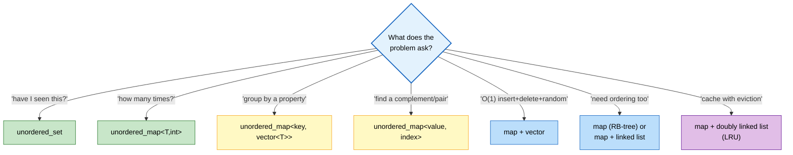

**The core trade:** spend **O(n) space** to make lookups **O(1)**. Almost always worth it.

⚠️ **C++ specifics that cause real bugs:**
```cpp
mp[key]                 // ⚠️ INSERTS a default-constructed value if absent!
                        //    `if (mp[k])` silently grows the map
mp.count(key)           // ✅ safe existence check
mp.find(key)            // returns an iterator; compare against mp.end()
mp.at(key)              // throws std::out_of_range if absent
auto [it, ok] = mp.insert({k, v});   // does NOT overwrite an existing key
mp.reserve(n);          // ⭐ avoids rehashing — a real, measurable speedup
```

---

## 📑 Contents

| # | Problem | Diff | Type | Optimal |
|---|---|---|---|---|
| [1](#1-longest-consecutive-sequence) | Longest Consecutive Sequence | 🟡 | 🔵 **Full** | O(n) set + sequence-start check |
| [2](#2-subarray-sum-equals-k) | Subarray Sum Equals K | 🟡 | 🔵 **Full** | O(n) prefix-sum map |
| [3](#3-lru-cache) | LRU Cache | 🟡 | 🔵 **Full** | O(1) map + doubly linked list |
| [4](#4-lfu-cache) | LFU Cache | 🔴 | ⚪ Variation | O(1) freq buckets |
| [5](#5-insert-delete-getrandom-o1) | Insert Delete GetRandom O(1) | 🟡 | 🔵 **Full** | map + vector, swap-with-last |
| [6](#6-4sum-ii) | 4Sum II | 🟡 | 🔵 **Full** | O(n²) meet in the middle |
| [7](#7-two-sum-iii--design) | Two Sum III (design) | 🟢 | ⚪ Variation | trade insert vs find |
| [8](#8-first-unique-character) | First Unique Character | 🟢 | ⚪ Variation | two-pass counting |
| [9](#9-isomorphic-strings--word-pattern) | Isomorphic Strings / Word Pattern | 🟢 | 🔵 **Full** | bijection needs TWO maps |
| [10](#10-find-all-anagrams-in-a-string) | Find All Anagrams | 🟡 | 🔵 **Full** | O(n) rolling frequency window |
| [11](#11-substring-with-concatenation-of-all-words) | Substring w/ Concatenation of All Words | 🔴 | ⚪ Variation | word-level window |
| [12](#12-copy-list-with-random-pointer) | Copy List with Random Pointer | 🟡 | 🔵 **Full** | O(1) space interleaving |
| [13](#13-design-hashmap-from-scratch) | Design HashMap | 🟢 | 🔵 **Full** | buckets + chaining |
| [14](#14-consistent-hashing-design-note) | Consistent Hashing | — | 📘 Concept | the distributed-systems version |

🔵 **Full** = complete approach ladder · ⚪ **Variation** = reuses a ladder · 📘 **Concept** = design note

---

# 1. Longest Consecutive Sequence

🟡 **Medium** · 🔵 Full ladder · ⭐ **The "only start from a start" trick**

> Length of the longest run of consecutive integers. **Unsorted array. O(n) required.**

```
   Input:  [100, 4, 200, 1, 3, 2]
   Output: 4       (the sequence 1, 2, 3, 4)
```

## 🗺️ Approach Ladder

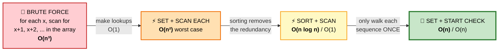

| Approach | Time | Space | Verdict |
|---|---|---|---|
| Brute force | O(n³) | O(1) | ❌ |
| Set, walk from every element | O(n²) | O(n) | ⚠️ looks O(n), isn't |
| Sort + linear scan | O(n log n) | O(1) | ✅ acceptable if space matters |
| **Set + sequence-start check** | **O(n)** | O(n) | 🏆 **the required answer** |

## 2️⃣ Set + Scan From Every Element — the trap

```cpp
// ⚠️ LOOKS linear. Is NOT.
for (int x : nums) {
    int len = 0, cur = x;
    while (s.count(cur)) { ++len; ++cur; }     // walks the whole sequence
    best = max(best, len);
}
```
```
   ⚠️ WHY IT'S O(n²)

   On [1,2,3,4,5]:
     from 1 → walks 5 steps
     from 2 → walks 4 steps
     from 3 → walks 3 steps ...

   Total = 5+4+3+2+1 = O(n²)

   ⭐ Every element re-walks the entire tail of its sequence.
```

## 4️⃣ Set + Sequence-Start Check — ⭐ OPTIMAL

#### 💬 The fix in one sentence
**Only start walking from a number that begins a sequence** — i.e. one where `x-1` is absent.

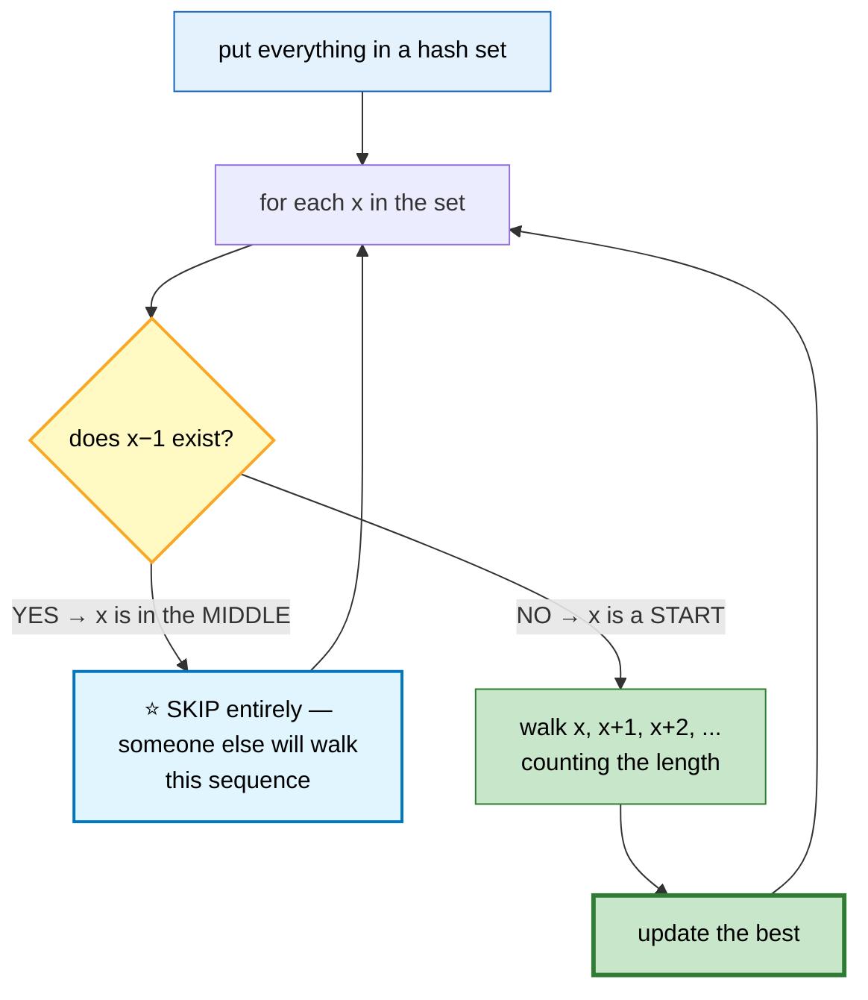

```
   TRACE  [100, 4, 200, 1, 3, 2]
   set = {1, 2, 3, 4, 100, 200}

   ┌───────┬────────────────┬──────────────────────────────┐
   │   x   │ is x−1 in set? │ action                       │
   ├───────┼────────────────┼──────────────────────────────┤
   │  100  │  99? NO        │ ⭐ START → walk: 100 → len 1 │
   │   4   │   3? YES       │ skip (middle)                │
   │  200  │ 199? NO        │ ⭐ START → walk: 200 → len 1 │
   │   1   │   0? NO        │ ⭐ START → 1,2,3,4 → len 4 🏆│
   │   3   │   2? YES       │ skip                         │
   │   2   │   1? YES       │ skip                         │
   └───────┴────────────────┴──────────────────────────────┘
   ANSWER: 4
```

```cpp
int longestConsecutive(vector<int>& a) {
    unordered_set<int> s(a.begin(), a.end());
    int best = 0;

    for (int x : s) {
        if (s.count(x - 1)) continue;          // ⭐⭐ NOT a sequence start → skip

        int cur = x, len = 1;
        while (s.count(cur + 1)) { ++cur; ++len; }
        best = max(best, len);
    }
    return best;
}
```

```
   ⭐⭐ WHY THIS IS GENUINELY O(n)

   The inner while loop only ever runs for sequence STARTS.
   Each element is visited by the inner loop AT MOST ONCE,
   because it belongs to exactly one sequence, which is walked
   exactly once — from its unique starting point.

   Outer loop: O(n) · Inner loops total: O(n) → O(n) overall ✅
```

⭐ **Iterate over the SET, not the array.** Duplicates in the array would otherwise cause redundant walks.

## ⚠️ Edge Cases

| Input | Output | Why |
|---|---|---|
| `[]` | `0` | `best` initialized to 0 |
| `[1,1,1]` | `1` | set deduplicates |
| `[INT_MIN]` | `1` | ⚠️ `x-1` overflows — `count()` on a wrapped value is still safe here, but flag it |
| `[1,2,0,1]` | `3` | duplicates don't extend a run |

## 📌 Pattern Card
```
SIGNAL   consecutive/contiguous runs in UNSORTED data
KEY      ⭐ only expand from sequence STARTS (x−1 absent)
RELATED  Longest Consecutive in a Binary Tree · Union-Find variant
```

---

# 2. Subarray Sum Equals K

🟡 **Medium** · 🔵 Full ladder · ⭐ **Prefix sums in a hash map**

> Count subarrays summing to exactly `k`. Values may be **negative**.

## 🗺️ Approach Ladder

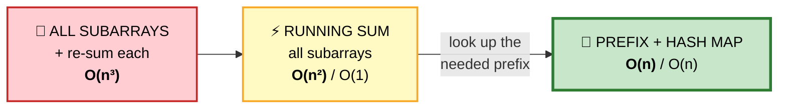

⚠️ **Why not a sliding window?** Sliding window requires that extending the window *monotonically* increases the sum. With negative numbers that breaks — the sum can go down, so shrinking/growing gives no usable signal.

## 3️⃣ Prefix Sums + Hash Map — ⭐ OPTIMAL

#### 💬 The algebra
```
   sum(i..j) = prefix[j] − prefix[i−1]

   We want:  prefix[j] − prefix[i−1] = k
   Rearrange: prefix[i−1] = prefix[j] − k

   ⭐ So at each j, ask: "how many earlier prefixes equal
     (current prefix − k)?" That count is the number of
     subarrays ending at j with sum k.
```

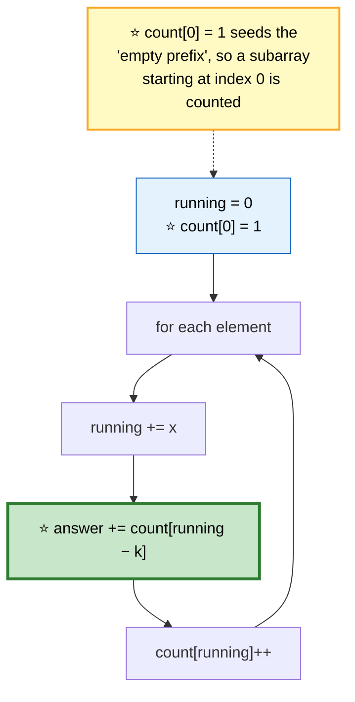

```
   TRACE  a = [1, 2, 3], k = 3

   ┌───┬─────────┬─────────────┬────────┬──────────────────┐
   │ x │ running │ need = r−k  │ found  │ count map after  │
   ├───┼─────────┼─────────────┼────────┼──────────────────┤
   │ — │    0    │      —      │   —    │ {0:1} ⭐ seed    │
   │ 1 │    1    │   1−3 = −2  │   0    │ {0:1, 1:1}       │
   │ 2 │    3    │   3−3 =  0  │ ⭐ 1   │ {0:1, 1:1, 3:1}  │
   │ 3 │    6    │   6−3 =  3  │ ⭐ 1   │ {...,3:1, 6:1}   │
   └───┴─────────┴─────────────┴────────┴──────────────────┘
   ANSWER: 2   →  [1,2] and [3] ✅
```

```cpp
int subarraySum(vector<int>& a, int k) {
    unordered_map<long long, int> count;
    count[0] = 1;                              // ⭐⭐ the empty prefix

    long long running = 0;
    int ans = 0;

    for (int x : a) {
        running += x;

        auto it = count.find(running - k);      // ⭐ find, not [] — avoids
        if (it != count.end()) ans += it->second;  //    inserting junk keys

        count[running]++;
    }
    return ans;
}
```

⚠️ **`count[0] = 1` is the single most-forgotten line.** Without it, `[3], k=3` returns 0 instead of 1 — because `running - k == 0` has no match.

⚠️ **Use `find`, not `count[running - k]`.** The `[]` operator would insert a zero entry for every miss, silently bloating the map.

## 📌 Pattern Card
```
SIGNAL   "count subarrays with sum/property = X", negatives allowed
KEY      prefix[j] − prefix[i] = k  → look up (prefix − k)
         ⭐ seed count[0] = 1
RELATED  Continuous Subarray Sum (mod) · Subarrays Div by K
         Contiguous Array (map 0→−1) · Max Size Subarray Sum K
```

---

# 3. LRU Cache

🟡 **Medium** · 🔵 Full ladder · ⭐ **The canonical design problem**

> `get` and `put` in **O(1)**. Evict the least-recently-used key when full.

## 🗺️ Approach Ladder

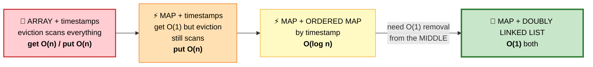

## 💬 Why exactly these two structures

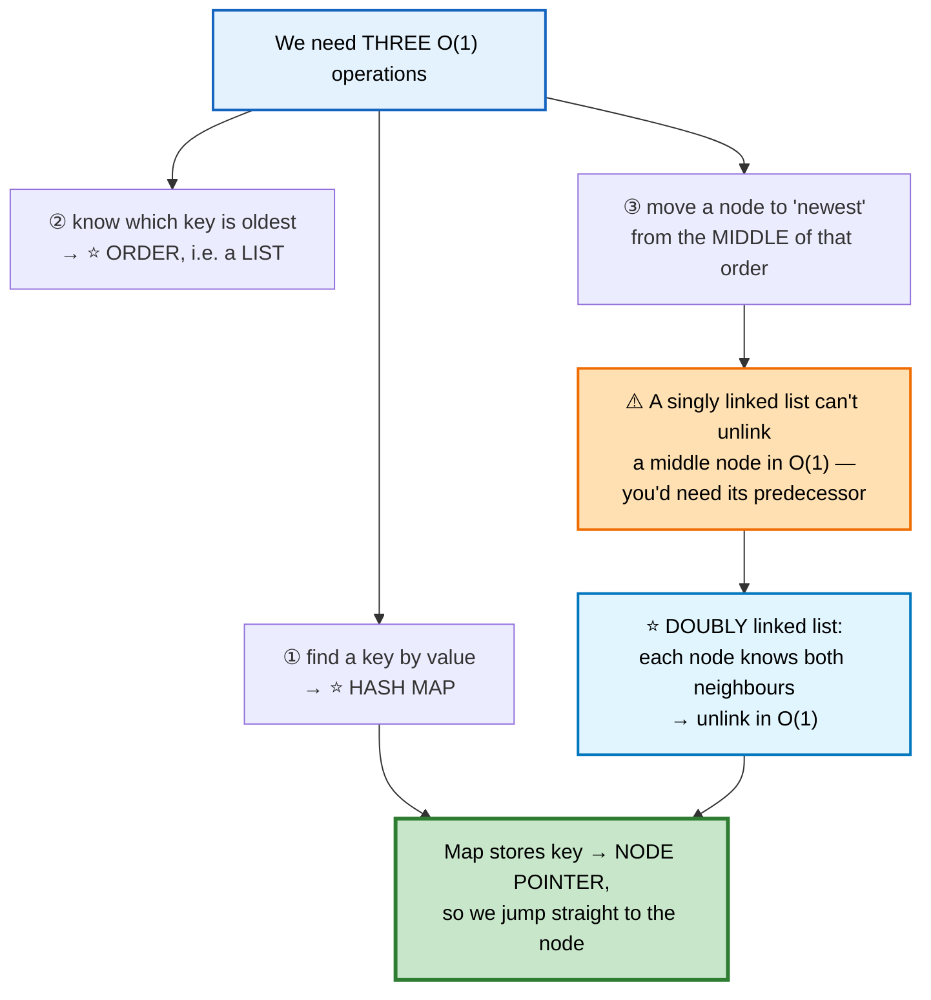

```
   THE STRUCTURE

   map: { 1 → ●,  2 → ●,  3 → ● }
              │      │      │
              ▼      ▼      ▼
   HEAD ⇄ [ 3 ] ⇄ [ 1 ] ⇄ [ 2 ] ⇄ TAIL
    ▲       ⭐ newest        ⭐ oldest    ▲
    │                                    │
   sentinel                          sentinel

   ⭐ SENTINEL HEAD AND TAIL eliminate every null check.
     No "is this the first node?" special case. Ever.
```

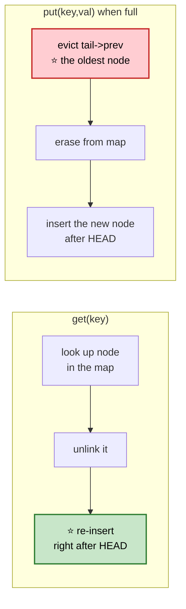

```cpp
class LRUCache {
    struct Node {
        int key, val;
        Node *prev = nullptr, *next = nullptr;
        Node(int k, int v) : key(k), val(v) {}
    };

    int cap;
    unordered_map<int, Node*> mp;
    Node *head, *tail;                          // ⭐ sentinels — never hold data

    void unlink(Node* n) {
        n->prev->next = n->next;                // ⭐ no null checks needed,
        n->next->prev = n->prev;                //    thanks to the sentinels
    }
    void pushFront(Node* n) {
        n->next = head->next;
        n->prev = head;
        head->next->prev = n;
        head->next = n;
    }

public:
    LRUCache(int capacity) : cap(capacity) {
        head = new Node(0, 0);
        tail = new Node(0, 0);
        head->next = tail;
        tail->prev = head;
        mp.reserve(capacity * 2);               // ⭐ avoid rehashing
    }

    int get(int key) {
        auto it = mp.find(key);
        if (it == mp.end()) return -1;

        unlink(it->second);                     // ⭐ touch → becomes newest
        pushFront(it->second);
        return it->second->val;
    }

    void put(int key, int value) {
        auto it = mp.find(key);

        if (it != mp.end()) {                   // update in place
            it->second->val = value;
            unlink(it->second);
            pushFront(it->second);
            return;
        }

        if ((int)mp.size() == cap) {            // ⭐ evict the LRU
            Node* lru = tail->prev;
            unlink(lru);
            mp.erase(lru->key);                 // ⚠️ erase BEFORE delete
            delete lru;
        }

        Node* n = new Node(key, value);
        pushFront(n);
        mp[key] = n;
    }
};
```

⚠️ **`mp.erase(lru->key)` must come before `delete lru`** — reading `lru->key` after freeing is use-after-free.

⭐ **The C++ shortcut:** `std::list` + `unordered_map<int, list<pair<int,int>>::iterator>` gives the same thing, because `list::splice` moves a node in O(1) without invalidating iterators. Worth mentioning, but implementing the list manually shows you understand *why*.

## 📌 Pattern Card
```
SIGNAL   "O(1) get + put + eviction by recency"
KEY      hash map → node pointer · DOUBLY linked list for O(1) unlink
         ⭐ sentinel head/tail kill every edge case
RELATED  LFU Cache · All O(1) Data Structure · Design Twitter
```

---

# 4. LFU Cache
🔴 ⚪ **Variation of #3** — evict by *frequency* instead of recency, ties broken by recency.

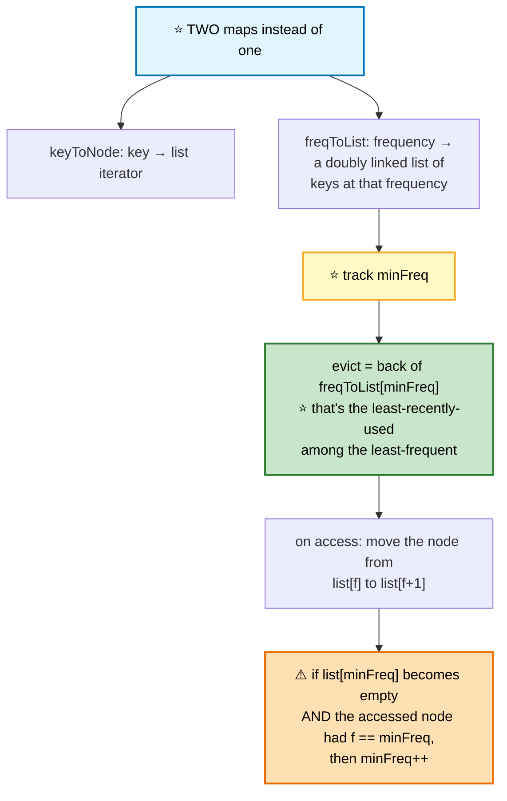

```cpp
class LFUCache {
    int cap, minFreq = 0;
    // key → {value, freq, iterator into freqList[freq]}
    unordered_map<int, tuple<int,int,list<int>::iterator>> mp;
    unordered_map<int, list<int>> freqList;     // freq → keys, newest at FRONT

    void touch(int key) {
        auto& [val, f, it] = mp[key];
        freqList[f].erase(it);                  // ⭐ O(1) via the stored iterator
        if (freqList[f].empty() && minFreq == f) ++minFreq;   // ⚠️ the tricky line

        ++f;
        freqList[f].push_front(key);
        it = freqList[f].begin();
    }

public:
    LFUCache(int capacity) : cap(capacity) {}

    int get(int key) {
        if (!cap || !mp.count(key)) return -1;
        touch(key);
        return get<0>(mp[key]);
    }

    void put(int key, int value) {
        if (!cap) return;

        if (mp.count(key)) { get<0>(mp[key]) = value; touch(key); return; }

        if ((int)mp.size() == cap) {
            int evict = freqList[minFreq].back();   // ⭐ LRU within the min freq
            freqList[minFreq].pop_back();
            mp.erase(evict);
        }

        minFreq = 1;                            // ⭐ the new key has freq 1
        freqList[1].push_front(key);
        mp[key] = {value, 1, freqList[1].begin()};
    }
};
```

⭐ **Why `minFreq = 1` on every insert:** a brand-new key is by definition the least frequently used, so the minimum resets unconditionally.

---

# 5. Insert Delete GetRandom O(1)

🟡 **Medium** · 🔵 Full ladder · ⭐ **Swap-with-last**

> `insert`, `remove`, `getRandom` — all **O(1) average**.

## 💬 Why one structure isn't enough

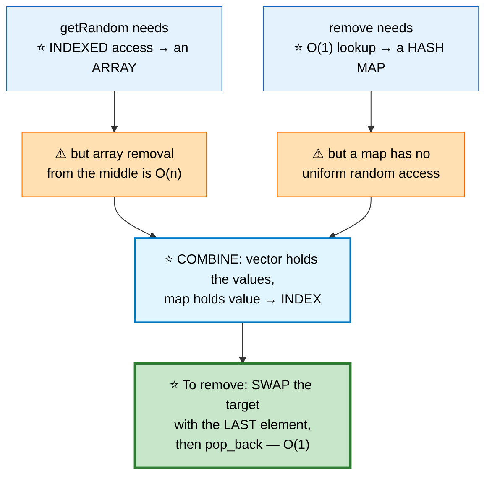

```
   REMOVE(10) from  vec = [10, 20, 30, 40]
                    map = {10:0, 20:1, 30:2, 40:3}

   ① find the index of 10 → 0
   ② ⭐ overwrite it with the LAST element (40)
        vec = [40, 20, 30, 40]
   ③ ⭐ update the moved element's index in the map
        map[40] = 0
   ④ pop_back + erase
        vec = [40, 20, 30]
        map = {40:0, 20:1, 30:2}   ✅ all O(1)

   ⚠️ Order matters: the array becomes UNORDERED. That's fine —
     nothing in the spec requires ordering.
```

```cpp
class RandomizedSet {
    vector<int> vec;
    unordered_map<int,int> idx;                 // value → index in vec

public:
    bool insert(int val) {
        if (idx.count(val)) return false;
        idx[val] = vec.size();
        vec.push_back(val);
        return true;
    }

    bool remove(int val) {
        auto it = idx.find(val);
        if (it == idx.end()) return false;

        int i = it->second, last = vec.back();
        vec[i] = last;                          // ⭐ move the last into the hole
        idx[last] = i;                          // ⭐ fix its recorded index

        vec.pop_back();
        idx.erase(it);                          // ⚠️ erase AFTER using `it`
        return true;
    }

    int getRandom() {
        return vec[rand() % vec.size()];        // ⭐ uniform, O(1)
    }
};
```

⚠️ **Subtle bug:** if `val` *is* the last element, `idx[last] = i` writes to the entry we're about to erase. Erasing after the write keeps it correct — but reversing the two lines breaks it.

🎤 **Follow-up: duplicates allowed (RandomizedCollection)?** Change the map to `unordered_map<int, unordered_set<int>>` — value → set of indices. Same swap-with-last, but you must update the index sets of both the removed and moved values.

---

# 6. 4Sum II

🟡 **Medium** · 🔵 Full ladder · ⭐ **Meet in the middle**

> Four arrays of length n. Count tuples `(i,j,k,l)` with `a[i]+b[j]+c[k]+d[l] == 0`.

## 🗺️ Approach Ladder

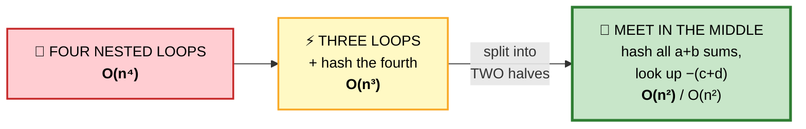

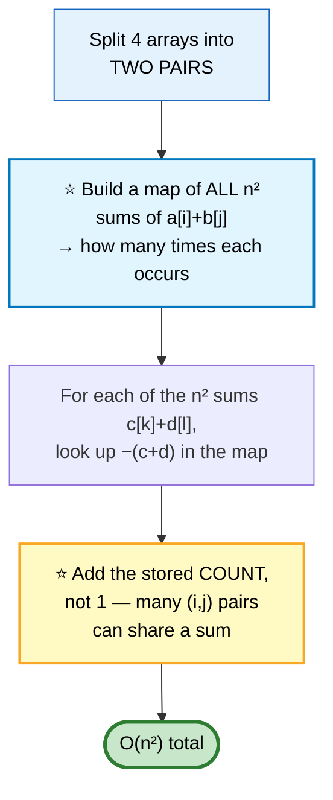

```cpp
int fourSumCount(vector<int>& a, vector<int>& b,
                 vector<int>& c, vector<int>& d) {
    unordered_map<int,int> ab;
    ab.reserve(a.size() * a.size());            // ⭐ big win, avoids rehashing

    for (int x : a) for (int y : b) ab[x + y]++;    // ⭐ n² sums

    int ans = 0;
    for (int x : c) for (int y : d) {
        auto it = ab.find(-(x + y));
        if (it != ab.end()) ans += it->second;  // ⭐ add the COUNT
    }
    return ans;
}
```

⭐ **Meet in the middle** is a general technique: when a problem has `k` independent choices, splitting into two halves of `k/2` turns `O(n^k)` into `O(n^(k/2))`. It also solves Subset Sum for n ≈ 40.

---

# 7. Two Sum III — Design
🟢 ⚪ **Variation of Two Sum** — the interesting part is the **trade-off**.

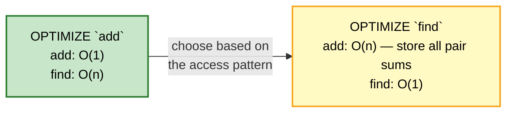

```cpp
class TwoSum {
    unordered_map<int,int> cnt;
public:
    void add(int n) { cnt[n]++; }               // O(1)

    bool find(int target) {                     // O(distinct values)
        for (auto& [v, c] : cnt) {
            int need = target - v;
            if (need == v) { if (c > 1) return true; }   // ⚠️ needs TWO copies
            else if (cnt.count(need)) return true;
        }
        return false;
    }
};
```
⭐ **The `need == v` case is the whole point of storing counts** rather than a set — `target = 4` with only one `2` present must return false.

**When to pick which:** if `add` is called far more often than `find` (the usual case), optimize `add`. If it's read-heavy, precompute the sums.

---

# 8. First Unique Character
🟢 ⚪ **Variation** — two passes, `int[26]`.

```cpp
int firstUniqChar(string s) {
    int cnt[26] = {};
    for (char c : s) cnt[c - 'a']++;            // pass 1: count
    for (int i = 0; i < (int)s.size(); ++i)     // pass 2: ⭐ first with count 1
        if (cnt[s[i] - 'a'] == 1) return i;
    return -1;
}
```
⭐ **Two passes beat one pass here.** A single pass with a "seen once" set requires ordered bookkeeping; counting first makes the second pass trivially ordered by index.

🎤 **Follow-up: a stream (First Unique Number)?** Use a queue of candidates plus a count map — pop from the queue while its front has count > 1.

---

# 9. Isomorphic Strings / Word Pattern

🟢 **Easy** · 🔵 Full ladder · ⭐ **A bijection needs TWO maps**

> `"egg"` ↔ `"add"` ✅ · `"foo"` ↔ `"bar"` ❌ · `"badc"` ↔ `"baba"` ❌

## ⚠️ Why one map is wrong

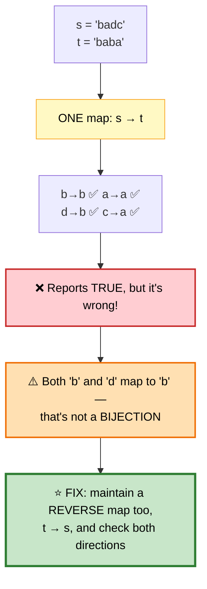

```cpp
bool isIsomorphic(string s, string t) {
    if (s.size() != t.size()) return false;

    int fwd[256] = {}, bwd[256] = {};           // ⭐ 0 = "unmapped"

    for (int i = 0; i < (int)s.size(); ++i) {
        unsigned char a = s[i], b = t[i];

        if (fwd[a] == 0 && bwd[b] == 0) {
            fwd[a] = b;                         // ⭐ establish the pairing
            bwd[b] = a;                         //    in BOTH directions
        } else if (fwd[a] != b || bwd[b] != a) {
            return false;                       // ⭐ conflicts either way
        }
    }
    return true;
}
```

⭐ **The elegant alternative:** compare the *index of last occurrence* for both strings — if `s` and `t` are isomorphic, the position of each character's previous appearance matches at every index.

**Word Pattern** is the same problem with `char ↔ string` instead of `char ↔ char`:
```cpp
bool wordPattern(string pattern, string s) {
    vector<string> words;
    stringstream ss(s);
    string w;
    while (ss >> w) words.push_back(w);

    if (words.size() != pattern.size()) return false;

    unordered_map<char,string> fwd;
    unordered_map<string,char> bwd;             // ⭐ still TWO maps

    for (int i = 0; i < (int)pattern.size(); ++i) {
        char c = pattern[i];
        if (fwd.count(c) && fwd[c] != words[i]) return false;
        if (bwd.count(words[i]) && bwd[words[i]] != c) return false;
        fwd[c] = words[i];
        bwd[words[i]] = c;
    }
    return true;
}
```

## 📌 Pattern Card
```
SIGNAL   "one-to-one mapping" / "same structure" / "isomorphic"
KEY      ⭐ a BIJECTION requires checking BOTH directions
RELATED  Word Pattern · Find and Replace Pattern · Group Shifted Strings
```

---

# 10. Find All Anagrams in a String

🟡 **Medium** · 🔵 Full ladder · ⭐ **Rolling frequency window**

> All start indices where an anagram of `p` occurs in `s`.

## 🗺️ Approach Ladder

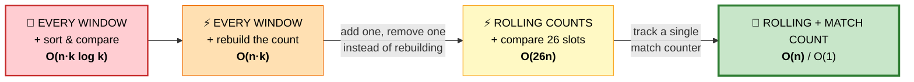

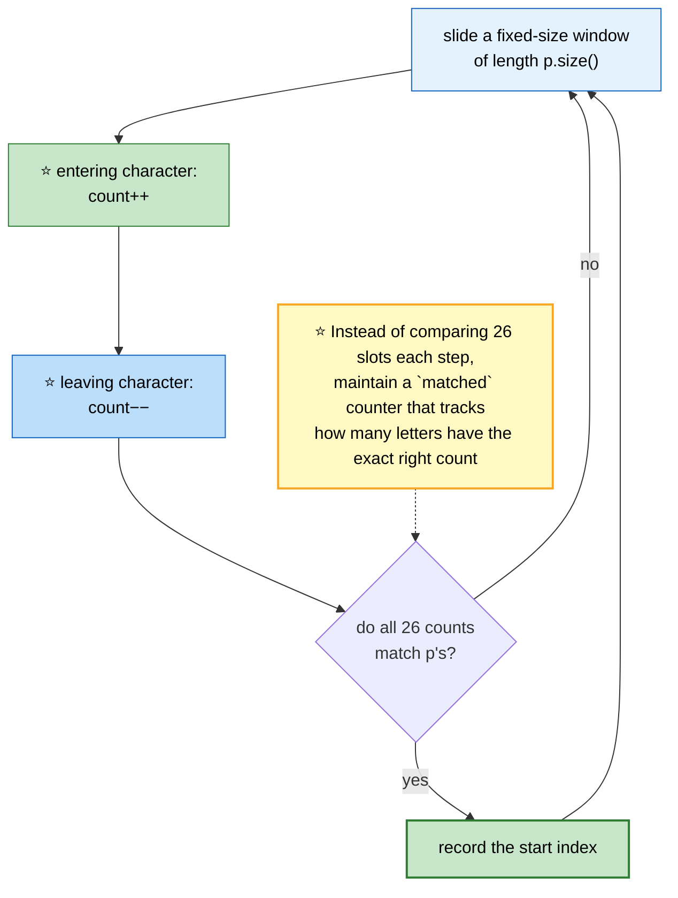

```cpp
vector<int> findAnagrams(string s, string p) {
    if (s.size() < p.size()) return {};

    int need[26] = {}, win[26] = {};
    for (char c : p) need[c - 'a']++;

    int k = p.size(), matched = 0;
    // ⭐ how many letters ALREADY have the correct count (0 counts as correct)
    for (int i = 0; i < 26; ++i) if (need[i] == win[i]) ++matched;

    vector<int> out;

    for (int i = 0; i < (int)s.size(); ++i) {
        int in = s[i] - 'a';
        // ⭐ update `matched` around each mutation
        if (win[in] == need[in]) --matched;
        ++win[in];
        if (win[in] == need[in]) ++matched;

        if (i >= k) {                           // ⭐ evict the leaving character
            int out_c = s[i - k] - 'a';
            if (win[out_c] == need[out_c]) --matched;
            --win[out_c];
            if (win[out_c] == need[out_c]) ++matched;
        }

        if (i >= k - 1 && matched == 26) out.push_back(i - k + 1);
    }
    return out;
}
```

⭐ **The `matched` counter turns an O(26) comparison per step into O(1).** The pattern — *decrement before mutating, increment after* — is the general way to maintain a derived counter incrementally.

---

# 11. Substring with Concatenation of All Words
🔴 ⚪ **Variation of #10** — the same rolling window, but the unit is a **word**, not a character.

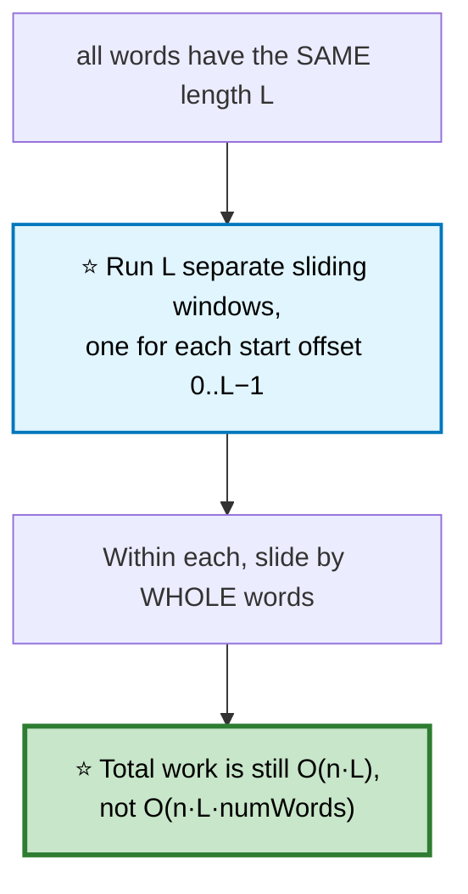

```cpp
vector<int> findSubstring(string s, vector<string>& words) {
    if (words.empty() || s.empty()) return {};

    int L = words[0].size(), n = words.size(), total = L * n;
    if ((int)s.size() < total) return {};

    unordered_map<string,int> need;
    for (auto& w : words) need[w]++;

    vector<int> out;

    for (int off = 0; off < L; ++off) {         // ⭐ L independent windows
        unordered_map<string,int> win;
        int count = 0, left = off;

        for (int right = off; right + L <= (int)s.size(); right += L) {
            string w = s.substr(right, L);

            if (!need.count(w)) {               // ⭐ invalid word → reset entirely
                win.clear(); count = 0; left = right + L;
                continue;
            }

            win[w]++; ++count;
            while (win[w] > need[w]) {          // ⭐ too many copies → shrink
                string lw = s.substr(left, L);
                win[lw]--; --count;
                left += L;
            }

            if (count == n) out.push_back(left);
        }
    }
    return out;
}
```

---

# 12. Copy List with Random Pointer

🟡 **Medium** · 🔵 Full ladder · ⭐ **Interleaving beats the hash map**

> Deep-copy a linked list where each node also has a `random` pointer to any node.

## 🗺️ Approach Ladder

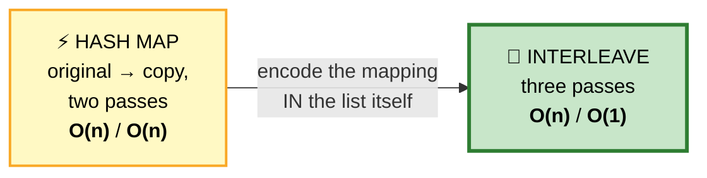

## 1️⃣ Hash Map — the obvious answer
```cpp
Node* copyRandomList(Node* head) {
    unordered_map<Node*, Node*> mp;
    for (Node* p = head; p; p = p->next) mp[p] = new Node(p->val);
    for (Node* p = head; p; p = p->next) {
        mp[p]->next   = mp[p->next];            // ⭐ nullptr maps to nullptr
        mp[p]->random = mp[p->random];          //    for free, via operator[]
    }
    return mp[head];
}
```
⭐ **`mp[nullptr]` default-constructs to `nullptr`** — so the null cases need no special handling.

## 2️⃣ Interleaving — ⭐ O(1) space

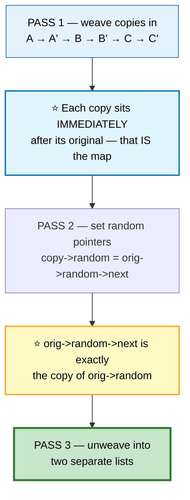

```
   ORIGINAL     A ──→ B ──→ C
                └───random──→ (A.random = C)

   AFTER PASS 1 (weave)
                A → A' → B → B' → C → C'

   PASS 2       A.random = C
                ⭐ so A'.random = C.next = C'   ✅
                One dereference. No map needed.
```

```cpp
Node* copyRandomList(Node* head) {
    if (!head) return nullptr;

    // ① weave copies in
    for (Node* p = head; p; p = p->next->next) {
        Node* c = new Node(p->val);
        c->next = p->next;
        p->next = c;
    }

    // ② wire up the random pointers
    for (Node* p = head; p; p = p->next->next)
        if (p->random) p->next->random = p->random->next;   // ⭐ the key line

    // ③ unweave
    Node* newHead = head->next;
    for (Node* p = head; p; ) {
        Node* c = p->next;
        p->next = c->next;
        c->next = c->next ? c->next->next : nullptr;
        p = p->next;
    }
    return newHead;
}
```

⚠️ **The unweave must restore the original list too** — an interviewer will check that you didn't leave the input mangled.

---

# 13. Design HashMap from Scratch

🟢 **Easy to state, deep to discuss** · 🔵 Full ladder

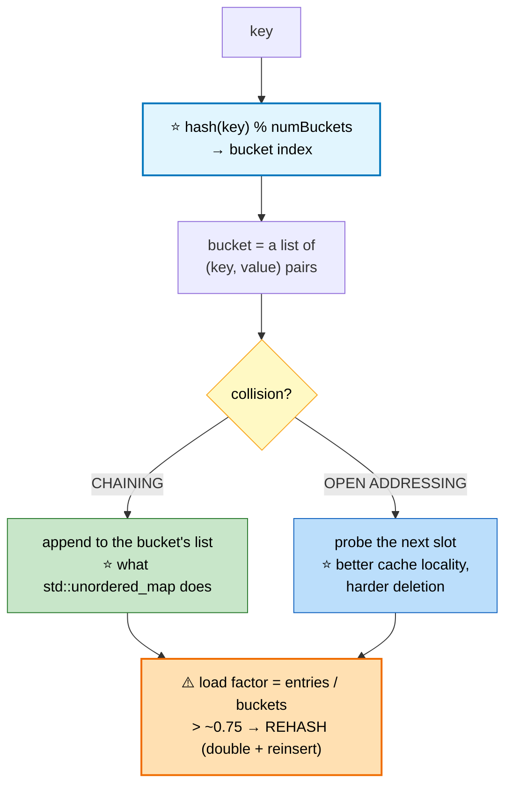

```cpp
class MyHashMap {
    static const int BUCKETS = 1009;            // ⭐ PRIME — reduces clustering
    vector<list<pair<int,int>>> table;

    list<pair<int,int>>& bucket(int key) { return table[key % BUCKETS]; }

public:
    MyHashMap() : table(BUCKETS) {}

    void put(int key, int value) {
        for (auto& kv : bucket(key))
            if (kv.first == key) { kv.second = value; return; }   // ⭐ update
        bucket(key).emplace_back(key, value);
    }

    int get(int key) {
        for (auto& kv : bucket(key)) if (kv.first == key) return kv.second;
        return -1;
    }

    void remove(int key) {
        auto& b = bucket(key);
        b.remove_if([key](const auto& kv){ return kv.first == key; });
    }
};
```

```
   ⭐ WHAT AN INTERVIEWER ACTUALLY WANTS TO HEAR

   COMPLEXITY
     O(1) average · O(n) worst case (all keys collide)
     Java 8+ converts a long bucket chain into a red-black
     tree → O(log n) worst case instead of O(n).

   WHY A PRIME BUCKET COUNT
     With a power of two, `% N` keeps only the low bits, so
     any pattern in those bits causes clustering. A prime
     spreads the entropy across the whole value.

   HASH FLOODING (a real security issue)
     An attacker who can predict your hash function submits
     keys that all collide → every operation degrades to O(n)
     → CPU exhaustion. This is CVE-2011-4815 and friends.
     ⭐ FIX: SipHash with a per-process random seed. Python,
     Rust, and Java all do this now.

   LOAD FACTOR
     Rehashing at ~0.75 keeps chains short. Rehashing is O(n)
     but AMORTIZES to O(1) per insert, exactly like vector growth.
```

---

# 14. Consistent Hashing (Design Note)

📘 **Concept** · The distributed-systems version of the same idea. Comes up constantly in [system design](../05-system-design/01-building-blocks.md).

## ⚠️ The problem with `hash(key) % N`

```mermaid
flowchart TD
    A["hash(key) % 4 servers"] --> B["⚠️ Add ONE server → % 5"]
    B --> C["⭐ Nearly EVERY key now maps<br/>to a different server"]
    C --> D["❌ Total cache invalidation<br/>→ a thundering herd hits the database"]

    style A fill:#fff9c4,stroke:#f9a825,color:#000
    style B fill:#ffe0b2,stroke:#ef6c00,stroke-width:2px,color:#000
    style C fill:#ffcdd2,stroke:#c62828,stroke-width:2px,color:#000
    style D fill:#ff8a80,stroke:#b71c1c,stroke-width:2px,color:#000
```

## ⭐ The fix: a hash ring

```mermaid
flowchart TD
    A["Map both SERVERS and KEYS<br/>onto the same circular hash space<br/>(0 .. 2³²−1)"] --> B["A key belongs to the first<br/>server CLOCKWISE from it"]
    B --> C["⭐ Adding/removing a server only<br/>affects the keys in ONE arc"]
    C --> D["Only ~K/N keys move,<br/>not almost all of them"]
    D --> E["⚠️ But few servers → uneven arcs<br/>→ hot spots"]
    E --> F["⭐ VIRTUAL NODES: place each<br/>physical server at 100–200 points<br/>on the ring → smooth distribution"]

    style A fill:#e3f2fd,stroke:#1565c0,color:#000
    style C fill:#e1f5fe,stroke:#0277bd,stroke-width:2px,color:#000
    style D fill:#c8e6c9,stroke:#2e7d32,stroke-width:2px,color:#000
    style E fill:#ffe0b2,stroke:#ef6c00,stroke-width:2px,color:#000
    style F fill:#c8e6c9,stroke:#2e7d32,stroke-width:3px,color:#000
```

```cpp
class ConsistentHash {
    map<uint32_t, string> ring;                 // ⭐ ORDERED map — needs lower_bound
    int vnodes;

public:
    ConsistentHash(int v = 150) : vnodes(v) {}

    void addServer(const string& s) {
        for (int i = 0; i < vnodes; ++i)
            ring[hashOf(s + "#" + to_string(i))] = s;   // ⭐ virtual nodes
    }

    void removeServer(const string& s) {
        for (int i = 0; i < vnodes; ++i)
            ring.erase(hashOf(s + "#" + to_string(i)));
    }

    string getServer(const string& key) {
        if (ring.empty()) return "";
        auto it = ring.lower_bound(hashOf(key));  // ⭐ first server clockwise
        if (it == ring.end()) it = ring.begin();  // ⭐ wrap around the circle
        return it->second;
    }
};
```

⭐ **Used in production by:** Cassandra, DynamoDB, Riak, memcached clients, and most CDN request routers.

---

## 📋 Hashing Recall

```mermaid
mindmap
  root(("Hashing"))
    Core Trade
      O(n) space → O(1) lookup
      almost always worth it
    Prefix + Map
      prefix[j] − prefix[i] = k
      ⭐ seed count[0] = 1
      works with NEGATIVES
      sliding window does not
    Sequence Tricks
      ⭐ only expand from starts
      turns O(n²) into O(n)
    Design
      map + doubly linked list = LRU
      map + freq lists = LFU
      map + vector = O(1) random
      ⭐ swap-with-last removal
    Bijection
      ⭐ TWO maps, both directions
    Windows
      rolling counts
      `matched` counter → O(1) check
    Under the Hood
      chaining vs open addressing
      prime buckets, load factor 0.75
      ⚠️ hash flooding → SipHash
      consistent hashing + vnodes
```

```
╔══════════════════════════════════════════════════════════════════════╗
║                     HASHING — PATTERN RECALL                         ║
╠══════════════════════════════════════════════════════════════════════╣
║ "have I seen this?"            → unordered_set                       ║
║ "count subarrays with sum k"   → ⭐ prefix map, seed count[0]=1       ║
║ "consecutive run, unsorted"    → ⭐ set + only start where x−1 absent ║
║ "O(1) get/put + eviction"      → map + DOUBLY linked list            ║
║ "O(1) insert/delete/random"    → ⭐ vector + map, swap-with-last      ║
║ "count 4-tuples summing to 0"  → ⭐ meet in the middle, O(n²)         ║
║ "one-to-one character mapping" → ⭐ TWO maps — check both directions  ║
║ "all anagram positions"        → rolling counts + `matched` counter  ║
║ "deep copy with random ptrs"   → ⭐ interleave for O(1) space         ║
║ "distribute keys over servers" → consistent hashing + virtual nodes  ║
╠══════════════════════════════════════════════════════════════════════╣
║ ⚠️ TRAPS                                                              ║
║   mp[key] INSERTS on miss — use find() or count()                    ║
║   subarray sum: forgetting count[0] = 1                              ║
║   longest consecutive: walking from every element is O(n²)           ║
║   LRU: erase from the map BEFORE deleting the node                   ║
║   isomorphic: one map silently accepts non-bijections                ║
║   RandomizedSet: update the moved index BEFORE erasing               ║
╚══════════════════════════════════════════════════════════════════════╝
```

---

**Next:** [Two Pointers & Sliding Window →](03-two-pointers-sliding-window.md) · **Back:** [Arrays Part 3](01c-arrays-strings.md)
