# ↔️ Two Pointers & Sliding Window

> Two techniques that share one idea: **stop re-examining what you've already examined.** Both turn a nested loop into a single pass by moving indices forward and never backward.

**Prerequisite:** [Patterns & Foundations](00-patterns.md) · **Format:** [see the sample](FORMAT-SAMPLE.md)

---

## 🧠 Which Technique, and When

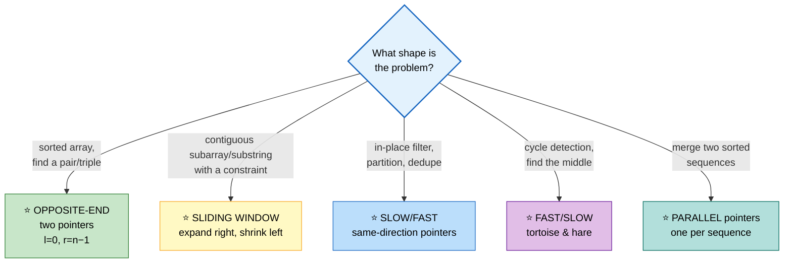

## ⭐ The Universal Sliding Window Template

```cpp
int slidingWindow(vector<int>& a) {
    int left = 0, best = 0;
    /* window state: a count map, a running sum, a distinct counter... */

    for (int right = 0; right < (int)a.size(); ++right) {
        // ① EXPAND — add a[right] to the window state
        add(a[right]);

        // ② SHRINK — while the window is INVALID, remove from the left
        while (!valid()) {
            remove(a[left]);
            ++left;
        }

        // ③ RECORD — the window is now valid
        best = max(best, right - left + 1);
    }
    return best;
}
```

```
   ⭐⭐ THE THREE VARIANTS, AND WHERE `best` GOES

   LONGEST valid window
     shrink WHILE invalid → record AFTER the shrink loop
     (the window is guaranteed valid at that point)

   SHORTEST valid window
     shrink WHILE valid → record INSIDE the shrink loop
     (record just before it becomes invalid)

   FIXED-SIZE window
     no while loop at all — evict exactly one element
     when the size exceeds k

   ⚠️ Getting this wrong is the #1 sliding-window bug.
```

---

## 📑 Contents

| # | Problem | Diff | Type | Optimal |
|---|---|---|---|---|
| [1](#1-two-sum-ii-sorted) | Two Sum II (sorted) | 🟢 | 🔵 **Full** | O(n) opposite ends |
| [2](#2-3sum) | 3Sum | 🟡 | 🔵 **Full** | O(n²) sort + two pointers |
| [3](#3-3sum-closest--4sum) | 3Sum Closest / 4Sum | 🟡 | ⚪ Variation | same skeleton |
| [4](#4-container-with-most-water) | Container With Most Water | 🟡 | 🔵 **Full** | O(n) greedy shrink |
| [5](#5-trapping-rain-water) | Trapping Rain Water | 🔴 | 🔵 **Full** | O(n)/O(1) two pointers |
| [6](#6-sort-array-by-parity--partition) | Sort Array by Parity | 🟢 | ⚪ Variation | slow/fast |
| [7](#7-longest-substring-with-at-most-k-distinct) | Longest Substring ≤ K Distinct | 🟡 | 🔵 **Full** | O(n) window + count map |
| [8](#8-fruit-into-baskets) | Fruit Into Baskets | 🟡 | ⚪ Variation | K = 2 |
| [9](#9-minimum-size-subarray-sum) | Minimum Size Subarray Sum | 🟡 | 🔵 **Full** | O(n) shortest-window variant |
| [10](#10-minimum-window-substring) | Minimum Window Substring | 🔴 | 🔵 **Full** | O(n) with a `missing` counter |
| [11](#11-permutation-in-string) | Permutation in String | 🟡 | ⚪ Variation | fixed-size window |
| [12](#12-sliding-window-maximum) | Sliding Window Maximum | 🔴 | 🔵 **Full** | O(n) monotonic deque |
| [13](#13-max-consecutive-ones-iii) | Max Consecutive Ones III | 🟡 | ⚪ Variation | window with ≤ k zeros |
| [14](#14-subarrays-with-k-different-integers) | Subarrays with K Different | 🔴 | 🔵 **Full** | ⭐ atMost(K) − atMost(K−1) |
| [15](#15-linked-list-cycle-floyds) | Linked List Cycle (Floyd's) | 🟡 | 🔵 **Full** | O(1) space cycle + entry |
| [16](#16-find-the-duplicate-number) | Find the Duplicate Number | 🟡 | ⚪ Variation | Floyd's on an array |

---

# 1. Two Sum II (Sorted)

🟢 **Easy** · 🔵 Full ladder · ⭐ **The opposite-end skeleton**

> Sorted array, find two numbers summing to `target`. **O(1) space.**

## 🗺️ Approach Ladder

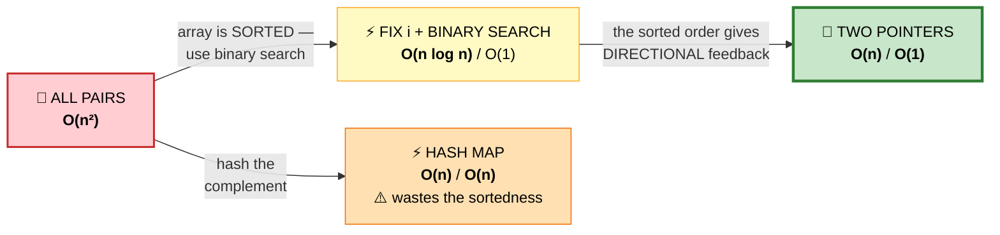

## 💬 Why sortedness makes one comparison enough

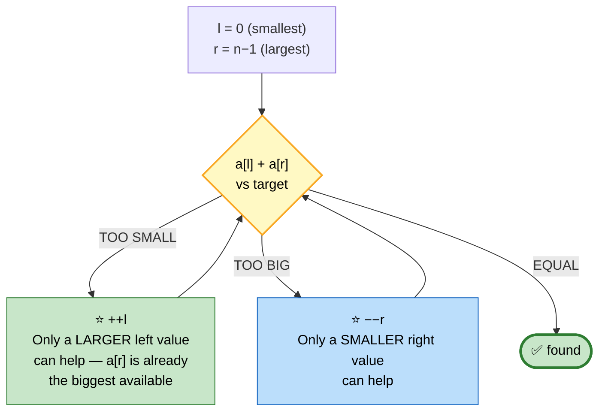

```
   ⭐⭐ WHY NO VALID PAIR IS EVER SKIPPED

   Suppose sum < target, so we do ++l.
   Could the discarded a[l] have been part of the answer?
   Its ONLY remaining partners are a[l+1..r], all of which are
   ≤ a[r]. Since a[l] + a[r] was ALREADY too small, every one
   of those pairs is too small too. So a[l] is provably useless.

   ⭐ Each move eliminates an entire row/column of the pair
     space — the same reasoning as the staircase search in
     Search a 2D Matrix II.
```

```
   TRACE  a = [2, 7, 11, 15], target = 9

    2   7   11   15
    ▲            ▲
    l            r     2+15 = 17 > 9  → −−r

    2   7   11
    ▲       ▲
    l       r          2+11 = 13 > 9  → −−r

    2   7
    ▲   ▲
    l   r              2+7 = 9  ⭐ FOUND
```

```cpp
vector<int> twoSum(vector<int>& a, int target) {
    int l = 0, r = a.size() - 1;

    while (l < r) {
        int sum = a[l] + a[r];
        if      (sum == target) return {l + 1, r + 1};   // ⚠️ 1-indexed
        else if (sum < target)  ++l;
        else                    --r;
    }
    return {};
}
```

## 📌 Pattern Card
```
SIGNAL   SORTED array + find a pair with a target relation
KEY      l/r from opposite ends; the comparison tells you which to move
RELATED  3Sum · Container With Most Water · Valid Palindrome
```

---

# 2. 3Sum

🟡 **Medium** · 🔵 Full ladder · ⭐ **Fix one, two-point the rest**

> All **unique** triplets summing to zero.

## 🗺️ Approach Ladder

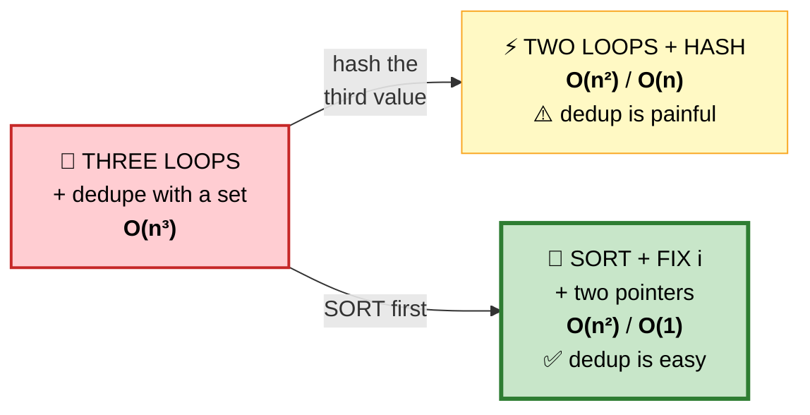

## 💬 The reduction

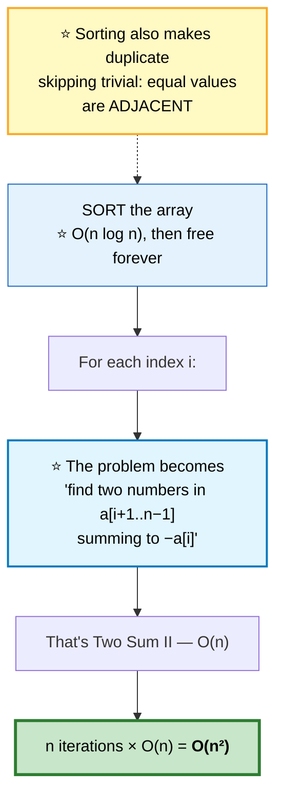

```cpp
vector<vector<int>> threeSum(vector<int>& a) {
    sort(a.begin(), a.end());
    vector<vector<int>> out;
    int n = a.size();

    for (int i = 0; i < n - 2; ++i) {
        if (a[i] > 0) break;                    // ⭐ sorted: no way to reach 0
        if (i > 0 && a[i] == a[i - 1]) continue;   // ⭐ skip duplicate anchors

        int l = i + 1, r = n - 1;
        while (l < r) {
            int sum = a[i] + a[l] + a[r];

            if (sum < 0)      ++l;
            else if (sum > 0) --r;
            else {
                out.push_back({a[i], a[l], a[r]});

                // ⭐⭐ skip duplicates on BOTH sides after recording
                while (l < r && a[l] == a[l + 1]) ++l;
                while (l < r && a[r] == a[r - 1]) --r;
                ++l; --r;
            }
        }
    }
    return out;
}
```

```
   ⭐⭐ THE THREE DEDUPE POINTS — ALL ARE NECESSARY

   ① i > 0 && a[i] == a[i−1]
      Skips a repeated ANCHOR. Without it, [-1,-1,0,1] emits
      the same triplet twice.

   ② after recording, advance l past equal values
   ③ after recording, retreat r past equal values
      Without these, [-2,0,0,2,2] emits [-2,0,2] twice.

   ⚠️ Note ① uses `i > 0`, not `i >= 0` — the FIRST anchor
     must always be tried.
```

```
   ⭐ WHY `if (a[i] > 0) break;` IS VALID
     The array is sorted, so a[l] and a[r] are both ≥ a[i] > 0.
     Three positive numbers can never sum to zero. Everything
     after this point is provably useless.
```

## 📌 Pattern Card
```
SIGNAL   k-sum with k ≥ 3, unique results required
KEY      SORT → fix (k−2) indices → two pointers for the last two
         ⭐ skip duplicates at EVERY level
RELATED  3Sum Closest · 4Sum · 3Sum Smaller · k-Sum generalization
```

---

# 3. 3Sum Closest / 4Sum
🟡 ⚪ **Variations of #2** — identical skeleton, different bookkeeping.

**3Sum Closest** — track the best difference instead of requiring exactly zero:
```cpp
int threeSumClosest(vector<int>& a, int target) {
    sort(a.begin(), a.end());
    int best = a[0] + a[1] + a[2];              // ⭐ seed with a REAL triplet,
                                                //    never INT_MAX (overflow)
    for (int i = 0; i < (int)a.size() - 2; ++i) {
        int l = i + 1, r = a.size() - 1;
        while (l < r) {
            int sum = a[i] + a[l] + a[r];
            if (abs(sum - target) < abs(best - target)) best = sum;

            if (sum == target) return sum;      // ⭐ can't do better
            sum < target ? ++l : --r;
        }
    }
    return best;
}
```

**4Sum** — one more nested loop, one more dedupe level:
```cpp
vector<vector<int>> fourSum(vector<int>& a, int target) {
    sort(a.begin(), a.end());
    vector<vector<int>> out;
    int n = a.size();

    for (int i = 0; i < n - 3; ++i) {
        if (i > 0 && a[i] == a[i-1]) continue;              // ⭐ dedupe level 1
        for (int j = i + 1; j < n - 2; ++j) {
            if (j > i + 1 && a[j] == a[j-1]) continue;      // ⭐ dedupe level 2

            int l = j + 1, r = n - 1;
            while (l < r) {
                long long sum = (long long)a[i] + a[j] + a[l] + a[r];  // ⚠️ overflow
                if (sum < target) ++l;
                else if (sum > target) --r;
                else {
                    out.push_back({a[i], a[j], a[l], a[r]});
                    while (l < r && a[l] == a[l+1]) ++l;
                    while (l < r && a[r] == a[r-1]) --r;
                    ++l; --r;
                }
            }
        }
    }
    return out;
}
```
⚠️ **`long long` is mandatory in 4Sum** — four `int`s near `INT_MAX` overflow.

⭐ **The general k-Sum:** recurse, reducing k by one each level, until k == 2 where you use two pointers. That gives **O(n^(k−1))**.

---

# 4. Container With Most Water

🟡 **Medium** · 🔵 Full ladder · ⭐ **Greedy pointer movement with a proof**

> Two lines and the x-axis form a container. Maximize the water held.

## 🗺️ Approach Ladder

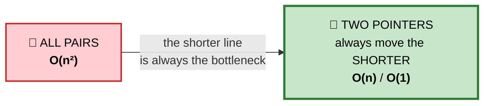

## 💬 Why moving the shorter line is provably safe

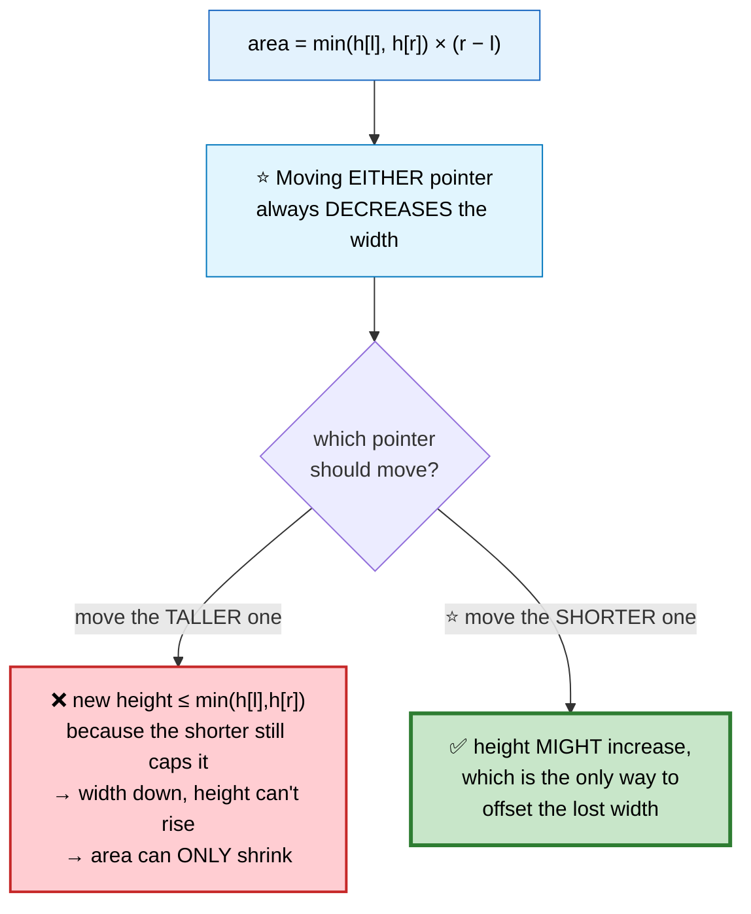

```
   ⭐⭐ THE FORMAL ARGUMENT

   Say h[l] < h[r]. Consider EVERY pair (l, x) for x < r.
   All have width smaller than (r − l), and height
   at most h[l] — which is what we already measured.

   ⭐ So every remaining pair involving l is ≤ what we just
     computed. Discarding l loses nothing. ∎
```

```
   TRACE  h = [1, 8, 6, 2, 5, 4, 8, 3, 7]

   ┌─────┬─────┬────────────────┬──────────────────────┐
   │  l  │  r  │  area          │ action               │
   ├─────┼─────┼────────────────┼──────────────────────┤
   │ 0(1)│ 8(7)│ min(1,7)×8 = 8 │ h[l] smaller → ++l   │
   │ 1(8)│ 8(7)│ min(8,7)×7 =⭐49│ h[r] smaller → −−r   │
   │ 1(8)│ 7(3)│ min(8,3)×6 = 18│ h[r] smaller → −−r   │
   │ 1(8)│ 6(8)│ min(8,8)×5 = 40│ tie → move either    │
   │ ... │     │                │                      │
   └─────┴─────┴────────────────┴──────────────────────┘
   ⭐ ANSWER: 49
```

```cpp
int maxArea(vector<int>& h) {
    int l = 0, r = h.size() - 1, best = 0;

    while (l < r) {
        best = max(best, min(h[l], h[r]) * (r - l));
        h[l] < h[r] ? ++l : --r;                // ⭐ always move the SHORTER
    }
    return best;
}
```

⚠️ **Do not confuse this with [Trapping Rain Water](#5-trapping-rain-water).** Here the bars have no width and the *interior* is irrelevant — only the two chosen walls matter.

---

# 5. Trapping Rain Water

🔴 **Hard** · 🔵 Full ladder · ⭐ **Four approaches worth knowing**

> How much water is trapped between bars after rain?

```
   ▓ = bar    ░ = trapped water

              █
      █ ░ ░ ░ █ █ ░ █
    █ █ ░ █ █ █ █ █ █ █
   [0,1,0,2,1,0,1,3,2,1,2,1]  →  6 units
```

## 🗺️ Approach Ladder

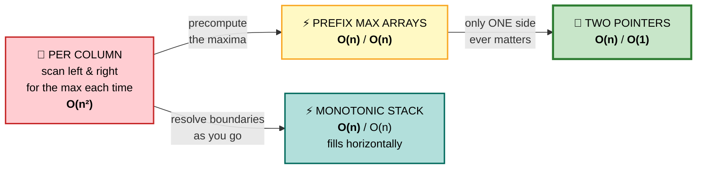

## 💬 The governing formula

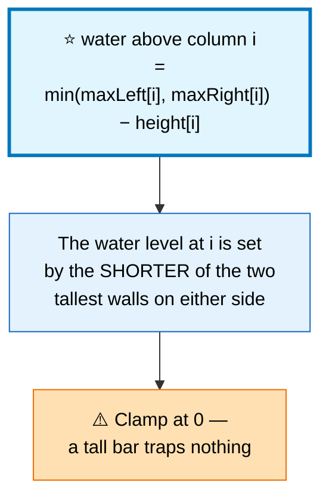

```
   COLUMN-BY-COLUMN for [0,1,0,2,1,0,1,3,2,1,2,1]

   i:          0  1  2  3  4  5  6  7  8  9 10 11
   height:     0  1  0  2  1  0  1  3  2  1  2  1
   maxLeft:    0  1  1  2  2  2  2  3  3  3  3  3
   maxRight:   3  3  3  3  3  3  3  3  2  2  2  1
   min:        0  1  1  2  2  2  2  3  2  2  2  1
   − height:   0  0 ⭐1  0 ⭐1 ⭐2 ⭐1  0  0 ⭐1  0  0
                                                    ⭐ TOTAL = 6 ✅
```

## 2️⃣ Prefix Max Arrays — O(n) space
```cpp
int trap(vector<int>& h) {
    int n = h.size();
    if (n < 3) return 0;

    vector<int> L(n), R(n);
    L[0] = h[0];
    for (int i = 1; i < n; ++i)     L[i] = max(L[i-1], h[i]);
    R[n-1] = h[n-1];
    for (int i = n-2; i >= 0; --i)  R[i] = max(R[i+1], h[i]);

    int total = 0;
    for (int i = 0; i < n; ++i) total += min(L[i], R[i]) - h[i];
    return total;
}
```
✅ Clear and easy to defend. ⚠️ But O(n) space invites the follow-up.

## 3️⃣ Two Pointers — ⭐ OPTIMAL, O(1) space

#### 💬 The insight
You don't need *both* exact maxima. If `leftMax < rightMax`, then the water at `l` is decided by `leftMax` alone — because whatever the true right maximum is, it's at least `rightMax`, which is already bigger.

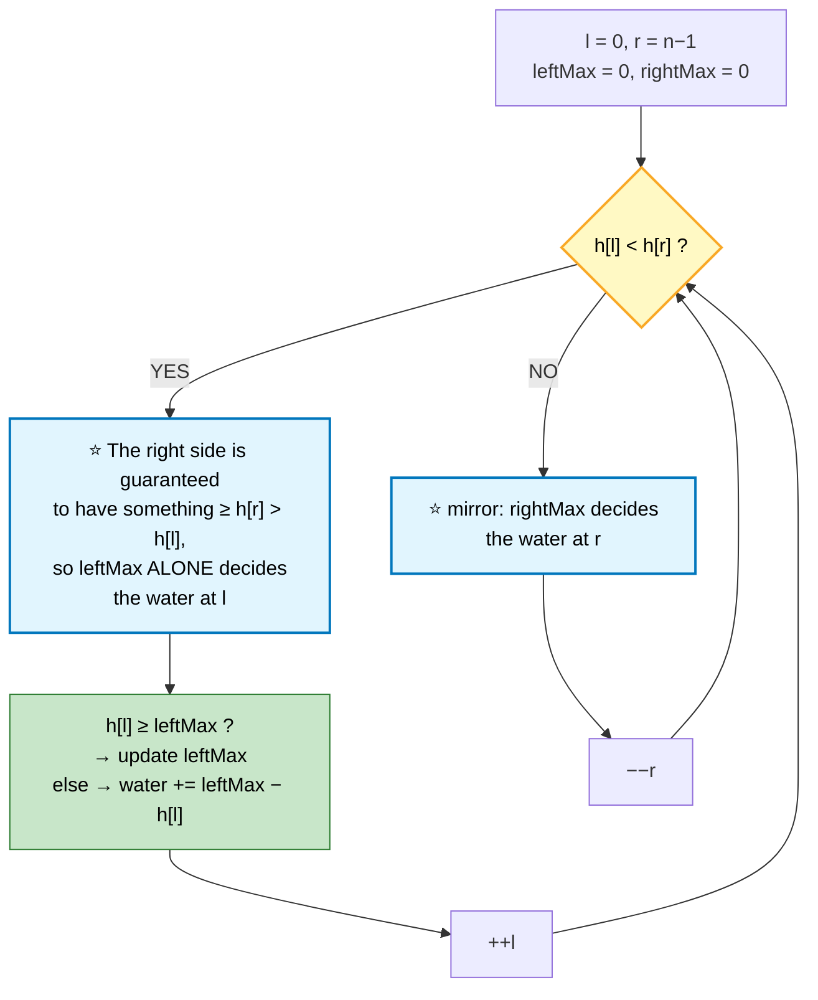

```cpp
int trap(vector<int>& h) {
    int l = 0, r = h.size() - 1;
    int leftMax = 0, rightMax = 0, total = 0;

    while (l < r) {
        if (h[l] < h[r]) {
            // ⭐ We KNOW a wall ≥ h[r] > h[l] exists to the right,
            //    so leftMax alone determines the water level here.
            h[l] >= leftMax ? leftMax = h[l] : total += leftMax - h[l];
            ++l;
        } else {
            h[r] >= rightMax ? rightMax = h[r] : total += rightMax - h[r];
            --r;
        }
    }
    return total;
}
```

## 4️⃣ Monotonic Stack — fills **horizontally**

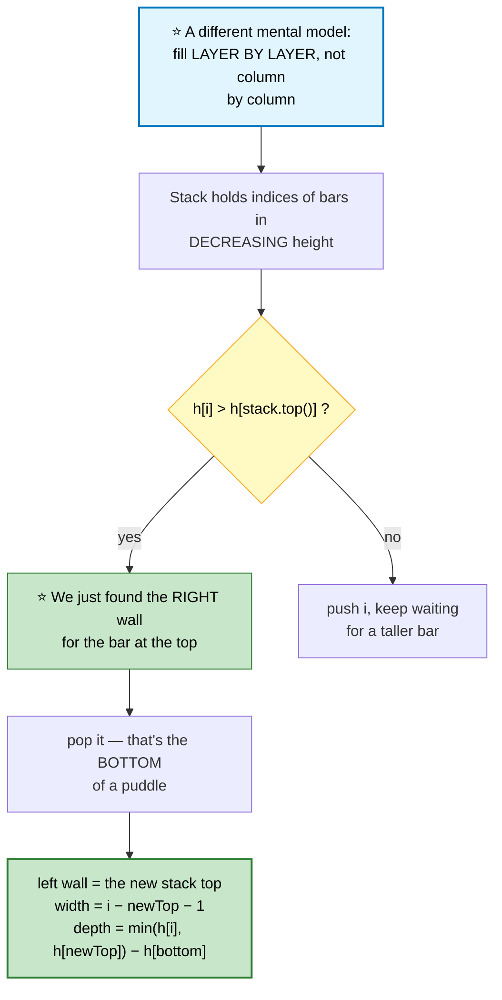

```cpp
int trap(vector<int>& h) {
    stack<int> st;                              // indices, decreasing height
    int total = 0;

    for (int i = 0; i < (int)h.size(); ++i) {
        while (!st.empty() && h[i] > h[st.top()]) {
            int bottom = st.top(); st.pop();
            if (st.empty()) break;              // ⚠️ no left wall → no puddle

            int width = i - st.top() - 1;
            int depth = min(h[i], h[st.top()]) - h[bottom];
            total += width * depth;             // ⭐ one horizontal layer
        }
        st.push(i);
    }
    return total;
}
```

## 📊 Which to present

| Approach | Time | Space | When to use it |
|---|---|---|---|
| Brute force | O(n²) | O(1) | ❌ mention and discard |
| Prefix arrays | O(n) | O(n) | ✅ state this first — it's clearest |
| **Two pointers** | O(n) | **O(1)** | 🏆 **then optimize to this** |
| Monotonic stack | O(n) | O(n) | ⭐ shows range, links to Largest Rectangle |

## 📌 Pattern Card
```
SIGNAL   "water/area bounded by both sides"
KEY      water[i] = min(maxLeft, maxRight) − height[i]
         ⭐ two pointers: the smaller side is always resolvable
RELATED  Container With Most Water · Largest Rectangle · Trapping Rain Water II (heap)
```

---

# 6. Sort Array by Parity / Partition
🟢 ⚪ **Variation of the slow/fast pattern** — see [Sort Colors](01b-arrays-strings.md#22-sort-colors-dutch-national-flag) for the three-way version.

```cpp
// Evens first (order not required) — opposite-end swap
vector<int> sortArrayByParity(vector<int>& a) {
    int l = 0, r = a.size() - 1;
    while (l < r) {
        if (a[l] % 2 > a[r] % 2) swap(a[l], a[r]);   // ⭐ odd left, even right
        if (a[l] % 2 == 0) ++l;
        if (a[r] % 2 == 1) --r;
    }
    return a;
}

// Lomuto partition — the core of quicksort/quickselect
int partition(vector<int>& a, int lo, int hi) {
    int pivot = a[hi], i = lo;
    for (int j = lo; j < hi; ++j)
        if (a[j] < pivot) swap(a[i++], a[j]);   // ⭐ i = boundary of "< pivot"
    swap(a[i], a[hi]);
    return i;
}
```

---

# 7. Longest Substring with At Most K Distinct

🟡 **Medium** · 🔵 Full ladder · ⭐ **The longest-window template**

## 🗺️ Approach Ladder

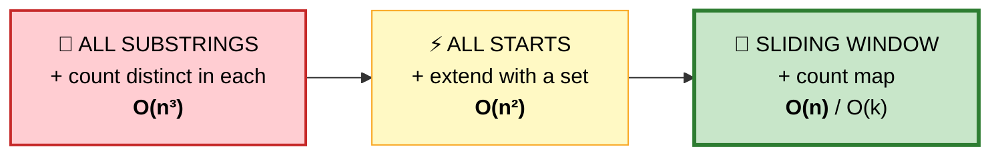

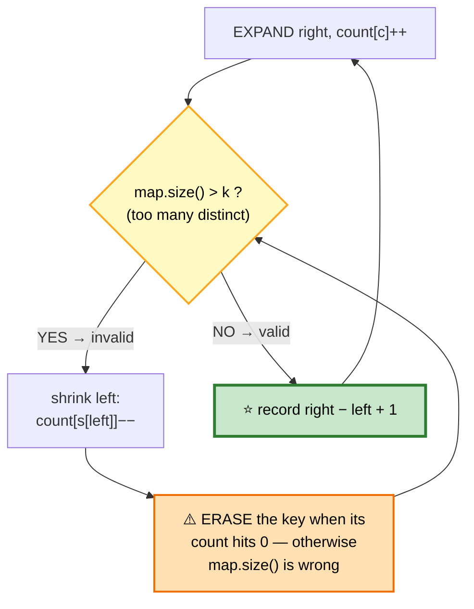

```
   TRACE  s = "eceba", k = 2

   ┌───────┬──────┬──────┬──────────────┬──────────────────┐
   │ right │ char │ left │ window       │ distinct count   │
   ├───────┼──────┼──────┼──────────────┼──────────────────┤
   │   0   │  e   │  0   │ "e"          │ 1 ✅ len 1       │
   │   1   │  c   │  0   │ "ec"         │ 2 ✅ len 2       │
   │   2   │  e   │  0   │ "ece"        │ 2 ✅ ⭐ len 3    │
   │   3   │  b   │  0   │ "eceb"       │ 3 ❌ → shrink    │
   │       │      │  2   │ "eb"         │ 2 ✅ len 2       │
   │   4   │  a   │  2   │ "eba"        │ 3 ❌ → shrink    │
   │       │      │  3   │ "ba"         │ 2 ✅ len 2       │
   └───────┴──────┴──────┴──────────────┴──────────────────┘
   ⭐ ANSWER: 3 ("ece")
```

```cpp
int lengthOfLongestSubstringKDistinct(string s, int k) {
    if (k == 0) return 0;                       // ⚠️ edge case

    unordered_map<char,int> cnt;
    int left = 0, best = 0;

    for (int right = 0; right < (int)s.size(); ++right) {
        cnt[s[right]]++;                        // ① EXPAND

        while ((int)cnt.size() > k) {           // ② SHRINK while invalid
            if (--cnt[s[left]] == 0) cnt.erase(s[left]);   // ⭐⭐ MUST erase
            ++left;
        }

        best = max(best, right - left + 1);     // ③ RECORD (window is valid)
    }
    return best;
}
```

⚠️ **`cnt.erase()` when the count hits zero is essential.** `map.size()` counts *keys*, not nonzero values — leaving a zero entry makes the window look permanently invalid.

## 📌 Pattern Card
```
SIGNAL   LONGEST window satisfying a constraint
KEY      expand always · shrink WHILE invalid · record AFTER the loop
RELATED  Fruit Into Baskets (k=2) · Longest w/o Repeating (k=len)
         Max Consecutive Ones III · Longest Repeating Char Replacement
```

---

# 8. Fruit Into Baskets
🟡 ⚪ **Variation of #7** with `k = 2`. Literally the same code.

```cpp
int totalFruit(vector<int>& fruits) {
    unordered_map<int,int> cnt;
    int left = 0, best = 0;
    for (int right = 0; right < (int)fruits.size(); ++right) {
        cnt[fruits[right]]++;
        while (cnt.size() > 2) {                // ⭐ k = 2
            if (--cnt[fruits[left]] == 0) cnt.erase(fruits[left]);
            ++left;
        }
        best = max(best, right - left + 1);
    }
    return best;
}
```
⭐ **Recognizing the disguise is the skill.** "Two baskets, each holding one fruit type" is exactly "at most 2 distinct values."

---

# 9. Minimum Size Subarray Sum

🟡 **Medium** · 🔵 Full ladder · ⭐ **The shortest-window variant**

> Smallest subarray with sum ≥ `target`. **All values positive.**

## ⚠️ The structural difference from #7

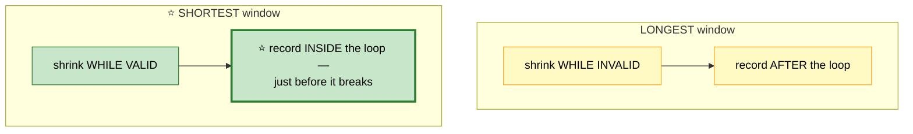

```
   TRACE  a = [2,3,1,2,4,3], target = 7

   ┌───────┬─────┬──────┬──────┬──────────────────────────┐
   │ right │ sum │ left │ len  │ action                   │
   ├───────┼─────┼──────┼──────┼──────────────────────────┤
   │   0   │  2  │  0   │  —   │ < 7                      │
   │   1   │  5  │  0   │  —   │ < 7                      │
   │   2   │  6  │  0   │  —   │ < 7                      │
   │   3   │  8  │  0   │  4   │ ⭐ ≥7 → record, shrink   │
   │       │  6  │  1   │      │ < 7 → stop shrinking     │
   │   4   │ 10  │  1   │  4   │ ≥7 → record, shrink      │
   │       │  7  │  2   │  3   │ ⭐ ≥7 → record, shrink   │
   │       │  6  │  3   │      │ < 7 → stop               │
   │   5   │  9  │  3   │  3   │ ≥7 → shrink              │
   │       │  7  │  4   │  2   │ ⭐ ≥7 → record! shrink   │
   │       │  3  │  5   │      │ < 7 → stop               │
   └───────┴─────┴──────┴──────┴──────────────────────────┘
   ⭐ ANSWER: 2  ([4,3])
```

```cpp
int minSubArrayLen(int target, vector<int>& a) {
    int left = 0, best = INT_MAX;
    long long sum = 0;

    for (int right = 0; right < (int)a.size(); ++right) {
        sum += a[right];                        // ① EXPAND

        while (sum >= target) {                 // ② ⭐ shrink WHILE VALID
            best = min(best, right - left + 1); // ③ ⭐ record INSIDE
            sum -= a[left++];
        }
    }
    return best == INT_MAX ? 0 : best;
}
```

⚠️ **All values must be positive** for the window to work. With negatives, use prefix sums plus a monotonic deque — the same reason [Subarray Sum Equals K](02-hashing.md#2-subarray-sum-equals-k) needs a hash map.

🎤 **Follow-up: O(n log n)?** Binary search on the prefix-sum array — for each `right`, binary search for the largest `left` with `prefix[right] − prefix[left] ≥ target`. Slower, but a good demonstration that you see prefix sums as a sorted structure.

---

# 10. Minimum Window Substring

🔴 **Hard** · 🔵 Full ladder · ⭐ **The `missing` counter**

> Smallest substring of `s` containing **all** characters of `t`, including duplicates.

## 🗺️ Approach Ladder

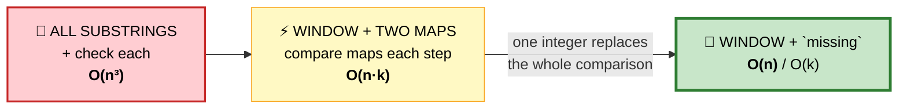

## 💬 The trick: one counter, not two maps

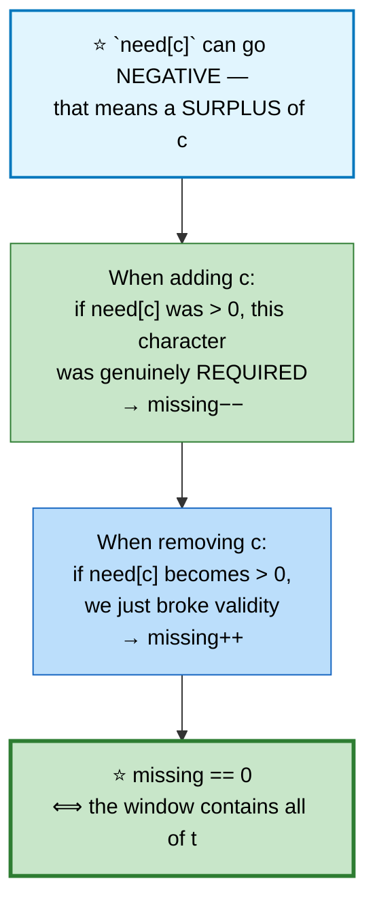

```
   ⭐⭐ WHY THE SIGN TEST WORKS

   need[c] starts at "how many copies of c we require."

   ADDING c:  need[c]-- happens either way, but we only
     decrement `missing` if need[c] WAS > 0 — i.e. this copy
     filled a real requirement, not a surplus.

   REMOVING c: need[c]++ happens either way, but we only
     increment `missing` if need[c] BECAME > 0 — i.e. we
     removed a copy we actually needed, not a spare.

   ⭐ One integer replaces an entire map-vs-map comparison.
```

```
   TRACE  s = "ADOBECODEBANC", t = "ABC"

   need = {A:1, B:1, C:1}, missing = 3

   ┌────────────────────┬─────────┬────────────────────────┐
   │ window             │ missing │ note                   │
   ├────────────────────┼─────────┼────────────────────────┤
   │ A                  │    2    │                        │
   │ ADOBEC             │  ⭐ 0   │ VALID → len 6, shrink  │
   │ DOBEC              │    1    │ lost A → invalid       │
   │ DOBECODEBA         │  ⭐ 0   │ VALID → len 10         │
   │ ODEBA... → BANC    │  ⭐ 0   │ ⭐ VALID → len 4 BEST  │
   └────────────────────┴─────────┴────────────────────────┘
   ⭐ ANSWER: "BANC"
```

```cpp
string minWindow(string s, string t) {
    if (t.empty() || s.size() < t.size()) return "";

    vector<int> need(128, 0);
    for (char c : t) need[c]++;

    int missing = t.size(), left = 0, bestL = 0, bestLen = INT_MAX;

    for (int right = 0; right < (int)s.size(); ++right) {
        // ⭐ post-decrement: test the value BEFORE the change
        if (need[s[right]]-- > 0) --missing;

        while (missing == 0) {                  // ⭐ valid → shrink
            if (right - left + 1 < bestLen) {
                bestLen = right - left + 1;
                bestL = left;
            }
            // ⭐ pre-increment: test the value AFTER the change
            if (++need[s[left++]] > 0) ++missing;
        }
    }
    return bestLen == INT_MAX ? "" : s.substr(bestL, bestLen);
}
```

⭐ **The `--` vs `++` placement is the entire algorithm.** Post-decrement on entry (was it needed?), pre-increment on exit (is it needed now?).

## 📌 Pattern Card
```
SIGNAL   SHORTEST window containing a required multiset
KEY      ⭐ a single `missing` counter · negative counts mean surplus
         shrink WHILE valid, record INSIDE
RELATED  Permutation in String · Find All Anagrams · Substring w/ Concatenation
```

---

# 11. Permutation in String
🟡 ⚪ **Variation of #10** — the window is **fixed size**, so there's no shrink loop.

```cpp
bool checkInclusion(string p, string s) {
    if (p.size() > s.size()) return false;

    int need[26] = {}, win[26] = {};
    for (char c : p) need[c - 'a']++;

    int k = p.size();
    for (int i = 0; i < (int)s.size(); ++i) {
        win[s[i] - 'a']++;
        if (i >= k) win[s[i - k] - 'a']--;       // ⭐ evict exactly one

        if (i >= k - 1 && equal(need, need + 26, win)) return true;
    }
    return false;
}
```
⭐ **Fixed-size windows never need a `while` loop** — one element in, one element out, every step.

---

# 12. Sliding Window Maximum

🔴 **Hard** · 🔵 Full ladder · ⭐ **Monotonic deque**

> Maximum of every window of size `k`.

## 🗺️ Approach Ladder

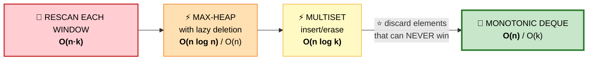

## 💬 The key insight

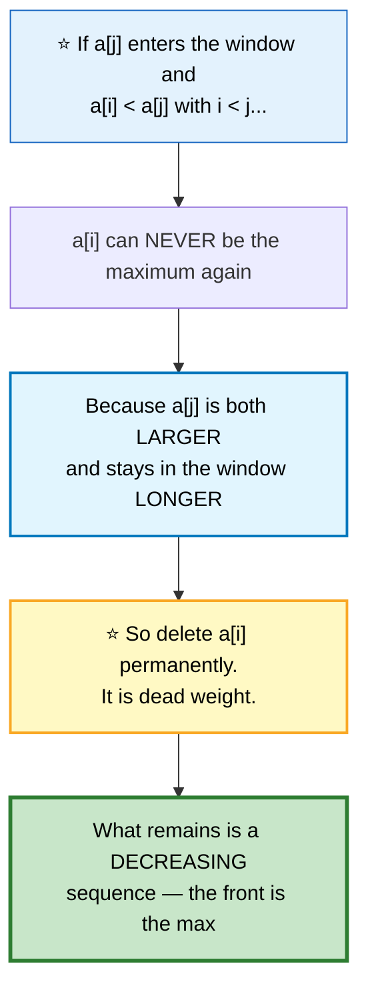

```
   TRACE  a = [1,3,-1,-3,5,3,6,7], k = 3
   (deque holds INDICES; values shown for clarity)

   ┌───┬────┬───────────────┬──────────────────────────────┬─────┐
   │ i │ a  │ deque (vals)  │ action                       │ out │
   ├───┼────┼───────────────┼──────────────────────────────┼─────┤
   │ 0 │  1 │ [1]           │ push                         │     │
   │ 1 │  3 │ [3]           │ ⭐ 3 > 1 → pop 1, push 3     │     │
   │ 2 │ −1 │ [3,−1]        │ −1 < 3 → push                │  3  │
   │ 3 │ −3 │ [3,−1,−3]     │ push                         │  3  │
   │ 4 │  5 │ [5]           │ ⭐ 5 beats ALL → pop 3 times │  5  │
   │ 5 │  3 │ [5,3]         │ push                         │  5  │
   │ 6 │  6 │ [6]           │ ⭐ 6 beats all               │  6  │
   │ 7 │  7 │ [7]           │ ⭐ 7 beats all               │  7  │
   └───┴────┴───────────────┴──────────────────────────────┴─────┘
   ANSWER: [3,3,5,5,6,7] ✅
```

```cpp
vector<int> maxSlidingWindow(vector<int>& a, int k) {
    deque<int> dq;                              // ⭐ INDICES, values decreasing
    vector<int> out;

    for (int i = 0; i < (int)a.size(); ++i) {
        // ① evict indices that have fallen out of the window
        if (!dq.empty() && dq.front() <= i - k) dq.pop_front();

        // ② ⭐ evict everything smaller — they can never win again
        while (!dq.empty() && a[dq.back()] <= a[i]) dq.pop_back();

        dq.push_back(i);

        // ③ the front is the window maximum
        if (i >= k - 1) out.push_back(a[dq.front()]);
    }
    return out;
}
```

```
   ⭐ WHY O(n) DESPITE THE INNER WHILE LOOP

   Every index is pushed EXACTLY ONCE and popped AT MOST ONCE.
   Total deque operations ≤ 2n → amortized O(1) per step.

   ⭐ This is the same amortization argument as the monotonic
     stack in Largest Rectangle and Next Greater Element.
```

⭐ **Store indices, not values.** You need the index to know when an element expires from the window.

## 📌 Pattern Card
```
SIGNAL   min/max over every fixed-size window
KEY      ⭐ monotonic deque; discard elements that can never win
RELATED  Shortest Subarray with Sum ≥ K (deque + prefix sums)
         Jump Game VI · Constrained Subsequence Sum
```

---

# 13. Max Consecutive Ones III
🟡 ⚪ **Variation of #7** — the constraint is "at most k zeros in the window."

```cpp
int longestOnes(vector<int>& a, int k) {
    int left = 0, zeros = 0, best = 0;
    for (int right = 0; right < (int)a.size(); ++right) {
        if (a[right] == 0) ++zeros;             // ① EXPAND
        while (zeros > k) {                     // ② shrink while invalid
            if (a[left] == 0) --zeros;
            ++left;
        }
        best = max(best, right - left + 1);     // ③ record
    }
    return best;
}
```
⭐ **"Flip at most k zeros" is just "window containing at most k zeros"** — the flipping is a narrative device, not an operation you perform.

---

# 14. Subarrays with K Different Integers

🔴 **Hard** · 🔵 Full ladder · ⭐ **atMost(K) − atMost(K−1)**

> Count subarrays with **exactly** K distinct integers.

## ⚠️ Why the standard window fails

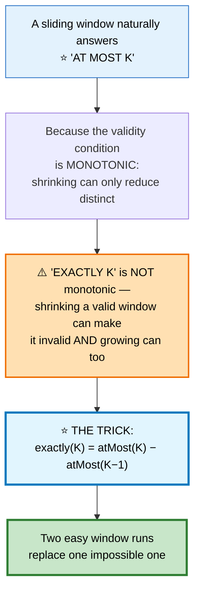

```
   ⭐⭐ WHY COUNTING WORKS THIS WAY

   In a valid window [left..right], the number of subarrays
   ENDING AT `right` that are also valid is exactly
       right − left + 1
   (choose any start from left to right).

   ⭐ Summing that over all `right` counts every valid subarray
     exactly once, with no double counting.

   Then:
     subarrays with ≤ K distinct
   − subarrays with ≤ K−1 distinct
   = subarrays with EXACTLY K distinct  ∎
```

```cpp
int atMost(vector<int>& a, int k) {
    unordered_map<int,int> cnt;
    int left = 0, total = 0;

    for (int right = 0; right < (int)a.size(); ++right) {
        if (cnt[a[right]]++ == 0) --k;          // ⭐ a new distinct value

        while (k < 0) {                         // too many distinct → shrink
            if (--cnt[a[left]] == 0) ++k;
            ++left;
        }

        total += right - left + 1;              // ⭐⭐ the counting line
    }
    return total;
}

int subarraysWithKDistinct(vector<int>& a, int k) {
    return atMost(a, k) - atMost(a, k - 1);     // ⭐ the whole trick
}
```

⭐ **This decomposition generalizes.** Any "exactly X" counting problem where "at most X" is windowable: *Count Nice Subarrays* (exactly k odds), *Binary Subarrays With Sum*, *Count Subarrays With Fixed Bounds*.

## 📌 Pattern Card
```
SIGNAL   COUNT subarrays with EXACTLY some property
KEY      ⭐ exactly(K) = atMost(K) − atMost(K−1)
         ⭐ each valid window contributes (right − left + 1)
RELATED  Count Nice Subarrays · Binary Subarrays With Sum
```

---

# 15. Linked List Cycle (Floyd's)

🟡 **Medium** · 🔵 Full ladder · ⭐ **Tortoise and hare, with the maths**

## 🗺️ Approach Ladder

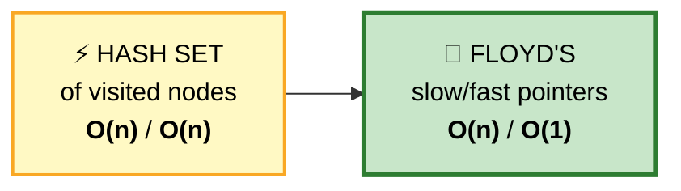

## 💬 Part 1 — detecting the cycle

```mermaid
flowchart TD
    A["slow moves 1 step<br/>fast moves 2 steps"] --> B{"do they meet?"}
    B -->|"yes"| C(["⭐ cycle exists"])
    B -->|"fast hits null"| D(["no cycle"])

    N["⭐ WHY THEY MUST MEET:<br/>inside the loop, fast gains exactly<br/>ONE position on slow per step.<br/>The gap shrinks 1 per step and<br/>can never jump over zero."] -.-> B

    style B fill:#fff9c4,stroke:#f9a825,color:#000
    style C fill:#c8e6c9,stroke:#2e7d32,stroke-width:3px,color:#000
    style D fill:#bbdefb,stroke:#1565c0,color:#000
    style N fill:#e1f5fe,stroke:#0277bd,stroke-width:2px,color:#000
```

## ⭐ Part 2 — finding the cycle's entry point

```
   ⭐⭐ THE ALGEBRA — worth being able to derive

        F           C = cycle length
   ┌────────┐    ┌──────────────┐
   head ──→ ENTRY ──→ ... ──→ MEET ──┐
              ▲                       │
              └───────────────────────┘
        F = distance head → entry
        a = distance entry → meeting point

   When they meet:
     slow travelled:  F + a
     fast travelled:  F + a + nC       (n full extra loops)
     fast = 2 × slow:
        F + a + nC = 2(F + a)
        nC = F + a
        ⭐ F = nC − a

   INTERPRETATION
     Starting from `head` and walking F steps lands on ENTRY.
     Starting from `meet` and walking F steps also lands on
     ENTRY (because nC − a steps from meet wraps around n
     times and lands exactly at entry).

   ⭐⭐ THEREFORE: reset one pointer to head, advance both
     ONE step at a time — they meet exactly at the entry. ∎
```

```cpp
bool hasCycle(ListNode* head) {
    ListNode *slow = head, *fast = head;
    while (fast && fast->next) {
        slow = slow->next;
        fast = fast->next->next;
        if (slow == fast) return true;
    }
    return false;
}

ListNode* detectCycle(ListNode* head) {
    ListNode *slow = head, *fast = head;

    while (fast && fast->next) {
        slow = slow->next;
        fast = fast->next->next;

        if (slow == fast) {                     // ⭐ phase 2
            ListNode* p = head;
            while (p != slow) { p = p->next; slow = slow->next; }
            return p;                           // ⭐ the entry node
        }
    }
    return nullptr;
}
```

⚠️ **Both pointers start at `head`**, and the meeting check happens *after* moving. Starting `fast` at `head->next` breaks the algebra above.

## 📌 Pattern Card
```
SIGNAL   cycle detection · middle of a list · O(1) space required
KEY      slow=1x, fast=2x · reset to head, walk 1x → cycle entry
RELATED  Find the Duplicate Number · Happy Number · Middle of Linked List
```

---

# 16. Find the Duplicate Number
🟡 ⚪ **Variation of #15** — Floyd's applied to an **array**, which is the clever part.

```mermaid
flowchart TD
    A["n+1 numbers, each in [1, n]<br/>⚠️ read-only, O(1) space"] --> B["⭐ Treat the array as a<br/>FUNCTION: i → a[i]"]
    B --> C["Following indices creates a<br/>linked list, since every value<br/>is a valid index"]
    C --> D["⭐ A duplicate value means TWO<br/>indices point to the same place<br/>→ that's a CYCLE ENTRY"]
    D --> E["Run Floyd's → the entry node<br/>IS the duplicate"]

    style B fill:#e1f5fe,stroke:#0277bd,stroke-width:2px,color:#000
    style D fill:#fff9c4,stroke:#f9a825,stroke-width:2px,color:#000
    style E fill:#c8e6c9,stroke:#2e7d32,stroke-width:3px,color:#000
```

```cpp
int findDuplicate(vector<int>& a) {
    int slow = a[0], fast = a[0];

    do {                                        // ⭐ do-while: they start equal
        slow = a[slow];
        fast = a[a[fast]];
    } while (slow != fast);

    slow = a[0];                                // ⭐ phase 2 — same as #15
    while (slow != fast) { slow = a[slow]; fast = a[fast]; }
    return slow;
}
```

⭐ **Why `do-while`:** both start at `a[0]`, so a `while` loop would exit immediately. This is the classic bug in the array version.

⭐ **The alternative:** binary search on the *value* range using the pigeonhole principle — count how many values are ≤ mid. O(n log n), but it doesn't modify the array either and is easier to explain.

---

## 📋 Two Pointers & Sliding Window Recall

```mermaid
mindmap
  root(("Two Pointers<br/>&amp; Windows"))
    Opposite Ends
      requires SORTED input
      comparison says which to move
      each move kills a whole row
      3Sum: fix one, two-point rest
    Window Variants
      LONGEST: shrink while INVALID
      SHORTEST: shrink while VALID
      FIXED: no while loop
      ⭐ where you record differs
    Counters
      `missing` beats map-vs-map
      erase zero-count keys!
      `matched` for fixed windows
    Counting
      ⭐ exactly K = atMost K − atMost K−1
      window contributes right−left+1
    Monotonic Deque
      discard what can never win
      store INDICES for expiry
      amortized O(1) per element
    Fast/Slow
      cycle detection
      ⭐ F = nC − a → reset to head
      array-as-function trick
```

```
╔══════════════════════════════════════════════════════════════════════╗
║          TWO POINTERS & SLIDING WINDOW — PATTERN RECALL              ║
╠══════════════════════════════════════════════════════════════════════╣
║ "sorted + find a pair"          → l/r opposite ends                  ║
║ "k-sum, unique triplets"        → sort, fix k−2, two-point the rest  ║
║ "max area between two lines"    → ⭐ always move the SHORTER wall     ║
║ "water trapped"                 → min(maxL,maxR) − h[i]              ║
║ "longest window, constraint"    → shrink while INVALID, record after ║
║ "shortest window, constraint"   → ⭐ shrink while VALID, record inside║
║ "window contains all of t"      → ⭐ single `missing` counter         ║
║ "max of every k-window"         → ⭐ monotonic DEQUE                  ║
║ "count subarrays exactly K"     → ⭐ atMost(K) − atMost(K−1)          ║
║ "cycle / duplicate, O(1) space" → ⭐ Floyd's, then reset to head      ║
╠══════════════════════════════════════════════════════════════════════╣
║ ⚠️ TRAPS                                                              ║
║   3Sum: three separate dedupe points, all required                   ║
║   K-distinct: ERASE zero-count keys or map.size() lies               ║
║   min subarray sum: only valid for POSITIVE values                   ║
║   deque: store INDICES, not values — you need expiry                 ║
║   Find Duplicate: do-while, not while — both start at a[0]           ║
║   4Sum: use long long, four ints overflow                            ║
╚══════════════════════════════════════════════════════════════════════╝
```

---

**Next:** [Linked Lists →](04-linked-lists.md) · **Back:** [Hashing](02-hashing.md)
