# 🔗 Linked Lists

> Linked lists test one thing: **can you manipulate pointers without losing your grip on the list?** Almost every bug is a lost reference or an unhandled head/tail case.

**Prerequisite:** [Patterns & Foundations](00-patterns.md) · **Format:** [see the sample](FORMAT-SAMPLE.md)

---

## 🧠 The Four Techniques That Solve Almost Everything

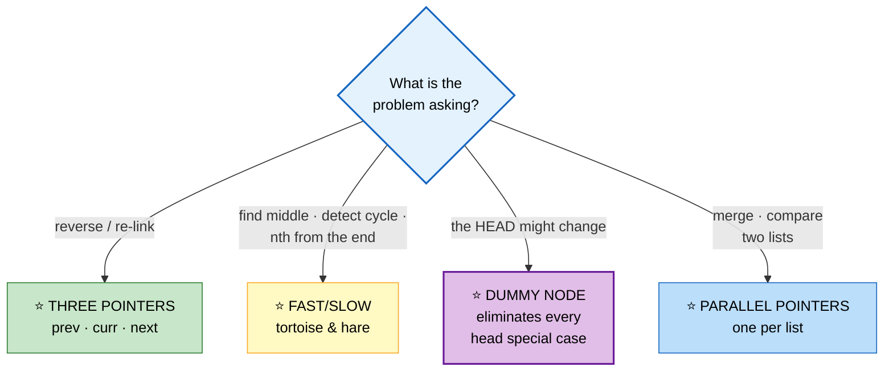

## ⭐ The Dummy Node — Use It Reflexively

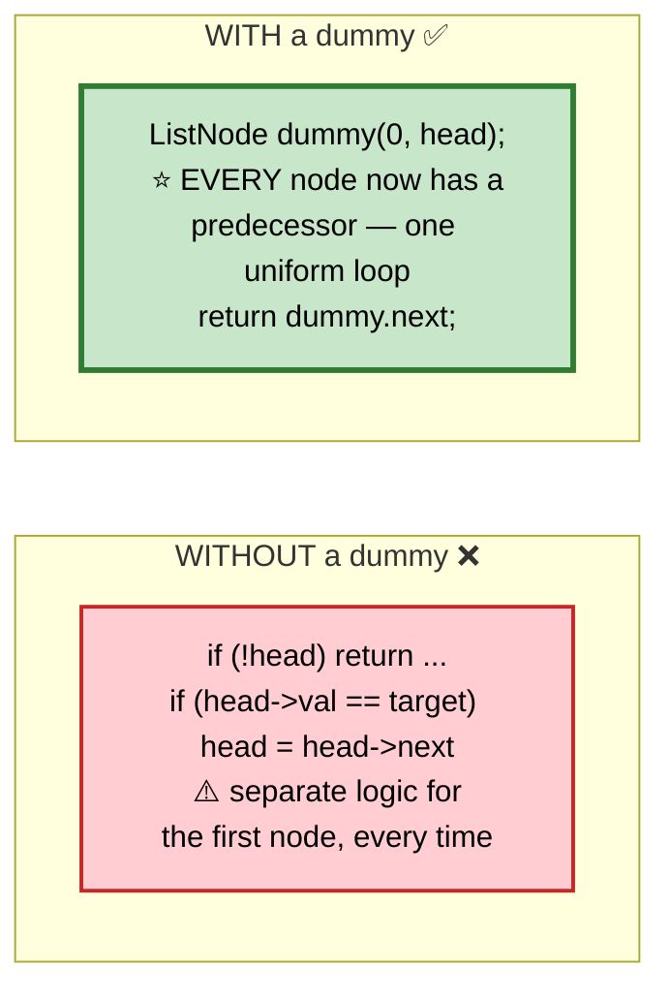

```cpp
struct ListNode {
    int val;
    ListNode* next;
    ListNode(int v = 0, ListNode* n = nullptr) : val(v), next(n) {}
};
```

---

## 📑 Contents

| # | Problem | Diff | Type | Optimal |
|---|---|---|---|---|
| [1](#1-reverse-linked-list) | Reverse Linked List | 🟢 | 🔵 **Full** | O(n)/O(1) three pointers |
| [2](#2-reverse-linked-list-ii-sublist) | Reverse Linked List II | 🟡 | ⚪ Variation | dummy + splice back |
| [3](#3-reverse-nodes-in-k-group) | Reverse Nodes in k-Group | 🔴 | ⚪ Variation | reverse in blocks |
| [4](#4-merge-two-sorted-lists) | Merge Two Sorted Lists | 🟢 | 🔵 **Full** | O(n+m) dummy + weave |
| [5](#5-merge-k-sorted-lists) | Merge k Sorted Lists | 🔴 | 🔵 **Full** | O(N log k) heap or divide |
| [6](#6-remove-nth-node-from-end) | Remove Nth From End | 🟡 | 🔵 **Full** | one-pass gap technique |
| [7](#7-middle-of-the-linked-list) | Middle of the Linked List | 🟢 | ⚪ Variation | fast/slow |
| [8](#8-linked-list-cycle--entry) | Linked List Cycle + Entry | 🟡 | ⚪ Variation | Floyd's — see [here](03-two-pointers-sliding-window.md#15-linked-list-cycle-floyds) |
| [9](#9-palindrome-linked-list) | Palindrome Linked List | 🟢 | 🔵 **Full** | O(1) space: find mid + reverse |
| [10](#10-reorder-list) | Reorder List | 🟡 | ⚪ Variation | split + reverse + weave |
| [11](#11-intersection-of-two-linked-lists) | Intersection of Two Lists | 🟢 | 🔵 **Full** | ⭐ pointer-swap trick |
| [12](#12-add-two-numbers) | Add Two Numbers | 🟡 | 🔵 **Full** | carry propagation |
| [13](#13-add-two-numbers-ii-forward-order) | Add Two Numbers II | 🟡 | ⚪ Variation | stacks or reverse |
| [14](#14-remove-duplicates-from-sorted-list-iii) | Remove Duplicates I / II | 🟡 | 🔵 **Full** | dummy + skip-all |
| [15](#15-odd-even-linked-list) | Odd Even Linked List | 🟡 | ⚪ Variation | two chains, then join |
| [16](#16-rotate-list) | Rotate List | 🟡 | ⚪ Variation | make a ring, then cut |
| [17](#17-partition-list) | Partition List | 🟡 | ⚪ Variation | two dummies |
| [18](#18-sort-list) | Sort List | 🟡 | 🔵 **Full** | O(n log n) merge sort |
| [19](#19-flatten-a-multilevel-doubly-linked-list) | Flatten Multilevel List | 🟡 | 🔵 **Full** | stack or in-place splice |
| [20](#20-lru-cache-design) | LRU Cache | 🟡 | ⚪ Variation | see [Hashing #3](02-hashing.md#3-lru-cache) |

---

# 1. Reverse Linked List

🟢 **Easy** · 🔵 Full ladder · ⭐ **The most important linked-list primitive**

> Reverse `1 → 2 → 3 → 4 → 5` into `5 → 4 → 3 → 2 → 1`.

## 🗺️ Approach Ladder

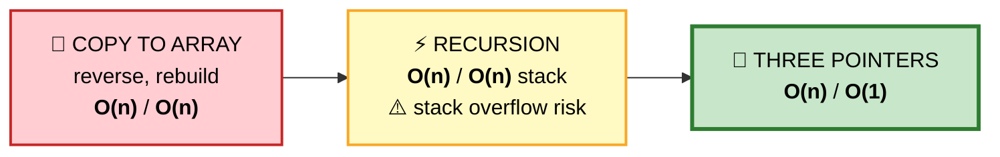

## 💬 Why three pointers, not two

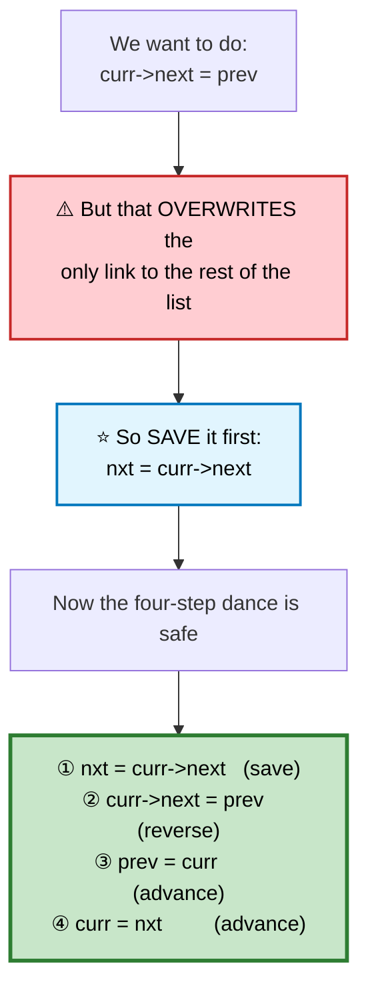

```
   THE DANCE, STEP BY STEP

   START
     prev=∅   curr=1 → 2 → 3 → ∅

   ① save nxt = 2
     prev=∅   curr=1 → 2 → 3 → ∅
                       ▲
                      nxt

   ② curr->next = prev
     ∅ ← 1     2 → 3 → ∅        ⭐ link flipped
       prev? no — prev is still ∅
              curr=1

   ③④ advance both
     ∅ ← 1     curr=2 → 3 → ∅
         prev

   REPEAT →  ∅ ← 1 ← 2     curr=3
   REPEAT →  ∅ ← 1 ← 2 ← 3     curr=∅  → STOP

   ⭐ prev is the new head. curr is always null at the end.
```

```cpp
ListNode* reverseList(ListNode* head) {
    ListNode* prev = nullptr;
    ListNode* curr = head;

    while (curr) {
        ListNode* nxt = curr->next;   // ① ⭐ SAVE before destroying
        curr->next = prev;            // ② reverse the link
        prev = curr;                  // ③ advance prev
        curr = nxt;                   // ④ advance curr
    }
    return prev;                      // ⭐ prev, NOT curr — curr is null
}
```

⚠️ **Returning `curr` instead of `prev`** is the single most common bug. `curr` is always `nullptr` when the loop exits.

## 🔁 The recursive version — worth understanding

```cpp
ListNode* reverseList(ListNode* head) {
    if (!head || !head->next) return head;      // ⭐ base: 0 or 1 node

    ListNode* newHead = reverseList(head->next);   // reverse the rest first

    head->next->next = head;    // ⭐ the next node points BACK at us
    head->next = nullptr;       // ⚠️ break the old forward link, or you
                                //    create a 2-cycle
    return newHead;             // ⭐ unchanged all the way up the stack
}
```

```
   ⭐ THE KEY LINE: head->next->next = head

   If head is 1 and head->next is 2, then after the recursive
   call the sublist is  ∅ ← 2 ← 3.
   `head->next` still points at 2, so `head->next->next = head`
   makes 2 point back to 1.

   ⚠️ Then head->next = nullptr, or 1 ⇄ 2 becomes an infinite loop.
```

## ⚠️ Edge Cases

| Input | Output | Note |
|---|---|---|
| `nullptr` | `nullptr` | loop never runs, returns `prev = nullptr` ✅ |
| `[1]` | `[1]` | one iteration, `prev` becomes node 1 ✅ |
| `[1,2]` | `[2,1]` | the minimal real case |

## 📌 Pattern Card
```
SIGNAL   reverse · re-link · flip direction
KEY      prev/curr/nxt — ALWAYS save nxt first
         ⭐ return prev
RELATED  Reverse II · k-Group · Palindrome List · Reorder List
```

---

# 2. Reverse Linked List II (Sublist)
🟡 ⚪ **Variation of #1** — reverse positions `left..right` only.

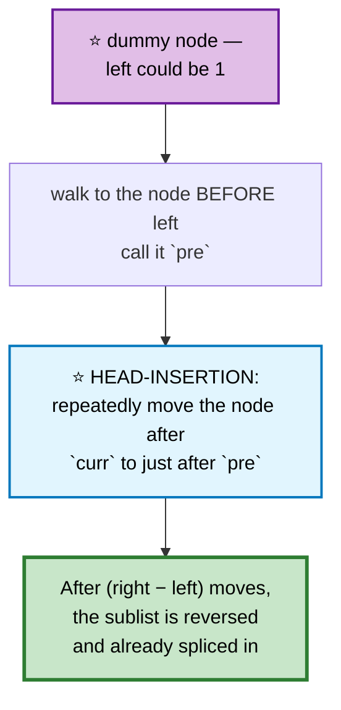

```
   HEAD-INSERTION on 1 → 2 → 3 → 4 → 5, left=2, right=4

   pre=1, curr=2
   move 3 after pre:   1 → 3 → 2 → 4 → 5
   move 4 after pre:   1 → 4 → 3 → 2 → 5   ⭐ done, already spliced
```

```cpp
ListNode* reverseBetween(ListNode* head, int left, int right) {
    ListNode dummy(0, head);
    ListNode* pre = &dummy;

    for (int i = 1; i < left; ++i) pre = pre->next;   // ⭐ node before `left`

    ListNode* curr = pre->next;
    for (int i = 0; i < right - left; ++i) {
        ListNode* move = curr->next;                 // the node to relocate
        curr->next = move->next;                     // unlink it
        move->next = pre->next;                      // ⭐ insert after pre
        pre->next  = move;
    }
    return dummy.next;
}
```
⭐ **`curr` never moves** — it slides backward relative to the others as nodes are pulled in front of it.

---

# 3. Reverse Nodes in k-Group
🔴 ⚪ **Variation of #1** — reverse each block of k, leave a short tail alone.

```cpp
ListNode* reverseKGroup(ListNode* head, int k) {
    // ⭐ First CHECK that k nodes remain — don't reverse a partial group
    ListNode* check = head;
    for (int i = 0; i < k; ++i) {
        if (!check) return head;                // fewer than k → leave as-is
        check = check->next;
    }

    // reverse exactly k nodes
    ListNode* prev = nullptr;
    ListNode* curr = head;
    for (int i = 0; i < k; ++i) {
        ListNode* nxt = curr->next;
        curr->next = prev;
        prev = curr;
        curr = nxt;
    }

    // ⭐ `head` is now the TAIL of this group — attach the recursed remainder
    head->next = reverseKGroup(curr, k);
    return prev;                                // new head of this group
}
```
⭐ **The upfront length check** is what makes the "leave the remainder untouched" rule work. Reversing first and undoing later is far messier.

🎤 **Follow-up: O(1) space?** Replace the recursion with an outer loop tracking `groupPrev`, splicing each reversed block manually. Same logic, more bookkeeping.

---

# 4. Merge Two Sorted Lists

🟢 **Easy** · 🔵 Full ladder · ⭐ **The dummy-node archetype**

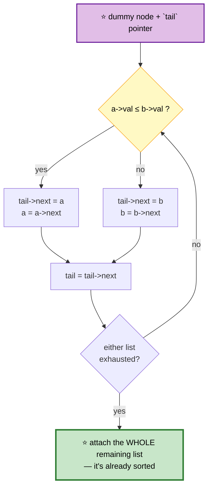

```cpp
ListNode* mergeTwoLists(ListNode* a, ListNode* b) {
    ListNode dummy;
    ListNode* tail = &dummy;

    while (a && b) {
        if (a->val <= b->val) { tail->next = a; a = a->next; }  // ⭐ <= keeps
        else                  { tail->next = b; b = b->next; }  //    it STABLE
        tail = tail->next;
    }
    tail->next = a ? a : b;                     // ⭐ attach the rest in O(1)

    return dummy.next;
}
```

⭐ **`tail->next = a ? a : b`** — no loop needed. The remaining list is already sorted and already linked.

⭐ **`<=` rather than `<`** preserves the relative order of equal elements. That's what makes merge sort stable, which matters when this is used as a subroutine.

---

# 5. Merge k Sorted Lists

🔴 **Hard** · 🔵 Full ladder · **Two optimal approaches**

## 🗺️ Approach Ladder

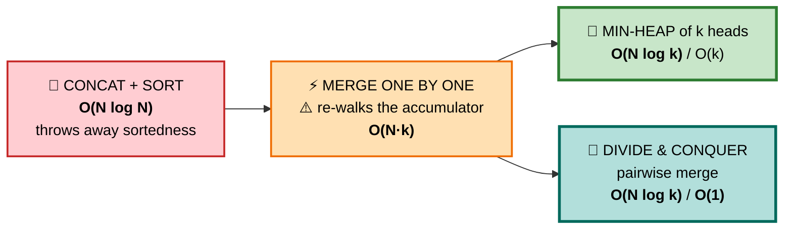

## ⚠️ Why sequential merging is slow

```
   Merging one at a time into an accumulator:

     merge(L1, L2)         → walks  n + n  = 2n
     merge(result, L3)     → walks 2n + n  = 3n
     merge(result, L4)     → walks 3n + n  = 4n
     ...
   Total = 2n + 3n + ... + kn = O(k²n) = ⭐ O(N·k)

   ⚠️ The accumulated list is re-walked on EVERY merge.
```

## 3️⃣ Min-Heap — O(N log k)

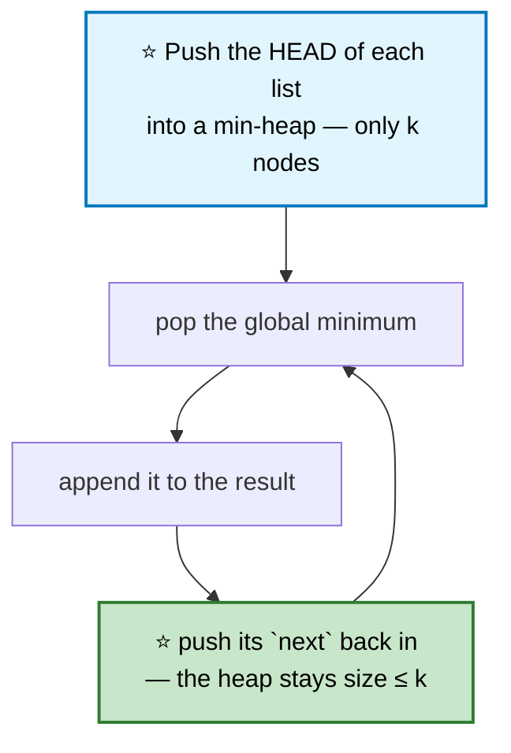

```cpp
ListNode* mergeKLists(vector<ListNode*>& lists) {
    auto cmp = [](ListNode* a, ListNode* b) { return a->val > b->val; };  // min-heap
    priority_queue<ListNode*, vector<ListNode*>, decltype(cmp)> pq(cmp);

    for (ListNode* l : lists) if (l) pq.push(l);   // ⚠️ skip null lists

    ListNode dummy;
    ListNode* tail = &dummy;

    while (!pq.empty()) {
        ListNode* n = pq.top(); pq.pop();
        tail->next = n;
        tail = n;
        if (n->next) pq.push(n->next);          // ⭐ heap never exceeds k
    }
    return dummy.next;
}
```

## 4️⃣ Divide & Conquer — ⭐ O(1) extra space

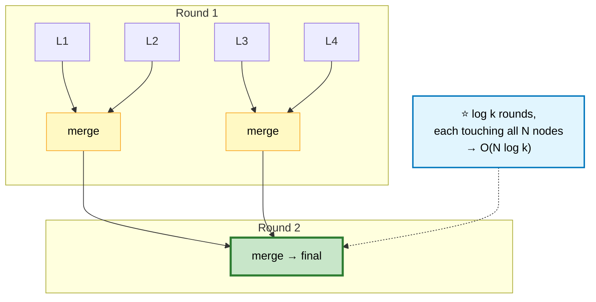

```cpp
ListNode* mergeKLists(vector<ListNode*>& lists) {
    if (lists.empty()) return nullptr;

    int n = lists.size();
    while (n > 1) {
        int half = (n + 1) / 2;                 // ⭐ ceiling — handles odd counts
        for (int i = 0; i < n / 2; ++i)
            lists[i] = mergeTwoLists(lists[i], lists[i + half]);
        n = half;
    }
    return lists[0];
}
```

⭐ **Why this beats sequential merging:** each node is touched once per *round*, and there are only `log k` rounds — instead of being re-walked on every one of the `k` merges.

## 📌 Pattern Card
```
SIGNAL   merge/combine k sorted sequences
KEY      min-heap of k heads · OR pairwise divide & conquer
         ⚠️ never merge sequentially into an accumulator
RELATED  Merge Sort · Smallest Range Covering K Lists · Kth Smallest in Matrix
```

---

# 6. Remove Nth Node From End

🟡 **Medium** · 🔵 Full ladder · ⭐ **The gap technique**

## 🗺️ Approach Ladder

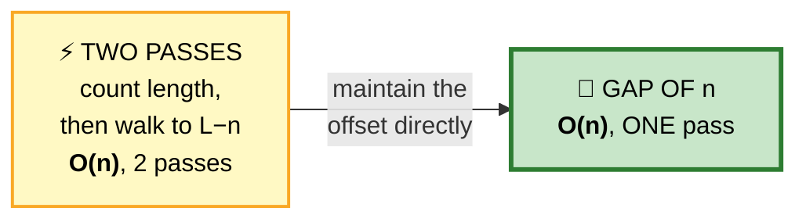

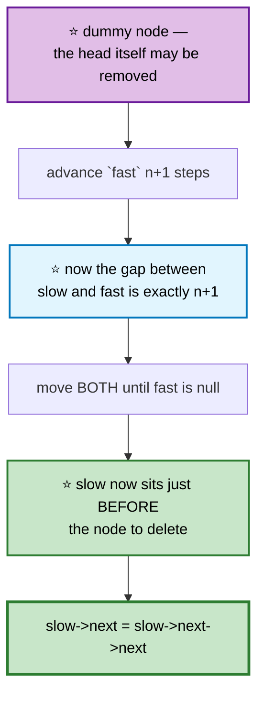

```
   TRACE  1 → 2 → 3 → 4 → 5, n = 2

   dummy → 1 → 2 → 3 → 4 → 5 → ∅
     ▲
   slow, fast

   advance fast 3 steps (n+1):
   dummy → 1 → 2 → 3 → 4 → 5 → ∅
     ▲             ▲
   slow          fast

   move both until fast == null:
   dummy → 1 → 2 → 3 → 4 → 5 → ∅
                 ▲             ▲
               slow          fast

   ⭐ slow->next is 4 — the 2nd from the end. Delete it.
```

```cpp
ListNode* removeNthFromEnd(ListNode* head, int n) {
    ListNode dummy(0, head);
    ListNode *slow = &dummy, *fast = &dummy;

    for (int i = 0; i <= n; ++i) fast = fast->next;   // ⭐ n+1 steps

    while (fast) { slow = slow->next; fast = fast->next; }

    ListNode* del = slow->next;
    slow->next = del->next;
    delete del;                                 // ⭐ don't leak
    return dummy.next;
}
```

⭐ **n+1, not n.** You need `slow` to land on the *predecessor*, since a singly linked list can't delete a node it's standing on.

⭐ **The dummy handles `n == length`** (removing the head) with no special case at all.

---

# 7. Middle of the Linked List
🟢 ⚪ **Variation of fast/slow** — see [Floyd's](03-two-pointers-sliding-window.md#15-linked-list-cycle-floyds).

```cpp
ListNode* middleNode(ListNode* head) {
    ListNode *slow = head, *fast = head;
    while (fast && fast->next) { slow = slow->next; fast = fast->next->next; }
    return slow;                                // ⭐ SECOND middle when even
}
```
```
   ⭐ WHICH MIDDLE DO YOU GET?

   [1,2,3,4]  fast starts at head → slow ends at 3 (SECOND middle)
              fast starts at head->next → slow ends at 2 (FIRST middle)

   ⚠️ Palindrome and Reorder List need the FIRST middle so the
     split is clean. Know which one your loop produces.
```

---

# 8. Linked List Cycle + Entry
🟡 ⚪ **Covered in full** with the algebraic proof: [Two Pointers #15](03-two-pointers-sliding-window.md#15-linked-list-cycle-floyds).

```cpp
ListNode* detectCycle(ListNode* head) {
    ListNode *slow = head, *fast = head;
    while (fast && fast->next) {
        slow = slow->next;
        fast = fast->next->next;
        if (slow == fast) {                     // ⭐ F = nC − a
            ListNode* p = head;
            while (p != slow) { p = p->next; slow = slow->next; }
            return p;
        }
    }
    return nullptr;
}
```

---

# 9. Palindrome Linked List

🟢 **Easy to state, tricky in O(1) space** · 🔵 Full ladder

## 🗺️ Approach Ladder

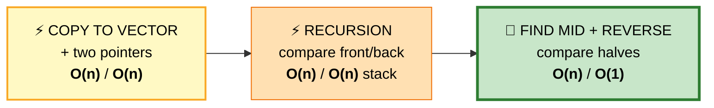

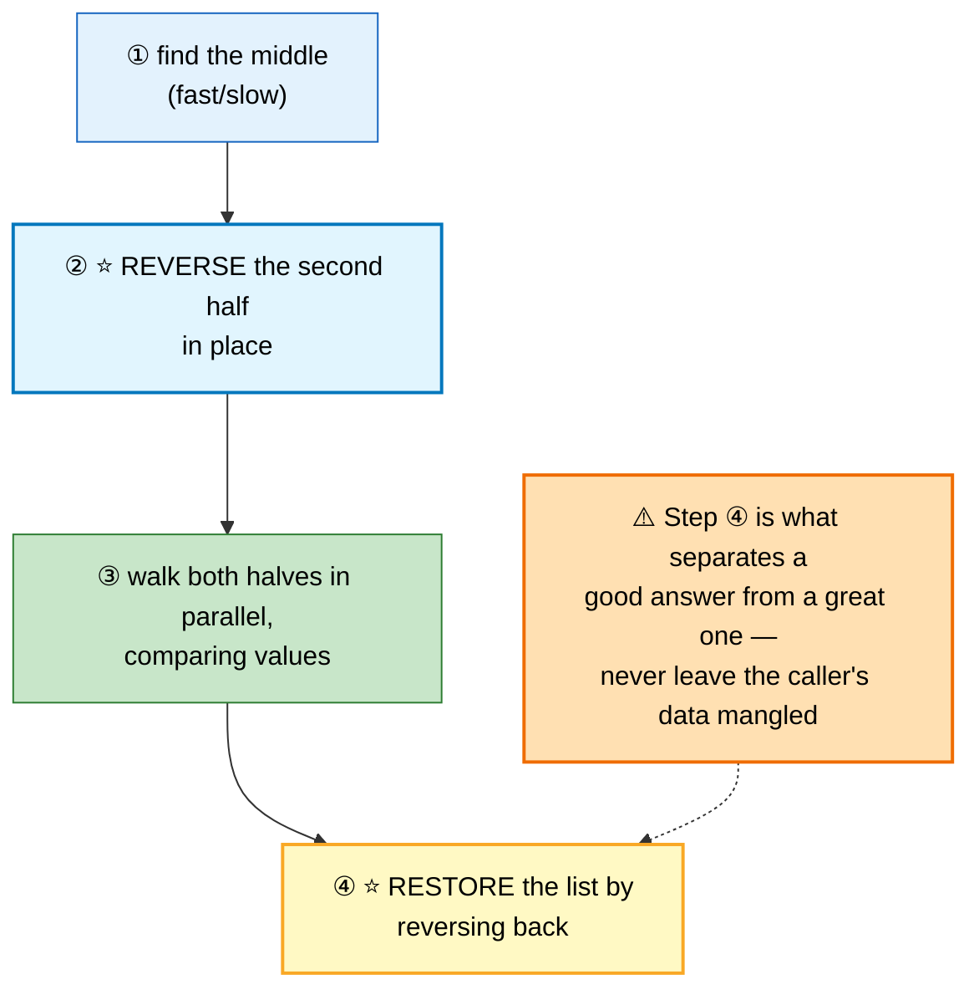

```
   1 → 2 → 2 → 1

   ① mid → slow lands between the two 2s
   ② reverse the tail:   1 → 2   and   1 → 2
   ③ compare 1==1, 2==2 ✅ PALINDROME
   ④ reverse the tail back → the original list is restored
```

```cpp
ListNode* reverse(ListNode* h) {
    ListNode* prev = nullptr;
    while (h) { ListNode* n = h->next; h->next = prev; prev = h; h = n; }
    return prev;
}

bool isPalindrome(ListNode* head) {
    if (!head || !head->next) return true;

    // ① find the END OF THE FIRST HALF
    ListNode *slow = head, *fast = head;
    while (fast->next && fast->next->next) {    // ⭐ this form gives the FIRST middle
        slow = slow->next;
        fast = fast->next->next;
    }

    // ② reverse the second half
    ListNode* second = reverse(slow->next);

    // ③ compare
    bool ok = true;
    for (ListNode *p = head, *q = second; q; p = p->next, q = q->next)
        if (p->val != q->val) { ok = false; break; }
    // ⭐ loop on `q` — the second half is never longer than the first

    // ④ ⭐ RESTORE
    slow->next = reverse(second);
    return ok;
}
```

⭐ **Loop on `q`, not `p`.** With an odd length the first half has the extra node, so the second half exhausting first is the correct stop condition.

---

# 10. Reorder List
🟡 ⚪ **Variation of #9** — same three phases, but interleave instead of compare.

> `1→2→3→4→5` becomes `1→5→2→4→3`

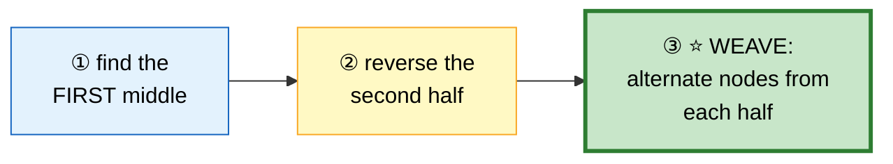

```cpp
void reorderList(ListNode* head) {
    if (!head || !head->next) return;

    ListNode *slow = head, *fast = head;
    while (fast->next && fast->next->next) { slow = slow->next; fast = fast->next->next; }

    ListNode* second = reverse(slow->next);
    slow->next = nullptr;                       // ⭐⭐ CUT the list in two —
                                                //    forgetting this makes a cycle
    ListNode* first = head;
    while (second) {                            // ⭐ second is never longer
        ListNode *f = first->next, *s = second->next;
        first->next  = second;
        second->next = f;
        first = f; second = s;
    }
}
```
⚠️ **`slow->next = nullptr` is mandatory.** Without it the two halves still reference each other and the weave produces a cycle.

---

# 11. Intersection of Two Linked Lists

🟢 **Easy** · 🔵 Full ladder · ⭐ **A genuinely beautiful trick**

> Find the node where two lists merge. `O(1)` space.

## 🗺️ Approach Ladder

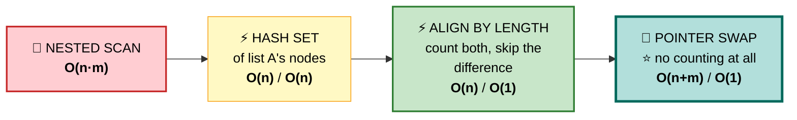

## 💬 The pointer-swap insight

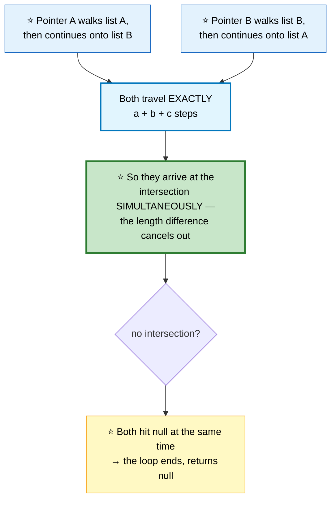

```
   ⭐⭐ THE ARITHMETIC

     List A:  a₁ → a₂ → ┐
                        ├→ c₁ → c₂ → ∅
     List B:  b₁ → b₂ → b₃ → ┘

     a = 2 (A's unique part)
     b = 3 (B's unique part)
     c = 2 (shared tail)

     Pointer A: a + c + b = 2 + 2 + 3 = 7 steps to reach c₁
     Pointer B: b + c + a = 3 + 2 + 2 = 7 steps to reach c₁

   ⭐ Identical. They MUST meet at c₁. ∎
```

```cpp
ListNode* getIntersectionNode(ListNode* a, ListNode* b) {
    if (!a || !b) return nullptr;

    ListNode *p = a, *q = b;
    while (p != q) {
        p = p ? p->next : b;                    // ⭐ exhausted A → jump to B
        q = q ? q->next : a;                    // ⭐ exhausted B → jump to A
    }
    return p;                                   // ⭐ intersection, or nullptr
}
```

⚠️ **The switch must happen at `nullptr`, not at the last node.** Jumping from the tail directly to the other head skips a step and breaks the equality — and it also removes the graceful null-return for non-intersecting lists.

## 📌 Pattern Card
```
SIGNAL   two sequences of DIFFERENT lengths converging
KEY      ⭐ swap pointers at the end → both travel a+b+c
RELATED  Lowest Common Ancestor (same idea on trees)
```

---

# 12. Add Two Numbers

🟡 **Medium** · 🔵 Full ladder · **Digits stored in REVERSE order**

> `2→4→3` (342) plus `5→6→4` (465) is `7→0→8` (807).

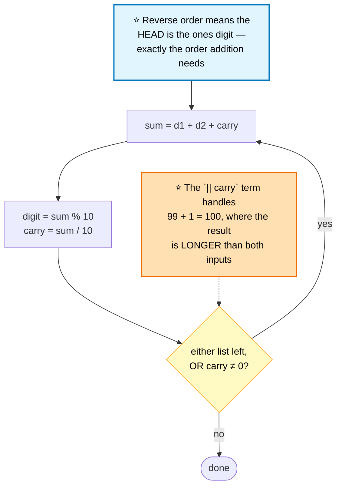

```cpp
ListNode* addTwoNumbers(ListNode* a, ListNode* b) {
    ListNode dummy;
    ListNode* tail = &dummy;
    int carry = 0;

    while (a || b || carry) {                   // ⭐⭐ the `|| carry` term
        int sum = carry;
        if (a) { sum += a->val; a = a->next; }
        if (b) { sum += b->val; b = b->next; }

        carry = sum / 10;
        tail->next = new ListNode(sum % 10);
        tail = tail->next;
    }
    return dummy.next;
}
```

⚠️ **Dropping `|| carry`** silently truncates `[9,9] + [1]` from `[0,0,1]` to `[0,0]`.

---

# 13. Add Two Numbers II (Forward Order)
🟡 ⚪ **Variation of #12** — digits stored most-significant first, and you **can't reverse the input**.

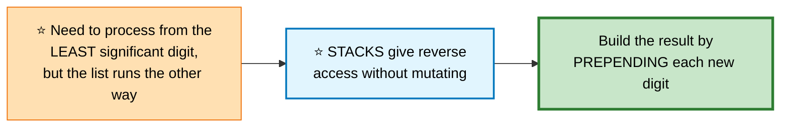

```cpp
ListNode* addTwoNumbers(ListNode* a, ListNode* b) {
    stack<int> sa, sb;
    for (; a; a = a->next) sa.push(a->val);
    for (; b; b = b->next) sb.push(b->val);

    ListNode* head = nullptr;                   // ⭐ build by PREPENDING
    int carry = 0;

    while (!sa.empty() || !sb.empty() || carry) {
        int sum = carry;
        if (!sa.empty()) { sum += sa.top(); sa.pop(); }
        if (!sb.empty()) { sum += sb.top(); sb.pop(); }

        carry = sum / 10;
        head = new ListNode(sum % 10, head);    // ⭐ prepend, not append
    }
    return head;
}
```
⭐ **Prepending while consuming from the stacks** produces the correct forward order with no final reverse.

---

# 14. Remove Duplicates from Sorted List I/II

🟡 **Medium** · 🔵 Full ladder · ⭐ **The dummy earns its keep**

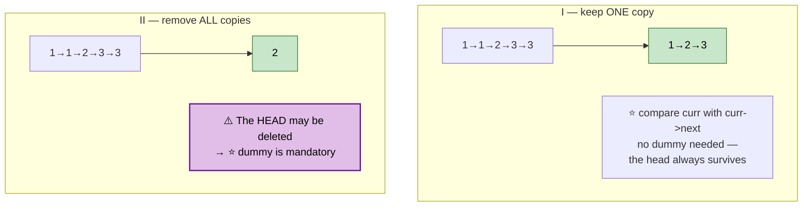

```cpp
// I — keep one of each
ListNode* deleteDuplicates(ListNode* head) {
    for (ListNode* c = head; c && c->next; )
        if (c->val == c->next->val) {
            ListNode* d = c->next;
            c->next = d->next;
            delete d;                           // ⭐ don't advance — more dups
        } else {
            c = c->next;
        }
    return head;
}

// II — remove EVERY value that appears more than once
ListNode* deleteDuplicatesII(ListNode* head) {
    ListNode dummy(0, head);
    ListNode* prev = &dummy;                    // ⭐ last confirmed-unique node
    ListNode* curr = head;

    while (curr) {
        if (curr->next && curr->val == curr->next->val) {
            int dupVal = curr->val;
            while (curr && curr->val == dupVal) {   // ⭐ skip the ENTIRE run
                ListNode* d = curr;
                curr = curr->next;
                delete d;
            }
            prev->next = curr;                  // ⭐ splice out the whole block
        } else {
            prev = curr;
            curr = curr->next;
        }
    }
    return dummy.next;
}
```

⚠️ **In II, `prev` only advances when a node is confirmed unique.** Advancing it unconditionally is the classic bug — it leaves the first duplicate in place.

---

# 15. Odd Even Linked List
🟡 ⚪ **Variation** — build two chains, then join them.

```cpp
ListNode* oddEvenList(ListNode* head) {
    if (!head || !head->next) return head;

    ListNode *odd = head, *even = head->next, *evenHead = even;  // ⭐ save it

    while (even && even->next) {
        odd->next  = even->next;   odd  = odd->next;
        even->next = odd->next;    even = even->next;
    }
    odd->next = evenHead;                       // ⭐ join the two chains
    return head;
}
```
⭐ **`evenHead` must be saved up front** — by the time the loop ends, nothing else points to the start of the even chain.

---

# 16. Rotate List
🟡 ⚪ **Variation** — close the list into a ring, then cut it open elsewhere.

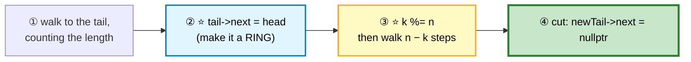

```cpp
ListNode* rotateRight(ListNode* head, int k) {
    if (!head || !head->next || k == 0) return head;

    int n = 1;
    ListNode* tail = head;
    while (tail->next) { tail = tail->next; ++n; }

    tail->next = head;                          // ⭐ close the ring
    k %= n;                                     // ⭐ k can exceed n

    ListNode* newTail = head;
    for (int i = 0; i < n - k - 1; ++i) newTail = newTail->next;

    ListNode* newHead = newTail->next;
    newTail->next = nullptr;                    // ⭐ cut it open
    return newHead;
}
```
⭐ **Making a ring first** removes all the off-by-one pain of trying to splice two segments manually.

---

# 17. Partition List
🟡 ⚪ **Variation** — two dummies, then concatenate. Order must be **stable**.

```cpp
ListNode* partition(ListNode* head, int x) {
    ListNode lessHead, geHead;                  // ⭐ TWO dummies
    ListNode *less = &lessHead, *ge = &geHead;

    for (ListNode* c = head; c; c = c->next)
        (c->val < x ? less : ge)->next = c,     // ⭐ append to the right chain
        (c->val < x ? less : ge) = c;

    ge->next = nullptr;                         // ⚠️ TERMINATE — the last node
                                                //    still points into the old list
    less->next = geHead.next;
    return lessHead.next;
}
```
⚠️ **`ge->next = nullptr` is essential.** Without it the final node retains a stale forward pointer and you get a cycle.

⭐ **Two dummies preserve stability** for free — nodes enter each chain in their original relative order.

---

# 18. Sort List

🟡 **Medium** · 🔵 Full ladder · ⭐ **Why merge sort, not quicksort**

> Sort in **O(n log n)** time and **O(1)** space (ignoring recursion).

## 💬 Why merge sort is the right choice here

```mermaid
flowchart TD
    Q{"Which sort for<br/>a linked list?"}
    Q -->|"QUICKSORT"| A["⚠️ Needs RANDOM ACCESS for a<br/>good pivot; partitioning a list<br/>is awkward, and worst case is O(n²)"]
    Q -->|"HEAPSORT"| B["⚠️ Needs indexed access<br/>to children — impossible"]
    Q -->|"⭐ MERGE SORT"| C["✅ Splitting = fast/slow pointers<br/>✅ Merging = pure pointer rewiring<br/>✅ ⭐ NO extra array needed,<br/>unlike merge sort on arrays"]

    style Q fill:#e3f2fd,stroke:#1565c0,stroke-width:2px,color:#000
    style A fill:#ffcdd2,stroke:#c62828,color:#000
    style B fill:#ffcdd2,stroke:#c62828,color:#000
    style C fill:#c8e6c9,stroke:#2e7d32,stroke-width:3px,color:#000
```

```
   ⭐⭐ THE INSIGHT WORTH STATING OUT LOUD

   Merge sort on an ARRAY needs O(n) auxiliary space, because
   merging two adjacent runs in place is hard.

   Merge sort on a LINKED LIST needs none — merging is just
   relinking existing nodes. The linked list is the one
   structure where merge sort is space-optimal.

   ⭐ That's why std::list::sort exists separately from std::sort.
```

```cpp
ListNode* sortList(ListNode* head) {
    if (!head || !head->next) return head;      // ⭐ base case

    // ① split at the FIRST middle
    ListNode *slow = head, *fast = head->next;  // ⭐ fast starts one AHEAD
    while (fast && fast->next) {
        slow = slow->next;
        fast = fast->next->next;
    }
    ListNode* second = slow->next;
    slow->next = nullptr;                       // ⚠️ CUT

    // ② sort each half, ③ merge
    return mergeTwoLists(sortList(head), sortList(second));
}
```

⚠️ **`fast = head->next` (not `head`)** guarantees `slow` stops at the *first* middle. With `fast = head` and a two-node list, `slow` never moves, `second` is the whole tail, and the recursion never shrinks — infinite loop.

🎤 **Follow-up: truly O(1) space?** Bottom-up merge sort — iterate with block sizes 1, 2, 4, 8... merging adjacent runs. No recursion stack at all.

## 📌 Pattern Card
```
SIGNAL   sort a linked list in O(n log n)
KEY      ⭐ MERGE SORT — split with fast/slow, merge by relinking
         ⚠️ fast starts at head->next to get the FIRST middle
RELATED  Merge Two Sorted Lists · Merge k Sorted · Insertion Sort List
```

---

# 19. Flatten a Multilevel Doubly Linked List

🟡 **Medium** · 🔵 Full ladder · **Stack or in-place splice**

> Each node has `next`, `prev`, and possibly a `child` list. Flatten depth-first.

```mermaid
flowchart TD
    A["1 ⇄ 2 ⇄ 3 ⇄ 4"] --> B["node 2 has a child:<br/>7 ⇄ 8"]
    B --> C["⭐ Splice the child list in<br/>BETWEEN 2 and 3"]
    C --> D["1 ⇄ 2 ⇄ 7 ⇄ 8 ⇄ 3 ⇄ 4"]

    style A fill:#e3f2fd,stroke:#1565c0,color:#000
    style C fill:#e1f5fe,stroke:#0277bd,stroke-width:2px,color:#000
    style D fill:#c8e6c9,stroke:#2e7d32,stroke-width:3px,color:#000
```

## 1️⃣ Stack — O(n) space, easy to reason about
```cpp
Node* flatten(Node* head) {
    if (!head) return head;
    stack<Node*> st;
    Node* curr = head;

    while (curr) {
        if (curr->child) {
            if (curr->next) st.push(curr->next);   // ⭐ remember the detour

            curr->next = curr->child;
            curr->next->prev = curr;
            curr->child = nullptr;                 // ⚠️ must clear it
        } else if (!curr->next && !st.empty()) {
            curr->next = st.top(); st.pop();       // ⭐ resume the outer level
            curr->next->prev = curr;
        }
        curr = curr->next;
    }
    return head;
}
```

## 2️⃣ In-place splice — ⭐ O(1) space
```cpp
Node* flatten(Node* head) {
    for (Node* curr = head; curr; curr = curr->next) {
        if (!curr->child) continue;

        Node* nxt = curr->next;

        curr->next = curr->child;               // ⭐ attach the child
        curr->next->prev = curr;
        curr->child = nullptr;

        Node* tail = curr->next;
        while (tail->next) tail = tail->next;    // ⭐ walk to the child's tail

        tail->next = nxt;                        // ⭐ reattach the remainder
        if (nxt) nxt->prev = tail;
    }
    return head;
}
```
⭐ **Why the O(1) version is still O(n) total:** walking to each child's tail visits nodes that are then never revisited at that level — the same amortization as the monotonic stack.

⚠️ **`curr->child = nullptr` is required by the problem** — leaving stale child pointers fails the validator even when `next`/`prev` are perfect.

---

# 20. LRU Cache (Design)
🟡 ⚪ **Fully covered** in [Hashing #3](02-hashing.md#3-lru-cache) — hash map plus a doubly linked list, with sentinel head/tail.

⭐ **Why it lives in both chapters:** it's the canonical demonstration that a doubly linked list gives **O(1) removal from the middle**, which no other simple structure offers.

---

## 📋 Linked Lists Recall

```mermaid
mindmap
  root(("Linked<br/>Lists"))
    Dummy Node
      use it whenever the head may change
      removal · partition · merge
      ⭐ kills every first-node special case
    Reversal
      prev/curr/nxt — save nxt FIRST
      ⭐ return prev, not curr
      head-insertion for sublists
    Fast/Slow
      middle · cycle · nth from end
      ⭐ head->next start = FIRST middle
      gap of n+1 for deletion
    Splitting
      ⚠️ always CUT with next = nullptr
      forgetting it creates a cycle
    Merging
      dummy + tail
      attach the remainder in O(1)
      ⭐ <= keeps it stable
    Clever Tricks
      ⭐ pointer swap for intersection
      ring-then-cut for rotation
      stacks for forward-order addition
      interleaving for O(1) deep copy
    Sorting
      ⭐ MERGE SORT — O(1) aux space
      fast starts at head->next
```

```
╔══════════════════════════════════════════════════════════════════════╗
║                  LINKED LISTS — PATTERN RECALL                       ║
╠══════════════════════════════════════════════════════════════════════╣
║ "the head might change"        → ⭐ DUMMY NODE, always               ║
║ "reverse anything"             → prev/curr/nxt, return prev          ║
║ "nth from the end, one pass"   → ⭐ gap of n+1, then move together   ║
║ "find the middle"              → fast/slow (head->next for FIRST)    ║
║ "cycle / duplicate"            → Floyd's, then reset to head         ║
║ "palindrome, O(1) space"       → mid + reverse + compare + ⭐ RESTORE ║
║ "where do two lists merge"     → ⭐ pointer swap at null             ║
║ "merge k lists"                → heap of k heads, or pairwise D&C    ║
║ "sort a list"                  → ⭐ MERGE SORT (O(1) aux!)           ║
║ "split into two groups"        → two dummies, ⚠️ terminate both       ║
║ "rotate by k"                  → ⭐ make a ring, then cut            ║
╠══════════════════════════════════════════════════════════════════════╣
║ ⚠️ TRAPS                                                              ║
║   reverse: returning curr (always null) instead of prev              ║
║   split: forgetting slow->next = nullptr → cycle                     ║
║   add numbers: dropping `|| carry` truncates the answer              ║
║   sort list: fast must start at head->next or 2 nodes loop forever   ║
║   dedupe II: prev must only advance on CONFIRMED-unique nodes        ║
║   partition: terminate the second chain or you build a cycle         ║
╚══════════════════════════════════════════════════════════════════════╝
```

---

**Next:** [Stacks & Queues →](05-stacks-queues.md) · **Back:** [Two Pointers & Sliding Window](03-two-pointers-sliding-window.md)
