# 🥞 Stacks & Queues

> A stack answers one question extraordinarily well: **"what was the most recent unresolved thing?"** That question is hiding inside parsing, nesting, spans, histograms, and every "next greater element" problem you'll ever see.

**Prerequisite:** [Patterns & Foundations](00-patterns.md) · **Format:** [see the sample](FORMAT-SAMPLE.md)

---

## 🧠 Recognizing a Stack Problem

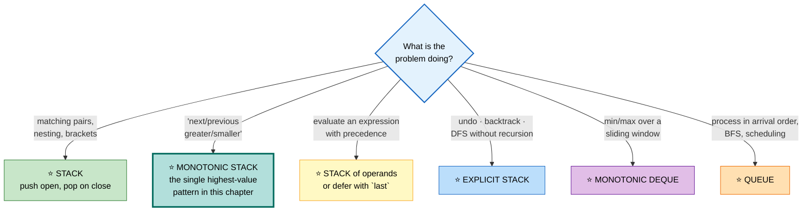

## ⭐ The Monotonic Stack Template — memorize this

```cpp
// "Next greater element to the right" for every index
vector<int> nextGreater(vector<int>& a) {
    int n = a.size();
    vector<int> res(n, -1);
    stack<int> st;                              // ⭐ INDICES, values DECREASING

    for (int i = 0; i < n; ++i) {
        // ⭐ a[i] resolves everything smaller that was waiting
        while (!st.empty() && a[st.top()] < a[i]) {
            res[st.top()] = a[i];
            st.pop();
        }
        st.push(i);
    }
    return res;                                 // leftovers keep -1
}
```

```
   ⭐⭐ THE FOUR VARIANTS — ONLY THE COMPARISON CHANGES

   ┌──────────────────────┬──────────────┬────────────────────┐
   │ You want             │ Stack order  │ Pop while          │
   ├──────────────────────┼──────────────┼────────────────────┤
   │ next GREATER right   │ decreasing   │ a[top] <  a[i]     │
   │ next SMALLER right   │ increasing   │ a[top] >  a[i]     │
   │ prev GREATER left    │ decreasing   │ a[top] <= a[i]     │
   │ prev SMALLER left    │ increasing   │ a[top] >= a[i]     │
   └──────────────────────┴──────────────┴────────────────────┘

   ⭐ For "previous X", either scan right-to-left, or read the
     stack top BEFORE pushing during a left-to-right scan.

   ⭐ WHY IT'S O(n): every index is pushed once and popped at
     most once. Total operations ≤ 2n.
```

---

## 📑 Contents

| # | Problem | Diff | Type | Optimal |
|---|---|---|---|---|
| [1](#1-valid-parentheses) | Valid Parentheses | 🟢 | ⚪ Variation | see [Strings #67](01c-arrays-strings.md#67-valid-parentheses) |
| [2](#2-min-stack) | Min Stack | 🟡 | 🔵 **Full** | O(1) all ops, O(1) extra with encoding |
| [3](#3-implement-queue-using-stacks) | Queue using Stacks | 🟢 | 🔵 **Full** | ⭐ amortized O(1) |
| [4](#4-implement-stack-using-queues) | Stack using Queues | 🟢 | ⚪ Variation | rotate on push |
| [5](#5-next-greater-element-i--ii) | Next Greater Element I / II | 🟡 | 🔵 **Full** | O(n) monotonic stack |
| [6](#6-daily-temperatures) | Daily Temperatures | 🟡 | ⚪ Variation | same, store the gap |
| [7](#7-stock-span--online-stock-span) | Stock Span | 🟡 | ⚪ Variation | previous-greater |
| [8](#8-largest-rectangle-in-histogram) | Largest Rectangle in Histogram | 🔴 | 🔵 **Full** | ⭐ O(n) the classic |
| [9](#9-maximal-rectangle) | Maximal Rectangle | 🔴 | ⚪ Variation | per-row histogram |
| [10](#10-trapping-rain-water-stack-view) | Trapping Rain Water | 🔴 | ⚪ Variation | see [Two Pointers #5](03-two-pointers-sliding-window.md#5-trapping-rain-water) |
| [11](#11-remove-k-digits) | Remove K Digits | 🟡 | 🔵 **Full** | O(n) greedy monotonic |
| [12](#12-remove-duplicate-letters) | Remove Duplicate Letters | 🔴 | ⚪ Variation | + "appears later" check |
| [13](#13-132-pattern) | 132 Pattern | 🟡 | 🔵 **Full** | ⭐ scan right-to-left |
| [14](#14-basic-calculator-i--parentheses) | Basic Calculator (parens) | 🔴 | 🔵 **Full** | stack of (result, sign) |
| [15](#15-evaluate-reverse-polish-notation) | Evaluate RPN | 🟡 | ⚪ Variation | pure operand stack |
| [16](#16-asteroid-collision) | Asteroid Collision | 🟡 | 🔵 **Full** | stack simulation |
| [17](#17-simplify-path) | Simplify Path | 🟡 | ⚪ Variation | stack of directories |
| [18](#18-decode-string) | Decode String | 🟡 | ⚪ Variation | see [Strings #66](01c-arrays-strings.md#66-decode-string) |
| [19](#19-sliding-window-maximum) | Sliding Window Maximum | 🔴 | ⚪ Variation | see [Two Pointers #12](03-two-pointers-sliding-window.md#12-sliding-window-maximum) |
| [20](#20-design-circular-queue) | Design Circular Queue | 🟡 | 🔵 **Full** | ring buffer, modular indices |

---

# 1. Valid Parentheses
🟢 ⚪ **Fully covered** in [Strings #67](01c-arrays-strings.md#67-valid-parentheses) — push the *expected closer*, and check `st.empty()` at the end.

---

# 2. Min Stack

🟡 **Medium** · 🔵 Full ladder · ⭐ **Three levels of cleverness**

> `push`, `pop`, `top`, `getMin` — **all O(1)**.

## 🗺️ Approach Ladder

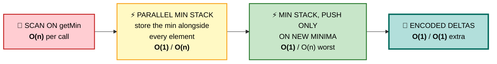

## 2️⃣ Parallel Min Stack — ⭐ the answer to give

#### 💬 Why you can't just track a single `min` variable

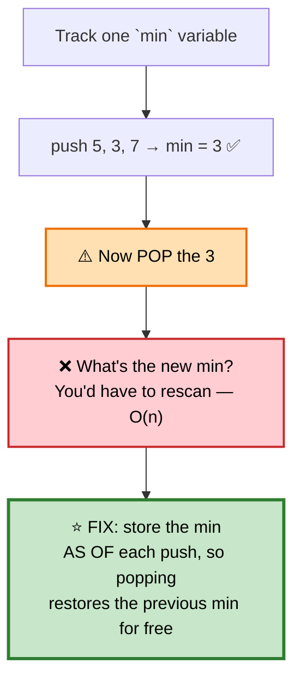

```
   PUSH 5, 3, 7, 2

   values:  [ 5,  3,  7,  2 ]
   mins:    [ 5,  3,  3,  2 ]
              ▲   ▲   ▲   ▲
              │   │   │   └─ min of everything so far
              │   │   └───── 7 didn't beat 3, so 3 repeats
              │   └───────── new minimum
              └───────────── first element

   ⭐ POP → both stacks shrink together, and mins.top()
     is instantly correct again. No rescanning ever.
```

```cpp
class MinStack {
    stack<int> vals;
    stack<int> mins;                            // ⭐ min AS OF each push

public:
    void push(int x) {
        vals.push(x);
        mins.push(mins.empty() ? x : min(x, mins.top()));
    }
    void pop()      { vals.pop(); mins.pop(); }  // ⭐ always in lockstep
    int  top()      { return vals.top(); }
    int  getMin()   { return mins.top(); }       // ⭐ O(1)
};
```

## 4️⃣ Encoded Deltas — ⭐ O(1) extra space

#### 💬 The trick
When a new minimum arrives, push an *encoded* value instead of the real one. The encoding stores enough to recover the previous minimum on pop.

```
   ⭐⭐ THE ENCODING

   On push(x) where x < min:
       push (2·x − min)        ⚠️ this is STRICTLY LESS than x
       min = x

   On pop() where top < min:
       ⭐ the top is encoded → the real value was `min`
       min = 2·min − top        (recovers the previous min)

   WHY (2x − min) < x  when x < min:
       2x − min < x  ⟺  x < min  ✅ always true

   ⭐ So "top < min" is a reliable flag that the entry is encoded.
   ⚠️ Requires long long — 2x−min can overflow int.
```

```cpp
class MinStack {
    stack<long long> st;
    long long mn = 0;

public:
    void push(int x) {
        if (st.empty()) { st.push(x); mn = x; return; }

        if (x < mn) { st.push(2LL * x - mn); mn = x; }   // ⭐ encode
        else        { st.push(x); }
    }
    void pop() {
        if (st.top() < mn) mn = 2 * mn - st.top();       // ⭐ decode
        st.pop();
    }
    int top()    { return st.top() < mn ? (int)mn : (int)st.top(); }
    int getMin() { return (int)mn; }
};
```

⭐ **Present approach 2 first, then offer this as the follow-up.** Leading with the encoding looks like memorization; deriving it looks like insight.

## 📌 Pattern Card
```
SIGNAL   O(1) auxiliary query alongside stack operations
KEY      store the derived value AS OF each push, in lockstep
RELATED  Max Stack · Min Queue (two-stack) · All O(1) Data Structure
```

---

# 3. Implement Queue using Stacks

🟢 **Easy to state, the amortization is the point** · 🔵 Full ladder

## 💬 The idea

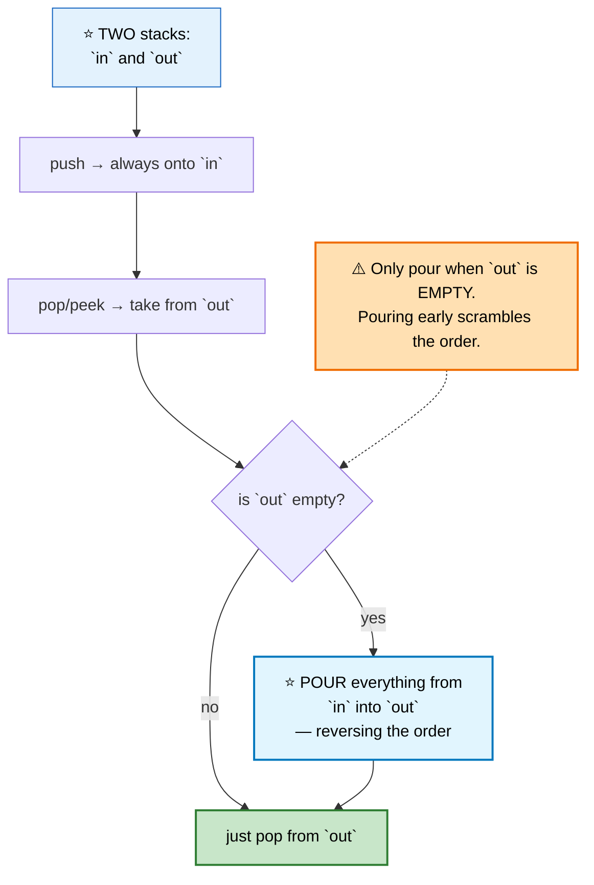

```
   PUSH 1, 2, 3

   in:  [1, 2, 3]     out: []
              ▲top

   POP → out is empty → ⭐ POUR

   in:  []            out: [3, 2, 1]
                                  ▲top  ⭐ FIFO order restored!

   pop → 1 ✅   pop → 2 ✅
   push 4 → in: [4],  out: [3]
   pop → 3 (from out) ✅  ⭐ still correct — don't pour yet
```

```cpp
class MyQueue {
    stack<int> in, out;

    void pour() {                               // ⭐ only when `out` is empty
        if (out.empty())
            while (!in.empty()) { out.push(in.top()); in.pop(); }
    }

public:
    void push(int x) { in.push(x); }

    int pop()  { pour(); int v = out.top(); out.pop(); return v; }
    int peek() { pour(); return out.top(); }
    bool empty() { return in.empty() && out.empty(); }
};
```

```
   ⭐⭐ THE AMORTIZED O(1) ARGUMENT — the real question here

   A single pop can cost O(n) when a pour happens.
   But every element is moved AT MOST TWICE in its lifetime:
     once from `in` to `out`, once out of `out`.

   Over n operations, the total work is ≤ 2n.
   ⭐ Amortized O(1) per operation. ∎

   This is the same accounting argument as vector growth and
   the monotonic stack — worth being able to state cleanly.
```

⚠️ **Pouring on every pop** (rather than only when `out` is empty) makes it genuinely O(n) per operation *and* breaks the ordering.

---

# 4. Implement Stack using Queues
🟢 ⚪ **Variation of #3** — but the asymmetry is interesting.

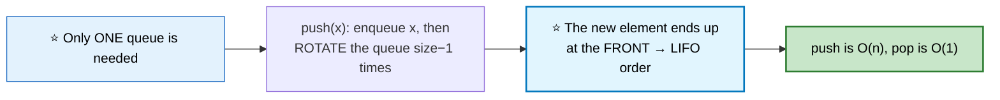

```cpp
class MyStack {
    queue<int> q;
public:
    void push(int x) {
        q.push(x);
        for (int i = 0; i < (int)q.size() - 1; ++i) {   // ⭐ rotate
            q.push(q.front());
            q.pop();
        }
    }
    int top()  { return q.front(); }
    int pop()  { int v = q.front(); q.pop(); return v; }
    bool empty() { return q.empty(); }
};
```

```
   ⭐ THE ASYMMETRY WORTH NOTING

   Queue-from-stacks:  amortized O(1) for everything
   Stack-from-queue:   O(n) push, and NO amortization saves it —
                       every push genuinely costs O(n)

   ⭐ Why? A stack's LIFO order is "unnatural" for a queue, so
     it must be re-established on every single insertion. Two
     stacks, by contrast, naturally compose into FIFO because
     reversing twice restores the original order.
```

---

# 5. Next Greater Element I / II

🟡 **Medium** · 🔵 Full ladder · ⭐ **The template problem**

## 🗺️ Approach Ladder

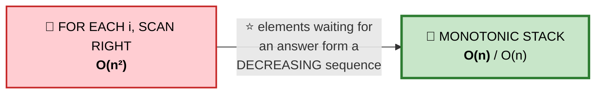

## 💬 The insight that makes it linear

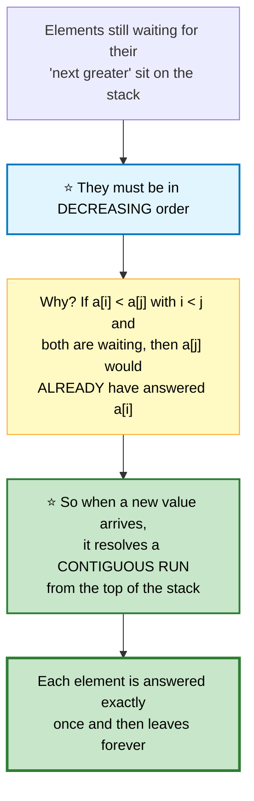

```
   TRACE  a = [2, 1, 2, 4, 3]

   ┌───┬──────┬──────────────┬──────────────────────────────┐
   │ i │ a[i] │ stack (vals) │ action                       │
   ├───┼──────┼──────────────┼──────────────────────────────┤
   │ 0 │  2   │ [2]          │ push                         │
   │ 1 │  1   │ [2,1]        │ 1 < 2 → push (decreasing ✅) │
   │ 2 │  2   │ [2,2]        │ ⭐ 2 > 1 → res[1]=2, pop     │
   │   │      │              │ 2 == 2 → push (not >)        │
   │ 3 │  4   │ [4]          │ ⭐ 4 resolves BOTH 2s → pop  │
   │ 4 │  3   │ [4,3]        │ 3 < 4 → push                 │
   └───┴──────┴──────────────┴──────────────────────────────┘
   leftovers (4 and 3) get −1 ✅
```

```cpp
// I — the query array is a SUBSET of nums2
vector<int> nextGreaterElement(vector<int>& nums1, vector<int>& nums2) {
    unordered_map<int,int> nge;                 // ⭐ value → its next greater
    stack<int> st;

    for (int x : nums2) {
        while (!st.empty() && st.top() < x) { nge[st.top()] = x; st.pop(); }
        st.push(x);
    }

    vector<int> out;
    for (int x : nums1) out.push_back(nge.count(x) ? nge[x] : -1);
    return out;
}

// II — the array is CIRCULAR
vector<int> nextGreaterElements(vector<int>& a) {
    int n = a.size();
    vector<int> res(n, -1);
    stack<int> st;                              // indices

    for (int i = 0; i < 2 * n; ++i) {           // ⭐ two passes simulate the wrap
        int idx = i % n;
        while (!st.empty() && a[st.top()] < a[idx]) {
            res[st.top()] = a[idx];
            st.pop();
        }
        if (i < n) st.push(idx);                // ⭐ only PUSH during pass 1
    }
    return res;
}
```

⭐ **`if (i < n) st.push(idx)` is the key line in the circular version.** The second pass exists only to *resolve* leftovers, not to add new ones — pushing again would produce duplicate answers.

## 📌 Pattern Card
```
SIGNAL   "next/previous greater/smaller element"
KEY      ⭐ monotonic stack of INDICES; pop while the new value wins
         circular → loop 2n, push only in the first half
RELATED  Daily Temperatures · Stock Span · Largest Rectangle · 132 Pattern
```

---

# 6. Daily Temperatures
🟡 ⚪ **Variation of #5** — store the *distance* instead of the value.

```cpp
vector<int> dailyTemperatures(vector<int>& t) {
    vector<int> res(t.size(), 0);               // ⭐ 0 = no warmer day ahead
    stack<int> st;                              // indices, decreasing temps

    for (int i = 0; i < (int)t.size(); ++i) {
        while (!st.empty() && t[st.top()] < t[i]) {
            res[st.top()] = i - st.top();       // ⭐ the GAP, not the value
            st.pop();
        }
        st.push(i);
    }
    return res;
}
```
⭐ **Storing indices instead of values** is exactly what makes this variation free.

---

# 7. Stock Span / Online Stock Span
🟡 ⚪ **Variation of #5** — *previous* greater, and it must work **online** (streaming).

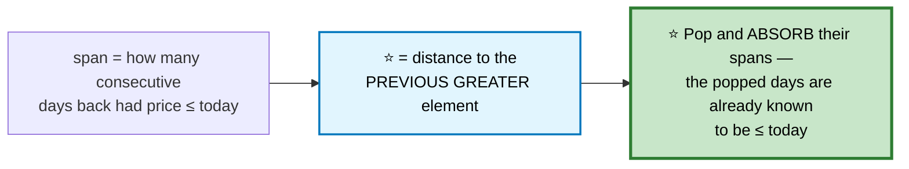

```cpp
class StockSpanner {
    stack<pair<int,int>> st;                    // {price, span}
public:
    int next(int price) {
        int span = 1;
        while (!st.empty() && st.top().first <= price) {
            span += st.top().second;            // ⭐ ABSORB the popped span
            st.pop();
        }
        st.push({price, span});
        return span;
    }
};
```
⭐ **Absorbing spans is what makes it work online** — you never need to look at the original array again, only at the compressed summaries on the stack.

---

# 8. Largest Rectangle in Histogram

🔴 **Hard** · 🔵 Full ladder · ⭐ **The most important stack problem there is**

> Bars of width 1 and given heights. Find the largest axis-aligned rectangle.

```
                    ▓
              ▓     ▓
        ▓  ░░▓░░░░░▓░░
        ▓  ░░▓  ▓  ▓░░       ⭐ best = height 2 × width 5 = 10
     ▓  ▓  ░░▓  ▓  ▓░░
    [2, 1, 5, 6, 2, 3]
```

## 🗺️ Approach Ladder

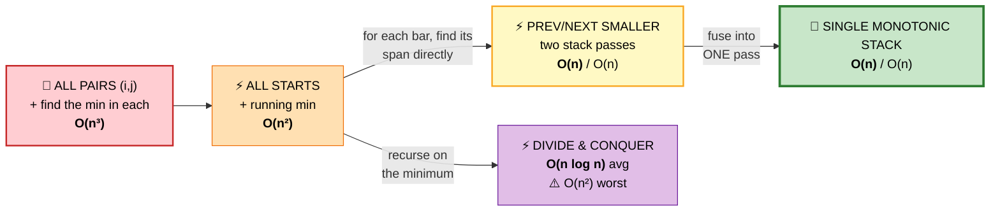

## 💬 Reframing the problem

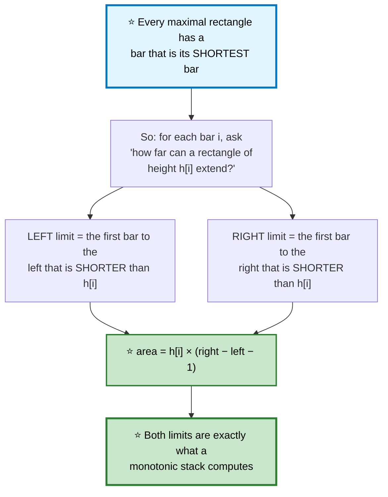

```
   ⭐ FOR h = [2, 1, 5, 6, 2, 3], take bar i=2 (height 5)

     left limit:  index 1 (height 1 < 5)
     right limit: index 4 (height 2 < 5)
     width = 4 − 1 − 1 = 2
     area  = 5 × 2 = 10

   Take bar i=1 (height 1):
     left limit:  −1 (nothing shorter)
     right limit: 6 (past the end)
     width = 6 − (−1) − 1 = 6
     area  = 1 × 6 = 6

   ⭐ The maximum over all bars is the answer.
```

## 4️⃣ Single Monotonic Stack — ⭐ OPTIMAL

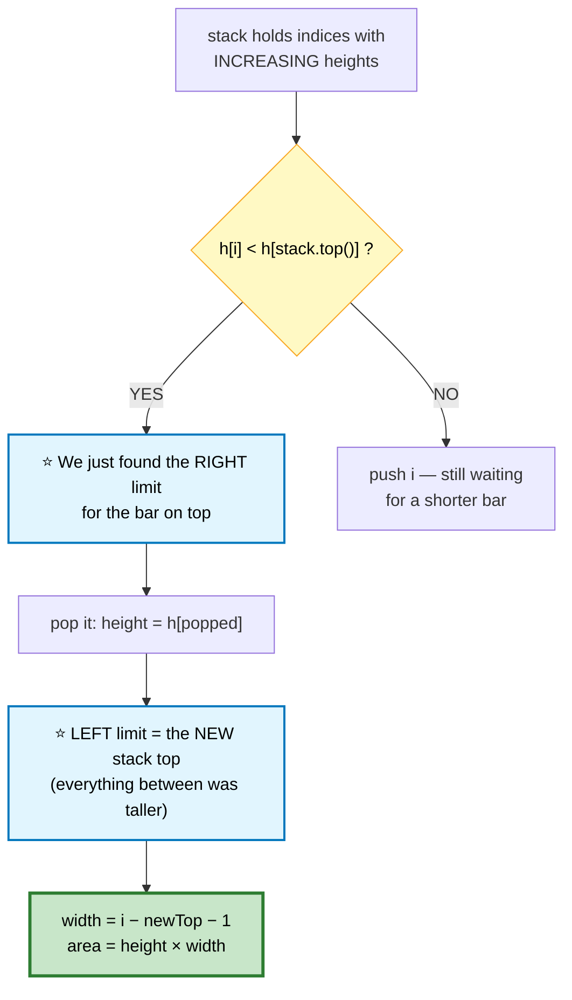

```cpp
int largestRectangleArea(vector<int>& h) {
    h.push_back(0);                             // ⭐⭐ SENTINEL — forces a
                                                //    flush of the whole stack
    stack<int> st;                              // indices, INCREASING heights
    int best = 0;

    for (int i = 0; i < (int)h.size(); ++i) {
        while (!st.empty() && h[st.top()] > h[i]) {
            int height = h[st.top()]; st.pop();

            // ⭐ left limit is the new top; if empty, the bar extends to 0
            int width = st.empty() ? i : i - st.top() - 1;
            best = max(best, height * width);
        }
        st.push(i);
    }

    h.pop_back();                               // ⭐ restore the caller's data
    return best;
}
```

```
   ⭐⭐ WHY `width = i − st.top() − 1` AFTER POPPING

   After popping, the new stack top is the first bar to the
   LEFT that is shorter than the popped bar — because everything
   between them was taller and has already been popped.

   So the rectangle spans strictly between them:
       (st.top(), i)  exclusive on both ends
       width = i − st.top() − 1

   ⚠️ If the stack becomes EMPTY, no shorter bar exists to the
     left, so the rectangle extends all the way to index 0
     → width = i.
```

⭐ **The trailing `0` sentinel** is what guarantees every bar gets popped and measured. Without it, a monotonically increasing histogram like `[1,2,3]` leaves everything on the stack unmeasured.

## 📌 Pattern Card
```
SIGNAL   "largest rectangle/area bounded by heights"
KEY      ⭐ for each bar, find prev-smaller and next-smaller
         one monotonic INCREASING stack + a 0 sentinel
RELATED  Maximal Rectangle · Trapping Rain Water · Sum of Subarray Minimums
```

---

# 9. Maximal Rectangle
🔴 ⚪ **Variation of #8** — reduce 2D to 1D, exactly like [Max Sum Rectangle](01b-arrays-strings.md#45-max-sum-rectangle-in-2d-matrix).

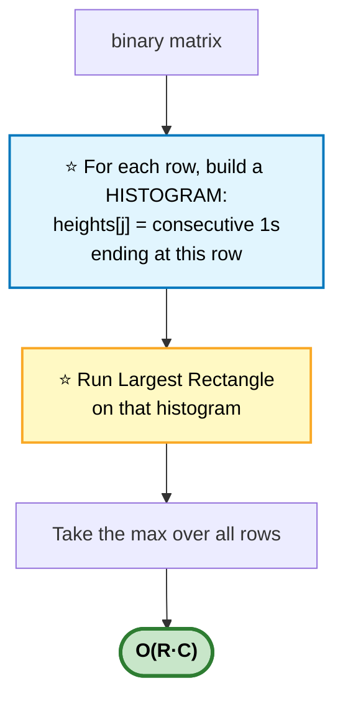

```
   MATRIX               HEIGHTS after each row
   1 0 1 0 0      →     [1, 0, 1, 0, 0]   max area 1
   1 0 1 1 1      →     [2, 0, 2, 1, 1]   max area 3
   1 1 1 1 1      →     [3, 1, 3, 2, 2]   ⭐ max area 6
   1 0 0 1 0      →     [4, 0, 0, 3, 0]   max area 4
                                          ⭐ ANSWER: 6
```

```cpp
int maximalRectangle(vector<vector<char>>& m) {
    if (m.empty()) return 0;
    int C = m[0].size(), best = 0;
    vector<int> h(C, 0);

    for (auto& row : m) {
        for (int j = 0; j < C; ++j)
            h[j] = (row[j] == '1') ? h[j] + 1 : 0;   // ⭐ a 0 RESETS the column

        best = max(best, largestRectangleArea(h));
    }
    return best;
}
```
⭐ **`h[j] = 0` on a zero cell** is the whole reduction — the column's run is broken, so any rectangle must start fresh below it.

---

# 10. Trapping Rain Water (Stack View)
🔴 ⚪ **The stack solution is covered** alongside three others in [Two Pointers #5](03-two-pointers-sliding-window.md#5-trapping-rain-water).

⭐ **The contrast worth remembering:** Largest Rectangle uses an **increasing** stack and pops on a *smaller* bar; Trapping Rain Water uses a **decreasing** stack and pops on a *larger* bar. Same machinery, mirrored comparison.

---

# 11. Remove K Digits

🟡 **Medium** · 🔵 Full ladder · ⭐ **Greedy + monotonic stack**

> Remove exactly `k` digits to make the smallest possible number.

## 💬 The greedy rule

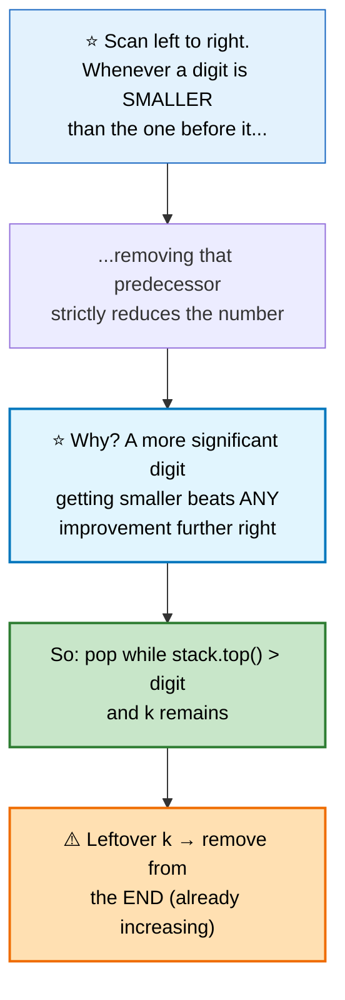

```
   TRACE  num = "1432219", k = 3

   ┌───┬────────┬──────────────────────────────────┬───┐
   │ d │ stack  │ action                           │ k │
   ├───┼────────┼──────────────────────────────────┼───┤
   │ 1 │ 1      │ push                             │ 3 │
   │ 4 │ 14     │ 4 > 1 → push                     │ 3 │
   │ 3 │ 13     │ ⭐ 3 < 4 → pop 4                 │ 2 │
   │ 2 │ 12     │ ⭐ 3 > 2 → pop 3                 │ 1 │
   │ 2 │ 122    │ 2 == 2 → push                    │ 1 │
   │ 1 │ 1211→121│⭐ 1 < 2 → pop 2                  │ 0 │
   │ 9 │ 1219   │ k exhausted → just push          │ 0 │
   └───┴────────┴──────────────────────────────────┴───┘
   ⭐ ANSWER: "1219"
```

```cpp
string removeKdigits(string num, int k) {
    string st;                                  // ⭐ a string IS a stack here

    for (char d : num) {
        while (k && !st.empty() && st.back() > d) { st.pop_back(); --k; }
        st.push_back(d);
    }

    while (k--) st.pop_back();                  // ⭐ leftover k: trim the END

    // ⚠️ strip leading zeros
    int i = 0;
    while (i < (int)st.size() && st[i] == '0') ++i;
    string out = st.substr(i);

    return out.empty() ? "0" : out;             // ⚠️ "" is not a valid number
}
```

⭐ **Why the leftover `k` is removed from the end:** if `k` remains after the scan, the stack is already non-decreasing, so the largest digits are at the back — removing those is optimal.

---

# 12. Remove Duplicate Letters
🔴 ⚪ **Variation of #11** — the same greedy pop, with one extra guard.

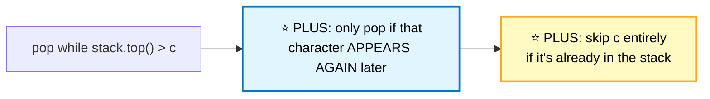

```cpp
string removeDuplicateLetters(string s) {
    int last[26] = {}, inStack[26] = {};
    for (int i = 0; i < (int)s.size(); ++i) last[s[i] - 'a'] = i;   // ⭐ last index

    string st;
    for (int i = 0; i < (int)s.size(); ++i) {
        char c = s[i];
        if (inStack[c - 'a']) continue;         // ⭐ already placed → skip

        // ⭐ pop only if that character will reappear later
        while (!st.empty() && st.back() > c && last[st.back() - 'a'] > i) {
            inStack[st.back() - 'a'] = 0;
            st.pop_back();
        }
        st.push_back(c);
        inStack[c - 'a'] = 1;
    }
    return st;
}
```
⭐ **`last[st.back()] > i` is the safety check** — popping a character that never reappears would lose it permanently, violating "every letter appears exactly once."

---

# 13. 132 Pattern

🟡 **Medium** · 🔵 Full ladder · ⭐ **Scanning backwards is the trick**

> Does there exist `i < j < k` with `a[i] < a[k] < a[j]`?

## 💬 Why scan right-to-left

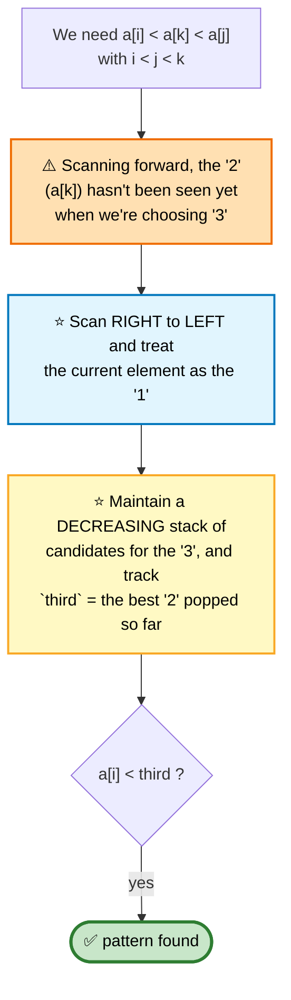

```
   ⭐⭐ THE KEY INVARIANT

   `third` holds the LARGEST value we have popped — and every
   popped value had something bigger to its right (the popper).

   So `third` is a valid "2" with a known "3" to its right.
   ⭐ We only need to find any element to the LEFT that is
     smaller than `third`.
```

```cpp
bool find132pattern(vector<int>& a) {
    stack<int> st;                              // candidates for the "3"
    long long third = LLONG_MIN;                // ⭐ best valid "2" so far

    for (int i = a.size() - 1; i >= 0; --i) {   // ⭐ RIGHT to LEFT
        if (a[i] < third) return true;          // ⭐ a[i] is the "1" → found

        while (!st.empty() && st.top() < a[i]) {
            third = st.top();                   // ⭐ popped value becomes the "2"
            st.pop();
        }
        st.push(a[i]);                          // a[i] is a candidate "3"
    }
    return false;
}
```

⭐ **`third` only ever increases**, because the stack is decreasing and we pop from the top — each new `third` is larger than the last. That's what keeps the check a single comparison.

---

# 14. Basic Calculator I (Parentheses)

🔴 **Hard** · 🔵 Full ladder · ⭐ **Stack of (result, sign)**

> Evaluate `"(1+(4+5+2)-3)+(6+8)"` = 23. Only `+`, `-`, and parentheses.

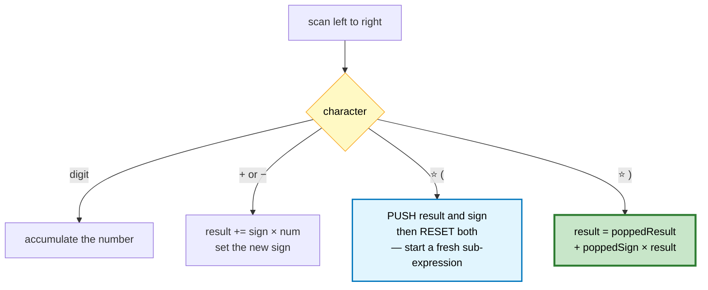

```
   ⭐⭐ WHY PUSH THE SIGN TOO

   In  "5 − (3 + 2)"  the minus applies to the ENTIRE
   parenthesized result, not just to the 3.

   Pushing the sign at '(' and applying it at ')' distributes
   the negation correctly with no extra bookkeeping.
```

```cpp
int calculate(string s) {
    stack<int> st;                              // alternating result, sign
    int result = 0, num = 0, sign = 1;

    for (char c : s) {
        if (isdigit((unsigned char)c)) {
            num = num * 10 + (c - '0');
        } else if (c == '+' || c == '-') {
            result += sign * num;
            num = 0;
            sign = (c == '+') ? 1 : -1;
        } else if (c == '(') {
            st.push(result);                    // ⭐ save the outer context
            st.push(sign);
            result = 0; sign = 1;               // ⭐ fresh sub-expression
        } else if (c == ')') {
            result += sign * num;
            num = 0;

            result *= st.top(); st.pop();       // ⭐ apply the saved sign
            result += st.top(); st.pop();       // ⭐ add the saved result
            sign = 1;
        }
    }
    return result + sign * num;                 // ⭐ flush the last number
}
```

⭐ **The pop order is the reverse of the push order** — sign first, then result. Getting this backwards is a classic bug.

🎤 **Basic Calculator III** adds `*` and `/` inside parentheses — combine this with the `last`-deferral technique from [Basic Calculator II](01c-arrays-strings.md#65-basic-calculator-ii).

---

# 15. Evaluate Reverse Polish Notation
🟡 ⚪ **Variation** — RPN needs no precedence rules at all, which is why it exists.

```cpp
int evalRPN(vector<string>& tokens) {
    stack<long long> st;

    for (auto& t : tokens) {
        if (t.size() > 1 || isdigit((unsigned char)t[0])) {   // ⚠️ "-5" is a number
            st.push(stoll(t));
            continue;
        }

        long long b = st.top(); st.pop();       // ⭐ SECOND operand pops FIRST
        long long a = st.top(); st.pop();

        switch (t[0]) {
            case '+': st.push(a + b); break;
            case '-': st.push(a - b); break;
            case '*': st.push(a * b); break;
            case '/': st.push(a / b); break;    // ⭐ C++ truncates toward zero ✅
        }
    }
    return (int)st.top();
}
```
⚠️ **Operand order matters for `-` and `/`.** The top of the stack is the *right* operand.

⚠️ **`t.size() > 1 || isdigit(t[0])`** — a bare `"-"` is an operator, but `"-5"` is a number. Checking length first handles both.

---

# 16. Asteroid Collision

🟡 **Medium** · 🔵 Full ladder · **Stack simulation with tricky control flow**

> Positive = moving right, negative = moving left. Collisions destroy the smaller; equal sizes destroy both.

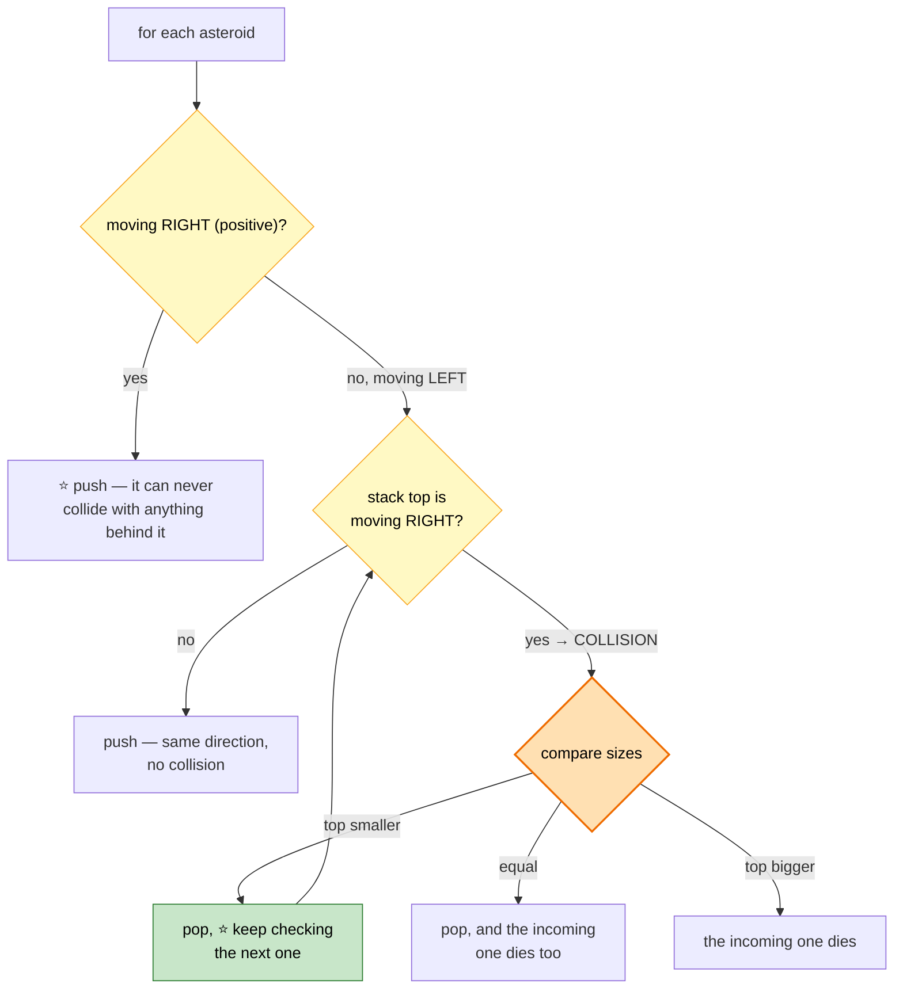

```
   ⭐ COLLISIONS ONLY HAPPEN IN ONE CONFIGURATION

     stack top moving RIGHT (+)  and  incoming moving LEFT (−)

     → →   ✅ no collision (same direction)
     ← ←   ✅ no collision
     ← →   ✅ no collision (moving APART)
     ⭐ → ←   💥 COLLISION
```

```cpp
vector<int> asteroidCollision(vector<int>& a) {
    vector<int> st;

    for (int x : a) {
        bool alive = true;

        // ⭐ collision only when top is + and x is −
        while (alive && x < 0 && !st.empty() && st.back() > 0) {
            if (st.back() < -x) {
                st.pop_back();                  // top dies, keep checking
            } else if (st.back() == -x) {
                st.pop_back();                  // ⭐ BOTH die
                alive = false;
            } else {
                alive = false;                  // incoming dies
            }
        }
        if (alive) st.push_back(x);
    }
    return st;
}
```

⚠️ **The `alive` flag is necessary** because a `break` would skip the push, but the equal-size case must *also* skip the push — two different exit conditions with the same outcome.

---

# 17. Simplify Path
🟡 ⚪ **Variation** — a stack of directory names.

```cpp
string simplifyPath(string path) {
    vector<string> st;
    stringstream ss(path);
    string token;

    while (getline(ss, token, '/')) {
        if (token.empty() || token == ".") continue;        // ⭐ ignore
        if (token == "..") { if (!st.empty()) st.pop_back(); }  // ⭐ go up
        else st.push_back(token);
    }

    string out;
    for (auto& d : st) out += "/" + d;
    return out.empty() ? "/" : out;             // ⚠️ root is "/", not ""
}
```
⭐ **`getline` with `/` as the delimiter** handles `//` and trailing slashes automatically — they produce empty tokens, which the first check skips.

---

# 18. Decode String
🟡 ⚪ **Fully covered** in [Strings #66](01c-arrays-strings.md#66-decode-string) — two stacks, one for counts and one for prefixes.

---

# 19. Sliding Window Maximum
🔴 ⚪ **Fully covered** in [Two Pointers #12](03-two-pointers-sliding-window.md#12-sliding-window-maximum) — the monotonic **deque**, which is the two-ended cousin of everything in this chapter.

---

# 20. Design Circular Queue

🟡 **Medium** · 🔵 Full ladder · **Ring buffer**

## ⚠️ The full-vs-empty ambiguity

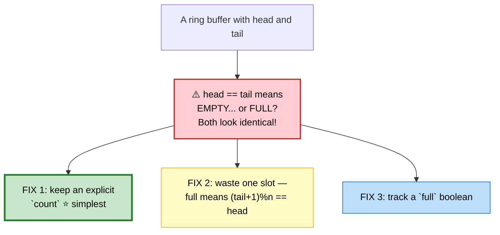

```cpp
class MyCircularQueue {
    vector<int> buf;
    int head = 0, count = 0, cap;               // ⭐ explicit count

public:
    MyCircularQueue(int k) : buf(k), cap(k) {}

    bool enQueue(int v) {
        if (isFull()) return false;
        buf[(head + count) % cap] = v;          // ⭐ modular wrap
        ++count;
        return true;
    }
    bool deQueue() {
        if (isEmpty()) return false;
        head = (head + 1) % cap;                // ⭐ advance, don't shift
        --count;
        return true;
    }
    int  Front() { return isEmpty() ? -1 : buf[head]; }
    int  Rear()  { return isEmpty() ? -1 : buf[(head + count - 1) % cap]; }
    bool isEmpty() { return count == 0; }
    bool isFull()  { return count == cap; }
};
```

⭐ **Ring buffers are everywhere in real systems** — audio pipelines, network packet queues, Kafka partitions, and the `RingBuffer` at the heart of LMAX Disruptor. The `% cap` arithmetic is the whole idea: reuse the same memory forever with no allocation.

---

## 📋 Stacks & Queues Recall

```mermaid
mindmap
  root(("Stacks<br/>&amp; Queues"))
    Monotonic Stack
      ⭐ the highest-value pattern here
      next/prev greater/smaller
      store INDICES, not values
      sentinel to flush leftovers
      amortized O(n): push once, pop once
    Largest Rectangle
      ⭐ each bar's span = prev/next smaller
      increasing stack + 0 sentinel
      2D → per-row histogram
    Greedy + Stack
      pop while top is worse
      ⚠️ guard: will it reappear?
      leftover k → trim the end
    Parsing
      push the EXPECTED closer
      ⭐ push (result, sign) at '('
      RPN needs no precedence
      two stacks for nesting
    Auxiliary State
      min stack in lockstep
      ⭐ delta encoding for O(1) space
      absorb spans for online queries
    Queues
      ⭐ two stacks → amortized O(1)
      one queue → O(n) push, no fix
      ring buffer: count kills ambiguity
```

```
╔══════════════════════════════════════════════════════════════════════╗
║                STACKS & QUEUES — PATTERN RECALL                      ║
╠══════════════════════════════════════════════════════════════════════╣
║ "matching / nesting"           → stack, push the expected closer     ║
║ "next greater / smaller"       → ⭐ MONOTONIC STACK of indices        ║
║ "how many days until..."       → same, store the index GAP           ║
║ "largest rectangle"            → ⭐ increasing stack + 0 sentinel     ║
║ "maximal rectangle in a grid"  → per-row histogram, then the above   ║
║ "smallest number after k dels" → greedy: pop while top > current     ║
║ "pattern a[i] < a[k] < a[j]"   → ⭐ scan RIGHT to LEFT, track `third` ║
║ "expression with parentheses"  → ⭐ push (result, sign) at '('        ║
║ "O(1) getMin alongside a stack"→ parallel min stack, in lockstep     ║
║ "queue from stacks"            → ⭐ pour ONLY when `out` is empty     ║
║ "max of every k-window"        → monotonic DEQUE                     ║
╠══════════════════════════════════════════════════════════════════════╣
║ ⚠️ TRAPS                                                              ║
║   histogram: forgetting the trailing 0 sentinel leaves bars unmeasured║
║   histogram: width is i − st.top() − 1, and i when the stack empties ║
║   circular NGE: push only during the FIRST pass                      ║
║   queue-from-stacks: pouring early destroys FIFO order               ║
║   RPN: the stack top is the RIGHT operand — order matters for − and /║
║   remove dup letters: only pop if the char REAPPEARS later           ║
║   Calculator I: pop sign BEFORE result — reverse of the push order   ║
╚══════════════════════════════════════════════════════════════════════╝
```

---

**Next:** [Trees →](06-trees.md) · **Back:** [Linked Lists](04-linked-lists.md)
