# 🌳 Trees & Binary Search Trees

> Almost every tree problem is one question: **what do I need from my children, and what do I return to my parent?** Get that contract right and the code writes itself.

**Prerequisite:** [Patterns & Foundations](00-patterns.md) · **Format:** [see the sample](FORMAT-SAMPLE.md)

---

## 🧠 The Decision That Drives Every Tree Problem

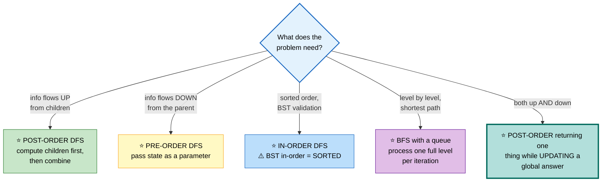

## ⭐ The Three Traversals — and when each is right

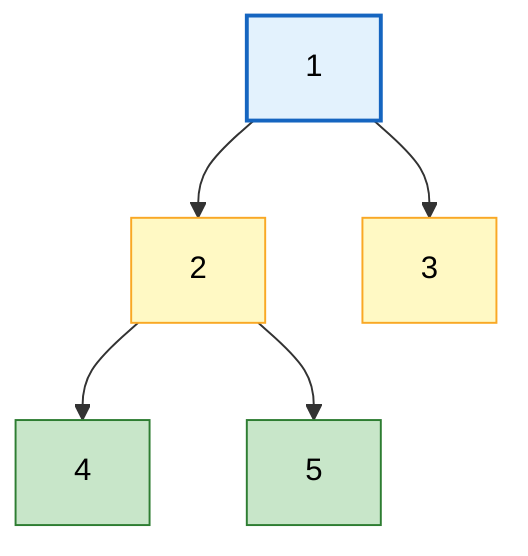

```
   PRE-ORDER    node, left, right   →  1 2 4 5 3
     ⭐ Use when the parent must decide something BEFORE
       the children see it (passing down a bound, a path,
       an accumulated value). Also: serialization, tree copying.

   IN-ORDER     left, node, right   →  4 2 5 1 3
     ⭐ On a BST this yields SORTED order. That single fact
       solves Validate BST, Kth Smallest, Recover BST,
       and BST-to-list conversions.

   POST-ORDER   left, right, node   →  4 5 2 3 1
     ⭐ Use when the node's answer DEPENDS on its children:
       height, diameter, subtree sums, balance checks,
       deletion, LCA.
```

```cpp
struct TreeNode {
    int val;
    TreeNode *left, *right;
    TreeNode(int v = 0) : val(v), left(nullptr), right(nullptr) {}
};
```

---

## 📑 Contents

| # | Problem | Diff | Type | Optimal |
|---|---|---|---|---|
| [1](#1-maximum-depth-of-binary-tree) | Maximum Depth | 🟢 | 🔵 **Full** | O(n) post-order |
| [2](#2-balanced-binary-tree) | Balanced Binary Tree | 🟢 | 🔵 **Full** | ⭐ O(n) with early exit |
| [3](#3-diameter-of-binary-tree) | Diameter of Binary Tree | 🟢 | 🔵 **Full** | ⭐ return one thing, track another |
| [4](#4-binary-tree-maximum-path-sum) | Max Path Sum | 🔴 | ⚪ Variation | same shape, clamp at 0 |
| [5](#5-same-tree--symmetric-tree) | Same Tree / Symmetric | 🟢 | 🔵 **Full** | parallel recursion |
| [6](#6-subtree-of-another-tree) | Subtree of Another Tree | 🟢 | ⚪ Variation | O(n·m) or O(n) via KMP |
| [7](#7-invert-binary-tree) | Invert Binary Tree | 🟢 | ⚪ Variation | swap children |
| [8](#8-level-order-traversal) | Level Order Traversal | 🟡 | 🔵 **Full** | ⭐ the level-size trick |
| [9](#9-zigzag--right-side-view) | Zigzag / Right Side View | 🟡 | ⚪ Variation | BFS with a flag |
| [10](#10-validate-binary-search-tree) | Validate BST | 🟡 | 🔵 **Full** | ⭐ bounds, not local checks |
| [11](#11-kth-smallest-in-a-bst) | Kth Smallest in BST | 🟡 | 🔵 **Full** | in-order with early stop |
| [12](#12-lowest-common-ancestor-bst--binary-tree) | LCA (BST + general) | 🟡 | 🔵 **Full** | O(n) post-order |
| [13](#13-construct-tree-from-traversals) | Construct from Traversals | 🟡 | 🔵 **Full** | ⭐ pre + in, with a map |
| [14](#14-serialize-and-deserialize) | Serialize / Deserialize | 🔴 | 🔵 **Full** | pre-order with null markers |
| [15](#15-path-sum-i--ii--iii) | Path Sum I / II / III | 🟡 | 🔵 **Full** | ⭐ III = prefix sums on paths |
| [16](#16-flatten-binary-tree-to-linked-list) | Flatten to Linked List | 🟡 | 🔵 **Full** | ⭐ O(1) Morris-style |
| [17](#17-populating-next-right-pointers) | Populating Next Right Pointers | 🟡 | ⚪ Variation | O(1) using the built links |
| [18](#18-morris-traversal) | Morris Traversal | 🔴 | 🔵 **Full** | ⭐ O(1) space in-order |
| [19](#19-trie-prefix-tree) | Trie (Prefix Tree) | 🟡 | 🔵 **Full** | design + word search |
| [20](#20-segment-tree--fenwick-tree) | Segment Tree / Fenwick | 🔴 | 🔵 **Full** | range query + point update |

---

# 1. Maximum Depth of Binary Tree

🟢 **Easy** · 🔵 Full ladder · ⭐ **The post-order contract in its purest form**

## 💬 The recursive contract

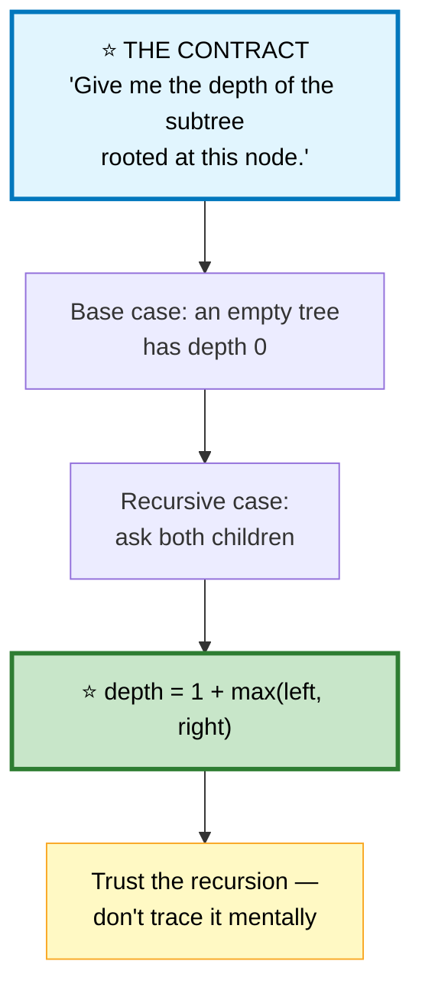

```
   ⭐⭐ THE MOST USEFUL MENTAL HABIT IN TREE PROBLEMS

   Do NOT trace the recursion by hand. Instead:

     1. State what the function PROMISES to return.
     2. Handle the empty/base case.
     3. ASSUME the recursive calls fulfil the promise.
     4. Combine their answers correctly.

   If steps 1–4 are right, the whole tree is right by induction.
   ⭐ Tracing three levels deep is how people talk themselves
     into bugs.
```

```cpp
int maxDepth(TreeNode* root) {
    if (!root) return 0;                        // ⭐ base case
    return 1 + max(maxDepth(root->left), maxDepth(root->right));
}
```

## 🔁 The iterative BFS version
```cpp
int maxDepth(TreeNode* root) {
    if (!root) return 0;
    queue<TreeNode*> q;
    q.push(root);
    int depth = 0;

    while (!q.empty()) {
        int sz = q.size();                      // ⭐ freeze the level size
        for (int i = 0; i < sz; ++i) {
            TreeNode* n = q.front(); q.pop();
            if (n->left)  q.push(n->left);
            if (n->right) q.push(n->right);
        }
        ++depth;
    }
    return depth;
}
```

⚠️ **Space:** recursion is O(h) — that's O(log n) for a balanced tree but **O(n) for a degenerate one**. Worth stating; interviewers ask.

---

# 2. Balanced Binary Tree

🟢 **Easy** · 🔵 Full ladder · ⭐ **The early-exit sentinel**

> Every node's two subtrees differ in height by at most 1.

## 🗺️ Approach Ladder

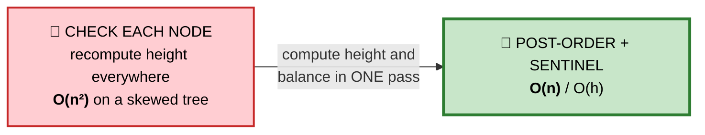

```
   ⚠️ WHY THE NAIVE VERSION IS O(n²)

   isBalanced(node):
       return |height(left) − height(right)| <= 1
              && isBalanced(left) && isBalanced(right)

   ⭐ height() walks the ENTIRE subtree, and it's called
     at every node. On a skewed tree that's
     n + (n−1) + (n−2) + ... = O(n²).
```

## 💬 The fix: one value carries two meanings

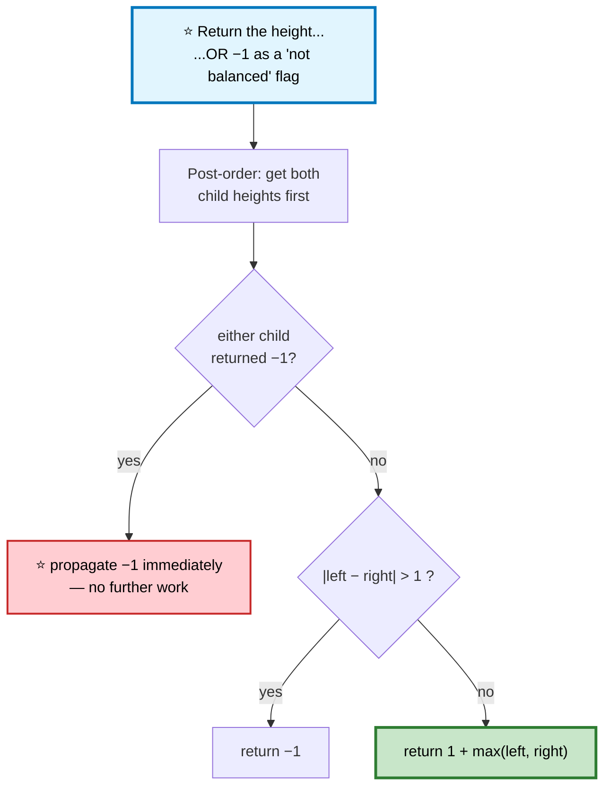

```cpp
int height(TreeNode* n) {
    if (!n) return 0;

    int L = height(n->left);
    if (L == -1) return -1;                     // ⭐ short-circuit up the stack

    int R = height(n->right);
    if (R == -1) return -1;

    if (abs(L - R) > 1) return -1;              // ⭐ unbalanced HERE
    return 1 + max(L, R);
}

bool isBalanced(TreeNode* root) { return height(root) != -1; }
```

⭐ **Encoding a failure in the return value** is a broadly useful trick — it turns a two-pass algorithm into one pass whenever the "failure" value can't collide with a legitimate one (heights are never negative).

## 📌 Pattern Card
```
SIGNAL   a property that must hold at EVERY node
KEY      ⭐ one post-order pass; encode failure as an impossible value
RELATED  Diameter · Max Path Sum · Longest Univalue Path
```

---

# 3. Diameter of Binary Tree

🟢 **Easy to state, the pattern is everything** · 🔵 Full ladder

> Longest path between any two nodes. The path **need not pass through the root**.

## 💬 The two-values insight — ⭐ the most important idea in this chapter

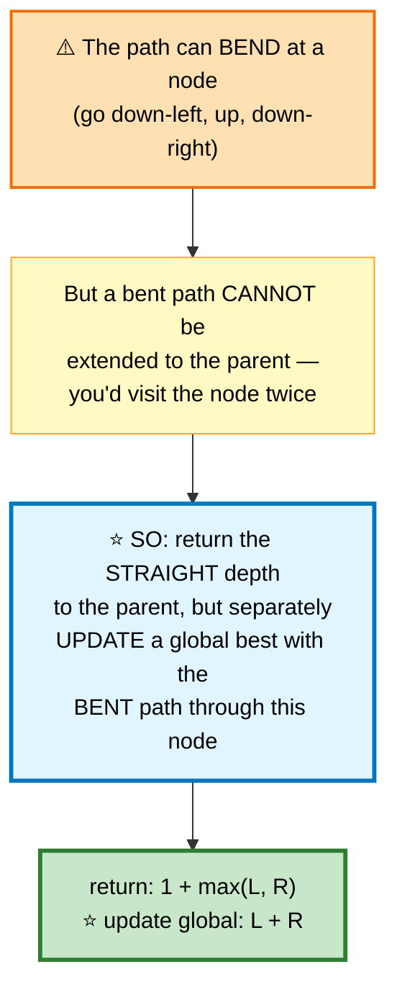

```
   AT EACH NODE, TWO DIFFERENT QUANTITIES

              (n)
             /   \
       depth L     depth R

   ⭐ RETURNED to the parent:  1 + max(L, R)
      "the longest STRAIGHT path going down from me"
      — must be straight, or the parent can't use it

   ⭐ USED for the global answer:  L + R
      "the longest BENT path through me"
      — this node is the highest point of that path

   ⚠️ Confusing these two is THE bug in this family of problems.
```

```
   EXAMPLE          1
                   / \
                  2   3
                 / \
                4   5

   at node 4: return 1, global = 0
   at node 5: return 1, global = 0
   at node 2: L=1, R=1 → ⭐ global = 1+1 = 2, return 1+max = 2
   at node 3: return 1, global unchanged
   at node 1: L=2, R=1 → ⭐ global = 2+1 = 3, return 3

   ⭐ ANSWER: 3 edges (path 4 → 2 → 1 → 3)
```

```cpp
class Solution {
    int best = 0;

    int depth(TreeNode* n) {
        if (!n) return 0;

        int L = depth(n->left);
        int R = depth(n->right);

        best = max(best, L + R);                // ⭐ BENT path through n
        return 1 + max(L, R);                   // ⭐ STRAIGHT path for the parent
    }

public:
    int diameterOfBinaryTree(TreeNode* root) {
        depth(root);
        return best;
    }
};
```

## 📌 Pattern Card
```
SIGNAL   "longest/best path anywhere in the tree"
KEY      ⭐ RETURN the straight (extendable) value
         ⭐ UPDATE a global with the bent (non-extendable) value
RELATED  Max Path Sum · Longest Univalue Path · Longest ZigZag Path
```

---

# 4. Binary Tree Maximum Path Sum
🔴 ⚪ **Variation of #3** — the same two-values structure, plus one crucial clamp.

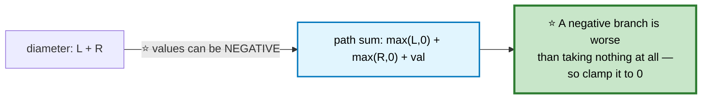

```cpp
class Solution {
    int best = INT_MIN;                         // ⚠️ NOT 0 — all values may be negative

    int gain(TreeNode* n) {
        if (!n) return 0;

        int L = max(gain(n->left),  0);         // ⭐⭐ CLAMP — skip negative branches
        int R = max(gain(n->right), 0);

        best = max(best, n->val + L + R);       // ⭐ bent path through n
        return n->val + max(L, R);              // ⭐ straight path for the parent
    }

public:
    int maxPathSum(TreeNode* root) { gain(root); return best; }
};
```

⚠️ **`best = INT_MIN`, not 0.** A tree of all-negative values must return the largest single node, not 0.

⭐ **`max(gain(...), 0)` is the entire difference from Diameter.** It encodes "you may decline a subtree" — exactly the same idea as Kadane's restart in [Maximum Subarray](01-arrays-strings.md).

---

# 5. Same Tree / Symmetric Tree

🟢 **Easy** · 🔵 Full ladder · ⭐ **Parallel recursion**

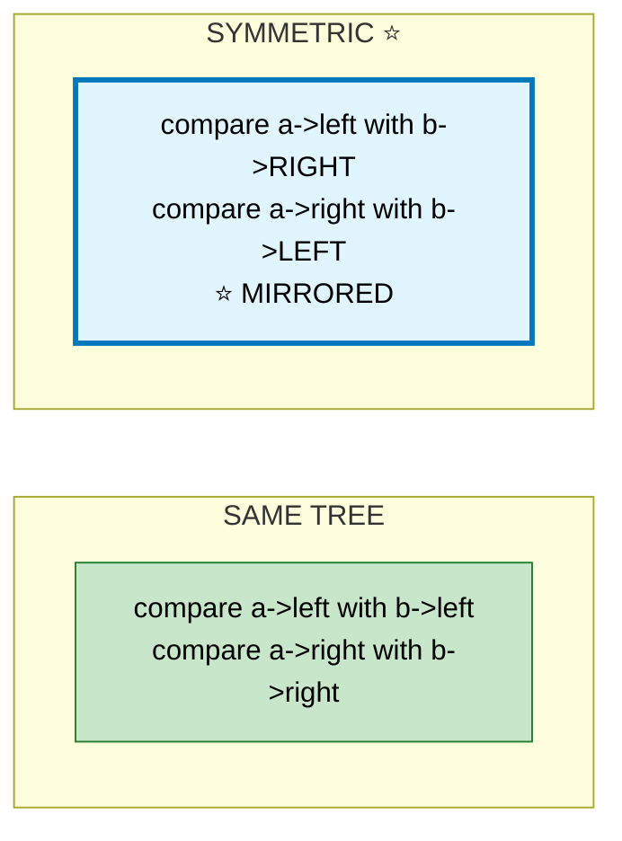

```cpp
bool isSameTree(TreeNode* a, TreeNode* b) {
    if (!a && !b) return true;                  // ⭐ both null → equal
    if (!a || !b) return false;                 // ⭐ one null → not equal
    return a->val == b->val
        && isSameTree(a->left,  b->left)
        && isSameTree(a->right, b->right);
}

bool isMirror(TreeNode* a, TreeNode* b) {
    if (!a && !b) return true;
    if (!a || !b) return false;
    return a->val == b->val
        && isMirror(a->left,  b->right)         // ⭐⭐ CROSSED
        && isMirror(a->right, b->left);
}

bool isSymmetric(TreeNode* root) {
    return !root || isMirror(root->left, root->right);
}
```

⭐ **The null-handling order matters.** Check "both null" first (success), then "either null" (failure). Reversing them makes two null trees report unequal.

---

# 6. Subtree of Another Tree
🟢 ⚪ **Variation of #5** — run `isSameTree` at every node.

```cpp
bool isSubtree(TreeNode* root, TreeNode* sub) {
    if (!root) return false;
    if (isSameTree(root, sub)) return true;     // ⭐ try here
    return isSubtree(root->left, sub) || isSubtree(root->right, sub);
}
```
**O(n·m)** worst case.

🎤 **Follow-up: O(n + m)?** Serialize both trees to strings *with null markers and delimiters*, then run [KMP](01c-arrays-strings.md#56-implement-strstr-needle-search).

⚠️ **The markers are essential.** Without them, tree `[1,2]` and `[1,null,2]` serialize identically, and you get false positives. Use `"#"` for null and `","` between values.

---

# 7. Invert Binary Tree
🟢 ⚪ **Variation** — famously the question that got Max Howell rejected by Google.

```cpp
TreeNode* invertTree(TreeNode* root) {
    if (!root) return nullptr;
    swap(root->left, root->right);              // ⭐ swap, then recurse
    invertTree(root->left);
    invertTree(root->right);
    return root;
}
```
⭐ **Pre-order or post-order both work** — swapping is order-independent. In-order does *not*: after the swap, the second recursive call would revisit an already-inverted subtree.

---

# 8. Level Order Traversal

🟡 **Medium** · 🔵 Full ladder · ⭐ **The level-size trick**

## 💬 The core question: how do you know where a level ends?

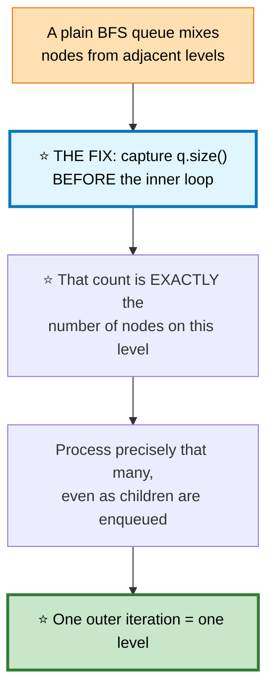

```
   ⚠️ THE BUG THIS PREVENTS

     for (int i = 0; i < q.size(); ++i)   ❌ WRONG

   q.size() is re-evaluated every iteration, and it GROWS as
   you push children. The loop never terminates correctly.

   ⭐ Freeze it first:  int sz = q.size();
```

```cpp
vector<vector<int>> levelOrder(TreeNode* root) {
    if (!root) return {};

    vector<vector<int>> out;
    queue<TreeNode*> q;
    q.push(root);

    while (!q.empty()) {
        int sz = q.size();                      // ⭐⭐ FREEZE the level size
        vector<int> level;

        for (int i = 0; i < sz; ++i) {
            TreeNode* n = q.front(); q.pop();
            level.push_back(n->val);
            if (n->left)  q.push(n->left);
            if (n->right) q.push(n->right);
        }
        out.push_back(move(level));
    }
    return out;
}
```

⭐ **This single skeleton solves a whole family:** Level Order, Zigzag, Right Side View, Average of Levels, Largest Value per Row, Level Order Bottom-Up (reverse at the end), and Minimum Depth (return at the first leaf).

## 📌 Pattern Card
```
SIGNAL   "level by level" · "shortest path in an unweighted graph"
KEY      ⭐ int sz = q.size() BEFORE the inner loop
RELATED  Zigzag · Right Side View · Min Depth · Word Ladder · Rotting Oranges
```

---

# 9. Zigzag / Right Side View
🟡 ⚪ **Variations of #8** — same skeleton, different bookkeeping.

```cpp
// Zigzag — reverse alternate levels
vector<vector<int>> zigzagLevelOrder(TreeNode* root) {
    if (!root) return {};
    vector<vector<int>> out;
    queue<TreeNode*> q;
    q.push(root);
    bool leftToRight = true;

    while (!q.empty()) {
        int sz = q.size();
        vector<int> level(sz);
        for (int i = 0; i < sz; ++i) {
            TreeNode* n = q.front(); q.pop();
            // ⭐ write into the correct slot instead of reversing afterwards
            level[leftToRight ? i : sz - 1 - i] = n->val;
            if (n->left)  q.push(n->left);
            if (n->right) q.push(n->right);
        }
        out.push_back(move(level));
        leftToRight = !leftToRight;
    }
    return out;
}

// Right Side View — the LAST node of each level
vector<int> rightSideView(TreeNode* root) {
    if (!root) return {};
    vector<int> out;
    queue<TreeNode*> q;
    q.push(root);

    while (!q.empty()) {
        int sz = q.size();
        for (int i = 0; i < sz; ++i) {
            TreeNode* n = q.front(); q.pop();
            if (i == sz - 1) out.push_back(n->val);   // ⭐ last in this level
            if (n->left)  q.push(n->left);
            if (n->right) q.push(n->right);
        }
    }
    return out;
}
```
⭐ **Writing into an indexed slot** beats building then reversing — same complexity, less code, no allocation churn.

---

# 10. Validate Binary Search Tree

🟡 **Medium** · 🔵 Full ladder · ⭐ **The classic trap**

## ⚠️ Why the obvious check is wrong

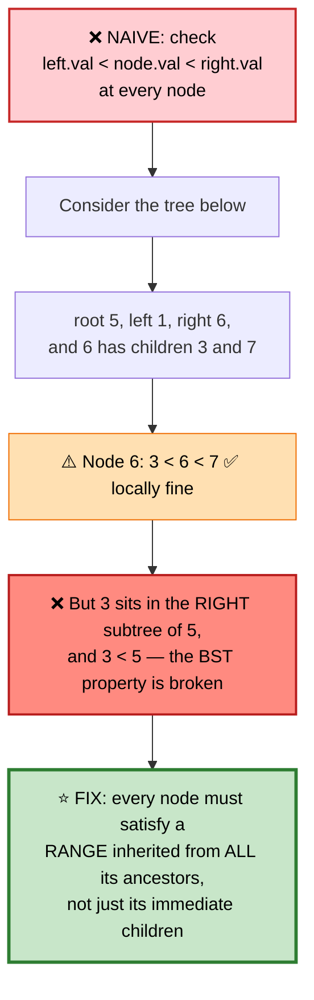

```
   ⭐ THE RANGE PROPAGATES DOWN

              5              range (−∞, +∞)
            /   \
           1     6           left: (−∞, 5)   right: (5, +∞)
                / \
               3   7         ⭐ 3 must be in (5, +∞) → ❌ INVALID

   ⭐ Going LEFT tightens the UPPER bound to node->val
   ⭐ Going RIGHT tightens the LOWER bound to node->val
```

## Approach A — bounds passed down (pre-order)
```cpp
bool valid(TreeNode* n, long long lo, long long hi) {
    if (!n) return true;
    if (n->val <= lo || n->val >= hi) return false;   // ⚠️ strict — no duplicates

    return valid(n->left,  lo, n->val)          // ⭐ tighten the UPPER bound
        && valid(n->right, n->val, hi);         // ⭐ tighten the LOWER bound
}

bool isValidBST(TreeNode* root) {
    return valid(root, LLONG_MIN, LLONG_MAX);   // ⚠️ long long — nodes may be INT_MIN/MAX
}
```

## Approach B — in-order must be strictly increasing ⭐
```cpp
class Solution {
    TreeNode* prev = nullptr;
public:
    bool isValidBST(TreeNode* root) {
        if (!root) return true;

        if (!isValidBST(root->left)) return false;

        // ⭐ in-order position: prev is the immediately preceding value
        if (prev && prev->val >= root->val) return false;
        prev = root;

        return isValidBST(root->right);
    }
};
```

⭐ **Approach B uses the defining fact of BSTs:** in-order traversal yields sorted order. Storing a `TreeNode*` rather than an `int` sidesteps the `INT_MIN` sentinel problem entirely.

## 📌 Pattern Card
```
SIGNAL   validate a BST · anything needing ancestor context
KEY      ⭐ pass a RANGE down, or check in-order monotonicity
         ⚠️ local parent-child comparisons are NOT sufficient
RELATED  Recover BST · Kth Smallest · Range Sum of BST
```

---

# 11. Kth Smallest in a BST

🟡 **Medium** · 🔵 Full ladder

## 🗺️ Approach Ladder

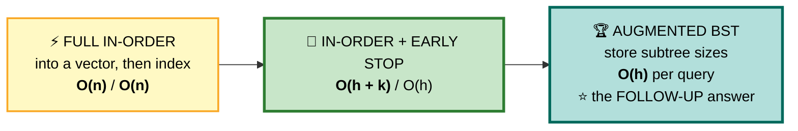

```cpp
int kthSmallest(TreeNode* root, int k) {
    stack<TreeNode*> st;
    TreeNode* curr = root;

    while (curr || !st.empty()) {
        while (curr) { st.push(curr); curr = curr->left; }   // ⭐ dive left

        curr = st.top(); st.pop();
        if (--k == 0) return curr->val;         // ⭐ EARLY EXIT

        curr = curr->right;
    }
    return -1;
}
```

🎤 **Follow-up: the BST is modified often and kth is queried often.**

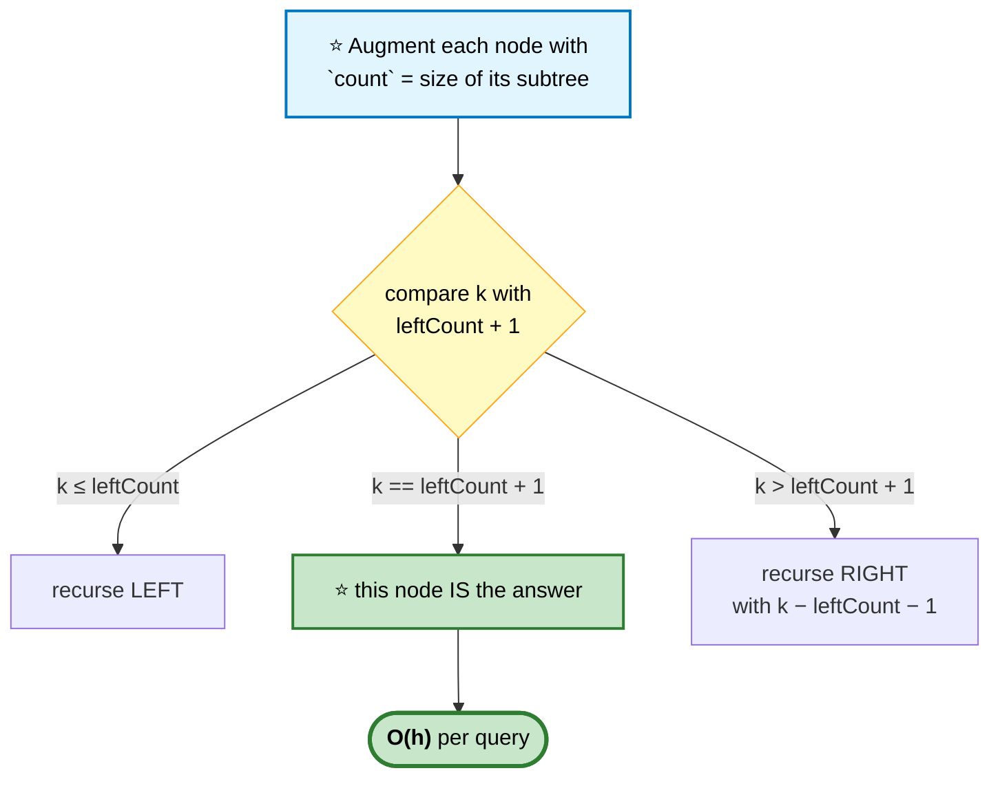

⭐ **Order-statistic trees** are exactly this augmentation, and they're what makes "kth element" an O(log n) database operation.

---

# 12. Lowest Common Ancestor (BST + Binary Tree)

🟡 **Medium** · 🔵 Full ladder · **Two very different solutions**

## BST version — ⭐ O(h), no recursion needed

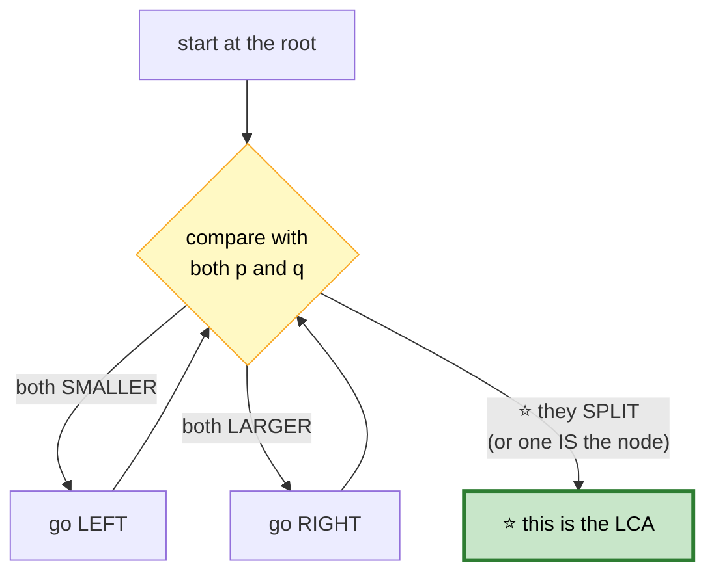

```cpp
TreeNode* lowestCommonAncestor(TreeNode* root, TreeNode* p, TreeNode* q) {
    while (root) {
        if      (p->val < root->val && q->val < root->val) root = root->left;
        else if (p->val > root->val && q->val > root->val) root = root->right;
        else return root;                       // ⭐ the split point
    }
    return nullptr;
}
```
⭐ **The first node where p and q diverge is by definition their LCA** — above it they share the path, below it they don't.

## General binary tree — ⭐ post-order

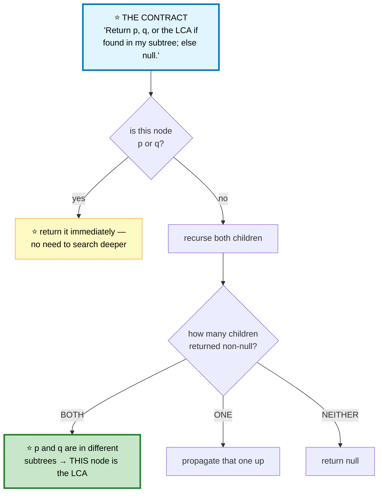

```cpp
TreeNode* lowestCommonAncestor(TreeNode* root, TreeNode* p, TreeNode* q) {
    if (!root || root == p || root == q) return root;   // ⭐ found one, or empty

    TreeNode* L = lowestCommonAncestor(root->left,  p, q);
    TreeNode* R = lowestCommonAncestor(root->right, p, q);

    if (L && R) return root;                    // ⭐⭐ they SPLIT here → LCA
    return L ? L : R;                           // ⭐ propagate whichever was found
}
```

```
   ⭐⭐ WHY RETURNING EARLY AT p IS CORRECT

   If p is an ANCESTOR of q, we return p without descending
   further. Is that right? Yes — p is genuinely the LCA in
   that case, since q lies inside p's subtree.

   ⚠️ This relies on the problem's guarantee that BOTH nodes
     exist in the tree. If they might not, you need a second
     pass to verify presence.
```

## 📌 Pattern Card
```
SIGNAL   lowest common ancestor · "where do two paths diverge"
KEY      BST → walk until they split (O(h), iterative)
         general → ⭐ post-order; both children non-null = LCA
RELATED  LCA III (parent pointers → the intersection trick)
         Distance Between Nodes · Path Between Nodes
```

---

# 13. Construct Tree from Traversals

🟡 **Medium** · 🔵 Full ladder · ⭐ **Pre-order gives roots, in-order gives splits**

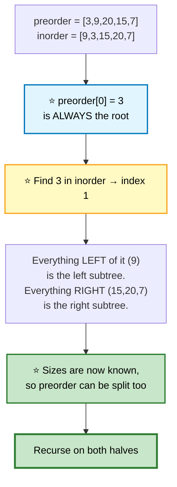

```
   preorder:  [ 3 | 9 | 20  15  7 ]
                ▲   ▲   ▲
              root  L   R (sizes come from the inorder split)

   inorder:   [ 9 | 3 | 15  20  7 ]
                ▲   ▲   ▲
                L  root  R
```

```cpp
class Solution {
    unordered_map<int,int> pos;                 // ⭐ value → index in inorder
    int preIdx = 0;

    TreeNode* build(vector<int>& pre, int lo, int hi) {
        if (lo > hi) return nullptr;

        int rootVal = pre[preIdx++];            // ⭐ consume the next root
        TreeNode* root = new TreeNode(rootVal);

        int mid = pos[rootVal];                 // ⭐ O(1) lookup, not an O(n) scan
        root->left  = build(pre, lo, mid - 1);  // ⚠️ LEFT FIRST — preorder order
        root->right = build(pre, mid + 1, hi);

        return root;
    }

public:
    TreeNode* buildTree(vector<int>& preorder, vector<int>& inorder) {
        for (int i = 0; i < (int)inorder.size(); ++i) pos[inorder[i]] = i;
        return build(preorder, 0, inorder.size() - 1);
    }
};
```

⚠️ **`root->left` must be built before `root->right`** — `preIdx` advances globally, and pre-order visits the entire left subtree before any of the right.

⭐ **The hash map turns O(n²) into O(n).** Scanning `inorder` for each root is the naive cost.

```
   ⭐ WHICH TRAVERSAL PAIRS UNIQUELY DETERMINE A TREE?

     pre + in     ✅ yes
     post + in    ✅ yes (build RIGHT first, consuming post backwards)
     pre + post   ❌ NO — ambiguous for nodes with a single child
                     ⭐ unless the tree is guaranteed FULL

   ⚠️ A favourite interview follow-up. In-order is the one that
     supplies the SPLIT; without it you can't tell which side a
     lone child belongs on.
```

---

# 14. Serialize and Deserialize

🔴 **Hard** · 🔵 Full ladder · ⭐ **Null markers are the whole problem**

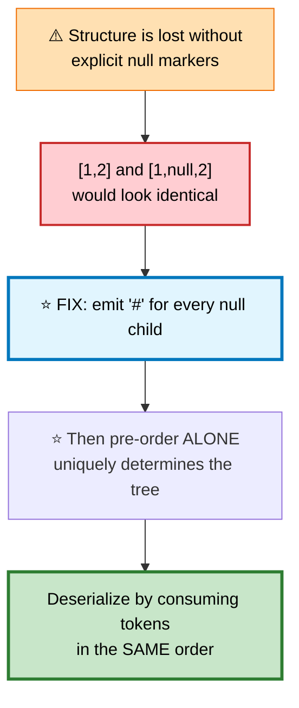

```
   TREE            1
                  / \
                 2   3
                    / \
                   4   5

   ⭐ SERIALIZED (pre-order with null markers):
      1,2,#,#,3,4,#,#,5,#,#,

   ⭐ Reading it back: consume tokens left to right.
     '#' → return null.
     Otherwise → make a node, then recursively build
     left and right from the following tokens.
```

```cpp
class Codec {
    void ser(TreeNode* n, string& out) {
        if (!n) { out += "#,"; return; }        // ⭐ the null marker
        out += to_string(n->val) + ",";
        ser(n->left, out);
        ser(n->right, out);
    }

    TreeNode* des(istringstream& ss) {
        string tok;
        getline(ss, tok, ',');
        if (tok == "#") return nullptr;         // ⭐ matches the marker

        TreeNode* n = new TreeNode(stoi(tok));
        n->left  = des(ss);                     // ⚠️ LEFT before RIGHT —
        n->right = des(ss);                     //    must mirror serialization
        return n;
    }

public:
    string serialize(TreeNode* root) { string s; ser(root, s); return s; }

    TreeNode* deserialize(string data) {
        istringstream ss(data);
        return des(ss);
    }
};
```

⭐ **BFS serialization** (the LeetCode display format) also works and reads more naturally, but pre-order is shorter to write and recurses cleanly.

🎤 **Follow-up: serialize a BST more compactly?** No null markers needed — pre-order plus the BST range invariant is enough, since the bounds tell you when a subtree ends. That roughly halves the output size.

---

# 15. Path Sum I / II / III

🟡 **Medium** · 🔵 Full ladder · ⭐ **III is the interesting one**

## I — does a root-to-leaf path sum to target?
```cpp
bool hasPathSum(TreeNode* root, int target) {
    if (!root) return false;
    if (!root->left && !root->right) return root->val == target;   // ⭐ LEAF check

    int rem = target - root->val;
    return hasPathSum(root->left, rem) || hasPathSum(root->right, rem);
}
```
⚠️ **The leaf check must be "no children", not "null node".** Returning `target == 0` at a null node wrongly accepts a path that stops mid-tree.

## II — return all such paths
```cpp
class Solution {
    vector<vector<int>> out;
    vector<int> path;

    void dfs(TreeNode* n, int rem) {
        if (!n) return;

        path.push_back(n->val);                 // ⭐ choose
        rem -= n->val;

        if (!n->left && !n->right && rem == 0) out.push_back(path);
        dfs(n->left, rem);
        dfs(n->right, rem);

        path.pop_back();                        // ⭐⭐ UNDO — the backtracking core
    }
public:
    vector<vector<int>> pathSum(TreeNode* root, int t) { dfs(root, t); return out; }
};
```
⭐ **`push_back` / recurse / `pop_back`** is the backtracking skeleton reused throughout [Backtracking](10-greedy-backtracking-misc.md).

## III — ⭐ any downward path, not just root-to-leaf

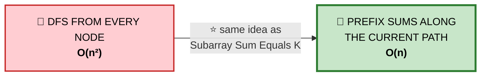

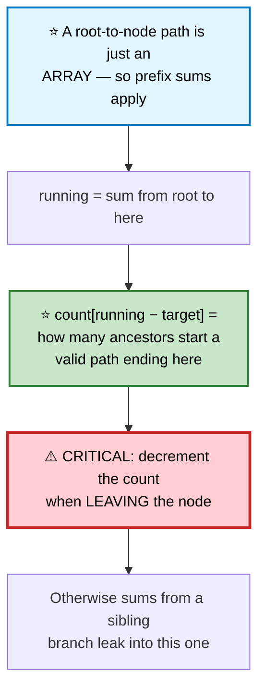

```cpp
class Solution {
    unordered_map<long long,int> cnt;
    int target, ans = 0;

    void dfs(TreeNode* n, long long running) {
        if (!n) return;

        running += n->val;
        auto it = cnt.find(running - target);
        if (it != cnt.end()) ans += it->second;

        ++cnt[running];                         // ⭐ enter: register this prefix
        dfs(n->left,  running);
        dfs(n->right, running);
        --cnt[running];                         // ⭐⭐ LEAVE: unregister it
    }

public:
    int pathSum(TreeNode* root, int t) {
        target = t;
        cnt[0] = 1;                             // ⭐ the empty prefix
        dfs(root, 0);
        return ans;
    }
};
```

⚠️ **`--cnt[running]` on the way out is the entire difficulty.** Without it, a prefix from the left subtree is still visible while traversing the right subtree — producing paths that bend, which the problem forbids.

## 📌 Pattern Card
```
SIGNAL   count paths with a target sum, path need not start at root
KEY      ⭐ prefix sums along the ROOT-TO-NODE path
         ⚠️ decrement the count when backtracking out of a node
RELATED  Subarray Sum Equals K (the 1D version) · Longest Path with Sum
```

---

# 16. Flatten Binary Tree to Linked List

🟡 **Medium** · 🔵 Full ladder · ⭐ **The O(1) Morris-style version**

> Flatten in place into a right-skewed list following **pre-order**.

## 🗺️ Approach Ladder

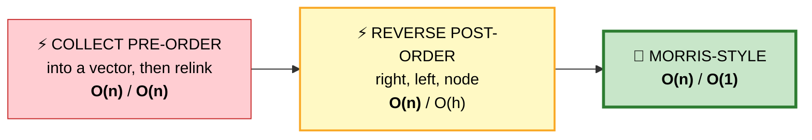

## 3️⃣ Morris-style — ⭐ O(1) space

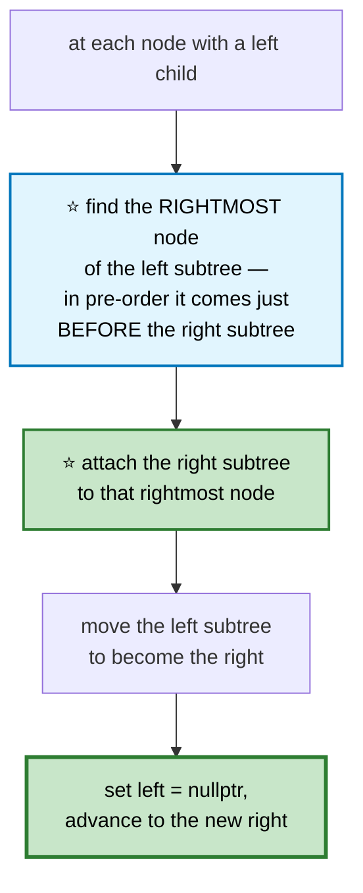

```
   BEFORE          1
                  / \
                 2   5
                / \   \
               3   4   6

   at node 1: the left subtree is (2,3,4); its RIGHTMOST node is 4
              ⭐ attach 5's subtree to 4
              move the left subtree over to the right

   AFTER STEP 1    1
                    \
                     2
                    / \
                   3   4
                        \
                         5
                          \
                           6
   ⭐ Continue at node 2, then 3, 4... → fully flattened
```

```cpp
void flatten(TreeNode* root) {
    TreeNode* curr = root;

    while (curr) {
        if (curr->left) {
            TreeNode* pre = curr->left;
            while (pre->right) pre = pre->right;    // ⭐ rightmost of the left subtree

            pre->right  = curr->right;              // ⭐ graft the right subtree on
            curr->right = curr->left;               // left becomes right
            curr->left  = nullptr;
        }
        curr = curr->right;
    }
}
```

⭐ **Why it's O(n) despite the inner while loop:** each edge is traversed at most twice — once by the outer walk, once by a rightmost search. The same amortization argument as everywhere else in this library.

---

# 17. Populating Next Right Pointers
🟡 ⚪ **Variation** — build level links using the links you already built.

```cpp
// Perfect binary tree — O(1) space
Node* connect(Node* root) {
    Node* leftmost = root;

    while (leftmost && leftmost->left) {
        Node* head = leftmost;
        while (head) {
            head->left->next = head->right;          // ⭐ same parent
            if (head->next)                           // ⭐ ACROSS parents —
                head->right->next = head->next->left; //    uses the level above
            head = head->next;
        }
        leftmost = leftmost->left;
    }
    return root;
}
```
⭐ **The trick is bootstrapping:** the `next` pointers of level *k* are what let you walk level *k* to build the pointers of level *k+1*. A BFS queue would work too, but costs O(n) space.

⚠️ **For a non-perfect tree (Populating II)**, use a dummy node per level with a moving tail pointer — the same [dummy-node](04-linked-lists.md) technique from linked lists.

---

# 18. Morris Traversal

🔴 **Hard** · 🔵 Full ladder · ⭐ **In-order in O(1) space**

## 💬 The idea: temporary threads

```mermaid
flowchart TD
    A["⚠️ Normal in-order needs a stack<br/>to remember 'where do I return<br/>after finishing the left subtree?'"] --> B["⭐ THREADING: temporarily point the<br/>rightmost node of the left subtree<br/>BACK at the current node"]
    B --> C["That thread IS the return address —<br/>stored in the tree, not on a stack"]
    C --> D["⭐ On the second visit the thread<br/>already exists → remove it,<br/>emit the node, go right"]

    style A fill:#ffe0b2,stroke:#ef6c00,color:#000
    style B fill:#e1f5fe,stroke:#0277bd,stroke-width:3px,color:#000
    style D fill:#c8e6c9,stroke:#2e7d32,stroke-width:3px,color:#000
```

```cpp
vector<int> inorderMorris(TreeNode* root) {
    vector<int> out;
    TreeNode* curr = root;

    while (curr) {
        if (!curr->left) {
            out.push_back(curr->val);           // ⭐ no left → emit and go right
            curr = curr->right;
            continue;
        }

        // find the in-order PREDECESSOR
        TreeNode* pre = curr->left;
        while (pre->right && pre->right != curr) pre = pre->right;

        if (!pre->right) {
            pre->right = curr;                  // ⭐ CREATE the thread
            curr = curr->left;
        } else {
            pre->right = nullptr;               // ⭐ REMOVE it — second visit
            out.push_back(curr->val);           // ⭐ emit now: the left is done
            curr = curr->right;
        }
    }
    return out;
}
```

```
   ⭐⭐ WHY `pre->right != curr` IN THE SEARCH LOOP

   Without it, once the thread exists you'd loop forever
   following it back to curr and out again.

   That condition is exactly what distinguishes
     "first visit — build the thread"
   from
     "second visit — the left subtree is finished".
```

⭐ **Trade-off worth stating:** O(1) space, but it **temporarily mutates the tree**. That makes it unsafe under concurrency and unusable on a const tree. Say this out loud — it's why Morris isn't the default despite being asymptotically better.

---

# 19. Trie (Prefix Tree)

🟡 **Medium** · 🔵 Full ladder · ⭐ **The right structure for prefix queries**

## 💬 Why a trie beats a hash set for prefixes

```mermaid
flowchart TD
    A["hash set of words"] --> B["✅ O(1) exact lookup<br/>❌ 'does any word start with «pre»?'<br/>requires scanning ALL words"]
    C["⭐ TRIE"] --> D["✅ prefix query is O(len)<br/>✅ shared prefixes stored ONCE<br/>✅ ordered traversal for autocomplete<br/>❌ more memory per node"]

    style B fill:#ffe0b2,stroke:#ef6c00,color:#000
    style C fill:#e1f5fe,stroke:#0277bd,stroke-width:2px,color:#000
    style D fill:#c8e6c9,stroke:#2e7d32,stroke-width:3px,color:#000
```

```
   TRIE for {"cat", "car", "card", "dog"}

           (root)
           /    \
          c      d
          |      |
          a      o
         / \     |
        t   r    g ⭐
        ⭐   |\
            ⭐ d
               ⭐

   ⭐ = isEnd (a complete word ends here)

   ⭐ "car" and "card" SHARE the path c-a-r —
     that sharing is the whole point.
```

```cpp
class Trie {
    struct Node {
        Node* kids[26] = {};
        bool  isEnd = false;
    };
    Node* root = new Node();

    Node* walk(const string& s) {               // ⭐ shared by search and prefix
        Node* n = root;
        for (char c : s) {
            if (!n->kids[c - 'a']) return nullptr;
            n = n->kids[c - 'a'];
        }
        return n;
    }

public:
    void insert(const string& word) {
        Node* n = root;
        for (char c : word) {
            if (!n->kids[c - 'a']) n->kids[c - 'a'] = new Node();
            n = n->kids[c - 'a'];
        }
        n->isEnd = true;                        // ⭐ mark a complete word
    }

    bool search(const string& word) {
        Node* n = walk(word);
        return n && n->isEnd;                   // ⭐ must be a COMPLETE word
    }

    bool startsWith(const string& prefix) {
        return walk(prefix) != nullptr;         // ⭐ mere existence is enough
    }
};
```

## 🎤 Word Search II — where a trie is genuinely necessary

```mermaid
flowchart TD
    A["Find all dictionary words<br/>in a character grid"] --> B["❌ NAIVE: run DFS once per word<br/><b>O(W · R · C · 4^L)</b>"]
    B --> C["⭐ TRIE: DFS the grid ONCE,<br/>walking the trie in parallel"]
    C --> D["⭐ Prune the moment the current<br/>path stops being a valid prefix"]
    D --> E["⭐ Also: delete matched words from<br/>the trie to avoid duplicates<br/>and prune further"]

    style B fill:#ffcdd2,stroke:#c62828,stroke-width:2px,color:#000
    style C fill:#e1f5fe,stroke:#0277bd,stroke-width:2px,color:#000
    style D fill:#c8e6c9,stroke:#2e7d32,stroke-width:2px,color:#000
    style E fill:#c8e6c9,stroke:#2e7d32,stroke-width:3px,color:#000
```

⭐ **The trie turns "check W words separately" into "check all W words simultaneously."** That's the whole reason this is a trie problem.

## 📌 Pattern Card
```
SIGNAL   prefix queries · autocomplete · multi-word matching
KEY      ⭐ children array/map + isEnd flag
         prune DFS the instant the prefix dies
RELATED  Word Search II · Design Add & Search Words · Replace Words
         Maximum XOR of Two Numbers (a BINARY trie!)
```

---

# 20. Segment Tree / Fenwick Tree

🔴 **Hard** · 🔵 Full ladder · **Range queries with updates**

## 💬 Which structure for which problem

```mermaid
flowchart TD
    Q{"range queries +<br/>updates?"}
    Q -->|"NO updates"| A["⭐ PREFIX SUM ARRAY<br/>O(n) build, O(1) query"]
    Q -->|"updates, SUM only"| B["⭐ FENWICK (BIT)<br/>O(log n) both<br/>✅ tiny code, low memory"]
    Q -->|"updates, ANY associative op<br/>(min/max/gcd/sum)"| C["⭐ SEGMENT TREE<br/>O(log n) both<br/>✅ far more general"]
    Q -->|"range UPDATES too"| D["⭐ SEGMENT TREE<br/>+ LAZY PROPAGATION"]

    style Q fill:#e3f2fd,stroke:#1565c0,stroke-width:2px,color:#000
    style A fill:#c8e6c9,stroke:#2e7d32,color:#000
    style B fill:#fff9c4,stroke:#f9a825,color:#000
    style C fill:#b2dfdb,stroke:#00695c,stroke-width:2px,color:#000
    style D fill:#e1bee7,stroke:#6a1b9a,color:#000
```

```
   ⭐ SEGMENT TREE over [1, 3, 5, 7, 9, 11]

                    [0..5] sum=36
                   /            \
          [0..2] sum=9      [3..5] sum=27
          /      \            /      \
     [0..1]=4   [2]=5   [3..4]=16   [5]=11
     /    \                /   \
   [0]=1 [1]=3         [3]=7  [4]=9

   ⭐ Any range decomposes into O(log n) of these nodes.
   ⭐ A point update touches exactly one root-to-leaf path.
```

```cpp
class SegmentTree {
    vector<int> t;
    int n;

    void build(vector<int>& a, int node, int lo, int hi) {
        if (lo == hi) { t[node] = a[lo]; return; }
        int mid = (lo + hi) / 2;
        build(a, 2*node,     lo,      mid);
        build(a, 2*node + 1, mid + 1, hi);
        t[node] = t[2*node] + t[2*node + 1];    // ⭐ combine the children
    }

    int query(int node, int lo, int hi, int l, int r) {
        if (r < lo || hi < l) return 0;          // ⭐ no overlap → identity
        if (l <= lo && hi <= r) return t[node];  // ⭐ fully covered → done

        int mid = (lo + hi) / 2;                 // partial → recurse both
        return query(2*node,     lo,      mid, l, r)
             + query(2*node + 1, mid + 1, hi,  l, r);
    }

    void update(int node, int lo, int hi, int idx, int val) {
        if (lo == hi) { t[node] = val; return; }
        int mid = (lo + hi) / 2;
        if (idx <= mid) update(2*node,     lo,      mid, idx, val);
        else            update(2*node + 1, mid + 1, hi,  idx, val);
        t[node] = t[2*node] + t[2*node + 1];    // ⭐ recompute on the way up
    }

public:
    SegmentTree(vector<int>& a) : n(a.size()) {
        t.assign(4 * n, 0);                     // ⭐ 4n is the safe size bound
        build(a, 1, 0, n - 1);
    }
    int  query(int l, int r)      { return query(1, 0, n - 1, l, r); }
    void update(int idx, int val) { update(1, 0, n - 1, idx, val); }
};
```

## ⭐ Fenwick Tree — much shorter, sums only

```cpp
class Fenwick {
    vector<int> t;
public:
    Fenwick(int n) : t(n + 1, 0) {}

    void add(int i, int delta) {                // ⭐ 1-indexed
        for (; i < (int)t.size(); i += i & -i)  // ⭐ i & -i = lowest set bit
            t[i] += delta;
    }
    int sum(int i) {                            // prefix sum [1..i]
        int s = 0;
        for (; i > 0; i -= i & -i) s += t[i];
        return s;
    }
    int range(int l, int r) { return sum(r) - sum(l - 1); }
};
```

```
   ⭐⭐ WHAT `i & -i` DOES

   It isolates the LOWEST SET BIT of i.

     i = 12 = 1100₂  →  i & -i = 100₂ = 4
     i =  6 = 0110₂  →  i & -i =  10₂ = 2

   ⭐ t[i] stores the sum of the (i & -i) elements ending at i.
     Adding that bit jumps to the next node covering i;
     subtracting it walks the prefix decomposition.

   ⭐ Both loops run in O(log n) — one step per set bit.
```

⭐ **When to reach for these in an interview:** the moment you see *"range query"* together with *"the array changes"*. Prefix sums die at the first update; a segment tree keeps both operations at O(log n).

---

## 📋 Trees Recall

```mermaid
mindmap
  root(("Trees"))
    Traversal Choice
      PRE — pass info DOWN
      IN — ⭐ BST gives SORTED
      POST — combine children UP
      BFS — ⭐ freeze q.size()
    The Two-Values Pattern
      ⭐ RETURN the extendable value
      ⭐ UPDATE a global with the bent one
      diameter · max path sum
    BST Facts
      ⭐ in-order is sorted
      validate with RANGES not local checks
      LCA = the first split point
      augment with counts → O(h) kth
    Construction
      ⭐ pre gives roots, in gives splits
      hash map → O(n) not O(n²)
      ⚠️ pre+post is ambiguous
    Serialization
      ⭐ null markers are mandatory
      pre-order, consume in the same order
    Backtracking on Paths
      push · recurse · ⭐ POP
      ⭐ path prefix sums for Path Sum III
      ⚠️ decrement when leaving
    O(1) Space
      ⭐ Morris threading
      flatten via rightmost predecessor
      ⚠️ mutates the tree temporarily
    Specialized
      Trie — prefix queries, prune DFS
      Segment tree — any associative op
      Fenwick — sums only, i &amp; −i
```

```
╔══════════════════════════════════════════════════════════════════════╗
║                      TREES — PATTERN RECALL                          ║
╠══════════════════════════════════════════════════════════════════════╣
║ "depth / height / balance"     → post-order, encode failure as −1    ║
║ "longest path anywhere"        → ⭐ return straight, track bent       ║
║ "level by level"               → ⭐ int sz = q.size() before the loop ║
║ "validate a BST"               → ⭐ RANGES down, or in-order sorted   ║
║ "kth smallest in a BST"        → in-order + early exit (augment for  ║
║                                   repeated queries)                  ║
║ "lowest common ancestor"       → ⭐ post-order; both non-null = LCA   ║
║ "build from traversals"        → pre gives roots, in gives splits    ║
║ "serialize a tree"             → ⭐ pre-order + null markers          ║
║ "count paths with sum k"       → ⭐ prefix sums, decrement on exit    ║
║ "O(1) space traversal"         → ⭐ Morris threading                  ║
║ "prefix / autocomplete"        → Trie, prune the instant it dies     ║
║ "range query + updates"        → segment tree (or Fenwick for sums)  ║
╠══════════════════════════════════════════════════════════════════════╣
║ ⚠️ TRAPS                                                              ║
║   BST validation: local parent-child checks are NOT sufficient       ║
║   BFS: q.size() inside the loop condition — freeze it first          ║
║   diameter: confusing the returned value with the global one         ║
║   max path sum: clamp negatives to 0, and seed best = INT_MIN        ║
║   Path Sum III: forgetting --cnt[running] leaks across branches      ║
║   build tree: left before right — preIdx advances globally           ║
║   serialize: [1,2] vs [1,null,2] need markers to be distinguishable  ║
╚══════════════════════════════════════════════════════════════════════╝
```

---

**Next:** [Heaps & Intervals →](07-heaps-intervals.md) · **Back:** [Stacks & Queues](05-stacks-queues.md)
