# ⛰️ Heaps & Intervals

> Two patterns that pair naturally. A heap answers **"what's the current extreme?"** in O(log n). Intervals are almost always **"sort, then sweep."**

**Prerequisite:** [Patterns & Foundations](00-patterns.md) · **Format:** [see the sample](FORMAT-SAMPLE.md)

---

## 🧠 When a Heap Is the Answer

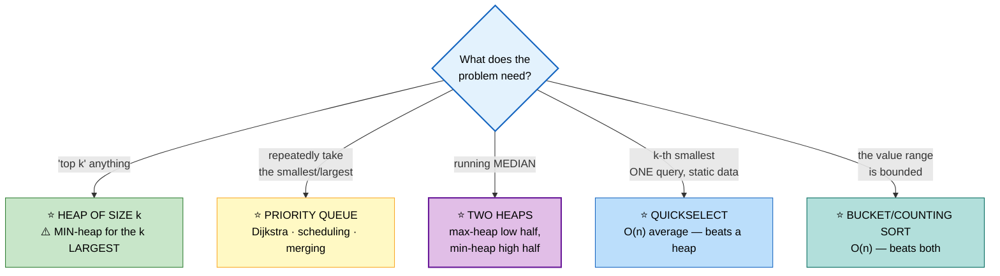

## ⚠️ The Counterintuitive Rule Everyone Gets Wrong

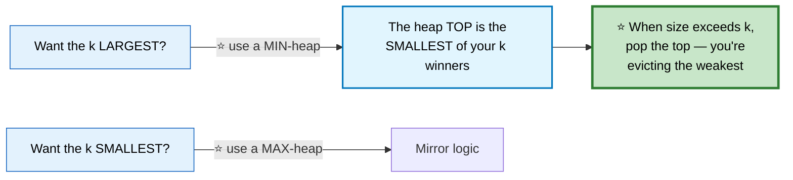

```cpp
// ⚠️ C++ priority_queue is a MAX-heap by default
priority_queue<int> maxHeap;

// ⭐ min-heap — the form you'll actually use most
priority_queue<int, vector<int>, greater<int>> minHeap;

// ⭐ custom comparator — note the INVERTED logic:
//    "returns true if a has LOWER priority than b"
auto cmp = [](const P& a, const P& b) { return a.dist > b.dist; };  // min by dist
priority_queue<P, vector<P>, decltype(cmp)> pq(cmp);
```

```
   ⭐⭐ COMPLEXITY FACTS WORTH STATING

     push / pop          O(log n)
     top                 O(1)
     ⭐ BUILD FROM ARRAY  O(n), NOT O(n log n)
        (std::make_heap / the priority_queue range constructor)

   ⭐ Why O(n)? Most elements are near the leaves and sift down
     only a little. The sum Σ (n/2^h)·h converges to O(n).
     A great thing to know when asked "can you build it faster?"
```

---

## 📑 Contents

| # | Problem | Diff | Type | Optimal |
|---|---|---|---|---|
| [1](#1-kth-largest-element-in-an-array) | Kth Largest Element | 🟡 | 🔵 **Full** | ⭐ quickselect O(n) avg |
| [2](#2-top-k-frequent-elements) | Top K Frequent | 🟡 | ⚪ Variation | see [Hashing](02-hashing.md) — bucket O(n) |
| [3](#3-k-closest-points-to-origin) | K Closest Points | 🟡 | ⚪ Variation | max-heap of size k |
| [4](#4-find-median-from-data-stream) | Find Median from Data Stream | 🔴 | 🔵 **Full** | ⭐ two heaps |
| [5](#5-sliding-window-median) | Sliding Window Median | 🔴 | ⚪ Variation | two multisets |
| [6](#6-merge-k-sorted-lists) | Merge k Sorted Lists | 🔴 | ⚪ Variation | see [Linked Lists](04-linked-lists.md) |
| [7](#7-kth-smallest-in-a-sorted-matrix) | Kth Smallest in Sorted Matrix | 🟡 | 🔵 **Full** | ⭐ binary search on VALUE |
| [8](#8-task-scheduler) | Task Scheduler | 🟡 | 🔵 **Full** | ⭐ O(n) formula, no heap |
| [9](#9-reorganize-string) | Reorganize String | 🟡 | ⚪ Variation | greedy max-heap |
| [10](#10-ipo--maximize-capital) | IPO / Maximize Capital | 🔴 | 🔵 **Full** | two heaps, unlock-then-take |
| [11](#11-minimum-cost-to-connect-sticks) | Min Cost to Connect Sticks | 🟡 | ⚪ Variation | Huffman greedy |
| [12](#12-merge-intervals) | Merge Intervals | 🟡 | ⚪ Variation | see [Arrays P2](01b-arrays-strings.md#23-merge-intervals) |
| [13](#13-meeting-rooms-ii) | Meeting Rooms II | 🟡 | ⚪ Variation | see [Arrays P2](01b-arrays-strings.md#27-meeting-rooms-ii) |
| [14](#14-employee-free-time) | Employee Free Time | 🔴 | 🔵 **Full** | merge all, find gaps |
| [15](#15-my-calendar-i--ii--iii) | My Calendar I / II / III | 🟡 | 🔵 **Full** | ⭐ ordered map sweep |
| [16](#16-the-skyline-problem) | The Skyline Problem | 🔴 | 🔵 **Full** | ⭐ sweep + multiset |
| [17](#17-car-pooling--range-difference) | Car Pooling / Range Difference | 🟡 | ⚪ Variation | difference array |
| [18](#18-interval-list-intersections) | Interval List Intersections | 🟡 | 🔵 **Full** | two-pointer merge |
| [19](#19-minimum-number-of-taps--jump-game-ii) | Min Taps / Jump Game II | 🔴 | 🔵 **Full** | ⭐ greedy reach |
| [20](#20-data-stream-as-disjoint-intervals) | Data Stream as Disjoint Intervals | 🔴 | ⚪ Variation | ordered map |

---

# 1. Kth Largest Element in an Array

🟡 **Medium** · 🔵 Full ladder · ⭐ **Four approaches, and the O(n) one wins**

## 🗺️ Approach Ladder

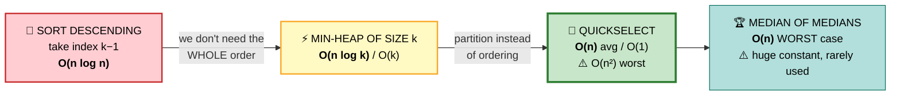

| Approach | Time | Space | Verdict |
|---|---|---|---|
| Sort | O(n log n) | O(1) | ⚠️ mention, then improve |
| Min-heap of size k | O(n log k) | O(k) | ✅ best for **streaming** data |
| **Quickselect** | **O(n)** avg | O(1) | 🏆 **best for a one-off query** |
| Median of medians | O(n) worst | O(1) | ⭐ theory answer |

## 2️⃣ Min-Heap of Size k

```
   ⭐ WHY A *MIN*-HEAP FOR THE LARGEST ELEMENTS

   The heap holds the k best candidates seen so far.
   Its TOP is the WEAKEST of those k.

   When a new element arrives and the heap is full:
     if it beats the top, evict the top.
   ⭐ At the end, the top IS the kth largest.
```

```cpp
int findKthLargest(vector<int>& a, int k) {
    priority_queue<int, vector<int>, greater<int>> pq;   // ⭐ MIN-heap

    for (int x : a) {
        pq.push(x);
        if ((int)pq.size() > k) pq.pop();       // ⭐ evict the weakest
    }
    return pq.top();
}
```
⭐ **This is the right answer when data arrives as a stream** and you can't hold it all in memory.

## 3️⃣ Quickselect — ⭐ OPTIMAL for a static array

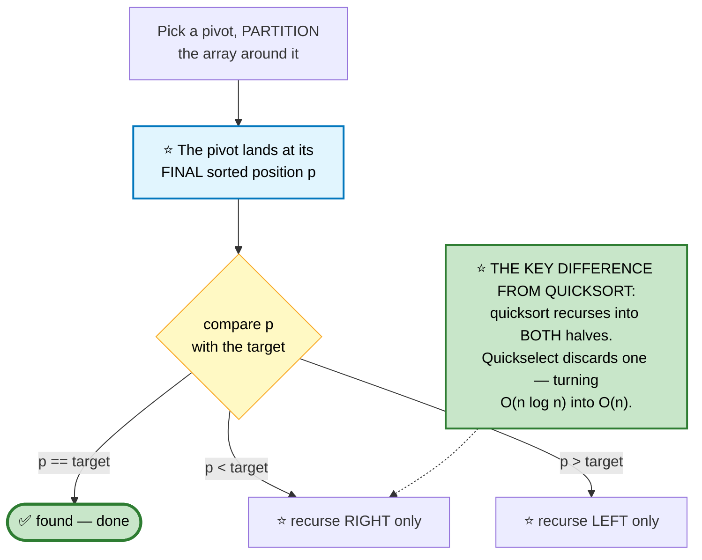

```
   ⭐⭐ WHY DISCARDING HALF GIVES O(n)

   Expected work:  n + n/2 + n/4 + n/8 + ...  =  2n  =  O(n)

   Compare with quicksort, which processes BOTH halves at
   every level:  n + n + n + ... (log n levels) = O(n log n)

   ⚠️ WORST CASE is O(n²) when the pivot is always extreme.
     ⭐ FIX: choose a RANDOM pivot. Adversarial input can then
       only be unlucky, not systematically bad.
```

```cpp
int findKthLargest(vector<int>& a, int k) {
    int target = a.size() - k;                  // ⭐ kth largest = (n−k)th smallest
    int lo = 0, hi = a.size() - 1;

    while (true) {
        int p = partition(a, lo, hi);
        if      (p == target) return a[p];      // ⭐ landed exactly
        else if (p < target)  lo = p + 1;       // ⭐ discard the LEFT half
        else                  hi = p - 1;       // ⭐ discard the RIGHT half
    }
}

int partition(vector<int>& a, int lo, int hi) {
    swap(a[lo + rand() % (hi - lo + 1)], a[hi]);   // ⭐⭐ RANDOM pivot

    int pivot = a[hi], i = lo;
    for (int j = lo; j < hi; ++j)
        if (a[j] < pivot) swap(a[i++], a[j]);
    swap(a[i], a[hi]);
    return i;
}
```

⚠️ **Quickselect mutates the input.** If the caller needs the original order, copy first — and say so.

## 📌 Pattern Card
```
SIGNAL   "kth largest/smallest" · "top k"
KEY      streaming → heap of size k (MIN-heap for largest)
         static, one query → ⭐ QUICKSELECT with a random pivot
         bounded values → bucket sort, O(n)
RELATED  Top K Frequent · K Closest Points · Median of Two Sorted Arrays
```

---

# 2. Top K Frequent Elements
🟡 ⚪ **Fully covered** in [Hashing #30](02-hashing.md) — count, then bucket-sort by frequency for **O(n)**.

⭐ **The takeaway:** when the sorting key is bounded by `n` (a frequency can't exceed the array length), bucket sort beats any heap.

---

# 3. K Closest Points to Origin
🟡 ⚪ **Variation of #1** — same three approaches, different comparison key.

```cpp
vector<vector<int>> kClosest(vector<vector<int>>& pts, int k) {
    // ⭐ MAX-heap by distance — we want the k SMALLEST
    auto cmp = [](const vector<int>& a, const vector<int>& b) {
        return a[0]*a[0] + a[1]*a[1] < b[0]*b[0] + b[1]*b[1];
    };
    priority_queue<vector<int>, vector<vector<int>>, decltype(cmp)> pq(cmp);

    for (auto& p : pts) {
        pq.push(p);
        if ((int)pq.size() > k) pq.pop();       // ⭐ evict the FARTHEST
    }

    vector<vector<int>> out;
    while (!pq.empty()) { out.push_back(pq.top()); pq.pop(); }
    return out;
}
```
⭐ **Never call `sqrt`.** Comparing squared distances gives identical ordering, avoids floating point entirely, and is faster.

---

# 4. Find Median from Data Stream

🔴 **Hard** · 🔵 Full ladder · ⭐ **The two-heaps pattern**

> `addNum` and `findMedian`, both efficient, on a growing stream.

## 🗺️ Approach Ladder

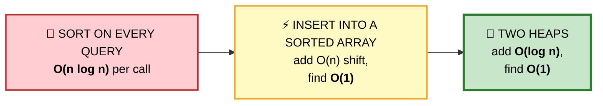

## 💬 The insight: you don't need the whole sorted order

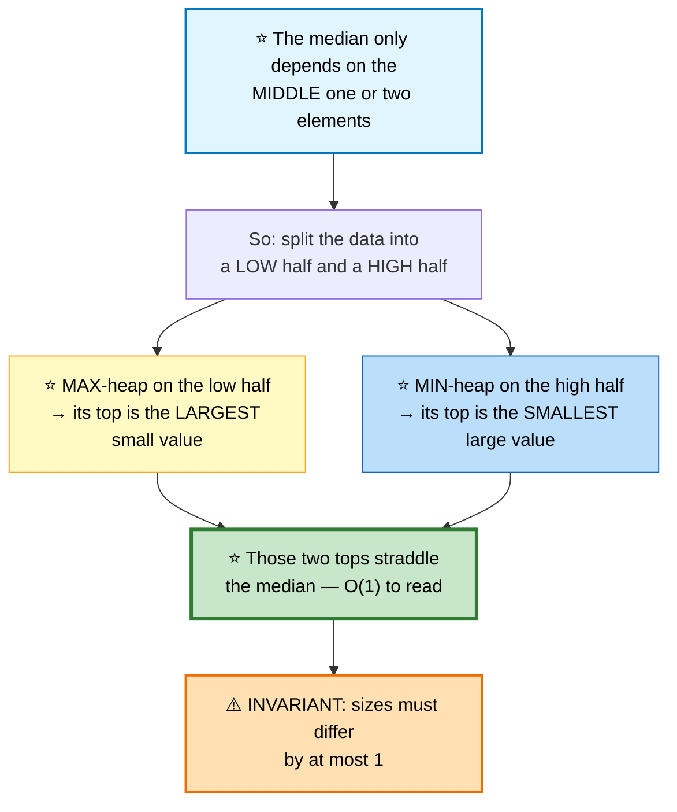

```
   VISUAL

        MAX-HEAP (low)          MIN-HEAP (high)
        ┌─────────────┐         ┌─────────────┐
        │      5 ◄────┼─────────┼──► 6        │
        │    3   4    │         │    8   7    │
        │  1   2      │         │  9          │
        └─────────────┘         └─────────────┘
              ▲                       ▲
           top = 5                 top = 6

   ⭐ odd total  → the median is the top of the LARGER heap
   ⭐ even total → the median is the average of both tops
```

## ⭐ The two-step add that guarantees correctness

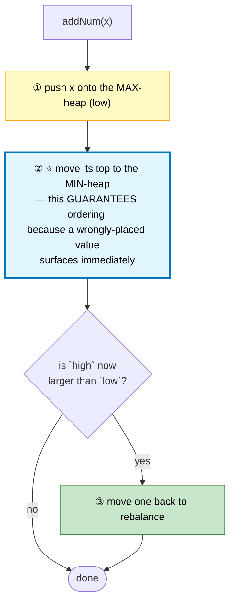

```
   ⭐⭐ WHY THE "PUSH THEN TRANSFER" DANCE?

   A naive "if x < low.top() push to low, else push to high"
   requires an extra rebalance AND a comparison against an
   empty heap edge case.

   ⭐ Pushing into `low` first and immediately moving its top
     to `high` is UNCONDITIONALLY correct: if x belonged in
     `high`, it becomes the max of `low` and gets moved.
     If it belonged in `low`, some other value moves instead —
     which is equally fine, since both remain sorted.

   Then a single size check restores the invariant.
```

```cpp
class MedianFinder {
    priority_queue<int> low;                                   // ⭐ MAX-heap
    priority_queue<int, vector<int>, greater<int>> high;       // ⭐ MIN-heap

public:
    void addNum(int num) {
        low.push(num);                          // ① always into low

        high.push(low.top());                   // ② ⭐ transfer the max over
        low.pop();

        if (high.size() > low.size()) {         // ③ rebalance
            low.push(high.top());
            high.pop();
        }
    }

    double findMedian() {
        // ⭐ `low` is never smaller than `high`, so odd → low.top()
        return low.size() > high.size()
             ? low.top()
             : (low.top() + high.top()) / 2.0;  // ⚠️ 2.0 — avoid integer division
    }
};
```

⚠️ **`/ 2.0`, not `/ 2`.** Integer division silently truncates the median of `[1,2]` from 1.5 to 1.

🎤 **Follow-up: all numbers are in [0, 100]?** Use a counting array of 101 buckets — `addNum` becomes O(1) and `findMedian` scans 101 slots, which is O(1) with a small constant.

🎤 **Follow-up: 99% of numbers are in [0, 100]?** Bucket the common range, keep two small heaps for the outliers, and combine the counts.

## 📌 Pattern Card
```
SIGNAL   running median · "middle element of a stream"
KEY      ⭐ MAX-heap for the low half, MIN-heap for the high half
         push-then-transfer, then one size check
RELATED  Sliding Window Median · IPO · Find Median of Two Sorted Arrays
```

---

# 5. Sliding Window Median
🔴 ⚪ **Variation of #4** — heaps can't delete from the middle, so use `multiset`.

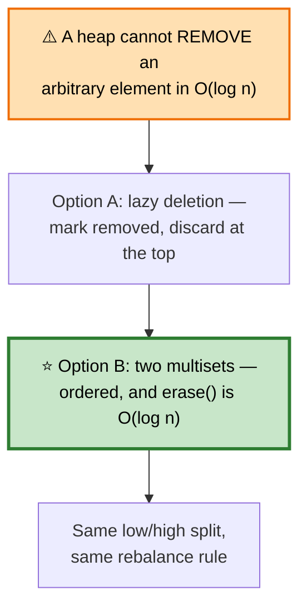

```cpp
vector<double> medianSlidingWindow(vector<int>& a, int k) {
    multiset<int> window(a.begin(), a.begin() + k);
    auto mid = next(window.begin(), k / 2);     // ⭐ iterator to the median
    vector<double> out;

    for (int i = k; ; ++i) {
        out.push_back(k % 2
            ? (double)*mid
            : ((double)*mid + *prev(mid)) / 2.0);

        if (i == (int)a.size()) break;

        window.insert(a[i]);
        if (a[i] < *mid) --mid;                 // ⭐ inserting left shifts mid left

        auto it = window.find(a[i - k]);        // ⚠️ find(), not erase(value) —
        if (*it <= *mid && it != mid) ++mid;    //    erase(value) removes ALL copies
        else if (it == mid) ++mid;
        window.erase(it);
    }
    return out;
}
```
⚠️ **`erase(iterator)` removes one element; `erase(value)` removes every copy.** With duplicates in the window, the wrong one destroys the answer.

⚠️ **Use `double` in the average**, not `int` — `[INT_MAX, INT_MAX]` overflows otherwise.

---

# 6. Merge k Sorted Lists
🔴 ⚪ **Fully covered** in [Linked Lists #5](04-linked-lists.md#5-merge-k-sorted-lists) — min-heap of k heads, or pairwise divide & conquer for O(1) space.

---

# 7. Kth Smallest in a Sorted Matrix

🟡 **Medium** · 🔵 Full ladder · ⭐ **Binary search on the ANSWER, not the index**

> Rows and columns each sorted ascending. Find the kth smallest element.

## 🗺️ Approach Ladder

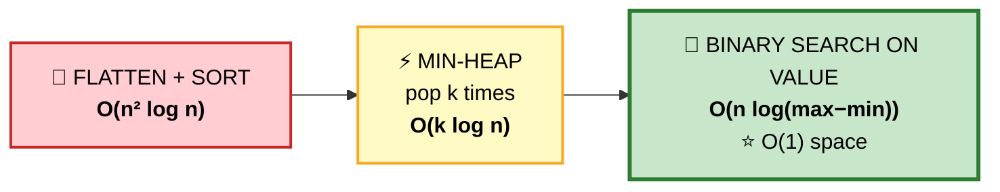

## 💬 Binary searching the value space

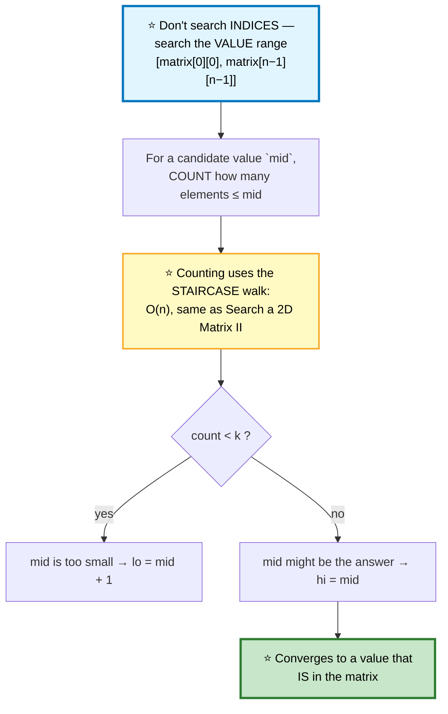

```
   ⭐⭐ WHY THE ANSWER IS ALWAYS A REAL MATRIX ELEMENT

   The loop converges to the SMALLEST value v with
   count(≤ v) ≥ k.

   Suppose v were not in the matrix. Then count(≤ v) equals
   count(≤ v−1), so v−1 would also satisfy the condition —
   contradicting that v is the smallest such value.

   ⭐ Therefore v must be present. ∎
```

```cpp
int kthSmallest(vector<vector<int>>& m, int k) {
    int n = m.size();
    int lo = m[0][0], hi = m[n-1][n-1];

    while (lo < hi) {
        int mid = lo + (hi - lo) / 2;           // ⚠️ avoids overflow

        // ⭐ count elements ≤ mid via the staircase walk — O(n)
        int count = 0, col = n - 1;
        for (int row = 0; row < n; ++row) {
            while (col >= 0 && m[row][col] > mid) --col;
            count += col + 1;
        }

        if (count < k) lo = mid + 1;
        else           hi = mid;                // ⭐ keep mid as a candidate
    }
    return lo;
}
```

⭐ **"Binary search on the answer" is a major pattern in its own right.** Recognize it when: the answer is a *number* in a known range, and checking "is X feasible?" is much easier than computing the answer directly. See also Split Array Largest Sum, Koko Eating Bananas, Capacity to Ship Packages.

## 📌 Pattern Card
```
SIGNAL   the answer is a VALUE in a known range, and feasibility
         is easier to test than the answer is to compute
KEY      ⭐ binary search the value space; count/verify in O(n)
RELATED  Koko Eating Bananas · Split Array Largest Sum · Ship Packages
         Median of Two Sorted Arrays
```

---

# 8. Task Scheduler

🟡 **Medium** · 🔵 Full ladder · ⭐ **The formula beats the simulation**

> Same tasks must be `n` intervals apart. Minimum total time (including idles)?

## 🗺️ Approach Ladder

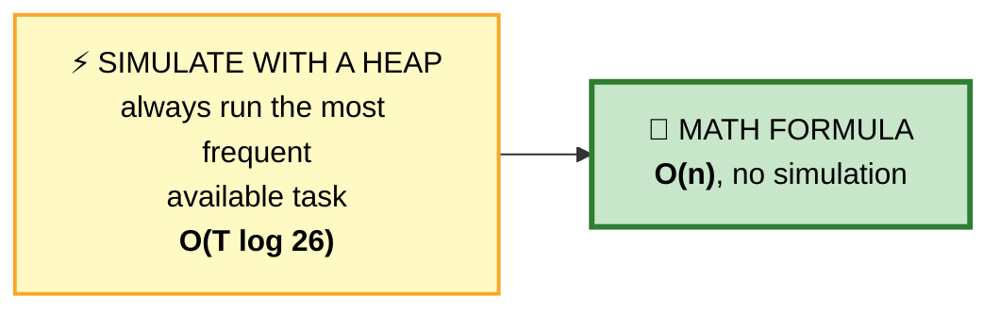

## 💬 Deriving the formula

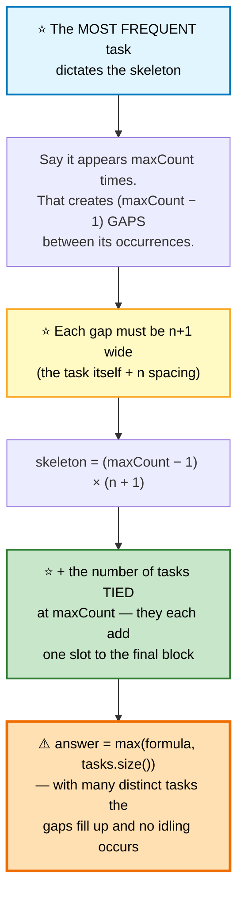

```
   EXAMPLE  tasks = [A,A,A,B,B,B], n = 2

   maxCount = 3 (both A and B)
   gaps = 3 − 1 = 2
   each gap is n+1 = 3 wide

     ┌───────┬───────┬───┐
     │ A B _ │ A B _ │ A B │
     └───────┴───────┴───┘
       gap 1   gap 2   final block

   skeleton  = 2 × 3     = 6
   + tied at max         = 2   (A and B)
   ⭐ total  = 8

   ⚠️ WHEN THE FORMULA UNDERSHOOTS
     tasks = [A,A,A,B,B,B,C,C,C,D,D,E], n = 2
     formula = 2×3 + 3 = 9, but there are 12 tasks.
     ⭐ The extra tasks FILL the idle slots, so the answer
       is simply 12 — hence the max().
```

```cpp
int leastInterval(vector<char>& tasks, int n) {
    int cnt[26] = {};
    for (char t : tasks) cnt[t - 'A']++;

    int maxCount = *max_element(cnt, cnt + 26);
    int tied = count(cnt, cnt + 26, maxCount);  // ⭐ how many share the max

    int formula = (maxCount - 1) * (n + 1) + tied;
    return max(formula, (int)tasks.size());     // ⭐⭐ the crucial max()
}
```

⭐ **Present the heap simulation first**, then derive this. Jumping straight to the formula looks memorized; deriving it demonstrates reasoning.

---

# 9. Reorganize String
🟡 ⚪ **Variation of #8** — same "most frequent first" greed, but you must actually build the string.

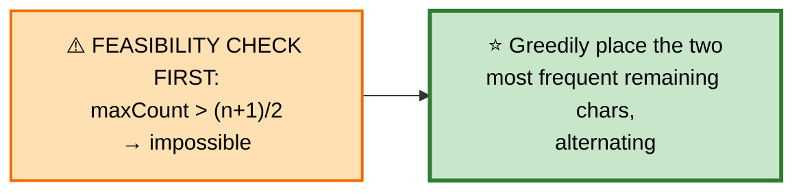

```cpp
string reorganizeString(string s) {
    int cnt[26] = {};
    for (char c : s) cnt[c - 'a']++;

    int n = s.size();
    if (*max_element(cnt, cnt + 26) > (n + 1) / 2) return "";   // ⭐ impossible

    priority_queue<pair<int,char>> pq;          // ⭐ MAX-heap by count
    for (int i = 0; i < 26; ++i) if (cnt[i]) pq.push({cnt[i], 'a' + i});

    string out;
    while (pq.size() >= 2) {
        auto [c1, ch1] = pq.top(); pq.pop();    // ⭐ take the TWO most frequent
        auto [c2, ch2] = pq.top(); pq.pop();

        out += ch1; out += ch2;                 // ⭐ they can't be adjacent-equal

        if (--c1) pq.push({c1, ch1});
        if (--c2) pq.push({c2, ch2});
    }
    if (!pq.empty()) out += pq.top().second;
    return out;
}
```
⭐ **Taking two at a time is what guarantees no adjacency** — the two most frequent characters are necessarily different, so placing them together is always safe.

---

# 10. IPO / Maximize Capital

🔴 **Hard** · 🔵 Full ladder · ⭐ **Two heaps with different keys**

> Pick at most `k` projects. Each needs `capital[i]` to start and yields `profit[i]`. Maximize final capital.

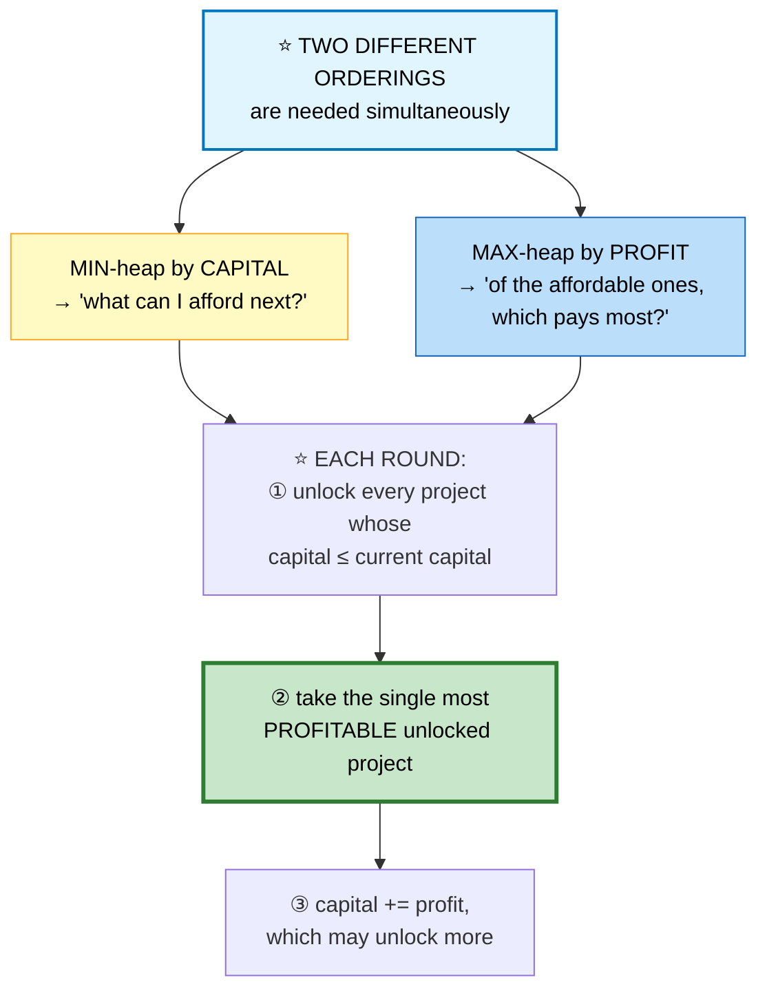

```
   ⭐⭐ WHY GREEDY IS CORRECT HERE

   Capital only ever INCREASES. So a project affordable now
   stays affordable forever.

   ⭐ That means taking the highest-profit affordable project
     is never a mistake — it can only widen the set of future
     options, never narrow it. No exchange argument can beat it. ∎
```

```cpp
int findMaximizedCapital(int k, int w, vector<int>& profits, vector<int>& capital) {
    int n = profits.size();
    vector<pair<int,int>> proj(n);
    for (int i = 0; i < n; ++i) proj[i] = {capital[i], profits[i]};

    sort(proj.begin(), proj.end());             // ⭐ by capital ascending

    priority_queue<int> affordable;             // ⭐ MAX-heap by profit
    int i = 0;

    while (k--) {
        while (i < n && proj[i].first <= w)     // ⭐ unlock everything affordable
            affordable.push(proj[i++].second);

        if (affordable.empty()) break;          // ⚠️ nothing left we can start

        w += affordable.top();                  // ⭐ take the most profitable
        affordable.pop();
    }
    return w;
}
```
⭐ **Sorting by capital replaces the min-heap** — since we sweep forward monotonically, an index pointer suffices.

---

# 11. Minimum Cost to Connect Sticks
🟡 ⚪ **Variation** — this is **Huffman coding** in disguise.

```cpp
int connectSticks(vector<int>& sticks) {
    priority_queue<int, vector<int>, greater<int>> pq(sticks.begin(), sticks.end());
    // ⭐ range constructor: O(n) heapify, not O(n log n)

    int total = 0;
    while (pq.size() > 1) {
        int a = pq.top(); pq.pop();             // ⭐ always the TWO smallest
        int b = pq.top(); pq.pop();
        total += a + b;
        pq.push(a + b);
    }
    return total;
}
```
```
   ⭐ WHY COMBINING THE TWO SMALLEST IS OPTIMAL

   Every stick's length is paid once per merge it participates
   in — so a stick merged early is counted MORE times.

   ⭐ Therefore the LARGEST sticks should be merged LAST,
     which means always combining the two smallest.

   This is exactly Huffman's argument: the least frequent
   symbols get the longest codes.
```

---

# 12. Merge Intervals
🟡 ⚪ **Fully covered** in [Arrays Part 2 #23](01b-arrays-strings.md#23-merge-intervals) — sort by **start**, extend with `max`.

---

# 13. Meeting Rooms II
🟡 ⚪ **Fully covered** in [Arrays Part 2 #27](01b-arrays-strings.md#27-meeting-rooms-ii) — min-heap of end times, or a ±1 sweep line.

---

# 14. Employee Free Time

🔴 **Hard** · 🔵 Full ladder · **Merge everything, then read the gaps**

> Given each employee's busy intervals, find the intervals when *everyone* is free.

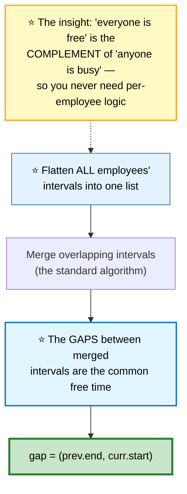

```
   EMPLOYEE SCHEDULES
     A: [1,3] [6,7]
     B: [2,4]
     C: [2,5] [9,12]

   FLATTEN + SORT: [1,3] [2,4] [2,5] [6,7] [9,12]
   MERGE:          [1,5] [6,7] [9,12]
                        ▲     ▲
   ⭐ FREE TIME:      [5,6] [7,9]
```

```cpp
vector<Interval> employeeFreeTime(vector<vector<Interval>>& schedule) {
    vector<Interval> all;
    for (auto& emp : schedule)
        for (auto& iv : emp) all.push_back(iv);

    sort(all.begin(), all.end(),
         [](const Interval& a, const Interval& b){ return a.start < b.start; });

    vector<Interval> out;
    int end = all[0].end;

    for (int i = 1; i < (int)all.size(); ++i) {
        if (all[i].start > end)                 // ⭐ a genuine gap
            out.push_back({end, all[i].start});

        end = max(end, all[i].end);             // ⚠️ max — intervals can NEST
    }
    return out;
}
```

⭐ **A min-heap alternative** (merge k sorted interval lists) is O(N log k) instead of O(N log N) — mention it when k is much smaller than N.

---

# 15. My Calendar I / II / III

🟡 **Medium** · 🔵 Full ladder · ⭐ **The ordered-map sweep is one solution for all three**

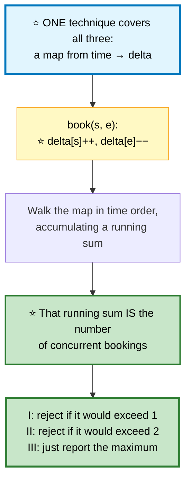

```cpp
// ⭐ MyCalendarIII — the general case; I and II are the same with a cap
class MyCalendarThree {
    map<int,int> delta;                         // ⭐ ORDERED map: time → change
public:
    int book(int start, int end) {
        ++delta[start];                         // ⭐ one more booking begins
        --delta[end];                           // ⭐ one ends

        int active = 0, best = 0;
        for (auto& [t, d] : delta) {            // ⭐ iterates in TIME order
            active += d;
            best = max(best, active);
        }
        return best;
    }
};
```

```cpp
// ⭐ MyCalendarI — O(log n) per booking using upper_bound
class MyCalendar {
    map<int,int> booked;                        // start → end
public:
    bool book(int start, int end) {
        auto it = booked.upper_bound(start);    // ⭐ first booking starting AFTER

        if (it != booked.end() && it->first < end) return false;      // overlaps next
        if (it != booked.begin() && prev(it)->second > start) return false;  // prev

        booked[start] = end;
        return true;
    }
};
```
⭐ **`upper_bound` plus `prev` checks exactly two neighbours** — since existing bookings never overlap each other, only the immediate neighbours can conflict.

---

# 16. The Skyline Problem

🔴 **Hard** · 🔵 Full ladder · ⭐ **The hardest interval problem you'll see**

> Buildings as `[left, right, height]`. Output the skyline's key points.

## 💬 The sweep-line formulation

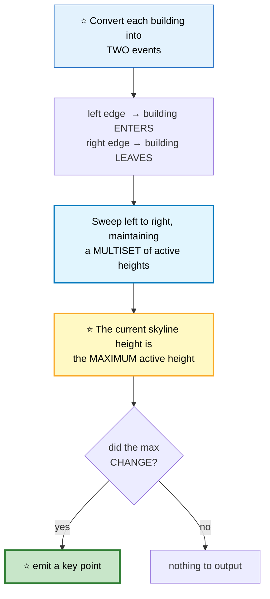

## ⚠️ The three sorting rules that make it correct

```
   ⭐⭐ EVENTS ARE ENCODED AS (x, height) WITH SIGNED HEIGHT
        start → (left,  −height)
        end   → (right, +height)

   Sorting these pairs naturally gives all three rules:

   ① At the same x, STARTS come before ENDS
      Because −h < +h. ⭐ Prevents a spurious drop-to-zero
      where two buildings touch.

   ② Among simultaneous STARTS, TALLER first
      Because −h sorts ascending, so −10 < −5.
      ⭐ Prevents emitting the shorter building's point first.

   ③ Among simultaneous ENDS, SHORTER first
      Because +h sorts ascending.
      ⭐ Prevents an unnecessary intermediate key point.

   ⭐ All three fall out of one plain pair sort. That's the
     elegance of the signed-height encoding.
```

```
   BUILDINGS  [2,9,10]  [3,7,15]  [5,12,12]

   x:      2     3     5     7     9    12
   event: +10   +15   +12   −15   −10   −12
   active:{10} {10,15}{10,15,12}{10,12}{12}  {}
   max:    10    15    15    12    12    0
           ▲     ▲           ▲           ▲
   ⭐ KEY POINTS: (2,10) (3,15) (7,12) (12,0)
                  changed changed  changed changed
```

```cpp
vector<vector<int>> getSkyline(vector<vector<int>>& buildings) {
    vector<pair<int,int>> events;
    for (auto& b : buildings) {
        events.push_back({b[0], -b[2]});        // ⭐ start: NEGATIVE height
        events.push_back({b[1],  b[2]});        // ⭐ end:   POSITIVE height
    }
    sort(events.begin(), events.end());         // ⭐ one sort gives all 3 rules

    multiset<int> active{0};                    // ⭐ 0 = ground level, always present
    vector<vector<int>> out;
    int prevMax = 0;

    for (auto& [x, h] : events) {
        if (h < 0) active.insert(-h);           // building enters
        else       active.erase(active.find(h));// ⚠️ find() — erase ONE copy only

        int currMax = *active.rbegin();         // ⭐ multiset is sorted → max at the back

        if (currMax != prevMax) {               // ⭐ only emit on a CHANGE
            out.push_back({x, currMax});
            prevMax = currMax;
        }
    }
    return out;
}
```

⚠️ **`active.erase(active.find(h))` removes exactly one copy.** `active.erase(h)` removes *every* building of that height — a devastating bug when two buildings share a height.

⚠️ **The `{0}` seed** means the skyline correctly drops to 0 when no buildings are active, without an empty-container special case.

## 📌 Pattern Card
```
SIGNAL   "outline / silhouette / max over a moving set"
KEY      ⭐ sweep line + multiset of active values
         ⭐ signed heights encode all tie-break rules in one sort
         emit only when the maximum CHANGES
RELATED  Meeting Rooms II · Falling Squares · Rectangle Area II
```

---

# 17. Car Pooling / Range Difference
🟡 ⚪ **Variation of the sweep line** — when the coordinate range is small, use a **difference array** instead of a map.

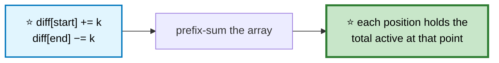

```cpp
bool carPooling(vector<vector<int>>& trips, int capacity) {
    int stops[1001] = {};                       // ⭐ locations are bounded by 1000

    for (auto& t : trips) {
        stops[t[1]] += t[0];                    // ⭐ passengers board
        stops[t[2]] -= t[0];                    // ⭐ passengers exit
    }

    int cur = 0;
    for (int s : stops) {
        cur += s;                               // ⭐ running prefix sum
        if (cur > capacity) return false;
    }
    return true;
}
```
⭐ **Difference array vs sweep line:** use the array when coordinates are small and dense (O(range)); use the ordered map when they're sparse or unbounded (O(n log n)).

---

# 18. Interval List Intersections

🟡 **Medium** · 🔵 Full ladder · **Two-pointer merge**

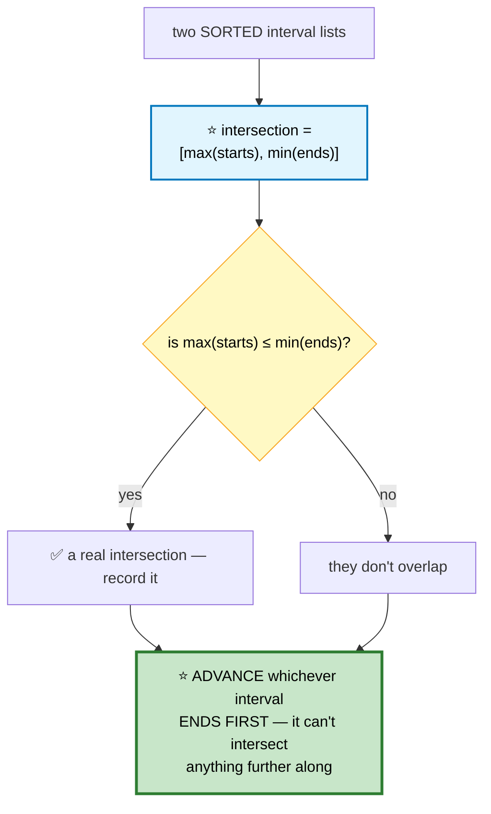

```cpp
vector<vector<int>> intervalIntersection(vector<vector<int>>& A,
                                          vector<vector<int>>& B) {
    vector<vector<int>> out;
    int i = 0, j = 0;

    while (i < (int)A.size() && j < (int)B.size()) {
        int lo = max(A[i][0], B[j][0]);         // ⭐ the LATER start
        int hi = min(A[i][1], B[j][1]);         // ⭐ the EARLIER end

        if (lo <= hi) out.push_back({lo, hi});  // ⭐ non-empty intersection

        // ⭐ advance the one that ends first
        if (A[i][1] < B[j][1]) ++i; else ++j;
    }
    return out;
}
```
⭐ **`[max(starts), min(ends)]` is the universal intersection formula** for any two ranges — worth memorizing outright.

---

# 19. Minimum Number of Taps / Jump Game II

🔴 **Hard** · 🔵 Full ladder · ⭐ **Greedy reach — the same algorithm twice**

> Both problems reduce to: cover `[0, n]` with the fewest intervals.

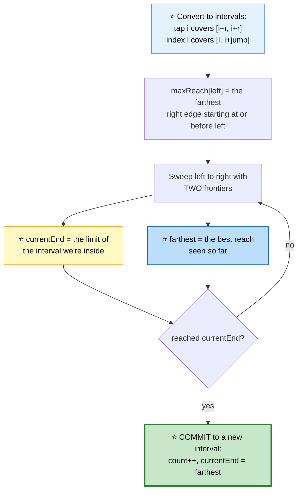

```
   ⭐⭐ WHY DEFERRING THE CHOICE IS OPTIMAL

   You do NOT need to decide which interval to use at the moment
   you enter a region. Instead, scan the whole current region,
   remember the FARTHEST reach available anywhere in it, and
   only commit when you're forced to.

   ⭐ Committing later can never be worse: you've seen strictly
     more options by then. This is the classic "greedy with a
     deferred decision" shape. ∎
```

```cpp
// Jump Game II — minimum jumps to reach the end
int jump(vector<int>& a) {
    int jumps = 0, currentEnd = 0, farthest = 0;

    for (int i = 0; i < (int)a.size() - 1; ++i) {   // ⚠️ stop BEFORE the last index
        farthest = max(farthest, i + a[i]);

        if (i == currentEnd) {                  // ⭐ forced to commit
            ++jumps;
            currentEnd = farthest;
        }
    }
    return jumps;
}

// Minimum Taps — the same algorithm on derived intervals
int minTaps(int n, vector<int>& ranges) {
    vector<int> maxReach(n + 1, 0);
    for (int i = 0; i <= n; ++i) {
        int l = max(0, i - ranges[i]);
        maxReach[l] = max(maxReach[l], i + ranges[i]);   // ⭐ best reach from l
    }

    int taps = 0, currentEnd = 0, farthest = 0;
    for (int i = 0; i <= n; ++i) {
        if (i > farthest) return -1;            // ⚠️ an uncoverable gap

        farthest = max(farthest, maxReach[i]);

        if (i == currentEnd && i < n) {
            ++taps;
            currentEnd = farthest;
        }
    }
    return taps;
}
```

⚠️ **`i < a.size() - 1` in Jump Game II.** Including the last index would count an extra jump *from* the destination.

## 📌 Pattern Card
```
SIGNAL   "minimum number of X to cover a range"
KEY      ⭐ two frontiers: currentEnd and farthest
         commit only when i == currentEnd (deferred decision)
RELATED  Jump Game I/II · Video Stitching · Gas Station
```

---

# 20. Data Stream as Disjoint Intervals
🔴 ⚪ **Variation of #15** — an ordered map, merging neighbours on insert.

```cpp
class SummaryRanges {
    map<int,int> iv;                            // ⭐ start → end
public:
    void addNum(int v) {
        auto it = iv.upper_bound(v);            // first interval starting after v

        // ⭐ already covered by the previous interval?
        if (it != iv.begin() && prev(it)->second >= v) return;

        int lo = v, hi = v;

        if (it != iv.begin() && prev(it)->second == v - 1) {   // ⭐ merge LEFT
            lo = prev(it)->first;
            iv.erase(prev(it));
        }
        if (it != iv.end() && it->first == v + 1) {            // ⭐ merge RIGHT
            hi = it->second;
            iv.erase(it);
        }
        iv[lo] = hi;
    }

    vector<vector<int>> getIntervals() {
        vector<vector<int>> out;
        for (auto& [s, e] : iv) out.push_back({s, e});
        return out;
    }
};
```
⭐ **Each insert touches at most two neighbours**, so it's O(log n) — the ordered map is doing the heavy lifting.

---

## 📋 Heaps & Intervals Recall

```mermaid
mindmap
  root(("Heaps &amp;<br/>Intervals"))
    Heap Rules
      ⚠️ MIN-heap for the k LARGEST
      ⭐ heapify from an array is O(n)
      C++ default is a MAX-heap
      custom comparator logic is INVERTED
    Beating the Heap
      quickselect O(n) for one query
      bucket sort when values are bounded
      ⭐ binary search on the ANSWER
    Two Heaps
      ⭐ median: max-low + min-high
      push-then-transfer, then rebalance
      IPO: min by capital, max by profit
      ⚠️ multiset when you must delete
    Interval Sorting
      by START → merge overlaps
      by END → max non-overlapping
      ⭐ signed heights → free tie-breaks
    Sweep Line
      ±1 events, running sum
      ⭐ ends before starts on ties
      ordered map (sparse)
      difference array (dense)
    Greedy Reach
      ⭐ currentEnd + farthest
      commit only when forced
    Universal Formulas
      ⭐ intersection = [max(starts), min(ends)]
      ⭐ overlap ⟺ max(starts) ≤ min(ends)
```

```
╔══════════════════════════════════════════════════════════════════════╗
║               HEAPS & INTERVALS — PATTERN RECALL                     ║
╠══════════════════════════════════════════════════════════════════════╣
║ "kth largest, streaming"       → ⭐ MIN-heap of size k                ║
║ "kth largest, static array"    → ⭐ QUICKSELECT, random pivot, O(n)   ║
║ "running median"               → ⭐ two heaps, push-then-transfer     ║
║ "kth smallest in sorted matrix"→ ⭐ binary search on the VALUE        ║
║ "min time with cooldown"       → (max−1)×(n+1)+tied, ⭐ then max(...)  ║
║ "merge overlapping ranges"     → sort by START, extend with max      ║
║ "max concurrent"               → sweep line, ends before starts      ║
║ "skyline / silhouette"         → ⭐ multiset + signed-height events   ║
║ "intersection of two ranges"   → ⭐ [max(starts), min(ends)]          ║
║ "min intervals to cover"       → ⭐ currentEnd + farthest greedy      ║
║ "dense coordinate updates"     → difference array + prefix sum       ║
╠══════════════════════════════════════════════════════════════════════╣
║ ⚠️ TRAPS                                                              ║
║   using a MAX-heap for "k largest" — it's a MIN-heap                 ║
║   multiset.erase(value) deletes ALL copies — use erase(find(v))      ║
║   median: divide by 2.0, not 2                                       ║
║   task scheduler: forgetting max(formula, tasks.size())              ║
║   employee free time: use max() when extending — intervals nest      ║
║   Jump Game II: loop must stop BEFORE the last index                 ║
║   quickselect: fixed pivots give O(n²) — randomize                   ║
╚══════════════════════════════════════════════════════════════════════╝
```

---

**Next:** [Graphs →](08-graphs.md) · **Back:** [Trees](06-trees.md)
