# 🕸️ Graphs

> Graph problems look intimidating but reduce to a small set of algorithms. The real skill is **recognizing that a problem is a graph problem** — grids, dependencies, word transformations, and state machines are all graphs in disguise.

**Prerequisite:** [Patterns & Foundations](00-patterns.md) · **Format:** [see the sample](FORMAT-SAMPLE.md)

---

## 🧠 The Algorithm Selection Chart

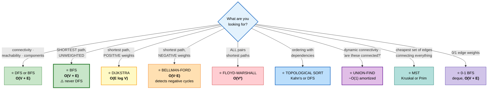

## ⭐ The Single Most Important Rule

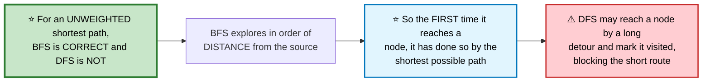

## ⭐ Graph Representations

```cpp
// ADJACENCY LIST — the default. O(V + E) space.
vector<vector<int>> adj(n);
adj[u].push_back(v);

// ADJACENCY MATRIX — O(V²) space. Use only when the graph is DENSE
// or you need O(1) "is there an edge u→v?"
vector<vector<int>> mat(n, vector<int>(n, 0));

// ⭐ GRID as an implicit graph — no adjacency list needed at all
int dr[] = {-1, 1, 0, 0};
int dc[] = { 0, 0,-1, 1};
```

---

## 📑 Contents

| # | Problem | Diff | Type | Optimal |
|---|---|---|---|---|
| [1](#1-number-of-islands) | Number of Islands | 🟡 | 🔵 **Full** | O(RC) flood fill |
| [2](#2-max-area-of-island--island-perimeter) | Max Area / Perimeter | 🟢 | ⚪ Variation | same DFS |
| [3](#3-surrounded-regions) | Surrounded Regions | 🟡 | 🔵 **Full** | ⭐ invert: start from the border |
| [4](#4-pacific-atlantic-water-flow) | Pacific Atlantic Water Flow | 🟡 | ⚪ Variation | ⭐ reverse the flow |
| [5](#5-rotting-oranges) | Rotting Oranges | 🟡 | 🔵 **Full** | ⭐ multi-source BFS |
| [6](#6-01-matrix--walls-and-gates) | 01 Matrix / Walls and Gates | 🟡 | ⚪ Variation | multi-source BFS |
| [7](#7-word-ladder) | Word Ladder | 🔴 | 🔵 **Full** | ⭐ BFS + bidirectional |
| [8](#8-course-schedule-i--ii) | Course Schedule I / II | 🟡 | 🔵 **Full** | ⭐ topological sort |
| [9](#9-alien-dictionary) | Alien Dictionary | 🔴 | ⚪ Variation | build edges, then topo |
| [10](#10-minimum-height-trees) | Minimum Height Trees | 🟡 | ⚪ Variation | ⭐ peel leaves inward |
| [11](#11-clone-graph) | Clone Graph | 🟡 | 🔵 **Full** | DFS + a visited map |
| [12](#12-graph-valid-tree) | Graph Valid Tree | 🟡 | 🔵 **Full** | ⭐ n−1 edges + connected |
| [13](#13-number-of-connected-components) | Connected Components | 🟡 | ⚪ Variation | union-find or DFS |
| [14](#14-union-find-the-structure) | Union-Find (the structure) | 🟡 | 🔵 **Full** | ⭐ path compression + rank |
| [15](#15-redundant-connection) | Redundant Connection | 🟡 | ⚪ Variation | first union that fails |
| [16](#16-accounts-merge) | Accounts Merge | 🟡 | ⚪ Variation | union-find on strings |
| [17](#17-network-delay-time-dijkstra) | Network Delay Time (Dijkstra) | 🟡 | 🔵 **Full** | ⭐ O(E log V) |
| [18](#18-cheapest-flights-within-k-stops) | Cheapest Flights Within K Stops | 🟡 | 🔵 **Full** | ⭐ Bellman-Ford, k+1 rounds |
| [19](#19-path-with-minimum-effort) | Path With Minimum Effort | 🟡 | ⚪ Variation | Dijkstra on max-edge |
| [20](#20-swim-in-rising-water) | Swim in Rising Water | 🔴 | ⚪ Variation | same as #19 |
| [21](#21-minimum-spanning-tree-kruskal--prim) | MST (Kruskal + Prim) | 🟡 | 🔵 **Full** | O(E log E) / O(E log V) |
| [22](#22-critical-connections-bridges) | Critical Connections (Bridges) | 🔴 | 🔵 **Full** | ⭐ Tarjan low-link |
| [23](#23-word-search-ii) | Word Search II | 🔴 | ⚪ Variation | ⭐ Trie + DFS pruning |
| [24](#24-bipartite-graph-check) | Bipartite Check | 🟡 | 🔵 **Full** | 2-colouring via BFS |
| [25](#25-reconstruct-itinerary-eulerian) | Reconstruct Itinerary | 🔴 | 🔵 **Full** | ⭐ Hierholzer |

---

# 1. Number of Islands

🟡 **Medium** · 🔵 Full ladder · ⭐ **The flood-fill template**

> Count connected groups of `'1'` in a grid.

## 🗺️ Approach Ladder

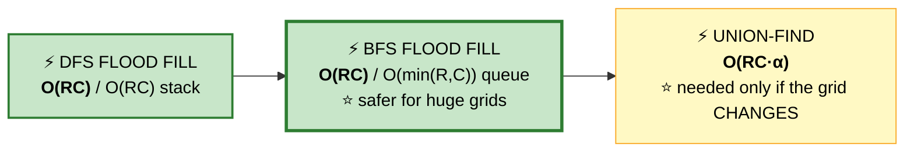

## 💬 The idea

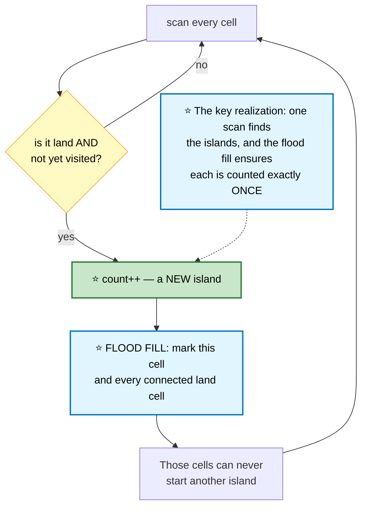

```
   GRID                    AFTER PROCESSING

   1 1 0 0 0               🅐 🅐 0 0 0
   1 1 0 0 0     ⭐ →      🅐 🅐 0 0 0
   0 0 1 0 0               0 0 🅑 0 0
   0 0 0 1 1               0 0 0 🅒 🅒

   ⭐ 3 islands. Each flood fill consumes an entire
     connected group in one go.
```

```cpp
class Solution {
    int R, C;

    void flood(vector<vector<char>>& g, int r, int c) {
        // ⭐ ONE guard handles bounds AND already-visited
        if (r < 0 || r >= R || c < 0 || c >= C || g[r][c] != '1') return;

        g[r][c] = '0';                          // ⭐ mark IMMEDIATELY, before recursing

        flood(g, r - 1, c);
        flood(g, r + 1, c);
        flood(g, r, c - 1);
        flood(g, r, c + 1);
    }

public:
    int numIslands(vector<vector<char>>& g) {
        if (g.empty()) return 0;
        R = g.size(); C = g[0].size();

        int count = 0;
        for (int r = 0; r < R; ++r)
            for (int c = 0; c < C; ++c)
                if (g[r][c] == '1') { ++count; flood(g, r, c); }
        return count;
    }
};
```

```
   ⭐⭐ MARK BEFORE RECURSING, NOT AFTER

   If you recurse first and mark afterwards, two neighbouring
   cells each recurse into the other before either is marked
   → infinite recursion → stack overflow.

   ⭐ Marking on entry is the universal rule for graph DFS.
```

⚠️ **Recursion depth is O(R·C)** in the worst case (an all-land grid). On a 1000×1000 grid that's a million frames — **stack overflow**. Use the BFS version when grids may be large.

## 🔁 BFS version — safer on big grids
```cpp
void floodBFS(vector<vector<char>>& g, int sr, int sc) {
    queue<pair<int,int>> q;
    q.push({sr, sc});
    g[sr][sc] = '0';                            // ⭐ mark on ENQUEUE, not dequeue

    int dr[] = {-1,1,0,0}, dc[] = {0,0,-1,1};
    while (!q.empty()) {
        auto [r, c] = q.front(); q.pop();
        for (int d = 0; d < 4; ++d) {
            int nr = r + dr[d], nc = c + dc[d];
            if (nr >= 0 && nr < R && nc >= 0 && nc < C && g[nr][nc] == '1') {
                g[nr][nc] = '0';                // ⭐⭐ mark on ENQUEUE
                q.push({nr, nc});
            }
        }
    }
}
```

⚠️ **Marking on dequeue instead of enqueue** lets the same cell enter the queue multiple times — the queue can blow up to O(RC) and the complexity degrades.

## 📌 Pattern Card
```
SIGNAL   connected regions in a grid
KEY      scan + flood fill · ⭐ mark on ENTRY (DFS) or ENQUEUE (BFS)
         ⚠️ DFS recursion depth can overflow on large grids
RELATED  Max Area of Island · Surrounded Regions · Number of Distinct Islands
```

---

# 2. Max Area of Island / Island Perimeter
🟢 ⚪ **Variations of #1** — same traversal, different accumulator.

```cpp
// Max area — DFS returns a count instead of void
int area(vector<vector<int>>& g, int r, int c) {
    if (r < 0 || r >= R || c < 0 || c >= C || g[r][c] != 1) return 0;
    g[r][c] = 0;
    return 1 + area(g,r-1,c) + area(g,r+1,c) + area(g,r,c-1) + area(g,r,c+1);
}

// Perimeter — ⭐ no traversal needed at all
int islandPerimeter(vector<vector<int>>& g) {
    int perim = 0;
    for (int r = 0; r < (int)g.size(); ++r)
        for (int c = 0; c < (int)g[0].size(); ++c)
            if (g[r][c] == 1) {
                perim += 4;                     // ⭐ each cell starts with 4 sides
                if (r > 0 && g[r-1][c]) perim -= 2;   // ⭐ shared edge removes 2
                if (c > 0 && g[r][c-1]) perim -= 2;
            }
    return perim;
}
```
⭐ **Perimeter needs only counting, not traversal.** Every adjacency removes two sides — one from each cell. Checking only up and left avoids double-counting.

---

# 3. Surrounded Regions

🟡 **Medium** · 🔵 Full ladder · ⭐ **Invert the problem**

> Flip every `'O'` region that does **not** touch the border.

## 💬 Why solving the complement is far easier

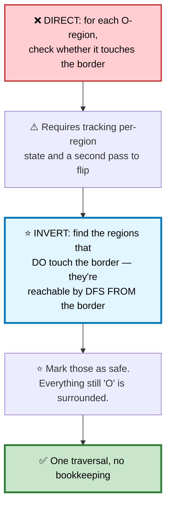

```
   BEFORE          MARK FROM BORDER      AFTER
   X X X X         X X X X               X X X X
   X O O X    ⭐→  X O O X          →    X X X X
   X X O X         X X O X               X X X X
   X O X X         X # X X               X O X X
                     ▲
              ⭐ reachable from the border → survives
```

```cpp
class Solution {
    int R, C;
    void mark(vector<vector<char>>& b, int r, int c) {
        if (r < 0 || r >= R || c < 0 || c >= C || b[r][c] != 'O') return;
        b[r][c] = '#';                          // ⭐ temporary "safe" marker
        mark(b,r-1,c); mark(b,r+1,c); mark(b,r,c-1); mark(b,r,c+1);
    }
public:
    void solve(vector<vector<char>>& b) {
        if (b.empty()) return;
        R = b.size(); C = b[0].size();

        // ⭐ start ONLY from the border
        for (int r = 0; r < R; ++r) { mark(b, r, 0); mark(b, r, C-1); }
        for (int c = 0; c < C; ++c) { mark(b, 0, c); mark(b, R-1, c); }

        for (auto& row : b)
            for (char& ch : row) {
                if (ch == 'O') ch = 'X';        // ⭐ surrounded → flip
                else if (ch == '#') ch = 'O';   // ⭐ safe → restore
            }
    }
};
```

⭐ **"Start from the boundary" is a recurring grid trick.** It also solves Pacific Atlantic Water Flow, Number of Enclaves, and Escape the Large Maze.

---

# 4. Pacific Atlantic Water Flow
🟡 ⚪ **Variation of #3** — ⭐ **reverse the flow direction**.

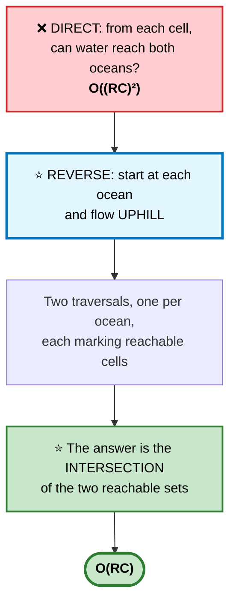

```cpp
class Solution {
    int R, C;
    void flow(vector<vector<int>>& h, vector<vector<bool>>& seen, int r, int c, int prev) {
        if (r < 0 || r >= R || c < 0 || c >= C) return;
        if (seen[r][c] || h[r][c] < prev) return;   // ⭐⭐ UPHILL: >= prev only

        seen[r][c] = true;
        flow(h,seen,r-1,c,h[r][c]); flow(h,seen,r+1,c,h[r][c]);
        flow(h,seen,r,c-1,h[r][c]); flow(h,seen,r,c+1,h[r][c]);
    }
public:
    vector<vector<int>> pacificAtlantic(vector<vector<int>>& h) {
        if (h.empty()) return {};
        R = h.size(); C = h[0].size();

        vector<vector<bool>> pac(R, vector<bool>(C)), atl(R, vector<bool>(C));

        for (int r = 0; r < R; ++r) {
            flow(h, pac, r, 0,     INT_MIN);    // ⭐ Pacific: left edge
            flow(h, atl, r, C - 1, INT_MIN);    // ⭐ Atlantic: right edge
        }
        for (int c = 0; c < C; ++c) {
            flow(h, pac, 0,     c, INT_MIN);    // top
            flow(h, atl, R - 1, c, INT_MIN);    // bottom
        }

        vector<vector<int>> out;
        for (int r = 0; r < R; ++r)
            for (int c = 0; c < C; ++c)
                if (pac[r][c] && atl[r][c]) out.push_back({r, c});   // ⭐ intersection
        return out;
    }
};
```
⭐ **`h[r][c] < prev` return** encodes "water flows downhill, so searching backwards means climbing" — the comparison is flipped relative to the natural direction.

---

# 5. Rotting Oranges

🟡 **Medium** · 🔵 Full ladder · ⭐ **Multi-source BFS**

> Every minute, rotten oranges rot their orthogonal neighbours. How many minutes until none are fresh?

## 💬 Why all sources start in the queue together

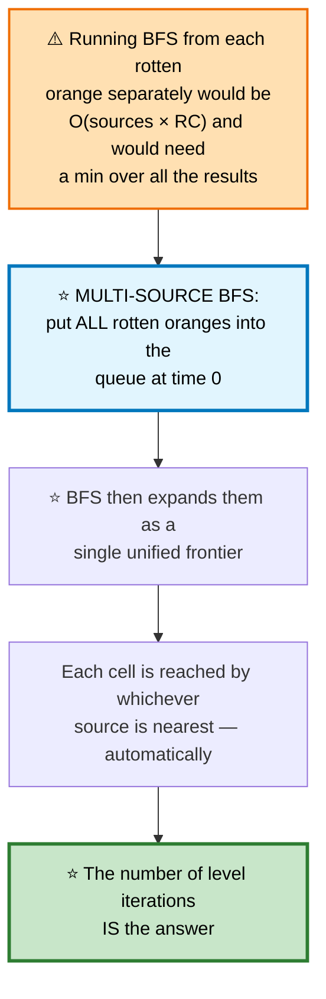

```
   TIME 0          TIME 1          TIME 2

   2 1 1           2 2 1           2 2 2
   1 1 0    ⭐→    2 1 0    ⭐→    2 2 0
   0 1 1           0 1 1           0 2 1

   ⭐ The frontier expands one ring per minute — exactly what
     BFS levels represent.
```

```cpp
int orangesRotting(vector<vector<int>>& g) {
    int R = g.size(), C = g[0].size(), fresh = 0;
    queue<pair<int,int>> q;

    for (int r = 0; r < R; ++r)
        for (int c = 0; c < C; ++c) {
            if (g[r][c] == 2) q.push({r, c});   // ⭐ EVERY source starts enqueued
            else if (g[r][c] == 1) ++fresh;
        }

    if (fresh == 0) return 0;                   // ⚠️ nothing to rot → 0, not −1

    int minutes = 0, dr[] = {-1,1,0,0}, dc[] = {0,0,-1,1};

    while (!q.empty() && fresh) {
        int sz = q.size();                      // ⭐ freeze the level size
        for (int i = 0; i < sz; ++i) {
            auto [r, c] = q.front(); q.pop();
            for (int d = 0; d < 4; ++d) {
                int nr = r + dr[d], nc = c + dc[d];
                if (nr >= 0 && nr < R && nc >= 0 && nc < C && g[nr][nc] == 1) {
                    g[nr][nc] = 2;
                    --fresh;
                    q.push({nr, nc});
                }
            }
        }
        ++minutes;                              // ⭐ one full level = one minute
    }
    return fresh ? -1 : minutes;                // ⚠️ unreachable fresh oranges
}
```

⚠️ **`&& fresh` in the loop condition** prevents counting an extra minute after the last orange rots — a very common off-by-one here.

## 📌 Pattern Card
```
SIGNAL   simultaneous spread from MULTIPLE starting points
KEY      ⭐ enqueue ALL sources before the BFS begins
         level count = time elapsed
RELATED  01 Matrix · Walls and Gates · Shortest Bridge · Map of Highest Peak
```

---

# 6. 01 Matrix / Walls and Gates
🟡 ⚪ **Variations of #5** — multi-source BFS from all zeros / all gates.

```cpp
vector<vector<int>> updateMatrix(vector<vector<int>>& mat) {
    int R = mat.size(), C = mat[0].size();
    vector<vector<int>> dist(R, vector<int>(C, -1));
    queue<pair<int,int>> q;

    for (int r = 0; r < R; ++r)
        for (int c = 0; c < C; ++c)
            if (mat[r][c] == 0) { dist[r][c] = 0; q.push({r, c}); }   // ⭐ all sources

    int dr[] = {-1,1,0,0}, dc[] = {0,0,-1,1};
    while (!q.empty()) {
        auto [r, c] = q.front(); q.pop();
        for (int d = 0; d < 4; ++d) {
            int nr = r + dr[d], nc = c + dc[d];
            if (nr >= 0 && nr < R && nc >= 0 && nc < C && dist[nr][nc] == -1) {
                dist[nr][nc] = dist[r][c] + 1;  // ⭐ distance propagates outward
                q.push({nr, nc});
            }
        }
    }
    return dist;
}
```
⭐ **`dist[nr][nc] == -1` doubles as the visited check** — once assigned, a cell is never revisited, and BFS guarantees the first assignment is the minimum.

---

# 7. Word Ladder

🔴 **Hard** · 🔵 Full ladder · ⭐ **A graph you must construct mentally**

> Transform `beginWord` into `endWord`, one letter at a time, each step a dictionary word. Shortest length?

## 💬 Recognizing the graph

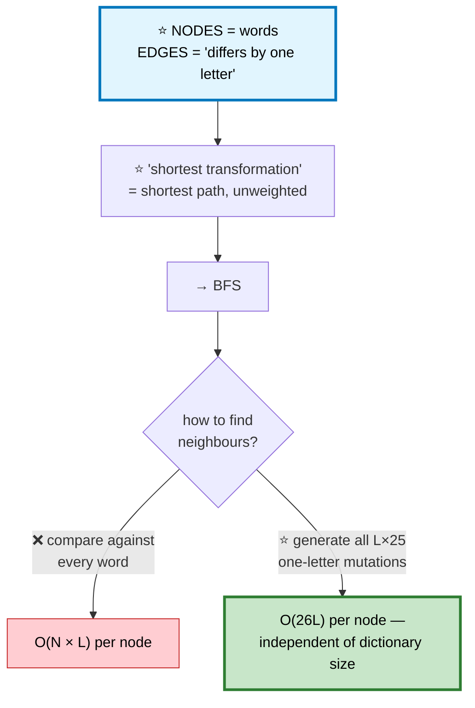

```
   ⭐ GENERATING NEIGHBOURS OF "hot"

     _ot → aot bot cot ... hot ... zot
     h_t → hat hbt hct ... hot ... hzt
     ho_ → hoa hob hoc ... hot ... hoz

   Check each against the dictionary set — O(1) per lookup.
   ⭐ Total 3 × 25 = 75 candidates, regardless of whether the
     dictionary holds 100 words or 100,000.
```

```cpp
int ladderLength(string begin, string end, vector<string>& wordList) {
    unordered_set<string> dict(wordList.begin(), wordList.end());
    if (!dict.count(end)) return 0;             // ⚠️ unreachable target

    queue<string> q;
    q.push(begin);
    dict.erase(begin);                          // ⭐ erasing IS the visited marker

    int steps = 1;
    while (!q.empty()) {
        int sz = q.size();
        for (int i = 0; i < sz; ++i) {
            string w = q.front(); q.pop();
            if (w == end) return steps;

            for (int p = 0; p < (int)w.size(); ++p) {   // ⭐ each position
                char orig = w[p];
                for (char c = 'a'; c <= 'z'; ++c) {     // ⭐ each letter
                    w[p] = c;
                    if (dict.count(w)) {
                        q.push(w);
                        dict.erase(w);          // ⭐ mark visited by removing
                    }
                }
                w[p] = orig;                    // ⭐ restore before the next position
            }
        }
        ++steps;
    }
    return 0;
}
```

## ⭐ Bidirectional BFS — the follow-up

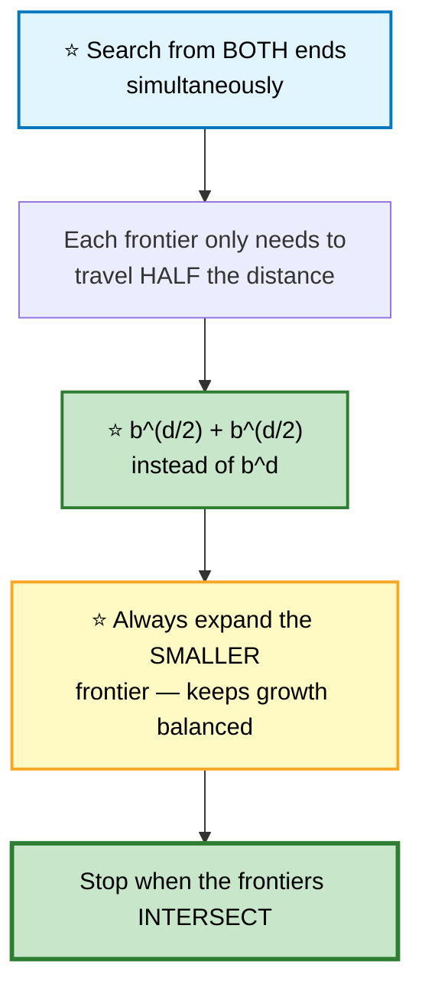

```
   ⭐⭐ WHY BIDIRECTIONAL IS DRAMATICALLY FASTER

   With branching factor b and distance d:
     one-directional  →  b^d nodes
     bidirectional    →  2 · b^(d/2) nodes

   For b = 26 and d = 6:
     26^6 ≈ 309,000,000
     2 · 26^3 ≈ 35,000        ⭐ ~9000× fewer

   ⚠️ It requires knowing the TARGET in advance. That rules it
     out for open-ended searches.
```

---

# 8. Course Schedule I / II

🟡 **Medium** · 🔵 Full ladder · ⭐ **Topological sort, both ways**

> Prerequisites form a directed graph. Can all courses be finished (I)? In what order (II)?

## 💬 The core equivalence

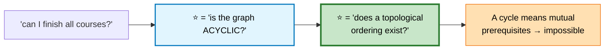

## Approach A — Kahn's algorithm (BFS) ⭐ preferred

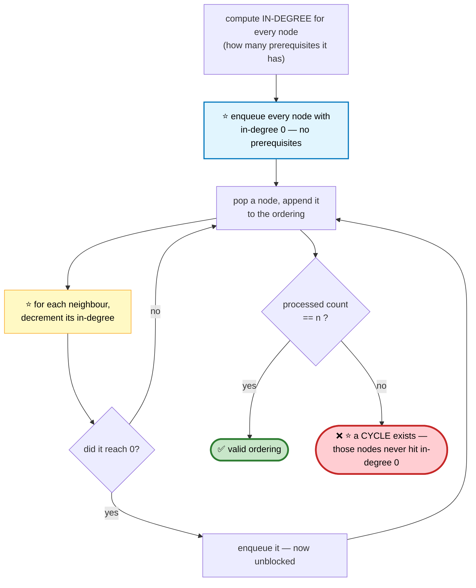

```
   ⭐⭐ THE CYCLE-DETECTION INSIGHT

   A node in a cycle ALWAYS has at least one unprocessed
   prerequisite — its predecessor in the cycle. So its
   in-degree never reaches 0, and it's never enqueued.

   ⭐ Therefore: processed < n  ⟺  a cycle exists.
     No extra cycle-detection machinery is needed.
```

```cpp
vector<int> findOrder(int n, vector<vector<int>>& prereq) {
    vector<vector<int>> adj(n);
    vector<int> indeg(n, 0);

    for (auto& p : prereq) {
        adj[p[1]].push_back(p[0]);              // ⭐ p[1] must come BEFORE p[0]
        ++indeg[p[0]];
    }

    queue<int> q;
    for (int i = 0; i < n; ++i) if (!indeg[i]) q.push(i);   // ⭐ no prerequisites

    vector<int> order;
    while (!q.empty()) {
        int u = q.front(); q.pop();
        order.push_back(u);

        for (int v : adj[u])
            if (--indeg[v] == 0) q.push(v);     // ⭐ just became unblocked
    }

    return (int)order.size() == n ? order : vector<int>{};   // ⭐ cycle check
}
```

## Approach B — DFS with three colours

```
   ⭐ THE THREE STATES

     WHITE (0) — unvisited
     GRAY  (1) — ⭐ currently on the recursion stack
     BLACK (2) — fully explored, no cycle beneath it

   ⭐⭐ Encountering a GRAY node means a BACK EDGE —
     you've looped back onto your own path. That is a cycle.

   ⚠️ Encountering a BLACK node is FINE — it's just a node
     you've already fully explored via a different route.
     Treating black as a cycle is the classic bug here.
```

```cpp
class Solution {
    vector<vector<int>> adj;
    vector<int> color;
    vector<int> order;

    bool dfs(int u) {
        color[u] = 1;                           // ⭐ GRAY — on the current path
        for (int v : adj[u]) {
            if (color[v] == 1) return false;    // ⭐⭐ BACK EDGE → cycle
            if (color[v] == 0 && !dfs(v)) return false;
        }
        color[u] = 2;                           // ⭐ BLACK — done
        order.push_back(u);                     // ⭐ POST-ORDER append
        return true;
    }

public:
    vector<int> findOrder(int n, vector<vector<int>>& prereq) {
        adj.assign(n, {});
        color.assign(n, 0);

        for (auto& p : prereq) adj[p[1]].push_back(p[0]);

        for (int i = 0; i < n; ++i)
            if (color[i] == 0 && !dfs(i)) return {};

        reverse(order.begin(), order.end());    // ⭐⭐ post-order REVERSED = topo order
        return order;
    }
};
```

⭐ **Why reversed post-order works:** a node is appended only after all its descendants. So in the final list, dependencies appear *after* their dependents — reversing puts them before.

## 📌 Pattern Card
```
SIGNAL   dependencies · ordering · "can this be scheduled?"
KEY      Kahn's: in-degree 0 queue; ⭐ processed < n means a CYCLE
         DFS: three colours; ⭐ GRAY = back edge = cycle
         ⭐ reversed post-order IS the topological order
RELATED  Alien Dictionary · Parallel Courses · Sequence Reconstruction
```

---

# 9. Alien Dictionary
🔴 ⚪ **Variation of #8** — the hard part is *building* the graph.

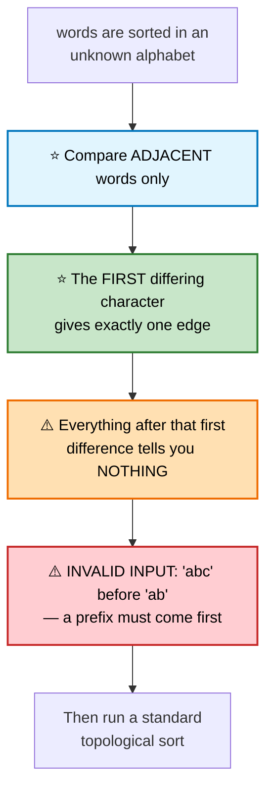

```cpp
string alienOrder(vector<string>& words) {
    unordered_map<char, unordered_set<char>> adj;
    unordered_map<char, int> indeg;

    for (auto& w : words) for (char c : w) indeg[c];   // ⭐ register every letter

    for (int i = 0; i + 1 < (int)words.size(); ++i) {
        const string &a = words[i], &b = words[i + 1];

        // ⚠️ invalid: a longer word cannot precede its own prefix
        if (a.size() > b.size() && a.compare(0, b.size(), b) == 0) return "";

        for (int j = 0; j < (int)min(a.size(), b.size()); ++j)
            if (a[j] != b[j]) {
                if (adj[a[j]].insert(b[j]).second) ++indeg[b[j]];  // ⭐ dedupe edges
                break;                          // ⭐⭐ ONLY the first difference
            }
    }

    queue<char> q;
    for (auto& [c, d] : indeg) if (!d) q.push(c);

    string out;
    while (!q.empty()) {
        char c = q.front(); q.pop();
        out += c;
        for (char nxt : adj[c]) if (--indeg[nxt] == 0) q.push(nxt);
    }
    return out.size() == indeg.size() ? out : "";   // ⭐ cycle check
}
```
⚠️ **Deduplicating edges matters.** Adding the same edge twice inflates the in-degree, and the node never reaches 0 — a phantom cycle.

---

# 10. Minimum Height Trees
🟡 ⚪ **Variation** — ⭐ peel leaves inward, like a topological sort on an undirected tree.

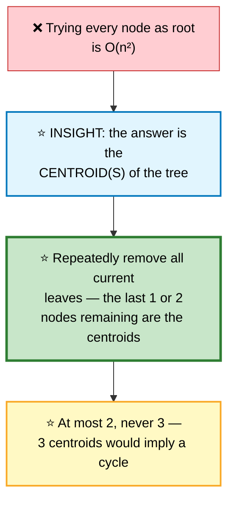

```cpp
vector<int> findMinHeightTrees(int n, vector<vector<int>>& edges) {
    if (n == 1) return {0};                     // ⚠️ single node

    vector<unordered_set<int>> adj(n);
    for (auto& e : edges) { adj[e[0]].insert(e[1]); adj[e[1]].insert(e[0]); }

    vector<int> leaves;
    for (int i = 0; i < n; ++i) if (adj[i].size() == 1) leaves.push_back(i);

    int remaining = n;
    while (remaining > 2) {                     // ⭐ stop at 1 or 2 centroids
        remaining -= leaves.size();
        vector<int> next;

        for (int leaf : leaves) {
            int nb = *adj[leaf].begin();
            adj[nb].erase(leaf);                // ⭐ peel the leaf off
            if (adj[nb].size() == 1) next.push_back(nb);   // ⭐ became a leaf
        }
        leaves = move(next);
    }
    return leaves;
}
```

---

# 11. Clone Graph

🟡 **Medium** · 🔵 Full ladder · ⭐ **The visited map IS the clone map**

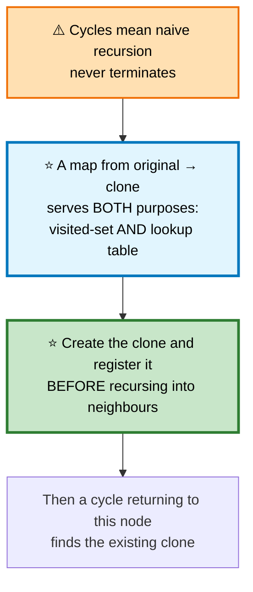

```cpp
class Solution {
    unordered_map<Node*, Node*> mp;             // ⭐ original → clone
public:
    Node* cloneGraph(Node* node) {
        if (!node) return nullptr;

        auto it = mp.find(node);
        if (it != mp.end()) return it->second;  // ⭐ already cloned

        Node* copy = new Node(node->val);
        mp[node] = copy;                        // ⭐⭐ REGISTER BEFORE recursing

        for (Node* nb : node->neighbors)
            copy->neighbors.push_back(cloneGraph(nb));

        return copy;
    }
};
```
⚠️ **Registering after the recursion** causes infinite recursion on any cycle — the same principle as marking on entry in flood fill.

---

# 12. Graph Valid Tree

🟡 **Medium** · 🔵 Full ladder · ⭐ **Two conditions, and both are needed**

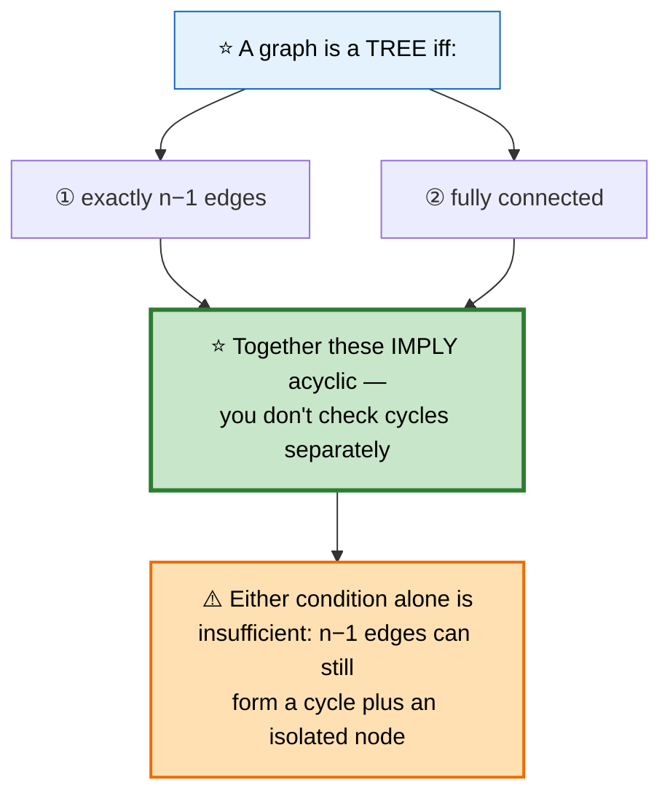

```
   ⚠️ WHY n−1 EDGES ALONE ISN'T ENOUGH

     n = 4, edges = [0-1, 1-2, 0-2]     ← 3 edges = n−1 ✅
                     node 3 is isolated

   ⭐ There's a triangle (a cycle) AND a disconnected node.
     Exactly n−1 edges, but not a tree.
```

```cpp
bool validTree(int n, vector<vector<int>>& edges) {
    if ((int)edges.size() != n - 1) return false;   // ⭐ condition ①

    vector<int> parent(n);
    iota(parent.begin(), parent.end(), 0);

    function<int(int)> find = [&](int x) {
        return parent[x] == x ? x : parent[x] = find(parent[x]);   // ⭐ path compression
    };

    for (auto& e : edges) {
        int a = find(e[0]), b = find(e[1]);
        if (a == b) return false;               // ⭐ a cycle → not a tree
        parent[a] = b;
    }
    return true;                                // ⭐ n−1 edges + no cycle ⟹ connected
}
```
⭐ **With exactly n−1 edges and no cycle, connectivity follows automatically** — so a single union-find pass settles it.

---

# 13. Number of Connected Components
🟡 ⚪ **Variation of #12** — count the surviving union-find roots.

```cpp
int countComponents(int n, vector<vector<int>>& edges) {
    vector<int> parent(n);
    iota(parent.begin(), parent.end(), 0);
    int components = n;                         // ⭐ start with n singletons

    function<int(int)> find = [&](int x) {
        return parent[x] == x ? x : parent[x] = find(parent[x]);
    };

    for (auto& e : edges) {
        int a = find(e[0]), b = find(e[1]);
        if (a != b) { parent[a] = b; --components; }   // ⭐ each merge reduces by 1
    }
    return components;
}
```
⭐ **Counting down from n** is cleaner than counting distinct roots afterwards.

---

# 14. Union-Find (The Structure)

🟡 **Medium** · 🔵 Full ladder · ⭐ **Two optimizations, both essential**

## 💬 What union-find is for

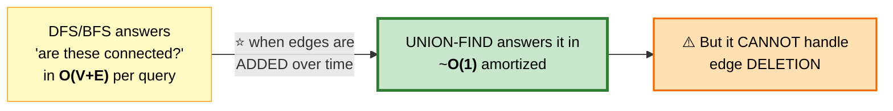

## ⭐ The two optimizations

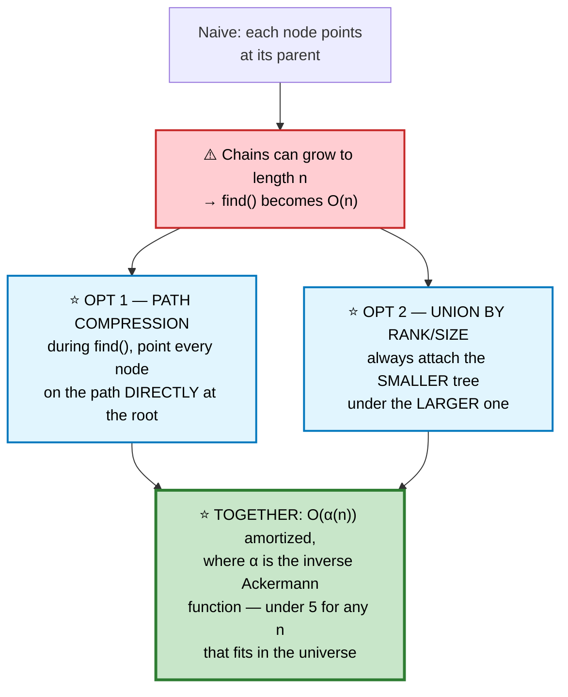

```
   ⭐ PATH COMPRESSION IN ACTION

   BEFORE find(4)          AFTER find(4)

        1                       1
        |                     / | \
        2                    2  3  4
        |                    ⭐ all now point straight at the root
        3
        |
        4

   ⭐ The next find() on ANY of these is O(1).
```

```cpp
class UnionFind {
    vector<int> parent, rank_;
    int components;

public:
    UnionFind(int n) : parent(n), rank_(n, 0), components(n) {
        iota(parent.begin(), parent.end(), 0);
    }

    int find(int x) {
        if (parent[x] != x)
            parent[x] = find(parent[x]);        // ⭐ PATH COMPRESSION
        return parent[x];
    }

    bool unite(int a, int b) {
        int ra = find(a), rb = find(b);
        if (ra == rb) return false;             // ⭐ already connected

        // ⭐ UNION BY RANK — keeps the tree shallow
        if (rank_[ra] < rank_[rb]) swap(ra, rb);
        parent[rb] = ra;
        if (rank_[ra] == rank_[rb]) ++rank_[ra];   // ⭐ rank grows only on a tie

        --components;
        return true;
    }

    bool connected(int a, int b) { return find(a) == find(b); }
    int  count() const { return components; }
};
```

⭐ **`unite` returning bool is deliberately useful** — `false` means "these were already connected", which directly answers cycle-detection and redundant-edge questions.

## 📌 Pattern Card
```
SIGNAL   dynamic connectivity · "are these in the same group?"
         edges arrive incrementally
KEY      ⭐ path compression + union by rank → O(α(n))
         ⭐ unite() returning false = a cycle was found
RELATED  Redundant Connection · Accounts Merge · Kruskal's MST
         Number of Provinces · Satisfiability of Equality Equations
```

---

# 15. Redundant Connection
🟡 ⚪ **Variation of #14** — the first union that fails is the answer.

```cpp
vector<int> findRedundantConnection(vector<vector<int>>& edges) {
    UnionFind uf(edges.size() + 1);             // ⭐ nodes are 1-indexed

    for (auto& e : edges)
        if (!uf.unite(e[0], e[1])) return e;    // ⭐ already connected → this edge
                                                //    closes a cycle
    return {};
}
```
⭐ **Because edges are processed in input order**, the first failure is by definition the last edge that could be removed — exactly what the problem asks for.

---

# 16. Accounts Merge
🟡 ⚪ **Variation of #14** — union-find over strings via an index map.

```cpp
vector<vector<string>> accountsMerge(vector<vector<string>>& accounts) {
    unordered_map<string,int> emailId;          // ⭐ email → a stable integer id
    unordered_map<string,string> emailName;
    int next = 0;

    for (auto& acc : accounts)
        for (int i = 1; i < (int)acc.size(); ++i) {
            if (!emailId.count(acc[i])) emailId[acc[i]] = next++;
            emailName[acc[i]] = acc[0];
        }

    UnionFind uf(next);
    for (auto& acc : accounts)
        for (int i = 2; i < (int)acc.size(); ++i)
            uf.unite(emailId[acc[1]], emailId[acc[i]]);   // ⭐ chain to the first email

    unordered_map<int, vector<string>> groups;
    for (auto& [email, id] : emailId)
        groups[uf.find(id)].push_back(email);   // ⭐ group by ROOT

    vector<vector<string>> out;
    for (auto& [root, emails] : groups) {
        sort(emails.begin(), emails.end());      // ⚠️ required by the problem
        vector<string> row{emailName[emails[0]]};
        row.insert(row.end(), emails.begin(), emails.end());
        out.push_back(move(row));
    }
    return out;
}
```
⭐ **Mapping strings to integers first** is the standard adapter — union-find fundamentally wants dense integer ids.

---

# 17. Network Delay Time (Dijkstra)

🟡 **Medium** · 🔵 Full ladder · ⭐ **The canonical Dijkstra**

## 💬 Why Dijkstra works, and when it doesn't

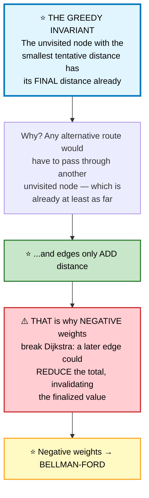

```
   TRACE  edges 1→2 (w=1), 2→3 (w=1), 1→3 (w=4), source = 1

   ┌──────────────┬───────────────┬───────────────────────────┐
   │ pop from PQ  │ dist          │ action                    │
   ├──────────────┼───────────────┼───────────────────────────┤
   │ (0, node 1)  │ {1:0}         │ relax 1→2 (1), 1→3 (4)    │
   │ (1, node 2)  │ {1:0,2:1,3:4} │ relax 2→3 → 1+1 = 2 < 4 ⭐ │
   │ (2, node 3)  │ {1:0,2:1,3:2} │ ⭐ improved!               │
   │ (4, node 3)  │      —        │ ⚠️ STALE — dist[3]=2 < 4,  │
   │              │               │    skip it                │
   └──────────────┴───────────────┴───────────────────────────┘
```

```cpp
int networkDelayTime(vector<vector<int>>& times, int n, int k) {
    vector<vector<pair<int,int>>> adj(n + 1);   // node → {neighbour, weight}
    for (auto& t : times) adj[t[0]].push_back({t[1], t[2]});

    vector<int> dist(n + 1, INT_MAX);
    dist[k] = 0;

    // ⭐ MIN-heap of {distance, node} — pair sorts by distance first
    priority_queue<pair<int,int>, vector<pair<int,int>>, greater<>> pq;
    pq.push({0, k});

    while (!pq.empty()) {
        auto [d, u] = pq.top(); pq.pop();

        if (d > dist[u]) continue;              // ⭐⭐ STALE entry — skip it

        for (auto& [v, w] : adj[u]) {
            if (dist[u] + w < dist[v]) {        // ⭐ relaxation
                dist[v] = dist[u] + w;
                pq.push({dist[v], v});          // ⭐ push, don't decrease-key
            }
        }
    }

    int worst = 0;
    for (int i = 1; i <= n; ++i) {
        if (dist[i] == INT_MAX) return -1;      // ⚠️ unreachable node
        worst = max(worst, dist[i]);
    }
    return worst;
}
```

```
   ⭐⭐ THE "LAZY DELETION" PATTERN

   A textbook Dijkstra uses decrease-key, which std::priority_queue
   doesn't support. Instead we PUSH A DUPLICATE with the better
   distance and skip stale entries on pop:

       if (d > dist[u]) continue;

   ⭐ The heap can hold up to O(E) entries instead of O(V), but
     the complexity is still O(E log E) = O(E log V), and the
     code is far simpler. This is what everyone actually does.
```

## 📌 Pattern Card
```
SIGNAL   shortest path with POSITIVE weights
KEY      min-heap of {dist, node} · relax · ⭐ skip stale pops
         ⚠️ negative weights BREAK the greedy invariant
RELATED  Path With Minimum Effort · Swim in Rising Water · Cheapest Flights
         Network Delay · Minimum Cost to Reach Destination in Time
```

---

# 18. Cheapest Flights Within K Stops

🟡 **Medium** · 🔵 Full ladder · ⭐ **Where Dijkstra fails and Bellman-Ford wins**

## ⚠️ Why plain Dijkstra is wrong here

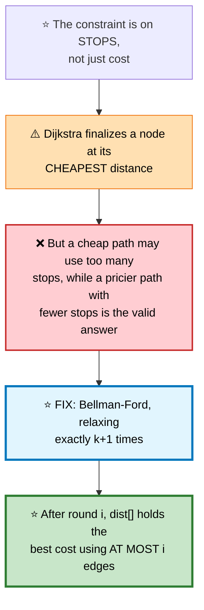

```cpp
int findCheapestPrice(int n, vector<vector<int>>& flights,
                      int src, int dst, int k) {
    vector<int> dist(n, INT_MAX);
    dist[src] = 0;

    for (int round = 0; round <= k; ++round) {  // ⭐ k stops = k+1 edges
        vector<int> next = dist;                // ⭐⭐ SNAPSHOT — critical

        for (auto& f : flights) {
            int u = f[0], v = f[1], w = f[2];
            if (dist[u] != INT_MAX && dist[u] + w < next[v])
                next[v] = dist[u] + w;
        }
        dist = move(next);
    }
    return dist[dst] == INT_MAX ? -1 : dist[dst];
}
```

```
   ⭐⭐ WHY THE SNAPSHOT COPY IS MANDATORY

   Without `next`, a relaxation within the SAME round could
   chain: relax u→v, then immediately use the new dist[v] to
   relax v→w. That path used TWO edges in one round.

   ⭐ Copying freezes the previous round's values, so each round
     adds EXACTLY one edge to every path. That's what makes the
     "at most k+1 edges" guarantee hold.
```

⭐ **Bellman-Ford's other superpower:** run one extra round after V−1. If anything still improves, a **negative cycle** exists. Dijkstra can't detect that at all.

---

# 19. Path With Minimum Effort
🟡 ⚪ **Variation of #17** — Dijkstra where "distance" means the **maximum single edge**, not the sum.

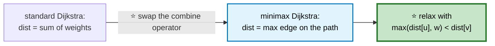

```cpp
int minimumEffortPath(vector<vector<int>>& h) {
    int R = h.size(), C = h[0].size();
    vector<vector<int>> effort(R, vector<int>(C, INT_MAX));

    priority_queue<tuple<int,int,int>, vector<tuple<int,int,int>>, greater<>> pq;
    pq.push({0, 0, 0});
    effort[0][0] = 0;

    int dr[] = {-1,1,0,0}, dc[] = {0,0,-1,1};
    while (!pq.empty()) {
        auto [e, r, c] = pq.top(); pq.pop();

        if (r == R-1 && c == C-1) return e;     // ⭐ first arrival IS optimal
        if (e > effort[r][c]) continue;         // ⭐ stale

        for (int d = 0; d < 4; ++d) {
            int nr = r + dr[d], nc = c + dc[d];
            if (nr < 0 || nr >= R || nc < 0 || nc >= C) continue;

            // ⭐⭐ MAX instead of SUM
            int ne = max(e, abs(h[nr][nc] - h[r][c]));
            if (ne < effort[nr][nc]) {
                effort[nr][nc] = ne;
                pq.push({ne, nr, nc});
            }
        }
    }
    return 0;
}
```
⭐ **Dijkstra works for any combine operator that is monotonic and never decreases** — `max` qualifies, which is why the same skeleton applies unchanged.

---

# 20. Swim in Rising Water
🔴 ⚪ **Identical to #19** — the "effort" is the maximum elevation on the path.

```cpp
// ⭐ Same code as minimumEffortPath, with one line changed:
int ne = max(e, grid[nr][nc]);                  // ⭐ max CELL value, not max delta
```

⭐ **An equally valid alternative:** binary search on the answer (time `t`), then check reachability with a plain BFS using only cells ≤ `t`. **O(RC log(RC))** — the same "binary search on the answer" pattern as [Kth Smallest in a Sorted Matrix](07-heaps-intervals.md#7-kth-smallest-in-a-sorted-matrix).

---

# 21. Minimum Spanning Tree (Kruskal + Prim)

🟡 **Medium** · 🔵 Full ladder · **Two algorithms, two shapes**

```mermaid
flowchart TD
    Q{"Which MST algorithm?"}
    Q -->|"SPARSE graph,<br/>edges given as a list"| A["⭐ KRUSKAL<br/>sort edges, union-find<br/><b>O(E log E)</b>"]
    Q -->|"DENSE graph,<br/>adjacency available"| B["⭐ PRIM<br/>grow from one node<br/><b>O(E log V)</b>"]

    style Q fill:#e3f2fd,stroke:#1565c0,stroke-width:2px,color:#000
    style A fill:#c8e6c9,stroke:#2e7d32,stroke-width:2px,color:#000
    style B fill:#fff9c4,stroke:#f9a825,stroke-width:2px,color:#000
```

## Kruskal — ⭐ sort globally, union locally

```mermaid
flowchart TD
    A["sort ALL edges by weight"] --> B["for each edge, cheapest first"]
    B --> C{"do its endpoints already<br/>share a component?"}
    C -->|"yes"| D["⭐ skip — adding it<br/>would create a cycle"]
    C -->|"no"| E["⭐ take it, union the components"]
    E --> F{"n−1 edges taken?"}
    F -->|"yes"| G(["✅ MST complete"])
    F -->|"no"| B
    D --> B

    style C fill:#fff9c4,stroke:#f9a825,color:#000
    style E fill:#c8e6c9,stroke:#2e7d32,stroke-width:2px,color:#000
    style G fill:#c8e6c9,stroke:#2e7d32,stroke-width:3px,color:#000
```

```cpp
int minCostConnectPoints(vector<vector<int>>& pts) {
    int n = pts.size();
    vector<tuple<int,int,int>> edges;

    for (int i = 0; i < n; ++i)                 // ⭐ complete graph
        for (int j = i + 1; j < n; ++j)
            edges.push_back({abs(pts[i][0]-pts[j][0]) + abs(pts[i][1]-pts[j][1]), i, j});

    sort(edges.begin(), edges.end());           // ⭐ cheapest first

    UnionFind uf(n);
    int total = 0, taken = 0;

    for (auto& [w, u, v] : edges) {
        if (uf.unite(u, v)) {                   // ⭐ false = would form a cycle
            total += w;
            if (++taken == n - 1) break;        // ⭐ MST has exactly n−1 edges
        }
    }
    return total;
}
```

## Prim — ⭐ grow one connected blob

```cpp
int minCostConnectPointsPrim(vector<vector<int>>& pts) {
    int n = pts.size(), total = 0, visited = 0;
    vector<bool> inMST(n, false);

    priority_queue<pair<int,int>, vector<pair<int,int>>, greater<>> pq;
    pq.push({0, 0});                            // ⭐ start anywhere

    while (visited < n) {
        auto [w, u] = pq.top(); pq.pop();
        if (inMST[u]) continue;                 // ⭐ stale entry

        inMST[u] = true;
        total += w;
        ++visited;

        for (int v = 0; v < n; ++v)             // ⭐ push all edges to outside nodes
            if (!inMST[v])
                pq.push({abs(pts[u][0]-pts[v][0]) + abs(pts[u][1]-pts[v][1]), v});
    }
    return total;
}
```

```
   ⭐⭐ THE CUT PROPERTY — why both are correct

   For ANY partition of the vertices into two sets, the
   CHEAPEST edge crossing that partition belongs to some MST.

   ⭐ Kruskal uses it globally: the cheapest edge joining two
     different components is safe.
   ⭐ Prim uses it locally: the cheapest edge leaving the
     grown blob is safe.

   Same theorem, two different sweeps. ∎
```

---

# 22. Critical Connections (Bridges)

🔴 **Hard** · 🔵 Full ladder · ⭐ **Tarjan's low-link**

> Find every edge whose removal disconnects the graph.

## 💬 The low-link idea

```mermaid
flowchart TD
    A["⭐ disc[u] = when DFS first<br/>discovered u (a timestamp)"] --> C
    B["⭐ low[u] = the EARLIEST disc<br/>reachable from u's subtree,<br/>using at most one back edge"] --> C
    C{"for edge u → v:<br/>is low[v] &gt; disc[u] ?"}
    C -->|"YES"| D["⭐⭐ BRIDGE — v's subtree has<br/>NO alternative route back<br/>above u"]
    C -->|"NO"| E["a back edge bypasses this<br/>edge → not critical"]

    style A fill:#e3f2fd,stroke:#1565c0,color:#000
    style B fill:#e1f5fe,stroke:#0277bd,stroke-width:2px,color:#000
    style C fill:#fff9c4,stroke:#f9a825,stroke-width:2px,color:#000
    style D fill:#c8e6c9,stroke:#2e7d32,stroke-width:3px,color:#000
```

```
   ⭐ INTUITION IN ONE SENTENCE

   An edge u–v is a bridge exactly when the only way out of
   v's subtree is back through u itself. If any node down
   there has a back edge climbing above u, the edge is
   redundant.
```

```cpp
class Solution {
    vector<vector<int>> adj;
    vector<int> disc, low;
    vector<vector<int>> bridges;
    int timer = 0;

    void dfs(int u, int parent) {
        disc[u] = low[u] = timer++;             // ⭐ discovery time

        for (int v : adj[u]) {
            if (v == parent) continue;          // ⚠️ don't reuse the tree edge

            if (disc[v] == -1) {                // unvisited → tree edge
                dfs(v, u);
                low[u] = min(low[u], low[v]);   // ⭐ inherit the child's reach

                if (low[v] > disc[u])           // ⭐⭐ BRIDGE
                    bridges.push_back({u, v});
            } else {
                low[u] = min(low[u], disc[v]);  // ⭐ back edge — use disc, NOT low
            }
        }
    }

public:
    vector<vector<int>> criticalConnections(int n, vector<vector<int>>& conns) {
        adj.assign(n, {});
        disc.assign(n, -1);
        low.assign(n, -1);

        for (auto& c : conns) { adj[c[0]].push_back(c[1]); adj[c[1]].push_back(c[0]); }

        dfs(0, -1);
        return bridges;
    }
};
```

⚠️ **On a back edge, use `disc[v]`, not `low[v]`.** Using `low[v]` can propagate reachability the DFS tree doesn't actually provide, producing wrong answers on some graphs.

⚠️ **`v == parent` skips only the tree edge.** With genuine parallel edges you must skip by edge id instead, since a duplicate edge *does* provide an alternative route.

⭐ **Articulation points** use nearly identical code with `low[v] >= disc[u]`, plus a special case for the root (it's an articulation point iff it has more than one DFS child).

---

# 23. Word Search II
🔴 ⚪ **Variation** — see the [Trie discussion](06-trees.md#19-trie-prefix-tree).

```cpp
class Solution {
    struct Node { Node* kids[26] = {}; string word; };
    Node* root = new Node();
    vector<string> out;
    int R, C;

    void dfs(vector<vector<char>>& b, int r, int c, Node* node) {
        if (r < 0 || r >= R || c < 0 || c >= C) return;

        char ch = b[r][c];
        if (ch == '#' || !node->kids[ch - 'a']) return;   // ⭐⭐ PRUNE instantly

        node = node->kids[ch - 'a'];
        if (!node->word.empty()) {
            out.push_back(node->word);
            node->word.clear();                 // ⭐ dedupe — found it once
        }

        b[r][c] = '#';                          // ⭐ mark visited
        dfs(b,r-1,c,node); dfs(b,r+1,c,node);
        dfs(b,r,c-1,node); dfs(b,r,c+1,node);
        b[r][c] = ch;                           // ⭐⭐ RESTORE — backtracking
    }

public:
    vector<string> findWords(vector<vector<char>>& b, vector<string>& words) {
        for (auto& w : words) {                 // build the trie
            Node* n = root;
            for (char c : w) {
                if (!n->kids[c-'a']) n->kids[c-'a'] = new Node();
                n = n->kids[c-'a'];
            }
            n->word = w;                        // ⭐ store the word AT the end node
        }

        R = b.size(); C = b[0].size();
        for (int r = 0; r < R; ++r)
            for (int c = 0; c < C; ++c) dfs(b, r, c, root);
        return out;
    }
};
```
⭐ **Storing the full word at the terminal node** avoids reconstructing it from the path — a small but meaningful simplification.

---

# 24. Bipartite Graph Check

🟡 **Medium** · 🔵 Full ladder · **2-colouring**

```mermaid
flowchart TD
    A["⭐ 'bipartite' = the nodes split into<br/>two groups with NO edge inside<br/>a group"] --> B["= colourable with 2 colours<br/>such that no edge joins<br/>same-coloured nodes"]
    B --> C["BFS/DFS assigning alternating colours"]
    C --> D{"a neighbour already has<br/>the SAME colour?"}
    D -->|"yes"| E(["❌ ⭐ an ODD-LENGTH cycle exists<br/>→ not bipartite"])
    D -->|"no"| F(["✅ bipartite"])

    style B fill:#e1f5fe,stroke:#0277bd,stroke-width:2px,color:#000
    style D fill:#fff9c4,stroke:#f9a825,color:#000
    style E fill:#ffcdd2,stroke:#c62828,stroke-width:2px,color:#000
    style F fill:#c8e6c9,stroke:#2e7d32,stroke-width:3px,color:#000
```

```
   ⭐ THE THEOREM
     A graph is bipartite ⟺ it contains NO odd-length cycle.

     Walking around an even cycle alternates back to the
     starting colour ✅
     Walking around an odd cycle arrives with a CONFLICT ❌
```

```cpp
bool isBipartite(vector<vector<int>>& graph) {
    int n = graph.size();
    vector<int> color(n, -1);                   // ⭐ −1 = uncoloured

    for (int start = 0; start < n; ++start) {   // ⚠️ handle DISCONNECTED components
        if (color[start] != -1) continue;

        queue<int> q;
        q.push(start);
        color[start] = 0;

        while (!q.empty()) {
            int u = q.front(); q.pop();
            for (int v : graph[u]) {
                if (color[v] == -1) {
                    color[v] = 1 - color[u];    // ⭐ flip the colour
                    q.push(v);
                } else if (color[v] == color[u]) {
                    return false;               // ⭐ conflict → odd cycle
                }
            }
        }
    }
    return true;
}
```
⚠️ **The outer loop over every start node** is essential — a graph can be disconnected, and each component must be checked independently.

---

# 25. Reconstruct Itinerary (Eulerian)

🔴 **Hard** · 🔵 Full ladder · ⭐ **Hierholzer's algorithm**

> Use **every** ticket exactly once. Return the lexicographically smallest itinerary.

## ⚠️ Why plain greedy DFS fails

```mermaid
flowchart TD
    A["❌ NAIVE: always fly to the<br/>lexicographically smallest<br/>next airport"] --> B["⚠️ You can strand yourself at a<br/>dead end with tickets unused"]
    B --> C["⭐ HIERHOLZER'S FIX:<br/>append a node to the route only<br/>AFTER exhausting all its edges"]
    C --> D["⭐ Then REVERSE the result"]
    D --> E["Dead ends are appended FIRST,<br/>so after reversal they land LAST —<br/>exactly where they belong"]

    style A fill:#ffcdd2,stroke:#c62828,stroke-width:2px,color:#000
    style C fill:#e1f5fe,stroke:#0277bd,stroke-width:3px,color:#000
    style E fill:#c8e6c9,stroke:#2e7d32,stroke-width:3px,color:#000
```

```
   ⭐⭐ THE POST-ORDER INSIGHT

   A node is appended only when it has NO unused outgoing
   tickets — that is, when it's a dead end.

   The FIRST dead end you hit must be the FINAL destination,
   because there's no way to leave it.

   ⭐ Appending dead ends first and reversing puts them in
     the correct order automatically — no backtracking, no
     lookahead needed. ∎
```

```cpp
vector<string> findItinerary(vector<vector<string>>& tickets) {
    // ⭐ multiset → automatically sorted, and erase removes ONE copy
    unordered_map<string, multiset<string>> adj;
    for (auto& t : tickets) adj[t[0]].insert(t[1]);

    vector<string> route;
    stack<string> st;
    st.push("JFK");

    while (!st.empty()) {
        string u = st.top();

        if (adj[u].empty()) {                   // ⭐ dead end → finalize it
            route.push_back(u);
            st.pop();
        } else {
            string v = *adj[u].begin();         // ⭐ lexicographically smallest
            adj[u].erase(adj[u].begin());       // ⚠️ erase ONE copy
            st.push(v);
        }
    }

    reverse(route.begin(), route.end());        // ⭐⭐ post-order reversed
    return route;
}
```

⭐ **An Eulerian path exists** iff at most one node has `out − in == 1` (the start), at most one has `in − out == 1` (the end), and everything else is balanced. Worth stating even though the problem guarantees validity.

---

## 📋 Graphs Recall

```mermaid
mindmap
  root(("Graphs"))
    Choosing the Algorithm
      unweighted shortest → ⭐ BFS, never DFS
      positive weights → Dijkstra
      negative weights → Bellman-Ford
      hop-limited → ⭐ Bellman-Ford k+1 rounds
      all pairs → Floyd-Warshall
    Grids as Graphs
      flood fill for regions
      ⭐ mark on ENTRY / ENQUEUE
      ⭐ multi-source BFS for spread
      ⭐ start from the BORDER
      ⭐ REVERSE the flow direction
    Topological Sort
      Kahn: in-degree 0 queue
      ⭐ processed &lt; n ⟹ cycle
      DFS: ⭐ GRAY = back edge
      ⭐ reversed post-order
    Union-Find
      ⭐ path compression + rank
      ⭐ unite() false = cycle
      map strings to integer ids
      ⚠️ no edge deletion
    Dijkstra Details
      min-heap of {dist, node}
      ⭐ skip stale pops
      combine op can be max, not just sum
    Advanced
      ⭐ Tarjan low-link for bridges
      MST: Kruskal sparse, Prim dense
      ⭐ Hierholzer for Eulerian paths
      2-colouring ⟺ no odd cycle
      ⭐ bidirectional BFS
```

```
╔══════════════════════════════════════════════════════════════════════╗
║                      GRAPHS — PATTERN RECALL                         ║
╠══════════════════════════════════════════════════════════════════════╣
║ "connected regions in a grid"  → flood fill, mark on entry           ║
║ "shortest path, unweighted"    → ⭐ BFS (DFS is WRONG)                ║
║ "spread from many sources"     → ⭐ multi-source BFS, all in at once  ║
║ "regions NOT touching an edge" → ⭐ invert: start from the border     ║
║ "can water reach both oceans"  → ⭐ reverse the flow, intersect       ║
║ "prerequisites / ordering"     → topological sort                    ║
║ "does a cycle exist (directed)"→ ⭐ Kahn: processed<n, or GRAY in DFS ║
║ "are these connected, growing" → ⭐ UNION-FIND                        ║
║ "shortest path, weighted"      → Dijkstra, skip stale pops           ║
║ "at most k stops"              → ⭐ Bellman-Ford with a snapshot copy ║
║ "minimize the MAX edge"        → Dijkstra with max instead of sum    ║
║ "cheapest connecting edges"    → MST: Kruskal or Prim                ║
║ "edges whose removal splits"   → ⭐ Tarjan: low[v] > disc[u]          ║
║ "use every edge exactly once"  → ⭐ Hierholzer, post-order reversed   ║
╠══════════════════════════════════════════════════════════════════════╣
║ ⚠️ TRAPS                                                              ║
║   flood fill: marking AFTER recursing → infinite recursion           ║
║   BFS: marking on dequeue → the queue explodes                       ║
║   grid DFS: recursion depth O(RC) can overflow the stack             ║
║   Dijkstra: negative weights silently give WRONG answers             ║
║   Bellman-Ford k stops: without the snapshot, paths chain in a round ║
║   Tarjan: back edges use disc[v], NOT low[v]                         ║
║   bipartite: you must loop over every component                      ║
║   alien dictionary: duplicate edges inflate in-degree → phantom cycle║
╚══════════════════════════════════════════════════════════════════════╝
```

---

**Next:** [Dynamic Programming →](09-dynamic-programming.md) · **Back:** [Heaps & Intervals](07-heaps-intervals.md)
