# 🧮 Dynamic Programming

> DP scares people because it's taught backwards. Nobody invents a table out of thin air. **You write the obvious brute-force recursion, notice it recomputes the same things, and cache them.** That's it.

**Prerequisite:** [Patterns & Foundations](00-patterns.md) · **Format:** [see the sample](FORMAT-SAMPLE.md)

---

## 🧠 What DP Actually Is

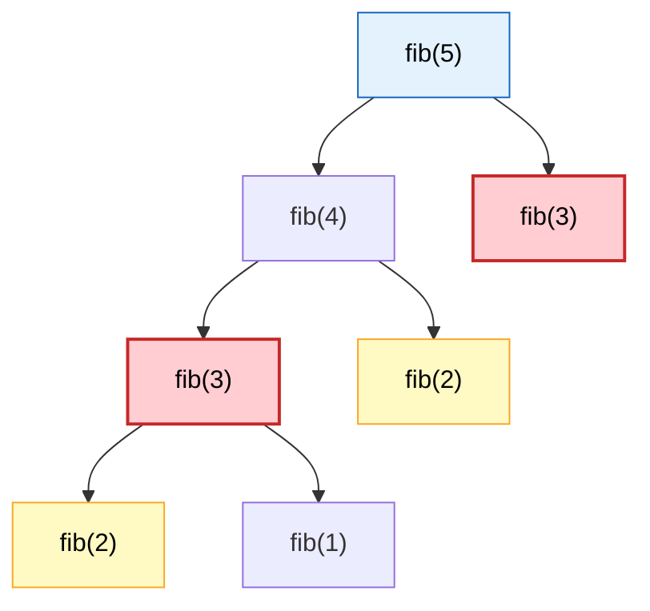

```
   ⭐ fib(3) is computed TWICE above. fib(50) recomputes
     fib(30) about 800,000 times.

   The fix: write the answer down the first time, look it up
   after that. That's the whole idea. Everything else is
   bookkeeping.
```

## ⭐ The Two Requirements

```
   ① OPTIMAL SUBSTRUCTURE
      The best answer to a big problem is built from best
      answers to smaller problems.
      ✅ shortest path A→C via B = best(A→B) + best(B→C)
      ❌ LONGEST simple path — doesn't compose this way

   ② OVERLAPPING SUBPROBLEMS
      The same subproblem recurs. If subproblems never repeat,
      caching buys nothing — that's just divide & conquer.
```

## ⭐ The Recipe — follow it every time

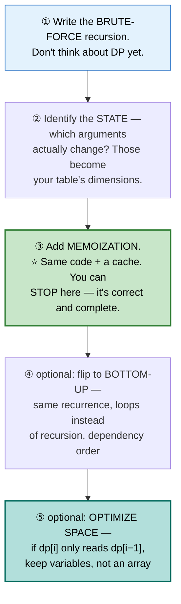

🎤 **Say this out loud in an interview:** *"Let me start with the brute-force recursion, then find the repeated states and memoize."* That narration signals understanding, not memorized tables.

```cpp
// TOP-DOWN (memoization)              // BOTTOM-UP (tabulation)
unordered_map<int,int> memo;           vector<int> dp(n+1);
int f(int n) {                         dp[0] = base;
    if (n <= 1) return n;              for (int i = 1; i <= n; ++i)
    if (memo.count(n)) return memo[n];     dp[i] = dp[i-1] + dp[i-2];
    return memo[n] = f(n-1)+f(n-2);    return dp[n];
}
```

---

## 📑 Contents

| # | Problem | Diff | Type | Optimal |
|---|---|---|---|---|
| [1](#1-climbing-stairs--fibonacci-family) | Climbing Stairs / Fibonacci | 🟢 | 🔵 **Full** | O(n)/O(1) |
| [2](#2-house-robber-i--ii) | House Robber I / II | 🟡 | 🔵 **Full** | O(n)/O(1) |
| [3](#3-coin-change) | Coin Change | 🟡 | 🔵 **Full** | ⭐ unbounded knapsack |
| [4](#4-coin-change-ii) | Coin Change II | 🟡 | ⚪ Variation | count, order matters |
| [5](#5-0-1-knapsack) | 0/1 Knapsack | 🟡 | 🔵 **Full** | ⭐ the loop-direction rule |
| [6](#6-partition-equal-subset-sum) | Partition Equal Subset Sum | 🟡 | ⚪ Variation | knapsack in disguise |
| [7](#7-target-sum) | Target Sum | 🟡 | ⚪ Variation | knapsack via algebra |
| [8](#8-longest-increasing-subsequence) | Longest Increasing Subsequence | 🟡 | 🔵 **Full** | O(n log n) patience sorting |
| [9](#9-longest-common-subsequence) | Longest Common Subsequence | 🟡 | 🔵 **Full** | O(nm) 2D grid |
| [10](#10-edit-distance) | Edit Distance | 🔴 | ⚪ Variation | LCS grid, 3 operations |
| [11](#11-longest-palindromic-subsequence) | Longest Palindromic Subsequence | 🟡 | ⚪ Variation | LCS with reverse |
| [12](#12-word-break) | Word Break | 🟡 | ⚪ Variation | see [Strings #70](01c-arrays-strings.md#70-word-break) |
| [13](#13-decode-ways) | Decode Ways | 🟡 | 🔵 **Full** | O(n)/O(1) |
| [14](#14-unique-paths-i--ii) | Unique Paths I / II | 🟡 | 🔵 **Full** | O(RC) grid DP |
| [15](#15-minimum-path-sum) | Minimum Path Sum | 🟡 | ⚪ Variation | same grid, min not count |
| [16](#16-maximal-square) | Maximal Square | 🟡 | 🔵 **Full** | ⭐ min of 3 neighbors |
| [17](#17-best-time-to-buy-sell-stock-ii-iii-iv) | Buy/Sell Stock II/III/IV | 🔴 | 🔵 **Full** | ⭐ state machine |
| [18](#18-best-time-to-buy-sell-stock-with-cooldown) | Stock with Cooldown | 🟡 | ⚪ Variation | 3-state machine |
| [19](#19-longest-common-substring) | Longest Common Substring | 🟡 | ⚪ Variation | LCS reset-on-mismatch |
| [20](#20-palindrome-partitioning-ii) | Palindrome Partitioning II | 🔴 | 🔵 **Full** | ⭐ precompute + 1D DP |
| [21](#21-burst-balloons) | Burst Balloons | 🔴 | 🔵 **Full** | ⭐ interval DP, think LAST |
| [22](#22-matrix-chain-multiplication) | Matrix Chain Multiplication | 🔴 | ⚪ Variation | interval DP, split point |
| [23](#23-regular-expression--wildcard-matching) | Regex / Wildcard Matching | 🔴 | 🔵 **Full** | 2D DP with `*` handling |
| [24](#24-dungeon-game) | Dungeon Game | 🔴 | 🔵 **Full** | ⭐ DP from the END |
| [25](#25-perfect-squares) | Perfect Squares | 🟡 | ⚪ Variation | unbounded knapsack |
| [26](#26-longest-increasing-path-in-matrix) | Longest Increasing Path in Matrix | 🔴 | 🔵 **Full** | ⭐ DFS + memo on a DAG |
| [27](#27-maximum-profit-in-job-scheduling) | Max Profit in Job Scheduling | 🔴 | 🔵 **Full** | sort + binary search + DP |
| [28](#28-partition-to-k-equal-sum-subsets) | Partition to K Equal Sum Subsets | 🟡 | ⚪ Variation | backtracking + memo |

---

# 1. Climbing Stairs / Fibonacci Family

🟢 **Easy** · 🔵 Full ladder · ⭐ **The prototype every other DP problem generalizes**

> Reach step n, moving 1 or 2 steps at a time. How many distinct ways?

## 🗺️ Approach Ladder

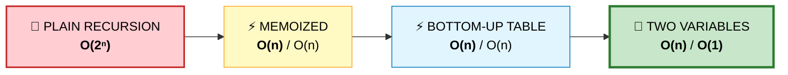

## 💬 The recurrence
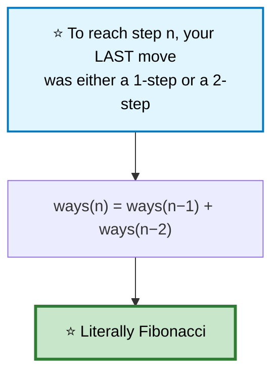

```cpp
int climbStairs(int n) {
    if (n <= 2) return n;
    int prev2 = 1, prev1 = 2;                   // ⭐ ways(1), ways(2)
    for (int i = 3; i <= n; ++i) {
        int cur = prev1 + prev2;
        prev2 = prev1;
        prev1 = cur;
    }
    return prev1;
}
```

⭐ **This exact skeleton — "last move determines the recurrence, roll two variables forward"** — reappears in House Robber, Decode Ways, and the stock problems. Recognize it once, apply it everywhere.

## 📌 Pattern Card
```
SIGNAL   count ways / reach a target via small steps
KEY      dp[i] = combine dp[i-1], dp[i-2], ... based on last move
         ⭐ roll to O(1) space when only the last few states matter
RELATED  House Robber · Decode Ways · Min Cost Climbing Stairs
```

---

# 2. House Robber I / II

🟡 **Medium** · 🔵 Full ladder · ⭐ **The take-or-skip decision**

> Adjacent houses can't both be robbed. Maximize total.

## 💬 The recurrence

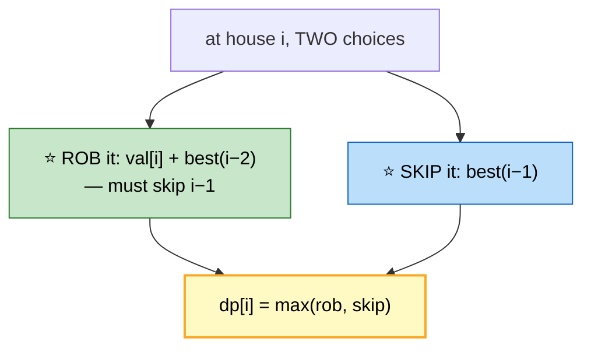

```cpp
int rob(vector<int>& a) {
    int prev2 = 0, prev1 = 0;                   // ⭐ dp[i-2], dp[i-1]
    for (int x : a) {
        int cur = max(prev1, prev2 + x);
        prev2 = prev1;
        prev1 = cur;
    }
    return prev1;
}
```

## House Robber II — circular houses
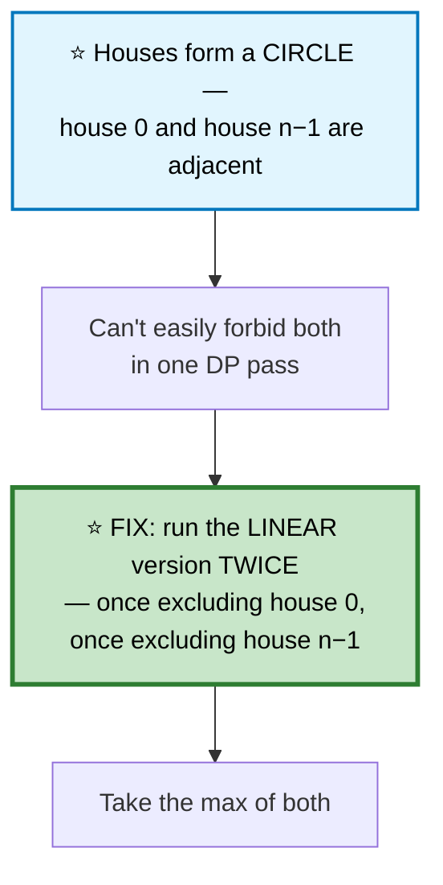
```cpp
int robCircular(vector<int>& a) {
    int n = a.size();
    if (n == 1) return a[0];                    // ⚠️ edge case

    vector<int> a1(a.begin(), a.end() - 1);      // exclude last
    vector<int> a2(a.begin() + 1, a.end());      // exclude first
    return max(rob(a1), rob(a2));
}
```
⭐ **"Break the circular constraint by running the linear solution twice, excluding each endpoint once"** is a reusable trick for any circular-array DP.

---

# 3. Coin Change

🟡 **Medium** · 🔵 Full ladder · ⭐ **Unbounded knapsack — coins reusable**

> Fewest coins to make `amount`. Unlimited supply of each denomination.

## 🗺️ Approach Ladder

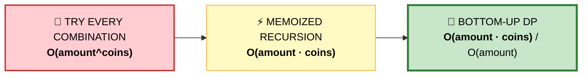

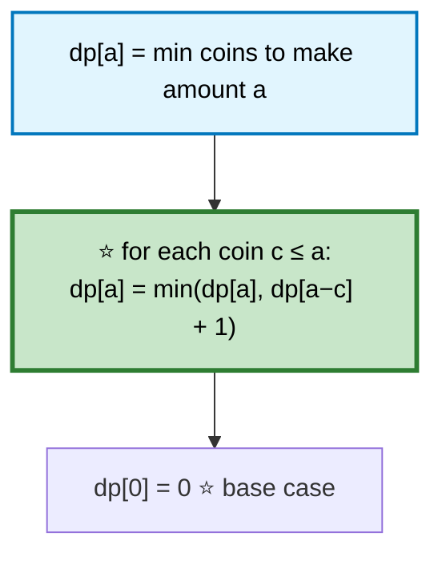

```cpp
int coinChange(vector<int>& coins, int amount) {
    vector<int> dp(amount + 1, INT_MAX);
    dp[0] = 0;

    for (int a = 1; a <= amount; ++a)
        for (int c : coins)
            if (c <= a && dp[a - c] != INT_MAX)
                dp[a] = min(dp[a], dp[a - c] + 1);

    return dp[amount] == INT_MAX ? -1 : dp[amount];
}
```

⚠️ **The `dp[a-c] != INT_MAX` guard** prevents overflow from `INT_MAX + 1`.

---

# 4. Coin Change II
🟡 ⚪ **Variation of #3** — count *ways*, not minimum coins. ⭐ **Loop order changes the answer.**

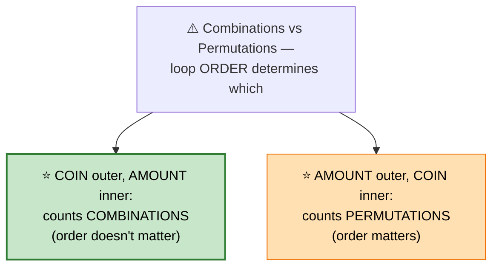
```cpp
int change(int amount, vector<int>& coins) {
    vector<int> dp(amount + 1, 0);
    dp[0] = 1;

    for (int c : coins)                         // ⭐ COIN outer → combinations
        for (int a = c; a <= amount; ++a)
            dp[a] += dp[a - c];
    return dp[amount];
}
```
```
   ⭐⭐ WHY THE LOOP ORDER MATTERS

   coin-outer: by the time we process coin c, dp[a] already
   reflects all ways using ONLY coins processed so far — so
   [1,2] and [2,1] are never counted as different, because 2
   is only ever added AFTER 1 has been fully incorporated.

   amount-outer, coin-inner: dp[a] is rebuilt from scratch at
   each amount using ALL coins, so [1,2] and [2,1] both get
   counted — that's PERMUTATIONS (used by Combination Sum IV).
```

---

# 5. 0/1 Knapsack

🟡 **Medium** · 🔵 Full ladder · ⭐ **The loop-direction rule that trips everyone up**

> Each item usable **at most once**. Maximize value within a weight capacity.

## 💬 The 2D recurrence, then the space optimization

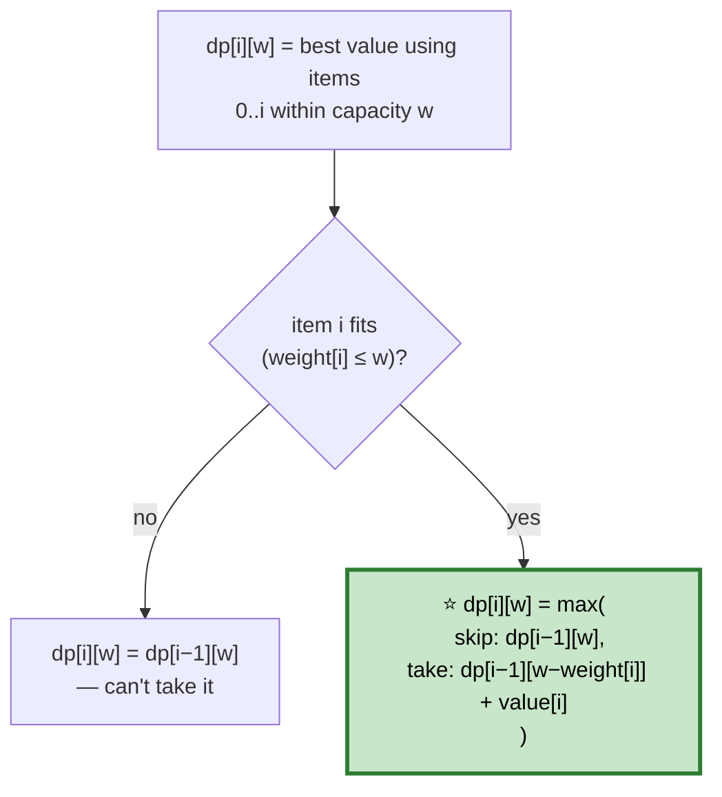

```
   ⭐⭐ COLLAPSING TO 1D — THE RULE THAT MATTERS

   dp[i][w] only ever reads dp[i-1][...], so one row suffices
   IF you update it in the right direction.

   0/1 knapsack (each item ONCE):
     ⭐ iterate w DESCENDING (right to left)
     Reading dp[w - weight[i]] must see the OLD (i-1) value,
     not one already updated in this same item's pass.

   Unbounded knapsack (Coin Change, items REUSABLE):
     ⭐ iterate w ASCENDING (left to right)
     Reading the NEW value is exactly what allows reuse.

   ⚠️ Getting this backwards is THE classic knapsack bug —
     it silently turns 0/1 into unbounded or vice versa.
```

```cpp
int knapsack01(vector<int>& wt, vector<int>& val, int cap) {
    vector<int> dp(cap + 1, 0);

    for (int i = 0; i < (int)wt.size(); ++i)
        for (int w = cap; w >= wt[i]; --w)      // ⭐⭐ DESCENDING — 0/1
            dp[w] = max(dp[w], dp[w - wt[i]] + val[i]);

    return dp[cap];
}
```

## 📌 Pattern Card
```
SIGNAL   choose a subset within a capacity to optimize value
KEY      2D dp[item][capacity] → collapse to 1D
         ⭐ 0/1: loop capacity DESCENDING · unbounded: ASCENDING
RELATED  Partition Equal Subset Sum · Target Sum · Coin Change
```

---

# 6. Partition Equal Subset Sum
🟡 ⚪ **Variation of #5** — 0/1 knapsack where the "value" you're optimizing is existence, not maximization.

```cpp
bool canPartition(vector<int>& a) {
    int sum = accumulate(a.begin(), a.end(), 0);
    if (sum % 2) return false;                  // ⭐ odd total can't split evenly

    int target = sum / 2;
    vector<bool> dp(target + 1, false);
    dp[0] = true;

    for (int x : a)
        for (int w = target; w >= x; --w)       // ⭐ 0/1 → descending
            dp[w] = dp[w] || dp[w - x];

    return dp[target];
}
```
⭐ **"Can we hit exactly this sum using a subset"** is 0/1 knapsack with a boolean instead of a max.

---

# 7. Target Sum
🟡 ⚪ **Variation of #5** — reframed via algebra into knapsack.

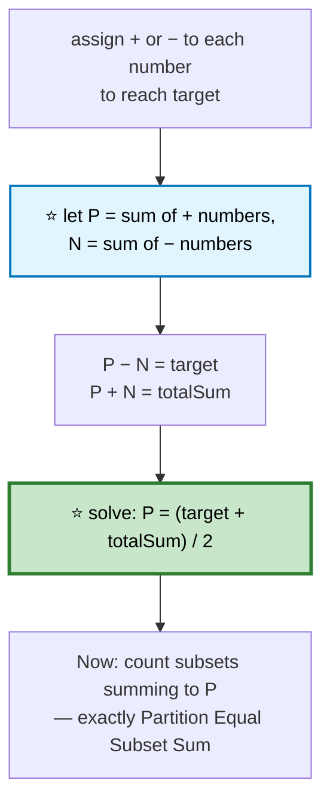
```cpp
int findTargetSumWays(vector<int>& a, int target) {
    int sum = accumulate(a.begin(), a.end(), 0);
    if (abs(target) > sum || (sum + target) % 2) return 0;   // ⚠️ infeasible

    int P = (sum + target) / 2;
    vector<int> dp(P + 1, 0);
    dp[0] = 1;

    for (int x : a)
        for (int w = P; w >= x; --w)
            dp[w] += dp[w - x];
    return dp[P];
}
```
⭐ **Recognizing the algebraic reduction is the entire difficulty** — the DP itself is identical to problem 6.

---

# 8. Longest Increasing Subsequence

🟡 **Medium** · 🔵 Full ladder · ⭐ **O(n²) → O(n log n) via patience sorting**

## 🗺️ Approach Ladder

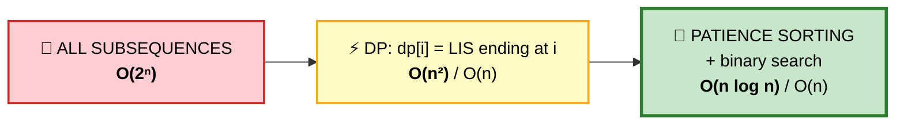

## 2️⃣ dp[i] = LIS ending at index i — O(n²)
```cpp
int lengthOfLIS_On2(vector<int>& a) {
    int n = a.size();
    vector<int> dp(n, 1);
    int best = 1;

    for (int i = 0; i < n; ++i)
        for (int j = 0; j < i; ++j)
            if (a[j] < a[i]) dp[i] = max(dp[i], dp[j] + 1);   // ⭐ extend

    for (int x : dp) best = max(best, x);
    return best;
}
```

## 3️⃣ Patience Sorting — ⭐ OPTIMAL

#### 💬 The idea (not the standard dp[i] table at all)
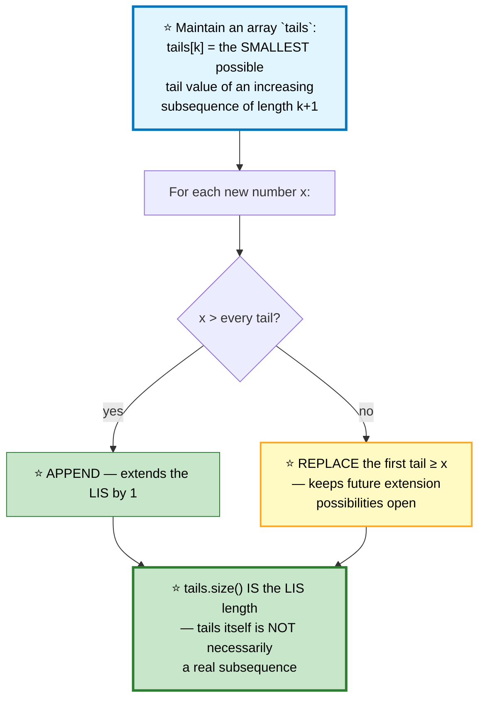

```
   TRACE  [10, 9, 2, 5, 3, 7, 101, 18]

   x=10:  tails=[10]
   x=9:   replace → tails=[9]
   x=2:   replace → tails=[2]
   x=5:   append  → tails=[2,5]
   x=3:   replace 5 → tails=[2,3]     ⭐ 3 keeps more room than 5 did
   x=7:   append  → tails=[2,3,7]
   x=101: append  → tails=[2,3,7,101]
   x=18:  replace 101 → tails=[2,3,7,18]

   ⭐ ANSWER: length 4  (real LIS: [2,3,7,18] or [2,3,7,101])

   ⭐⭐ WHY REPLACING IS SAFE (not cheating)
     tails is not claimed to BE a valid subsequence — only its
     LENGTH matters. Replacing a tail with a smaller value never
     shrinks future potential; it can only help.
```

```cpp
int lengthOfLIS(vector<int>& a) {
    vector<int> tails;
    for (int x : a) {
        auto it = lower_bound(tails.begin(), tails.end(), x);   // ⭐ first ≥ x
        if (it == tails.end()) tails.push_back(x);              // append
        else *it = x;                                          // replace
    }
    return tails.size();
}
```
⭐ **`lower_bound` for strictly increasing; `upper_bound` for non-decreasing.** A one-character change adapts this to the "longest non-decreasing subsequence" variant.

## 📌 Pattern Card
```
SIGNAL   longest increasing/decreasing subsequence
KEY      O(n²): dp[i] extends from any smaller predecessor
         ⭐ O(n log n): tails[] + binary search (patience sorting)
RELATED  Russian Doll Envelopes · Longest Chain of Pairs · Box Stacking
```

---

# 9. Longest Common Subsequence

🟡 **Medium** · 🔵 Full ladder · ⭐ **The 2D grid template**

## 💬 The recurrence

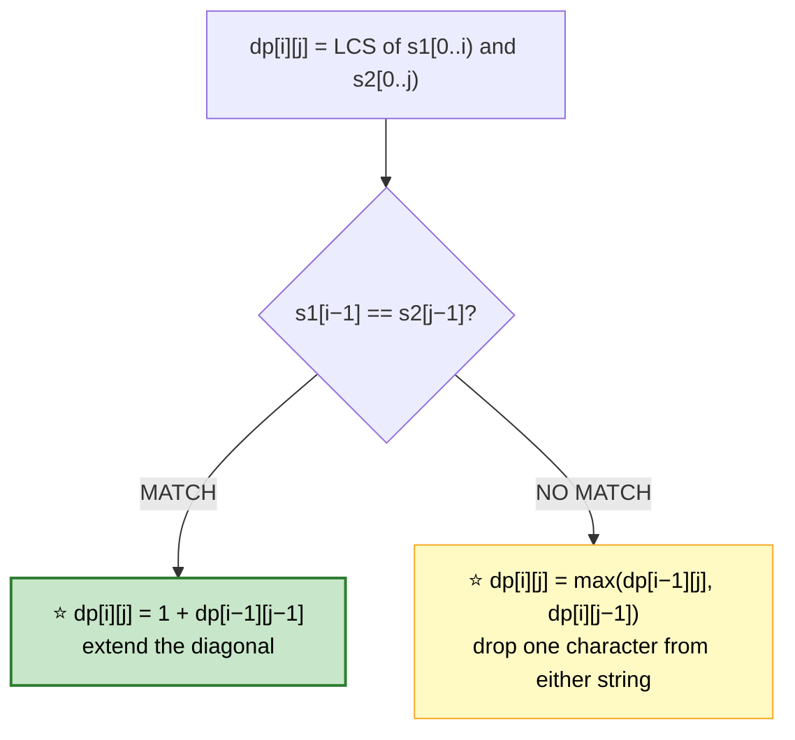

```
   s1 = "abcde"   s2 = "ace"

       ""  a  c  e
   ""   0  0  0  0
   a    0  1  1  1
   b    0  1  1  1
   c    0  1  2  2
   d    0  1  2  2
   e    0  1  2 ⭐3

   ⭐ ANSWER: 3 ("ace")
```

```cpp
int longestCommonSubsequence(string s1, string s2) {
    int n = s1.size(), m = s2.size();
    vector<vector<int>> dp(n + 1, vector<int>(m + 1, 0));

    for (int i = 1; i <= n; ++i)
        for (int j = 1; j <= m; ++j)
            dp[i][j] = (s1[i-1] == s2[j-1])
                     ? 1 + dp[i-1][j-1]
                     : max(dp[i-1][j], dp[i][j-1]);

    return dp[n][m];
}
```

⭐ **This grid is the ancestor of an entire family:** Edit Distance, Longest Palindromic Subsequence, Longest Common Substring, Shortest Common Supersequence, Delete Operation for Two Strings, Distinct Subsequences. Learn this grid once.

## 📌 Pattern Card
```
SIGNAL   compare two sequences, extract shared structure
KEY      dp[i][j]: match → diagonal+1, mismatch → max(up, left)
RELATED  Edit Distance · Longest Palindromic Subsequence
         Longest Common Substring · Shortest Common Supersequence
```

---

# 10. Edit Distance
🔴 ⚪ **Variation of #9** — same grid, three operations instead of two.

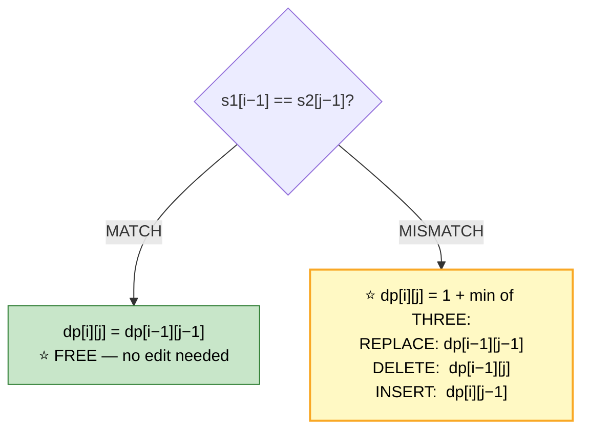
```cpp
int minDistance(string s1, string s2) {
    int n = s1.size(), m = s2.size();
    vector<vector<int>> dp(n + 1, vector<int>(m + 1));

    for (int i = 0; i <= n; ++i) dp[i][0] = i;   // ⭐ delete all of s1
    for (int j = 0; j <= m; ++j) dp[0][j] = j;   // ⭐ insert all of s2

    for (int i = 1; i <= n; ++i)
        for (int j = 1; j <= m; ++j)
            dp[i][j] = (s1[i-1] == s2[j-1])
                     ? dp[i-1][j-1]
                     : 1 + min({dp[i-1][j-1], dp[i-1][j], dp[i][j-1]});

    return dp[n][m];
}
```
⭐ **The three min() terms map directly to the three edits:** diagonal = replace, up = delete from s1, left = insert into s1 (from s2).

---

# 11. Longest Palindromic Subsequence
🟡 ⚪ **Variation of #9** — ⭐ LCS of a string **with its own reverse**.

```cpp
int longestPalindromeSubseq(string s) {
    string r(s.rbegin(), s.rend());
    return longestCommonSubsequence(s, r);      // ⭐ reuse #9 directly
}
```
⭐ **Why this works:** any palindromic subsequence reads the same forwards and backwards, so it's necessarily a common subsequence of `s` and `reverse(s)` — and the converse also holds for the LCS length.

---

# 12. Word Break
🟡 ⚪ **Fully covered** in [Strings #70](01c-arrays-strings.md#70-word-break) — `dp[i]` over prefixes, bounded by the longest dictionary word.

---

# 13. Decode Ways

🟡 **Medium** · 🔵 Full ladder

> `"12"` → `"AB"` or `"L"` → 2 ways. Count decodings of a digit string.

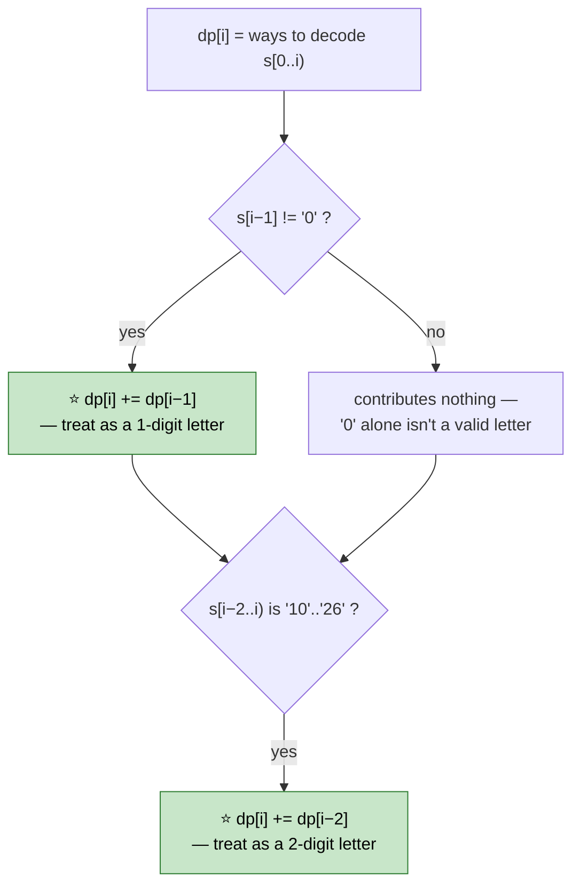

```
   ⚠️ THE TRAP CASES

   "06"  → 0 ways. Leading zero is never valid alone or paired.
   "100" → 0 ways. '0' can't stand alone, and "00" isn't 10-26.
   "230" → 0 ways. '0' needs a valid PRECEDING digit (2 or 1),
           and here the pairing would need "30" which is > 26.
```

```cpp
int numDecodings(string s) {
    int n = s.size();
    if (s[0] == '0') return 0;                  // ⚠️ immediate invalid

    int prev2 = 1, prev1 = 1;                   // dp[0]=1 (empty), dp[1]=1

    for (int i = 2; i <= n; ++i) {
        int cur = 0;
        if (s[i-1] != '0') cur += prev1;         // 1-digit decode
        int two = stoi(s.substr(i-2, 2));
        if (two >= 10 && two <= 26) cur += prev2;   // 2-digit decode

        if (cur == 0) return 0;                  // ⭐ dead end — no valid split
        prev2 = prev1;
        prev1 = cur;
    }
    return prev1;
}
```

---

# 14. Unique Paths I / II

🟡 **Medium** · 🔵 Full ladder · ⭐ **The grid-DP template**

> Top-left to bottom-right, only right/down moves. Count paths.

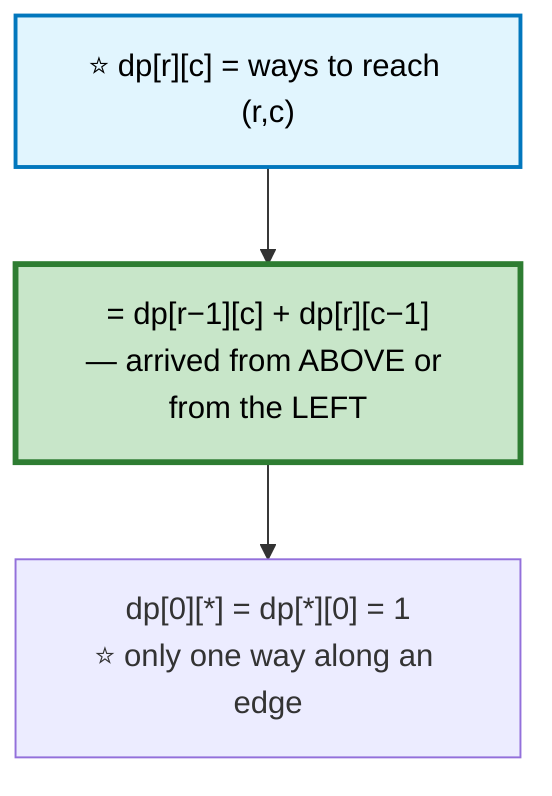

```cpp
int uniquePaths(int R, int C) {
    vector<int> dp(C, 1);                       // ⭐ 1D — top row is all 1s
    for (int r = 1; r < R; ++r)
        for (int c = 1; c < C; ++c)
            dp[c] += dp[c-1];                    // ⭐ dp[c] still holds the row ABOVE
    return dp[C-1];
}
```
⭐ **Rolling to 1D works because `dp[c]` (before update) IS `dp[r-1][c]`**, and `dp[c-1]` (already updated this row) is `dp[r][c-1]`.

## With obstacles
```cpp
int uniquePathsWithObstacles(vector<vector<int>>& g) {
    int R = g.size(), C = g[0].size();
    vector<long long> dp(C, 0);
    dp[0] = (g[0][0] == 0);                      // ⭐ blocked start → 0 paths

    for (int r = 0; r < R; ++r)
        for (int c = 0; c < C; ++c) {
            if (g[r][c] == 1) dp[c] = 0;          // ⭐ obstacle kills this cell
            else if (c > 0) dp[c] += dp[c-1];
        }
    return dp[C-1];
}
```

---

# 15. Minimum Path Sum
🟡 ⚪ **Variation of #14** — same grid, `min` + accumulate instead of counting.

```cpp
int minPathSum(vector<vector<int>>& g) {
    int R = g.size(), C = g[0].size();
    vector<int> dp(C, INT_MAX);
    dp[0] = 0;

    for (int r = 0; r < R; ++r)
        for (int c = 0; c < C; ++c)
            dp[c] = g[r][c] + (c > 0 ? min(dp[c], dp[c-1]) : dp[c]);
    return dp[C-1];
}
```

---

# 16. Maximal Square

🟡 **Medium** · 🔵 Full ladder · ⭐ **min of three neighbors, not sum**

> Largest square of all-1s in a binary matrix.

## 💬 The insight

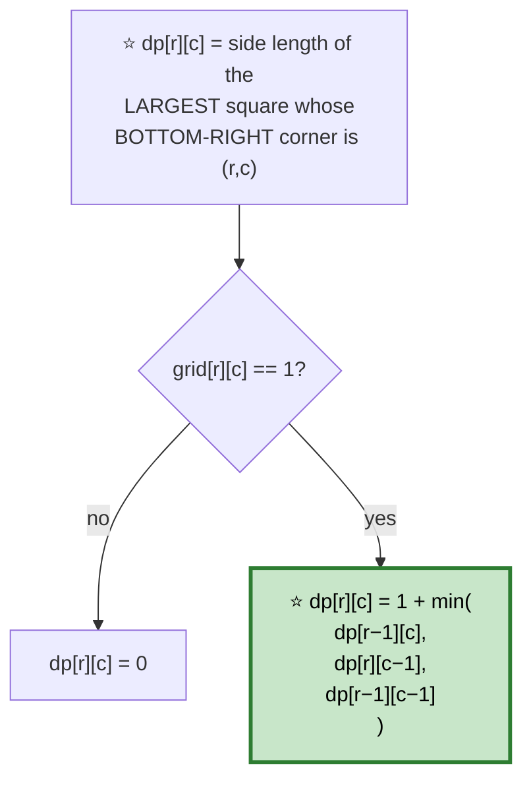

```
   ⭐⭐ WHY THE MIN OF THREE, NOT JUST ONE

   All three neighbors — top, left, and top-left — must
   support a square of side (dp+1) for THIS cell to. If any
   one of them caps out early, the new square is bounded by
   the WEAKEST of the three. That's why it's min, not max.

   VISUAL:
     dp[r-1][c-1]=2   dp[r-1][c]=1
     dp[r][c-1]=3     dp[r][c]=?

   ⭐ min(2,1,3) + 1 = 2 — the top neighbor's smaller square
     is the bottleneck.
```

```cpp
int maximalSquare(vector<vector<char>>& g) {
    int R = g.size(), C = g[0].size(), best = 0;
    vector<vector<int>> dp(R + 1, vector<int>(C + 1, 0));   // ⭐ padded border

    for (int r = 1; r <= R; ++r)
        for (int c = 1; c <= C; ++c)
            if (g[r-1][c-1] == '1') {
                dp[r][c] = 1 + min({dp[r-1][c], dp[r][c-1], dp[r-1][c-1]});
                best = max(best, dp[r][c]);
            }
    return best * best;                          // ⚠️ AREA, not side length
}
```
⭐ **The padded border (`dp` is `(R+1)×(C+1)`)** eliminates boundary checks entirely — row/col 0 are naturally all zeros.

---

# 17. Best Time to Buy/Sell Stock II/III/IV

🔴 **Hard** · 🔵 Full ladder · ⭐ **The state-machine generalization**

## 🗺️ Approach Ladder

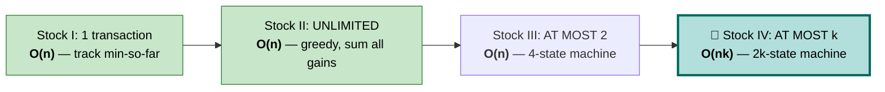

## 💬 The unifying state machine

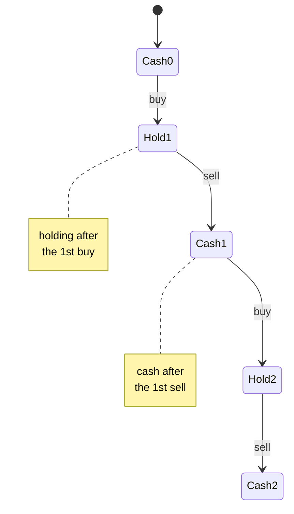

```
   ⭐⭐ THE GENERAL k-TRANSACTION STATE MACHINE

   buy[i]  = max profit after i-th BUY  (currently holding)
   sell[i] = max profit after i-th SELL (currently in cash)

   buy[i]  = max(buy[i],  sell[i-1] - price)   ⭐ buy using the
                                                 previous sell's cash
   sell[i] = max(sell[i], buy[i] + price)      ⭐ sell what we hold

   Process prices LEFT TO RIGHT, updating ALL k states each day.
   ⭐ Answer = sell[k] (the last state is always "in cash").
```

```cpp
int maxProfit(int k, vector<int>& prices) {
    if (prices.empty()) return 0;

    vector<int> buy(k + 1, INT_MIN), sell(k + 1, 0);

    for (int p : prices)
        for (int i = 1; i <= k; ++i) {
            buy[i]  = max(buy[i],  sell[i-1] - p);
            sell[i] = max(sell[i], buy[i] + p);
        }
    return sell[k];
}
```

```
   ⭐ SPECIAL CASES FALL OUT OF THIS GENERAL FORM

   k=1  → Stock I    (a single buy/sell pair)
   k=2  → Stock III  (exactly this code with k=2)
   k=∞  → Stock II   (greedy: sum every positive day-to-day
                       delta — equivalent to unlimited transactions)
```

```cpp
// Stock II — unlimited transactions, the greedy simplification
int maxProfitUnlimited(vector<int>& prices) {
    int profit = 0;
    for (int i = 1; i < (int)prices.size(); ++i)
        if (prices[i] > prices[i-1]) profit += prices[i] - prices[i-1];   // ⭐ capture every uptick
    return profit;
}
```
⭐ **Why the greedy works for unlimited transactions:** any profitable multi-day rise decomposes exactly into its daily deltas — buying and selling every single day you can profit is equivalent to holding through the whole rise.

## 📌 Pattern Card
```
SIGNAL   stock buy/sell with constraints (k transactions, cooldown, fee)
KEY      ⭐ state machine: buy[i]/sell[i] pairs, roll forward day by day
RELATED  Stock with Cooldown · Stock with Transaction Fee
```

---

# 18. Best Time to Buy/Sell Stock with Cooldown
🟡 ⚪ **Variation of #17** — a third state for the enforced wait.

```mermaid
stateDiagram-v2
    [*] --> Rest
    Rest --> Hold: buy
    Hold --> Sold: sell
    Sold --> Rest: cooldown day
    Rest --> Rest: stay

    note right of Sold
        ⭐ MUST pass through
        here before buying again
    end note
```
```cpp
int maxProfit(vector<int>& prices) {
    int hold = INT_MIN, sold = 0, rest = 0;

    for (int p : prices) {
        int prevSold = sold;
        sold = hold + p;                        // ⭐ sell today
        hold = max(hold, rest - p);              // ⭐ buy today (from rest, not sold)
        rest = max(rest, prevSold);              // ⭐ enter cooldown from a past sell
    }
    return max(sold, rest);
}
```
⭐ **`hold` draws from `rest`, never from `sold` directly** — that's what enforces the one-day cooldown after selling.

---

# 19. Longest Common Substring
🟡 ⚪ **Variation of #9** — ⭐ **reset to 0 on a mismatch instead of taking max**.

```cpp
int longestCommonSubstring(string s1, string s2) {
    int n = s1.size(), m = s2.size(), best = 0;
    vector<vector<int>> dp(n + 1, vector<int>(m + 1, 0));

    for (int i = 1; i <= n; ++i)
        for (int j = 1; j <= m; ++j) {
            if (s1[i-1] == s2[j-1]) {
                dp[i][j] = 1 + dp[i-1][j-1];
                best = max(best, dp[i][j]);
            }
            // ⭐ else: dp[i][j] stays 0 — a MISMATCH BREAKS THE RUN.
            //    This single difference from LCS is the whole problem.
        }
    return best;
}
```

---

# 20. Palindrome Partitioning II

🔴 **Hard** · 🔵 Full ladder · ⭐ **Precompute + reduce to a 1D DP**

> Minimum cuts to partition a string into all-palindrome pieces.

```mermaid
flowchart TD
    A["🐌 NAIVE: at each cut point,<br/>check if the piece is a palindrome<br/>by re-scanning it — <b>O(n³)</b>"] --> B["⭐ PRECOMPUTE isPal[i][j]<br/>for EVERY substring first<br/>— O(n²), same table as<br/>Longest Palindromic Substring"]
    B --> C["⭐ THEN a 1D DP:<br/>cuts[i] = min cuts for s[0..i)"]

    style A fill:#ffcdd2,stroke:#c62828,stroke-width:2px,color:#000
    style B fill:#e1f5fe,stroke:#0277bd,stroke-width:2px,color:#000
    style C fill:#c8e6c9,stroke:#2e7d32,stroke-width:3px,color:#000
```

```cpp
int minCut(string s) {
    int n = s.size();

    // ⭐ isPal[i][j]: is s[i..j] a palindrome? Fill by INCREASING length.
    vector<vector<bool>> isPal(n, vector<bool>(n, false));
    for (int i = 0; i < n; ++i) isPal[i][i] = true;

    for (int len = 2; len <= n; ++len)
        for (int i = 0; i + len - 1 < n; ++i) {
            int j = i + len - 1;
            if (s[i] == s[j] && (len == 2 || isPal[i+1][j-1]))
                isPal[i][j] = true;
        }

    // ⭐ cuts[i] = minimum cuts needed for s[0..i)
    vector<int> cuts(n + 1, INT_MAX);
    cuts[0] = -1;                                // ⭐ so a whole-prefix palindrome costs 0

    for (int i = 1; i <= n; ++i)
        for (int j = 0; j < i; ++j)
            if (isPal[j][i-1])                    // s[j..i-1] is a palindrome
                cuts[i] = min(cuts[i], cuts[j] + 1);

    return cuts[n];
}
```
⭐ **`cuts[0] = -1`** is the trick that makes "the whole string is already a palindrome" come out to 0 cuts instead of 1.

---

# 21. Burst Balloons

🔴 **Hard** · 🔵 Full ladder · ⭐ **Think about the LAST balloon, not the first**

> Bursting a balloon earns `left × balloon × right` (the current neighbors). Maximize total.

## ⚠️ Why the obvious order fails

```mermaid
flowchart TD
    A["❌ Bursting FIRST or IN ORDER<br/>changes who the 'neighbors' are<br/>for every future burst"] --> B["⚠️ The subproblems don't stay<br/>independent — bursting balloon i<br/>changes the boundaries for<br/>every other choice"]
    B --> C["⭐ REFRAME: for a range (i, j),<br/>think about which balloon is<br/>burst LAST"]
    C --> D["⭐ If k is burst LAST in (i,j),<br/>its neighbors AT THAT MOMENT<br/>are exactly i and j —<br/>everything between has<br/>already been cleared"]

    style A fill:#ffe0b2,stroke:#ef6c00,stroke-width:2px,color:#000
    style C fill:#e1f5fe,stroke:#0277bd,stroke-width:3px,color:#000
    style D fill:#c8e6c9,stroke:#2e7d32,stroke-width:3px,color:#000
```

```
   ⭐⭐ THE REFRAME IN DETAIL

   dp[i][j] = max coins from bursting everything STRICTLY
              between i and j, leaving i and j themselves
              (padded balloons of value 1) as boundaries.

   For each possible LAST balloon k in (i, j):
     dp[i][j] = max over k of:
        dp[i][k] + dp[k][j] + nums[i]·nums[k]·nums[j]
        ⭐ left subrange   right subrange   k's contribution,
                                            using ORIGINAL
                                            neighbors i, j
                                            (since k is LAST)
```

```
   PADDED  nums = [1, 3, 1, 5, 8, 1]
                    i              j

   dp[i][j] fills by increasing WIDTH (j − i), since wider
   ranges depend on narrower ones.
```

```cpp
int maxCoins(vector<int>& nums) {
    int n = nums.size();
    vector<int> a(n + 2, 1);                     // ⭐ pad both ends with 1
    for (int i = 0; i < n; ++i) a[i + 1] = nums[i];

    vector<vector<int>> dp(n + 2, vector<int>(n + 2, 0));

    for (int len = 2; len <= n + 1; ++len)        // ⭐ increasing WIDTH
        for (int i = 0; i + len <= n + 1; ++i) {
            int j = i + len;
            for (int k = i + 1; k < j; ++k)       // ⭐ try every "burst LAST"
                dp[i][j] = max(dp[i][j],
                    dp[i][k] + dp[k][j] + a[i] * a[k] * a[j]);
        }
    return dp[0][n + 1];
}
```
**O(n³)** — an interval DP with an O(n) split search inside an O(n²) range table.

## 📌 Pattern Card
```
SIGNAL   optimal order of operations where each choice affects
         its NEIGHBORS' future value
KEY      ⭐ think about which element acts LAST in a range, not first
         interval DP, fill by increasing width
RELATED  Matrix Chain Multiplication · Minimum Cost to Merge Stones
```

---

# 22. Matrix Chain Multiplication
🔴 ⚪ **Variation of #21** — same interval-DP shape, ⭐ **think about the split point instead**.

```cpp
int matrixChainOrder(vector<int>& dims) {          // dims[i-1] × dims[i] = matrix i
    int n = dims.size() - 1;
    vector<vector<int>> dp(n + 1, vector<int>(n + 1, 0));

    for (int len = 2; len <= n; ++len)
        for (int i = 1; i + len - 1 <= n; ++i) {
            int j = i + len - 1;
            dp[i][j] = INT_MAX;
            for (int k = i; k < j; ++k) {           // ⭐ try every SPLIT point
                int cost = dp[i][k] + dp[k+1][j] + dims[i-1]*dims[k]*dims[j];
                dp[i][j] = min(dp[i][j], cost);
            }
        }
    return dp[1][n];
}
```
⭐ **The shared shape:** both problems fill an interval table by increasing width and search over an internal index — "last burst" versus "split point" are the same computational pattern wearing different names.

---

# 23. Regular Expression / Wildcard Matching

🔴 **Hard** · 🔵 Full ladder · **2D DP with special handling for `*`**

```mermaid
flowchart TD
    A["dp[i][j] = does s[0..i) match p[0..j)?"] --> B{"p[j−1]"}
    B -->|"a normal char or '?'"| C["⭐ needs s[i−1] to match<br/>dp[i][j] = dp[i−1][j−1] &amp;&amp; matches(s[i-1],p[j-1])"]
    B -->|"'*' (wildcard: any sequence)"| D["⭐ TWO CHOICES:<br/>use * for ZERO chars: dp[i][j−1]<br/>use * for ONE MORE char: dp[i−1][j]"]

    style C fill:#e1f5fe,stroke:#0277bd,stroke-width:2px,color:#000
    style D fill:#c8e6c9,stroke:#2e7d32,stroke-width:3px,color:#000
```

```cpp
// Wildcard Matching — '?' matches any ONE char, '*' matches ANY sequence
bool isMatch(string s, string p) {
    int n = s.size(), m = p.size();
    vector<vector<bool>> dp(n + 1, vector<bool>(m + 1, false));
    dp[0][0] = true;

    for (int j = 1; j <= m; ++j)                 // ⭐ leading '*'s can match empty
        dp[0][j] = dp[0][j-1] && p[j-1] == '*';

    for (int i = 1; i <= n; ++i)
        for (int j = 1; j <= m; ++j) {
            if (p[j-1] == '*')
                dp[i][j] = dp[i][j-1] || dp[i-1][j];   // ⭐ zero-use or extend
            else if (p[j-1] == '?' || p[j-1] == s[i-1])
                dp[i][j] = dp[i-1][j-1];
        }
    return dp[n][m];
}
```

```
   ⭐⭐ REGEX '*' IS DIFFERENT: it means "zero or more of the
     PRECEDING character", not "any sequence"

     "a*"  matches "", "a", "aa", "aaa"...
     "*"   is meaningless alone in regex — always paired

   dp[i][j] when p[j-1] == '*' (referring to p[j-2]):
     ⭐ ZERO occurrences: dp[i][j-2]
     ⭐ ONE MORE occurrence: dp[i-1][j] AND (s[i-1] matches p[j-2])
```

```cpp
// Regular Expression Matching — '*' means "zero or more of the PRECEDING char"
bool isMatchRegex(string s, string p) {
    int n = s.size(), m = p.size();
    vector<vector<bool>> dp(n + 1, vector<bool>(m + 1, false));
    dp[0][0] = true;

    for (int j = 1; j <= m; ++j)
        if (p[j-1] == '*') dp[0][j] = dp[0][j-2];   // ⭐ "x*" can match empty

    for (int i = 1; i <= n; ++i)
        for (int j = 1; j <= m; ++j) {
            if (p[j-1] == '*') {
                dp[i][j] = dp[i][j-2];               // ⭐ zero occurrences
                bool prevMatches = (p[j-2] == '.' || p[j-2] == s[i-1]);
                if (prevMatches) dp[i][j] = dp[i][j] || dp[i-1][j];   // ⭐ one more
            } else if (p[j-1] == '.' || p[j-1] == s[i-1]) {
                dp[i][j] = dp[i-1][j-1];
            }
        }
    return dp[n][m];
}
```
⚠️ **The two `*` semantics are genuinely different problems** wearing the same symbol — conflating wildcard-`*` and regex-`*` is the most common confusion here.

---

# 24. Dungeon Game

🔴 **Hard** · 🔵 Full ladder · ⭐ **DP must run backward from the destination**

> Minimum starting HP to survive top-left to bottom-right, HP must stay ≥ 1 throughout.

## ⚠️ Why forward DP fails

```mermaid
flowchart TD
    A["❌ Forward: 'max HP reachable at<br/>each cell' seems natural"] --> B["⚠️ But the OPTIMAL path to a cell<br/>isn't the one with the highest HP —<br/>a path that dips lower now might<br/>recover better LATER"]
    B --> C["⭐ The decision needs FUTURE<br/>information the forward pass<br/>doesn't have yet"]
    C --> D["⭐ FIX: work BACKWARD from the<br/>destination — dp[r][c] = min HP<br/>NEEDED entering this cell to<br/>survive the REST of the path"]

    style B fill:#ffe0b2,stroke:#ef6c00,stroke-width:2px,color:#000
    style D fill:#c8e6c9,stroke:#2e7d32,stroke-width:3px,color:#000
```

```cpp
int calculateMinimumHP(vector<vector<int>>& d) {
    int R = d.size(), C = d[0].size();
    vector<vector<int>> dp(R + 1, vector<int>(C + 1, INT_MAX));
    dp[R][C-1] = dp[R-1][C] = 1;                 // ⭐ sentinel: need HP 1 past the end

    for (int r = R - 1; r >= 0; --r)              // ⭐ BACKWARD from the destination
        for (int c = C - 1; c >= 0; --c) {
            int need = min(dp[r+1][c], dp[r][c+1]) - d[r][c];
            dp[r][c] = max(1, need);              // ⭐ HP can never be < 1
        }
    return dp[0][0];
}
```
⭐ **`dp[r][c]` means "minimum HP needed BEFORE entering this cell"** — a purely backward-looking quantity, which is why the DP must run in reverse.

---

# 25. Perfect Squares
🟡 ⚪ **Variation of Coin Change** — "coins" are `1², 2², 3², ...`, unbounded knapsack.

```cpp
int numSquares(int n) {
    vector<int> dp(n + 1, INT_MAX);
    dp[0] = 0;

    for (int i = 1; i <= n; ++i)
        for (int j = 1; j * j <= i; ++j)          // ⭐ each perfect square ≤ i
            dp[i] = min(dp[i], dp[i - j*j] + 1);
    return dp[n];
}
```
⭐ **Recognizing "unlimited denominations summing to a target"** immediately maps this onto Coin Change's exact skeleton.

---

# 26. Longest Increasing Path in Matrix

🔴 **Hard** · 🔵 Full ladder · ⭐ **DFS + memoization on an implicit DAG**

## 💬 Why this is a graph problem in disguise

```mermaid
flowchart TD
    A["⭐ Draw an edge from cell A to<br/>neighbor B if B &gt; A"] --> B["⭐ Since values strictly increase<br/>along any edge, this graph has<br/>NO CYCLES — it's a DAG"]
    B --> C["'Longest increasing path' =<br/>'longest path in a DAG'"]
    C --> D["⭐ Longest path in a DAG is solved<br/>by DFS + MEMOIZATION —<br/>no separate topological sort needed,<br/>because the recursion naturally<br/>respects the DAG order"]

    style A fill:#e1f5fe,stroke:#0277bd,stroke-width:2px,color:#000
    style B fill:#fff9c4,stroke:#f9a825,stroke-width:2px,color:#000
    style D fill:#c8e6c9,stroke:#2e7d32,stroke-width:3px,color:#000
```

```cpp
class Solution {
    int R, C;
    vector<vector<int>> memo;
    int dr[4] = {-1,1,0,0}, dc[4] = {0,0,-1,1};

    int dfs(vector<vector<int>>& g, int r, int c) {
        if (memo[r][c]) return memo[r][c];        // ⭐ cached

        int best = 1;                              // a path of just this cell
        for (int d = 0; d < 4; ++d) {
            int nr = r + dr[d], nc = c + dc[d];
            if (nr >= 0 && nr < R && nc >= 0 && nc < C && g[nr][nc] > g[r][c])
                best = max(best, 1 + dfs(g, nr, nc));
        }
        return memo[r][c] = best;
    }

public:
    int longestIncreasingPath(vector<vector<int>>& g) {
        R = g.size(); C = g[0].size();
        memo.assign(R, vector<int>(C, 0));

        int best = 0;
        for (int r = 0; r < R; ++r)
            for (int c = 0; c < C; ++c)
                best = max(best, dfs(g, r, c));
        return best;
    }
};
```
⭐ **No visited array is needed** — the strict `>` comparison guarantees the recursion can never revisit a cell along any single path, since values can only increase.

## 📌 Pattern Card
```
SIGNAL   longest/best path in an implicitly monotonic graph
KEY      ⭐ DFS + memoization; monotonicity guarantees no cycles
RELATED  Word Ladder (unweighted BFS) · Course Schedule (explicit DAG)
```

---

# 27. Maximum Profit in Job Scheduling

🔴 **Hard** · 🔵 Full ladder · ⭐ **Sort + binary search + DP**

> Weighted, non-overlapping interval selection maximizing total profit.

```mermaid
flowchart TD
    A["sort jobs by END time"] --> B["dp[i] = max profit using<br/>jobs 0..i, job i's decision"]
    B --> C{"include job i?"}
    C -->|"skip it"| D["dp[i] = dp[i−1]"]
    C -->|"take it"| E["⭐ dp[i] = profit[i] +<br/>dp[latest job that doesn't overlap]"]
    E --> F["⭐ that latest compatible job is<br/>found via BINARY SEARCH<br/>on the sorted end times"]

    style E fill:#c8e6c9,stroke:#2e7d32,stroke-width:2px,color:#000
    style F fill:#e1f5fe,stroke:#0277bd,stroke-width:3px,color:#000
```

```cpp
int jobScheduling(vector<int>& start, vector<int>& end, vector<int>& profit) {
    int n = start.size();
    vector<int> idx(n);
    iota(idx.begin(), idx.end(), 0);
    sort(idx.begin(), idx.end(), [&](int a, int b){ return end[a] < end[b]; });

    vector<int> ends(n), dp(n + 1, 0);
    for (int i = 0; i < n; ++i) ends[i] = end[idx[i]];

    for (int i = 1; i <= n; ++i) {
        int j = idx[i - 1];
        // ⭐ binary search: latest job ending ≤ start[j]
        int lo = 0, hi = i - 1;
        while (lo < hi) {
            int mid = (lo + hi + 1) / 2;
            if (ends[mid - 1] <= start[j]) lo = mid; else hi = mid - 1;
        }
        int withJob = profit[j] + (ends[lo - 1] <= start[j] && lo > 0 ? dp[lo] : 0);
        dp[i] = max(dp[i - 1], withJob);         // ⭐ take vs skip
    }
    return dp[n];
}
```
⭐ **This is [Non-overlapping Intervals](01b-arrays-strings.md#25-non-overlapping-intervals)'s greedy generalized with weights** — when weights are equal, the DP and the greedy agree; unequal weights are exactly why greedy stops working and DP becomes necessary.

---

# 28. Partition to K Equal Sum Subsets
🟡 ⚪ **Variation** — backtracking with memoized bitmask pruning.

```mermaid
flowchart TD
    A["target = sum / k"] --> B["⭐ backtrack: try adding each<br/>unused number to the current bucket"]
    B --> C{"current bucket<br/>hits target?"}
    C -->|"yes"| D["start a NEW bucket"]
    C -->|"no, still under"| E["keep adding"]
    D --> F["⭐ memoize on the BITMASK of<br/>used numbers — the same mask<br/>never needs re-exploring"]

    style F fill:#c8e6c9,stroke:#2e7d32,stroke-width:3px,color:#000
```

```cpp
bool canPartitionKSubsets(vector<int>& a, int k) {
    int sum = accumulate(a.begin(), a.end(), 0);
    if (sum % k) return false;
    int target = sum / k;

    sort(a.rbegin(), a.rend());                  // ⭐ largest first — prunes faster
    if (a[0] > target) return false;

    vector<int> memo(1 << a.size(), -1);          // ⭐ −1 unknown, 0 fail, 1 success

    function<bool(int,int,int)> bt = [&](int mask, int curSum, int k_left) -> bool {
        if (k_left == 0) return true;
        if (curSum == target) {
            if (memo[mask] != -1) return memo[mask];
            bool res = bt(mask, 0, k_left - 1);   // ⭐ start a fresh bucket
            return memo[mask] = res;
        }
        for (int i = 0; i < (int)a.size(); ++i) {
            if (mask & (1 << i)) continue;
            if (curSum + a[i] > target) continue;
            if (bt(mask | (1 << i), curSum + a[i], k_left)) return true;
        }
        return false;
    };
    return bt(0, 0, k);
}
```
⭐ **Memoizing by bitmask** avoids exploring the same "which numbers are used" state twice, even across different orders of assignment — the key to keeping this tractable for moderate `n`.

---

## 📋 Dynamic Programming Recall

```mermaid
mindmap
  root(("Dynamic<br/>Programming"))
    The Recipe
      ⭐ brute force FIRST
      identify the state
      memoize — you can STOP here
      optional: tabulate, then compress space
    1D Families
      Fibonacci: last move decides
      Knapsack: take-or-skip
      ⭐ 0/1 descending, unbounded ascending
    2D Grid Family
      LCS: match diagonal, else max(up,left)
      Edit Distance: min of 3 operations
      ⭐ substring RESETS on mismatch
      Unique Paths: sum of up + left
    Interval DP
      ⭐ think about what happens LAST
      fill by increasing WIDTH
      Burst Balloons · Matrix Chain
    State Machines
      ⭐ buy[i]/sell[i] roll forward
      cooldown adds a third state
      generalizes k=1,2,...,∞
    Direction Matters
      ⭐ Dungeon Game runs BACKWARD
      forward DP can lack future info
    Graph Disguises
      ⭐ monotonic grid = a DAG
      DFS + memo = longest path
    Beyond O(n²)
      ⭐ LIS → O(n log n) patience sort
      sort + binary search + DP
```

```
╔══════════════════════════════════════════════════════════════════════╗
║              DYNAMIC PROGRAMMING — PATTERN RECALL                    ║
╠══════════════════════════════════════════════════════════════════════╣
║ "count ways to reach n"        → last-move recurrence, roll forward  ║
║ "can't pick adjacent"          → take-or-skip: max(skip, take+val)   ║
║ "subset within a capacity"     → 0/1 knapsack, ⭐ loop DESCENDING     ║
║ "unlimited reuse of items"     → unbounded knapsack, loop ASCENDING  ║
║ "compare two sequences"        → LCS grid: diagonal match, else max  ║
║ "min edits between strings"    → Edit Distance: min of 3 neighbors   ║
║ "longest increasing subseq"    → ⭐ O(n log n) tails[] + lower_bound  ║
║ "largest square/rectangle"     → min of 3 neighbors + 1              ║
║ "stock with k transactions"    → ⭐ buy[i]/sell[i] state machine      ║
║ "order of ops affects value"   → ⭐ interval DP: think what's LAST    ║
║ "path needs future context"    → ⭐ run the DP BACKWARD               ║
║ "path in a strictly monotonic grid" → DFS + memo, no visited array   ║
╠══════════════════════════════════════════════════════════════════════╣
║ ⚠️ TRAPS                                                              ║
║   0/1 vs unbounded knapsack: wrong loop direction silently swaps them║
║   coin change II: coin-outer counts combos, amount-outer counts perms║
║   decode ways: "0" alone is invalid, and needs a valid predecessor   ║
║   maximal square: answer is side² (area), not the side length        ║
║   regex '*' means "zero+ of PRECEDING char" — NOT wildcard '*'       ║
║   burst balloons: pad both ends with virtual 1-value balloons        ║
╚══════════════════════════════════════════════════════════════════════╝
```

---

**Next:** [Greedy, Backtracking & Misc →](10-greedy-backtracking-misc.md) · **Back:** [Graphs](08-graphs.md)
