# 🎯 Greedy, Backtracking, Bits & Math

> Three mindsets. **Greedy** commits immediately and never looks back. **Backtracking** tries everything but abandons dead ends early. **Bit tricks** exploit binary structure. Knowing which one applies is most of the battle.

**Prerequisite:** [Patterns & Foundations](00-patterns.md) · **Format:** [see the sample](FORMAT-SAMPLE.md)

---

## 🧠 Greedy: Proving It's Safe

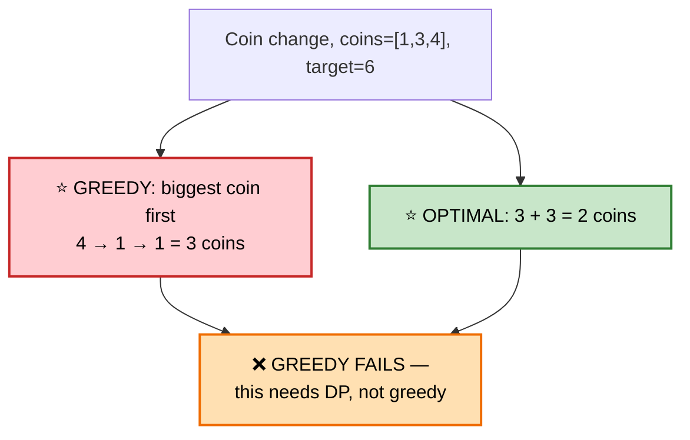

The real skill isn't writing greedy code — it's **proving greedy is safe** before committing to it.

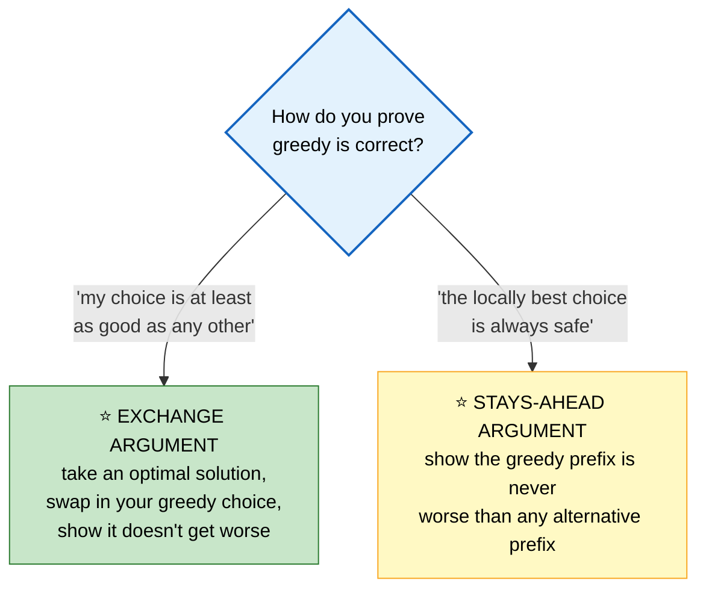

⭐ **You've already seen both proofs in this library:** the exchange argument for [Non-overlapping Intervals](01b-arrays-strings.md#25-non-overlapping-intervals) (sort by end time) and the stays-ahead argument for [IPO](07-heaps-intervals.md#10-ipo--maximize-capital) (capital only grows).

---

## 🧠 Backtracking: The Universal Skeleton

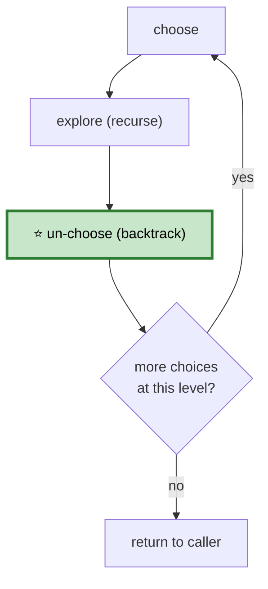

```cpp
void backtrack(State& state, vector<Result>& results) {
    if (isComplete(state)) { results.push_back(state.snapshot()); return; }

    for (auto& choice : choicesAt(state)) {
        if (!isValid(choice, state)) continue;   // ⭐ PRUNE — the whole speedup

        state.apply(choice);                     // choose
        backtrack(state, results);               // explore
        state.undo(choice);                      // ⭐ un-choose
    }
}
```

⭐ **Pruning early is the entire performance story.** Backtracking without pruning is just brute force with extra steps; a good `isValid` check turns exponential into merely large.

---

## 📑 Contents

| # | Problem | Diff | Type | Optimal |
|---|---|---|---|---|
| [1](#1-jump-game-i) | Jump Game I | 🟡 | 🔵 **Full** | O(n) greedy reach |
| [2](#2-gas-station) | Gas Station | 🟡 | 🔵 **Full** | ⭐ total ≥ 0 guarantees a start |
| [3](#3-candy) | Candy | 🔴 | 🔵 **Full** | two-pass greedy |
| [4](#4-permutations) | Permutations | 🟡 | 🔵 **Full** | ⭐ the backtrack template |
| [5](#5-permutations-ii-with-duplicates) | Permutations II | 🟡 | ⚪ Variation | sort + skip-equal pruning |
| [6](#6-combinations--combination-sum) | Combinations / Combination Sum | 🟡 | 🔵 **Full** | start-index pruning |
| [7](#7-subsets--subsets-ii) | Subsets / Subsets II | 🟡 | 🔵 **Full** | ⭐ include/exclude tree |
| [8](#8-n-queens) | N-Queens | 🔴 | 🔵 **Full** | ⭐ O(1) column/diagonal checks |
| [9](#9-sudoku-solver) | Sudoku Solver | 🔴 | ⚪ Variation | bitmask constraint checks |
| [10](#10-palindrome-partitioning) | Palindrome Partitioning | 🟡 | ⚪ Variation | backtrack + palindrome check |
| [11](#11-word-search) | Word Search | 🟡 | ⚪ Variation | grid DFS + backtrack |
| [12](#12-generate-parentheses) | Generate Parentheses | 🟡 | 🔵 **Full** | ⭐ constrained backtracking |
| [13](#13-single-number-i-ii-iii) | Single Number I / II / III | 🟢 | 🔵 **Full** | ⭐ XOR family |
| [14](#14-number-of-1-bits--counting-bits) | Number of 1 Bits / Counting Bits | 🟢 | 🔵 **Full** | ⭐ n & (n-1) |
| [15](#15-sum-of-two-integers-no--or--) | Sum of Two Integers (no +/-) | 🟡 | 🔵 **Full** | XOR + carry via AND |
| [16](#16-missing-number--bit-tricks) | Missing Number | 🟢 | ⚪ Variation | XOR everything |
| [17](#17-reverse-bits) | Reverse Bits | 🟢 | ⚪ Variation | bit-by-bit swap |
| [18](#18-power-of-two--power-of-four) | Power of Two / Four | 🟢 | ⚪ Variation | `n & (n-1) == 0` |
| [19](#19-pow-x-n) | Pow(x, n) | 🟡 | 🔵 **Full** | ⭐ fast exponentiation |
| [20](#20-sqrt-x-and-newtons-method) | Sqrt(x) | 🟢 | ⚪ Variation | binary search or Newton's |
| [21](#21-gcd--lcm--extended-euclid) | GCD / LCM | 🟢 | 🔵 **Full** | Euclid's algorithm |
| [22](#22-count-primes-sieve-of-eratosthenes) | Count Primes (Sieve) | 🟡 | 🔵 **Full** | O(n log log n) |
| [23](#23-random-pick-with-weight--reservoir-sampling) | Random Pick / Reservoir Sampling | 🟡 | 🔵 **Full** | prefix sums + binary search |
| [24](#24-majority-element) | Majority Element | 🟢 | 🔵 **Full** | ⭐ Boyer-Moore voting |
| [25](#25-meeting-rooms-max-events--misc-greedy) | Max Events / Misc Greedy | 🟡 | ⚪ Variation | heap-based greedy |

---

# 1. Jump Game I

🟡 **Medium** · 🔵 Full ladder · **The greedy proof, stated cleanly**

> Can you reach the last index? `a[i]` = max jump from index `i`.

## 🗺️ Approach Ladder

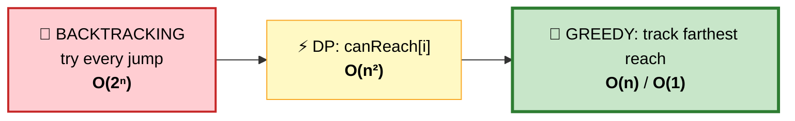

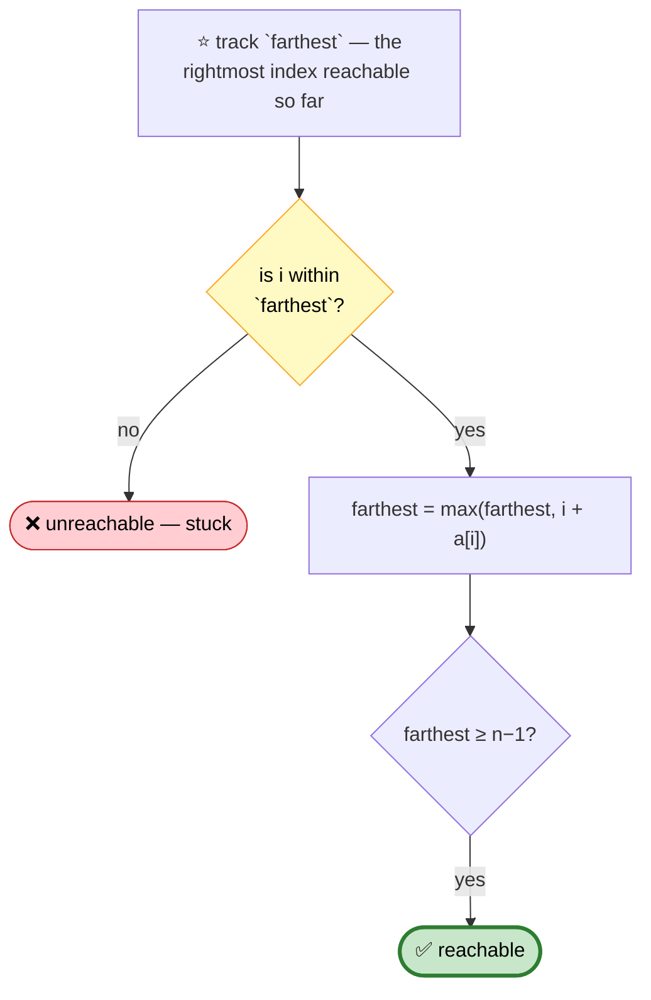

```cpp
bool canJump(vector<int>& a) {
    int farthest = 0;
    for (int i = 0; i < (int)a.size(); ++i) {
        if (i > farthest) return false;         // ⭐ this index is unreachable
        farthest = max(farthest, i + a[i]);
    }
    return true;
}
```
⭐ **You never need to know WHICH path reaches the end** — only that some jump sequence does, which the single `farthest` frontier captures completely.

---

# 2. Gas Station

🟡 **Medium** · 🔵 Full ladder · ⭐ **A one-line correctness proof**

> Circular route of gas stations. Find a starting station that completes the loop, or report impossible.

## 💬 The two-part insight

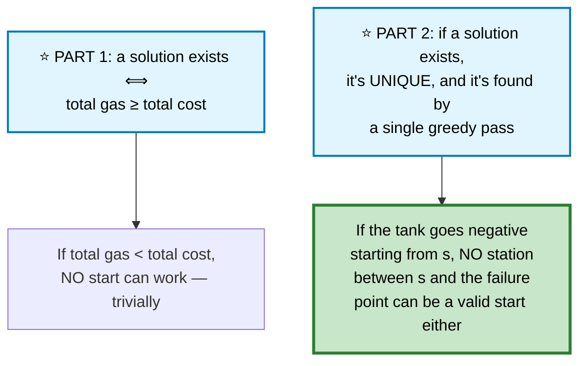

```
   ⭐⭐ WHY FAILING AT STATION f MEANS SKIPPING TO f+1 IS SAFE

   Suppose starting at s, the tank first goes negative at f.
   That means the SUM from s to f is negative.

   For any station m between s and f: the sum from s to m is
   ≥ 0 (else we'd have failed earlier at m). So the sum from
   m to f = (sum s to f) − (sum s to m) ≤ (negative) − (≥0),
   which is even MORE negative.

   ⭐ So m ALSO fails by the time it reaches f. No station
     between s and f can be the answer — safe to jump
     straight to f+1 and never revisit s..f. ∎
```

```cpp
int canCompleteCircuit(vector<int>& gas, vector<int>& cost) {
    int total = 0, tank = 0, start = 0;

    for (int i = 0; i < (int)gas.size(); ++i) {
        int diff = gas[i] - cost[i];
        total += diff;
        tank += diff;

        if (tank < 0) {                          // ⭐ this start (and everything
            start = i + 1;                       //    since the last reset) fails
            tank = 0;
        }
    }
    return total >= 0 ? start : -1;              // ⭐ Part 1's check
}
```

⭐ **One pass answers both "does a solution exist" and "where is it."** No separate feasibility check needed — `total >= 0` at the end tells you.

## 📌 Pattern Card
```
SIGNAL   circular sequence, find a valid starting point
KEY      ⭐ if a prefix sum goes negative, EVERY station in that
         prefix fails too — jump past all of them at once
RELATED  Non-overlapping Intervals · Candy · Jump Game
```

---

# 3. Candy

🔴 **Hard** · 🔵 Full ladder · ⭐ **Two one-directional passes**

> Each child gets ≥1 candy. A child with a higher rating than a neighbor gets more candy than that neighbor. Minimize total.

## ⚠️ Why one pass isn't enough

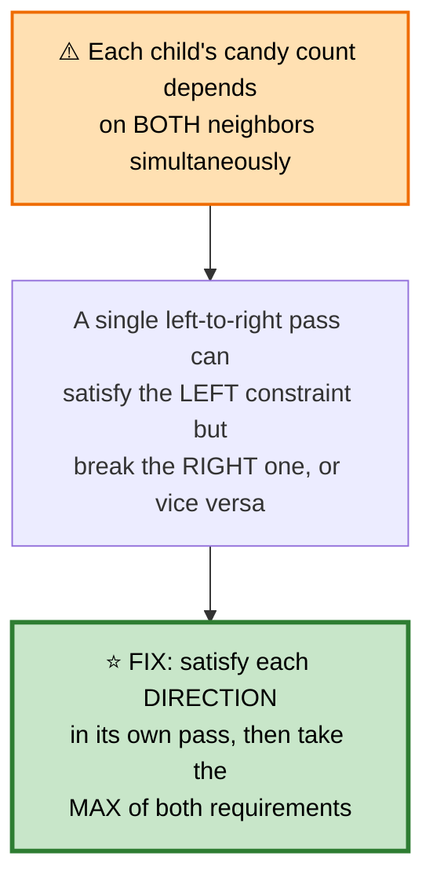

```
   ratings:  1  3  4  5  2

   LEFT PASS  (only checks: am I > my LEFT neighbor?)
   candies:   1  2  3  4  1

   RIGHT PASS (only checks: am I > my RIGHT neighbor?)
   candies:   1  1  1  2  1

   ⭐ TAKE THE MAX, position by position:
   final:     1  2  3  4  1
                          ▲
              ⭐ untouched by the right pass since 2 &lt; 4
                already satisfies "more than the right neighbor"
```

```cpp
int candy(vector<int>& ratings) {
    int n = ratings.size();
    vector<int> candies(n, 1);

    for (int i = 1; i < n; ++i)                  // ⭐ LEFT-TO-RIGHT pass
        if (ratings[i] > ratings[i-1])
            candies[i] = candies[i-1] + 1;

    for (int i = n - 2; i >= 0; --i)              // ⭐ RIGHT-TO-LEFT pass
        if (ratings[i] > ratings[i+1])
            candies[i] = max(candies[i], candies[i+1] + 1);   // ⭐ MAX, not overwrite

    return accumulate(candies.begin(), candies.end(), 0);
}
```
⚠️ **`max`, not a plain assignment, in the second pass.** Overwriting would silently discard the left pass's guarantee.

---

# 4. Permutations

🟡 **Medium** · 🔵 Full ladder · ⭐ **The canonical backtracking template**

## 💬 The choose / explore / un-choose skeleton, made concrete

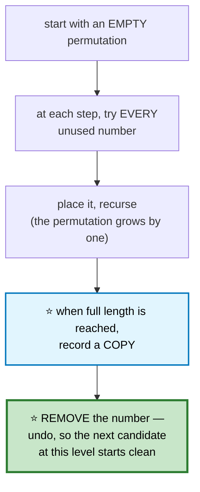

```
   TRACE  nums = [1,2,3], partial recursion tree

   []
   ├─ [1]
   │  ├─ [1,2]
   │  │  └─ [1,2,3] ⭐ RECORD
   │  └─ [1,3]
   │     └─ [1,3,2] ⭐ RECORD
   ├─ [2] ...
   └─ [3] ...

   ⭐ "used" is TRACKED, not recomputed — an O(1) boolean array
     beats scanning the current permutation for membership.
```

```cpp
class Solution {
    vector<vector<int>> out;
    vector<int> path;
    vector<bool> used;

    void backtrack(vector<int>& nums) {
        if (path.size() == nums.size()) { out.push_back(path); return; }   // ⭐ COPY

        for (int i = 0; i < (int)nums.size(); ++i) {
            if (used[i]) continue;               // ⭐ PRUNE

            used[i] = true;
            path.push_back(nums[i]);              // choose

            backtrack(nums);                      // explore

            path.pop_back();                      // ⭐ un-choose
            used[i] = false;
        }
    }

public:
    vector<vector<int>> permute(vector<int>& nums) {
        used.assign(nums.size(), false);
        backtrack(nums);
        return out;
    }
};
```

⚠️ **`out.push_back(path)` copies the vector** — pushing a reference would leave every stored "permutation" pointing at the same, later-mutated buffer.

## 📌 Pattern Card
```
SIGNAL   generate all orderings/arrangements
KEY      choose → recurse → ⭐ UNDO; track "used" as O(1) state
RELATED  Permutations II · N-Queens · Combinations · Subsets
```

---

# 5. Permutations II (with Duplicates)
🟡 ⚪ **Variation of #4** — ⭐ **sort first, then skip equal values at the same recursion level**.

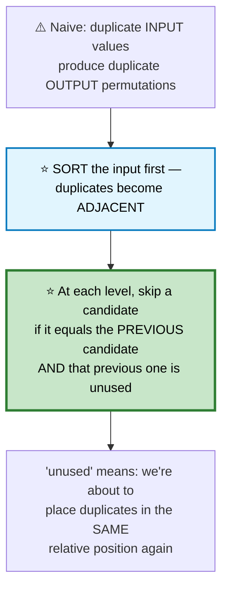

```cpp
void backtrack(vector<int>& nums, vector<bool>& used,
              vector<int>& path, vector<vector<int>>& out) {
    if (path.size() == nums.size()) { out.push_back(path); return; }

    for (int i = 0; i < (int)nums.size(); ++i) {
        if (used[i]) continue;

        // ⭐⭐ the dedup guard — nums MUST be sorted for this to work
        if (i > 0 && nums[i] == nums[i-1] && !used[i-1]) continue;

        used[i] = true;
        path.push_back(nums[i]);
        backtrack(nums, used, path, out);
        path.pop_back();
        used[i] = false;
    }
}
// caller: sort(nums.begin(), nums.end()) BEFORE the first call
```

```
   ⭐⭐ WHY `!used[i-1]` SPECIFICALLY (not `used[i-1]`)

   `!used[i-1]` means: the previous duplicate is currently
   AVAILABLE but we're skipping it in favor of this one.
   That would produce the exact same permutation as choosing
   the previous one first — so it's redundant.

   `used[i-1]` means the previous duplicate is ALREADY placed
   earlier in this path — that's fine, it's a DIFFERENT
   permutation (using a different copy in a different slot).
```

---

# 6. Combinations / Combination Sum

🟡 **Medium** · 🔵 Full ladder · ⭐ **Start-index pruning avoids order duplicates**

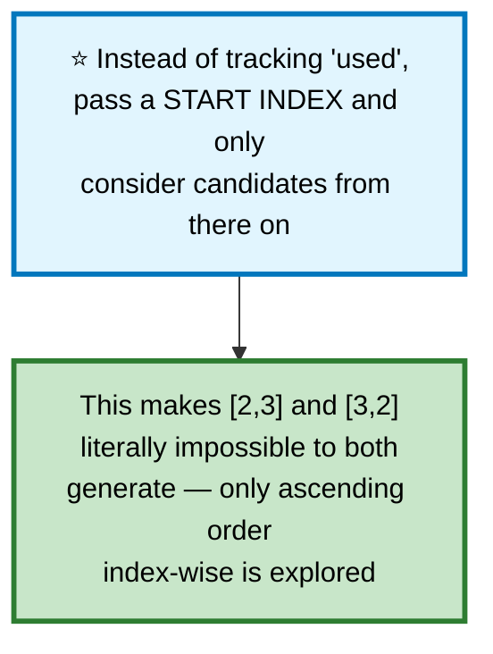

```cpp
// Combinations — choose k from 1..n
void backtrack(int start, int n, int k, vector<int>& path, vector<vector<int>>& out) {
    if ((int)path.size() == k) { out.push_back(path); return; }

    // ⭐ PRUNE: if even taking every remaining number can't reach k, stop
    for (int i = start; i <= n - (k - (int)path.size()) + 1; ++i) {
        path.push_back(i);
        backtrack(i + 1, n, k, path, out);       // ⭐ i+1 — never revisit
        path.pop_back();
    }
}

// Combination Sum — numbers REUSABLE
void backtrack(vector<int>& c, int target, int start,
              vector<int>& path, vector<vector<int>>& out) {
    if (target == 0) { out.push_back(path); return; }
    if (target < 0) return;                      // ⭐ prune — overshot

    for (int i = start; i < (int)c.size(); ++i) {
        path.push_back(c[i]);
        backtrack(c, target - c[i], i, path, out);   // ⭐ i, NOT i+1 — reuse allowed
        path.pop_back();
    }
}
```
⭐ **The single difference between "combinations" and "combination sum with reuse"** is `i+1` versus `i` in the recursive call — everything else is identical.

---

# 7. Subsets / Subsets II

🟡 **Medium** · 🔵 Full ladder · ⭐ **Every node in the recursion tree IS an answer**

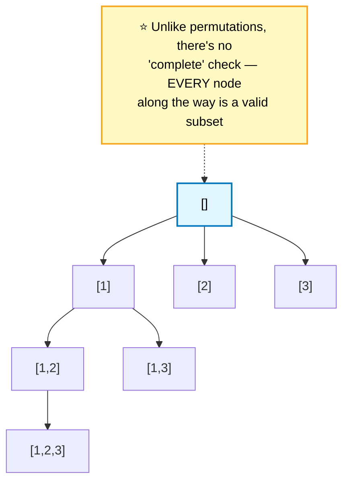

```cpp
void backtrack(vector<int>& nums, int start, vector<int>& path,
              vector<vector<int>>& out) {
    out.push_back(path);                          // ⭐ record at EVERY node

    for (int i = start; i < (int)nums.size(); ++i) {
        path.push_back(nums[i]);
        backtrack(nums, i + 1, path, out);
        path.pop_back();
    }
}
```

## Subsets II — with duplicates
```cpp
void backtrack(vector<int>& nums, int start, vector<int>& path,
              vector<vector<int>>& out) {
    out.push_back(path);

    for (int i = start; i < (int)nums.size(); ++i) {
        if (i > start && nums[i] == nums[i-1]) continue;   // ⭐ same dedup idea as #5
        path.push_back(nums[i]);
        backtrack(nums, i + 1, path, out);
        path.pop_back();
    }
}
// caller: sort(nums) first
```
⭐ **`i > start` (not `i > 0`)** is the key difference from Permutations II's dedup check — here, duplicates ARE allowed across different recursion levels, just not as two different choices at the SAME level.

## 🔁 The bitmask alternative — worth knowing
```cpp
vector<vector<int>> subsets(vector<int>& nums) {
    int n = nums.size();
    vector<vector<int>> out;
    for (int mask = 0; mask < (1 << n); ++mask) {   // ⭐ every subset = a bitmask
        vector<int> subset;
        for (int i = 0; i < n; ++i)
            if (mask & (1 << i)) subset.push_back(nums[i]);
        out.push_back(subset);
    }
    return out;
}
```
⭐ **"Generate all subsets" without duplicates is equivalent to counting from `0` to `2ⁿ-1`** — each bit says whether that element is included.

## 📌 Pattern Card
```
SIGNAL   generate all subsets/combinations
KEY      ⭐ start-index recursion prevents order duplicates
         subsets record at EVERY node; combos only at completion
RELATED  Combination Sum · Letter Combinations · Palindrome Partitioning
```

---

# 8. N-Queens

🔴 **Hard** · 🔵 Full ladder · ⭐ **O(1) conflict checks via diagonal ids**

> Place n queens on an n×n board, no two attacking.

## 💬 The insight: encode diagonals as sums and differences

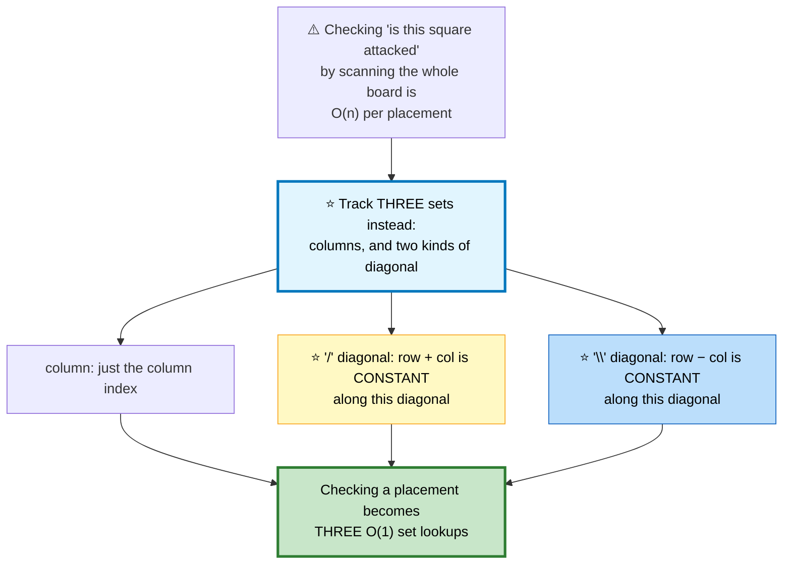

```
   WHY row+col AND row−col IDENTIFY DIAGONALS

   (0,0) (0,1) (0,2)          row+col:  0  1  2
   (1,0) (1,1) (1,2)                    1  2  3
   (2,0) (2,1) (2,2)                    2  3  4

   ⭐ Every cell on the SAME "\" diagonal shares row+col.

   row−col:  0  -1  -2
             1   0  -1
             2   1   0

   ⭐ Every cell on the SAME "/" diagonal shares row−col.
```

```cpp
class Solution {
    int n;
    vector<vector<string>> out;
    vector<int> queenCol;                         // queenCol[row] = column used
    unordered_set<int> cols, diag1, diag2;         // ⭐ O(1) conflict checks

    void backtrack(int row) {
        if (row == n) {
            vector<string> board(n, string(n, '.'));
            for (int r = 0; r < n; ++r) board[r][queenCol[r]] = 'Q';
            out.push_back(board);
            return;
        }

        for (int col = 0; col < n; ++col) {
            int d1 = row + col, d2 = row - col;
            if (cols.count(col) || diag1.count(d1) || diag2.count(d2)) continue;   // ⭐ PRUNE

            cols.insert(col); diag1.insert(d1); diag2.insert(d2);
            queenCol[row] = col;

            backtrack(row + 1);

            cols.erase(col); diag1.erase(d1); diag2.erase(d2);   // ⭐ un-choose
        }
    }

public:
    vector<vector<string>> solveNQueens(int N) {
        n = N;
        queenCol.assign(n, 0);
        backtrack(0);
        return out;
    }
};
```

⭐ **Placing one queen per row by construction** eliminates the row-conflict check entirely — you never need to ask "is this row already used."

🎤 **Follow-up: just count solutions (N-Queens II)?** Same code, drop the board construction — often solved even faster with bitmasks representing the "available columns" as a single integer and using `lowbit` tricks to enumerate placements.

## 📌 Pattern Card
```
SIGNAL   placement puzzles with pairwise conflict constraints
KEY      ⭐ encode each conflict TYPE as its own set for O(1) checks
         diagonals: row+col and row−col are each constant
RELATED  Sudoku Solver · N-Queens II
```

---

# 9. Sudoku Solver
🔴 ⚪ **Variation of #8** — same backtracking shape, three constraint types instead of three diagonal types.

```cpp
class Solution {
    bool rows[9][10] = {}, cols[9][10] = {}, boxes[9][10] = {};

    bool solve(vector<vector<char>>& b, int r, int c) {
        if (r == 9) return true;                  // ⭐ filled everything
        if (c == 9) return solve(b, r + 1, 0);     // ⭐ wrap to the next row

        if (b[r][c] != '.') return solve(b, r, c + 1);   // pre-filled, skip

        int box = (r / 3) * 3 + c / 3;
        for (int d = 1; d <= 9; ++d) {
            if (rows[r][d] || cols[c][d] || boxes[box][d]) continue;   // ⭐ PRUNE

            rows[r][d] = cols[c][d] = boxes[box][d] = true;
            b[r][c] = '0' + d;

            if (solve(b, r, c + 1)) return true;   // ⭐ propagate success upward

            rows[r][d] = cols[c][d] = boxes[box][d] = false;   // un-choose
            b[r][c] = '.';
        }
        return false;                              // ⭐ no digit works → backtrack further
    }

public:
    void solveSudoku(vector<vector<char>>& b) {
        for (int r = 0; r < 9; ++r)
            for (int c = 0; c < 9; ++c)
                if (b[r][c] != '.') {
                    int d = b[r][c] - '0', box = (r / 3) * 3 + c / 3;
                    rows[r][d] = cols[c][d] = boxes[box][d] = true;
                }
        solve(b, 0, 0);
    }
};
```
⭐ **`box = (r/3)*3 + c/3` maps any cell to its 3×3 block index (0–8)** — one integer formula replaces nested box-boundary arithmetic.

---

# 10. Palindrome Partitioning
🟡 ⚪ **Variation of #6/#7's start-index skeleton** — the constraint is "each piece is a palindrome."

```cpp
void backtrack(string& s, int start, vector<string>& path, vector<vector<string>>& out) {
    if (start == (int)s.size()) { out.push_back(path); return; }

    for (int end = start; end < (int)s.size(); ++end) {
        if (!isPalindrome(s, start, end)) continue;   // ⭐ PRUNE non-palindromes

        path.push_back(s.substr(start, end - start + 1));
        backtrack(s, end + 1, path, out);
        path.pop_back();
    }
}
```
🎤 **Follow-up: minimum cuts, not all partitions?** That's a different problem — [Palindrome Partitioning II](09-dynamic-programming.md#20-palindrome-partitioning-ii), solved with DP, because "minimum" wants an optimum, not an enumeration.

---

# 11. Word Search
🟡 ⚪ **Variation** — grid DFS with in-place marking, exactly like [Number of Islands](08-graphs.md#1-number-of-islands) but with a target string.

```cpp
bool dfs(vector<vector<char>>& b, string& word, int r, int c, int idx) {
    if (idx == (int)word.size()) return true;    // ⭐ matched the whole word
    if (r < 0 || r >= (int)b.size() || c < 0 || c >= (int)b[0].size()
        || b[r][c] != word[idx]) return false;

    char tmp = b[r][c];
    b[r][c] = '#';                                // ⭐ mark — can't reuse a cell

    bool found = dfs(b,word,r-1,c,idx+1) || dfs(b,word,r+1,c,idx+1)
              || dfs(b,word,r,c-1,idx+1) || dfs(b,word,r,c+1,idx+1);

    b[r][c] = tmp;                                // ⭐⭐ RESTORE — this path failed,
                                                  //    the cell is reusable elsewhere
    return found;
}
```
⚠️ **The restore is essential here**, unlike flood fill — a cell used on one attempted path must be available again for a different starting cell's search.

---

# 12. Generate Parentheses

🟡 **Medium** · 🔵 Full ladder · ⭐ **Backtracking constrained by two counters**

> All combinations of n pairs of well-formed parentheses.

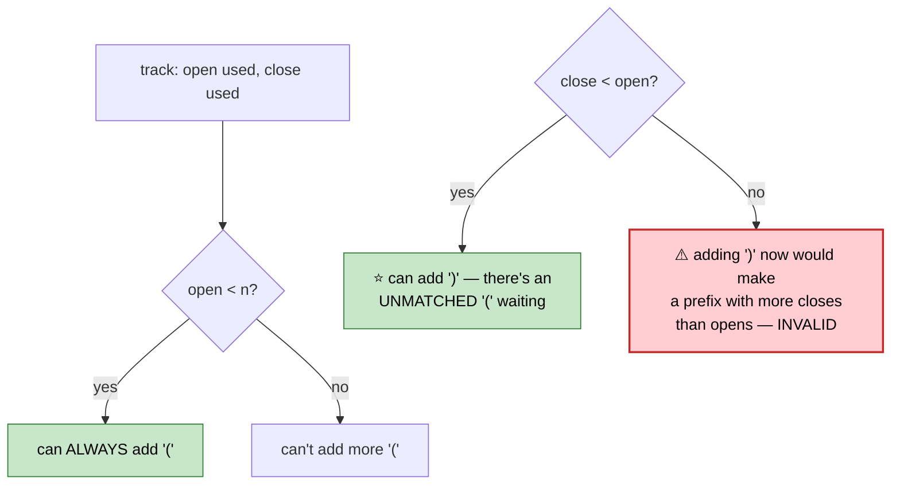

```cpp
void backtrack(int n, int open, int close, string& path, vector<string>& out) {
    if ((int)path.size() == 2 * n) { out.push_back(path); return; }

    if (open < n) {                               // ⭐ always legal to open more
        path.push_back('(');
        backtrack(n, open + 1, close, path, out);
        path.pop_back();
    }
    if (close < open) {                            // ⭐⭐ the ENTIRE validity constraint
        path.push_back(')');
        backtrack(n, open, close + 1, path, out);
        path.pop_back();
    }
}
```
⭐ **`close < open` alone guarantees every generated string is valid** — no post-hoc validation is ever needed, because an invalid state is simply never reachable.

## 📌 Pattern Card
```
SIGNAL   generate all valid sequences under a structural constraint
KEY      ⭐ encode the constraint directly in the branching condition
         so invalid states are unreachable, not filtered out after
RELATED  Remove Invalid Parentheses · Letter Combinations of a Phone Number
```

---

# 13. Single Number I / II / III

🟢 **Easy to state, ⭐ each variant needs a different XOR trick**

## I — every number appears twice except one
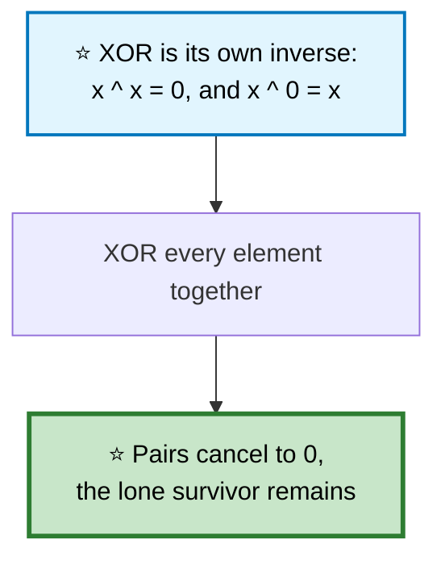
```cpp
int singleNumber(vector<int>& a) {
    int x = 0;
    for (int v : a) x ^= v;                       // ⭐ pairs cancel
    return x;
}
```

## II — every number appears THREE times except one
```
   ⭐⭐ XOR alone can't help — three copies don't cancel to 0.

   Track bits appearing exactly ONCE and TWICE, using ANOTHER
   pair of bitwise tricks (ones/twos rotate through states):

     ones  = bits seen exactly 1 time (mod 3)
     twos  = bits seen exactly 2 times (mod 3)

   When a bit is seen a 3rd time, both reset to 0 — simulating
   a base-3 counter using only bitwise ops.
```
```cpp
int singleNumber(vector<int>& a) {
    int ones = 0, twos = 0;
    for (int x : a) {
        ones = (ones ^ x) & ~twos;                 // ⭐ add x to "seen once" unless
                                                   //    it's already at "seen twice"
        twos = (twos ^ x) & ~ones;                 // ⭐ mirror logic
    }
    return ones;
}
```

## III — TWO numbers each appear once, rest appear twice
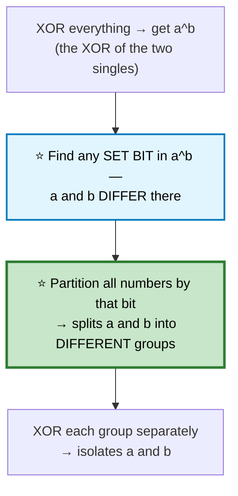
```cpp
vector<int> singleNumberIII(vector<int>& a) {
    int xorAll = 0;
    for (int x : a) xorAll ^= x;

    int diffBit = xorAll & (-xorAll);              // ⭐ isolates the LOWEST set bit

    int a1 = 0, a2 = 0;
    for (int x : a)
        (x & diffBit) ? a1 ^= x : a2 ^= x;          // ⭐ partition by that bit
    return {a1, a2};
}
```
⭐ **`x & (-x)` isolating the lowest set bit** is the same trick used in Fenwick trees ([Trees #20](06-trees.md#20-segment-tree--fenwick-tree)).

## 📌 Pattern Card
```
SIGNAL   find unique element(s) among duplicates, O(1) space
KEY      appears 2×: XOR all · appears 3×: bit-counting state machine
         two unique: partition by a differing bit
RELATED  Missing Number · Find the Duplicate Number
```

---

# 14. Number of 1 Bits / Counting Bits

🟢 **Easy** · 🔵 Full ladder · ⭐ **`n & (n-1)` clears the lowest set bit**

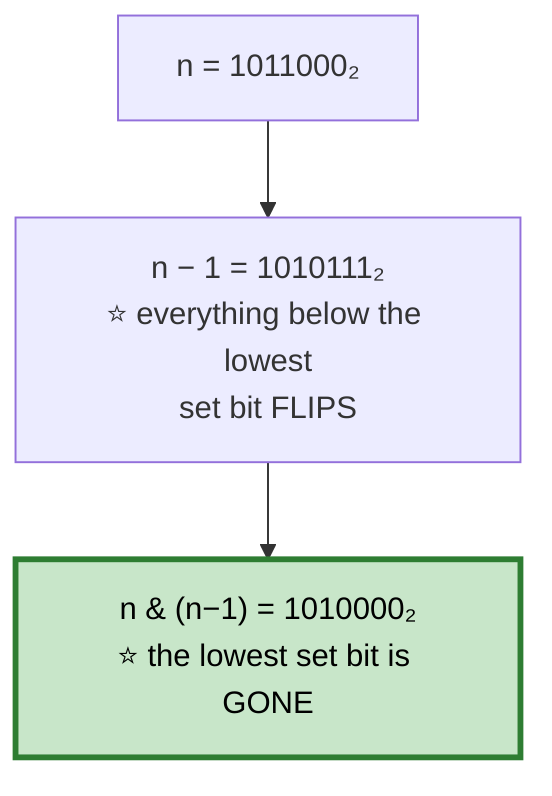

```cpp
int hammingWeight(uint32_t n) {
    int count = 0;
    while (n) { n &= (n - 1); ++count; }          // ⭐ one iteration per SET bit,
    return count;                                //    not per total bit
}
```
⭐ **This runs in O(popcount), not O(32)** — a sparse number with few set bits finishes almost immediately.

## Counting Bits — for every i in [0, n]
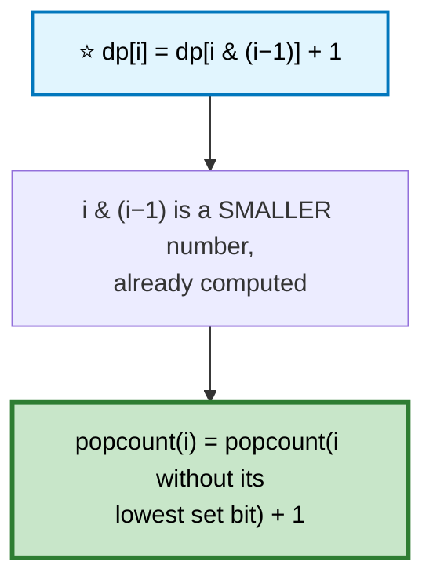
```cpp
vector<int> countBits(int n) {
    vector<int> dp(n + 1, 0);
    for (int i = 1; i <= n; ++i)
        dp[i] = dp[i & (i - 1)] + 1;               // ⭐ O(n) total, not O(n log n)
    return dp;
}
```

---

# 15. Sum of Two Integers (No +/−)

🟡 **Medium** · 🔵 Full ladder · ⭐ **XOR is addition without carrying**

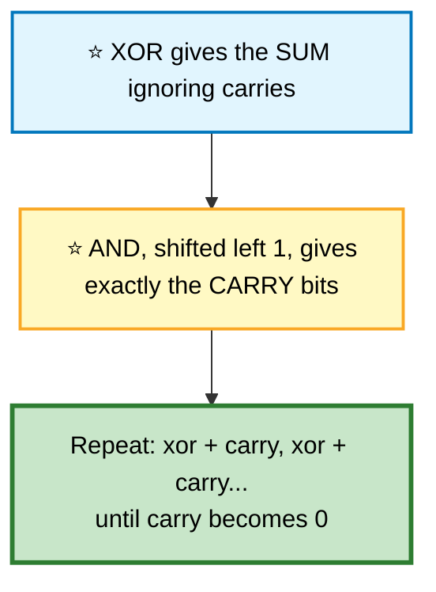

```
   a = 0101 (5)   b = 0011 (3)

   xor(a,b)        = 0110    (sum ignoring carry)
   and(a,b) &lt;&lt; 1    = 0010    (the carry positions)

   repeat with (0110, 0010):
   xor  = 0100
   carry= 0100    ⭐ (0010 & 0110)=0010, <<1 = 0100

   repeat with (0100, 0100):
   xor  = 0000
   carry= 1000

   repeat with (0000, 1000):
   xor  = 1000
   carry= 0000   ⭐ DONE

   RESULT: 1000 = 8 = 5 + 3 ✅
```

```cpp
int getSum(int a, int b) {
    while (b != 0) {
        int carry = (unsigned int)(a & b) << 1;   // ⚠️ unsigned — avoids UB on
                                                  //    signed overflow shift
        a = a ^ b;
        b = carry;
    }
    return a;
}
```
⚠️ **The cast to `unsigned int` before shifting** avoids undefined behavior when the sign bit would otherwise overflow during a signed left shift.

---

# 16. Missing Number / Bit Tricks
🟢 ⚪ **Variation of #13** — XOR every index AND every value; only the missing one survives unpaired.

```cpp
int missingNumber(vector<int>& a) {
    int x = a.size();                             // ⭐ pre-seed with n
    for (int i = 0; i < (int)a.size(); ++i) x ^= i ^ a[i];
    return x;
}
```
⭐ **Every index `i` and value `a[i]` cancels except the missing one** — since indices run `0..n-1` but values are a permutation of `0..n` minus one element.

---

# 17. Reverse Bits
🟢 ⚪ **Variation** — extract each bit from one end, place it at the other.

```cpp
uint32_t reverseBits(uint32_t n) {
    uint32_t result = 0;
    for (int i = 0; i < 32; ++i) {
        result = (result << 1) | (n & 1);          // ⭐ shift result left, append n's LSB
        n >>= 1;
    }
    return result;
}
```

---

# 18. Power of Two / Power of Four
🟢 ⚪ **Variation of #14** — a power of two has exactly one set bit.

```cpp
bool isPowerOfTwo(int n) {
    return n > 0 && (n & (n - 1)) == 0;            // ⭐ clearing the only set bit → 0
}

bool isPowerOfFour(int n) {
    // ⭐ power of two AND the set bit is in an EVEN position
    return n > 0 && (n & (n - 1)) == 0 && (n & 0xAAAAAAAA) == 0;
}
```
⭐ **`0xAAAAAAAA`** has 1s at every odd bit position (1, 3, 5, ...) — ANDing with it and requiring zero confirms the single set bit sits at an even position, which is exactly what distinguishes 4^k from other powers of 2.

---

# 19. Pow(x, n)

🟡 **Medium** · 🔵 Full ladder · ⭐ **Fast exponentiation by squaring**

## 🗺️ Approach Ladder

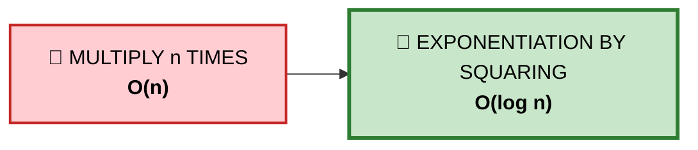

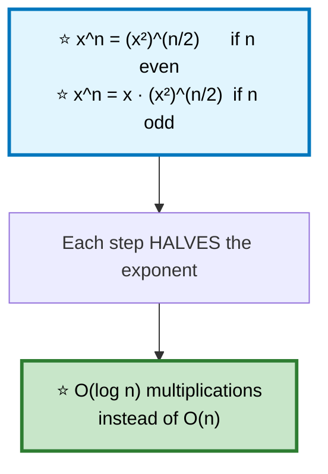

```cpp
double myPow(double x, long long n) {              // ⚠️ long long — n=INT_MIN
    if (n < 0) { x = 1 / x; n = -n; }               //    overflows as int

    double result = 1;
    while (n) {
        if (n & 1) result *= x;                     // ⭐ this bit of n is set
        x *= x;                                     // ⭐ square the base
        n >>= 1;
    }
    return result;
}
```
⚠️ **`n = INT_MIN` negated as an `int` overflows** — hence the `long long`. This edge case is a favorite interview trap.

⭐ **The same squaring trick computes matrix powers in O(log n)**, which is how you solve Fibonacci and general linear recurrences in logarithmic time.

---

# 20. Sqrt(x) and Newton's Method
🟢 ⚪ **Variation** — binary search, or the far faster Newton's method.

```cpp
// Binary search — O(log x)
int mySqrt(int x) {
    if (x < 2) return x;
    long lo = 1, hi = x;
    while (lo < hi) {
        long mid = lo + (hi - lo + 1) / 2;          // ⭐ upper mid — avoids infinite loop
        if (mid * mid <= x) lo = mid; else hi = mid - 1;
    }
    return lo;
}

// ⭐ Newton's method — converges QUADRATICALLY, ~5 iterations for any 32-bit x
int mySqrtNewton(int x) {
    if (x == 0) return 0;
    double guess = x;
    while (abs(guess * guess - x) > 1e-6)
        guess = (guess + x / guess) / 2;            // ⭐ average guess with x/guess
    return (int)guess;
}
```
⭐ **Newton's method halves the number of correct digits each iteration** — fundamentally faster than binary search's linear digit gain, though binary search is easier to make exactly correct on integers.

---

# 21. GCD / LCM / Extended Euclid

🟢 **Easy** · 🔵 Full ladder · ⭐ **The algorithm behind half of number theory**

```mermaid
flowchart TD
    A["⭐ gcd(a, b) = gcd(b, a mod b)"] --> B["repeat until b == 0"]
    B --> C["⭐ a at that point IS the answer"]

    style A fill:#e1f5fe,stroke:#0277bd,stroke-width:3px,color:#000
    style C fill:#c8e6c9,stroke:#2e7d32,stroke-width:3px,color:#000
```

```
   ⭐ WHY THIS WORKS
     Any common divisor of a and b also divides (a mod b),
     because a mod b = a − k·b for some integer k.
     So gcd(a,b) = gcd(b, a mod b) exactly. ∎
```

```cpp
long long gcd(long long a, long long b) { return b ? gcd(b, a % b) : a; }
long long lcm(long long a, long long b) { return a / gcd(a, b) * b; }   // ⚠️ divide FIRST — avoids overflow
```

⭐ **Extended Euclid** finds integers `x, y` such that `ax + by = gcd(a,b)` — the basis for modular inverses and the CRT.
```cpp
long long extGcd(long long a, long long b, long long& x, long long& y) {
    if (!b) { x = 1; y = 0; return a; }
    long long x1, y1;
    long long g = extGcd(b, a % b, x1, y1);
    x = y1;
    y = x1 - (a / b) * y1;                          // ⭐ back-substitution
    return g;
}
```

---

# 22. Count Primes (Sieve of Eratosthenes)

🟡 **Medium** · 🔵 Full ladder · ⭐ **O(n log log n)**

## 🗺️ Approach Ladder

```mermaid
flowchart LR
    A["🐌 TRIAL DIVISION per number<br/><b>O(n√n)</b>"] --> B["🚀 SIEVE OF ERATOSTHENES<br/><b>O(n log log n)</b>"]

    style A fill:#ffcdd2,stroke:#c62828,stroke-width:2px,color:#000
    style B fill:#c8e6c9,stroke:#2e7d32,stroke-width:3px,color:#000
```

```mermaid
flowchart TD
    A["for each number p starting at 2"] --> B{"is p still<br/>marked prime?"}
    B -->|"yes"| C["⭐ mark EVERY MULTIPLE of p<br/>as composite, starting from p²"]
    B -->|"no, already crossed out"| D["skip — it's composite,<br/>a smaller factor got it first"]
    C --> E["⭐⭐ start from p², not 2p —<br/>smaller multiples were already<br/>marked by SMALLER primes"]

    style C fill:#c8e6c9,stroke:#2e7d32,stroke-width:2px,color:#000
    style E fill:#fff9c4,stroke:#f9a825,stroke-width:2px,color:#000
```

```cpp
int countPrimes(int n) {
    if (n < 2) return 0;
    vector<bool> composite(n, false);
    int count = 0;

    for (int p = 2; p < n; ++p) {
        if (composite[p]) continue;
        ++count;

        if ((long long)p * p < n)                   // ⚠️ overflow guard for large n
            for (int m = p * p; m < n; m += p)       // ⭐ start at p², step by p
                composite[m] = true;
    }
    return count;
}
```

```
   ⭐⭐ WHY STARTING AT p² IS SAFE

   Any composite multiple of p smaller than p² is of the form
   k·p where k < p. But k < p means k has already been used as
   a sieving prime (or is composite and was marked by ITS
   smallest prime factor, which is < p). Either way, k·p was
   already marked. Starting at p² skips redundant work.

   ⭐ This is what gives the O(n log log n) bound — each
     composite is marked once by its SMALLEST prime factor,
     not once per every prime factor.
```

---

# 23. Random Pick with Weight / Reservoir Sampling

🟡 **Medium** · 🔵 Full ladder · **Two distinct sampling techniques**

## Random Pick with Weight — ⭐ prefix sums + binary search
```mermaid
flowchart TD
    A["⭐ build a prefix-sum array of weights"] --> B["pick a random value in<br/>[1, totalWeight]"]
    B --> C["⭐ binary search: the first prefix<br/>sum ≥ that random value<br/>gives the chosen index"]
    C --> D["⭐ Larger weights occupy WIDER<br/>ranges in the prefix array —<br/>naturally proportional"]

    style A fill:#e1f5fe,stroke:#0277bd,stroke-width:2px,color:#000
    style D fill:#c8e6c9,stroke:#2e7d32,stroke-width:3px,color:#000
```
```cpp
class Solution {
    vector<int> prefix;
public:
    Solution(vector<int>& w) {
        partial_sum(w.begin(), w.end(), back_inserter(prefix));
    }
    int pickIndex() {
        int target = 1 + rand() % prefix.back();      // ⭐ 1..totalWeight
        return lower_bound(prefix.begin(), prefix.end(), target) - prefix.begin();
    }
};
```

## Reservoir Sampling — ⭐ uniform sampling from an unknown-length stream
```mermaid
flowchart TD
    A["⭐ keep the i-th element with<br/>probability 1/i"] --> B["when it's kept, it REPLACES<br/>the current answer"]
    B --> C["⭐⭐ every element ends up with<br/>EQUAL final probability 1/n,<br/>even though n isn't known<br/>in advance"]

    style A fill:#e1f5fe,stroke:#0277bd,stroke-width:2px,color:#000
    style C fill:#c8e6c9,stroke:#2e7d32,stroke-width:3px,color:#000
```
```cpp
int pick(ListNode* head) {                          // pick a uniformly random node value
    int result = 0, i = 0;
    for (ListNode* n = head; n; n = n->next) {
        ++i;
        if (rand() % i == 0) result = n->val;         // ⭐ probability 1/i of replacing
    }
    return result;
}
```
```
   ⭐⭐ THE INDUCTIVE PROOF

   After processing i elements, each has probability 1/i of
   being the current answer (base case: after 1 element,
   probability is trivially 1/1).

   When element i+1 arrives, it becomes the answer with
   probability 1/(i+1). Every PREVIOUS element survives with
   probability (1 − 1/(i+1)) = i/(i+1).

   So a previous element's overall probability becomes
   (1/i) · (i/(i+1)) = 1/(i+1). ⭐ Induction holds — every
   element ends with probability 1/n. ∎
```

---

# 24. Majority Element

🟢 **Easy** · 🔵 Full ladder · ⭐ **Boyer-Moore voting**

> The element appearing more than ⌊n/2⌋ times. **O(n) time, O(1) space.**

## 🗺️ Approach Ladder

```mermaid
flowchart LR
    A["⚡ HASH MAP counting<br/><b>O(n)</b> / O(n)"] --> B["⚡ SORT, take the middle<br/><b>O(n log n)</b> / O(1)"]
    B --> C["🚀 BOYER-MOORE VOTING<br/><b>O(n)</b> / <b>O(1)</b>"]

    style A fill:#fff9c4,stroke:#f9a825,color:#000
    style B fill:#e1f5fe,stroke:#0277bd,color:#000
    style C fill:#c8e6c9,stroke:#2e7d32,stroke-width:3px,color:#000
```

## 💬 The voting insight

```mermaid
flowchart TD
    A["⭐ Treat the majority element as +1<br/>and every OTHER element as −1"] --> B["Since the majority appears &gt; n/2<br/>times, the total sum is<br/>PROVABLY positive"]
    B --> C["⭐ Maintain a 'candidate' and a<br/>count. Matching votes increment,<br/>mismatches decrement."]
    C --> D{"count hits 0?"}
    D -->|"yes"| E["⭐ discard the candidate —<br/>votes so far CANCEL OUT,<br/>so the majority must be<br/>somewhere in what's left"]
    D -->|"no"| F["keep going"]

    style A fill:#e1f5fe,stroke:#0277bd,stroke-width:2px,color:#000
    style E fill:#c8e6c9,stroke:#2e7d32,stroke-width:3px,color:#000
```

```
   TRACE  [2,2,1,1,1,2,2]

   ┌───┬─────────┬───────┬────────────────────────────┐
   │ x │candidate│ count │ note                       │
   ├───┼─────────┼───────┼────────────────────────────┤
   │ 2 │    2    │   1   │ start                      │
   │ 2 │    2    │   2   │ match                      │
   │ 1 │    2    │   1   │ mismatch                   │
   │ 1 │    2    │   0   │ ⭐ mismatch → count hits 0 │
   │ 1 │    1    │   1   │ ⭐ NEW candidate: 1         │
   │ 2 │    1    │   0   │ mismatch                  │
   │ 2 │    2    │   1   │ ⭐ NEW candidate: 2         │
   └───┴─────────┴───────┴────────────────────────────┘
   ⭐ ANSWER: 2 (appears 4 times, > 7/2)
```

```cpp
int majorityElement(vector<int>& a) {
    int candidate = 0, count = 0;
    for (int x : a) {
        if (count == 0) candidate = x;               // ⭐ start fresh
        count += (x == candidate) ? 1 : -1;
    }
    return candidate;                                // ⭐ guaranteed correct — the
                                                      //    problem promises a majority exists
}
```

⚠️ **Without the guarantee** that a majority element exists, this algorithm can output a wrong answer — a verification pass would be needed.

🎤 **Follow-up: Majority Element II (elements appearing > n/3 times)?** At most 2 such elements can exist (three would exceed n). Extend to **two** candidates and **two** counters, tracked simultaneously.

## 📌 Pattern Card
```
SIGNAL   find the dominant element, O(1) space
KEY      ⭐ Boyer-Moore: +1 for match, −1 for mismatch,
         reset the candidate when count hits 0
RELATED  Majority Element II · Check If a String Has a Majority
```

---

# 25. Meeting Rooms / Max Events / Misc Greedy
🟡 ⚪ **Variation** — a family of "greedily assign to the earliest-available option" problems.

```cpp
// Maximum number of events attendable, one per day
int maxEvents(vector<vector<int>>& events) {
    sort(events.begin(), events.end());            // ⭐ by START day
    priority_queue<int, vector<int>, greater<int>> pq;   // ⭐ min-heap of end days

    int i = 0, n = events.size(), day = 0, count = 0;
    while (i < n || !pq.empty()) {
        if (pq.empty()) day = events[i][0];         // ⭐ jump to the next event's start

        while (i < n && events[i][0] <= day) pq.push(events[i++][1]);   // ⭐ unlock today's options

        while (!pq.empty() && pq.top() < day) pq.pop();   // ⭐ discard expired events

        if (!pq.empty()) { pq.pop(); ++count; ++day; }    // ⭐ attend the SOONEST-EXPIRING one
    }
    return count;
}
```
⭐ **"Attend the event that expires soonest"** is another exchange-argument greedy — it never costs you a future option, since it frees up today for anything else while leaving maximal flexibility for tomorrow. The same reasoning as Non-overlapping Intervals, applied one day at a time.

---

## 📋 Greedy, Backtracking & Bits Recall

```mermaid
mindmap
  root(("Greedy · Backtrack<br/>· Bits"))
    Greedy Proofs
      ⭐ exchange argument
      ⭐ stays-ahead argument
      always try to BREAK it first
    Backtracking Skeleton
      choose → recurse → ⭐ UNDO
      prune EARLY — that's the speedup
      start-index avoids order dupes
      sort + skip-equal avoids value dupes
    Encoding Constraints
      ⭐ diagonals: row±col are constant
      ⭐ branch condition can make
        invalid states UNREACHABLE
    XOR Family
      appears 2× → XOR all
      appears 3× → bit state machine
      two uniques → partition by a set bit
      ⭐ x &amp; -x isolates lowest bit
    Fast Math
      ⭐ exponentiation by squaring
      Euclid: gcd(a,b)=gcd(b,a mod b)
      ⭐ sieve marks from p², not 2p
    Sampling
      prefix sums + binary search
      ⭐ reservoir: keep with prob 1/i
    Voting
      ⭐ Boyer-Moore: +1/−1, reset at 0
```

```
╔══════════════════════════════════════════════════════════════════════╗
║           GREEDY, BACKTRACKING & BITS — PATTERN RECALL               ║
╠══════════════════════════════════════════════════════════════════════╣
║ "can I reach the end"          → track farthest reach, greedy        ║
║ "circular start point exists"  → ⭐ negative prefix skips the whole   ║
║                                   failed range at once               ║
║ "generate all X"               → backtrack: choose/explore/UNDO      ║
║ "avoid duplicate permutations" → sort + skip if prev unused          ║
║ "avoid duplicate combinations" → ⭐ start-index recursion             ║
║ "placement with pairwise rules"→ encode each conflict as its own set ║
║ "find the odd one out"         → XOR family (2×, 3×, or two singles) ║
║ "count set bits"               → ⭐ n &amp; (n-1) clears the lowest one║
║ "x^n fast"                     → exponentiation by squaring, O(log n)║
║ "primes up to n"                → sieve, mark from p² onward         ║
║ "sample from a stream"         → reservoir sampling, keep w.p. 1/i   ║
║ "dominant element, O(1) space" → Boyer-Moore voting                  ║
╠══════════════════════════════════════════════════════════════════════╣
║ ⚠️ TRAPS                                                              ║
║   backtracking: push_back(path) copies — a stored reference doesn't  ║
║   permutations II / subsets II: sort FIRST, or dedup silently fails  ║
║   N-Queens: row+col and row−col identify diagonals, not row·col      ║
║   candy: the second pass needs max(), not overwrite                  ║
║   getSum: cast to unsigned before shifting — signed overflow is UB   ║
║   myPow: n = INT_MIN negated as int overflows — use long long        ║
╚══════════════════════════════════════════════════════════════════════╝
```

---

**Back:** [Dynamic Programming](09-dynamic-programming.md) · [Index](INDEX.md)
