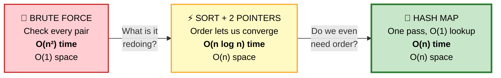
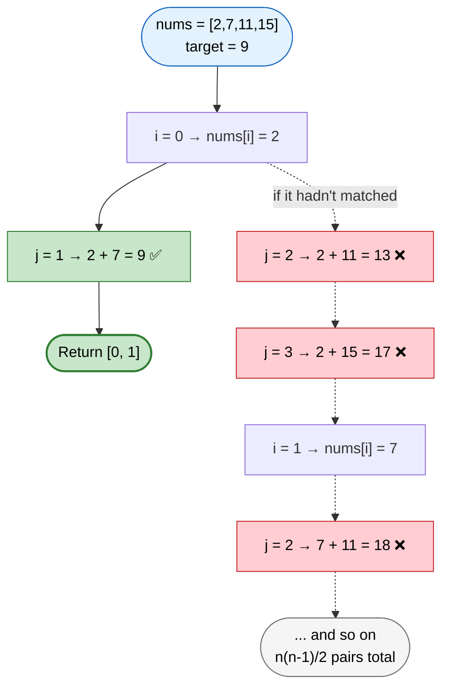
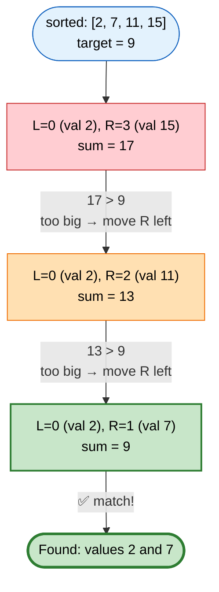
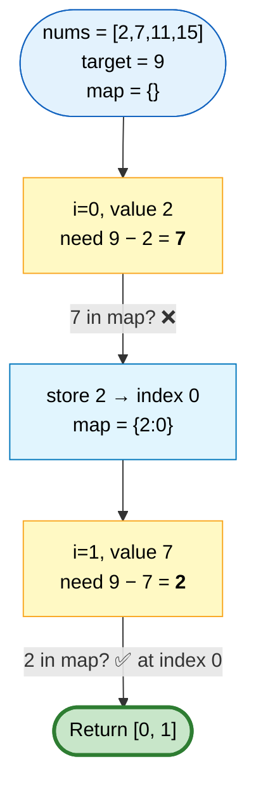
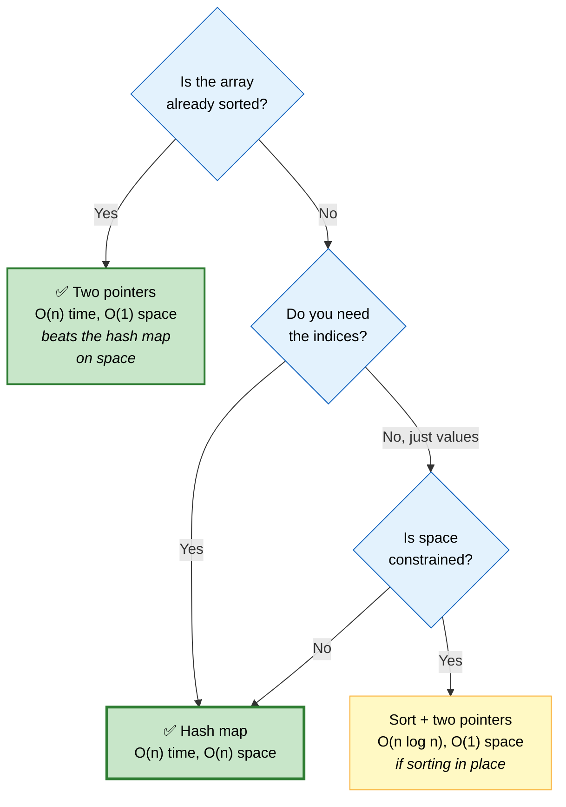

# 📐 Format Sample — Two Sum

> This file demonstrates the standard every DSA problem follows. Read it once, then the rest of the library will feel familiar.

---

## The Problem

> Given an array `nums` and an integer `target`, return the **indices** of the two numbers that add up to `target`.
> Exactly one solution exists. You may not use the same element twice.

```
   Input:  nums = [2, 7, 11, 15],  target = 9
   Output: [0, 1]                  because nums[0] + nums[1] = 2 + 7 = 9
```

---

## 🗺️ The Approach Ladder

Every problem in this library shows the full progression, because *how you get from bad to good* is what interviewers actually score.



| | Approach | Time | Space | Verdict |
|---|---|---|---|---|
| 1️⃣ | Brute force | O(n²) | O(1) | ❌ Too slow for n = 10⁴ |
| 2️⃣ | Sort + two pointers | O(n log n) | O(n) | ⚠️ Works, but loses indices |
| 3️⃣ | **Hash map** | **O(n)** | O(n) | ✅ **Optimal** |

---

## 1️⃣ Brute Force — check every pair

#### 💬 The idea
The most literal reading of the problem. Try every possible pair and see which one sums to the target.



```cpp
vector<int> twoSumBrute(const vector<int>& nums, int target) {
    int n = nums.size();

    for (int i = 0; i < n; ++i) {
        // j starts at i+1 so we never pair an element with itself,
        // and never check the same pair twice
        for (int j = i + 1; j < n; ++j) {
            if (nums[i] + nums[j] == target) {
                return {i, j};
            }
        }
    }
    return {};   // problem guarantees this is unreachable
}
```

**Complexity**
- ⏱️ **Time O(n²)** — the inner loop runs `n-1`, then `n-2`, ... summing to `n(n-1)/2` pairs
- 💾 **Space O(1)** — only loop counters

**Why it's not good enough:** at n = 10,000 that's ~50 million comparisons. At n = 100,000 it's 5 billion — several seconds, well past any time limit.

---

## 2️⃣ Sort + Two Pointers — let order do the work

#### 💬 The idea
The brute force has no information to guide it — it checks pairs blindly. **Sorting creates structure we can exploit.**

Once sorted, place one pointer at each end. Their sum tells you exactly which way to move:
- Sum **too small**? The only way to increase it is to move `left` right (toward larger values)
- Sum **too large**? Move `right` left (toward smaller values)

Each comparison eliminates an entire set of possibilities, so one pass suffices.



#### 📊 Why moving a pointer is safe

```
   sorted:  [ 2,  7, 11, 15 ]
              ▲           ▲
              L           R      sum = 17 > 9

   ⭐ Everything between L and R is ≥ nums[L].
     So pairing nums[R] with ANY of them gives a sum ≥ 17.
     → nums[R] can never be part of the answer. Discard it.

   That's why one comparison eliminates a whole column of
   the O(n²) pair space — and why this is O(n) after sorting.
```

⚠️ **The catch:** sorting destroys the original indices, and the problem asks for *indices*. So you must pair each value with its index before sorting.

```cpp
vector<int> twoSumSort(vector<int> nums, int target) {
    int n = nums.size();

    // Pair each value with its ORIGINAL index before sorting
    vector<pair<int,int>> valueWithIndex;
    valueWithIndex.reserve(n);
    for (int i = 0; i < n; ++i) {
        valueWithIndex.push_back({nums[i], i});
    }
    sort(valueWithIndex.begin(), valueWithIndex.end());

    int left = 0, right = n - 1;
    while (left < right) {
        int sum = valueWithIndex[left].first + valueWithIndex[right].first;

        if (sum == target) {
            int i = valueWithIndex[left].second;
            int j = valueWithIndex[right].second;
            return {min(i, j), max(i, j)};   // return in ascending order
        }
        if (sum < target) ++left;    // need a bigger sum
        else              --right;   // need a smaller sum
    }
    return {};
}
```

**Complexity**
- ⏱️ **Time O(n log n)** — dominated by the sort; the two-pointer scan is O(n)
- 💾 **Space O(n)** — for the value-index pairs

**Better than brute force**, and it's the right technique when the array is *already* sorted or when you need all pairs (like [3Sum](03-two-pointers-sliding-window.md#2-3sum-)). But we're still paying for a sort we may not need.

---

## 3️⃣ Hash Map — the optimal solution

#### 💬 The idea
Step back and ask: **what was the brute force actually doing?**

For each element, it was *searching* the rest of the array for a specific value — the complement, `target - nums[i]`. That search was O(n) because the array is unordered.

Sorting made the search O(log n). But a **hash map makes it O(1)** — and we never needed the order at all, only fast lookup.

Even better: we can do it in a **single pass**. As we walk the array, we check whether the complement was already seen, and record the current value on the way past.



#### 📊 A longer trace — `[3, 2, 4]`, target `6`

```
   ┌──────┬───────┬──────────────┬─────────────────┬──────────────┐
   │  i   │ value │ need (6−val) │ in map?         │ map after    │
   ├──────┼───────┼──────────────┼─────────────────┼──────────────┤
   │  0   │   3   │      3       │ ❌ empty        │ {3:0}        │
   │  1   │   2   │      4       │ ❌ not present  │ {3:0, 2:1}   │
   │  2   │   4   │      2       │ ✅ at index 1   │ → return     │
   └──────┴───────┴──────────────┴─────────────────┴──────────────┘

   ANSWER = [1, 2]   →  nums[1] + nums[2] = 2 + 4 = 6  ✅

   ⭐ Notice at i=0: need is 3, and the value IS 3 — but the map
     is still empty, so we correctly do NOT match 3 with itself.
     That's the whole reason we insert AFTER checking.
```

```cpp
vector<int> twoSum(const vector<int>& nums, int target) {
    // Maps a value we've already seen → the index we saw it at
    unordered_map<int, int> seen;
    seen.reserve(nums.size());          // ⭐ avoids rehashing as it grows

    for (int i = 0; i < (int)nums.size(); ++i) {
        int complement = target - nums[i];

        auto it = seen.find(complement);
        if (it != seen.end()) {
            return {it->second, i};     // earlier index first
        }

        // ⭐ Insert AFTER checking. If we inserted first, then
        //    target == 2 * nums[i] would match the element
        //    with itself — which the problem forbids.
        seen[nums[i]] = i;
    }
    return {};
}
```

**Complexity**
- ⏱️ **Time O(n)** — one pass, and each hash operation is O(1) on average
- 💾 **Space O(n)** — worst case the map holds every element before finding a match

---

## 🎯 Comparing the Three



```
   ⭐ THE GENERALIZABLE LESSON

   Brute force → optimal came from ONE question:

        "What is the brute force REDOING?"

   Here it was REPEATED SEARCHING → so we replaced the search
   with a hash map.

   That same question drives most optimizations:
     repeated searching   → hash map / sort / binary search
     recomputation        → memoize / DP
     repeated scanning    → two pointers / sliding window
     repeated min or max  → heap / monotonic stack
```

---

## ⚠️ Edge Cases

| Case | Input | Expected | Handled by |
|---|---|---|---|
| Duplicate values | `[3,3]`, t=6 | `[0,1]` | Insert-after-check |
| Negative numbers | `[-1,-2,-3]`, t=-5 | `[1,2]` | No assumptions about sign |
| Self-pairing risk | `[5,2]`, t=10 | `[]` | Insert-after-check prevents 5+5 |
| Answer at the very end | `[1,2,3,9]`, t=12 | `[2,3]` | Full pass |
| Minimum size | `[1,2]`, t=3 | `[0,1]` | Works |

⚠️ **Overflow:** `target - nums[i]` can overflow if values are near `INT_MIN`/`INT_MAX`. Use `long long` for the complement when constraints allow extreme values.

---

## 🎤 Interview Follow-Ups

<details>
<summary><b>"What if the array is sorted?"</b></summary>

Then two pointers is strictly better than the hash map — same O(n) time, but **O(1) space** instead of O(n), because you skip the sort and don't need the map.

That's [Two Sum II](03-two-pointers-sliding-window.md#1-two-sum-ii-sorted-input-), and it's worth recognizing that the optimal approach genuinely changes based on that one precondition.
</details>

<details>
<summary><b>"What if there are multiple valid answers?"</b></summary>

The hash map as written returns the first pair it finds. To return *all* pairs, you'd continue the scan rather than returning early, and store a list of indices per value in the map to handle duplicates.

You'd also need to decide whether `[0,1]` and `[1,0]` count as distinct, and whether the same value can be reused — those are clarifying questions worth asking rather than assuming.
</details>

<details>
<summary><b>"What if the array doesn't fit in memory?"</b></summary>

Then external sorting plus two pointers becomes attractive, since it streams rather than requiring random access.

Alternatively, if you can process in two passes: hash the values into buckets by `value mod k` across k files, then process each pair of complementary buckets independently. Only pairs whose remainders sum correctly can form the target, so you never load the whole dataset.
</details>

<details>
<summary><b>"Can you do it in O(1) space with an unsorted array?"</b></summary>

Not in O(n) time. Without extra space you can't get O(1) lookup, so you're stuck either sorting — which is O(n log n) and needs O(1) only if you sort in place and don't need original indices — or doing the O(n²) scan.

There's a genuine time-space tradeoff here, and stating it explicitly is a good answer: **O(n) time requires O(n) space; O(1) space costs you at least O(n log n) time.**
</details>

---

## 📌 Pattern Card

```
╔══════════════════════════════════════════════════════════════════════╗
║  TWO SUM                                              🟢 Easy        ║
╠══════════════════════════════════════════════════════════════════════╣
║  PATTERN     Hash map complement lookup                              ║
║  SIGNAL      "find a pair that sums to X" in an unsorted array       ║
║  OPTIMAL     O(n) time, O(n) space — single pass                     ║
║  KEY LINE    insert AFTER checking (prevents self-pairing)           ║
╠══════════════════════════════════════════════════════════════════════╣
║  RELATED     3Sum · 4Sum · Two Sum II (sorted) · 4Sum II             ║
║              Subarray Sum Equals K (same complement idea, on         ║
║              prefix sums instead of raw values)                      ║
╚══════════════════════════════════════════════════════════════════════╝
```

---

**This is the format.** Every problem in the rebuilt DSA books follows it:
approach ladder → each approach explained and diagrammed → optimal code → comparison → edge cases → follow-ups → pattern card.
