# 🏛️ System Design Fundamentals

> Every large system is built from the same handful of ideas. This book is those ideas, explained from first principles — so that when you see Uber's or Netflix's architecture later, you recognize the parts.

---

## 📑 Table of Contents

1. [The Fundamental Constraint](#1-the-fundamental-constraint)
2. [Numbers Every Engineer Must Know](#2-numbers-every-engineer-must-know)
3. [Scaling: Vertical vs Horizontal](#3-scaling)
4. [Load Balancing](#4-load-balancing)
5. [Statelessness](#5-statelessness)
6. [Replication](#6-replication)
7. [Partitioning / Sharding](#7-partitioning--sharding)
8. [CAP and PACELC](#8-cap-and-pacelc)
9. [Consistency Models](#9-consistency-models)
10. [Caching Strategy](#10-caching-strategy)
11. [Asynchronous Processing](#11-asynchronous-processing)
12. [Failure and Resilience](#12-failure-and-resilience)
13. [Back-of-the-Envelope Estimation](#13-estimation)
14. [The Evolution of an Architecture](#14-evolution)
15. [Cheat Sheet](#15-cheat-sheet)

---

## 1. The Fundamental Constraint

#### 💬 Why distributed systems are hard

Everything difficult about system design traces back to one physical fact: **information cannot travel faster than light, and machines fail independently.**

If you could have one infinitely fast, infinitely large, never-failing computer, system design would not exist. You'd just write a program. Every technique in this book is a workaround for the fact that you can't.

```
   ONE MACHINE                        MANY MACHINES
   ───────────                        ─────────────
   ✅ One source of truth              ❌ Which copy is correct?
   ✅ Instant "reads see writes"       ❌ Replicas lag behind
   ✅ Real transactions                ❌ Cross-machine transactions are
   ✅ It's up, or it's down                painful and slow
                                       ❌ Partial failure: half the system
   ❌ Limited by one box's capacity        is up, half is down, and they
   ❌ One failure = total outage           disagree about what happened
```

The moment you add a second machine, you inherit an entire category of problems. **So the first rule of system design is: don't distribute until you must.** A single well-tuned PostgreSQL instance handles tens of thousands of transactions per second and terabytes of data. That covers the vast majority of real products.

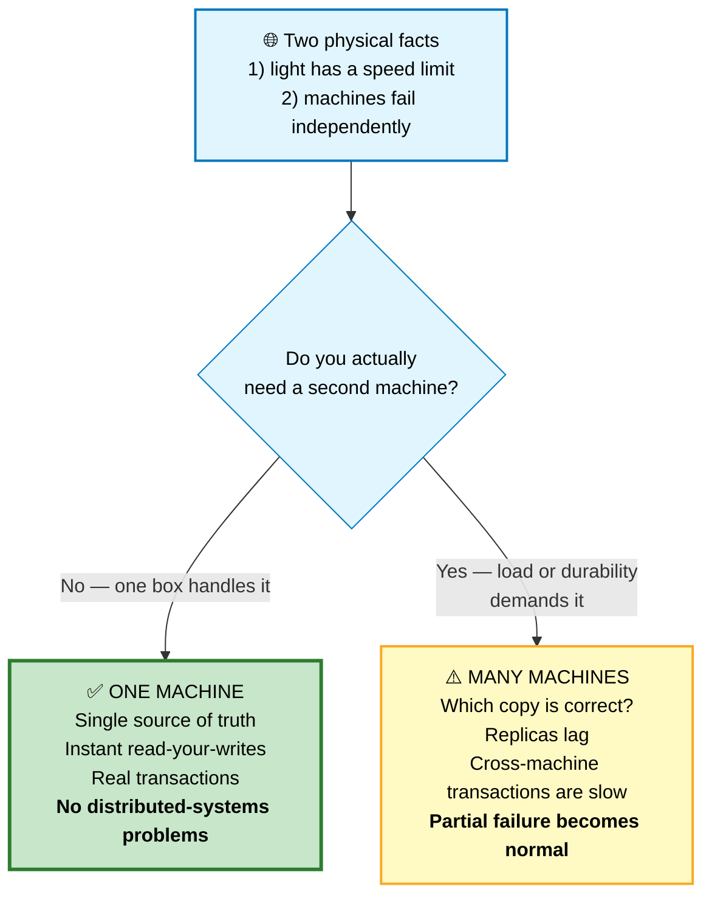

---

## 2. Numbers Every Engineer Must Know

You cannot design a system without a feel for magnitudes. Memorize the shape of this table, not the exact digits.

```
   LATENCY (Jeff Dean's numbers, updated)

   L1 cache reference                        0.5 ns    ┐
   Branch mispredict                           5 ns    │ CPU
   L2 cache reference                          7 ns    │
   Mutex lock/unlock                          25 ns    ┘
   Main memory reference                     100 ns    ← RAM
   Compress 1 KB with Zippy                3,000 ns
   Send 1 KB over 1 Gbps network          10,000 ns  = 10 µs
   Read 4 KB randomly from SSD           150,000 ns  = 150 µs   ← SSD
   Read 1 MB sequentially from memory    250,000 ns  = 250 µs
   Round trip within the same datacenter 500,000 ns  = 500 µs   ← LAN
   Read 1 MB sequentially from SSD     1,000,000 ns  = 1 ms
   Disk seek (spinning)               10,000,000 ns  = 10 ms    ← HDD
   Read 1 MB sequentially from disk   20,000,000 ns  = 20 ms
   Send packet CA → Netherlands → CA 150,000,000 ns  = 150 ms   ← WAN
```

#### 📊 Scaled to human time

This is the version that actually builds intuition. Imagine 1 nanosecond = 1 second:

```
   L1 cache             0.5 sec       "grab it off your desk"
   RAM                  ~2 min        "walk to the filing cabinet"
   SSD read             ~2 days       "order it, arrives in 2 days"
   Datacenter round-trip ~6 days      "ship it across town"
   Disk seek            ~4 months     "wait a season"
   CA → Netherlands     ~5 years      "wait for a college degree"
```

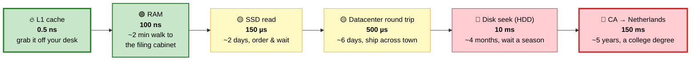

**What this tells you to do:**
- Keep hot data in memory. RAM is ~1,500× faster than SSD.
- Batch network calls. One round trip costs the same as ~5,000 memory reads.
- Sequential beats random, everywhere, by a lot.
- Cross-region calls are catastrophic in a request path. Replicate data instead.

### Capacity numbers worth knowing

```
   ONE MODERN SERVER (roughly)
   ─────────────────────────────
   Requests/sec (simple API)       ~10,000 - 50,000
   Requests/sec (heavy work)       ~500 - 2,000
   PostgreSQL writes/sec           ~5,000 - 20,000 (with good hardware)
   Redis operations/sec            ~100,000+
   Kafka messages/sec per broker   ~100,000 - 1,000,000
   Concurrent connections          ~10,000 - 100,000 (with async I/O)

   TIME
   ─────────────────────────────
   1 day       = 86,400 sec ≈ 10⁵
   1 month     = 2.6M sec   ≈ 2.5 × 10⁶
   1 year      = 31.5M sec  ≈ 3 × 10⁷

   ⭐ Handy shortcut: 1 million requests/day ≈ 12 requests/sec
```

### Data size reference

```
   char / bool          1 byte
   int / float          4 bytes
   long / double        8 bytes
   UUID                 16 bytes
   Timestamp            8 bytes
   Short text (name)    ~20-50 bytes
   URL                  ~100 bytes
   Tweet                ~300 bytes
   JSON API response    ~1-10 KB
   Web page (HTML)      ~50-100 KB
   Photo (compressed)   ~200 KB - 2 MB
   Song (MP3)           ~3-5 MB
   Movie (1080p)        ~1-3 GB
```

---

## 3. Scaling

```
   VERTICAL (scale up)                HORIZONTAL (scale out)
   ───────────────────                ──────────────────────
        ┌──────┐                       ┌───┐ ┌───┐ ┌───┐ ┌───┐
        │      │                       │   │ │   │ │   │ │   │
        │ BIG  │                       └───┘ └───┘ └───┘ └───┘
        │ BOX  │                       many small boxes
        │      │
        └──────┘

   ✅ Simple — no code changes         ✅ Nearly unlimited ceiling
   ✅ No distributed-systems problems  ✅ Fault tolerant (lose one, survive)
   ✅ Real transactions still work     ✅ Cheaper per unit of capacity
                                       ✅ Can scale incrementally
   ❌ Hard ceiling on machine size
   ❌ Cost grows super-linearly        ❌ Complexity explodes
   ❌ Single point of failure          ❌ Consistency becomes hard
   ❌ Downtime to upgrade              ❌ Needs statelessness + coordination
```

🏭 **The practical order:** vertical scaling first (it's cheap and buys years), then read replicas, then caching, then horizontal scaling of stateless services, and only finally sharding the database. People reverse this order and pay dearly.

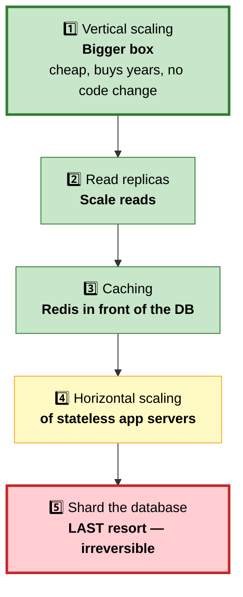

---

## 4. Load Balancing

#### 💬 What it actually does
A load balancer sits in front of your servers and decides where each request goes. It also does health checking — if a server stops responding, it's removed from rotation automatically.

```
                        ┌──────────────┐
   Clients ────────────▶│     LOAD     │
                        │   BALANCER   │
                        └──┬────┬───┬──┘
                     ┌─────┘    │   └─────┐
                     ▼          ▼         ▼
                 ┌──────┐  ┌──────┐  ┌──────┐
                 │ App1 │  │ App2 │  │ App3 │
                 └──────┘  └──────┘  └──────┘
                              ✗ health check fails
                              → removed from the pool
```

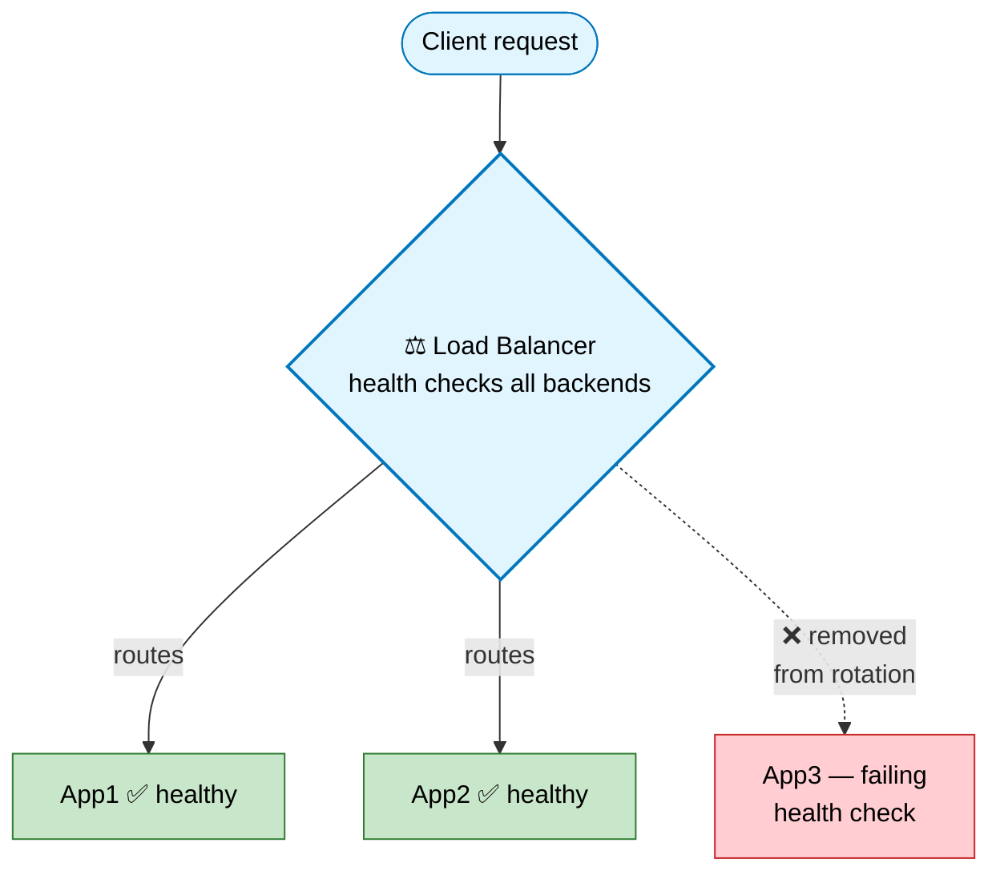

### Layer 4 vs Layer 7

```
   L4 (TRANSPORT)                     L7 (APPLICATION)
   ──────────────                     ────────────────
   Routes on IP + port                Routes on URL, headers, cookies
   Doesn't read the payload           Understands HTTP
   ⚡ Very fast, low overhead          🐢 Slower (must parse the request)
   Cannot do path-based routing       ✅ /api → service A, /img → service B
   TLS passes through                 ✅ TLS termination, compression, WAF

   Examples: AWS NLB, IPVS            Examples: nginx, ALB, Envoy, HAProxy
```

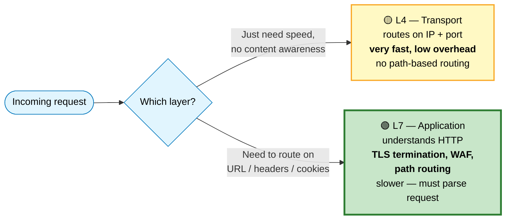

### Algorithms

| Algorithm | How it picks | Best for |
|---|---|---|
| **Round robin** | Next server in rotation | Uniform servers, uniform requests |
| **Weighted round robin** | Proportional to capacity | Mixed server sizes |
| **Least connections** | Fewest active connections | Long-lived / variable-duration requests ⭐ |
| **Least response time** | Fastest recent responses | Latency-sensitive |
| **IP hash** | `hash(client IP)` | Sticky sessions without cookies |
| **Consistent hashing** | Hash ring | Cache affinity — see below ⭐ |

#### 💬 Why consistent hashing matters

Suppose you route cache requests with `hash(key) % N`. Add one server and `N` changes — so **almost every key** now maps somewhere new, and your entire cache misses at once. That's a stampede that can take down your database.

Consistent hashing fixes this by placing servers on a ring:

```
                     0 / 2³²
                        │
              nodeC ────┼──── nodeA
                   ╱    │    ╲
                  │     │     │       Each key hashes to a point,
                  │   RING    │       then walks CLOCKWISE to the
                  │           │       first node it finds.
                   ╲         ╱
                    ──nodeB──

   Add nodeD between A and B:
   → only the keys between A and D move.
   → about 1/N of keys are affected, not all of them. ✅

   ⭐ VIRTUAL NODES: each physical server gets ~150 points on the
     ring instead of 1. This evens out the distribution and spreads
     a departing node's keys across ALL survivors rather than one.
```

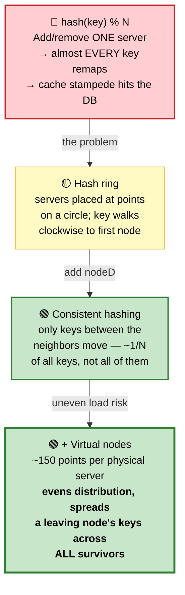

---

## 5. Statelessness

#### 💬 Why this is the single most important architectural property

A **stateless** server stores nothing about a client between requests. Any server can handle any request. That one property is what makes horizontal scaling possible.

```
   ❌ STATEFUL                        ✅ STATELESS
   User's session lives in            Session lives in Redis / a signed
   App2's memory                      token the client carries

   ┌────┐ ┌────┐ ┌────┐               ┌────┐ ┌────┐ ┌────┐
   │App1│ │App2│ │App3│               │App1│ │App2│ │App3│
   └────┘ └▲───┘ └────┘               └──┬─┘ └──┬─┘ └──┬─┘
           │ MUST come back here          └──────┼──────┘
           │ (sticky sessions)                   ▼
                                            ┌─────────┐
   Consequences:                            │  Redis  │
   • App2 dies → users logged out           └─────────┘
   • Uneven load
   • Can't deploy without disruption   Consequences:
   • Autoscaling is unsafe             • Any server, any request
                                       • Kill any box freely
                                       • Autoscale without thought
```

**Where state should actually live:**

```
   Session data       → Redis, or a signed JWT the client carries
   User data          → database
   Uploaded files     → object storage (S3), never local disk
   Cached computation → Redis / Memcached
   In-flight work     → a message queue
```

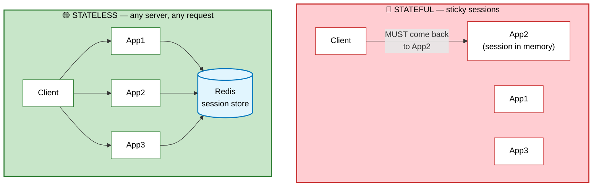

---

## 6. Replication

#### 💬 Two reasons to replicate
1. **Availability** — a copy survives when the primary dies.
2. **Read scaling** — spread reads across many machines.

```
   ┌──────────┐   replication stream    ┌──────────┐
   │ PRIMARY  │────────────────────────▶│ REPLICA  │  reads only
   │ (writes) │────────────────────────▶│ REPLICA  │
   └──────────┘                         └──────────┘
```

### Synchronous vs asynchronous

```
   ASYNCHRONOUS                        SYNCHRONOUS
   ────────────                        ───────────
   1. Write to primary                 1. Write to primary
   2. Ack the client immediately ⚡     2. Wait for N replicas to confirm
   3. Ship to replicas later           3. THEN ack the client

   ✅ Fast writes                       ✅ Zero data loss on failover
   ❌ Replicas lag (ms to minutes)      ❌ Write latency = slowest replica
   ❌ Data loss window on failover      ❌ A stalled replica blocks all writes
```

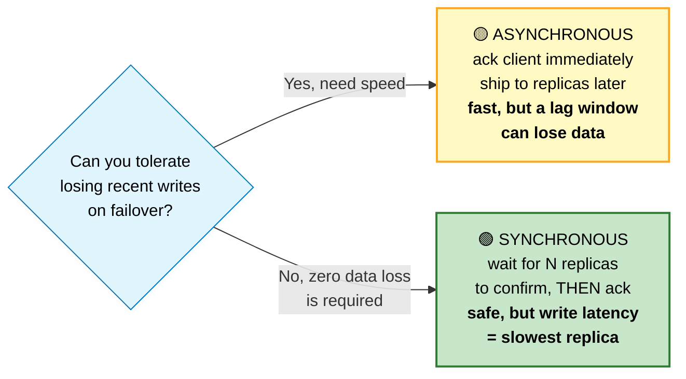

#### ⚠️ The replication lag bug you will absolutely hit

```
   1. User submits a form         → writes to PRIMARY
   2. Redirect to the detail page → reads from a REPLICA
   3. Replica is 200 ms behind    → 404 Not Found
   4. User: "my order disappeared!"

   FIXES:
   • Read-your-writes: route that user's reads to the primary
     for N seconds after they write
   • Track the write position (LSN/GTID) in the session and make
     the replica wait until it has caught up past it
   • Just read from the primary in read-after-write flows
   • Monitor lag; pull replicas out of rotation above a threshold
```

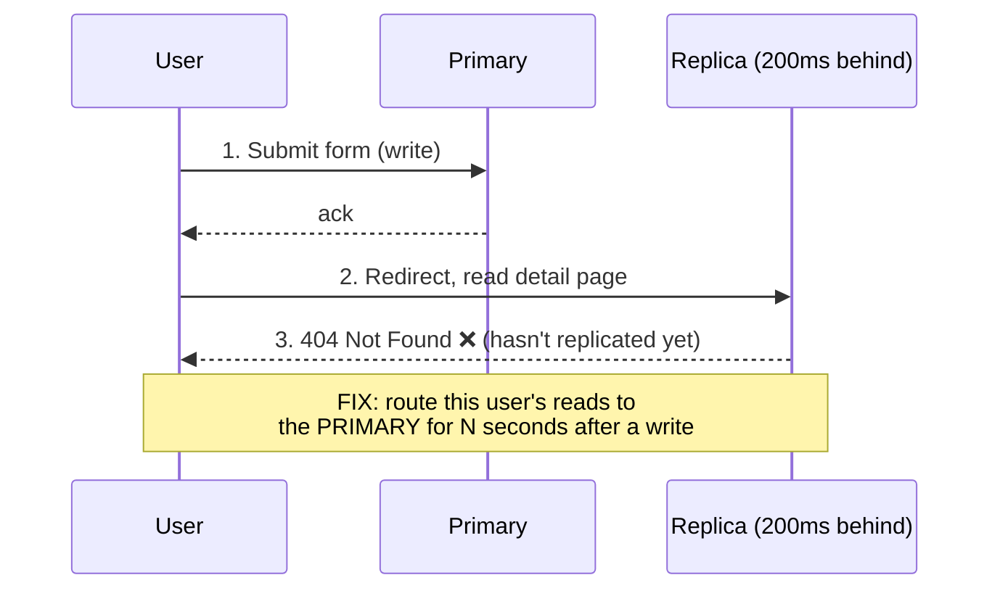

---

## 7. Partitioning / Sharding

#### 💬 What sharding is
Replication copies *the same data* to many machines. Sharding splits *different data* across machines. Replication scales reads; **sharding is the only thing that scales writes.**

```
   REPLICATION                        SHARDING
   ───────────                        ────────
   [ALL data]  [ALL data]             [users A-M]  [users N-Z]
   every node has everything          each node has a slice
   → scales READS                     → scales WRITES + storage
```

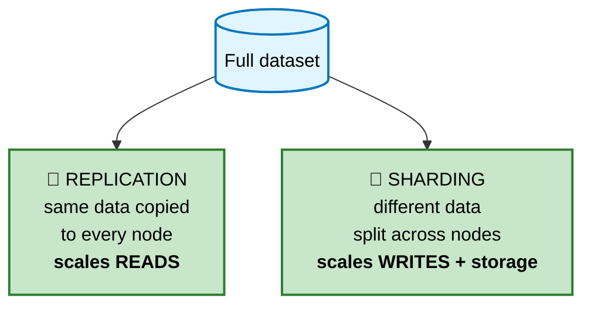

### Strategies

```
   RANGE-BASED       users 1-1M → shard A,  1M-2M → shard B
   ✅ Range queries work           ❌ HOTSPOTS — the newest shard
   ✅ Easy to reason about            takes all the new writes

   HASH-BASED        hash(user_id) % N
   ✅ Even distribution            ❌ Range queries impossible
                                   ❌ Resharding moves ~everything

   CONSISTENT HASH   ring + virtual nodes
   ✅ Adding a node moves only 1/N of keys  ← the standard answer

   DIRECTORY         a lookup service maps key → shard
   ✅ Total flexibility, easy rebalance
   ❌ The directory is a SPOF and an extra hop

   GEOGRAPHIC        shard by region
   ✅ Data residency compliance, low local latency
   ❌ Cross-region queries are painful
```

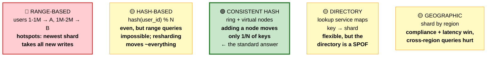

### ⚠️ What sharding costs you

```
   ❌ Cross-shard JOINs          → denormalize, or join in the app
   ❌ Cross-shard TRANSACTIONS   → sagas, or avoid entirely
   ❌ Global unique constraints  → a central ID service, or UUIDs
   ❌ Global secondary indexes   → a separate search cluster
   ❌ Aggregations over all data → scatter-gather, or a separate OLAP store
   ❌ RESHARDING                 → the hardest operation you will ever run
```

🏭 **Choosing the shard key is irreversible.** It needs high cardinality, even distribution (watch out for celebrity users), presence in most queries (or every query becomes scatter-gather), and alignment with your transaction boundaries. In B2B SaaS, `tenant_id` is usually the natural answer.

---

## 8. CAP and PACELC

#### 💬 CAP stated correctly

CAP is widely misquoted as "pick two of three." That's wrong. Partitions are not something you choose — they *happen*, because networks fail. The real statement is:

> **When a network partition occurs, you must choose between consistency and availability.**

```
                    A network partition splits your cluster:

           ┌──────────┐         ✂         ┌──────────┐
           │  Node A  │  ← no messages →  │  Node B  │
           └──────────┘                   └──────────┘
```

```mermaid
flowchart TD
    P["✂️ Network partition detected<br/>Node A cannot reach Node B"] --> Choice{"A write arrives<br/>at Node A.<br/>What do you do?"}
    Choice -->|"Refuse it, return<br/>an error"| CP["🟢 CP — CONSISTENCY<br/>'I'd rather be down<br/>than wrong.'<br/><b>Banking, inventory, locks<br/>etcd, ZooKeeper, HBase</b>"]
    Choice -->|"Accept locally,<br/>reconcile later"| AP["🟡 AP — AVAILABILITY<br/>'I'd rather be wrong for<br/>a moment than unavailable.'<br/><b>Social feeds, carts, DNS<br/>Cassandra, DynamoDB</b>"]

    style P fill:#ffcdd2,stroke:#c62828,stroke-width:2px,color:#000
    style Choice fill:#e1f5fe,stroke:#0277bd,color:#000
    style CP fill:#c8e6c9,stroke:#2e7d32,stroke-width:2px,color:#000
    style AP fill:#fff9c4,stroke:#f9a825,stroke-width:2px,color:#000

   A write arrives at node A. Node A cannot reach node B.
   Two options, and ONLY two:

   ┌──────────────────────────────┬──────────────────────────────┐
   │ CP — choose CONSISTENCY      │ AP — choose AVAILABILITY     │
   │ Refuse the write (or read).  │ Accept the write locally.    │
   │ Return an error.             │ Reconcile later.             │
   │                              │                              │
   │ "I'd rather be down than     │ "I'd rather be wrong for a   │
   │  wrong."                     │  moment than unavailable."   │
   │                              │                              │
   │ Banking, inventory, locks    │ Social feeds, shopping carts,│
   │ etcd, ZooKeeper, HBase       │ DNS, Cassandra, DynamoDB     │
   └──────────────────────────────┴──────────────────────────────┘
```

#### PACELC — the more useful version

```
   IF (Partition)  →  choose Availability or Consistency
   ELSE            →  choose Latency or Consistency

   ⭐ The "else" branch is what you actually live with day to day.
     Partitions are rare. The latency-vs-consistency tradeoff is
     present in EVERY request.

   DynamoDB   = PA/EL   available under partition, low latency otherwise
   PostgreSQL = PC/EC   consistent always, accepts the latency
   Cassandra  = PA/EL   (tunable per query)
   MongoDB    = PC/EC   (tunable)
```

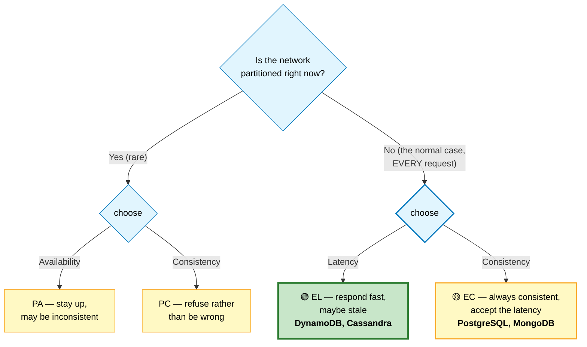

---

## 9. Consistency Models

#### 💬 A spectrum, not a switch

```
   STRONGEST ─────────────────────────────────────────▶ WEAKEST
   (slow, expensive)                           (fast, cheap)

   ┌─────────────────────────────────────────────────────────────┐
   │ LINEARIZABLE                                                │
   │ Every read sees the most recent write, globally, instantly. │
   │ The system behaves as if there's one copy.                  │
   │ Cost: coordination on every operation.                      │
   │ Use: distributed locks, leader election, financial ledgers  │
   ├─────────────────────────────────────────────────────────────┤
   │ SEQUENTIAL                                                  │
   │ All nodes see operations in the same order, but that order  │
   │ may not match real time.                                    │
   ├─────────────────────────────────────────────────────────────┤
   │ CAUSAL                                                      │
   │ Causally-related operations are seen in order by everyone.  │
   │ Concurrent operations may be seen in any order.             │
   │ Use: comment threads (a reply never appears before its post)│
   ├─────────────────────────────────────────────────────────────┤
   │ READ-YOUR-WRITES                                            │
   │ You always see your own writes. Others may lag.             │
   │ Use: profile edits, posting — the minimum users expect      │
   ├─────────────────────────────────────────────────────────────┤
   │ MONOTONIC READS                                             │
   │ Time never goes backwards for a single user.                │
   ├─────────────────────────────────────────────────────────────┤
   │ EVENTUAL                                                    │
   │ If writes stop, all replicas eventually converge.           │
   │ No guarantee about when.                                    │
   │ Use: view counts, recommendations, DNS                      │
   └─────────────────────────────────────────────────────────────┘
```

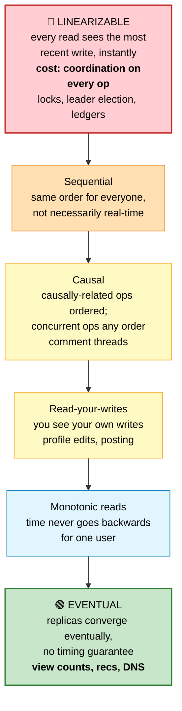

🎤 **The interview move:** never say "we'll use eventual consistency" without saying *what the user-visible consequence is*. Say instead: *"Likes can be eventually consistent — a user seeing 41 instead of 42 for a few seconds is fine. But the account balance must be strongly consistent, because showing a stale balance could let someone overdraw."*

---

## 10. Caching Strategy

```
   ┌────────────────────────────────────────────────────────┐
   │ Browser        ~0 ms      per user                     │
   ├────────────────────────────────────────────────────────┤
   │ CDN / Edge     ~10-30 ms  global, shared               │
   ├────────────────────────────────────────────────────────┤
   │ Load balancer  ~1-5 ms    per datacenter               │
   ├────────────────────────────────────────────────────────┤
   │ App in-memory  ~0.001 ms  ⚠️ NOT shared between servers │
   ├────────────────────────────────────────────────────────┤
   │ Redis          ~0.5-2 ms  shared across the app tier   │
   ├────────────────────────────────────────────────────────┤
   │ DB buffer pool ~0.1 ms    inside the database          │
   ├────────────────────────────────────────────────────────┤
   │ Disk           ~100 µs - 10 ms                         │
   └────────────────────────────────────────────────────────┘

   Rule: cache as close to the user as the freshness budget allows.
```

```mermaid
flowchart LR
    Browser["Browser<br/>~0 ms<br/>per user"] --> CDN["CDN / Edge<br/>~10-30 ms<br/>global, shared"]
    CDN --> LBc["Load balancer<br/>~1-5 ms<br/>per datacenter"]
    LBc --> AppMem["App in-memory<br/>~0.001 ms<br/>⚠️ NOT shared"]
    AppMem --> Redis["Redis<br/>~0.5-2 ms<br/>shared across app tier"]
    Redis --> DBBuf["DB buffer pool<br/>~0.1 ms<br/>inside the database"]
    DBBuf --> Disk["Disk<br/>~100 µs - 10 ms"]

    style Browser fill:#c8e6c9,stroke:#2e7d32,stroke-width:2px,color:#000
    style CDN fill:#c8e6c9,stroke:#2e7d32,color:#000
    style LBc fill:#fff9c4,stroke:#f9a825,color:#000
    style AppMem fill:#ffcdd2,stroke:#c62828,color:#000
    style Redis fill:#fff9c4,stroke:#f9a825,color:#000
    style DBBuf fill:#fff9c4,stroke:#f9a825,color:#000
    style Disk fill:#ffcdd2,stroke:#c62828,color:#000
```

The three failure modes you must be able to name — stampede, penetration, avalanche — plus their fixes, are covered in depth in **[Caching](../03-backend/caching.md)**.

**The one-line version:**
- **Stampede** — a hot key expires and 1,000 requests hit the DB at once. Fix: TTL jitter + probabilistic early refresh, or a lock with stale-serving.
- **Penetration** — requests for keys that don't exist bypass the cache entirely. Fix: cache negatives, or a bloom filter.
- **Avalanche** — mass expiry or the cache dying takes out the DB. Fix: jitter, multi-level cache, circuit breaker, and **serve stale on error**.

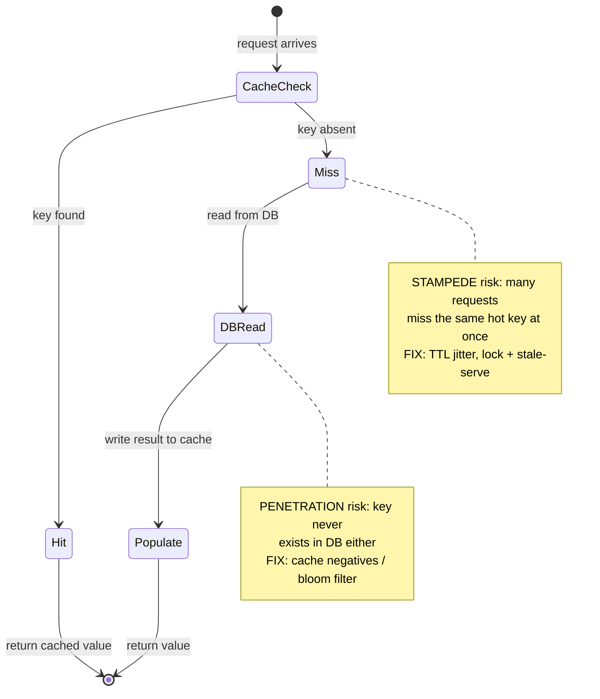

---

## 11. Asynchronous Processing

#### 💬 The core question
For every operation ask: **does the user need this finished before I respond?**

```
   SYNCHRONOUS                        ASYNCHRONOUS
   User waits                         User doesn't wait

   • Payment authorization            • Sending confirmation email
   • Login                            • Generating a thumbnail
   • Reading their own data           • Updating analytics
   • Anything they'll see immediately • Notifying the warehouse
                                      • Recomputing recommendations
                                      • Indexing for search
```

```
   ┌────────┐                    ┌────────┐
   │  API   │───▶ [ QUEUE ] ───▶ │ WORKER │
   └────────┘                    └────────┘
        │                             │
        └─ responds in 50 ms          └─ takes 5 seconds, nobody waits

   WHAT THE QUEUE BUYS YOU
   ✅ Fast API responses
   ✅ Traffic spikes get BUFFERED, not shed
   ✅ Worker downtime delays work, doesn't lose it
   ✅ Independent scaling of API and workers
   ✅ Add new consumers without touching the producer

   WHAT IT COSTS
   ❌ Eventual consistency — it isn't done when you replied
   ❌ Duplicates (at-least-once delivery is the practical default)
   ❌ Debugging spans processes and time
   ❌ Backpressure must be designed, not assumed
```

```mermaid
sequenceDiagram
    participant C as Client
    participant A as API
    participant Q as Queue
    participant W as Worker

    C->>A: request
    A->>Q: enqueue job
    A-->>C: 200 OK (~50 ms)
    Note over C,A: user doesn't wait
    Q->>W: deliver job
    W->>W: process (~5 sec)
    Note over W: traffic spikes are BUFFERED,<br/>not shed; worker downtime<br/>delays work, doesn't lose it
```

⭐ **The outbox pattern** is the single most important thing to know here: you cannot atomically write to your database *and* publish to a queue. Write both to the database in one transaction, and have a relay publish from the outbox table. Full detail in [Queues & Streaming](../03-backend/queues-streaming.md#10-outbox-pattern).

---

## 12. Failure and Resilience

#### 💬 The mindset shift
At small scale, failure is an exception. At scale, **failure is constant**. With 10,000 servers and a 3-year MTBF, something is failing roughly every 2.6 hours. Design for it as the normal case.

### The resilience toolkit

```
   ┌──────────────────────────────────────────────────────────────┐
   │ TIMEOUT — never wait forever                                 │
   │   Every network call needs one. A missing timeout is how      │
   │   one slow dependency exhausts your entire thread pool.       │
   │   ⭐ Callers must time out FASTER than the callee's own limit  │
   ├──────────────────────────────────────────────────────────────┤
   │ RETRY — with exponential backoff + JITTER                    │
   │   Without jitter, all clients retry in lockstep and hammer    │
   │   the recovering service back down. ("thundering herd")       │
   │   ⚠️ Only retry IDEMPOTENT operations                          │
   ├──────────────────────────────────────────────────────────────┤
   │ CIRCUIT BREAKER — stop calling a service that's clearly down │
   │                                                              │
   │      CLOSED ──failures exceed threshold──▶ OPEN              │
   │        ▲                                     │               │
   │        │                              after a cooldown       │
   │        │                                     ▼               │
   │        └──── success ──────────────── HALF-OPEN              │
   │                                    (let one probe through)   │
   │                                                              │
   │   Turns a slow cascading failure into a FAST, contained one. │
   │                                                              │
   │   (diagrammed below)                                         │
   ├──────────────────────────────────────────────────────────────┤
   │ BULKHEAD — isolate resource pools                            │
   │   Separate thread pools/connection pools per dependency, so   │
   │   one saturated downstream can't consume everything.          │
   ├──────────────────────────────────────────────────────────────┤
   │ RATE LIMIT — protect yourself from clients AND yourself       │
   ├──────────────────────────────────────────────────────────────┤
   │ GRACEFUL DEGRADATION — serve something rather than nothing   │
   │   Recommendations down? Show a static list.                   │
   │   Cache down? Serve stale.                                    │
   │   Search down? Show browse categories.                        │
   └──────────────────────────────────────────────────────────────┘
```

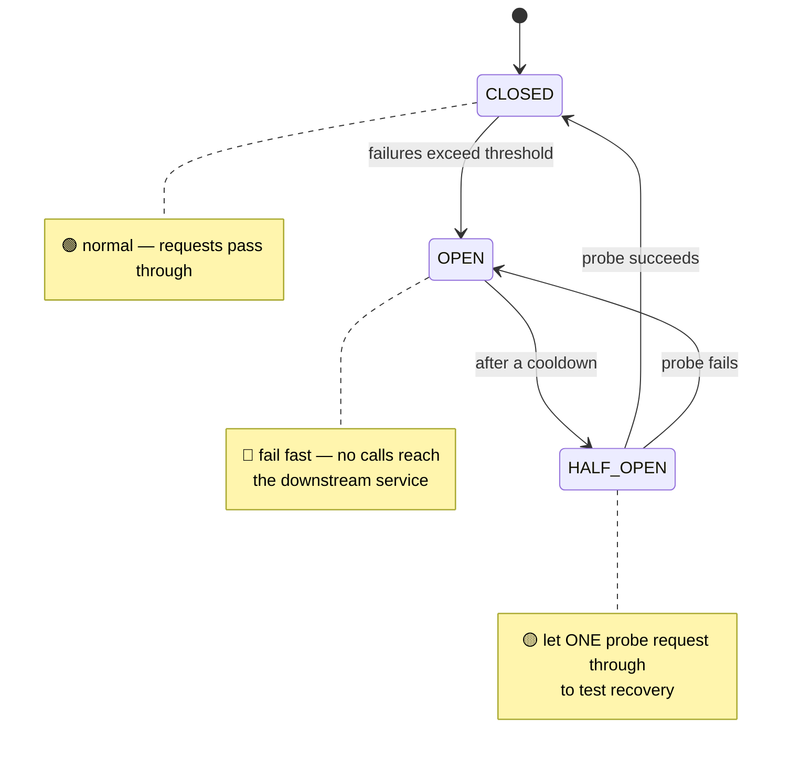

#### ⚠️ Cascading failure — how outages actually happen

```
   1. Service C slows down (a bad deploy, a slow query)
   2. Service B's calls to C pile up, threads block
   3. Service B's thread pool exhausts → B stops responding
   4. Service A's calls to B pile up → A exhausts
   5. The whole system is down because of ONE slow dependency

   BREAK THE CHAIN:
   • Timeouts (step 2 never happens)
   • Circuit breakers (step 3 fails fast instead of blocking)
   • Bulkheads (step 4 is contained to one pool)
   • Load shedding (reject early rather than queue forever)
```

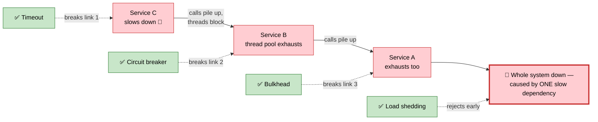

### Single points of failure

```
   Walk your architecture diagram and ask of EVERY box:
   "if this dies right now, what happens?"

   Common SPOFs people miss:
   □ The load balancer itself
   □ The primary database (do you have automatic failover? TESTED?)
   □ The cache (does the DB survive full traffic?)
   □ DNS
   □ The service discovery registry
   □ The CI/CD system (can you deploy a fix during an outage?)
   □ A single availability zone
   □ Your certificate expiring
```

---

## 13. Estimation

#### 💬 Why interviewers ask for this
Not because the numbers matter. Because it shows whether you can reason about magnitudes — and whether your design is even in the right ballpark. A design that needs 500 servers and a design that needs 5 look completely different.

### The template

```
   ┌─ 1. USERS ────────────────────────────────────────────────┐
   │  DAU (daily active users)                                 │
   │  Actions per user per day                                 │
   ├─ 2. QPS ──────────────────────────────────────────────────┤
   │  Average QPS = (DAU × actions) / 86,400                    │
   │  Peak QPS    = average × 2 to 10   ⭐ always state this     │
   ├─ 3. STORAGE ──────────────────────────────────────────────┤
   │  Bytes per item × items per day × retention               │
   │  × replication factor (usually 3)                          │
   ├─ 4. BANDWIDTH ────────────────────────────────────────────┤
   │  QPS × payload size                                        │
   ├─ 5. MEMORY (cache) ───────────────────────────────────────┤
   │  Apply the 80/20 rule: cache the hot 20%                   │
   └───────────────────────────────────────────────────────────┘
```

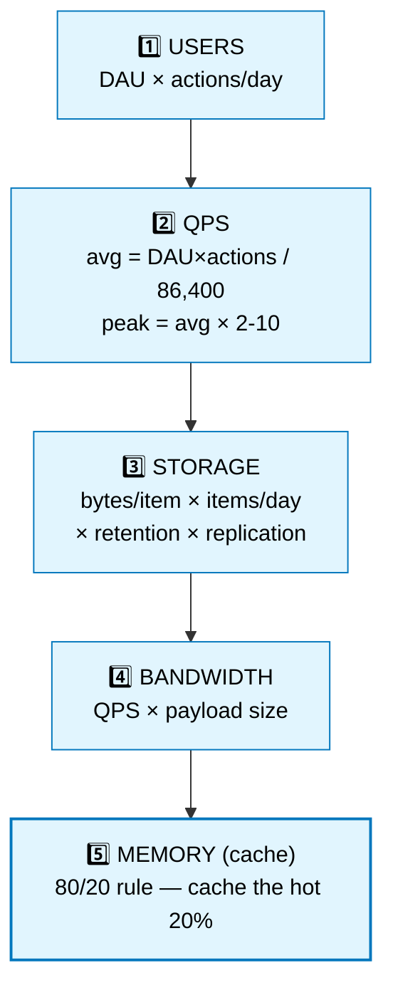

### 📊 Worked example — a Twitter-like service

```
   ASSUMPTIONS (state them out loud, and round aggressively)
   • 300M DAU
   • Each user reads 100 tweets/day, posts 0.1 tweets/day
   • Tweet = 300 bytes text + metadata ≈ 1 KB stored
   • 10% of tweets include an image (~200 KB)

   ─── QPS ───────────────────────────────────────────────
   Reads:  300M × 100 / 86,400  ≈  350,000 QPS  average
                                ≈  1M QPS       peak (×3)

   Writes: 300M × 0.1 / 86,400  ≈  350 QPS      average
                                ≈  1,000 QPS    peak

   ⭐ READ:WRITE ≈ 1000:1  → this is a READ-HEAVY system.
     That single ratio drives the entire design:
     aggressive caching, read replicas, fan-out on write,
     precomputed timelines.

   ─── STORAGE ───────────────────────────────────────────
   Tweets/day  = 300M × 0.1 = 30M tweets
   Text/day    = 30M × 1 KB = 30 GB/day
   Images/day  = 3M × 200 KB = 600 GB/day
   Total       ≈ 630 GB/day  ≈ 230 TB/year
   With 3× replication ≈ 700 TB/year

   ─── BANDWIDTH ─────────────────────────────────────────
   Read egress = 350K QPS × 1 KB ≈ 350 MB/s ≈ 2.8 Gbps
   (images go through a CDN, so they don't hit origin)

   ─── CACHE ─────────────────────────────────────────────
   Cache the 20% of tweets that get 80% of reads:
   Daily active tweets ≈ 30M × 0.2 = 6M × 1 KB = 6 GB
   Plus timelines: 300M users × 200 tweet IDs × 8 bytes = 480 GB
   → sizeable but very feasible on a Redis cluster
```

```mermaid
flowchart LR
    DAU["300M DAU"] --> Reads["Reads: 350K QPS avg<br/>~1M QPS peak"]
    DAU --> Writes["Writes: 350 QPS avg<br/>~1,000 QPS peak"]
    Reads --> Ratio["⭐ READ:WRITE ≈ 1000:1<br/><b>READ-HEAVY system</b>"]
    Writes --> Ratio
    Ratio --> Design["Drives the design:<br/>aggressive caching,<br/>read replicas,<br/>fan-out on write,<br/>precomputed timelines"]

    style DAU fill:#e1f5fe,stroke:#0277bd,color:#000
    style Reads fill:#fff9c4,stroke:#f9a825,color:#000
    style Writes fill:#fff9c4,stroke:#f9a825,color:#000
    style Ratio fill:#c8e6c9,stroke:#2e7d32,stroke-width:3px,color:#000
    style Design fill:#c8e6c9,stroke:#2e7d32,stroke-width:2px,color:#000
```

🎤 **How to present this:** round to powers of ten, say your assumptions out loud, and — most importantly — **state what the numbers imply**. "1000:1 read-to-write means I'll precompute timelines on write rather than compute on read" is the sentence that earns the points, not the arithmetic.

---

## 14. Evolution

#### 💬 How real architectures actually grow
Nobody starts with microservices and Kafka. Systems evolve under pressure, and each stage is a response to a specific pain.

```
   ── STAGE 1: 0 → 1,000 users ─────────────────────────────────
   ┌────────────────────────┐
   │  One box: app + DB     │      Monolith. SQLite or Postgres.
   └────────────────────────┘      Deploy = git push.
   Pain: none. This is correct. Don't over-engineer.

   ── STAGE 2: 1K → 10K ────────────────────────────────────────
   ┌────────┐      ┌────────┐
   │  App   │─────▶│   DB   │      Split app and DB.
   └────────┘      └────────┘      Add a CDN for static assets.
   Pain: the DB and app compete for CPU/RAM.

   ── STAGE 3: 10K → 100K ──────────────────────────────────────
              ┌────┐  ┌────┐
   LB ───────▶│App │  │App │       Multiple stateless app servers.
              └──┬─┘  └─┬──┘       Sessions → Redis.
                 └──┬───┘          Add a cache layer.
              ┌─────▼─────┐        Add read replicas.
              │ Redis     │
              ├───────────┤
              │ DB primary│──▶ replica ──▶ replica
              └───────────┘
   Pain: one app server can't take the traffic; DB reads saturate.

   ── STAGE 4: 100K → 1M ───────────────────────────────────────
   + Message queue for async work
   + Object storage for uploads
   + Search cluster (Elasticsearch)
   + Multiple availability zones
   + Real monitoring and alerting
   Pain: slow endpoints block fast ones; deploys are risky.

   ── STAGE 5: 1M → 10M+ ───────────────────────────────────────
   + Split the monolith where team boundaries demand it
   + Shard the database (LAST resort)
   + Multi-region for latency and DR
   + Data warehouse for analytics (separate from OLTP)
   + Service mesh, distributed tracing
   Pain: organizational as much as technical — teams block each other.
```

```mermaid
flowchart LR
    S1["Stage 1<br/>0→1K users<br/>🟢 monolith<br/>app + DB, one box"] --> S2["Stage 2<br/>1K→10K<br/>🟢 split app / DB<br/>+ CDN"]
    S2 --> S3["Stage 3<br/>10K→100K<br/>🟡 LB + stateless app<br/>+ Redis + read replicas"]
    S3 --> S4["Stage 4<br/>100K→1M<br/>🟡 + queue, object storage,<br/>search, multi-AZ"]
    S4 --> S5["Stage 5<br/>1M→10M+<br/>🔴 shard DB, multi-region,<br/>service mesh — LAST resort"]

    style S1 fill:#c8e6c9,stroke:#2e7d32,stroke-width:2px,color:#000
    style S2 fill:#c8e6c9,stroke:#2e7d32,color:#000
    style S3 fill:#fff9c4,stroke:#f9a825,color:#000
    style S4 fill:#fff9c4,stroke:#f9a825,stroke-width:2px,color:#000
    style S5 fill:#ffcdd2,stroke:#c62828,stroke-width:2px,color:#000
```

⚠️ **Every stage adds complexity that costs you forever.** Only advance when a specific, measured pain forces you to. "We might need to scale someday" is not a reason.

---

## 15. Cheat Sheet

```
╔══════════════════════════════════════════════════════════════════════╗
║                 SYSTEM DESIGN FUNDAMENTALS — ONE PAGE                ║
╠══════════════════════════════════════════════════════════════════════╣
║ FIRST RULE: don't distribute until you must. One good Postgres box   ║
║   handles most products. Every machine you add adds a failure mode.  ║
╠══════════════════════════════════════════════════════════════════════╣
║ LATENCY (memorize the SHAPE)                                         ║
║   RAM 100ns · SSD 150µs · datacenter RTT 500µs · disk seek 10ms      ║
║   cross-continent 150ms                                              ║
║   → cache in memory · batch network calls · never cross-region       ║
║     in a request path                                                ║
╠══════════════════════════════════════════════════════════════════════╣
║ SCALE ORDER: vertical → read replicas → cache → horizontal(stateless)║
║   → partition → SHARD (last, irreversible)                           ║
╠══════════════════════════════════════════════════════════════════════╣
║ STATELESSNESS is what makes horizontal scaling possible.             ║
║   sessions→Redis · files→S3 · nothing on local disk                  ║
╠══════════════════════════════════════════════════════════════════════╣
║ REPLICATION scales READS · SHARDING scales WRITES                    ║
║   ⚠️ replication lag → read-your-writes bug. Route to primary after   ║
║      a write, or wait for the LSN.                                   ║
║ CONSISTENT HASHING: adding a node moves 1/N of keys, not all of them ║
║   (use ~150 virtual nodes per physical node)                         ║
╠══════════════════════════════════════════════════════════════════════╣
║ CAP: partitions HAPPEN. When one does, choose C or A.                ║
║   PACELC is more useful: Else, choose Latency or Consistency —       ║
║   that's the tradeoff present in EVERY request.                      ║
║ Name the USER-VISIBLE consequence of your consistency choice.        ║
╠══════════════════════════════════════════════════════════════════════╣
║ ASYNC: "does the user need this before I respond?"                   ║
║   ⭐ OUTBOX PATTERN — you cannot atomically write DB + queue          ║
╠══════════════════════════════════════════════════════════════════════╣
║ RESILIENCE: timeout · retry+backoff+JITTER · circuit breaker ·       ║
║   bulkhead · rate limit · graceful degradation · SERVE STALE         ║
║   Cascading failure = slow dependency + no timeout + no breaker      ║
╠══════════════════════════════════════════════════════════════════════╣
║ ESTIMATION: DAU → QPS (peak = avg × 2-10) → storage → bandwidth      ║
║   1M requests/day ≈ 12 QPS   ·   1 day ≈ 10⁵ sec                     ║
║   ⭐ The read:write RATIO drives the whole design                     ║
╚══════════════════════════════════════════════════════════════════════╝
```

---

**Next:** [Building Blocks →](01-building-blocks.md) · **Related:** [Databases](../03-backend/databases.md) · [Caching](../03-backend/caching.md) · [Queues](../03-backend/queues-streaming.md)
