# 🧱 Building Blocks

> Every system design answer is assembled from about fifteen components. This book is the parts catalogue: what each one does, when to reach for it, and what it costs you.

**Prerequisite:** [Fundamentals](00-fundamentals.md)

---

## 📑 The Catalogue

| # | Block | Solves |
|---|---|---|
| 1 | [DNS](#1-dns) | Name → address |
| 2 | [CDN](#2-cdn) | Static content latency |
| 3 | [Load Balancer](#3-load-balancer) | Distributing traffic |
| 4 | [API Gateway](#4-api-gateway) | Cross-cutting concerns at the edge |
| 5 | [Application Servers](#5-application-servers) | Business logic |
| 6 | [Relational Database](#6-relational-database) | Structured data + transactions |
| 7 | [NoSQL Stores](#7-nosql-stores) | Scale, flexible schema |
| 8 | [Cache](#8-cache) | Read latency |
| 9 | [Object Storage](#9-object-storage) | Files, blobs, media |
| 10 | [Message Queue](#10-message-queue) | Decoupling, buffering |
| 11 | [Event Stream](#11-event-stream) | Replayable event log |
| 12 | [Search Engine](#12-search-engine) | Full-text, faceted search |
| 13 | [Coordination Service](#13-coordination-service) | Locks, leader election, config |
| 14 | [Rate Limiter](#14-rate-limiter) | Abuse and overload protection |
| 15 | [Unique ID Generator](#15-unique-id-generator) | Distributed IDs |
| 16 | [Observability Stack](#16-observability-stack) | Knowing what's happening |

---

## 1. DNS

#### 💬 What it does
Translates `api.example.com` into an IP address. It's also your **first and cheapest traffic-routing tool** — before a request even reaches your infrastructure, DNS can decide which datacenter it goes to.

```
   Browser cache → OS cache → router → ISP resolver
        │
        └──▶ Root (.) ──▶ TLD (.com) ──▶ Authoritative NS ──▶ IP

   Each hop is cached. A cold lookup is ~20-120ms; a warm one is ~0.
```


### Routing policies — the design lever

| Policy | Behaviour | Use for |
|---|---|---|
| **Simple** | One record, one IP | Single region |
| **Weighted** | 90% here, 10% there | Canary deploys, gradual migration ⭐ |
| **Latency-based** | Nearest region by measured latency | Global apps |
| **Geolocation** | Route by user's country | Data residency, localized content |
| **Failover** | Primary, fall back to secondary on health check fail | DR ⭐ |
| **Multi-value** | Return several healthy IPs | Poor-man's load balancing |

⚠️ **TTL is a tradeoff.** Low TTL (60s) means fast failover but heavy DNS query load. High TTL (86400s) means cheap and fast, but a failover takes a day to propagate. Standard practice: low TTL (60-300s) for anything you might need to move, high TTL for stable records.

⚠️ **Clients ignore TTL.** Java's default DNS caching used to be *forever*. Browsers pin. Don't rely on DNS alone for failover — pair it with a load balancer that can shift traffic instantly.

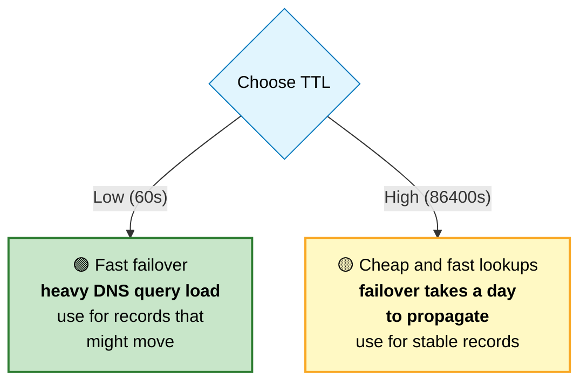

---

## 2. CDN

#### 💬 What it does
Copies your content to servers physically near your users. A user in Tokyo hits a Tokyo edge server instead of your origin in Virginia — turning 150ms into 10ms.

```
   WITHOUT CDN                        WITH CDN
   ───────────                        ────────
   Tokyo user ──150ms──▶ Virginia     Tokyo user ──10ms──▶ Tokyo edge
                                                              │
                                                     (cache miss only)
                                                              ▼
                                                          Virginia
```

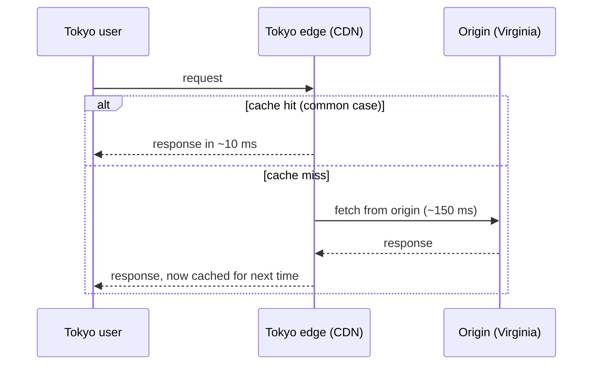

### What to put on a CDN

```
   ✅ ALWAYS               Images, CSS, JS, fonts, video, downloads
   ✅ OFTEN                API GET responses that are cacheable
   ✅ INCREASINGLY         Full HTML pages (with short TTL or SWR)
   ❌ NEVER                Anything user-specific without careful
                           cache-key design (you WILL leak data)
```

### Cache key design — where people get burned

```
   Default cache key = host + path + query string

   ⚠️ /page?utm_source=twitter  is a DIFFERENT key from /page
      → tracking params destroy your hit rate
      → strip them at the edge

   ⚠️ Vary: Cookie  is catastrophic — every distinct cookie value
      creates a separate cache entry. Hit rate → 0.

   ✅ Vary: Accept-Encoding    (gzip vs brotli — necessary)
   ✅ Vary: Accept-Language    (if you serve localized content)
```

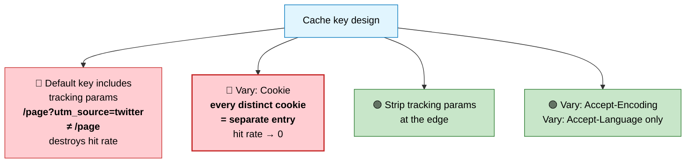

### Invalidation

```
   PATH PURGE        /products/123          precise, fast
   WILDCARD PURGE    /products/*            often slow / rate-limited
   TAG PURGE ⭐       Surrogate-Key header   purge many URLs at once
   VERSIONED URLs    /app.a1b2c3.js         NEVER purge — new URL instead
```

🏭 **The two-tier strategy** (from [Browser Performance](../02-frontend/browser-performance.md)): HTML gets `no-cache` so deploys take effect instantly; content-hashed assets get `max-age=31536000, immutable` so they're cached forever. Best of both.

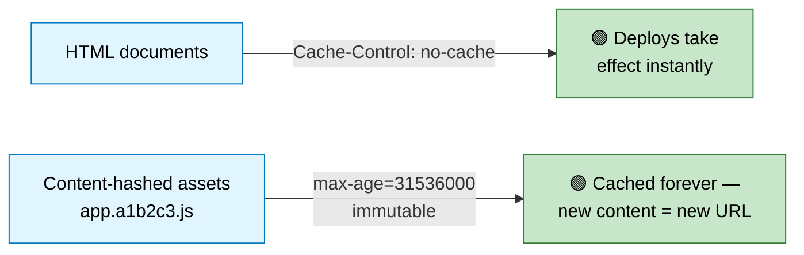

---

## 3. Load Balancer

#### 💬 What it does
Distributes requests across servers, removes unhealthy ones from rotation, and terminates TLS. Covered in depth in [Fundamentals §4](00-fundamentals.md#4-load-balancing) — here's what matters when you're drawing the diagram.

```
   ┌─────────────────────────────────────────────────────────┐
   │ GLOBAL (DNS / Anycast)                                  │
   │   routes users to the nearest REGION                    │
   ├─────────────────────────────────────────────────────────┤
   │ REGIONAL L4 (NLB)                                       │
   │   spreads across availability zones, very high throughput│
   ├─────────────────────────────────────────────────────────┤
   │ L7 (ALB / nginx / Envoy)                                │
   │   path routing, TLS termination, WAF, header rewriting  │
   ├─────────────────────────────────────────────────────────┤
   │ SERVICE MESH SIDECAR (Envoy)                            │
   │   service-to-service: retries, circuit breaking, mTLS   │
   └─────────────────────────────────────────────────────────┘
```

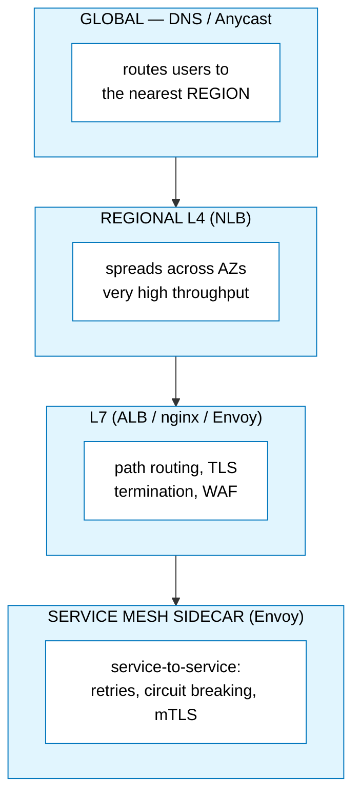

⚠️ **The load balancer is itself a SPOF.** In cloud, managed LBs are multi-AZ by default. Self-hosted, you need at least two with a floating IP (keepalived/VRRP) or DNS failover.

### Health checks — get these right

```
   SHALLOW (liveness)   GET /health/live  → "is the process alive?"
                        Must NOT check dependencies. If your DB is down,
                        killing every app server makes things worse.

   DEEP (readiness)     GET /health/ready → "can I serve traffic?"
                        Checks DB, cache, critical deps.
                        Failing = remove from LB, but DON'T restart.

   ⭐ Conflating these is a classic outage: a brief DB blip fails the
     liveness probe, Kubernetes restarts every pod simultaneously,
     and now you have a cold-start stampede on top of the DB problem.
```

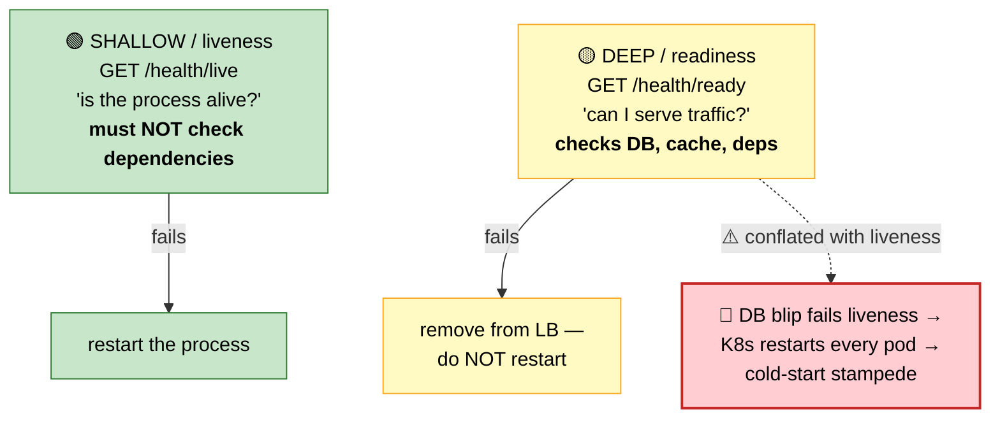

---

## 4. API Gateway

#### 💬 What it does
A single front door that handles everything you don't want repeated in every service.

```
                        ┌─────────────────────────┐
   Clients ────────────▶│     API GATEWAY         │
                        │                         │
                        │  • Authentication       │
                        │  • Rate limiting        │
                        │  • Request routing      │
                        │  • Request/response     │
                        │    transformation       │
                        │  • API versioning       │
                        │  • Logging / tracing    │
                        │  • Response caching     │
                        │  • Circuit breaking     │
                        └───┬────────┬────────┬───┘
                            ▼        ▼        ▼
                        ┌──────┐ ┌──────┐ ┌──────┐
                        │ Svc  │ │ Svc  │ │ Svc  │
                        │  A   │ │  B   │ │  C   │
                        └──────┘ └──────┘ └──────┘
```

**Why it's worth it:** without a gateway, every service reimplements auth, rate limiting, and logging — inconsistently. With one, they're solved once.

⚠️ **The risk: it becomes a distributed monolith.** If business logic creeps into the gateway, every team now needs to change the gateway to ship a feature, and it becomes the bottleneck it was meant to remove. Keep it to *cross-cutting concerns only*.

**BFF (Backend for Frontend)** is a useful variant: one gateway per client type, so the mobile app gets a payload shaped for mobile without the web team's needs interfering.

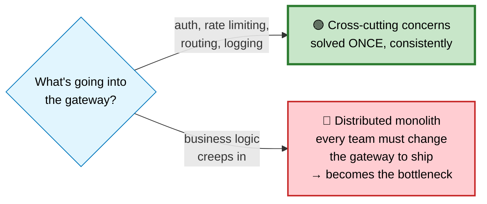

---

## 5. Application Servers

#### 💬 The one rule
**Stateless.** Every design decision follows from that. See [Fundamentals §5](00-fundamentals.md#5-statelessness).

```
   SIZING RULE OF THUMB

   threads/workers ≈ cores × (1 + wait_time / compute_time)

   CPU-bound work  (wait ≈ 0)     → workers ≈ cores
   I/O-bound work  (wait >> compute) → many more workers,
                                        or async I/O

   ⚠️ Each worker holds its own DB connections.
     20 app servers × 20-connection pool = 400 DB connections.
     Your database probably can't take that. Use a pooler (PgBouncer).
```

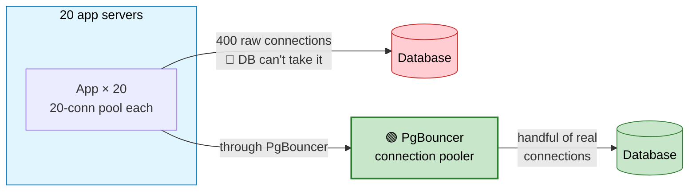

---

## 6. Relational Database

#### 💬 When it's the right answer
**Almost always, to start.** You get ACID transactions, referential integrity, a query language that handles questions you didn't anticipate, and thirty years of tooling. Modern PostgreSQL also does JSON, full-text search, geospatial, and vector similarity — so "we need flexible schema" usually isn't a reason to leave.

```
   SCALING A RELATIONAL DB — in order

   1. Indexes + query tuning        ← 90% of "we need to scale" is this
   2. Connection pooling            (PgBouncer)
   3. Caching layer                 (Redis in front)
   4. Read replicas                 (scales reads)
   5. Table partitioning            (within one DB — often enough)
   6. Vertical scaling              (bigger box; goes very far)
   7. Archive cold data             (move old rows out)
   8. SHARD                         ← last resort, irreversible
```

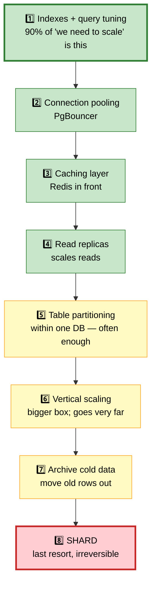

Full detail in **[Databases](../03-backend/databases.md)**.

---

## 7. NoSQL Stores

```
   ┌────────────────┬─────────────────────┬──────────────────────────┐
   │ Type           │ Examples            │ Reach for it when...     │
   ├────────────────┼─────────────────────┼──────────────────────────┤
   │ KEY-VALUE      │ Redis, DynamoDB,    │ Simple lookups by key,   │
   │                │ Memcached           │ caching, sessions        │
   ├────────────────┼─────────────────────┼──────────────────────────┤
   │ DOCUMENT       │ MongoDB, Couchbase, │ Aggregates always read   │
   │                │ Firestore           │ together; varied schema  │
   ├────────────────┼─────────────────────┼──────────────────────────┤
   │ WIDE-COLUMN    │ Cassandra, Scylla,  │ Massive write throughput,│
   │                │ HBase, Bigtable     │ time-series, known access│
   ├────────────────┼─────────────────────┼──────────────────────────┤
   │ GRAPH          │ Neo4j, Neptune      │ Multi-hop traversals:    │
   │                │                     │ social, fraud, recs      │
   ├────────────────┼─────────────────────┼──────────────────────────┤
   │ TIME-SERIES    │ InfluxDB, Timescale,│ Metrics, IoT, monitoring │
   │                │ Prometheus          │                          │
   ├────────────────┼─────────────────────┼──────────────────────────┤
   │ SEARCH         │ Elasticsearch,      │ Full-text with ranking,  │
   │                │ OpenSearch          │ faceting, log analytics  │
   ├────────────────┼─────────────────────┼──────────────────────────┤
   │ VECTOR         │ pgvector, Pinecone, │ Semantic search, RAG     │
   │                │ Milvus, Qdrant      │                          │
   └────────────────┴─────────────────────┴──────────────────────────┘
```

#### 💬 The honest tradeoff
NoSQL trades **query flexibility and transactional guarantees** for **scale and predictable latency**. If you don't need that scale, you're paying the cost without getting the benefit.

The specific thing you give up with Cassandra or DynamoDB: **you must know your access patterns before you create the table.** Adding a new query pattern later often means a migration or a new index. With SQL you just write a different query.

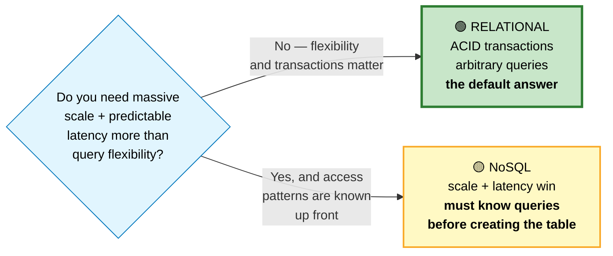

```
   ⚠️ CASSANDRA'S FAILURE MODE: the unbounded partition

   PRIMARY KEY ((room_id), created_at)
                 ▲
                 └─ a busy chat room's partition grows forever
                    → reads time out, compaction chokes

   FIX: bucket by time
   PRIMARY KEY ((room_id, month), created_at)
   → target partitions under ~100 MB
```

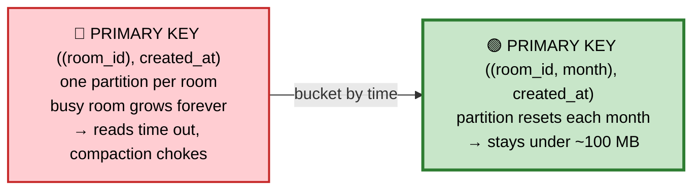

---

## 8. Cache

Covered fully in **[Caching](../03-backend/caching.md)**. The design-interview essentials:

```
   PATTERN: cache-aside is the default
     read:  check cache → miss → read DB → populate
     write: write DB → DELETE the key (not update — that races)

   ⭐ THE THREE FAILURES YOU MUST NAME
     STAMPEDE     hot key expires, N requests hit the DB simultaneously
                  → TTL jitter + probabilistic early refresh, or
                    a lock with stale-serving
     PENETRATION  requests for keys that don't exist bypass the cache
                  → cache negatives with a short TTL, or a bloom filter
     AVALANCHE    mass expiry or cache death takes out the DB
                  → jitter + L1 cache + circuit breaker + SERVE STALE

   ⭐ "Serve stale on error" is the highest-value resilience pattern
     in caching. A 10-minute-old price beats a 500 error.
```

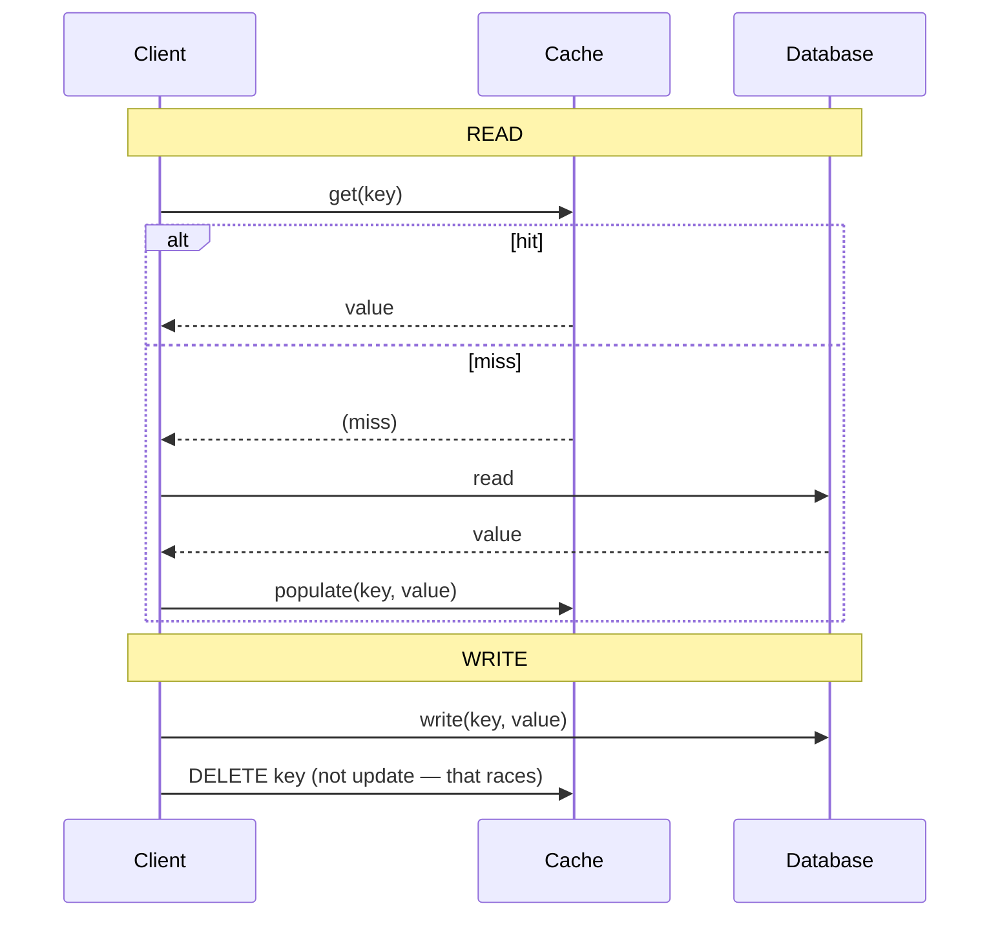

---

## 9. Object Storage

#### 💬 What it's for
Files. Images, video, backups, logs, data lake files. Effectively infinite, very cheap, very durable (S3 quotes 11 nines), but **not** a filesystem — no partial updates, no rename, higher latency than a disk.

```
   ⭐ THE PRESIGNED URL PATTERN — always mention this

   ❌ NAIVE                            ✅ PRESIGNED
   Client ──▶ Your server ──▶ S3       Client ──▶ Your server
                                              (asks for a URL)
   Your bandwidth: 2× the file          Client ◀── signed URL
   Your servers: tied up for            Client ──────────────▶ S3
     the whole upload                          (direct upload)
   Timeouts on large files
                                        Your bandwidth: ~0
                                        Your servers: free instantly
```

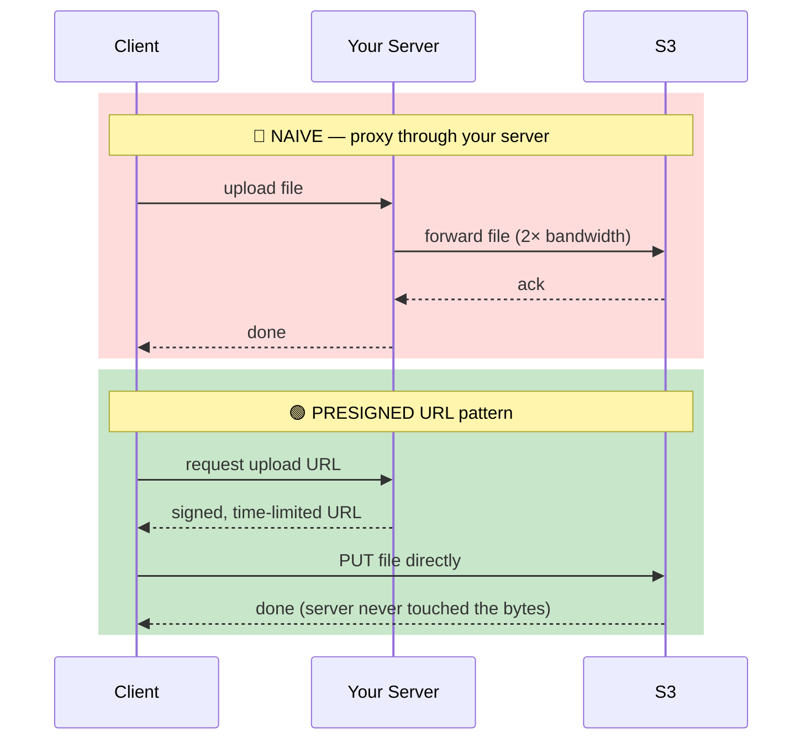

```python
# Server issues a time-limited, scope-limited upload URL
url = s3.generate_presigned_url(
    'put_object',
    Params={'Bucket': 'uploads', 'Key': f'user/{uid}/{uuid4()}.jpg',
            'ContentType': 'image/jpeg'},
    ExpiresIn=300,          # 5 minutes
)
# Client PUTs directly to S3. Server never touches the bytes.
```

### Storage classes — cost engineering

```
   Hot      (S3 Standard)      instant access, highest cost
   Warm     (Infrequent Access) instant, cheaper storage, retrieval fee
   Cold     (Glacier)          minutes to hours to retrieve, very cheap
   Archive  (Deep Archive)     12+ hours, cheapest

   ⭐ Lifecycle policies move objects automatically:
     "after 30 days → IA, after 90 → Glacier, after 365 → delete"
     This routinely cuts storage bills by 60-80%.
```

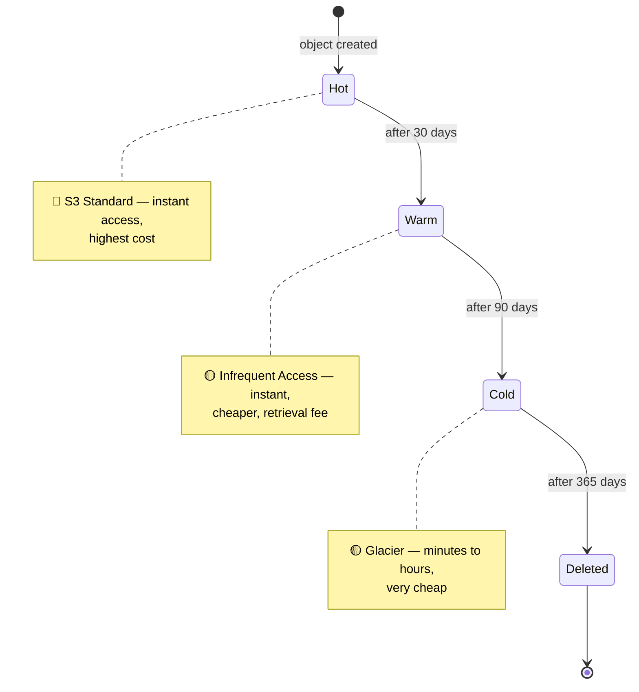

---

## 10. Message Queue

```
   Producer ──▶ [ QUEUE ] ──▶ Consumer
                             (competing consumers: each
                              message goes to exactly ONE)

   Message is DELETED once acknowledged.
```

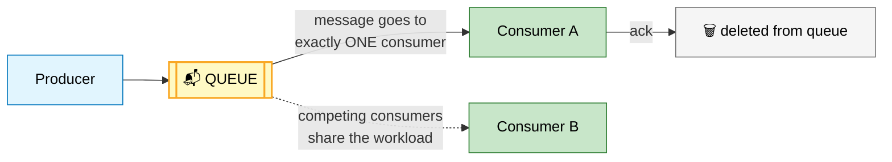

**Use for:** task distribution, decoupling, load leveling, retry with backoff, work that individual messages need treated individually (priority, delay, selective ack).

**Examples:** RabbitMQ, SQS, Redis Streams (in queue mode), Beanstalkd.

---

## 11. Event Stream

```
   offset:  0   1   2   3   4   5   6   7
          ┌───┬───┬───┬───┬───┬───┬───┬───┐
          │ e │ e │ e │ e │ e │ e │ e │ e │   append-only, RETAINED
          └───┴───┴───┴───┴───┴───┴───┴───┘
                    ▲               ▲
              consumer A       consumer B
              (offset 3)       (offset 7)

   Messages are NOT deleted on read. Each consumer group
   tracks its own position. REPLAY is trivial.
```

#### 💬 Queue or stream? The deciding question

```
   "DO THIS JOB"        → QUEUE
     one worker should handle it
     it's a task, not a fact
     may need priority, delay, or individual retry

   "THIS HAPPENED"      → STREAM
     several independent parties care
     you may want to replay history
     new consumers should see past events
```

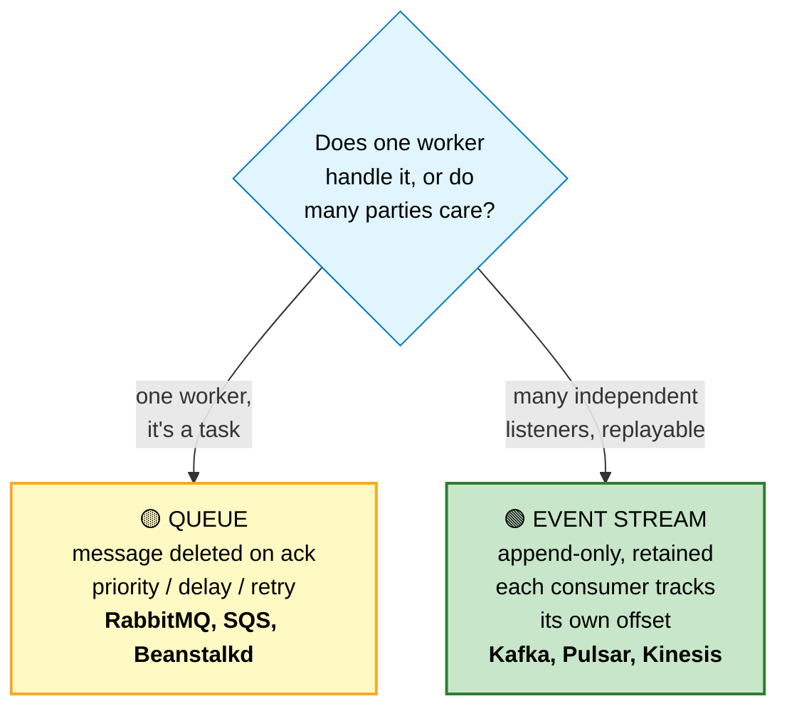

**Examples:** Kafka, Pulsar, Kinesis, Redpanda.

Full detail in **[Queues & Streaming](../03-backend/queues-streaming.md)**.

---

## 12. Search Engine

#### 💬 How full-text search actually works
A database index maps *row → values*. A search engine builds an **inverted index**, mapping *term → documents containing it*.

```
   DOCUMENTS
   doc1: "the quick brown fox"
   doc2: "the lazy brown dog"
   doc3: "quick foxes jump"

   INVERTED INDEX (after tokenizing, lowercasing, stemming)
   ┌─────────┬──────────────────┐
   │ brown   │ doc1, doc2       │
   │ dog     │ doc2             │
   │ fox     │ doc1, doc3       │   ← "foxes" stems to "fox"
   │ jump    │ doc3             │
   │ lazy    │ doc2             │
   │ quick   │ doc1, doc3       │
   └─────────┴──────────────────┘

   Query "quick brown" → intersect {doc1,doc3} ∩ {doc1,doc2} = {doc1}
   Then RANK by relevance (BM25 / TF-IDF).
```

### The ranking intuition (BM25)

```
   A term matters more if:
   • it appears often in THIS document      (term frequency ↑)
   • it appears in FEW documents overall    (rare = informative)
   • the document is short                  (density ↑)

   That's why searching "the" returns nothing useful — it's in
   every document, so it carries almost no information.
```

### Architecture

```
   ┌────────────┐   CDC / events    ┌──────────────┐
   │  Primary   │──────────────────▶│   Search     │
   │  Database  │                   │   Cluster    │
   │  (truth)   │                   │  (derived)   │
   └────────────┘                   └──────────────┘

   ⭐ Search is ALWAYS a derived, eventually-consistent copy.
     Never the source of truth. If it's lost, you rebuild it.
```

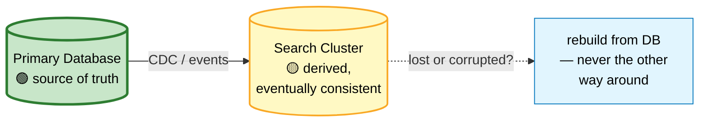

⚠️ Elasticsearch is frequently misused as a primary datastore. It has no real transactions, its consistency model is weak, and reindexing is a routine operation. Keep the truth in a database.

---

## 13. Coordination Service

#### 💬 What it's for
Some problems genuinely need **consensus** — a single agreed answer across a cluster. That's what ZooKeeper, etcd, and Consul provide, using Raft or Paxos underneath.

```
   USE CASES
   • Leader election      "which node is the primary right now?"
   • Distributed locks    "only one worker runs this job"
   • Service discovery    "where are the healthy instances of service X?"
   • Configuration        "the feature flag changed — tell everyone"
   • Membership           "who is in the cluster?"
```

```
   RAFT IN ONE PICTURE

   ┌─────────┐  heartbeats   ┌──────────┐
   │ LEADER  │──────────────▶│ FOLLOWER │
   │         │──────────────▶│ FOLLOWER │
   └─────────┘               └──────────┘
        │
        │ A write is committed once a MAJORITY has it.
        │ 3 nodes → survives 1 failure
        │ 5 nodes → survives 2 failures
        │
        └─ Leader dies → followers time out → election → new leader
```

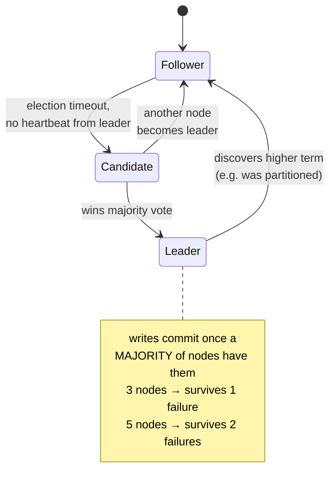

⚠️ Use coordination services for **small, critical metadata only** — every write needs a majority round trip, so they don't scale as a general datastore.

⚠️ **Consensus is expensive.** Every write needs a majority round trip. Use these systems for *small, critical metadata* — never as a general datastore. And remember from [Caching §8](../03-backend/caching.md#8-distributed-locking): if a lock is required for **correctness** (money, inventory), use your database's transactional guarantees, not a distributed lock. Distributed locks can't survive a process stalling past its lease.

---

## 14. Rate Limiter

```
   ALGORITHMS

   FIXED WINDOW      |████████|        |████████|
                     ⚠️ 2× burst at the boundary — 100 requests at
                        11:59:59 and 100 more at 12:00:00

   SLIDING LOG       exact, but stores every timestamp (memory heavy)

   SLIDING WINDOW    weighted blend of current + previous window
                     good approximation, bounded memory

   TOKEN BUCKET ⭐    ┌─────┐  refill at rate r, capacity b
                     │ ▓▓▓ │  allows controlled BURSTS
                     └──┬──┘  ← the standard choice
                        ▼ 1 token per request

   LEAKY BUCKET      smooths output to a constant rate (queue-based)
```

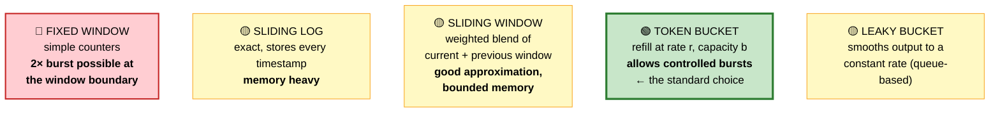

```
   WHAT TO KEY ON (in order of preference)
   1. authenticated user / API key    ⭐ fairest
   2. IP + user agent
   3. IP alone                        ⚠️ punishes corporate NAT,
                                         barely inconveniences an
                                         attacker with a proxy pool

   ALWAYS return:
     429 Too Many Requests
     Retry-After: 30
     RateLimit-Limit / Remaining / Reset
   → so well-behaved clients back off instead of hammering harder
```

🏭 Apply rate limiting at the **edge** (CDN/gateway) so rejected traffic never reaches your application servers. And use stricter limits on auth endpoints specifically — that's where credential stuffing happens.

---

## 15. Unique ID Generator

#### 💬 The problem
Auto-increment IDs need a single coordinator, which doesn't work across shards or regions. You need IDs that are unique without coordination — and ideally **sortable by time**, so they cluster well in a B-tree index.

```
   ┌───────────────┬─────────┬──────────┬─────────────────────────┐
   │ Approach      │ Size    │ Sortable │ Notes                   │
   ├───────────────┼─────────┼──────────┼─────────────────────────┤
   │ Auto-increment│ 8 bytes │ ✅        │ needs a single writer   │
   │ UUID v4       │ 16 B    │ ❌ random │ ⚠️ terrible index locality│
   │ UUID v7 ⭐     │ 16 B    │ ✅        │ time-ordered, standard  │
   │ ULID ⭐        │ 16 B    │ ✅        │ time-ordered, base32    │
   │ Snowflake ⭐   │ 8 bytes │ ✅        │ compact, needs node IDs │
   │ DB ticket srv │ 8 bytes │ ✅        │ extra hop, SPOF risk    │
   └───────────────┴─────────┴──────────┴─────────────────────────┘
```

```
   ⭐ TWITTER SNOWFLAKE — 64 bits

   ┌─┬───────────────────────────┬──────────┬────────────┐
   │0│  timestamp (41 bits)      │node(10)  │ seq (12)   │
   └─┴───────────────────────────┴──────────┴────────────┘
    ▲            ▲                    ▲            ▲
    │            │                    │            └─ 4096 IDs per ms
    │            │                    │               per node
    │            │                    └─ 1024 nodes
    │            └─ ms since a custom epoch → ~69 years
    └─ unused sign bit (keeps it positive)

   Result: sortable by time, no coordination, 4M IDs/sec per node,
           fits in a 64-bit integer.

   ⚠️ Clock skew is the failure mode. If a node's clock goes
     BACKWARDS, it can generate duplicate IDs. Production
     implementations refuse to issue IDs until the clock catches up.
```

#### Why UUID v4 hurts your database

```
   Random UUIDs insert at RANDOM positions in a B-tree:

   ┌────┬────┬────┬────┬────┐
   │    │ ●  │    │ ●  │    │   ← writes scattered across every page
   └────┴────┴────┴────┴────┘      → every insert dirties a new page
                                   → page splits, poor cache hit rate
                                   → write amplification

   Time-ordered IDs (v7/ULID/Snowflake) insert at the RIGHT EDGE:

   ┌────┬────┬────┬────┬────┐
   │    │    │    │    │●●●●│   ← all writes hit the same hot page
   └────┴────┴────┴────┴────┘      → sequential, cache-friendly

   ⭐ Recommendation: bigserial internally for index locality,
     plus a prefixed public ID (usr_01H...) for APIs so you don't
     leak row counts or enable enumeration.
```

```mermaid
flowchart TD
    UUIDv4["🔴 UUID v4 — random<br/>writes scatter across<br/>every B-tree page<br/>→ page splits, write<br/>amplification"] -->|"switch to<br/>time-ordered"| TimeOrdered["🟢 UUID v7 / ULID / Snowflake<br/>writes hit the RIGHT EDGE<br/>→ sequential, cache-friendly"]

    style UUIDv4 fill:#ffcdd2,stroke:#c62828,stroke-width:2px,color:#000
    style TimeOrdered fill:#c8e6c9,stroke:#2e7d32,stroke-width:3px,color:#000
```

---

## 16. Observability Stack

#### 💬 The three pillars

```
   ┌──────────────────────────────────────────────────────────────┐
   │ METRICS — numbers over time, aggregated                      │
   │   "p99 latency is 800ms, error rate is 2%"                   │
   │   Cheap, always-on, great for alerting and dashboards        │
   │   ❌ Can't tell you WHY, or which request                     │
   │   Prometheus, Datadog, CloudWatch                            │
   ├──────────────────────────────────────────────────────────────┤
   │ LOGS — discrete events with detail                           │
   │   "request abc123 failed: connection refused to payment-svc" │
   │   High detail, searchable                                    │
   │   ❌ Expensive at volume, hard to aggregate                   │
   │   Loki, Elasticsearch, CloudWatch Logs                       │
   ├──────────────────────────────────────────────────────────────┤
   │ TRACES — one request's full journey across services          │
   │   "gateway 5ms → auth 20ms → orders 400ms → db 380ms"        │
   │   ⭐ The only thing that finds latency in a distributed system │
   │   ❌ Needs instrumentation and sampling                       │
   │   Jaeger, Tempo, X-Ray, Honeycomb                            │
   └──────────────────────────────────────────────────────────────┘
```

```mermaid
flowchart LR
    Metrics["📊 METRICS<br/>numbers over time<br/>cheap, always-on<br/>❌ can't tell you WHY"]
    Logs["📝 LOGS<br/>discrete events, detail<br/>searchable<br/>❌ expensive at volume"]
    Traces["🔎 TRACES<br/>one request's full journey<br/><b>⭐ finds latency in a<br/>distributed system</b><br/>❌ needs instrumentation"]

    style Metrics fill:#fff9c4,stroke:#f9a825,color:#000
    style Logs fill:#fff9c4,stroke:#f9a825,color:#000
    style Traces fill:#c8e6c9,stroke:#2e7d32,stroke-width:3px,color:#000
```

```
   ⭐ THE GLUE: a request ID (trace ID) propagated through EVERYTHING

   Client ──[X-Request-ID: abc123]──▶ Gateway ──▶ Service A ──▶ Service B
                                        │            │            │
                                        └────────────┴────────────┘
                                              all logs tagged abc123

   Now "customer complains about a slow checkout at 14:32" becomes
   a single search instead of an archaeology project.
```

```mermaid
sequenceDiagram
    participant Cl as Client
    participant GW as Gateway
    participant A as Service A
    participant B as Service B

    Cl->>GW: request [X-Request-ID: abc123]
    GW->>A: forward [abc123]
    A->>B: forward [abc123]
    B-->>A: response
    A-->>GW: response
    GW-->>Cl: response
    Note over Cl,B: every log line at every hop<br/>is tagged abc123 — one search<br/>reconstructs the whole journey
```

Full detail in **[Observability & SRE](../06-cloud-devops/observability-sre.md)**.

---

## 🗺️ How the blocks fit together

```
                              ┌─────────┐
                              │   DNS   │
                              └────┬────┘
                                   ▼
   ┌───────────────────────────────────────────────────────────────┐
   │                            CDN                                │
   │           (static assets, cached API responses)                │
   └───────────────────────────────┬───────────────────────────────┘
                                   ▼
                          ┌─────────────────┐
                          │  LOAD BALANCER  │
                          └────────┬────────┘
                                   ▼
                          ┌─────────────────┐
                          │  API GATEWAY    │  auth · rate limit · route
                          └────────┬────────┘
                     ┌─────────────┼─────────────┐
                     ▼             ▼             ▼
               ┌─────────┐   ┌─────────┐   ┌─────────┐
               │ Service │   │ Service │   │ Service │  ← stateless
               │    A    │   │    B    │   │    C    │
               └────┬────┘   └────┬────┘   └────┬────┘
                    │             │             │
        ┌───────────┼─────────────┼─────────────┼───────────┐
        ▼           ▼             ▼             ▼           ▼
   ┌─────────┐ ┌────────┐   ┌──────────┐  ┌─────────┐ ┌──────────┐
   │  CACHE  │ │   DB    │   │  QUEUE   │  │ SEARCH  │ │  OBJECT  │
   │ (Redis) │ │ primary │   │  /STREAM │  │  (ES)   │ │ STORAGE  │
   └─────────┘ │    │    │   └────┬─────┘  └─────────┘ │   (S3)   │
               │  replicas│        ▼                    └──────────┘
               └─────────┘   ┌──────────┐
                             │ WORKERS  │
                             └──────────┘

   Everything emits to ──▶ ┌──────────────────────────┐
                           │  METRICS · LOGS · TRACES │
                           └──────────────────────────┘
```

---

## 📋 Selection Cheat Sheet

```
╔══════════════════════════════════════════════════════════════════════╗
║                    BUILDING BLOCKS — WHEN TO USE                     ║
╠══════════════════════════════════════════════════════════════════════╣
║ Static content is slow globally      → CDN                           ║
║ Need to route traffic before it      → DNS policies (weighted,       ║
║   reaches you                          latency, failover)            ║
║ Traffic must spread across servers   → Load balancer (L4 fast,       ║
║                                        L7 smart)                     ║
║ Auth/rate-limit repeated everywhere  → API Gateway (cross-cutting    ║
║                                        ONLY — no business logic)     ║
╠══════════════════════════════════════════════════════════════════════╣
║ Structured data + transactions       → Relational (the DEFAULT)      ║
║ Simple key lookups, sessions         → Key-value (Redis/DynamoDB)    ║
║ Huge write throughput, time-series   → Wide-column (Cassandra)       ║
║   ⚠️ bucket partitions or they grow unbounded                         ║
║ Multi-hop relationship queries       → Graph DB                      ║
║ Full-text + ranking + facets         → Search cluster (DERIVED,      ║
║                                        never the source of truth)    ║
║ Files, images, video, backups        → Object storage                ║
║   ⭐ presigned URLs — never proxy uploads through your servers        ║
╠══════════════════════════════════════════════════════════════════════╣
║ "do this job" (one worker)           → QUEUE                         ║
║ "this happened" (many listeners,     → EVENT STREAM (Kafka)          ║
║   replayable)                                                        ║
║ Leader election / distributed config → etcd/ZooKeeper                ║
║   ⚠️ expensive — small critical metadata only                         ║
║ Abuse / overload protection          → Token bucket at the EDGE      ║
║ IDs across shards                    → Snowflake / ULID / UUIDv7     ║
║   ⚠️ NEVER UUIDv4 as a primary key — destroys index locality          ║
╠══════════════════════════════════════════════════════════════════════╣
║ EVERY BLOCK YOU ADD IS A NEW FAILURE MODE.                           ║
║ Ask of each: "what happens when this is down?"                       ║
║ If the answer is "everything breaks," you have a SPOF.               ║
╚══════════════════════════════════════════════════════════════════════╝
```

---

**Next:** [The Interview Framework →](02-framework.md) · **Related:** [Fundamentals](00-fundamentals.md) · [Databases](../03-backend/databases.md) · [Caching](../03-backend/caching.md)
