# 🎯 The System Design Interview Framework

> A system design interview is not a test of whether you know the answer. It's a test of whether you can **navigate ambiguity, make tradeoffs explicitly, and communicate while thinking**. This book is the method.

**Prerequisite:** [Fundamentals](00-fundamentals.md) · [Building Blocks](01-building-blocks.md)

---

## 📑 Contents

1. [What They're Actually Measuring](#1-what-theyre-actually-measuring)
2. [The 7-Step Framework](#2-the-7-step-framework)
3. [Step 1 — Requirements](#step-1--requirements-5-8-min)
4. [Step 2 — Estimation](#step-2--estimation-3-5-min)
5. [Step 3 — API Design](#step-3--api-design-3-5-min)
6. [Step 4 — Data Model](#step-4--data-model-5-min)
7. [Step 5 — High-Level Design](#step-5--high-level-design-10-min)
8. [Step 6 — Deep Dives](#step-6--deep-dives-15-20-min)
9. [Step 7 — Wrap Up](#step-7--wrap-up-3-5-min)
10. [Articulating Tradeoffs](#3-articulating-tradeoffs)
11. [Level Expectations](#4-level-expectations)
12. [Common Failure Modes](#5-common-failure-modes)
13. [Phrases That Work](#6-phrases-that-work)
14. [Frontend System Design](#7-frontend-system-design)
15. [Practice Protocol](#8-practice-protocol)

---

## 1. What They're Actually Measuring

#### 💬 The mental model shift

Most candidates think they're being asked *"do you know how to build Twitter?"* They're not. Nobody expects you to design a system in 45 minutes that took hundreds of engineers years.

What's actually being scored:

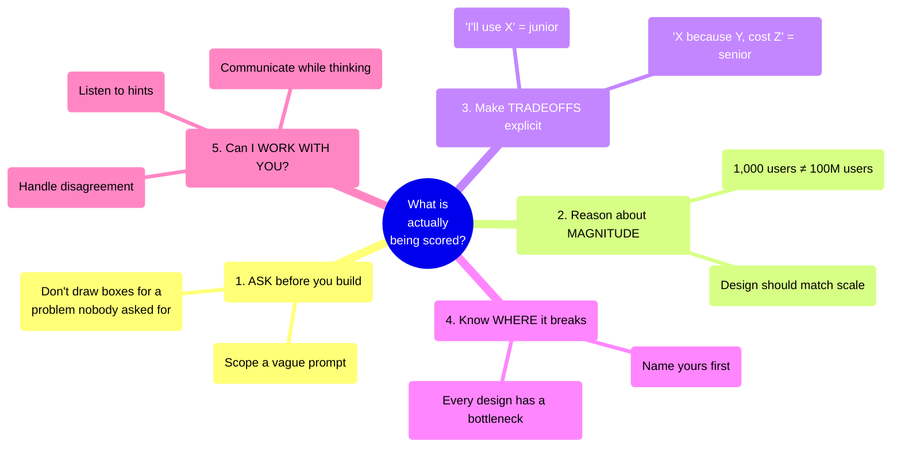

⭐ **The single highest-leverage behaviour:** narrate your reasoning continuously. An interviewer cannot give credit for thoughts they can't hear, and cannot redirect you if they don't know where you're going.

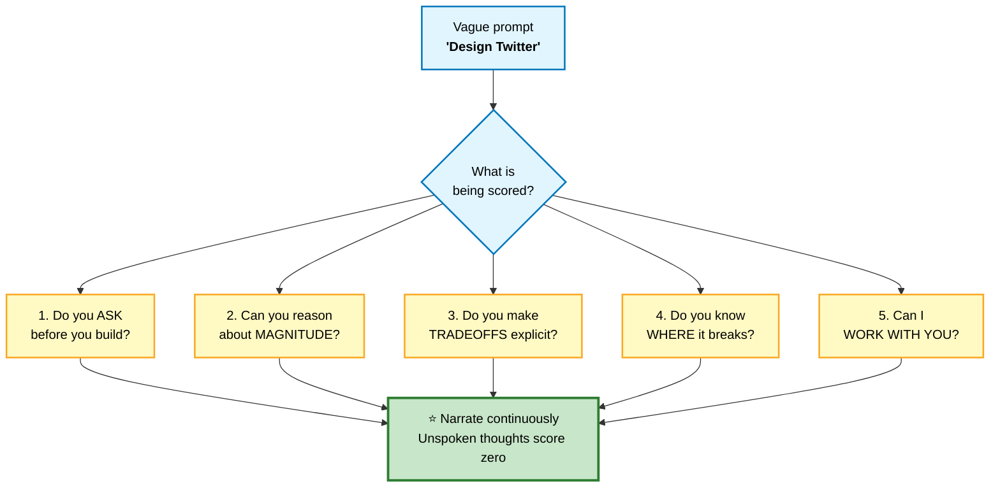

---

## 2. The 7-Step Framework

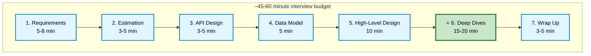
*Roughly 20 minutes of setup (requirements through high-level design) buys you 15-20 minutes of deep dives — where level is actually determined. Spend more than 20 minutes on setup and you're behind.*

⚠️ **The most common time-management failure** is spending 25 minutes on requirements and estimation, then rushing the deep dives. The deep dives are where senior signal lives. Budget accordingly — if you're 20 minutes in and haven't drawn a box, you're behind.

```mermaid
flowchart LR
    S1["<b>1. Requirements</b><br/>5-8 min<br/>scope it, write it down"]
    S2["<b>2. Estimation</b><br/>3-5 min<br/>QPS, storage, the ratio"]
    S3["<b>3. API Design</b><br/>3-5 min<br/>the contract"]
    S4["<b>4. Data Model</b><br/>5 min<br/>entities + access patterns"]
    S5["<b>5. High-Level Design</b><br/>10 min<br/>boxes and arrows"]
    S6["<b>6. Deep Dives</b><br/>15-20 min<br/>⭐ where you're evaluated"]
    S7["<b>7. Wrap Up</b><br/>3-5 min<br/>bottlenecks, next steps"]

    S1 --> S2 --> S3 --> S4 --> S5 --> S6 --> S7

    style S1 fill:#e1f5fe,stroke:#0277bd,stroke-width:2px,color:#000
    style S2 fill:#e1f5fe,stroke:#0277bd,stroke-width:2px,color:#000
    style S3 fill:#e1f5fe,stroke:#0277bd,stroke-width:2px,color:#000
    style S4 fill:#e1f5fe,stroke:#0277bd,stroke-width:2px,color:#000
    style S5 fill:#e1f5fe,stroke:#0277bd,stroke-width:2px,color:#000
    style S6 fill:#c8e6c9,stroke:#2e7d32,stroke-width:3px,color:#000
    style S7 fill:#e1f5fe,stroke:#0277bd,stroke-width:2px,color:#000
```

---

## Step 1 — Requirements (5-8 min)

#### 💬 The goal
Turn a deliberately vague prompt ("design Twitter") into a bounded, buildable problem. **The interviewer is withholding requirements on purpose** — extracting them is part of the test.

### Functional requirements — what it does

```
   ASK, THEN WRITE ON THE BOARD:

   "Let me make sure I understand the scope."

   □ Who are the users? (consumers? businesses? internal?)
   □ What are the 3-5 CORE actions?
   □ What's explicitly OUT of scope?
   □ Is this greenfield or evolving an existing system?

   THEN PROPOSE and confirm:

   "I'll focus on these three:
      1. Users can post a tweet (text, up to 280 chars)
      2. Users can follow other users
      3. Users can view a home timeline of people they follow

    And I'll treat these as out of scope unless you'd like
    me to cover them: DMs, search, trending, ads, notifications.
    Does that split sound right?"
```

⭐ **Proposing a scope and confirming** is much stronger than asking open-ended questions forever. It shows judgment.

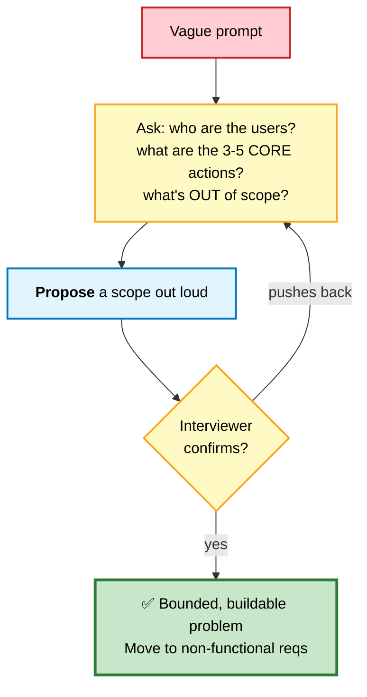

### Non-functional requirements — how well it does it

This is where most candidates are weak, and where the design is actually determined.

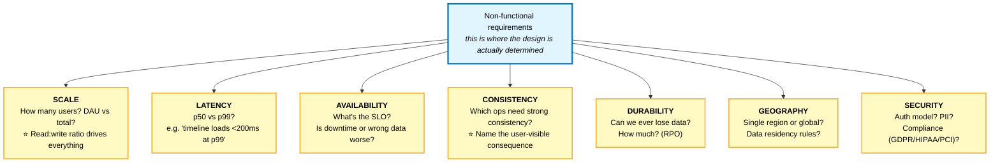

### The availability table — know these

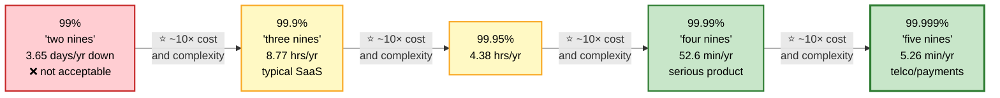
*Ask what the business actually needs — five nines for an internal admin tool is wasted engineering effort.*

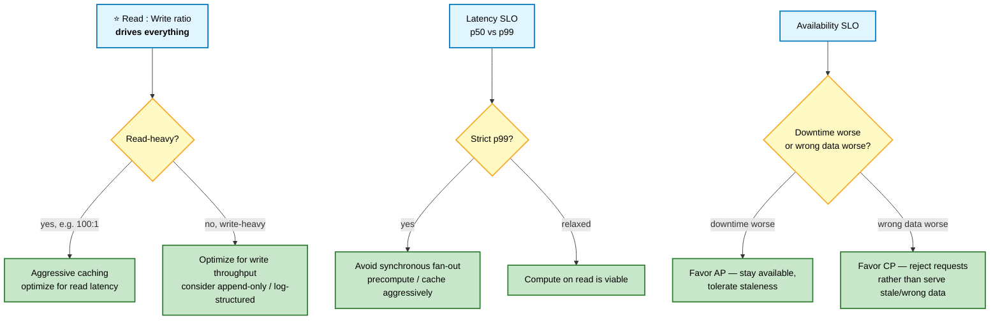

---

## Step 2 — Estimation (3-5 min)

#### 💬 Why this step earns points
Not for the arithmetic. For showing that your design is **sized correctly** — and for surfacing the one number that determines the architecture.

```
   THE TEMPLATE (say assumptions out loud, round aggressively)

   1. DAU × actions/user/day  →  daily operations
   2. ÷ 86,400                →  average QPS
   3. × 2 to 10               →  peak QPS   ⭐ always state this
   4. bytes × items × days    →  storage (× 3 for replication)
   5. QPS × payload           →  bandwidth
   6. hot 20% of data         →  cache size
```

### 📊 Worked example

```
   "Design a URL shortener"

   ASSUMPTIONS
   • 100M new URLs/day
   • Read:write ratio 100:1  ⭐ (I'll ask, or state and confirm)
   • URL ~100 bytes, plus metadata ≈ 500 bytes/record
   • Retain for 5 years

   WRITES  100M / 86,400 ≈ 1,200 QPS average
                          ≈ 3,600 QPS peak (×3)

   READS   1,200 × 100    ≈ 120,000 QPS average
                          ≈ 360,000 QPS peak

   STORAGE 100M × 500 B   = 50 GB/day
           × 365 × 5      ≈ 90 TB
           × 3 replication ≈ 270 TB

   ⭐ WHAT THIS IMPLIES — say this part, it's what scores:

   "120K read QPS means a single database won't serve reads.
    The 100:1 ratio tells me to design read-first: aggressive
    caching, and since short URLs are immutable once created,
    they're perfectly cacheable with a very long TTL.

    90 TB also tells me this doesn't fit on one machine, so
    I'll need partitioning — and since lookups are always by
    the short code, hash partitioning on that key works cleanly
    with no cross-shard queries."
```

⭐ The last paragraph is the entire point of the estimation step. Numbers without implications are wasted time.

```mermaid
flowchart LR
    A["DAU × actions/user/day"] --> B["÷ 86,400<br/>average QPS"]
    B --> C["× 2 to 10<br/><b>peak QPS</b> ⭐"]
    C --> D["bytes × items × days<br/>storage (× 3 replication)"]
    D --> E["QPS × payload<br/>bandwidth"]
    E --> F["hot 20% of data<br/>cache size"]
    F --> G["⭐ 'Which means...'<br/>state the design implication"]

    style A fill:#e1f5fe,stroke:#0277bd,stroke-width:2px,color:#000
    style B fill:#e1f5fe,stroke:#0277bd,stroke-width:2px,color:#000
    style C fill:#fff9c4,stroke:#f9a825,stroke-width:2px,color:#000
    style D fill:#e1f5fe,stroke:#0277bd,stroke-width:2px,color:#000
    style E fill:#e1f5fe,stroke:#0277bd,stroke-width:2px,color:#000
    style F fill:#e1f5fe,stroke:#0277bd,stroke-width:2px,color:#000
    style G fill:#c8e6c9,stroke:#2e7d32,stroke-width:3px,color:#000
```

---

## Step 3 — API Design (3-5 min)

#### 💬 Why it comes before the architecture
The API is the **contract**. Defining it forces you to be concrete about what the system actually does, and it constrains the design that follows.

```
   POST   /v1/tweets
          Body: { text, media_ids? }
          Headers: Authorization, Idempotency-Key
          → 201 { id, created_at }

   GET    /v1/users/{id}/timeline?limit=20&cursor=<opaque>
          → 200 { data: [...], page_info: { has_next, end_cursor } }

   POST   /v1/users/{id}/follow
          → 204

   DELETE /v1/users/{id}/follow
          → 204
```

```
   ⭐ SIGNAL WORTH SHOWING IN 30 SECONDS:

   • CURSOR pagination, not offset
     "Timelines grow unboundedly and shift as new tweets arrive.
      Offset pagination would be O(offset) and would show
      duplicates as the list moves. Cursor is O(1) and stable."

   • IDEMPOTENCY KEY on writes
     "A network retry shouldn't create two tweets."

   • Explicit VERSIONING
   • Auth on every endpoint
   • The RESOURCE, not an RPC verb
```

---

## Step 4 — Data Model (5 min)

#### 💬 Access patterns first, schema second

```
   ⭐ THE ORDER THAT MATTERS

   1. What are the ENTITIES?          user, tweet, follow
   2. What are the RELATIONSHIPS?     user →N tweets, user ↔N users
   3. What QUERIES will run, and how often?   ← DO THIS BEFORE SCHEMA
   4. THEN pick the storage and design the schema around those queries
```

```sql
-- Entities
users    (id, handle, name, created_at)
tweets   (id, user_id, text, created_at)
follows  (follower_id, followee_id, created_at)

-- ⭐ ACCESS PATTERNS — state these explicitly
-- 1. Get a user's tweets, newest first        → index (user_id, created_at DESC)
-- 2. Get who a user follows                   → index (follower_id)
-- 3. Get a user's FOLLOWERS  ⚠️                → index (followee_id)
-- 4. Home timeline = tweets from all followees, merged, newest first
--    ⭐ THIS is the hard one. Everything else is trivial.
```

⭐ **Identifying the one hard query** is a strong move. In Twitter it's the timeline fan-out. In Uber it's geospatial matching. In Google Docs it's concurrent edit merging. Name it early and you've framed the whole rest of the interview around the interesting part.

### Choosing storage — justify, don't just name

```
   ❌ "I'll use Cassandra."
   ✅ "Tweets are append-only, never updated, always queried by
       user or by timeline position, and the write volume is high.
       That's a good fit for a wide-column store like Cassandra —
       I get linear write scaling and the access pattern is known
       in advance, which is Cassandra's requirement.

       The user and follow graph is small, relational, and needs
       consistency, so I'd keep that in Postgres."
```

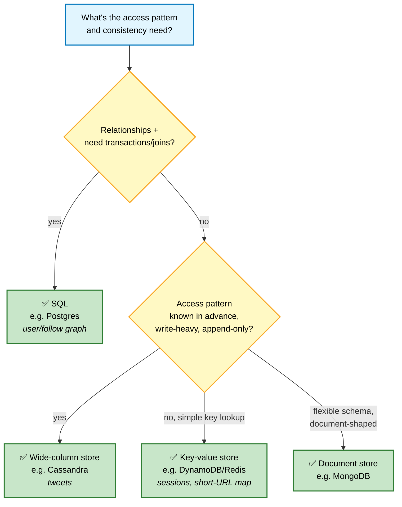

⚠️ Naming the tool without the mechanism (`"I'll use Cassandra."`) is the failure mode from §5 — always justify with the access pattern, not the brand name.

---

## Step 5 — High-Level Design (10 min)

#### 💬 Draw the happy path first
Get one complete request flowing end to end before you add anything clever. Then evolve it under pressure.

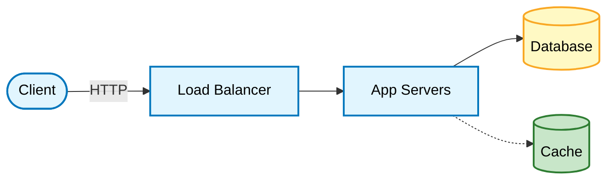
*START SIMPLE — this is fine as a first diagram. Then narrate the evolution:*

> "Now let's trace a write. A user posts a tweet — it hits the app server, we validate, write to the tweets table, and return. That's straightforward.
>
> Now a read. The home timeline needs tweets from everyone this user follows, merged and sorted. With 500 followees that's a 500-way merge on every timeline load, at 350K QPS. That's the bottleneck, so let me focus there."

```
   ⭐ RULES FOR THE DIAGRAM

   • Draw the CLIENT. People forget it.
   • Label every arrow with what flows over it
   • Distinguish SYNC (solid) from ASYNC (dashed) paths
   • Show where data is WRITTEN vs READ
   • Leave whitespace — you'll be adding to this diagram
```

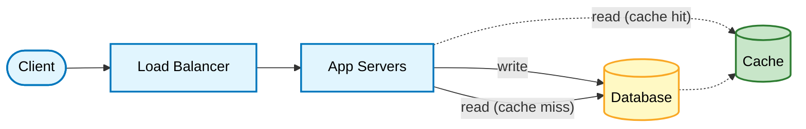
*Solid arrows = sync path. Dashed arrows = async/cache path. This is deliberately the simplest thing that works — evolve it under pressure once the bottleneck is named.*

---

## Step 6 — Deep Dives (15-20 min)

#### 💬 This is the interview

Everything before this was setup. Deep dives are where level is determined. The interviewer will usually steer you — **follow their steer, it's a hint about what they want to score.**

### The deep dives that come up constantly

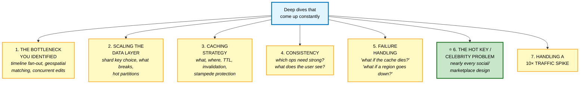

### 📊 A worked deep dive — timeline fan-out

This is the canonical example of how to structure a deep dive.

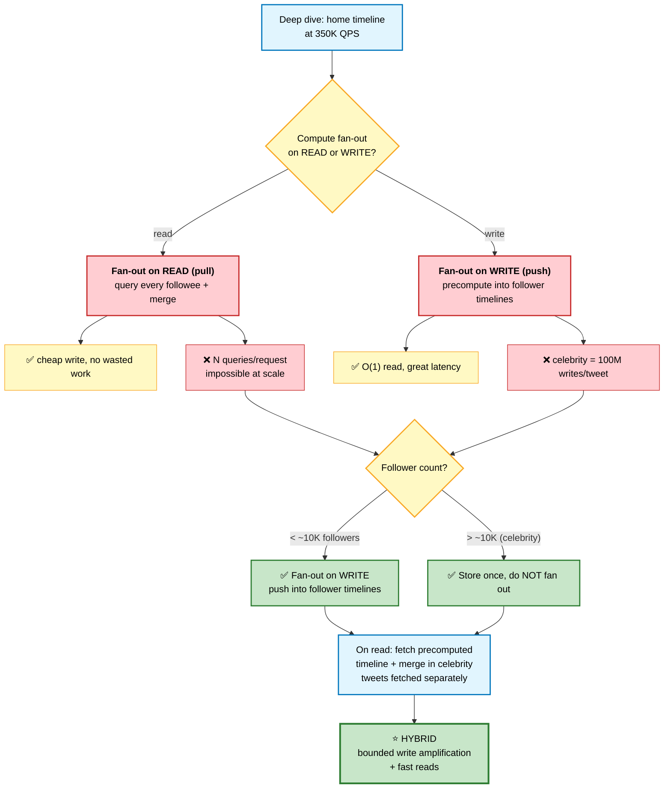

```
   PROBLEM: home timeline = merge tweets from N followees,
            at 350K QPS. Computing on read is too slow.

   ─── OPTION A: FAN-OUT ON READ (pull) ────────────────────
   Store tweets once. On timeline request, query every followee
   and merge.

   ✅ Write is cheap — one insert
   ✅ No wasted work for inactive users
   ✅ Storage efficient
   ❌ Read is expensive — N queries + merge per request
   ❌ At 350K QPS with N=500, that's 175M queries/sec. Impossible.

   ─── OPTION B: FAN-OUT ON WRITE (push) ───────────────────
   When a user tweets, push the tweet ID into every follower's
   precomputed timeline list (in Redis).

   ✅ Read is O(1) — just fetch a list
   ✅ Read latency is excellent
   ❌ Write amplification: 1 tweet → N writes
   ❌ ⚠️ A celebrity with 100M followers = 100M writes per tweet
   ❌ Wasted work for inactive followers

   ─── ⭐ OPTION C: HYBRID (what Twitter actually does) ─────
```

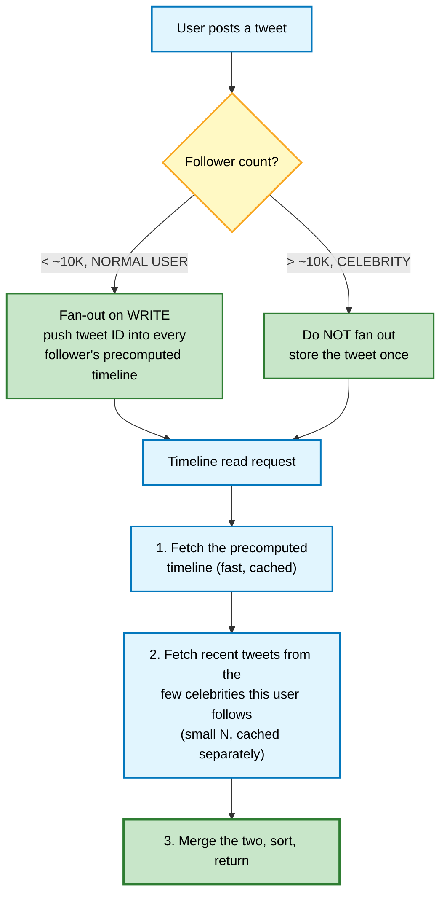

```
   ✅ Bounded write amplification (celebrities excluded)
   ✅ Read is still fast (one list + a small merge)
   ✅ Handles the actual distribution of follower counts

   FURTHER REFINEMENTS TO MENTION
   • Only fan out to ACTIVE users (logged in within 30 days).
     Inactive users get their timeline computed lazily on return.
   • Cap the stored timeline at ~800 tweets. Nobody scrolls further;
     deeper pagination falls back to the pull path.
   • Fan-out happens ASYNCHRONOUSLY via a queue, so posting a
     tweet returns immediately regardless of follower count.
   • The threshold is tunable, and should be measured, not guessed.
```

### Decision tree: queue vs. direct call

A recurring choice inside almost every deep dive — say this reasoning out loud whenever you introduce (or skip) a queue.

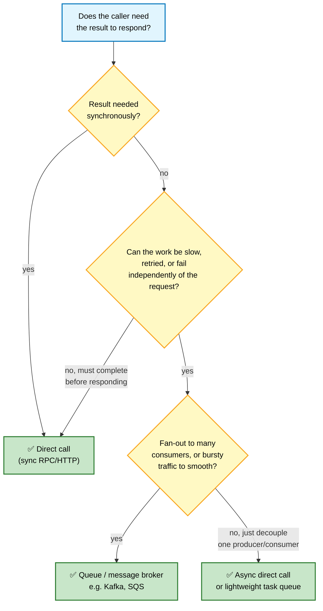

⭐ In the fan-out example, tweet posting returns immediately while fan-out happens **asynchronously via a queue** — exactly this reasoning: the client doesn't need to wait for 100M writes to complete.

⭐ That structure — **enumerate options, state the tradeoff of each, pick one with justification, then refine** — is what a strong deep dive looks like. Apply it to any sub-problem.

---

## Step 7 — Wrap Up (3-5 min)

#### 💬 Close strong

```
   ⭐ NAME YOUR OWN BOTTLENECKS FIRST

   "The weakest points in this design are:

    1. The fan-out worker pool is the throughput ceiling. If a
       celebrity tweets during peak traffic, the queue backs up
       and timelines go stale. I'd monitor consumer lag as
       time-to-drain and autoscale on it.

    2. The Redis timeline cluster is a hard dependency. If it
       fails, timelines are unavailable. I'd want a fallback to
       compute-on-read at degraded latency rather than an error.

    3. I haven't handled deletes and edits propagating into
       already-fanned-out timelines. That needs a tombstone
       mechanism plus a filter at read time.

    Given more time, I'd dig into the multi-region story and
    how we'd handle timeline consistency across regions."
```

```
   THE CLOSING CHECKLIST
   □ Named the bottlenecks before being asked
   □ Stated what you'd monitor
   □ Acknowledged what you didn't cover
   □ Mentioned one thing you'd do differently at 10× scale
   □ Asked if there's an area they'd like to explore further
```

---

## 3. Articulating Tradeoffs

#### 💬 The sentence pattern that signals seniority

```
   ❌ JUNIOR       "I'll use Redis."

   🟡 MID          "I'll use Redis because it's fast."

   ✅ SENIOR       "I'll use Redis for the timeline cache because
                   reads are 1000× writes and timelines tolerate
                   a few seconds of staleness. The cost is that a
                   Redis outage takes timelines down, so I'd need
                   a degraded fallback. I'd also need TTL jitter
                   to avoid a synchronized expiry stampede."

   THE PATTERN:  [choice] because [requirement it satisfies],
                 accepting [cost], mitigated by [mitigation]
```

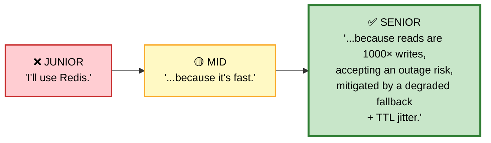

### The tradeoff table you should be able to produce for anything

| Dimension | Option A | Option B |
|---|---|---|
| Latency | | |
| Throughput | | |
| Consistency | | |
| Cost | | |
| Complexity | | |
| Failure blast radius | | |
| Operational burden | | |

⭐ **Complexity and operational burden are real costs** and most candidates ignore them. Saying *"this is technically better but adds a system the on-call team has to understand at 3am, so I'd only do it if we measure that we need it"* is a strong senior signal.

---

## 4. Level Expectations

#### 💬 The senior/staff differentiator

Junior and mid answers describe **a system**. Senior and staff answers describe **a system, why it's shaped that way, what it costs, how it fails, how you'd know, and how you'd get there from where the company is today.**

```mermaid
flowchart TD
    subgraph Junior["JUNIOR (L3/E3)"]
        J1["Knows the components exist"]
        J2["Can draw a basic 3-tier architecture"]
        J3["Needs prompting for scale considerations"]
    end

    subgraph Mid["MID (L4/E4)"]
        M1["Drives the structure without prompting"]
        M2["Correct estimation, sensible component choices"]
        M3["Identifies obvious bottlenecks"]
        M4["Handles one deep dive competently"]
    end

    subgraph Senior["⭐ SENIOR (L5/E5)"]
        S1["Scopes ambiguity into a buildable problem"]
        S2["Every choice justified with an explicit cost"]
        S3["Names failure modes unprompted"]
        S4["Multiple deep dives with real depth"]
        S5["Discusses operational reality: monitoring,<br/>deploys, on-call, migration path"]
    end

    subgraph Staff["STAFF+ (L6+/E6+)"]
        F1["Questions the requirements themselves"]
        F2["Considers organizational fit (Conway's law)"]
        F3["Discusses build-vs-buy and cost seriously"]
        F4["Proposes a phased delivery, not a big bang"]
        F5["Reasons about the 3-year evolution"]
    end

    Junior -->|"drives without<br/>being asked"| Mid
    Mid -->|"justifies every<br/>choice with a cost"| Senior
    Senior -->|"questions the<br/>problem itself"| Staff

    style Junior fill:#ffcdd2,stroke:#c62828,stroke-width:2px,color:#000
    style Mid fill:#fff9c4,stroke:#f9a825,stroke-width:2px,color:#000
    style Senior fill:#c8e6c9,stroke:#2e7d32,stroke-width:3px,color:#000
    style Staff fill:#e1f5fe,stroke:#0277bd,stroke-width:2px,color:#000
    style J1 fill:#ffcdd2,stroke:#c62828,color:#000
    style J2 fill:#ffcdd2,stroke:#c62828,color:#000
    style J3 fill:#ffcdd2,stroke:#c62828,color:#000
    style M1 fill:#fff9c4,stroke:#f9a825,color:#000
    style M2 fill:#fff9c4,stroke:#f9a825,color:#000
    style M3 fill:#fff9c4,stroke:#f9a825,color:#000
    style M4 fill:#fff9c4,stroke:#f9a825,color:#000
    style S1 fill:#c8e6c9,stroke:#2e7d32,color:#000
    style S2 fill:#c8e6c9,stroke:#2e7d32,color:#000
    style S3 fill:#c8e6c9,stroke:#2e7d32,color:#000
    style S4 fill:#c8e6c9,stroke:#2e7d32,color:#000
    style S5 fill:#c8e6c9,stroke:#2e7d32,color:#000
    style F1 fill:#e1f5fe,stroke:#0277bd,color:#000
    style F2 fill:#e1f5fe,stroke:#0277bd,color:#000
    style F3 fill:#e1f5fe,stroke:#0277bd,color:#000
    style F4 fill:#e1f5fe,stroke:#0277bd,color:#000
    style F5 fill:#e1f5fe,stroke:#0277bd,color:#000
```

---

## 5. Common Failure Modes

```
   ❌ JUMPING TO ARCHITECTURE
      Drawing boxes in minute two. You're solving the wrong problem.
      FIX: 5 minutes of requirements, always. Write them down.

   ❌ OVER-ENGINEERING
      Kafka, Kubernetes, and 12 microservices for 1,000 users.
      FIX: match the design to the stated scale. Say
      "at this scale a single Postgres handles it; here's when
      I'd change that."

   ❌ GOING SILENT
      Thinking hard with no output. The interviewer sees nothing.
      FIX: narrate. "I'm weighing two options here — let me think
      through the first..."

   ❌ NAMING TECHNOLOGIES INSTEAD OF EXPLAINING MECHANISMS
      "I'll use Kafka" without saying what problem it solves.
      FIX: describe the mechanism, then name the tool that does it.

   ❌ IGNORING THE INTERVIEWER'S HINTS
      "Have you thought about what happens if that node fails?"
      is not curiosity — it's a rescue attempt.
      FIX: treat every question as a signpost and follow it.

   ❌ NO ESTIMATION, OR ESTIMATION WITHOUT IMPLICATION
      Doing arithmetic and then never referring to it again.
      FIX: end estimation with "which means...".

   ❌ CLAIMING CERTAINTY YOU DON'T HAVE
      Confidently wrong is worse than honestly uncertain.
      FIX: "I'm not certain about the exact numbers here, but the
      order of magnitude suggests..." — then reason from principles.

   ❌ NOT MANAGING TIME
      25 minutes on requirements, 5 on the actual design.
      FIX: glance at the clock at minute 15. Should be in the
      high-level design by then.

   ❌ DEFENDING A BAD IDEA
      Digging in when the interviewer pushes back.
      FIX: "That's a good point — let me reconsider." Then
      actually reconsider. Adaptability is being scored.
```

---

## 6. Phrases That Work

```
   ── SCOPING ────────────────────────────────────────────────────
   "Before I design anything, let me make sure I understand the
    scope. Is X in or out?"
   "I'll focus on these three core flows and treat the rest as
    out of scope unless you'd prefer otherwise."
   "What's the read-to-write ratio? That'll drive most of my
    decisions here."

   ── ESTIMATION ─────────────────────────────────────────────────
   "Let me round aggressively — I care about the order of
    magnitude, not precision."
   "That works out to roughly X, which means..."   ⭐
   "I'll assume peak is 3× average — does that match what you'd
    expect for this workload?"

   ── DESIGN ─────────────────────────────────────────────────────
   "Let me start with the simplest thing that works, then find
    where it breaks."
   "There are two approaches here. Let me lay out both and pick."
   "I'm choosing X because Y, and the cost is Z."   ⭐
   "This is the bottleneck. Let me spend time here."

   ── HANDLING UNCERTAINTY ───────────────────────────────────────
   "I haven't worked with that specific system, but based on
    how similar systems work, I'd expect..."
   "I'm not sure — let me reason from first principles."
   "Two things I'd want to verify with real data before
    committing to this."

   ── HANDLING PUSHBACK ──────────────────────────────────────────
   "That's a good point — I hadn't considered that case."
   "Let me reconsider. If that's true, then..."
   "You're right, that breaks under X. An alternative would be..."

   ── CLOSING ────────────────────────────────────────────────────
   "The weakest parts of this design are..."   ⭐
   "Here's what I'd monitor to know it's working."
   "If we hit 10× this scale, the first thing to break would be..."
```

---

## 7. Frontend System Design

#### 💬 A different interview with the same structure

If you're interviewing for frontend, the framework is identical but the deep dives change entirely.

```
   ── REQUIREMENTS (frontend-specific) ────────────────────────────
   □ Which devices/browsers? Mobile-first?
   □ Accessibility requirements? (WCAG level)
   □ Internationalization? RTL languages?
   □ Offline support needed?
   □ SEO important, or behind a login?
   □ Real-time updates required?
   □ Performance budget? (LCP, INP targets)

   ── THE DEEP DIVES THAT COME UP ─────────────────────────────────

   1. RENDERING STRATEGY
      SSG / ISR / SSR / streaming SSR / CSR — and WHY for each route
      → [Next.js](../02-frontend/nextjs.md#2-the-rendering-spectrum)
```

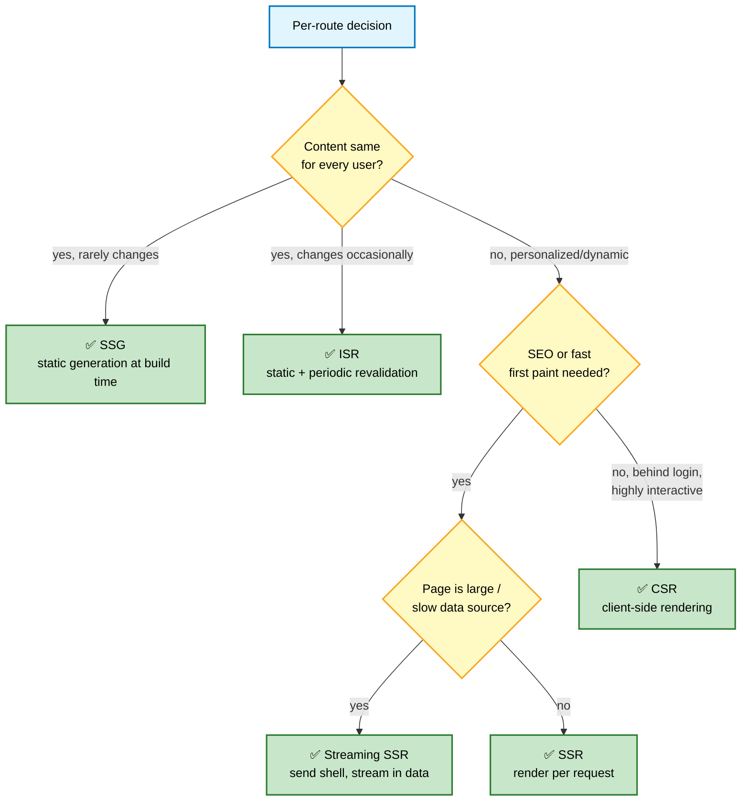

```
   2. STATE MANAGEMENT
      ⭐ "Most global state is actually SERVER CACHE. Separate
        server state (TanStack Query) from client state (Zustand)
        and the problem shrinks dramatically."

   3. DATA FETCHING
      Waterfalls, parallel fetching, caching, optimistic updates,
      race conditions on fast input

   4. PERFORMANCE
      Bundle splitting, virtualization for long lists, image
      optimization, Core Web Vitals
      → [Browser Performance](../02-frontend/browser-performance.md)

   5. REAL-TIME
      Polling vs long-polling vs SSE vs WebSocket, and reconnection

   6. COMPONENT ARCHITECTURE
      Design system, composition, prop drilling vs context

   7. OFFLINE / RESILIENCE
      Service worker, optimistic UI, conflict resolution, sync queue
```

### 📊 Example: design a real-time collaborative editor (frontend)

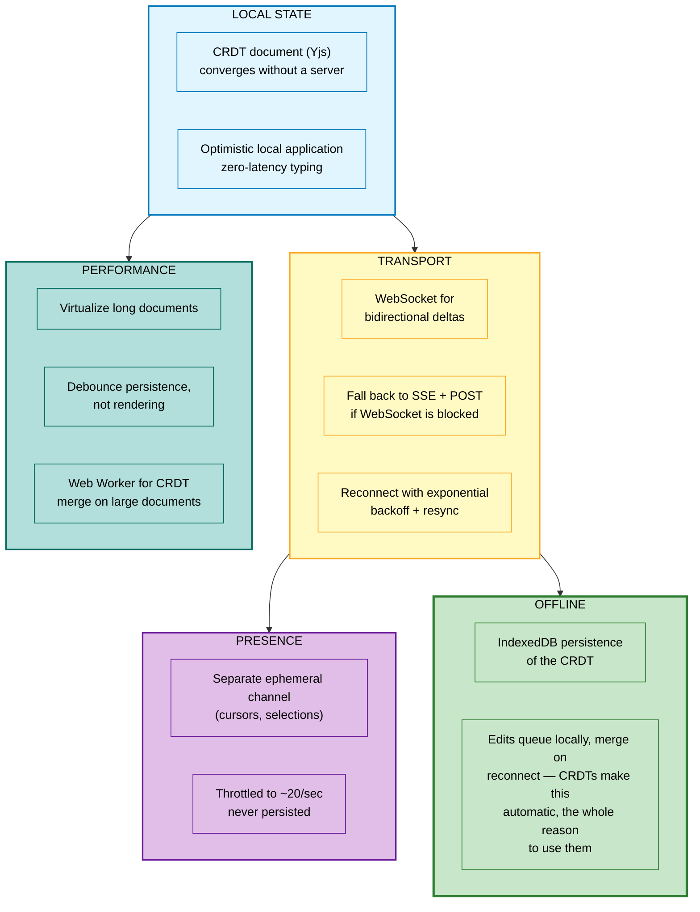
*The CRDT choice in LOCAL STATE is what makes OFFLINE merging automatic — that dependency is why the two subgraphs are connected above.*

---

## 8. Practice Protocol

#### 💬 How to actually get good at this

Reading case studies does almost nothing. The skill is **producing a design under time pressure while talking**. That has to be practiced directly.

```
   ── SOLO PRACTICE (45 min, timed) ───────────────────────────────
   1. Pick a system. Set a timer for 45 minutes.
   2. TALK OUT LOUD the entire time. Record yourself.
   3. Draw on paper or a whiteboard, not a polished tool.
   4. Do NOT look anything up during the session.
   5. Afterwards, listen to the recording. You will hear:
      • long silences (the biggest problem)
      • claims you made without justification
      • the moment you got stuck and what you did about it

   ── THE DRILL THAT BUILDS THE MOST SKILL ────────────────────────
   Take a design you already know. Now change ONE requirement:
     "same system, but 100× the scale"
     "same system, but strong consistency required"
     "same system, but it must work offline"
     "same system, but multi-region with data residency"
   ⭐ Adapting a design under a changed constraint is exactly what
     the deep-dive phase tests.

   ── WITH A PARTNER ──────────────────────────────────────────────
   The interviewer's job: interrupt. Ask "why?" constantly.
   Push back on one decision even if it's correct — see how
   the candidate handles disagreement.

   ── SPACED REPETITION ───────────────────────────────────────────
   A case study only counts when you can WHITEBOARD IT FROM
   MEMORY in 40 minutes. Track this in your
   [progress tracker](../00-meta/progress-tracker.md#case-study-drill-log).
```

### The 15-system practice ladder

```
   TIER 1 — learn the framework on simple systems
     URL shortener · Pastebin · Rate limiter · Key-value store

   TIER 2 — classic scale problems
     Twitter · Instagram · WhatsApp · Notification service

   TIER 3 — specialized hard problems
     Uber · Google Docs · YouTube · Search autocomplete

   TIER 4 — full complexity
     Netflix · Stripe · Amazon · TikTok recommendations
```

---

## 📋 Cheat Sheet

```
╔══════════════════════════════════════════════════════════════════════╗
║              SYSTEM DESIGN INTERVIEW — ONE PAGE                      ║
╠══════════════════════════════════════════════════════════════════════╣
║ 1. REQUIREMENTS  5-8m  functional + NON-functional. WRITE THEM DOWN. ║
║                        propose a scope and confirm it                ║
║ 2. ESTIMATION    3-5m  DAU→QPS(peak=avg×2-10)→storage→bandwidth      ║
║                        ⭐ END WITH "WHICH MEANS..."                   ║
║ 3. API           3-5m  cursor pagination · idempotency key           ║
║ 4. DATA MODEL    5m    ⭐ ACCESS PATTERNS BEFORE SCHEMA               ║
║                        name the ONE hard query                       ║
║ 5. HIGH-LEVEL    10m   simplest thing that works, then evolve it     ║
║ 6. DEEP DIVES    15-20m ⭐ THIS IS THE INTERVIEW                      ║
║ 7. WRAP UP       3-5m  name your OWN bottlenecks first               ║
╠══════════════════════════════════════════════════════════════════════╣
║ THE SENIOR SENTENCE                                                  ║
║   "[choice] because [requirement], accepting [cost],                 ║
║    mitigated by [mitigation]"                                        ║
╠══════════════════════════════════════════════════════════════════════╣
║ DEEP DIVE STRUCTURE                                                  ║
║   enumerate options → tradeoff each → pick with justification →      ║
║   refine with real-world details                                     ║
╠══════════════════════════════════════════════════════════════════════╣
║ ALWAYS COVERED IF TIME ALLOWS                                        ║
║   □ the hot key / celebrity problem                                  ║
║   □ what happens when the cache dies                                 ║
║   □ how you'd handle a 10× spike                                     ║
║   □ what you'd monitor and alert on                                  ║
║   □ the migration path from today's system                           ║
╠══════════════════════════════════════════════════════════════════════╣
║ FAILURE MODES: jumping to architecture · over-engineering ·          ║
║   going silent · naming tech without mechanism · ignoring hints ·    ║
║   estimation with no implication · defending a bad idea              ║
╠══════════════════════════════════════════════════════════════════════╣
║ ⭐ NARRATE CONTINUOUSLY. Unspoken thoughts score zero.                ║
╚══════════════════════════════════════════════════════════════════════╝
```

---

**Next:** [Case Studies Vol. 1 →](03-case-studies-1.md) · **Related:** [Fundamentals](00-fundamentals.md) · [Building Blocks](01-building-blocks.md) · [Behavioral](../09-interview/behavioral.md)
