# 🏗️ Case Studies Vol. 1 — Uber · Netflix · Twitter · WhatsApp · Instagram

> Five systems, each teaching a different core problem. Read for the *mechanism*, not the diagram — the goal is to recognize these patterns when a novel problem wears them as a costume.

**Prerequisite:** [Framework](02-framework.md)

| System | The defining problem it teaches |
|---|---|
| [Uber](#-uber) | Real-time geospatial matching |
| [Netflix](#-netflix) | Massive-scale content delivery |
| [Twitter](#-twitter) | Fan-out and the celebrity problem |
| [WhatsApp](#-whatsapp) | Persistent connections at scale |
| [Instagram](#-instagram) | Feed ranking + media pipeline |

---

# 🚗 Uber

> **Teaches:** geospatial indexing, real-time matching, state machines under unreliable networks.

## 1. Requirements

### Functional

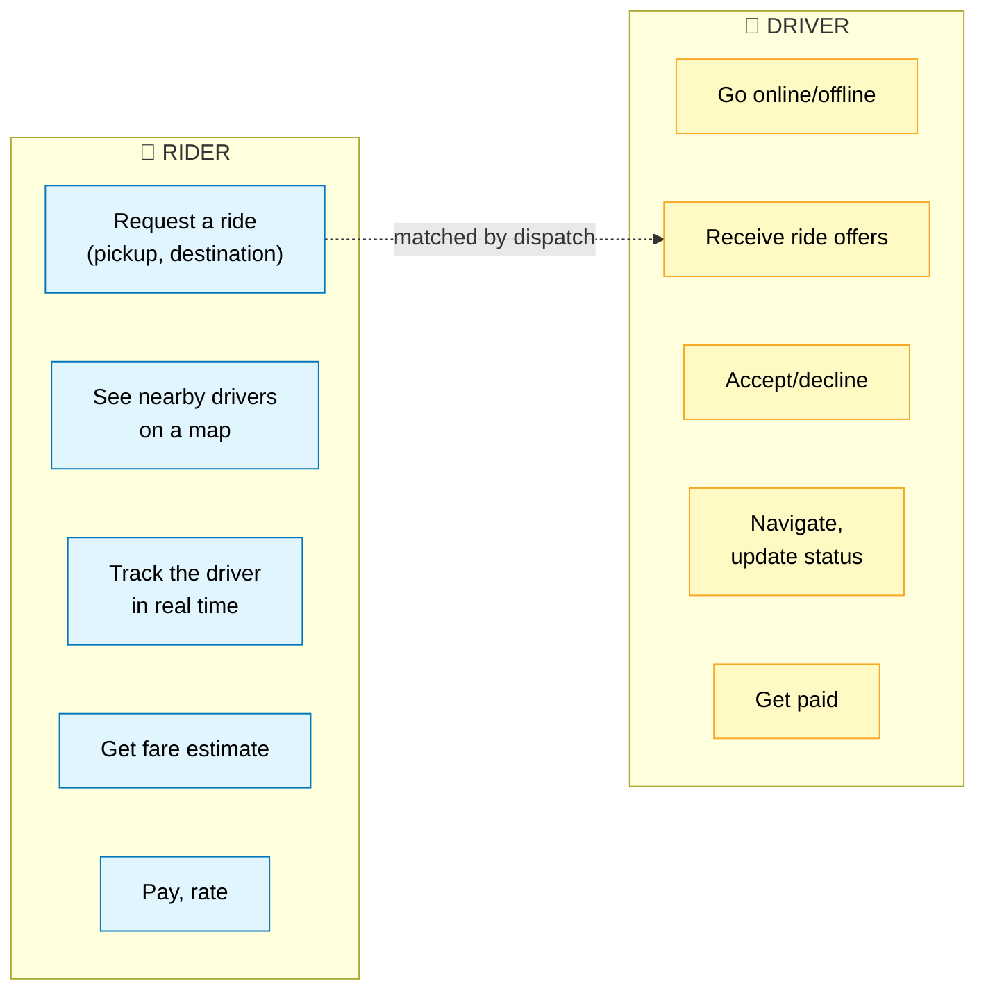

### Out of scope (state this)
Uber Eats, pooling, scheduled rides, driver onboarding, pricing algorithm internals.

### Non-functional


## 2. Estimation

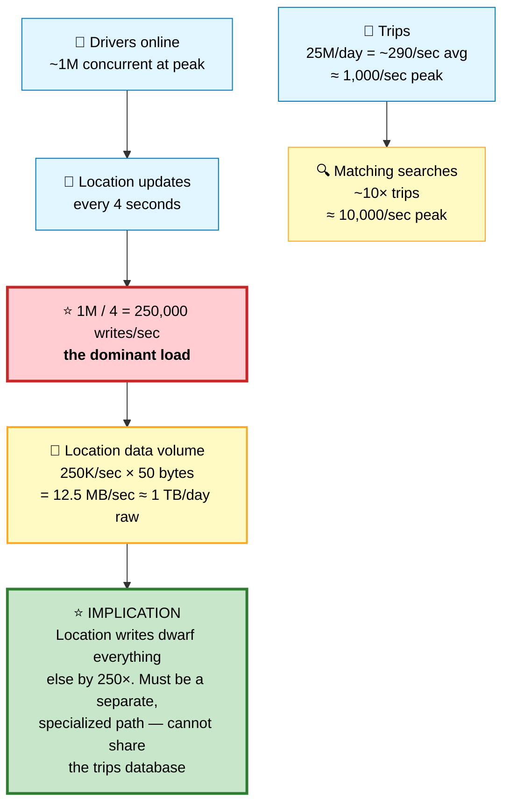

## 3. The Core Problem — Geospatial Matching

#### 💬 Why "find nearby drivers" is hard

The naive approach is a SQL query:

```sql
SELECT * FROM drivers
WHERE lat BETWEEN ? AND ? AND lng BETWEEN ? AND ?;
```

This fails for three reasons. First, a B-tree index on `(lat, lng)` can only efficiently filter on `lat` — the second column can't be range-scanned independently, so you scan a whole latitude band. Second, at 250K writes/sec the index is constantly being rebuilt. Third, a lat/lng box isn't a circle, and Earth isn't flat, so the math is wrong near the poles and at the antimeridian.

The solution is to **convert 2D space into 1D keys** so that nearby points have nearby keys.

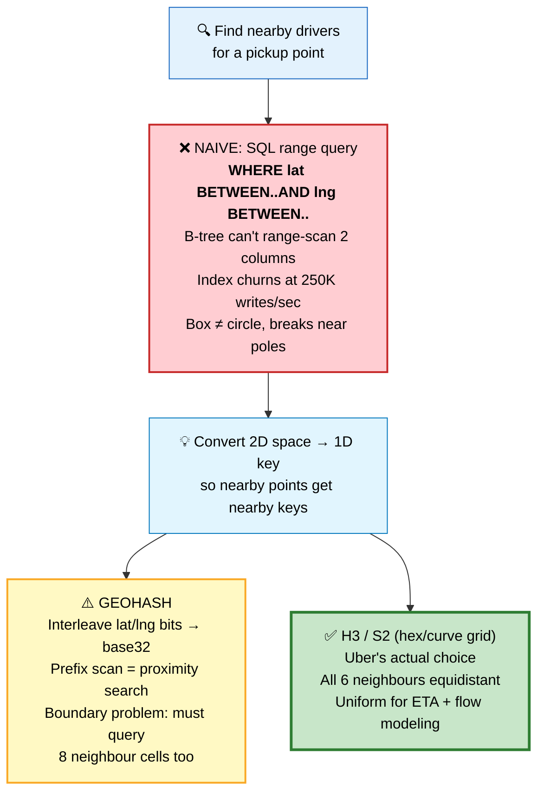

### Approach A — Geohash

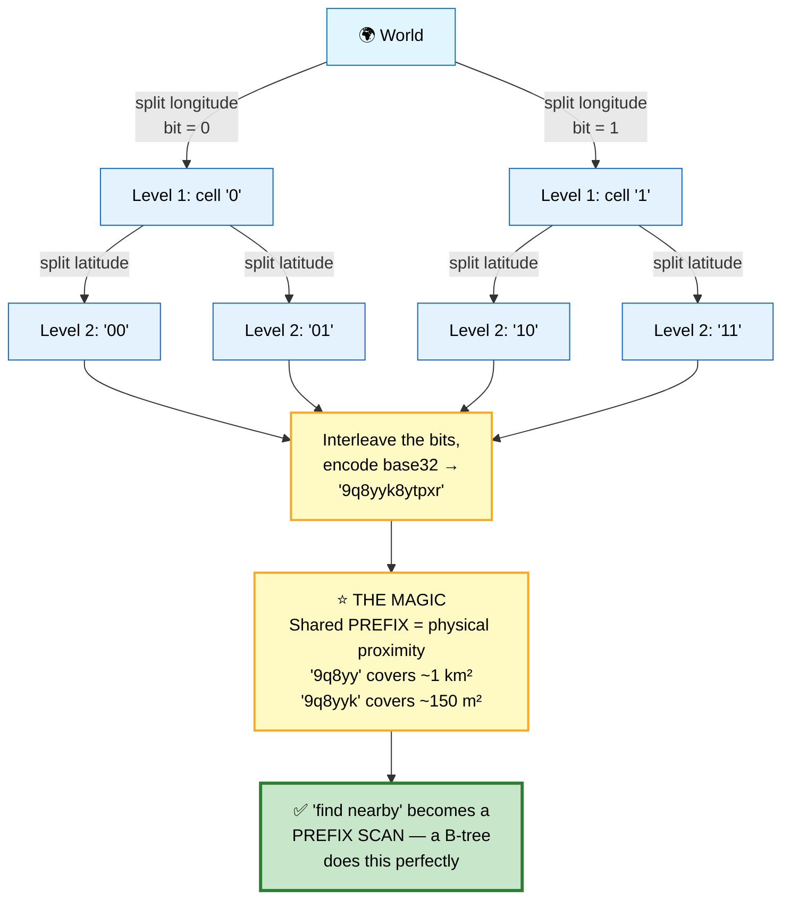

| Geohash chars | Cell size |
|---|---|
| 4 | ~20 km |
| 5 | ~2.4 km |
| 6 | ~600 m — typical for driver matching |
| 7 | ~76 m |
| 8 | ~19 m |

⚠️ **The geohash boundary problem:**

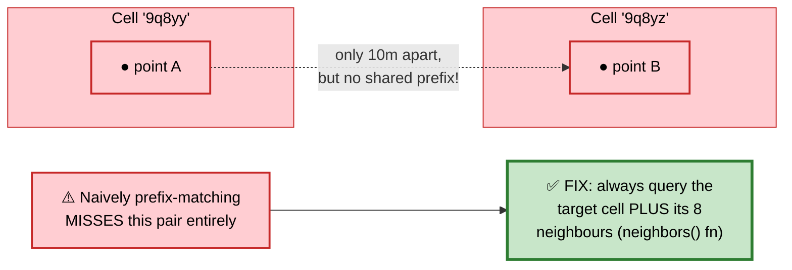

### Approach B — S2 (Google) and H3 (Uber's actual choice)

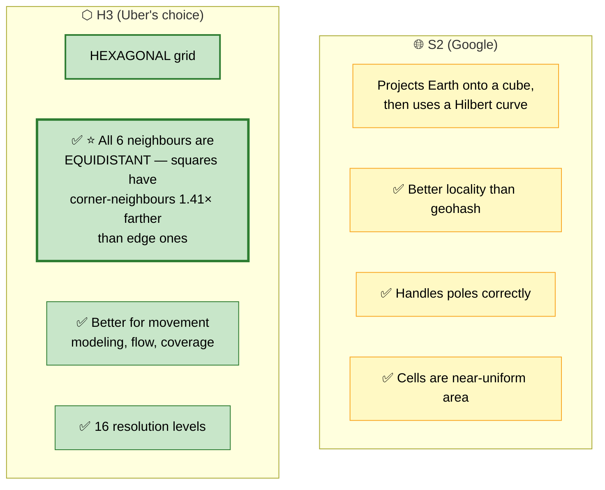

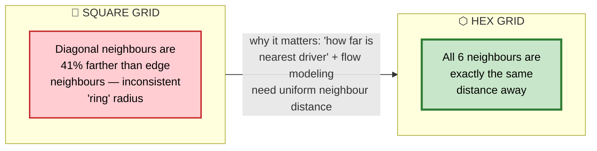

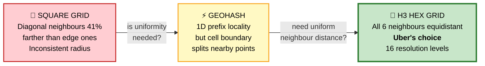

## 4. Architecture

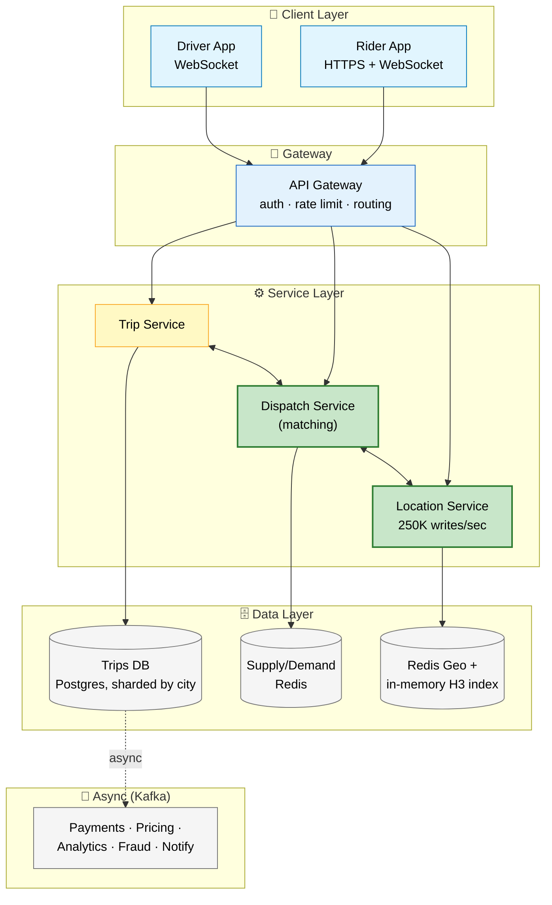

### ⭐ The insight that makes it tractable: geographic sharding

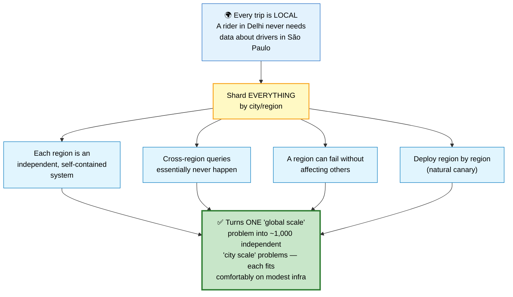

## 5. Deep Dive — The Matching Flow

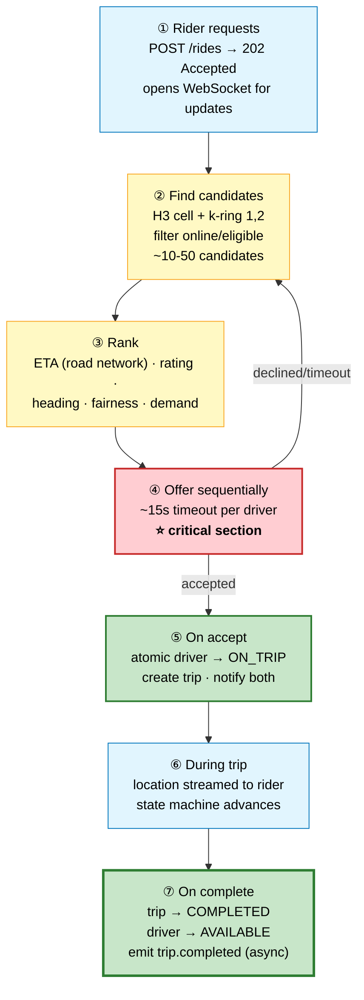

**Detail on each step:**
- **① Rider requests** — `POST /rides {pickup, dest, product: "uberX"}` returns immediately with a `request_id` (202 Accepted); the rider's app opens/uses a WebSocket for updates.
- **② Find candidates** — compute the H3 cell for the pickup point, fetch drivers in that cell plus rings 1 and 2 (k-ring), filter to online / not-on-a-trip / correct vehicle class / acceptance rate above threshold. Typically yields 10-50 candidates.
- **③ Rank** — not just nearest. The score blends ETA to pickup (⭐ via the road network, NOT straight-line), driver rating and acceptance rate, whether the driver is heading toward the destination, fairness/earnings balancing, and predicted demand at the destination.
- **④ Offer** sequentially (or in small batches) — send to the top candidate, wait ~15 seconds; declined or timeout moves to the next candidate. ⭐ This is the CRITICAL SECTION — see below.
- **⑤ On accept** — atomically transition driver → ON_TRIP, create the trip record, notify both parties over WebSocket, start location streaming to the rider.
- **⑥ During the trip** — driver location flows through the Location Service and is pushed to the rider; the trip state machine advances on driver actions.
- **⑦ On complete** — trip → COMPLETED, driver → AVAILABLE, emit a `trip.completed` event to Kafka. Payments, receipts, and ratings all happen ASYNCHRONOUSLY.

### ⭐ Deep dive — preventing double assignment

#### 💬 The problem
Two riders request simultaneously. Both matching processes see the same driver as available. Both offer. The driver accepts one — but if the other process has already marked them assigned, you have a driver committed to two trips. In the physical world, that's a stranded customer.

⭐ This is a **strong consistency requirement** inside an otherwise eventually-consistent system. It must be enforced atomically.

**Solution: a conditional atomic state transition.**

```sql
-- The driver's state lives in ONE authoritative place.
-- The WHERE clause is the lock.
UPDATE drivers
SET    status = 'ASSIGNED',
       trip_id = :trip_id,
       assigned_at = now()
WHERE  driver_id = :driver_id
  AND  status = 'AVAILABLE';     -- ⭐ fails if someone beat us

-- 0 rows affected → someone else got them → try the next candidate
```

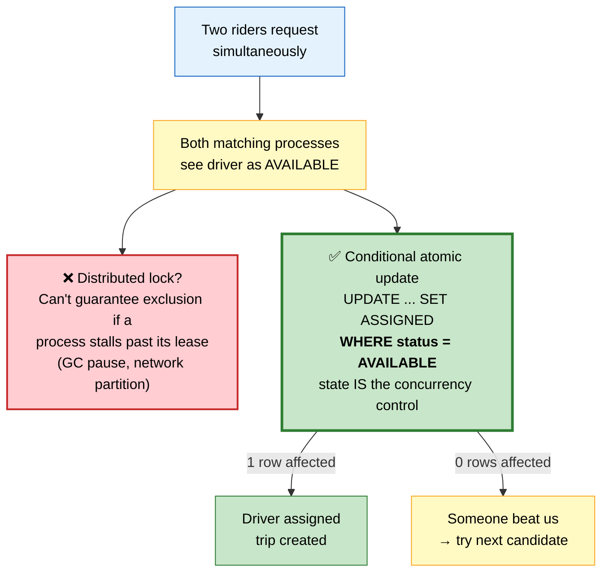

```
   Or in Redis, with a Lua script for atomicity:

   if redis.call('GET', KEYS[1]) == 'AVAILABLE' then
       redis.call('SET', KEYS[1], 'ASSIGNED', 'EX', 30)
       return 1
   else
       return 0
   end

   ⭐ The 30-second expiry is important: if the assigning process
     crashes after claiming the driver but before completing the
     trip creation, the driver auto-releases rather than being
     stuck forever.
```

⚠️ **Why a distributed lock is the wrong tool here:** a Redis lock can't guarantee mutual exclusion if a process stalls past its lease (GC pause, network partition). For correctness-critical state you want the STATE ITSELF to be the concurrency control — a conditional update on the authoritative record. See [Caching §8](../03-backend/caching.md#8-distributed-locking).

### ⭐ Deep dive — the location update firehose

#### 💬 The problem
250,000 writes per second, of data that is worthless 4 seconds later. Sending this through a normal database would be absurd.

⭐ **Key insight:** location data is EPHEMERAL and LOSS-TOLERANT. Missing one update out of 100 changes nothing. This frees you from durability requirements entirely on the hot path.

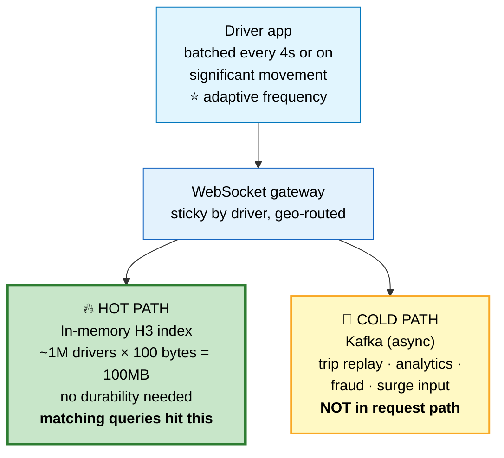

**Design in words:** the driver app batches updates (every 4s, or on significant movement — ⭐ adaptive: slower when stationary or on a highway with predictable position) and sends to a WebSocket gateway (sticky by driver, geographically routed). That gateway fans out to the in-memory H3 index (~1M drivers × ~100 bytes = 100 MB, fits in RAM, updated in place, no durability needed — this is what matching queries hit) and, separately, to Kafka for the cold path (trip replay, analytics, fraud detection, surge pricing input, driver payment verification — never in the request path).

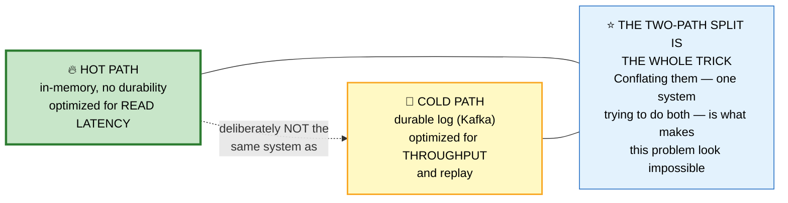

### ⭐ Deep dive — the trip state machine

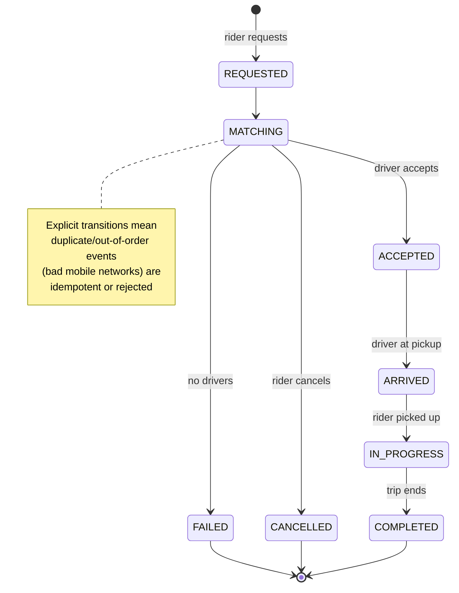

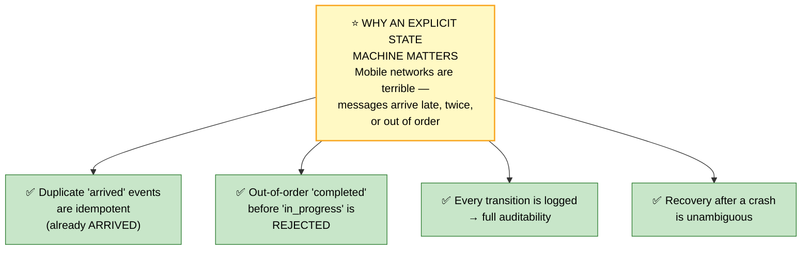

## 6. Surge Pricing

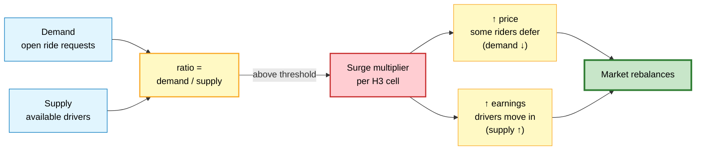

Per H3 cell, on a rolling window: `demand = open ride requests`, `supply = available drivers`, `ratio = demand / supply`; when `ratio > threshold` a multiplier is applied.

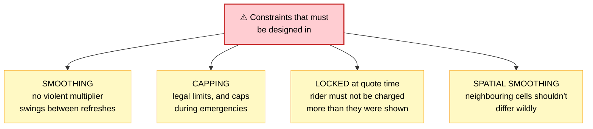

## 7. Failure Modes

```mermaid
flowchart TD
    F1["⚠️ NO DRIVERS AVAILABLE"] --> F1a["Expand search radius<br/>progressively"]
    F1 --> F1b["Offer a different<br/>product tier"]
    F1 --> F1c["Show honest wait estimates,<br/>offer to notify"]

    F2["⚠️ DRIVER GOES OFFLINE MID-TRIP<br/>(tunnel, dead battery)"] --> F2a["Last known location +<br/>heading retained"]
    F2 --> F2b["Rider sees 'reconnecting',<br/>not an error"]
    F2 --> F2c["⭐ Trip does NOT auto-cancel<br/>— physical trip is still<br/>happening"]

    F3["⚠️ MATCHING DOWN<br/>in one region"] --> F3a["✅ Geographic sharding contains<br/>the blast radius to that<br/>region — the payoff"]

    F4["⚠️ PAYMENT FAILS<br/>after the trip"] --> F4a["⭐ Trip completion is NEVER<br/>blocked on payment — the<br/>ride happened, that's a fact"]
    F4 --> F4b["Retries async; unpaid<br/>balance blocks the NEXT<br/>ride, not this one"]

    F5["⚠️ GPS DRIFT / SPOOFING"] --> F5a["Sanity-check against road<br/>network map-matching"]
    F5 --> F5b["Reject physically<br/>impossible jumps"]
    F5 --> F5c["Cross-check with<br/>accelerometer data"]

    style F1 fill:#ffcdd2,stroke:#c62828,stroke-width:2px,color:#000
    style F2 fill:#ffcdd2,stroke:#c62828,stroke-width:2px,color:#000
    style F3 fill:#ffcdd2,stroke:#c62828,stroke-width:2px,color:#000
    style F4 fill:#ffcdd2,stroke:#c62828,stroke-width:2px,color:#000
    style F5 fill:#ffcdd2,stroke:#c62828,stroke-width:2px,color:#000
    style F1a fill:#fff9c4,stroke:#f9a825,color:#000
    style F1b fill:#fff9c4,stroke:#f9a825,color:#000
    style F1c fill:#fff9c4,stroke:#f9a825,color:#000
    style F2a fill:#fff9c4,stroke:#f9a825,color:#000
    style F2b fill:#fff9c4,stroke:#f9a825,color:#000
    style F2c fill:#c8e6c9,stroke:#2e7d32,stroke-width:2px,color:#000
    style F3a fill:#c8e6c9,stroke:#2e7d32,stroke-width:3px,color:#000
    style F4a fill:#c8e6c9,stroke:#2e7d32,stroke-width:2px,color:#000
    style F4b fill:#fff9c4,stroke:#f9a825,color:#000
    style F5a fill:#fff9c4,stroke:#f9a825,color:#000
    style F5b fill:#fff9c4,stroke:#f9a825,color:#000
    style F5c fill:#fff9c4,stroke:#f9a825,color:#000
```

## 🎤 Interview Follow-Ups

<details>
<summary><b>"How do you handle a driver being offered two rides at once?"</b></summary>

The driver's status is held in one authoritative place, and assignment is a conditional atomic update: set status to ASSIGNED **only where the current status is AVAILABLE**. If zero rows are affected, someone else won the race and we move to the next candidate.

I'd deliberately avoid a distributed lock here. A Redis lock can't guarantee exclusion if the holder stalls past its lease — a GC pause or network partition means two processes can both believe they hold it. For correctness-critical state, the state record itself should be the concurrency control.

I'd also add a short expiry on the assignment claim, so if the assigning process crashes between claiming the driver and creating the trip, the driver auto-releases instead of being stuck offline.
</details>

<details>
<summary><b>"250K location writes/sec — how?"</b></summary>

The key realization is that location data is ephemeral and loss-tolerant. Missing one update out of a hundred changes nothing for the user. That frees the hot path from durability requirements entirely.

So I'd split it into two paths. The hot path writes into an in-memory H3-indexed structure — a million drivers at ~100 bytes each is only 100 MB, which fits comfortably in RAM. That's what matching queries read, and it needs no persistence because it's rebuilt from the stream within seconds.

The cold path publishes to Kafka asynchronously for analytics, trip replay, fraud detection, and surge input. That path optimizes for throughput and durability, and it's never in a user request path.

On the client side I'd also reduce the volume at source: batch updates, and adapt the frequency — a stationary driver doesn't need 4-second updates, and a driver on a highway has highly predictable position.
</details>

<details>
<summary><b>"Why hexagons instead of a square grid?"</b></summary>

Two reasons. In a square grid, the four diagonal neighbours are 41% farther away than the four edge neighbours, so "the ring of cells around me" isn't a consistent distance. With hexagons all six neighbours are equidistant, which makes radius expansion during matching uniform and makes distance approximations more accurate.

Second, hexagons tile without the ambiguity squares have at corners, which matters when modeling flow — supply and demand moving across a city. Uber built H3 specifically for this and open-sourced it.

Geohash is simpler and works fine for basic proximity, but it has the boundary problem where two points ten metres apart can have completely different prefixes if they straddle a cell edge, so you always have to query the eight neighbours too.
</details>

<details>
<summary><b>"How would you scale this globally?"</b></summary>

The critical insight is that every trip is local — a rider in Delhi never needs data about drivers in São Paulo. So I'd shard everything geographically by city or region.

That turns one global-scale problem into roughly a thousand independent city-scale problems. Each region is a self-contained deployment: its own matching service, its own location index, its own trip database shard. Cross-region queries essentially never happen.

The benefits compound. A region failure is contained. You can deploy region by region as a natural canary. Data residency requirements are satisfied structurally rather than through policy. And each region's infrastructure is sized to actual local demand rather than global peak.

The parts that stay global are user accounts, payment methods, and analytics — all low-volume and tolerant of higher latency.
</details>

<details>
<summary><b>"What if the matching service crashes mid-assignment?"</b></summary>

Several layers. The assignment claim has a short TTL, so a crashed process releases the driver automatically rather than leaving them stuck offline.

The trip record is written with an explicit state, so recovery reads the state and knows exactly where it stopped. Because transitions are validated against an explicit state machine, replaying or resuming can't produce an invalid state.

The rider's request is a durable record, not just an in-flight computation — so another matching worker can pick it up. And the rider app is polling or on a WebSocket, so if matching takes longer than expected they see "still finding a driver" rather than an error.

Finally, I'd add a timeout on the whole request: if matching hasn't succeeded within a bounded window, fail explicitly with a clear message and no charge, rather than leaving the rider waiting indefinitely.
</details>

---

# 🎬 Netflix

> **Teaches:** CDN economics, adaptive streaming, chaos engineering, and the "precompute everything" philosophy.

## 1. Requirements

### Functional

```mermaid
flowchart LR
    F1["🔍 Browse and search<br/>a catalogue"]
    F2["🏠 Personalized<br/>homepage rows"]
    F3["▶️ Stream video with<br/>adaptive quality"]
    F4["⏯️ Resume across<br/>devices"]
    F5["⬇️ Downloads for<br/>offline viewing"]
    F6["👥 Multiple profiles<br/>per account"]

    style F1 fill:#e1f5fe,stroke:#0277bd,color:#000
    style F2 fill:#e1f5fe,stroke:#0277bd,color:#000
    style F3 fill:#e1f5fe,stroke:#0277bd,color:#000
    style F4 fill:#e1f5fe,stroke:#0277bd,color:#000
    style F5 fill:#e1f5fe,stroke:#0277bd,color:#000
    style F6 fill:#e1f5fe,stroke:#0277bd,color:#000
```

### Non-functional

```mermaid
flowchart TD
    Scale["📈 SCALE<br/>~270M subscribers<br/>~15% of global internet<br/>downstream traffic at peak"]
    Avail["🛡️ AVAILABILITY<br/>99.99% for playback<br/>⭐ playback matters far<br/>more than browse"]
    Latency["⚡ LATENCY<br/>Start playback < 2s<br/>⭐ rebuffer ratio is the<br/>metric that matters most"]
    Quality["🎚️ QUALITY<br/>Adapt to bandwidth from<br/>500 kbps to 25 Mbps"]
    Geo["🌍 GEO<br/>190+ countries"]

    style Scale fill:#e3f2fd,stroke:#1565c0,color:#000
    style Avail fill:#c8e6c9,stroke:#2e7d32,stroke-width:3px,color:#000
    style Latency fill:#fff9c4,stroke:#f9a825,stroke-width:2px,color:#000
    style Quality fill:#e3f2fd,stroke:#1565c0,color:#000
    style Geo fill:#e3f2fd,stroke:#1565c0,color:#000
```

## 2. Estimation

```mermaid
flowchart TD
    Streams["📺 Concurrent streams (peak)<br/>~20M"] --> Bitrate["Average bitrate<br/>~5 Mbps"]
    Bitrate --> Peak["⭐ PEAK BANDWIDTH<br/>20M × 5 Mbps = 100 Tbps"]
    Peak --> Fact["100 Tbps is more than most<br/>countries' TOTAL internet<br/>capacity — physics and<br/>economics both forbid serving<br/>this from datacenters"]
    Fact --> Consequence["→ The ENTIRE architecture is<br/>a consequence of this one number<br/>→ Netflix must push content to<br/>the EDGE, inside ISP networks"]

    Catalogue["🎬 Catalogue<br/>~20,000 titles"] --> Files["Each encoded into<br/>~1,200 files (codecs ×<br/>resolutions × bitrates ×<br/>audio × subtitles)"]
    Files --> Storage["→ several petabytes of<br/>encoded content"]

    style Streams fill:#e1f5fe,stroke:#0277bd,color:#000
    style Bitrate fill:#e1f5fe,stroke:#0277bd,color:#000
    style Peak fill:#ffcdd2,stroke:#c62828,stroke-width:3px,color:#000
    style Fact fill:#fff9c4,stroke:#f9a825,stroke-width:2px,color:#000
    style Consequence fill:#c8e6c9,stroke:#2e7d32,stroke-width:3px,color:#000
    style Catalogue fill:#e1f5fe,stroke:#0277bd,color:#000
    style Files fill:#fff9c4,stroke:#f9a825,color:#000
    style Storage fill:#fff9c4,stroke:#f9a825,color:#000
```

## 3. Architecture — The Three Parts

```mermaid
flowchart TD
    subgraph Client["📱 Client Layer"]
        Device["TV / Mobile / Browser"]
    end

    subgraph Control["☁️ Control Plane (AWS)"]
        Micro["Hundreds of microservices<br/>signup · auth · browse · search ·<br/>recommendations · billing ·<br/>playback authorization"]
    end

    subgraph Data["🌐 Data Plane — Open Connect"]
        OCA["Purpose-built appliances<br/>INSIDE ISP datacenters<br/>serves ~100% of video bytes"]
    end

    subgraph Pipeline["🎞️ Encoding Pipeline (AWS, offline)"]
        Ingest["Ingest master"] --> Transcode["Transcode →<br/>~1,200 variants"]
        Transcode --> Validate["Validate"]
        Validate --> Distribute["Distribute to<br/>Open Connect appliances"]
    end

    Device -->|"metadata, auth, browse"| Micro
    Device -->|"video bytes"| OCA
    Distribute -.pushes content.-> OCA
    Micro -.playback authorization.-> OCA

    style Device fill:#e1f5fe,stroke:#0277bd,color:#000
    style Micro fill:#fff9c4,stroke:#f9a825,color:#000
    style OCA fill:#c8e6c9,stroke:#2e7d32,stroke-width:3px,color:#000
    style Ingest fill:#f5f5f5,stroke:#757575,color:#000
    style Transcode fill:#f5f5f5,stroke:#757575,color:#000
    style Validate fill:#f5f5f5,stroke:#757575,color:#000
    style Distribute fill:#e3f2fd,stroke:#1565c0,color:#000
```

### ⭐ Why Netflix built its own CDN

```mermaid
flowchart TD
    Cost["💸 Commercial CDNs charge<br/>per GB — at Netflix's volume<br/>that's billions/year, and no<br/>CDN even had the capacity"] --> Deal["🤝 OPEN CONNECT'S DEAL WITH ISPs<br/>Netflix gives the ISP a free<br/>appliance; ISP racks it and<br/>provides power + a network port"]
    Deal --> ISP["✅ ISP wins<br/>Traffic no longer crosses<br/>expensive transit links —<br/>served locally, big cost saving"]
    Deal --> Nflx["✅ Netflix wins<br/>Near-zero marginal bandwidth<br/>cost; content sits one hop<br/>from the viewer"]
    Deal --> User["✅ User wins<br/>Lower latency, fewer<br/>rebuffers, higher quality"]
    ISP --> Fill["⭐ PREDICTIVE FILL — the clever part<br/>Netflix predicts regional demand,<br/>PUSHES content to appliances<br/>during off-peak hours"]
    Nflx --> Fill
    User --> Fill
    Fill --> Result["✅ At peak, essentially every<br/>request is a local cache HIT —<br/>no origin fetches, no misses.<br/>Opposite of a normal CDN, which<br/>fills reactively on a miss"]

    style Cost fill:#ffcdd2,stroke:#c62828,stroke-width:2px,color:#000
    style Deal fill:#fff9c4,stroke:#f9a825,stroke-width:2px,color:#000
    style ISP fill:#e1f5fe,stroke:#0277bd,color:#000
    style Nflx fill:#e1f5fe,stroke:#0277bd,color:#000
    style User fill:#e1f5fe,stroke:#0277bd,color:#000
    style Fill fill:#fff9c4,stroke:#f9a825,stroke-width:2px,color:#000
    style Result fill:#c8e6c9,stroke:#2e7d32,stroke-width:3px,color:#000
```

```mermaid
flowchart LR
    A["🐌 COMMERCIAL CDN<br/>Pay per GB<br/>Billions/year at Netflix scale<br/>No CDN had the capacity"] -->|"can we avoid<br/>the toll?"| B["⚡ SELF-BUILT CDN<br/>Reactive fill on cache miss<br/>still has cold-start misses<br/>at peak"]
    B -->|"can we prefetch<br/>what's coming?"| C["🚀 OPEN CONNECT +<br/>PREDICTIVE FILL<br/>Push content off-peak,<br/>based on regional demand<br/>forecast — peak = 100% hit"]

    style A fill:#ffcdd2,stroke:#c62828,stroke-width:2px,color:#000
    style B fill:#fff9c4,stroke:#f9a825,stroke-width:2px,color:#000
    style C fill:#c8e6c9,stroke:#2e7d32,stroke-width:3px,color:#000
```

## 4. Deep Dive — Adaptive Bitrate Streaming

#### 💬 The problem
Network bandwidth fluctuates constantly. A fixed bitrate either buffers on a bad connection or wastes quality on a good one.

**Encoding — every title becomes a LADDER of variants**, each cut into 2-10 second SEGMENTS:

| Resolution | Bitrate | Use |
|---|---|---|
| 4K HDR | 15 Mbps | Fast fixed line, big screen |
| 1080p | 5 Mbps | Typical broadband |
| 720p | 3 Mbps | Good mobile / weak broadband |
| 480p | 1.5 Mbps | Congested mobile |
| 360p | 750 kbps | Poor connection |
| 240p | 300 kbps | Emergency — audio must survive |

```mermaid
flowchart LR
    S1["seg1<br/>1080p"] --> S2["seg2<br/>1080p"] --> S3["seg3<br/>480p<br/>⚠️ bandwidth dropped<br/>→ switched DOWN"] --> S4["seg4<br/>720p<br/>recovering"] --> S5["seg5<br/>1080p<br/>back to full quality"]

    style S1 fill:#c8e6c9,stroke:#2e7d32,color:#000
    style S2 fill:#c8e6c9,stroke:#2e7d32,color:#000
    style S3 fill:#ffcdd2,stroke:#c62828,stroke-width:2px,color:#000
    style S4 fill:#fff9c4,stroke:#f9a825,color:#000
    style S5 fill:#c8e6c9,stroke:#2e7d32,color:#000
```

⭐ **Why the client decides, not the server:** only the client knows its true conditions — CPU load, screen size, actual measured throughput, battery state. A server can only guess. This also keeps the server stateless: it just serves segment files.

```mermaid
flowchart TD
    Start["Before each segment"] --> Measure["Measure recent<br/>throughput"]
    Measure --> Buffer["Check buffer level<br/>(seconds ready to play)"]
    Buffer --> Decide{"Pick highest bitrate<br/>that throughput sustains<br/>AND keeps buffer safe"}
    Decide -->|"bandwidth OK"| Up["Step UP<br/>conservatively"]
    Decide -->|"bandwidth dropped"| Down["Step DOWN<br/>aggressively<br/><b>rebuffer is worse than<br/>lower quality</b>"]
    Up --> Request["Request next<br/>segment at chosen bitrate"]
    Down --> Request

    style Start fill:#e1f5fe,stroke:#0277bd,color:#000
    style Measure fill:#e3f2fd,stroke:#1565c0,color:#000
    style Buffer fill:#e3f2fd,stroke:#1565c0,color:#000
    style Decide fill:#fff9c4,stroke:#f9a825,stroke-width:2px,color:#000
    style Up fill:#c8e6c9,stroke:#2e7d32,color:#000
    style Down fill:#ffcdd2,stroke:#c62828,stroke-width:2px,color:#000
    style Request fill:#c8e6c9,stroke:#2e7d32,stroke-width:3px,color:#000
```

### Per-title encoding — the optimization that saved petabytes

```mermaid
flowchart TD
    Old["❌ OLD: one fixed bitrate<br/>ladder for every title<br/>Drama and action film BOTH<br/>get the same 5 Mbps 1080p<br/>encode"] --> Problem["Drama looks perfect at<br/>2 Mbps (wasted bits);<br/>action needs 8 Mbps<br/>(starved, artifacts)"]
    Problem --> New["✅ NEW: analyze each title's<br/>complexity, generate a<br/>CUSTOM ladder"]
    New --> Simple["Simple content:<br/>~50% bandwidth reduction<br/>at equal quality"]
    New --> Complex["Complex content:<br/>higher bitrate where<br/>actually needed"]
    Simple --> Aggregate["Aggregate: massive<br/>bandwidth + storage savings"]
    Complex --> Aggregate
    Aggregate --> Shot["⭐ EVEN FURTHER: per-SHOT<br/>encoding — a dialogue scene<br/>and an explosion within the<br/>SAME title have wildly<br/>different needs"]

    style Old fill:#ffcdd2,stroke:#c62828,stroke-width:2px,color:#000
    style Problem fill:#ffcdd2,stroke:#c62828,color:#000
    style New fill:#fff9c4,stroke:#f9a825,stroke-width:2px,color:#000
    style Simple fill:#e1f5fe,stroke:#0277bd,color:#000
    style Complex fill:#e1f5fe,stroke:#0277bd,color:#000
    style Aggregate fill:#c8e6c9,stroke:#2e7d32,stroke-width:2px,color:#000
    style Shot fill:#c8e6c9,stroke:#2e7d32,stroke-width:3px,color:#000
```

```mermaid
flowchart LR
    A["🐌 FIXED LADDER<br/>Same 5 Mbps 1080p<br/>for every title<br/>Wastes bits on simple<br/>content, starves complex"] -->|"does complexity<br/>vary by title?"| B["⚡ PER-TITLE ENCODING<br/>Custom ladder per title<br/>~50% savings on simple<br/>content"]
    B -->|"does it vary<br/>within a title?"| C["🚀 PER-SHOT ENCODING<br/><b>Netflix's actual choice</b><br/>Dialogue vs explosion get<br/>different bitrates"]

    style A fill:#ffcdd2,stroke:#c62828,stroke-width:2px,color:#000
    style B fill:#fff9c4,stroke:#f9a825,stroke-width:2px,color:#000
    style C fill:#c8e6c9,stroke:#2e7d32,stroke-width:3px,color:#000
```

## 5. Deep Dive — Personalization

```mermaid
flowchart TD
    Core["⭐ EVERY PIXEL OF THE<br/>HOMEPAGE IS PERSONALIZED"] --> P1["WHICH rows appear,<br/>and in what order"]
    Core --> P2["WHICH titles are in<br/>each row, and in what order"]
    Core --> P3["⭐ WHICH artwork is shown<br/>for each title<br/>(often overlooked)"]
    Core --> P4["The row TITLES<br/>themselves"]
    P3 --> Artwork["🎨 Artwork personalization is real:<br/>the same film might show a romantic<br/>still to one user, an action still<br/>to another — based on viewing<br/>history. Measurably increases<br/>engagement."]

    style Core fill:#e3f2fd,stroke:#1565c0,color:#000
    style P1 fill:#e1f5fe,stroke:#0277bd,color:#000
    style P2 fill:#e1f5fe,stroke:#0277bd,color:#000
    style P3 fill:#fff9c4,stroke:#f9a825,stroke-width:2px,color:#000
    style P4 fill:#e1f5fe,stroke:#0277bd,color:#000
    style Artwork fill:#c8e6c9,stroke:#2e7d32,stroke-width:3px,color:#000
```

```mermaid
flowchart LR
    subgraph Offline["🕐 Offline (hourly/daily)"]
        Train["Train ranking models"] --> Precompute["Precompute candidate<br/>sets per user cohort"]
        Precompute --> Write["Write to fast<br/>key-value store"]
    end

    subgraph NearRT["⏱️ Near-real-time"]
        Adjust["Adjust for recent activity<br/>e.g. just finished S1 → show S2"]
    end

    subgraph ReqTime["⚡ Request time (<100ms)"]
        Fetch["Fetch precomputed rows"]
        Filter["Apply region/licensing filters"]
        Rules["Continue-watching +<br/>freshness rules"]
        Render["Render homepage"]
        Fetch --> Filter --> Rules --> Render
    end

    Write --> Fetch
    Adjust --> Filter

    style Train fill:#f5f5f5,stroke:#757575,color:#000
    style Precompute fill:#f5f5f5,stroke:#757575,color:#000
    style Write fill:#c8e6c9,stroke:#2e7d32,stroke-width:2px,color:#000
    style Adjust fill:#fff9c4,stroke:#f9a825,color:#000
    style Fetch fill:#e1f5fe,stroke:#0277bd,color:#000
    style Filter fill:#e1f5fe,stroke:#0277bd,color:#000
    style Rules fill:#e1f5fe,stroke:#0277bd,color:#000
    style Render fill:#c8e6c9,stroke:#2e7d32,stroke-width:3px,color:#000
```

## 6. Deep Dive — Resilience

Netflix essentially invented modern chaos engineering because their scale made failure constant.

```mermaid
flowchart TD
    CM["🐒 CHAOS MONKEY<br/>randomly kills instances<br/>IN PRODUCTION<br/>Forces every service to<br/>survive instance death, always"]
    CK["🦍 CHAOS KONG<br/>takes out an entire<br/>AWS REGION<br/>Validates traffic can be<br/>evacuated to other regions"]
    HY["⚡ HYSTRIX / resilience4j<br/>circuit breakers everywhere<br/>Every cross-service call has<br/>a defined FALLBACK"]
    CM --> Philosophy["⭐ GRACEFUL DEGRADATION<br/>the design philosophy"]
    CK --> Philosophy
    HY --> Philosophy
    Philosophy --> Rule["PLAYBACK NEVER STOPS<br/>Everything else is optional —<br/>the product hierarchy is<br/>encoded into the architecture"]

    style CM fill:#fff9c4,stroke:#f9a825,stroke-width:2px,color:#000
    style CK fill:#fff9c4,stroke:#f9a825,stroke-width:2px,color:#000
    style HY fill:#fff9c4,stroke:#f9a825,stroke-width:2px,color:#000
    style Philosophy fill:#e3f2fd,stroke:#1565c0,stroke-width:2px,color:#000
    style Rule fill:#c8e6c9,stroke:#2e7d32,stroke-width:3px,color:#000
```

```mermaid
flowchart TD
    Call["Cross-service call"] --> CB{"Circuit breaker<br/>(Hystrix/resilience4j)"}
    CB -->|"service healthy"| Normal["Normal response"]
    CB -->|"personalization down"| F1["✅ Fallback:<br/>generic popular list"]
    CB -->|"search down"| F2["✅ Fallback:<br/>browse categories"]
    CB -->|"artwork service down"| F3["✅ Fallback:<br/>default artwork"]
    CB -->|"ratings down"| F4["✅ Fallback:<br/>hide ratings, keep playing"]
    F1 --> Core["🎬 PLAYBACK<br/>never stops"]
    F2 --> Core
    F3 --> Core
    F4 --> Core
    Normal --> Core

    style Call fill:#e1f5fe,stroke:#0277bd,color:#000
    style CB fill:#fff9c4,stroke:#f9a825,stroke-width:2px,color:#000
    style Normal fill:#e3f2fd,stroke:#1565c0,color:#000
    style F1 fill:#fff9c4,stroke:#f9a825,color:#000
    style F2 fill:#fff9c4,stroke:#f9a825,color:#000
    style F3 fill:#fff9c4,stroke:#f9a825,color:#000
    style F4 fill:#fff9c4,stroke:#f9a825,color:#000
    style Core fill:#c8e6c9,stroke:#2e7d32,stroke-width:3px,color:#000
```

## 🎤 Interview Follow-Ups

<details>
<summary><b>"Why did Netflix build its own CDN?"</b></summary>

Economics and capacity. At peak Netflix pushes on the order of 100 terabits per second — more than most countries' total internet capacity. No commercial CDN had that capacity, and at per-GB pricing the bill would have been billions annually.

Open Connect inverts the model. Netflix gives ISPs a free appliance; the ISP provides rack space, power, and a port. The ISP saves enormously on transit costs because Netflix traffic no longer crosses their expensive upstream links, and Netflix gets near-zero marginal bandwidth cost with content sitting one hop from the viewer.

The genuinely clever part is predictive fill. Netflix can predict regional viewing demand accurately, so it pushes content to appliances during off-peak hours. At peak, essentially every request is a local cache hit — no origin fetches at all. That's the opposite of a normal CDN, which fills reactively on cache misses.
</details>

<details>
<summary><b>"How does adaptive bitrate work, and why does the client decide?"</b></summary>

Each title is encoded into a ladder of quality variants, and each variant is cut into short segments — typically 2 to 10 seconds. The client requests segments one at a time and picks the quality level for each.

The client's algorithm combines measured throughput from recent downloads with the current buffer level, then selects the highest bitrate that recent throughput can sustain while keeping the buffer above a safety threshold. It's deliberately conservative about stepping up and aggressive about stepping down, because a rebuffer hurts the user far more than a temporary quality drop.

The client decides rather than the server because only the client knows its actual conditions — real measured throughput, CPU load, screen size, battery state. A server can only guess. It also keeps the server completely stateless: it just serves segment files, which is exactly what a CDN is good at.
</details>

<details>
<summary><b>"What is per-title encoding and why does it matter?"</b></summary>

Originally Netflix used one fixed bitrate ladder for every title. That's wasteful in both directions — a static talking-heads drama looks perfect at 2 Mbps, while a fast-action film needs 8 Mbps to avoid artifacts. Using 5 Mbps for both wastes bandwidth on one and degrades the other.

Per-title encoding analyzes each title's visual complexity and generates a custom ladder. For simple content that's roughly a 50% bandwidth reduction at equivalent perceived quality; for complex content it allocates more where it's actually needed.

Netflix pushed this further to per-shot encoding, since complexity varies within a title too — a dialogue scene and an explosion have completely different requirements. At Netflix's scale, a few percent of bandwidth is worth enormous money, so this optimization pays for very substantial encoding compute.
</details>

<details>
<summary><b>"How do you keep playback available when services fail?"</b></summary>

By encoding the product hierarchy into the architecture. Playback is sacred; everything else is optional and degrades independently.

Concretely, every cross-service call is wrapped in a circuit breaker with a defined fallback. If personalization fails, show a generic popular list. If search fails, show browse categories. If the artwork service fails, use default images. If ratings fail, hide ratings. In every case the user can still find something and press play.

This is validated continuously rather than assumed. Chaos Monkey randomly terminates production instances, so no service can have an untested failover path. Chaos Kong evacuates entire AWS regions to prove cross-region failover actually works. The philosophy is that if you don't test failure constantly, you're just hoping — and hope fails at scale.
</details>

---

# 🐦 Twitter

> **Teaches:** fan-out strategies, the celebrity problem, and read-heavy system design.

## 1. Requirements

```mermaid
flowchart LR
    subgraph Functional["✅ Functional"]
        F1["Post a tweet<br/>(280 chars, optional media)"]
        F2["Follow / unfollow users"]
        F3["Home timeline<br/>(followees, reverse-chron)"]
        F4["User timeline<br/>(one user's tweets)"]
        F5["Like, retweet, reply"]
    end
    subgraph OOS["🚫 Out of scope"]
        O1["DMs · search · trending ·<br/>ads · spaces · lists"]
    end

    style F1 fill:#e1f5fe,stroke:#0277bd,color:#000
    style F2 fill:#e1f5fe,stroke:#0277bd,color:#000
    style F3 fill:#e1f5fe,stroke:#0277bd,color:#000
    style F4 fill:#e1f5fe,stroke:#0277bd,color:#000
    style F5 fill:#e1f5fe,stroke:#0277bd,color:#000
    style O1 fill:#f5f5f5,stroke:#757575,color:#000
```

```mermaid
flowchart TD
    Scale["📈 SCALE<br/>~250M DAU<br/>~500M tweets/day"]
    Ratio["⭐ READ:WRITE ≈ 1000:1<br/>this single number<br/>drives everything"]
    Latency["⚡ LATENCY<br/>Timeline load < 200ms p99"]
    Avail["🛡️ AVAILABILITY<br/>99.99%"]
    Consist["🔓 CONSISTENCY<br/>Eventual is fine — a tweet<br/>2 seconds late is acceptable.<br/>This is a huge freedom."]

    style Scale fill:#e3f2fd,stroke:#1565c0,color:#000
    style Ratio fill:#ffcdd2,stroke:#c62828,stroke-width:3px,color:#000
    style Latency fill:#e3f2fd,stroke:#1565c0,color:#000
    style Avail fill:#e3f2fd,stroke:#1565c0,color:#000
    style Consist fill:#c8e6c9,stroke:#2e7d32,stroke-width:2px,color:#000
```

## 2. Estimation

```mermaid
flowchart TD
    Writes["✍️ WRITES<br/>500M tweets/day / 86,400<br/>≈ 6,000/sec avg<br/>≈ 18,000/sec peak"]
    Reads["📖 READS<br/>250M users × ~50 loads/day<br/>= 12.5B/day ≈ 145,000 QPS avg<br/>≈ 500,000 QPS peak"]
    Writes --> Ratio["⭐ RATIO ≈ 1000:1 READ HEAVY"]
    Reads --> Ratio
    Ratio --> I1["→ precompute on WRITE,<br/>never compute on READ"]
    Ratio --> I2["→ cache aggressively"]
    Ratio --> I3["→ accept write amplification<br/>to buy read speed"]

    Storage["💾 STORAGE<br/>500M × 300 bytes = 150 GB/day text<br/>+ media via object storage/CDN<br/>≈ 165 TB/year with replication"]
    Cache["⚡ TIMELINE CACHE<br/>250M × 800 IDs × 8 bytes ≈ 1.6 TB<br/>but only ~10% active daily<br/>→ ~160 GB hot data — feasible in Redis"]

    style Writes fill:#e1f5fe,stroke:#0277bd,color:#000
    style Reads fill:#e1f5fe,stroke:#0277bd,color:#000
    style Ratio fill:#ffcdd2,stroke:#c62828,stroke-width:3px,color:#000
    style I1 fill:#c8e6c9,stroke:#2e7d32,color:#000
    style I2 fill:#c8e6c9,stroke:#2e7d32,color:#000
    style I3 fill:#c8e6c9,stroke:#2e7d32,color:#000
    style Storage fill:#fff9c4,stroke:#f9a825,color:#000
    style Cache fill:#fff9c4,stroke:#f9a825,color:#000
```

## 3. The Core Problem — Timeline Generation

#### 💬 Why this is the whole interview

A home timeline is *"all tweets from everyone I follow, merged, newest first."* Computing that on demand means querying N followees and merging — at 500K QPS with an average of 200 followees, that's 100 million queries per second. Impossible.

### Option A — Fan-out on read (pull)

```mermaid
flowchart LR
    Post["Tweet post"] -->|"one write"| Table[("tweets table<br/>store once")]
    Table -->|"on timeline read"| Query["Query all N<br/>followees"]
    Query --> Merge["Merge by<br/>timestamp"]
    Merge --> Timeline["Timeline"]

    style Post fill:#e1f5fe,stroke:#0277bd,color:#000
    style Table fill:#f5f5f5,stroke:#757575,color:#000
    style Query fill:#ffcdd2,stroke:#c62828,stroke-width:2px,color:#000
    style Merge fill:#ffcdd2,stroke:#c62828,stroke-width:2px,color:#000
    style Timeline fill:#fff9c4,stroke:#f9a825,color:#000
```

✅ Write is O(1) — cheap and instant. ✅ No storage duplication. ✅ No wasted work for users who never log in.
❌ Read is O(N followees) with a merge — far too slow. ❌ Impossible to cache effectively (every user's timeline differs).

### Option B — Fan-out on write (push)

```mermaid
flowchart LR
    Post["Tweet post"] --> Worker["Fan-out worker<br/>(async)"]
    Worker --> L1["follower1: [ids...]"]
    Worker --> L2["follower2: [ids...]"]
    Worker --> L3["follower3: [ids...]"]
    L1 & L2 & L3 -.stored as.-> Redis[("Redis lists")]

    style Post fill:#e1f5fe,stroke:#0277bd,color:#000
    style Worker fill:#fff9c4,stroke:#f9a825,stroke-width:2px,color:#000
    style L1 fill:#c8e6c9,stroke:#2e7d32,color:#000
    style L2 fill:#c8e6c9,stroke:#2e7d32,color:#000
    style L3 fill:#c8e6c9,stroke:#2e7d32,color:#000
    style Redis fill:#f5f5f5,stroke:#757575,color:#000
```

✅ Read is O(1) — just fetch a list, blazing fast. ✅ Trivially cacheable.
❌ Write amplification: 1 tweet → N writes. ❌ ⚠️ A user with 100M followers = 100M writes for ONE tweet. ❌ Wasted work for inactive followers.

### ⭐ Option C — Hybrid (what actually works)

```mermaid
flowchart LR
    A["🐌 FAN-OUT ON READ<br/>Write O(1)<br/>Read = query N followees<br/>+ merge<br/>~100M queries/sec — impossible"] -->|"reads dominate<br/>1000:1..."| B["⚡ FAN-OUT ON WRITE<br/>Read O(1) — fetch a list<br/>Write = push to N followers<br/>Celebrity = 100M writes/tweet"]
    B -->|"...but celebrities<br/>break write side"| C["🚀 HYBRID<br/><b>Twitter's actual choice</b><br/>Fan out normal users<br/>Pull celebrities at read time<br/>merge by timestamp"]

    style A fill:#ffcdd2,stroke:#c62828,stroke-width:2px,color:#000
    style B fill:#fff9c4,stroke:#f9a825,stroke-width:2px,color:#000
    style C fill:#c8e6c9,stroke:#2e7d32,stroke-width:3px,color:#000
```

**The hybrid design, in words:** on write, if `follower_count < THRESHOLD (~10,000)` fan out — push the tweet ID to each follower's timeline list, asynchronously via a queue. If the account is a celebrity, do NOT fan out; store once, full stop. On read: fetch the precomputed timeline list (fast), fetch recent tweets from the few celebrities this user follows (small N, heavily cached — every one of a celebrity's followers reads the same data), then merge the two by timestamp.

✅ Write amplification is BOUNDED (celebrities excluded). ✅ Read is still fast: one list fetch plus a small merge. ✅ Celebrity tweets are cached once and read by millions — the most cache-efficient possible arrangement. ✅ Matches the actual power-law distribution of follower counts.

```mermaid
flowchart TD
    Tweet["User posts a tweet"] --> Check{"follower_count<br/>< threshold (~10K)?"}
    Check -->|"Yes — normal user"| FanOut["Fan out: push tweet_id<br/>to each follower's<br/>timeline list (async queue)"]
    Check -->|"No — celebrity"| Skip["Do NOT fan out<br/>Store once. Full stop."]

    FanOut --> Read["ON READ:<br/>① fetch precomputed list<br/>② fetch recent tweets from<br/>the few celebrities followed<br/>(heavily cached)<br/>③ merge by timestamp"]
    Skip --> Read

    style Tweet fill:#e1f5fe,stroke:#0277bd,color:#000
    style Check fill:#fff9c4,stroke:#f9a825,stroke-width:2px,color:#000
    style FanOut fill:#c8e6c9,stroke:#2e7d32,stroke-width:2px,color:#000
    style Skip fill:#c8e6c9,stroke:#2e7d32,stroke-width:2px,color:#000
    style Read fill:#c8e6c9,stroke:#2e7d32,stroke-width:3px,color:#000
```

### ⭐ Refinements that show depth

```mermaid
flowchart TD
    R1["① FAN OUT ONLY TO ACTIVE USERS<br/>Only push to users who logged in<br/>within ~30 days; inactive users<br/>get their timeline built lazily<br/>on return"] --> R1i["→ cuts fan-out volume<br/>dramatically (most<br/>accounts are dormant)"]
    R2["② CAP THE TIMELINE LENGTH<br/>Store ~800 tweet IDs per user;<br/>nobody scrolls further. Deeper<br/>pagination falls back to pull"] --> R2i["→ bounds memory:<br/>800 × 8 bytes =<br/>6.4 KB per user"]
    R3["③ FAN-OUT IS ASYNCHRONOUS<br/>POST /tweets writes + enqueues<br/>a fan-out job, returns immediately"] --> R3i["→ 50,000-follower user<br/>doesn't wait for<br/>50,000 writes"]
    R4["④ STORE IDs, NOT CONTENT<br/>Timeline lists hold tweet IDs;<br/>content fetched from a<br/>separate cache by ID"] --> R4i["→ one copy of content,<br/>not N copies — edits/<br/>deletes update one place"]
    R5["⑤ THRESHOLD IS TUNABLE<br/>10,000 is illustrative — balance<br/>fan-out cost vs read-merge cost"]

    style R1 fill:#e1f5fe,stroke:#0277bd,color:#000
    style R2 fill:#e1f5fe,stroke:#0277bd,color:#000
    style R3 fill:#e1f5fe,stroke:#0277bd,color:#000
    style R4 fill:#e1f5fe,stroke:#0277bd,color:#000
    style R5 fill:#fff9c4,stroke:#f9a825,stroke-width:2px,color:#000
    style R1i fill:#c8e6c9,stroke:#2e7d32,color:#000
    style R2i fill:#c8e6c9,stroke:#2e7d32,color:#000
    style R3i fill:#c8e6c9,stroke:#2e7d32,color:#000
    style R4i fill:#c8e6c9,stroke:#2e7d32,color:#000
```

## 4. Architecture

```mermaid
flowchart TD
    subgraph Client["📱 Client Layer"]
        C["Client"]
    end

    subgraph Gateway["🚪 Gateway"]
        GW["API Gateway"]
    end

    subgraph Services["⚙️ Service Layer"]
        TS["Tweet Service<br/>(write path)"]
        TL["Timeline Service<br/>(read path)"]
        FO["Fan-out workers"]
    end

    subgraph Data["🗄️ Data Layer"]
        TDB[("Tweets DB<br/>sharded by tweet_id")]
        Kafka["Kafka"]
        RTC[("Redis Timeline Cluster<br/>user_id → [tweet_id...]<br/>capped ~800")]
        TCC[("Tweet Content Cache<br/>tweet_id → {text, author}")]
        SG[("Social Graph<br/>follows, heavily cached")]
    end

    C --> GW
    GW --> TS
    GW --> TL
    TS --> TDB
    TS --> Kafka
    Kafka --> FO
    FO --> RTC
    TL --> RTC
    RTC --> TCC
    FO -.reads.-> SG
    TL -.reads.-> SG

    style C fill:#e1f5fe,stroke:#0277bd,color:#000
    style GW fill:#e3f2fd,stroke:#1565c0,color:#000
    style TS fill:#fff9c4,stroke:#f9a825,color:#000
    style TL fill:#c8e6c9,stroke:#2e7d32,stroke-width:2px,color:#000
    style FO fill:#fff9c4,stroke:#f9a825,color:#000
    style TDB fill:#f5f5f5,stroke:#757575,color:#000
    style Kafka fill:#f5f5f5,stroke:#757575,color:#000
    style RTC fill:#c8e6c9,stroke:#2e7d32,stroke-width:3px,color:#000
    style TCC fill:#f5f5f5,stroke:#757575,color:#000
    style SG fill:#f5f5f5,stroke:#757575,color:#000
```

Social graph (follows) lives in its own service and store, heavily cached, since fan-out reads it constantly.

## 5. Deep Dive — The Social Graph

The two queries have very different profiles: *"Who does user X follow?"* is bounded (thousands at most) and read on every timeline build, while *"Who follows user X?"* is ⚠️ UNBOUNDED (up to 100M+) and read on every fan-out. Storage is a `follows(follower_id, followee_id, created_at)` table with an index on each side. ⭐ Shard by `follower_id` so "who do I follow" is a single-shard query — that's the one on the hot read path. "Who follows me" becomes scatter-gather, but it's only used by asynchronous fan-out where latency doesn't matter.

```mermaid
flowchart LR
    Follows[("follows table<br/>(follower_id, followee_id)")]
    Follows --> Idx1["index(follower_id)<br/>'who do I follow'<br/>bounded, single-shard<br/>⭐ hot READ path"]
    Follows --> Idx2["index(followee_id)<br/>'who follows me'<br/>⚠️ unbounded, scatter-gather<br/>used only by async fan-out"]

    style Follows fill:#f5f5f5,stroke:#757575,color:#000
    style Idx1 fill:#c8e6c9,stroke:#2e7d32,stroke-width:3px,color:#000
    style Idx2 fill:#fff9c4,stroke:#f9a825,stroke-width:2px,color:#000
```

## 6. Deep Dive — The Celebrity Problem

#### 💬 Beyond fan-out

The celebrity problem shows up in several places, not just fan-out: a **hot key on read** (a celebrity's tweet fetched by millions simultaneously melts one Redis node), **engagement counter contention** (millions of likes hit one row), and a **thundering herd on post** (millions refresh the instant a celebrity tweets).

```mermaid
flowchart TD
    Hot["⚠️ Celebrity tweet<br/>millions read same key"] --> P1["Problem: one Redis node<br/>gets all the traffic"]
    P1 --> Fix1["✅ Replicate hot key across<br/>N nodes, read random replica"]
    P1 --> Fix2["✅ Small L1 cache per app<br/>server, short TTL"]

    Likes["⚠️ Millions of likes<br/>on one tweet"] --> P2["Problem: contention<br/>on one counter row"]
    P2 --> Fix3["✅ Sharded counters<br/>counter:tweet:0..15<br/>increment random shard,<br/>sum on read"]

    Post["⚠️ Celebrity tweets,<br/>millions refresh at once"] --> P3["Problem: thundering herd"]
    P3 --> Fix4["✅ Warm cache on WRITE,<br/>not on first reader"]

    style Hot fill:#ffcdd2,stroke:#c62828,color:#000
    style P1 fill:#ffcdd2,stroke:#c62828,stroke-width:2px,color:#000
    style Fix1 fill:#c8e6c9,stroke:#2e7d32,color:#000
    style Fix2 fill:#c8e6c9,stroke:#2e7d32,color:#000
    style Likes fill:#ffcdd2,stroke:#c62828,color:#000
    style P2 fill:#ffcdd2,stroke:#c62828,stroke-width:2px,color:#000
    style Fix3 fill:#c8e6c9,stroke:#2e7d32,stroke-width:2px,color:#000
    style Post fill:#ffcdd2,stroke:#c62828,color:#000
    style P3 fill:#ffcdd2,stroke:#c62828,stroke-width:2px,color:#000
    style Fix4 fill:#c8e6c9,stroke:#2e7d32,color:#000
```

## 7. Failure Modes

```mermaid
flowchart TD
    F1["⚠️ FAN-OUT QUEUE BACKS UP"] --> F1a["Timelines go stale<br/>(tweets appear late)"]
    F1 --> F1b["✅ NOT an outage —<br/>degraded freshness"]
    F1 --> F1c["Monitor consumer lag as<br/>TIME-TO-DRAIN, not message<br/>count; autoscale on that metric"]

    F2["⚠️ REDIS TIMELINE<br/>CLUSTER DOWN"] --> F2a["Fall back to compute-on-read<br/>at degraded latency"]
    F2a --> F2b["⭐ This fallback path must<br/>EXIST and be tested, or a<br/>cache outage becomes a<br/>total outage"]

    F3["⚠️ DELETES AND EDITS<br/>tweet already fanned out to<br/>a million timelines"] --> F3a["❌ Do NOT try to remove it<br/>from every list — too expensive"]
    F3 --> F3b["✅ Keep a tombstone set;<br/>FILTER at read time — the ID<br/>stays but resolves to nothing"]

    style F1 fill:#ffcdd2,stroke:#c62828,stroke-width:2px,color:#000
    style F2 fill:#ffcdd2,stroke:#c62828,stroke-width:2px,color:#000
    style F3 fill:#ffcdd2,stroke:#c62828,stroke-width:2px,color:#000
    style F1a fill:#fff9c4,stroke:#f9a825,color:#000
    style F1b fill:#c8e6c9,stroke:#2e7d32,color:#000
    style F1c fill:#fff9c4,stroke:#f9a825,color:#000
    style F2a fill:#fff9c4,stroke:#f9a825,color:#000
    style F2b fill:#c8e6c9,stroke:#2e7d32,stroke-width:2px,color:#000
    style F3a fill:#ffcdd2,stroke:#c62828,color:#000
    style F3b fill:#c8e6c9,stroke:#2e7d32,stroke-width:3px,color:#000
```

## 🎤 Interview Follow-Ups

<details>
<summary><b>"Walk me through fan-out on write vs read."</b></summary>

Fan-out on read stores each tweet once and builds the timeline at request time by querying every followee and merging. Writes are cheap, but reads are O(number of followees) with a merge — at Twitter's read volume that's on the order of a hundred million queries per second. Not viable.

Fan-out on write pushes the tweet ID into every follower's precomputed list at post time. Reads become a single list fetch, which is exactly what you want at a thousand-to-one read ratio. The cost is write amplification — and for an account with a hundred million followers, one tweet becomes a hundred million writes.

So the real answer is hybrid. Fan out for normal accounts, don't fan out for accounts above a follower threshold. On read, merge the precomputed list with recent tweets from the handful of celebrities the user follows. Celebrity tweets cache beautifully because millions of people read the identical data.

Then the refinements matter: only fan out to recently-active users, cap the stored timeline at a few hundred IDs, do the fan-out asynchronously via a queue so posting returns immediately, and store IDs rather than content so there's one copy of each tweet.
</details>

<details>
<summary><b>"How do you handle a tweet being deleted after fan-out?"</b></summary>

You don't remove it from a million timeline lists — that's as expensive as the original fan-out and it would happen on a synchronous user action.

Instead, maintain a tombstone set of deleted tweet IDs. The timeline read path already fetches tweet content by ID from a separate cache, so a deleted tweet simply resolves to nothing and gets filtered out. The stale ID sits harmlessly in the list until it ages out of the capped window.

The same mechanism handles blocks and mutes — those are also read-time filters rather than write-time list surgery. That's the general principle: for anything that's cheap to check at read time and expensive to apply at write time, filter on read.
</details>

<details>
<summary><b>"How would you add search?"</b></summary>

Search is a separate, derived system — never the source of truth. Tweets flow from the write path into Kafka, and a consumer indexes them into Elasticsearch or a similar inverted index.

That separation matters for three reasons. Indexing is eventually consistent and shouldn't slow down the write path. Search has completely different scaling characteristics from timeline serving. And if the search cluster is lost, you rebuild it from the tweet store rather than losing data.

For real-time search — finding a tweet seconds after it's posted — you'd want a hot recent index separate from the historical one, since the recency requirements and the volume are very different. Ranking blends text relevance with engagement signals and recency, which is why searching Twitter doesn't return purely chronological results.
</details>

<details>
<summary><b>"What's the hot key problem here and how do you fix it?"</b></summary>

When a celebrity tweets, millions of people request the identical cache key simultaneously. That's a single Redis key on a single node, and that node saturates while the rest of the cluster is idle.

Three mitigations. Replicate hot keys across multiple cache nodes with a suffix, and have clients read from a random replica — spreading one logical key across N physical nodes. Add a small in-process L1 cache in each app server with a very short TTL; since everyone wants the same data, even a one-second TTL absorbs enormous load. And warm the cache proactively on write rather than letting the first million readers race to populate it.

The related contention problem is engagement counters. Millions of likes on one tweet contend on a single row or key. The fix is sharded counters — split it across sixteen keys, increment a random one, and sum on read. That's sixteen times the write throughput at the cost of a slightly more expensive read.
</details>

---

# 💬 WhatsApp

> **Teaches:** persistent connections, message delivery guarantees, end-to-end encryption, and doing more with far fewer servers.

## 1. Requirements

```mermaid
flowchart LR
    subgraph Functional["✅ Functional"]
        F1["1:1 and group<br/>messaging"]
        F2["Delivery receipts<br/>sent ✓ · delivered ✓✓ ·<br/>read ✓✓ blue"]
        F3["Online/last-seen<br/>presence"]
        F4["Media sharing"]
        F5["End-to-end<br/>encryption"]
        F6["Multi-device"]
    end

    style F1 fill:#e1f5fe,stroke:#0277bd,color:#000
    style F2 fill:#e1f5fe,stroke:#0277bd,color:#000
    style F3 fill:#e1f5fe,stroke:#0277bd,color:#000
    style F4 fill:#e1f5fe,stroke:#0277bd,color:#000
    style F5 fill:#e1f5fe,stroke:#0277bd,color:#000
    style F6 fill:#e1f5fe,stroke:#0277bd,color:#000
```

```mermaid
flowchart TD
    Scale["📈 SCALE<br/>~2B users<br/>~100B messages/day"]
    Latency["⚡ LATENCY<br/>< 100ms delivery when<br/>both parties online"]
    Reliability["🛡️ RELIABILITY<br/>⭐ Messages must<br/>NEVER be lost"]
    Ordering["🔢 ORDERING<br/>Messages within a<br/>conversation arrive in order"]
    E2E["🔒 E2E ENCRYPTION<br/>⭐ Server must not be able<br/>to read messages — this<br/>constrains the ENTIRE<br/>architecture"]

    style Scale fill:#e3f2fd,stroke:#1565c0,color:#000
    style Latency fill:#e3f2fd,stroke:#1565c0,color:#000
    style Reliability fill:#ffcdd2,stroke:#c62828,stroke-width:3px,color:#000
    style Ordering fill:#e3f2fd,stroke:#1565c0,color:#000
    style E2E fill:#ffcdd2,stroke:#c62828,stroke-width:3px,color:#000
```

## 2. Estimation

```mermaid
flowchart TD
    Msgs["✉️ MESSAGES<br/>100B/day / 86,400<br/>≈ 1.2M/sec avg<br/>≈ 3M/sec peak"]
    Conn["🔌 CONCURRENT CONNECTIONS<br/>~500M+ simultaneously online"]
    Conn --> Constraint["⭐ THE DEFINING CONSTRAINT<br/>connections, not throughput"]
    Constraint --> Servers["500M persistent TCP conns<br/>÷ 1M/server (tuned Erlang/BEAM)<br/>= 500 servers just for<br/>connection handling"]
    Servers --> Fact["WhatsApp famously ran ~450M<br/>users with ~50 engineers on a<br/>few hundred servers, using<br/>Erlang — built for exactly this"]

    Storage["💾 STORAGE<br/>⭐ Messages NOT stored<br/>long-term on the server"] --> Del["Delivered = DELETED —<br/>storage problem almost<br/>disappears. Only undelivered<br/>messages are queued."]

    style Msgs fill:#e1f5fe,stroke:#0277bd,color:#000
    style Conn fill:#e1f5fe,stroke:#0277bd,color:#000
    style Constraint fill:#ffcdd2,stroke:#c62828,stroke-width:3px,color:#000
    style Servers fill:#fff9c4,stroke:#f9a825,stroke-width:2px,color:#000
    style Fact fill:#c8e6c9,stroke:#2e7d32,stroke-width:2px,color:#000
    style Storage fill:#e1f5fe,stroke:#0277bd,color:#000
    style Del fill:#c8e6c9,stroke:#2e7d32,stroke-width:3px,color:#000
```

## 3. Architecture

```mermaid
flowchart TD
    subgraph Client["📱 Client Layer"]
        CA["Client A"]
        CB["Client B"]
    end

    subgraph Services["⚙️ Connection & Routing"]
        Conn["Connection Servers<br/>Erlang/BEAM<br/>~1M connections/server"]
        Registry[("Session Registry<br/>user → server<br/>Redis/distributed")]
        Queue[("Message Queue<br/>per recipient,<br/>OFFLINE users only")]
    end

    subgraph External["🔔 External"]
        Push["Push Notification<br/>APNs / FCM"]
    end

    subgraph Storage["🗄️ Storage"]
        Blob[("Object Storage<br/>media — msg has URL + key only")]
    end

    CA <-->|"persistent connection"| Conn
    CB <-->|"persistent connection"| Conn
    Conn --> Registry
    Conn -->|"B offline"| Queue
    Queue --> Push
    Push -.wakes app, reconnects.-> CB
    CA -.uploads media.-> Blob
    CB -.downloads media.-> Blob

    style CA fill:#e1f5fe,stroke:#0277bd,color:#000
    style CB fill:#e1f5fe,stroke:#0277bd,color:#000
    style Conn fill:#c8e6c9,stroke:#2e7d32,stroke-width:3px,color:#000
    style Registry fill:#f5f5f5,stroke:#757575,color:#000
    style Queue fill:#fff9c4,stroke:#f9a825,color:#000
    style Push fill:#e3f2fd,stroke:#1565c0,color:#000
    style Blob fill:#f5f5f5,stroke:#757575,color:#000
```

```
   ┌──────────┐                                    ┌──────────┐
   │ Client A │                                    │ Client B │
   └────┬─────┘                                    └────▲─────┘
        │ persistent connection                          │
        │ (WebSocket / custom XMPP-derived protocol)      │
        ▼                                                │
   ┌─────────────────────────────────────────────────────┴───────┐
   │              CONNECTION SERVERS (Erlang/BEAM)               │
   │   • ~1M concurrent connections per server                   │
   │   • Maintains: user_id → which server holds their connection│
   └───┬─────────────────────────────────────────────────────────┘
       ▼
   ┌───────────────────────┐        ┌──────────────────────────┐
   │  SESSION REGISTRY     │        │   MESSAGE QUEUE          │
   │  user → server        │        │   (per recipient, for    │
   │  (Redis / distributed)│        │    OFFLINE users only)   │
   └───────────────────────┘        └──────────────────────────┘
                                              │
                                              ▼
                                    ┌──────────────────────────┐
                                    │  PUSH NOTIFICATION       │
                                    │  (APNs / FCM)            │
                                    │  wakes the app, which    │
                                    │  then reconnects         │
                                    └──────────────────────────┘

   MEDIA: uploaded separately to blob storage; the MESSAGE
          contains only a URL + decryption key
```

## 4. Deep Dive — Message Delivery

```mermaid
stateDiagram-v2
    [*] --> SENT: server receives msg,<br/>assigns ID + timestamp,<br/>ACKs to A (grey ✓)
    SENT --> DELIVERED: B's device ACKs receipt<br/>(grey ✓✓)
    DELIVERED --> READ: B opens chat,<br/>sends read receipt<br/>(blue ✓✓)
    SENT --> QUEUED: B offline
    QUEUED --> DELIVERED: B reconnects,<br/>push notification woke app
    READ --> [*]: server DELETES message<br/>once delivered

    note right of QUEUED
        Only undelivered messages
        are stored server-side —
        delivered = deleted
    end note
```

```
   THE FLOW

   ① A sends to server over the persistent connection
   ② Server assigns a message ID + server timestamp
   ③ Server ACKs to A immediately        → single grey ✓ (SENT)
   ④ Server looks up B in the session registry
        ├─ B ONLINE  → push over B's connection
        └─ B OFFLINE → enqueue + send a push notification
   ⑤ B's device ACKs receipt              → double grey ✓✓ (DELIVERED)
   ⑥ B opens the chat, sends a read receipt → blue ✓✓ (READ)
   ⑦ ⭐ Server DELETES the message once delivered
```

```
   ⭐ THE THREE-TICK SYSTEM IS THE DELIVERY GUARANTEE MADE VISIBLE

   ✓      server received it       (durability boundary crossed)
   ✓✓     device received it       (end-to-end delivery confirmed)
   ✓✓ blue user read it            (application-level acknowledgment)

   Each tick is a distinct acknowledgment hop. This is unusually
   good UX for a distributed systems problem — the user can see
   exactly where their message is.
```

### ⭐ Ordering and idempotency

```
   PROBLEM: mobile networks retry. Duplicates are guaranteed.

   SOLUTION
   • The CLIENT generates a message ID (UUID) before sending
   • The server deduplicates on that ID
   • Retries are therefore idempotent and safe

   ORDERING
   • Per-conversation sequence numbers
   • The receiving client buffers out-of-order messages briefly
     and reorders before display
   • ⭐ Ordering is only guaranteed WITHIN a conversation, which
     is the only place users actually perceive it
```

## 5. Deep Dive — End-to-End Encryption

#### 💬 Why E2E changes the architecture

If the server cannot read messages, then the server cannot: search them, generate previews, run spam classifiers on content, or do server-side backup. Every feature must be reconsidered. This constraint is architectural, not a feature toggle.

```
   THE SIGNAL PROTOCOL — the essential mechanism

   ① KEY EXCHANGE (X3DH — Extended Triple Diffie-Hellman)
      Each user publishes to the server:
        • identity key      (long-term)
        • signed prekey     (medium-term, rotated)
        • one-time prekeys  (batch, consumed on use)

      To start a conversation, A fetches B's key bundle and
      derives a shared secret — WITHOUT B being online.
      ⭐ The server stores public keys only. It never sees a
        private key and cannot derive the shared secret.

```mermaid
flowchart LR
    subgraph Server["Server (public keys only)"]
        Bundle["B's key bundle:<br/>identity key (long-term)<br/>signed prekey (rotated)<br/>one-time prekeys (batch)"]
    end

    A["User A<br/>wants to message B"] -->|"① fetch B's bundle<br/>(B need not be online)"| Bundle
    Bundle -->|"② return bundle"| A
    A -->|"③ derive shared secret<br/>via X3DH"| Secret["Shared secret<br/>(computed locally,<br/>server never sees it)"]

    style Server fill:#f5f5f5,stroke:#757575,color:#000
    style Bundle fill:#e3f2fd,stroke:#1565c0,color:#000
    style A fill:#e1f5fe,stroke:#0277bd,color:#000
    style Secret fill:#c8e6c9,stroke:#2e7d32,stroke-width:3px,color:#000
```

   ② DOUBLE RATCHET
      Every message advances a key chain, so each message uses
      a DIFFERENT key.

      ┌──────────────────────────────────────────────────────┐
      │ FORWARD SECRECY                                      │
      │   Compromising today's key does NOT decrypt           │
      │   yesterday's messages.                               │
      ├──────────────────────────────────────────────────────┤
      │ POST-COMPROMISE SECURITY (break-in recovery)          │
      │   A new DH exchange periodically injects fresh        │
      │   entropy, so an attacker who stole a key LOSES       │
      │   access after the next ratchet.                      │
      └──────────────────────────────────────────────────────┘

```mermaid
flowchart LR
    A["🐌 NAIVE<br/>Encrypt separately for<br/>each of N members<br/><b>O(N) work per message</b>"] -->|"can we share<br/>a key?"| B["🚀 SENDER KEYS<br/><b>Signal's actual choice</b><br/>Distribute symmetric key once<br/>(pairwise), then encrypt once<br/><b>O(1) per message</b><br/>O(N) only on membership change"]

    style A fill:#ffcdd2,stroke:#c62828,stroke-width:2px,color:#000
    style B fill:#c8e6c9,stroke:#2e7d32,stroke-width:3px,color:#000
```

   ③ GROUP MESSAGING — sender keys
      Naive: encrypt separately for each of N members → O(N) work
      per message, terrible for large groups.

      Sender keys: each member distributes a symmetric sender key
      once (pairwise-encrypted). Subsequent messages are encrypted
      once with that key and fanned out.
      → O(1) encryption per message, O(N) only on membership change
```

```
   ⚠️ WHAT E2E COSTS YOU
   • No server-side search (search must be local, on-device)
   • No server-side spam/abuse detection on content
     (must rely on metadata and behavioural signals)
   • Multi-device is genuinely hard — each device needs its own
     key material and session state
   • Backup requires a separate user-held key, or it isn't E2E
```

## 6. Deep Dive — Connection Management

```
   ⭐ WHY ERLANG/BEAM WAS THE RIGHT CHOICE

   • Lightweight processes (~2 KB each, not OS threads)
     → millions of concurrent connections per machine
   • Preemptive scheduling — one slow process can't block others
   • Supervision trees — crashed processes restart automatically
     without taking down neighbours
   • Hot code reloading — deploy without dropping connections ⭐
   • Built for exactly this: telecom switches with the same shape
     of problem (millions of long-lived connections, soft real-time)
```

```
   KEEPING CONNECTIONS ALIVE ON MOBILE

   ⚠️ Mobile networks aggressively kill idle TCP connections and
     NAT mappings expire (often at 5-30 minutes, and it varies
     wildly by carrier).

   • Heartbeats tuned per network type — too frequent drains
     battery, too rare drops the connection
   • Exponential backoff with jitter on reconnect
     ⭐ Without jitter, a server restart causes 1M clients to
       reconnect simultaneously and knock it over again
   • Fall back to push notifications when the connection can't
     be maintained (backgrounded app, doze mode)
   • Resume sessions rather than full re-handshake where possible
```

```mermaid
flowchart LR
    A["🐌 NAIVE RECONNECT<br/>All clients retry<br/>immediately on drop<br/>Server restart →<br/><b>1M clients reconnect<br/>at once → falls over again</b>"] -->|"stagger the<br/>retries"| B["🚀 BACKOFF + JITTER<br/><b>WhatsApp's choice</b><br/>Exponential backoff,<br/>randomized jitter<br/>Load spreads over time"]

    style A fill:#ffcdd2,stroke:#c62828,stroke-width:2px,color:#000
    style B fill:#c8e6c9,stroke:#2e7d32,stroke-width:3px,color:#000
```

## 🎤 Interview Follow-Ups

<details>
<summary><b>"How do you handle 500M concurrent connections?"</b></summary>

Connections, not throughput, are the defining constraint. With around a million concurrent connections per tuned server, that's a few hundred connection servers — which is why WhatsApp famously ran at enormous scale with a very small fleet and team.

The technology choice matters here. Erlang's BEAM gives you lightweight processes at around 2 KB each rather than OS threads at megabytes, preemptive scheduling so one slow connection can't block others, supervision trees for automatic recovery, and hot code reloading so you can deploy without dropping connections. It was built for telecom switches, which is structurally the same problem.

The other half is a session registry mapping each user to whichever server holds their connection, so a message for user B can be routed to the right box. That registry is the coordination point and needs to be fast and highly available.

On the client side, mobile networks kill idle connections aggressively and NAT mappings expire unpredictably, so you need heartbeats tuned per network type, and reconnection with exponential backoff plus jitter — without jitter, a server restart triggers a million simultaneous reconnects that knock it over again.
</details>

<details>
<summary><b>"How do you guarantee messages are never lost?"</b></summary>

Acknowledgments at every hop, plus client-generated IDs for idempotency.

The client generates a UUID before sending, so retries are naturally deduplicated by the server. The server persists the message and acknowledges — that's the first tick, and it marks the durability boundary. If the recipient is online the message is pushed and their device acknowledges — second tick. If they're offline it's queued and a push notification wakes the app.

The message is only deleted once delivery is confirmed. So a failure at any point results in a retry rather than a loss, and the visible tick state tells the user exactly how far it got.

The interesting design consequence is that because delivered messages are deleted server-side, WhatsApp's storage problem largely disappears — they only store what hasn't been delivered yet. That's a deliberate choice that trades server-side message history for enormous operational simplicity.
</details>

<details>
<summary><b>"Explain end-to-end encryption and what it costs you."</b></summary>

The Signal Protocol has two parts. X3DH handles key exchange: each user publishes an identity key, a signed prekey, and a batch of one-time prekeys to the server. A sender can fetch that bundle and derive a shared secret without the recipient being online. The server only ever holds public keys.

The Double Ratchet then advances a key chain with every message, so each message uses a different key. That gives forward secrecy — compromising today's key doesn't decrypt yesterday's messages — and post-compromise security, where periodic fresh Diffie-Hellman exchanges mean an attacker who steals a key loses access after the next ratchet.

For groups, encrypting separately for each member is O(N) per message. Sender keys fix that: each member distributes a symmetric sender key once, then messages are encrypted once and fanned out, so it's O(1) per message and O(N) only on membership changes.

The costs are real and architectural. No server-side search, so search must be on-device. No content-based spam detection, so abuse handling relies on metadata and behaviour. Multi-device is genuinely hard because each device needs its own key material. And backup isn't end-to-end unless the user holds a separate key.
</details>

---

# 📸 Instagram

> **Teaches:** media pipelines, feed ranking, and the read-heavy pattern applied to rich content.

## 1. Requirements

```
   FUNCTIONAL
   • Upload photos/videos with captions
   • Follow users
   • Feed (ranked, not purely chronological)
   • Stories (24-hour expiry)
   • Like, comment
   • Explore / discovery

   NON-FUNCTIONAL
   SCALE          ~2B MAU, ~100M photos/day
   ⭐ READ:WRITE   ~100:1
   LATENCY        Feed load < 200ms
   AVAILABILITY   99.9%
   CONSISTENCY    Eventual acceptable for feed; likes/counts
                  can lag noticeably without harm
```

## 2. Estimation

```
   UPLOADS     100M photos/day / 86,400 ≈ 1,200/sec
                                        ≈ 4,000/sec peak

   FEED READS  500M DAU × 20 loads = 10B/day ≈ 115,000 QPS
                                             ≈ 350,000 QPS peak

   STORAGE     Original photo ~3 MB
               + ~5 resized variants ≈ 2 MB
               ≈ 5 MB per upload

               100M × 5 MB = 500 TB/day  ⭐
               × 365 ≈ 180 PB/year

   ⭐ IMPLICATION: storage is the dominant cost, not compute.
     This drives: aggressive compression, tiered storage,
     and serving everything through a CDN so origin egress
     is near zero.

   BANDWIDTH   Feed images served from CDN.
               Origin only sees cache misses — a few percent.
```

## 3. Architecture

```mermaid
flowchart TD
    subgraph Client["📱 Client Layer"]
        C["Client"]
    end

    subgraph Storage1["🗄️ Media Storage"]
        Obj[("Object Storage<br/>originals")]
    end

    subgraph Pipeline["⚙️ Media Processing Pipeline (async)"]
        Resize["Resize into ~5 variants"]
        Encode["Re-encode WebP/AVIF"]
        Strip["Strip EXIF (privacy)"]
        Blur["Generate blurhash"]
        ML["ML: moderation,<br/>object/scene tagging"]
    end

    subgraph CDN["🌐 Delivery"]
        CD[("Processed Media → CDN")]
    end

    subgraph MetaPath["📝 Metadata Path"]
        API["API"] --> PostSvc["Post Service"]
        PostSvc --> PG[("Postgres<br/>sharded by user_id")]
        PostSvc --> Kafka["Kafka"]
        Kafka --> Fanout["Feed fan-out"]
        Kafka --> Search["Search indexing"]
        Kafka --> Analytics["Analytics"]
    end

    C -->|"presigned URL upload<br/>bytes never touch app servers"| Obj
    Obj -->|"event"| Resize --> Encode --> Strip --> Blur --> ML --> CD
    C --> API

    style C fill:#e1f5fe,stroke:#0277bd,color:#000
    style Obj fill:#f5f5f5,stroke:#757575,color:#000
    style Resize fill:#fff9c4,stroke:#f9a825,color:#000
    style Encode fill:#fff9c4,stroke:#f9a825,color:#000
    style Strip fill:#fff9c4,stroke:#f9a825,color:#000
    style Blur fill:#fff9c4,stroke:#f9a825,color:#000
    style ML fill:#fff9c4,stroke:#f9a825,color:#000
    style CD fill:#c8e6c9,stroke:#2e7d32,stroke-width:3px,color:#000
    style API fill:#e3f2fd,stroke:#1565c0,color:#000
    style PostSvc fill:#e3f2fd,stroke:#1565c0,color:#000
    style PG fill:#f5f5f5,stroke:#757575,color:#000
    style Kafka fill:#f5f5f5,stroke:#757575,color:#000
    style Fanout fill:#f5f5f5,stroke:#757575,color:#000
    style Search fill:#f5f5f5,stroke:#757575,color:#000
    style Analytics fill:#f5f5f5,stroke:#757575,color:#000
```

```
   ┌────────┐
   │ Client │
   └───┬────┘
       │ ⭐ direct upload via presigned URL — bytes never
       │    touch the application servers
       ▼
   ┌─────────────────┐         ┌──────────────────────────────┐
   │  OBJECT STORAGE │────────▶│  MEDIA PROCESSING PIPELINE   │
   │   (originals)   │  event  │  (async, via queue)          │
   └─────────────────┘         │  • resize into ~5 variants   │
                               │  • re-encode (WebP/AVIF)     │
                               │  • strip EXIF (⭐ privacy)    │
                               │  • generate blurhash         │
                               │  • ML: content moderation,   │
                               │    object/scene tagging      │
                               └───────────┬──────────────────┘
                                           ▼
                               ┌──────────────────────────────┐
                               │  PROCESSED MEDIA → CDN       │
                               └──────────────────────────────┘

   ┌─────────────────────────────────────────────────────────┐
   │  METADATA PATH                                          │
   │  API ──▶ Post Service ──▶ Postgres (sharded by user_id) │
   │                       └──▶ Kafka ──▶ Feed fan-out       │
   │                                  ──▶ Search indexing    │
   │                                  ──▶ Analytics          │
   └─────────────────────────────────────────────────────────┘
```

### ⭐ The upload flow — why presigned URLs matter

```
   ❌ NAIVE                        ✅ PRESIGNED URL
   Client → App server → S3        Client → App: "I want to upload"
                                   App → Client: signed URL
   App bandwidth: 2× the file      Client → S3: PUT (direct)
   App servers tied up for the     S3 → event → processing pipeline
     entire upload duration
   Timeouts on large videos        App bandwidth: ~0
   Can't scale uploads             App servers: free immediately
     independently                 Scales with S3, not with your fleet
```

```mermaid
flowchart LR
    A["🐌 NAIVE PROXY UPLOAD<br/>Client → App server → S3<br/>App bandwidth: 2× file size<br/>App servers tied up for<br/>entire upload<br/>Timeouts on large videos"] -->|"can the client<br/>go direct?"| B["🚀 PRESIGNED URL<br/><b>Instagram's actual choice</b><br/>Client → App: request URL<br/>Client → S3: PUT direct<br/>App bandwidth: ~0<br/>Scales with object storage"]

    style A fill:#ffcdd2,stroke:#c62828,stroke-width:2px,color:#000
    style B fill:#c8e6c9,stroke:#2e7d32,stroke-width:3px,color:#000
```

## 4. Deep Dive — Feed Ranking

#### 💬 Why Instagram isn't chronological

A chronological feed shows you what's newest. A ranked feed shows you what you're most likely to engage with. The shift happened because as follow counts grew, chronological feeds buried the content people actually wanted.

```
   TWO-STAGE ARCHITECTURE — the standard pattern for all ranking

   ┌──────────────────────────────────────────────────────────────┐
   │ STAGE 1: CANDIDATE GENERATION  (thousands → hundreds)        │
   │   Cheap, high-recall retrieval from several sources:         │
   │     • recent posts from people you follow                    │
   │     • posts from accounts similar to ones you engage with    │
   │     • trending in your interest clusters                     │
   │   ⭐ Optimized for RECALL — don't miss anything good          │
   ├──────────────────────────────────────────────────────────────┤
   │ STAGE 2: RANKING  (hundreds → ~50 ordered)                   │
   │   Expensive ML model scoring each candidate on               │
   │   predicted engagement:                                      │
   │     P(like) · P(comment) · P(share) · P(dwell time) ·        │
   │     P(profile visit) · P(negative feedback — weighted DOWN)  │
   │   ⭐ Optimized for PRECISION                                  │
   ├──────────────────────────────────────────────────────────────┤
   │ STAGE 3: RE-RANKING / BUSINESS RULES                         │
   │     • diversity — don't show 5 posts from one account        │
   │     • ad insertion at set positions                          │
   │     • freshness boost                                        │
   │     • integrity filters (policy violations, borderline)      │
   └──────────────────────────────────────────────────────────────┘
```

```mermaid
flowchart TD
    Pool["🌍 All posts<br/>(millions of candidates)"] --> S1["STAGE 1: Candidate Generation<br/>cheap, high-recall retrieval<br/>follows · similar accounts ·<br/>trending in interest clusters<br/><b>optimized for RECALL</b>"]
    S1 -->|"thousands → hundreds"| S2["STAGE 2: Ranking<br/>expensive ML model scores:<br/>P(like)·P(comment)·P(share)·<br/>P(dwell)·P(negative feedback ↓)<br/><b>optimized for PRECISION</b>"]
    S2 -->|"hundreds → ~50"| S3["STAGE 3: Re-ranking / Rules<br/>diversity · ad insertion ·<br/>freshness boost · integrity"]
    S3 --> Feed["📱 Final feed<br/>~50 ordered posts"]

    style Pool fill:#e1f5fe,stroke:#0277bd,color:#000
    style S1 fill:#fff9c4,stroke:#f9a825,stroke-width:2px,color:#000
    style S2 fill:#fff9c4,stroke:#f9a825,stroke-width:2px,color:#000
    style S3 fill:#e3f2fd,stroke:#1565c0,color:#000
    style Feed fill:#c8e6c9,stroke:#2e7d32,stroke-width:3px,color:#000
```

```
   ⭐ SIGNALS THAT FEED THE RANKER

   ABOUT THE POST      recency · media type · engagement velocity
                       (likes per minute since posting — a strong
                       early-quality signal)

   ABOUT THE AUTHOR    your history with them · how often you view
                       their profile · whether you DM them
                       (⭐ closeness signals are extremely predictive)

   ABOUT YOU           session length · time of day · what you
                       engaged with recently · scroll velocity

   NEGATIVE            "not interested" · reports · fast scroll-past
                       (⭐ these are weighted heavily — avoiding bad
                       content matters as much as finding good)
```

### Why two stages instead of one

```
   Running the expensive model on every possible post is
   computationally impossible — millions of candidates × a deep
   model × 350K QPS.

   Stage 1 uses cheap heuristics and precomputed embeddings to
   cut millions down to hundreds. Stage 2 spends real compute only
   on that shortlist.

   ⭐ This funnel pattern — cheap recall then expensive precision —
     is universal in recommendation, search, and ads.
```

## 5. Deep Dive — Stories

#### 💬 Why stories are architecturally different

```
   ┌────────────────────┬────────────────────────────────────────┐
   │ POSTS              │ STORIES                                │
   ├────────────────────┼────────────────────────────────────────┤
   │ Permanent          │ ⭐ Expire in 24 hours                   │
   │ Ranked feed        │ Chronological within an author         │
   │ Public engagement  │ Private view list                      │
   │ Grows forever      │ ⭐ Bounded working set                  │
   └────────────────────┴────────────────────────────────────────┘

   THE 24-HOUR EXPIRY IS A GIFT ARCHITECTURALLY:

   • The active dataset is bounded — only ~1 day of stories exist
   • TTL-based storage means no deletion job needed
     (Redis TTL, or a Cassandra table with TTL set per row)
   • The "who has an unseen story" ring at the top of the app
     is a small, cacheable per-user computation
   • Storage cost is bounded rather than growing forever

   VIEW TRACKING
   Each story keeps a set of viewer IDs.
   ⭐ Contention risk: a celebrity story gets millions of views.
     → use a probabilistic structure (HyperLogLog) for the COUNT
       and a capped/sampled list for the actual viewer names,
       or shard the viewer set.
```

```mermaid
flowchart LR
    subgraph Posts["📷 Posts"]
        P1["Permanent"] --- P2["Ranked feed"] --- P3["Public engagement"] --- P4["Grows forever"]
    end
    subgraph Stories["⏳ Stories"]
        S1["Expire in 24h"] --- S2["Chronological per author"] --- S3["Private view list"] --- S4["Bounded working set"]
    end

    Stories --> TTL["✅ TTL-based storage<br/>Redis TTL / Cassandra TTL<br/>no deletion job needed<br/>storage cost bounded"]

    style P1 fill:#e3f2fd,stroke:#1565c0,color:#000
    style P2 fill:#e3f2fd,stroke:#1565c0,color:#000
    style P3 fill:#e3f2fd,stroke:#1565c0,color:#000
    style P4 fill:#e3f2fd,stroke:#1565c0,color:#000
    style S1 fill:#fff9c4,stroke:#f9a825,color:#000
    style S2 fill:#fff9c4,stroke:#f9a825,color:#000
    style S3 fill:#fff9c4,stroke:#f9a825,color:#000
    style S4 fill:#fff9c4,stroke:#f9a825,color:#000
    style TTL fill:#c8e6c9,stroke:#2e7d32,stroke-width:3px,color:#000
```

## 6. Deep Dive — Media Storage Tiering

```
   ⭐ ACCESS FOLLOWS A STEEP DECAY CURVE

   Day 0-1:    ~80% of all views of a photo
   Day 2-7:    ~15%
   Day 8-30:   ~4%
   After:      ~1%, and falling

   → TIER THE STORAGE ACCORDINGLY

   ┌──────────────────────────────────────────────────────────┐
   │ HOT      CDN edge + hot object storage    (0-7 days)     │
   │ WARM     standard object storage          (7-90 days)    │
   │ COLD     infrequent-access tier           (90-365 days)  │
   │ ARCHIVE  glacier-class                    (1 year+)      │
   └──────────────────────────────────────────────────────────┘

   Lifecycle policies move objects automatically.
   ⭐ This routinely cuts storage cost by 60-80% with no
     user-visible impact, because almost nobody requests
     a 3-year-old photo — and when they do, a slightly
     slower first load is acceptable.

   ⚠️ Keep the ORIGINAL for re-processing (new formats, new
     resolutions, ML re-analysis), but keep it in cold storage.
     Serve only the derived variants.
```

```mermaid
flowchart LR
    Day0["Day 0-1<br/>~80% of views"] --> Hot["🔥 HOT<br/>CDN edge + hot storage<br/>0-7 days"]
    Day1["Day 2-7<br/>~15%"] --> Warm["🌤️ WARM<br/>standard object storage<br/>7-90 days"]
    Day2["Day 8-30<br/>~4%"] --> Cold["🧊 COLD<br/>infrequent-access tier<br/>90-365 days"]
    Day3["After<br/>~1%, falling"] --> Archive["🗄️ ARCHIVE<br/>glacier-class<br/>1 year+"]

    Hot -.lifecycle policy.-> Warm -.lifecycle policy.-> Cold -.lifecycle policy.-> Archive

    style Day0 fill:#e1f5fe,stroke:#0277bd,color:#000
    style Day1 fill:#e1f5fe,stroke:#0277bd,color:#000
    style Day2 fill:#e1f5fe,stroke:#0277bd,color:#000
    style Day3 fill:#e1f5fe,stroke:#0277bd,color:#000
    style Hot fill:#c8e6c9,stroke:#2e7d32,stroke-width:3px,color:#000
    style Warm fill:#fff9c4,stroke:#f9a825,stroke-width:2px,color:#000
    style Cold fill:#fff9c4,stroke:#f9a825,color:#000
    style Archive fill:#f5f5f5,stroke:#757575,color:#000
```

## 🎤 Interview Follow-Ups

<details>
<summary><b>"Walk me through the upload path."</b></summary>

The client asks the API for an upload URL. The server authenticates, validates quota, and returns a presigned URL scoped to a specific key with a short expiry. The client uploads directly to object storage — the bytes never touch my application servers.

That's the critical decision. Proxying uploads means paying for twice the bandwidth, tying up application servers for the duration of each upload, and dealing with timeouts on large videos. With presigned URLs, upload capacity scales with object storage rather than with my fleet.

The object storage write emits an event that triggers the processing pipeline asynchronously: generate resized variants, re-encode to modern formats, strip EXIF for privacy, generate a blurhash placeholder, and run content moderation and tagging models.

Meanwhile the metadata — caption, author, timestamp — is written to the database immediately, so the post exists right away with a placeholder while processing completes. The client can show the local copy optimistically.
</details>

<details>
<summary><b>"How does feed ranking work?"</b></summary>

Two stages, because running an expensive model over every candidate post is computationally impossible at hundreds of thousands of QPS.

Stage one is candidate generation: cheap, high-recall retrieval pulling from several sources — recent posts from people you follow, posts from accounts similar to ones you engage with, trending content in your interest clusters. This cuts millions of possibilities to a few hundred.

Stage two runs a real model over that shortlist, predicting engagement probabilities — likelihood of a like, comment, share, dwell time, profile visit — and importantly, likelihood of negative feedback, which is weighted heavily downward.

Stage three applies business rules: diversity so you don't see five posts from one account, ad insertion, freshness boosts, and integrity filters.

The signals that matter most are closeness signals — how often you view someone's profile, whether you message them — and engagement velocity, meaning likes per minute since posting, which is a strong early quality indicator.

That cheap-recall-then-expensive-precision funnel is the universal pattern across recommendations, search, and ads.
</details>

<details>
<summary><b>"How do you store 180 PB per year affordably?"</b></summary>

Tiering, driven by the access decay curve. Roughly 80% of a photo's lifetime views happen in the first day, and it drops off steeply after that.

So: hot object storage plus CDN for the first week, standard storage to about ninety days, infrequent-access tier to a year, and archive-class storage beyond that. Lifecycle policies move objects automatically with no application code involved.

That's typically a 60 to 80% cost reduction with no user-visible impact, because almost nobody requests a three-year-old photo — and when they do, a slightly slower first load is acceptable.

Beyond tiering: aggressive modern codecs like AVIF cut sizes substantially, serving everything through a CDN means origin egress is near zero, and generating only the variants that are actually requested rather than all of them upfront saves both storage and processing.

I'd keep originals for reprocessing — new formats and new model versions come along — but in cold storage, serving only derived variants.
</details>

---

## 📋 Volume Summary

```
╔══════════════════════════════════════════════════════════════════════╗
║                   CASE STUDIES VOL. 1 — RECALL                       ║
╠══════════════════════════════════════════════════════════════════════╣
║ UBER      geospatial: geohash/S2/H3 · hexagons = uniform neighbours  ║
║   ⭐ GEOGRAPHIC SHARDING turns global scale into N city-scale problems║
║   ⭐ conditional atomic update (not a lock) prevents double-assignment ║
║   ⭐ split hot path (in-memory, lossy) from cold path (Kafka, durable)║
║   explicit state machine survives unreliable mobile networks         ║
╠══════════════════════════════════════════════════════════════════════╣
║ NETFLIX   100 Tbps peak → you CANNOT serve from datacenters          ║
║   ⭐ own CDN inside ISPs + PREDICTIVE FILL during off-peak            ║
║   ABR: client decides per segment (only it knows real conditions)    ║
║   per-title/per-shot encoding — huge bandwidth savings               ║
║   ⭐ precompute personalization offline; request path does no work    ║
║   graceful degradation: PLAYBACK NEVER STOPS, everything else optional║
╠══════════════════════════════════════════════════════════════════════╣
║ TWITTER   1000:1 read ratio → precompute on WRITE                    ║
║   ⭐ HYBRID FAN-OUT: push for normal users, pull for celebrities      ║
║   refinements: active users only · cap at ~800 · async · store IDs   ║
║   deletes → tombstone + filter on READ (never un-fan-out)            ║
║   hot key → replicate across nodes + L1 cache; sharded counters      ║
╠══════════════════════════════════════════════════════════════════════╣
║ WHATSAPP  CONNECTIONS are the constraint, not throughput             ║
║   Erlang/BEAM: ~1M connections/server, hot reload, supervision       ║
║   ⭐ delivered = DELETED — storage problem mostly disappears          ║
║   client-generated message ID → retries are idempotent               ║
║   Signal: X3DH + Double Ratchet (forward secrecy + break-in recovery)║
║   sender keys make group E2E O(1) per message                        ║
╠══════════════════════════════════════════════════════════════════════╣
║ INSTAGRAM ⭐ presigned URLs — bytes never touch your app servers      ║
║   two-stage ranking: cheap RECALL → expensive PRECISION              ║
║   stories: 24h TTL makes the working set BOUNDED                     ║
║   ⭐ storage tiering on the access decay curve = 60-80% cost cut      ║
╚══════════════════════════════════════════════════════════════════════╝
```

---

**Next:** [Case Studies Vol. 2 →](04-case-studies-2.md) · **Related:** [Framework](02-framework.md) · [Building Blocks](01-building-blocks.md)
