# 🏗️ Case Studies Vol. 2 — Google Docs · YouTube · Dropbox · Airbnb · Stripe

> Five systems teaching correctness under concurrency, massive media pipelines, sync protocols, search/inventory, and money.

**Prerequisite:** [Framework](02-framework.md) · [Vol. 1](03-case-studies-1.md)

| System | The defining problem it teaches |
|---|---|
| [Google Docs](#-google-docs) | Concurrent editing — OT vs CRDT |
| [YouTube](#-youtube) | Video pipeline at planetary scale |
| [Dropbox](#-dropbox) | File sync, deduplication, conflict resolution |
| [Airbnb](#-airbnb) | Search, availability, and double-booking |
| [Stripe](#-stripe) | Money — exactly-once, idempotency, audit |

---

# 📝 Google Docs

> **Teaches:** the hardest correctness problem in consumer software — many people editing the same document simultaneously, with no lost work and no divergence.

## 1. Requirements

```
   FUNCTIONAL
   • Multiple users edit the same document simultaneously
   • Changes appear in ~real time (<200ms perceived)
   • See other users' cursors and selections
   • Full revision history, with restore
   • Offline editing, syncing on reconnect
   • Comments, suggestions

   NON-FUNCTIONAL
   SCALE          ~1B users; typical doc has 1-10 concurrent editors,
                  but must survive 100+
   LATENCY        ⭐ Local edits must feel INSTANT (0ms perceived)
   CONSISTENCY    ⭐ STRONG EVENTUAL CONSISTENCY — all replicas must
                  converge to an identical document
   DURABILITY     ⭐ Never lose a keystroke
   OFFLINE        Full editing offline, merge on reconnect
```

## 2. The Core Problem

#### 💬 Why concurrent editing is genuinely hard

Two people edit the same sentence at the same moment. Both apply their change locally (because waiting for the server would make typing feel awful). Now the two copies differ. When the edits are exchanged, they must converge to the *same* result — and that result must be sensible.

Two families of solutions exist.

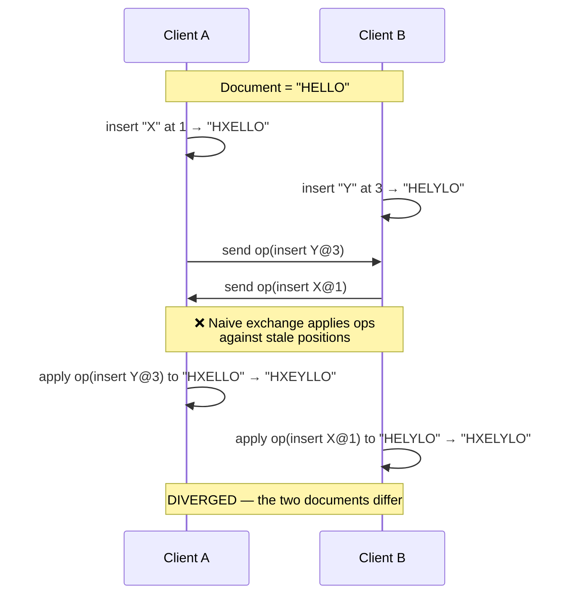
```mermaid
sequenceDiagram
    participant A as Client A
    participant B as Client B
    Note over A,B: Document = "HELLO"
    A->>A: insert "X" at 1 → "HXELLO"
    B->>B: insert "Y" at 3 → "HELYLO"
    A->>B: send op(insert Y@3)
    B->>A: send op(insert X@1)
    Note over A,B: ❌ Naive exchange applies ops<br/>against stale positions
    A->>A: apply op(insert Y@3) to "HXELLO" → "HXEYLLO"
    B->>B: apply op(insert X@1) to "HELYLO" → "HXELYLO"
    Note over A,B: DIVERGED — the two documents differ
```

## 3. Solution A — Operational Transformation (OT)

#### 💬 The idea
Before applying a remote operation, **transform** it against every concurrent operation you've already applied, so its intent is preserved in the new context.

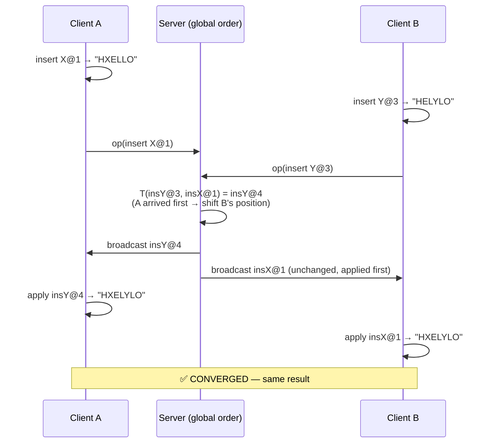
```mermaid
sequenceDiagram
    participant A as Client A
    participant S as Server (global order)
    participant B as Client B
    A->>A: insert X@1 → "HXELLO"
    B->>B: insert Y@3 → "HELYLO"
    A->>S: op(insert X@1)
    B->>S: op(insert Y@3)
    S->>S: T(insY@3, insX@1) = insY@4<br/>(A arrived first → shift B's position)
    S->>A: broadcast insY@4
    S->>B: broadcast insX@1 (unchanged, applied first)
    A->>A: apply insY@4 → "HXELYLO"
    B->>B: apply insX@1 → "HXELYLO"
    Note over A,B: ✅ CONVERGED — same result
```

```
   THE TRANSFORMATION RULES (insert/delete, simplified)

   T(ins@i, ins@j)  →  if i > j: ins@(i+1)   else: ins@i
                        (tie at i == j needs a deterministic
                         tiebreak — usually by site ID)

   T(ins@i, del@j)  →  if i > j: ins@(i-1)   else: ins@i

   T(del@i, ins@j)  →  if i >= j: del@(i+1)  else: del@i

   T(del@i, del@j)  →  if i > j: del@(i-1)
                        if i == j: NO-OP (already deleted)
                        else: del@i
```

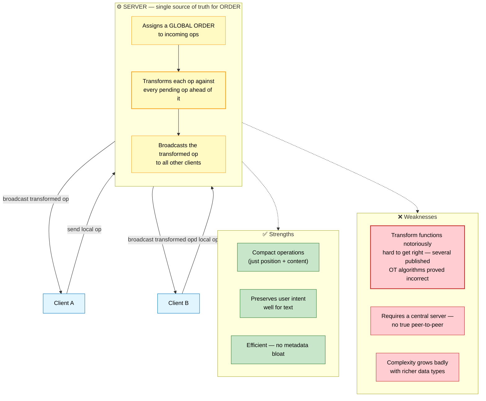
```mermaid
flowchart TD
    CA["Client A"] -->|"send local op"| SERVER
    CB["Client B"] -->|"send local op"| SERVER

    subgraph SERVER["⚙️ SERVER — single source of truth for ORDER"]
        direction TB
        S1["Assigns a GLOBAL ORDER<br/>to incoming ops"]
        S2["Transforms each op against<br/>every pending op ahead of it"]
        S3["Broadcasts the transformed op<br/>to all other clients"]
        S1 --> S2 --> S3
    end

    SERVER -->|"broadcast transformed op"| CA
    SERVER -->|"broadcast transformed op"| CB

    subgraph Strengths["✅ Strengths"]
        P1["Compact operations<br/>(just position + content)"]
        P2["Preserves user intent<br/>well for text"]
        P3["Efficient — no metadata bloat"]
    end

    subgraph Weaknesses["❌ Weaknesses"]
        N1["Transform functions notoriously<br/>hard to get right — several published<br/>OT algorithms proved incorrect"]
        N2["Requires a central server —<br/>no true peer-to-peer"]
        N3["Complexity grows badly<br/>with richer data types"]
    end

    SERVER -.-> Strengths
    SERVER -.-> Weaknesses

    style CA fill:#e1f5fe,stroke:#0277bd,color:#000
    style CB fill:#e1f5fe,stroke:#0277bd,color:#000
    style S1 fill:#fff9c4,stroke:#f9a825,color:#000
    style S2 fill:#fff9c4,stroke:#f9a825,stroke-width:2px,color:#000
    style S3 fill:#fff9c4,stroke:#f9a825,color:#000
    style P1 fill:#c8e6c9,stroke:#2e7d32,color:#000
    style P2 fill:#c8e6c9,stroke:#2e7d32,color:#000
    style P3 fill:#c8e6c9,stroke:#2e7d32,color:#000
    style N1 fill:#ffcdd2,stroke:#c62828,stroke-width:2px,color:#000
    style N2 fill:#ffcdd2,stroke:#c62828,color:#000
    style N3 fill:#ffcdd2,stroke:#c62828,color:#000
```

## 4. Solution B — CRDTs

#### 💬 The idea
Design the data structure so that **concurrent operations commute** — applying them in any order gives the same result. Then no transformation is needed at all.

```
   FOR TEXT: give every character a UNIQUE, IMMUTABLE, ORDERABLE ID
   instead of a positional index.

   "HELLO" becomes:
     [H:(1,A)] [E:(2,A)] [L:(3,A)] [L:(4,A)] [O:(5,A)]
                  ▲
                  └─ (logical position, site ID)

   A inserts X between H and E:
     → new ID (1.5, A) — an identifier BETWEEN the neighbours
   B inserts Y between L and L:
     → new ID (3.5, B)

   Merging = union the sets, then SORT by ID.
   ⭐ Order of arrival is irrelevant. Convergence is guaranteed
     by the structure itself, not by a protocol.
```

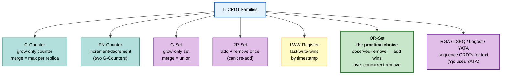
```mermaid
flowchart TD
    ROOT["🧬 CRDT Families"]
    ROOT --> GC["G-Counter<br/>grow-only counter<br/>merge = max per replica"]
    ROOT --> PN["PN-Counter<br/>increment/decrement<br/>(two G-Counters)"]
    ROOT --> GS["G-Set<br/>grow-only set<br/>merge = union"]
    ROOT --> TP["2P-Set<br/>add + remove once<br/>(can't re-add)"]
    ROOT --> LWW["LWW-Register<br/>last-write-wins<br/>by timestamp"]
    ROOT --> OR["OR-Set<br/><b>the practical choice</b><br/>observed-remove — add wins<br/>over concurrent remove"]
    ROOT --> SEQ["RGA / LSEQ / Logoot / YATA<br/>sequence CRDTs for text<br/>(Yjs uses YATA)"]

    style ROOT fill:#e3f2fd,stroke:#1565c0,stroke-width:2px,color:#000
    style GC fill:#b2dfdb,stroke:#00695c,color:#000
    style PN fill:#b2dfdb,stroke:#00695c,color:#000
    style GS fill:#e1bee7,stroke:#6a1b9a,color:#000
    style TP fill:#e1bee7,stroke:#6a1b9a,color:#000
    style LWW fill:#fff9c4,stroke:#f9a825,color:#000
    style OR fill:#c8e6c9,stroke:#2e7d32,stroke-width:3px,color:#000
    style SEQ fill:#e1bee7,stroke:#6a1b9a,stroke-width:2px,color:#000
```

```
   ✅ ⭐ NO CENTRAL SERVER NEEDED — true peer-to-peer possible
   ✅ Offline-first works naturally
   ✅ Convergence is mathematically guaranteed, not protocol-dependent
   ✅ Much easier to reason about and test
   ❌ Metadata overhead — every character carries an ID
   ❌ Tombstones: deleted characters must be retained (garbage
      collection is the hard part)
   ❌ Intent preservation can be subtly worse than OT in edge cases
```

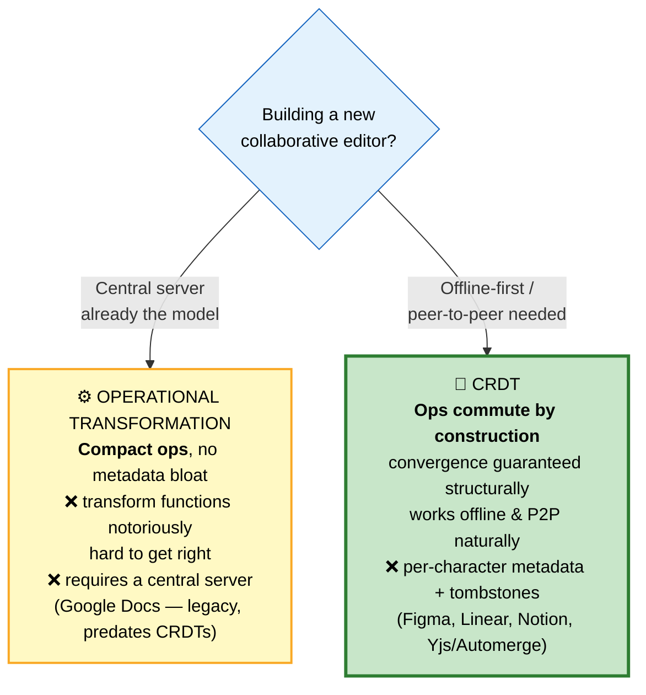
```mermaid
flowchart TD
    Q{"Building a new<br/>collaborative editor?"}
    Q -->|"Central server<br/>already the model"| OT["⚙️ OPERATIONAL TRANSFORMATION<br/><b>Compact ops</b>, no metadata bloat<br/>❌ transform functions notoriously<br/>hard to get right<br/>❌ requires a central server<br/>(Google Docs — legacy, predates CRDTs)"]
    Q -->|"Offline-first /<br/>peer-to-peer needed"| CRDT["🧬 CRDT<br/><b>Ops commute by construction</b><br/>convergence guaranteed structurally<br/>works offline & P2P naturally<br/>❌ per-character metadata + tombstones<br/>(Figma, Linear, Notion, Yjs/Automerge)"]

    style Q fill:#e3f2fd,stroke:#1565c0,color:#000
    style OT fill:#fff9c4,stroke:#f9a825,stroke-width:2px,color:#000
    style CRDT fill:#c8e6c9,stroke:#2e7d32,stroke-width:3px,color:#000
```

## 5. Architecture

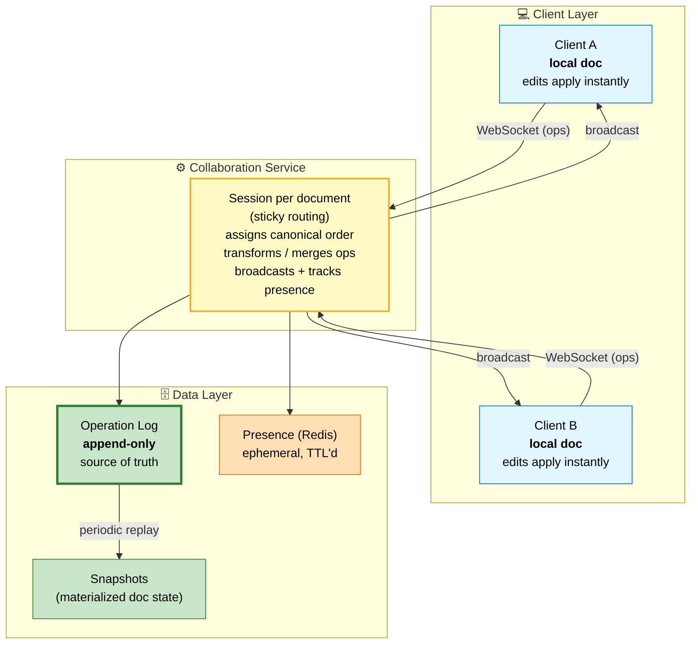
```mermaid
flowchart TD
    subgraph Client["💻 Client Layer"]
        CA["Client A<br/><b>local doc</b><br/>edits apply instantly"]
        CB["Client B<br/><b>local doc</b><br/>edits apply instantly"]
    end

    subgraph Service["⚙️ Collaboration Service"]
        CS["Session per document<br/>(sticky routing)<br/>assigns canonical order<br/>transforms / merges ops<br/>broadcasts + tracks presence"]
    end

    subgraph Data["🗄️ Data Layer"]
        LOG["Operation Log<br/><b>append-only</b><br/>source of truth"]
        PRES["Presence (Redis)<br/>ephemeral, TTL'd"]
        SNAP["Snapshots<br/>(materialized doc state)"]
    end

    CA -->|"WebSocket (ops)"| CS
    CS -->|"broadcast"| CB
    CB -->|"WebSocket (ops)"| CS
    CS -->|"broadcast"| CA
    CS --> LOG
    CS --> PRES
    LOG -->|"periodic replay"| SNAP

    style CA fill:#e1f5fe,stroke:#0277bd,color:#000
    style CB fill:#e1f5fe,stroke:#0277bd,color:#000
    style CS fill:#fff9c4,stroke:#f9a825,stroke-width:2px,color:#000
    style LOG fill:#c8e6c9,stroke:#2e7d32,stroke-width:3px,color:#000
    style PRES fill:#ffe0b2,stroke:#ef6c00,color:#000
    style SNAP fill:#c8e6c9,stroke:#2e7d32,color:#000
```

```
   ⭐ THE OPERATION LOG IS THE SOURCE OF TRUTH

   The document is a DERIVED value — a fold over the op log.
   This gives you, for free:
     • complete revision history
     • undo/redo
     • "who changed this line" attribution
     • time-travel to any point
     • recovery from any corruption

   Snapshots are purely an optimization: replay from the last
   snapshot rather than from operation zero.
```

## 6. Deep Dive — Presence

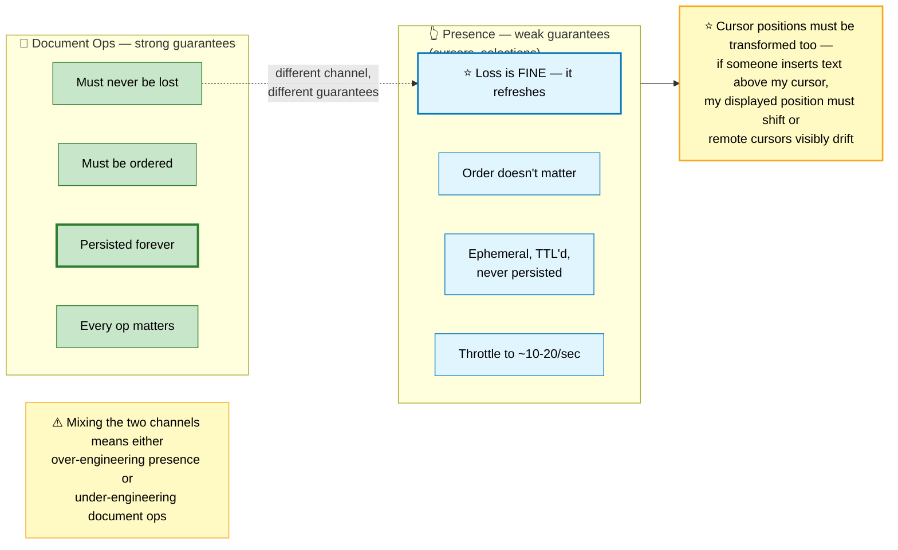
```mermaid
flowchart LR
    subgraph DOC["📄 Document Ops — strong guarantees"]
        D1["Must never be lost"]
        D2["Must be ordered"]
        D3["Persisted forever"]
        D4["Every op matters"]
    end

    subgraph PRES3["👆 Presence — weak guarantees<br/>(cursors, selections)"]
        R1["⭐ Loss is FINE — it refreshes"]
        R2["Order doesn't matter"]
        R3["Ephemeral, TTL'd,<br/>never persisted"]
        R4["Throttle to ~10-20/sec"]
    end

    D1 -.->|"different channel,<br/>different guarantees"| R1

    NOTE["⚠️ Mixing the two channels means either<br/>over-engineering presence or<br/>under-engineering document ops"]
    NOTE2["⭐ Cursor positions must be transformed too —<br/>if someone inserts text above my cursor,<br/>my displayed position must shift or<br/>remote cursors visibly drift"]

    PRES3 --> NOTE2

    style D1 fill:#c8e6c9,stroke:#2e7d32,color:#000
    style D2 fill:#c8e6c9,stroke:#2e7d32,color:#000
    style D3 fill:#c8e6c9,stroke:#2e7d32,stroke-width:3px,color:#000
    style D4 fill:#c8e6c9,stroke:#2e7d32,color:#000
    style R1 fill:#e1f5fe,stroke:#0277bd,stroke-width:2px,color:#000
    style R2 fill:#e1f5fe,stroke:#0277bd,color:#000
    style R3 fill:#e1f5fe,stroke:#0277bd,color:#000
    style R4 fill:#e1f5fe,stroke:#0277bd,color:#000
    style NOTE fill:#fff9c4,stroke:#f9a825,color:#000
    style NOTE2 fill:#fff9c4,stroke:#f9a825,stroke-width:2px,color:#000
```

## 7. Deep Dive — Offline

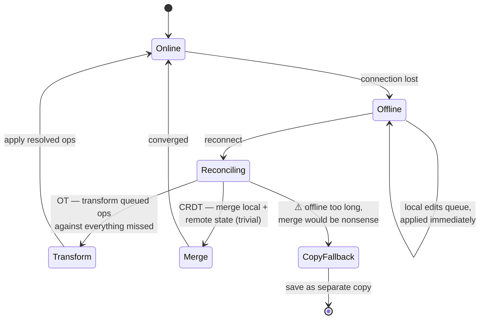
```mermaid
stateDiagram-v2
    [*] --> Online
    Online --> Offline: connection lost
    Offline --> Offline: local edits queue,<br/>applied immediately
    Offline --> Reconciling: reconnect
    Reconciling --> Transform: OT — transform queued ops<br/>against everything missed
    Reconciling --> Merge: CRDT — merge local +<br/>remote state (trivial)
    Transform --> Online: apply resolved ops
    Merge --> Online: converged
    Reconciling --> CopyFallback: ⚠️ offline too long,<br/>merge would be nonsense
    CopyFallback --> [*]: save as separate copy
```

## 🎤 Interview Follow-Ups

<details>
<summary><b>"OT vs CRDT — which would you choose and why?"</b></summary>

Both solve the same problem: making concurrent edits converge. They differ in where the complexity lives.

OT keeps operations compact — just a position and content — and transforms each incoming operation against concurrent ones so its intent survives the position shifts. The cost is that the transformation functions are famously hard to get right; several published OT algorithms were later proven incorrect, and Google's took years to stabilize. It also requires a central server to establish canonical ordering.

CRDTs move the complexity into the data structure. Every character gets a unique orderable ID instead of a positional index, so concurrent operations commute by construction — merging is just a union and sort. Convergence is mathematically guaranteed rather than protocol-dependent. The cost is metadata overhead per character and tombstones for deleted content, which need garbage collection.

For a new system I'd choose a CRDT. The correctness guarantee is worth the bytes, offline-first works naturally, and libraries like Yjs have made them production-ready. Google Docs uses OT largely because it predates mature CRDTs and their central-server architecture already fits.
</details>

<details>
<summary><b>"How do you make typing feel instant?"</b></summary>

Apply every local edit to the local document immediately, before any network round trip. The user sees their keystroke with zero latency because nothing is waiting on the server.

The operation is then sent asynchronously. When remote operations arrive, they're transformed against the local pending queue and applied. The local document is always ahead of the server, and reconciliation happens in the background.

This is optimistic local application, and it's why both OT and CRDT exist — if you could afford to wait for the server to arbitrate every keystroke, neither would be necessary.

The visible consequence is that your own text may briefly shift position as remote edits arrive above it. That's the correct behaviour, and users tolerate it far better than input lag.
</details>

<details>
<summary><b>"How do you store the document?"</b></summary>

The operation log is the source of truth — an append-only sequence of every edit. The document itself is a derived value, a fold over that log.

That gives revision history, undo/redo, per-line attribution, time travel, and recovery from corruption, all for free rather than as separate features.

Loading a document by replaying half a million operations would be slow, so periodic snapshots materialize the document state, and loading replays only from the most recent snapshot forward.

For a document with heavy history I'd also compact the log — old operations beyond the retention window collapse into the snapshot, keeping storage bounded while preserving the history users actually access.
</details>

---

# ▶️ YouTube

> **Teaches:** the full video pipeline — ingestion, transcoding, storage tiering, delivery, and recommendation at planetary scale.

## 1. Requirements

```
   FUNCTIONAL
   • Upload video (any format, any size)
   • Watch with adaptive quality
   • Search
   • Recommendations
   • Comments, likes, subscriptions
   • Live streaming
   • Creator analytics

   NON-FUNCTIONAL
   SCALE          ~2.5B users · ~500 hours uploaded per MINUTE ·
                  ~1B hours watched per DAY
   AVAILABILITY   99.9%+
   LATENCY        Playback start < 2s
   DURABILITY     ⭐ Never lose an upload
```

## 2. Estimation

```
   UPLOADS   500 hours/min = 30,000 hours/hour = 720,000 hours/day
             At ~1 GB/hour raw for HD (much more for 4K):
             → ~720 TB/day of source material  ⭐

   TRANSCODING OUTPUT
   Each video → ~10 resolutions × multiple codecs
             → output is roughly 2-5× the source size
             → several PB/day of encoded output

   WATCHING  1B hours/day
             ÷ 86,400 → ~11.5M concurrent viewers average
             Peak maybe 25M+
             × 3 Mbps average → ⭐ ~75 Tbps peak egress

   ⭐ SAME CONCLUSION AS NETFLIX: this cannot be served from
     datacenters. Google's global edge network and peering
     arrangements are the entire delivery story.

   TRANSCODING COMPUTE
   720,000 hours/day of source, each transcoded into ~10 variants.
   Even at faster-than-realtime encoding, this is one of the
   largest compute workloads on earth. It runs on preemptible
   capacity and is scheduled around datacenter load.
```

## 3. The Upload & Transcode Pipeline

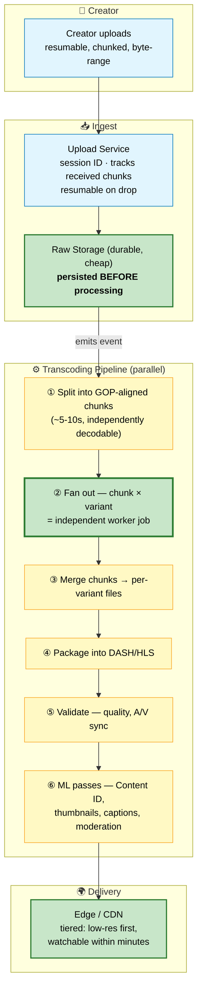
```mermaid
flowchart TD
    subgraph Client["🎥 Creator"]
        C["Creator uploads<br/>resumable, chunked, byte-range"]
    end

    subgraph Ingest["📥 Ingest"]
        US["Upload Service<br/>session ID · tracks received chunks<br/>resumable on drop"]
        RAW["Raw Storage (durable, cheap)<br/><b>persisted BEFORE processing</b>"]
    end

    subgraph Pipeline["⚙️ Transcoding Pipeline (parallel)"]
        SPLIT["① Split into GOP-aligned chunks<br/>(~5-10s, independently decodable)"]
        FANOUT["② Fan out — chunk × variant<br/>= independent worker job"]
        MERGE["③ Merge chunks → per-variant files"]
        PKG["④ Package into DASH/HLS"]
        VALID["⑤ Validate — quality, A/V sync"]
        ML["⑥ ML passes — Content ID,<br/>thumbnails, captions, moderation"]
    end

    subgraph Delivery["🌍 Delivery"]
        CDN["Edge / CDN<br/>tiered: low-res first,<br/>watchable within minutes"]
    end

    C --> US --> RAW -->|"emits event"| SPLIT
    SPLIT --> FANOUT --> MERGE --> PKG --> VALID --> ML --> CDN

    style C fill:#e1f5fe,stroke:#0277bd,color:#000
    style US fill:#e1f5fe,stroke:#0277bd,color:#000
    style RAW fill:#c8e6c9,stroke:#2e7d32,stroke-width:2px,color:#000
    style SPLIT fill:#fff9c4,stroke:#f9a825,color:#000
    style FANOUT fill:#c8e6c9,stroke:#2e7d32,stroke-width:3px,color:#000
    style MERGE fill:#fff9c4,stroke:#f9a825,color:#000
    style PKG fill:#fff9c4,stroke:#f9a825,color:#000
    style VALID fill:#fff9c4,stroke:#f9a825,color:#000
    style ML fill:#fff9c4,stroke:#f9a825,color:#000
    style CDN fill:#c8e6c9,stroke:#2e7d32,stroke-width:2px,color:#000
```

```
   ⭐ THE CHUNK-PARALLEL INSIGHT

   Transcoding a 2-hour video serially might take 4 hours.
   Split into 1,440 chunks processed in parallel across a
   large worker fleet, and wall-clock time drops to minutes.

   THE REQUIREMENT: chunks must split at GOP (Group of Pictures)
   boundaries — points where a keyframe starts — so each chunk
   can be decoded independently without needing the previous one.
```

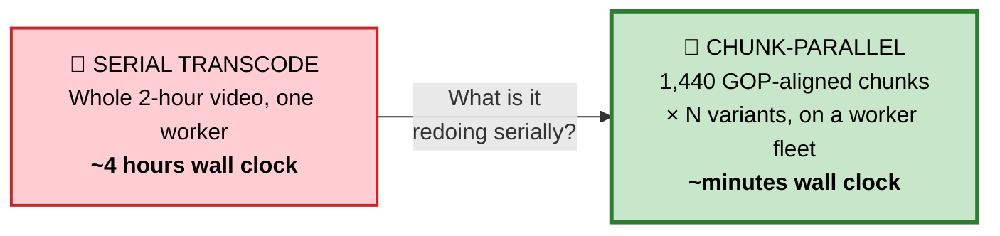
```mermaid
flowchart LR
    A["🐌 SERIAL TRANSCODE<br/>Whole 2-hour video, one worker<br/><b>~4 hours wall clock</b>"] -->|"What is it<br/>redoing serially?"| B["🚀 CHUNK-PARALLEL<br/>1,440 GOP-aligned chunks<br/>× N variants, on a worker fleet<br/><b>~minutes wall clock</b>"]

    style A fill:#ffcdd2,stroke:#c62828,stroke-width:2px,color:#000
    style B fill:#c8e6c9,stroke:#2e7d32,stroke-width:3px,color:#000
```

## 4. Deep Dive — Storage Tiering by Popularity

```
   ⭐ VIDEO POPULARITY IS EXTREMELY LONG-TAILED

   ~1% of videos       → ~80% of all views
   ~50% of videos      → almost never watched after week one

   → Store them completely differently.

   ⭐ This is the same insight as Instagram's tiering, but the
     dimension is POPULARITY rather than AGE — and the savings
     are even larger because encoded variants are expensive
     to both store and produce.
```

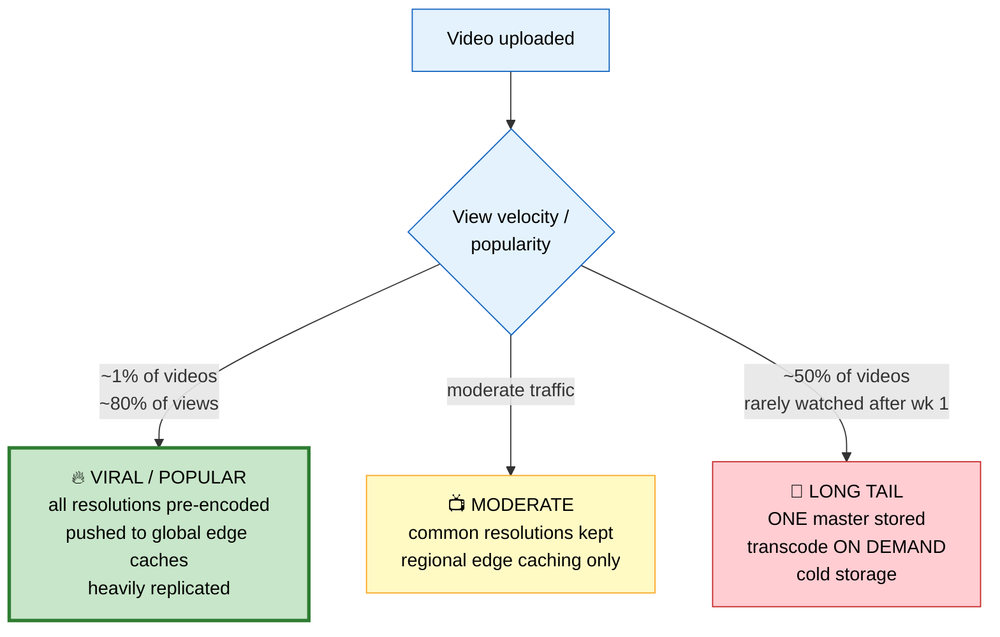
```mermaid
flowchart TD
    V["Video uploaded"] --> D{"View velocity /<br/>popularity"}
    D -->|"~1% of videos<br/>~80% of views"| VIRAL["🔥 VIRAL / POPULAR<br/>all resolutions pre-encoded<br/>pushed to global edge caches<br/>heavily replicated"]
    D -->|"moderate traffic"| MOD["📺 MODERATE<br/>common resolutions kept<br/>regional edge caching only"]
    D -->|"~50% of videos<br/>rarely watched after wk 1"| TAIL["🧊 LONG TAIL<br/>ONE master stored<br/>transcode ON DEMAND<br/>cold storage"]

    style V fill:#e3f2fd,stroke:#1565c0,color:#000
    style D fill:#e3f2fd,stroke:#1565c0,color:#000
    style VIRAL fill:#c8e6c9,stroke:#2e7d32,stroke-width:3px,color:#000
    style MOD fill:#fff9c4,stroke:#f9a825,color:#000
    style TAIL fill:#ffcdd2,stroke:#c62828,color:#000
```

## 5. Deep Dive — Recommendations

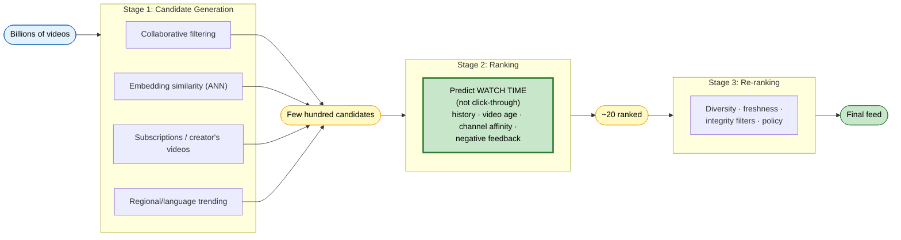
```mermaid
flowchart LR
    subgraph S1["Stage 1: Candidate Generation"]
        direction TB
        CF["Collaborative filtering"]
        EMB["Embedding similarity (ANN)"]
        SUB["Subscriptions / creator's videos"]
        TREND["Regional/language trending"]
    end
    subgraph S2["Stage 2: Ranking"]
        RANK["Predict WATCH TIME<br/>(not click-through)<br/>history · video age · channel affinity ·<br/>negative feedback"]
    end
    subgraph S3["Stage 3: Re-ranking"]
        RR["Diversity · freshness ·<br/>integrity filters · policy"]
    end

    Billions(["Billions of videos"]) --> S1
    CF & EMB & SUB & TREND --> Hundreds(["Few hundred candidates"])
    Hundreds --> S2 --> Twenty(["~20 ranked"])
    Twenty --> S3 --> Final(["Final feed"])

    style Billions fill:#e3f2fd,stroke:#1565c0,color:#000
    style Hundreds fill:#fff9c4,stroke:#f9a825,color:#000
    style RANK fill:#c8e6c9,stroke:#2e7d32,stroke-width:3px,color:#000
    style Twenty fill:#fff9c4,stroke:#f9a825,color:#000
    style Final fill:#c8e6c9,stroke:#2e7d32,color:#000
```

```
   ⭐ THE COLD START PROBLEM

   A newly uploaded video has no engagement data. How do you
   know if it's good?

   • Content-based features (title, description, thumbnail,
     visual/audio embeddings) → find similar known videos
   • Creator reputation and past performance
   • ⭐ EXPLORATION: deliberately show new content to a small
     random sample of users to gather signal
     — this is a multi-armed bandit problem: balance
     exploiting known-good content against exploring
     potentially-better unknown content
```

## 6. Deep Dive — Live Streaming

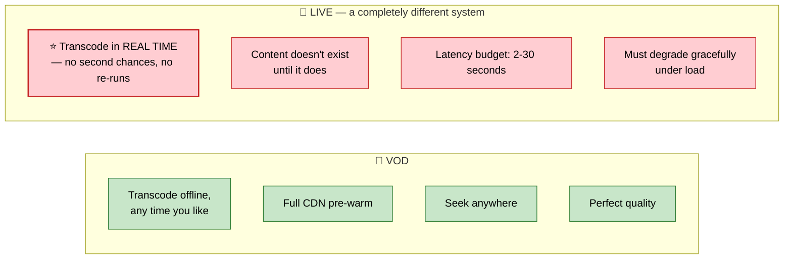
```mermaid
flowchart LR
    subgraph VOD2["📼 VOD"]
        direction TB
        V1["Transcode offline,<br/>any time you like"]
        V2["Full CDN pre-warm"]
        V3["Seek anywhere"]
        V4["Perfect quality"]
    end

    subgraph LIVE2["🔴 LIVE — a completely different system"]
        direction TB
        L1["⭐ Transcode in REAL TIME<br/>— no second chances, no re-runs"]
        L2["Content doesn't exist<br/>until it does"]
        L3["Latency budget: 2-30 seconds"]
        L4["Must degrade gracefully<br/>under load"]
    end

    style V1 fill:#c8e6c9,stroke:#2e7d32,color:#000
    style V2 fill:#c8e6c9,stroke:#2e7d32,color:#000
    style V3 fill:#c8e6c9,stroke:#2e7d32,color:#000
    style V4 fill:#c8e6c9,stroke:#2e7d32,color:#000
    style L1 fill:#ffcdd2,stroke:#c62828,stroke-width:2px,color:#000
    style L2 fill:#ffcdd2,stroke:#c62828,color:#000
    style L3 fill:#ffcdd2,stroke:#c62828,color:#000
    style L4 fill:#ffcdd2,stroke:#c62828,color:#000
```

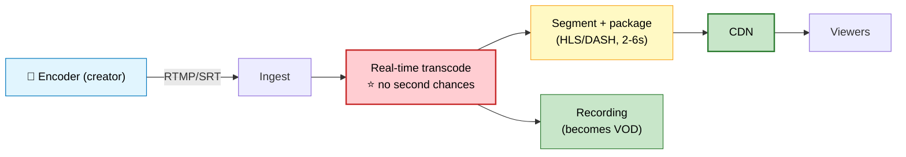
```mermaid
flowchart LR
    ENC["📡 Encoder (creator)"] -->|"RTMP/SRT"| ING["Ingest"]
    ING --> RT["Real-time transcode<br/>⭐ no second chances"]
    RT --> SEG["Segment + package<br/>(HLS/DASH, 2-6s)"]
    RT --> REC["Recording<br/>(becomes VOD)"]
    SEG --> CDN["CDN"] --> V["Viewers"]

    style ENC fill:#e1f5fe,stroke:#0277bd,color:#000
    style RT fill:#ffcdd2,stroke:#c62828,stroke-width:2px,color:#000
    style SEG fill:#fff9c4,stroke:#f9a825,color:#000
    style REC fill:#c8e6c9,stroke:#2e7d32,color:#000
    style CDN fill:#c8e6c9,stroke:#2e7d32,stroke-width:2px,color:#000
```

```
   ⭐ THE LATENCY / RELIABILITY TRADEOFF
     Shorter segments = lower latency but more requests and
     less buffer resilience. Low-latency HLS uses partial
     segments to get to ~2-5 seconds; standard HLS is ~15-30.
     Interactive use cases (auctions, betting) need sub-second
     and require WebRTC instead.
```

## 🎤 Interview Follow-Ups

<details>
<summary><b>"How do you transcode 500 hours of video uploaded every minute?"</b></summary>

The key move is splitting each video into chunks at GOP boundaries — points where a keyframe starts, so each chunk decodes independently — then treating every chunk-and-variant pair as an independent job on a large worker fleet.

That turns a serial problem into an embarrassingly parallel one. A two-hour video becomes roughly 1,440 chunks; transcoded in parallel, wall-clock time is bounded by a single chunk rather than the whole video. Chunks are then merged back into per-variant files and packaged into DASH or HLS.

Two operational details matter. Transcoding runs tiered — low resolutions first, so the video is watchable within minutes while 4K is still processing. And because it's batch work that tolerates interruption, it runs on preemptible capacity scheduled around datacenter load, which makes an otherwise enormous compute bill manageable.

Crucially, the raw upload is persisted durably before any processing starts. Losing a creator's upload is unacceptable; losing a transcode job just means re-running it.
</details>

<details>
<summary><b>"How do you store this much video affordably?"</b></summary>

Tiering by popularity rather than age, because video views follow an extreme power law — roughly 1% of videos get 80% of views, and half of all uploads are essentially never watched after their first week.

Popular videos get every resolution pre-encoded, replicated heavily, and pushed to edge caches globally. Moderate videos keep common resolutions and get regional caching. For the long tail, store one master and transcode on demand if someone actually requests it.

That last decision is the big one. Pre-encoding ten variants of a video nobody watches is pure waste in both storage and compute. Accepting a slower first play for an unwatched video is an excellent trade — and if it does get requested repeatedly, it promotes into a warmer tier automatically.

Beyond tiering: modern codecs like AV1 cut bitrate substantially for popular content where the encoding cost amortizes over millions of views, and per-title encoding tunes the bitrate ladder to each video's actual complexity.
</details>

<details>
<summary><b>"How do recommendations work, and what's the cold start problem?"</b></summary>

Two stages. Candidate generation cuts billions of videos to a few hundred using several parallel cheap retrieval sources — collaborative filtering, embedding similarity via approximate nearest neighbour search, your subscriptions, regional trending. Having diverse *sources* is what creates diverse *results*.

Ranking then applies an expensive model to that shortlist, predicting watch time rather than click-through. That distinction matters enormously: optimizing click-through rewards clickbait thumbnails, while optimizing watch time rewards content people actually stay for. It was a deliberate and consequential change.

Cold start is the problem that a new upload has no engagement data. It's handled with content-based features — title, thumbnail, visual and audio embeddings — to find similar known videos, plus creator reputation as a prior.

The most important mechanism is deliberate exploration: showing new content to a small random sample of users to gather signal. That's a multi-armed bandit tradeoff, balancing exploiting known-good content against exploring potentially-better unknowns. Without it, new creators could never break through, and the system would ossify around existing winners.
</details>

---

# 📦 Dropbox

> **Teaches:** file synchronization, content-addressed deduplication, delta sync, and conflict resolution.

## 1. Requirements

```
   FUNCTIONAL
   • Sync files across devices
   • Share files/folders with others
   • Version history
   • Selective sync (don't download everything)
   • Offline access
   • Conflict handling

   NON-FUNCTIONAL
   SCALE          ~700M users, exabytes stored
   ⭐ EFFICIENCY   Bandwidth and storage are the dominant costs
   RELIABILITY    ⭐ Never lose or corrupt a file
   LATENCY        Sync should feel near-instant for small changes
```

## 2. The Core Insight — Chunking

#### 💬 Why you never sync whole files

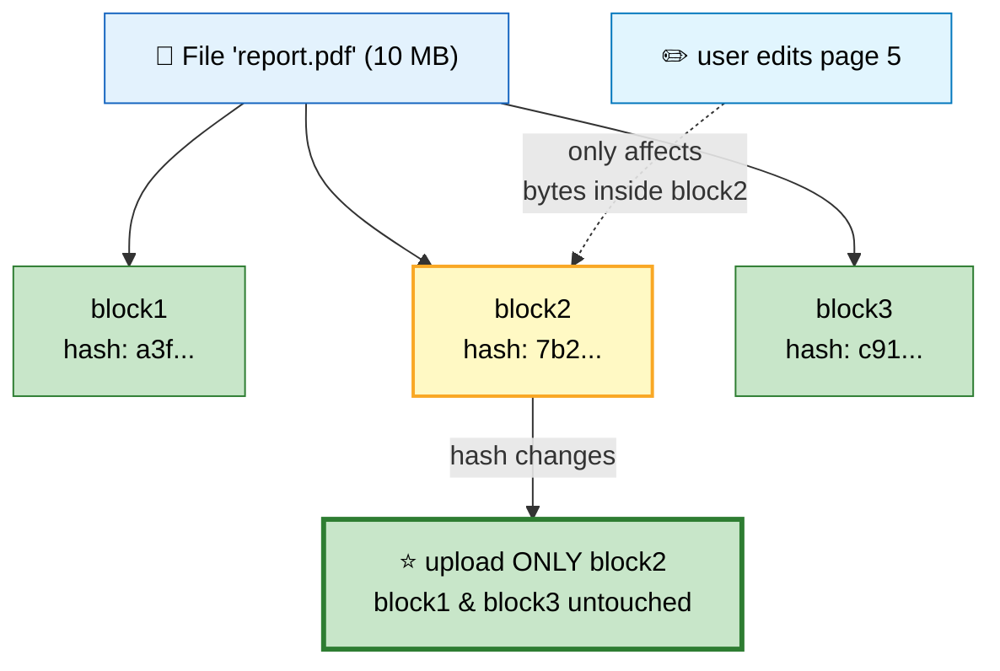
```mermaid
flowchart TD
    F["📄 File 'report.pdf' (10 MB)"] --> B1["block1<br/>hash: a3f..."]
    F --> B2["block2<br/>hash: 7b2..."]
    F --> B3["block3<br/>hash: c91..."]

    EDIT["✏️ user edits page 5"] -.->|"only affects<br/>bytes inside block2"| B2
    B2 -->|"hash changes"| UP["⭐ upload ONLY block2<br/>block1 & block3 untouched"]

    style F fill:#e3f2fd,stroke:#1565c0,color:#000
    style B1 fill:#c8e6c9,stroke:#2e7d32,color:#000
    style B2 fill:#fff9c4,stroke:#f9a825,stroke-width:2px,color:#000
    style B3 fill:#c8e6c9,stroke:#2e7d32,color:#000
    style EDIT fill:#e1f5fe,stroke:#0277bd,color:#000
    style UP fill:#c8e6c9,stroke:#2e7d32,stroke-width:3px,color:#000
```

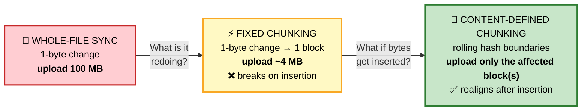
```mermaid
flowchart LR
    A["🐌 WHOLE-FILE SYNC<br/>1-byte change<br/><b>upload 100 MB</b>"] -->|"What is it<br/>redoing?"| B["⚡ FIXED CHUNKING<br/>1-byte change → 1 block<br/><b>upload ~4 MB</b><br/>❌ breaks on insertion"]
    B -->|"What if bytes<br/>get inserted?"| C["🚀 CONTENT-DEFINED CHUNKING<br/>rolling hash boundaries<br/><b>upload only the affected block(s)</b><br/>✅ realigns after insertion"]

    style A fill:#ffcdd2,stroke:#c62828,stroke-width:2px,color:#000
    style B fill:#fff9c4,stroke:#f9a825,stroke-width:2px,color:#000
    style C fill:#c8e6c9,stroke:#2e7d32,stroke-width:3px,color:#000
```

### ⭐ Content-addressed storage + deduplication

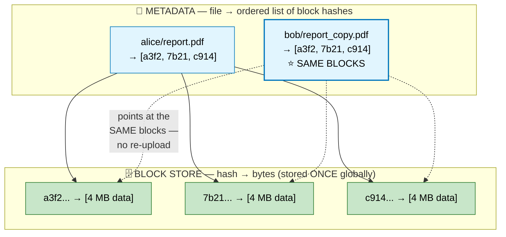
```mermaid
flowchart TD
    subgraph META["📇 METADATA — file → ordered list of block hashes"]
        M1["alice/report.pdf<br/>→ [a3f2, 7b21, c914]"]
        M2["bob/report_copy.pdf<br/>→ [a3f2, 7b21, c914]<br/>⭐ SAME BLOCKS"]
    end

    subgraph STORE["🗄️ BLOCK STORE — hash → bytes (stored ONCE globally)"]
        S1["a3f2... → [4 MB data]"]
        S2["7b21... → [4 MB data]"]
        S3["c914... → [4 MB data]"]
    end

    M1 --> S1
    M1 --> S2
    M1 --> S3
    M2 -.->|"points at the<br/>SAME blocks —<br/>no re-upload"| S1
    M2 -.-> S2
    M2 -.-> S3

    style M1 fill:#e1f5fe,stroke:#0277bd,color:#000
    style M2 fill:#e1f5fe,stroke:#0277bd,stroke-width:2px,color:#000
    style S1 fill:#c8e6c9,stroke:#2e7d32,color:#000
    style S2 fill:#c8e6c9,stroke:#2e7d32,color:#000
    style S3 fill:#c8e6c9,stroke:#2e7d32,color:#000
```

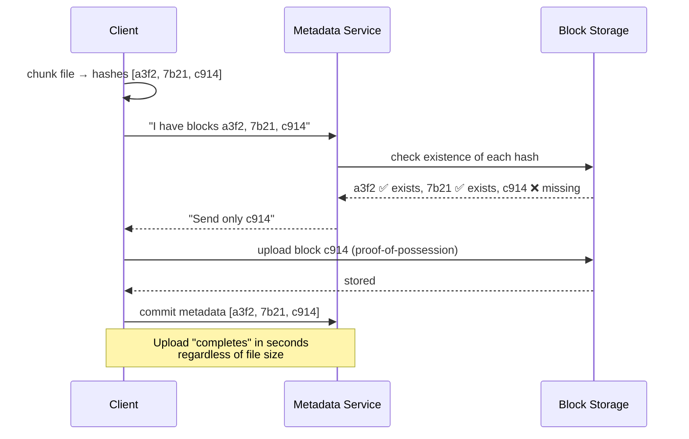
```mermaid
sequenceDiagram
    participant C as Client
    participant M as Metadata Service
    participant B as Block Storage
    C->>C: chunk file → hashes [a3f2, 7b21, c914]
    C->>M: "I have blocks a3f2, 7b21, c914"
    M->>B: check existence of each hash
    B-->>M: a3f2 ✅ exists, 7b21 ✅ exists, c914 ❌ missing
    M-->>C: "Send only c914"
    C->>B: upload block c914 (proof-of-possession)
    B-->>C: stored
    C->>M: commit metadata [a3f2, 7b21, c914]
    Note over C,M: Upload "completes" in seconds<br/>regardless of file size
```

```
   ⚠️ THE SECURITY PROBLEM WITH CROSS-USER DEDUPLICATION

   If deduplication works across users, an attacker can probe:
   "Does anyone have a file with this hash?" — by observing
   whether the upload is fast (dedup hit) or slow.

   That leaks information about what files exist in the system.

   MITIGATIONS:
   • Deduplicate only WITHIN a user/team boundary
   • Require proof-of-possession (prove you have the full block,
     not just the hash) before granting a dedup shortcut
   • Add randomized delays to mask timing signals
```

### Content-defined chunking

```
   ⚠️ FIXED-SIZE CHUNKING HAS A FATAL WEAKNESS

   Insert one byte at the START of a file, and EVERY subsequent
   block boundary shifts. Every hash changes. You re-upload
   the entire file.
```

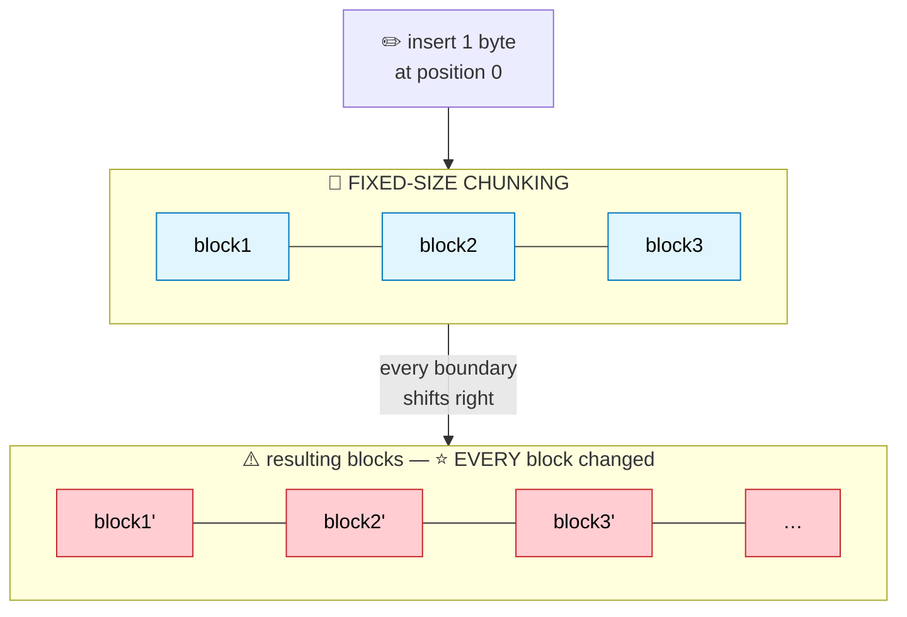
```mermaid
flowchart TD
    subgraph FIXED["🐌 FIXED-SIZE CHUNKING"]
        direction LR
        O1["block1"] --- O2["block2"] --- O3["block3"]
    end
    INS["✏️ insert 1 byte<br/>at position 0"] --> FIXED
    FIXED -->|"every boundary<br/>shifts right"| SHIFTED

    subgraph SHIFTED["⚠️ resulting blocks — ⭐ EVERY block changed"]
        direction LR
        N1["block1'"] --- N2["block2'"] --- N3["block3'"] --- N4["…"]
    end

    style O1 fill:#e1f5fe,stroke:#0277bd,color:#000
    style O2 fill:#e1f5fe,stroke:#0277bd,color:#000
    style O3 fill:#e1f5fe,stroke:#0277bd,color:#000
    style N1 fill:#ffcdd2,stroke:#c62828,color:#000
    style N2 fill:#ffcdd2,stroke:#c62828,color:#000
    style N3 fill:#ffcdd2,stroke:#c62828,color:#000
    style N4 fill:#ffcdd2,stroke:#c62828,color:#000
```

```
   ✅ CONTENT-DEFINED CHUNKING (Rabin fingerprinting)

   Boundaries are chosen based on the CONTENT, not on offset:
   slide a rolling hash over the data and cut wherever the
   hash matches a pattern (e.g. low 13 bits are zero).

   Now inserting a byte shifts only the ONE block containing
   the insertion. Subsequent boundaries realign naturally
   because they depend on content, not position.
```

## 3. Architecture

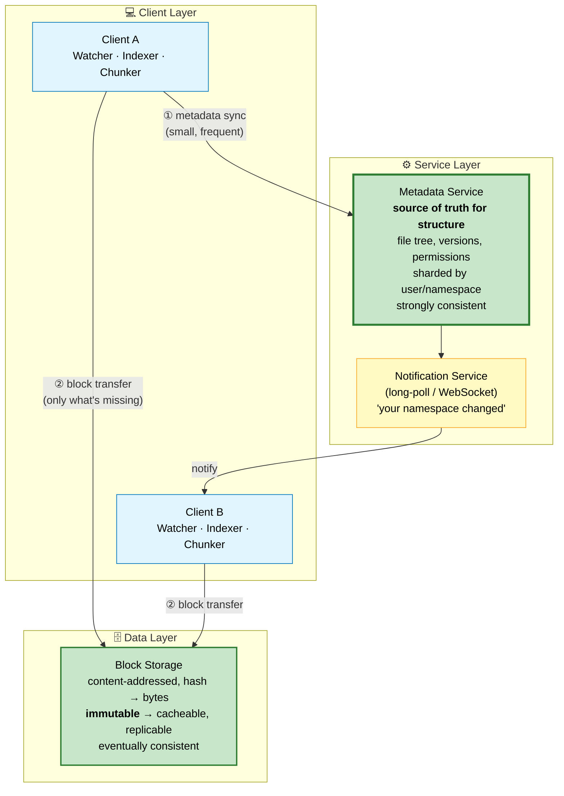
```mermaid
flowchart TD
    subgraph Client["💻 Client Layer"]
        CA["Client A<br/>Watcher · Indexer · Chunker"]
        CB["Client B<br/>Watcher · Indexer · Chunker"]
    end

    subgraph Service["⚙️ Service Layer"]
        META["Metadata Service<br/><b>source of truth for structure</b><br/>file tree, versions, permissions<br/>sharded by user/namespace<br/>strongly consistent"]
        NOTIFY["Notification Service<br/>(long-poll / WebSocket)<br/>'your namespace changed'"]
    end

    subgraph Data["🗄️ Data Layer"]
        BLOCK["Block Storage<br/>content-addressed, hash → bytes<br/><b>immutable</b> → cacheable, replicable<br/>eventually consistent"]
    end

    CA -->|"① metadata sync<br/>(small, frequent)"| META
    META --> NOTIFY -->|"notify"| CB
    CA -->|"② block transfer<br/>(only what's missing)"| BLOCK
    CB -->|"② block transfer"| BLOCK

    style CA fill:#e1f5fe,stroke:#0277bd,color:#000
    style CB fill:#e1f5fe,stroke:#0277bd,color:#000
    style META fill:#c8e6c9,stroke:#2e7d32,stroke-width:3px,color:#000
    style NOTIFY fill:#fff9c4,stroke:#f9a825,color:#000
    style BLOCK fill:#c8e6c9,stroke:#2e7d32,stroke-width:2px,color:#000
```

```mermaid
flowchart LR
    subgraph METAG["📇 Metadata"]
        direction TB
        MA["small, frequent"]
        MB["needs strong consistency"]
        MC["needs transactions"]
        MD["→ relational database"]
    end

    subgraph BLOCKG["🗄️ Blocks"]
        direction TB
        BA["large, immutable"]
        BB["content-addressed"]
        BC["trivially replicated"]
        BD["→ object storage"]
    end

    METAG --> WHY["✅ ⭐ Separating them lets each be<br/>optimized independently —<br/>metadata stays strongly consistent<br/>while blocks are eventually consistent"]
    BLOCKG --> WHY

    style MA fill:#e1f5fe,stroke:#0277bd,color:#000
    style MB fill:#e1f5fe,stroke:#0277bd,color:#000
    style MC fill:#e1f5fe,stroke:#0277bd,color:#000
    style MD fill:#e1f5fe,stroke:#0277bd,stroke-width:2px,color:#000
    style BA fill:#c8e6c9,stroke:#2e7d32,color:#000
    style BB fill:#c8e6c9,stroke:#2e7d32,color:#000
    style BC fill:#c8e6c9,stroke:#2e7d32,color:#000
    style BD fill:#c8e6c9,stroke:#2e7d32,stroke-width:2px,color:#000
    style WHY fill:#fff9c4,stroke:#f9a825,stroke-width:3px,color:#000
```

## 4. Deep Dive — Sync Protocol

```mermaid
flowchart TD
    A["① DETECT CHANGE<br/>filesystem watcher +<br/>periodic full scan (safety net)"] --> B["② HASH<br/>chunk file, compute block hashes<br/>skip if unchanged vs local index"]
    B --> C["③ COMMIT METADATA<br/>optimistic concurrency:<br/>'updating v7 → v8'"]
    C -->|"server at v7"| D["④ UPLOAD MISSING BLOCKS<br/>only hashes server lacks"]
    C -->|"server NOT at v7"| CONFLICT["⚠️ CONFLICT<br/>create conflicted copy"]
    D --> E["⑤ NOTIFY OTHER DEVICES<br/>long-poll/WebSocket"]
    E --> F["⑥ OTHER DEVICES PULL<br/>diff metadata, download<br/>only missing blocks, reassemble"]

    style A fill:#e1f5fe,stroke:#0277bd,color:#000
    style B fill:#e1f5fe,stroke:#0277bd,color:#000
    style C fill:#fff9c4,stroke:#f9a825,stroke-width:2px,color:#000
    style D fill:#c8e6c9,stroke:#2e7d32,color:#000
    style CONFLICT fill:#ffcdd2,stroke:#c62828,stroke-width:2px,color:#000
    style E fill:#c8e6c9,stroke:#2e7d32,color:#000
    style F fill:#c8e6c9,stroke:#2e7d32,stroke-width:2px,color:#000
```

## 5. Deep Dive — Conflict Resolution

#### 💬 Why Dropbox doesn't merge

```
   ⭐ CRITICAL DESIGN DECISION: Dropbox does NOT attempt to
     merge conflicting file edits.

   WHY? Because it can't. A .docx, .psd, or .zip has internal
   structure that a byte-level merge would corrupt. Silently
   producing a corrupt file is far worse than producing two files.

   INSTEAD: keep both.
     report.pdf
     report (Alice's conflicted copy 2026-08-14).pdf

   ✅ No data is EVER lost
   ✅ The user — who understands the content — decides
   ❌ Slightly annoying UX

   ⭐ CONTRAST WITH GOOGLE DOCS: Docs CAN merge because it
     controls the document format and understands its structure.
     Dropbox handles arbitrary opaque bytes. This is the entire
     reason the two systems make opposite choices.
```

```mermaid
flowchart TD
    Q{"Does the system<br/>understand the file's<br/>internal structure?"}
    Q -->|"Yes — owns the format<br/>(Google Docs)"| MERGE["✅ MERGE AUTOMATICALLY<br/>OT/CRDT transform ops<br/>at the character level"]
    Q -->|"No — arbitrary opaque bytes<br/>(.docx, .psd, .zip)<br/>(Dropbox)"| COPY["⚠️ KEEP BOTH COPIES<br/>'file (conflicted copy).ext'<br/>user decides — no data lost"]

    style Q fill:#e3f2fd,stroke:#1565c0,color:#000
    style MERGE fill:#c8e6c9,stroke:#2e7d32,stroke-width:3px,color:#000
    style COPY fill:#fff9c4,stroke:#f9a825,stroke-width:2px,color:#000
```

```mermaid
sequenceDiagram
    participant Al as Alice (offline)
    participant S as Server (report.pdf)
    participant Bo as Bob (offline)
    Note over S: version = 7
    Al->>Al: edit locally from v7
    Bo->>Bo: edit locally from v7
    Al->>S: commit "update v7 → v8"
    S->>S: current version IS 7 ✅
    S-->>Al: accepted, now v8
    Bo->>S: commit "update v7 → v8"
    S->>S: current version is 8, NOT 7 ❌
    S-->>Bo: ⚠️ CONFLICT
    S->>S: create "report (Bob's conflicted copy).pdf"
    Note over Al,Bo: No data lost — user decides which to keep
```

## 6. Deep Dive — Bandwidth Optimization

```mermaid
flowchart TD
    T["📶 Bandwidth Optimization Stack<br/>(applied in order of impact)"]
    T --> O1["1. DEDUPLICATION<br/>don't send blocks that already exist<br/>⭐ biggest win by far"]
    O1 --> O2["2. DELTA SYNC<br/>send only changed blocks"]
    O2 --> O3["3. COMPRESSION<br/>compress blocks before transfer<br/>(skip already-compressed formats)"]
    O3 --> O4["4. LAN SYNC<br/>⭐ if another device on the same LAN<br/>has the block, get it locally<br/>— never touches the internet"]
    O4 --> O5["5. BATCHING<br/>many small file changes<br/>→ one request"]
    O5 --> O6["6. THROTTLING<br/>respect the user's bandwidth;<br/>back off on a metered link"]

    style T fill:#e3f2fd,stroke:#1565c0,stroke-width:2px,color:#000
    style O1 fill:#c8e6c9,stroke:#2e7d32,stroke-width:3px,color:#000
    style O2 fill:#c8e6c9,stroke:#2e7d32,color:#000
    style O3 fill:#fff9c4,stroke:#f9a825,color:#000
    style O4 fill:#c8e6c9,stroke:#2e7d32,stroke-width:2px,color:#000
    style O5 fill:#fff9c4,stroke:#f9a825,color:#000
    style O6 fill:#e1f5fe,stroke:#0277bd,color:#000
```

## 🎤 Interview Follow-Ups

<details>
<summary><b>"How do you sync a 1 GB file efficiently when one byte changes?"</b></summary>

Content-defined chunking. The file is split into blocks whose boundaries are determined by a rolling hash over the content rather than by fixed offsets, then each block is identified by its hash.

A one-byte change alters exactly one block's hash, so only that block is uploaded — typically a few megabytes rather than a gigabyte.

Content-defined boundaries matter specifically because fixed-size chunking breaks catastrophically on insertion. Insert a byte at the start of a file and every subsequent fixed boundary shifts, so every hash changes and you re-upload everything. With content-defined boundaries, subsequent cut points realign naturally because they depend on content, not position.

On top of that, the upload protocol asks the server which block hashes it already has, so any block that exists anywhere in the system — from any user's earlier upload — is never transferred at all.
</details>

<details>
<summary><b>"How does deduplication work, and what's the security risk?"</b></summary>

Blocks are stored content-addressed, meaning the storage key *is* the hash of the content. File metadata is just an ordered list of block hashes. If a million users have the same PDF, the blocks exist once and a million metadata entries point at them.

The upload protocol exploits this: the client sends the list of hashes, the server replies with which ones it's missing, and only those are transferred. Uploading a file that already exists takes seconds regardless of size.

The security risk is that cross-user deduplication creates a side channel. An attacker can construct a file, attempt to upload it, and infer from the speed whether someone else already has it — leaking information about what content exists in the system.

The mitigations are deduplicating only within a user or team boundary, requiring proof-of-possession so a client must demonstrate it holds the full block rather than just the hash, and adding randomized delays to mask the timing signal. Most consumer services now scope deduplication to reduce this exposure.
</details>

<details>
<summary><b>"Why doesn't Dropbox merge conflicting edits?"</b></summary>

Because it can't do so safely. Dropbox handles arbitrary opaque bytes — a .docx, a .psd, a database file, a zip archive. These have internal structure, checksums, and offset tables. A byte-level merge would produce a file that looks plausible and is actually corrupt.

Silently corrupting a file is far worse than producing two files, so Dropbox keeps both: the original plus a conflicted copy attributed to the user and timestamped. No data is ever lost, and the person who understands the content decides.

The contrast with Google Docs is instructive. Docs *can* merge because it controls the document format and understands its structure — it knows what a character insertion means. Dropbox has no such knowledge. The two systems make opposite choices for exactly this reason, and recognizing that distinction is the real answer to the question.

Detection itself is straightforward optimistic concurrency: each update declares the version it's based on, and the server rejects it if that's no longer current — the same mechanism as an HTTP If-Match header or a version column in a database.
</details>

---

# 🏠 Airbnb

> **Teaches:** geospatial + faceted search, availability calendars, and preventing double-booking.

## 1. Requirements

```
   FUNCTIONAL
   • Search listings by location, dates, guests, filters
   • View listing details, photos, reviews
   • Book with instant confirmation or host approval
   • Host manages calendar and pricing
   • Messaging between guest and host
   • Payments (with a hold until check-in)

   NON-FUNCTIONAL
   SCALE          ~7M listings, ~150M users, ~2M nights booked/day
   ⭐ CONSISTENCY  A listing must NEVER be double-booked
   LATENCY        Search < 500ms
   AVAILABILITY   99.99% — search and booking are revenue-critical
```

## 2. The Core Problems

```
   ① SEARCH is multi-dimensional and expensive
      geography + dates + guests + price + amenities + ratings
      ⭐ Availability is a RANGE query over a calendar, not a
        simple equality filter — that's what makes it hard

   ② BOOKING must be strongly consistent
      Two guests booking the same dates is a real-world failure
      that costs money and trust
```

## 3. Deep Dive — Search

```mermaid
flowchart LR
    A["① GEO FILTER<br/>viewport → bounding box /<br/>geohash prefixes<br/>millions → thousands"] --> B["② AVAILABILITY FILTER<br/>⭐ range query over calendar<br/>the expensive one"]
    B --> C["③ ATTRIBUTE FILTERS<br/>guests · price · amenities ·<br/>instant book"]
    C --> D["④ RANK<br/>quality · price · booking<br/>likelihood · personalization"]
    D --> E["⑤ PAGINATE + return"]

    style A fill:#e1f5fe,stroke:#0277bd,color:#000
    style B fill:#ffcdd2,stroke:#c62828,stroke-width:2px,color:#000
    style C fill:#e1f5fe,stroke:#0277bd,color:#000
    style D fill:#fff9c4,stroke:#f9a825,color:#000
    style E fill:#c8e6c9,stroke:#2e7d32,color:#000
```

### ⭐ The availability data structure

```
   ⚠️ THE NAIVE APPROACH FAILS

   A row per listing per date:
     (listing_id, date, available)
   7M listings × 365 days = 2.5 BILLION rows.
   And a search asking "available all of Aug 10-17" needs to
   verify 7 consecutive rows per listing across thousands of
   listings. Far too slow.

   ✅ BITMAP APPROACH

   One bitmap per listing, one bit per day, covering ~2 years:
     730 bits ≈ 92 bytes per listing
     7M listings × 92 bytes ≈ 650 MB total  ⭐ fits in memory

   Availability check for a date range becomes a BITWISE AND
   against a mask for those dates.

   ⭐ This is a handful of CPU instructions per listing instead
     of a database query. Millions of listings can be filtered
     in milliseconds.
```

```mermaid
flowchart TD
    LB["Listing bitmap<br/><code>1 1 1 0 0 1 1 1 1 1 1 0 ...</code>"]
    QM["Query mask (Aug 10-12)<br/><code>0 0 0 0 0 1 1 1 0 0 0 0</code>"]
    LB -->|"bitwise AND"| AND
    QM -->|"bitwise AND"| AND
    AND["Result<br/><code>0 0 0 0 0 1 1 1 0 0 0 0</code>"]
    AND -->|"result == query mask"| OK["✅ AVAILABLE<br/>every requested night is free"]

    style LB fill:#e1f5fe,stroke:#0277bd,color:#000
    style QM fill:#e1f5fe,stroke:#0277bd,color:#000
    style AND fill:#fff9c4,stroke:#f9a825,stroke-width:2px,color:#000
    style OK fill:#c8e6c9,stroke:#2e7d32,stroke-width:3px,color:#000
```

```mermaid
flowchart LR
    A["🐌 ROW-PER-DATE<br/>2.5B rows (7M × 365)<br/>range query = 7 consecutive<br/>row checks per listing<br/><b>too slow</b>"] -->|"What is it<br/>redoing per query?"| B["🚀 BITMAP PER LISTING<br/>730 bits ≈ 92 bytes/listing<br/>~650 MB total, fits in memory<br/><b>bitwise AND vs date mask</b>"]

    style A fill:#ffcdd2,stroke:#c62828,stroke-width:2px,color:#000
    style B fill:#c8e6c9,stroke:#2e7d32,stroke-width:3px,color:#000
```

```
   ⭐ Search indexes are DERIVED and eventually consistent.
     A listing appearing in search 30 seconds late is fine.
     A double-booking is not. Different guarantees for
     different systems.
```

```mermaid
flowchart TD
    subgraph Service["⚙️ Service Layer"]
        SEARCH["Search Service"]
    end

    subgraph Derived["🔎 Derived Indexes (eventually consistent)"]
        ES["Elasticsearch<br/>attributes, geo, text"]
        BM["Availability Bitmap<br/>(in-memory)"]
        PRICE["Pricing Service<br/>(dynamic rates)"]
    end

    subgraph Source["🗄️ Source of Truth (strongly consistent)"]
        PG["Postgres<br/>listings + bookings"]
    end

    SEARCH --> ES
    SEARCH --> BM
    SEARCH --> PRICE
    PG -->|"CDC"| ES
    PG -->|"CDC"| BM

    style SEARCH fill:#e1f5fe,stroke:#0277bd,color:#000
    style ES fill:#fff9c4,stroke:#f9a825,color:#000
    style BM fill:#fff9c4,stroke:#f9a825,stroke-width:2px,color:#000
    style PRICE fill:#fff9c4,stroke:#f9a825,color:#000
    style PG fill:#c8e6c9,stroke:#2e7d32,stroke-width:3px,color:#000
```

## 4. Deep Dive — Preventing Double-Booking

#### 💬 The core correctness requirement

```
   ⚠️ THE RACE

   Guest A and Guest B both search, both see Aug 10-15 available,
   both click "Book" within the same second.

   Without protection, both bookings succeed. One guest arrives
   to find someone else in the property. This is a catastrophic
   product failure.
```

```mermaid
sequenceDiagram
    participant A as Guest A
    participant DB as Database
    participant B as Guest B
    A->>DB: search Aug 10-15 → available
    B->>DB: search Aug 10-15 → available
    A->>DB: INSERT booking (Aug 10-15)
    B->>DB: INSERT booking (Aug 10-15)
    Note over DB: ⭐ EXCLUSION CONSTRAINT<br/>(listing_id =, stay &&)
    DB-->>A: ✅ inserted
    DB-->>B: ❌ constraint violation<br/>"no longer available"
    Note over A,B: Database — not app logic —<br/>guarantees no overlap
```

```
   ⭐ SOLUTION: DATABASE-ENFORCED EXCLUSION

   The database — not application logic — must guarantee this.

   POSTGRES EXCLUSION CONSTRAINT (the cleanest form):

   CREATE TABLE bookings (
     id           bigserial PRIMARY KEY,
     listing_id   bigint NOT NULL,
     guest_id     bigint NOT NULL,
     stay         daterange NOT NULL,
     status       text NOT NULL,
     EXCLUDE USING gist (
       listing_id WITH =,
       stay       WITH &&        -- ⭐ && means "overlaps"
     ) WHERE (status IN ('confirmed', 'pending'))
   );

   → The DATABASE physically cannot store two overlapping
     confirmed bookings for the same listing.
   → The second concurrent insert FAILS with a constraint
     violation, which the application turns into a clean
     "no longer available" message.
   → No application-level locking required.
   → Correct even under arbitrary concurrency and retries.
```

```
   ⚠️ IF YOUR DATABASE LACKS RANGE EXCLUSION CONSTRAINTS

   Fall back to explicit locking:

   BEGIN;
     SELECT * FROM listings WHERE id = :id FOR UPDATE;  -- lock

     SELECT 1 FROM bookings
     WHERE listing_id = :id
       AND status IN ('confirmed','pending')
       AND daterange(check_in, check_out) && :requested;
     -- if any row → abort, unavailable

     INSERT INTO bookings (...);
   COMMIT;

   ⭐ The row lock on the LISTING serializes all booking attempts
     for that listing. Contention is per-listing, which is
     acceptable because a single listing gets few simultaneous
     booking attempts.
```

### The booking state machine

```mermaid
stateDiagram-v2
    [*] --> INITIATED: guest submits
    INITIATED --> PENDING: dates HELD during this window
    PENDING --> DECLINED: host declines / timeout expires
    PENDING --> CONFIRMED: host accepts / instant book
    PENDING --> FAILED: payment fails
    CONFIRMED --> CANCELLED: cancelled
    CONFIRMED --> COMPLETED: checked in
    DECLINED --> [*]
    FAILED --> [*]
    CANCELLED --> [*]
    COMPLETED --> [*]

    note right of PENDING
        ⭐ hold MUST expire —
        background job releases
        stale holds
    end note
```

```
   ⭐ THE PENDING HOLD IS ESSENTIAL
     While a request awaits host approval or payment
     authorization, the dates must be blocked — otherwise
     another guest books them and you have to unwind an
     approved reservation.

     But the hold must EXPIRE. A pending request that never
     resolves would block the calendar forever. A background
     job releases expired holds.
```

## 5. Deep Dive — Pricing & Ranking

```
   DYNAMIC PRICING (host-facing "Smart Pricing")

   Inputs:
     • local demand (searches vs available supply for those dates)
     • seasonality and day-of-week patterns
     • local events (concerts, conferences — big multipliers)
     • comparable listings' prices and occupancy
     • lead time (last-minute discounting)
     • the host's own historical acceptance of suggestions

   ⭐ Constraint: hosts set floors and ceilings. The system
     SUGGESTS; it doesn't unilaterally control the host's price.
     Trust matters more than optimization here.
```

```
   SEARCH RANKING — optimizing for BOOKINGS, not clicks

   ⭐ The objective is booking probability × value, not
     click-through. A listing that gets clicked but never
     booked is worse than useless.

   Signals:
     • quality: reviews, ratings, photo quality, completeness
     • host: response rate, cancellation history, superhost status
     • price competitiveness vs similar listings
     • personalization: your past bookings and searches
     • ⭐ FAIRNESS: new listings need exposure to accumulate
       reviews, or the marketplace ossifies around incumbents
       → deliberate exploration budget, same bandit tradeoff
         as YouTube's cold start
```

## 🎤 Interview Follow-Ups

<details>
<summary><b>"How do you prevent double-booking?"</b></summary>

The database must enforce it, not application logic — because application-level checks always have a race window between "check availability" and "insert booking."

In Postgres the cleanest form is an exclusion constraint: a GiST index on listing ID with equality and the stay daterange with the overlap operator, filtered to active statuses. The database physically cannot store two overlapping confirmed bookings for the same listing. The second concurrent insert fails with a constraint violation, which the application translates into a clean "no longer available" message.

Without range exclusion support, the fallback is `SELECT ... FOR UPDATE` on the listing row to serialize booking attempts for that listing, then check and insert inside the same transaction. Contention is per-listing, which is fine — a single property doesn't get thousands of simultaneous booking attempts.

The other essential piece is the pending hold. While a request awaits host approval or payment authorization, the dates must be blocked, or another guest books them and you have to unwind an approved reservation. But the hold needs an expiry, with a background job releasing stale ones — otherwise an abandoned request blocks a calendar indefinitely.
</details>

<details>
<summary><b>"How do you make availability search fast across millions of listings?"</b></summary>

A row per listing per date is around 2.5 billion rows for seven million listings over a year, and checking "available for all seven nights" means verifying consecutive rows across thousands of candidates. Far too slow for a 500ms search budget.

Instead, represent each listing's availability as a bitmap — one bit per day over roughly two years, which is about 92 bytes per listing. Seven million listings is around 650 megabytes total, comfortably in memory.

An availability check then becomes a bitwise AND between the listing's bitmap and a mask for the requested dates. If the result equals the mask, every requested night is free. That's a handful of CPU instructions rather than a database query, so millions of listings can be filtered in milliseconds.

The bitmap index is derived from the booking source of truth via change data capture, and it's eventually consistent — which is fine, because a listing appearing in search slightly late is acceptable while a double-booking is not. The correctness guarantee lives in the database constraint, not the search index.
</details>

<details>
<summary><b>"How would you rank search results?"</b></summary>

The objective is booking probability times value, not click-through. A listing that gets clicked but never booked wastes the guest's time and the host's response capacity.

The signals split into a few groups. Quality signals — review count and rating, photo quality, listing completeness. Host reliability — response rate, cancellation history, superhost status, since a cancelled booking is a severe negative experience. Price competitiveness relative to comparable listings for those dates. And personalization from the guest's past bookings and current search behaviour.

The part people miss is fairness. New listings have no reviews and no booking history, so a pure engagement-optimizing ranker would never surface them, and the marketplace would ossify around incumbents. That requires a deliberate exploration budget — showing new listings to some searches to let them accumulate signal.

That's the same multi-armed bandit tradeoff as YouTube's cold start, and it's a genuine business necessity in a two-sided marketplace: without new supply gaining traction, the supply side eventually stops growing.
</details>

---

# 💳 Stripe

> **Teaches:** money. Exactly-once semantics, idempotency, ledgers, and the highest correctness bar in software.

## 1. Requirements

```
   FUNCTIONAL
   • Accept card payments
   • Handle authorization, capture, refund
   • Recurring subscriptions
   • Payouts to merchants
   • Webhooks for asynchronous events
   • Dispute/chargeback handling

   NON-FUNCTIONAL
   ⭐ CORRECTNESS  Absolute. A double charge is unacceptable.
                   Money must never be created or destroyed.
   AVAILABILITY    99.999% — downtime is directly lost revenue
                   for every merchant
   LATENCY         < 1s for authorization
   AUDITABILITY    ⭐ Every state change permanently traceable
   COMPLIANCE      PCI-DSS, SOX, regional financial regulation
```

## 2. The Core Problem — Exactly-Once in an Unreliable World

#### 💬 The fundamental issue

```mermaid
sequenceDiagram
    participant C as Client
    participant N as Network
    participant St as Stripe
    C->>St: POST /charges
    St->>St: ✅ card charged
    St--xC: response lost (timeout)
    Note over C: Did it work?<br/>THE CLIENT CANNOT KNOW
    alt Client retries
        C->>St: POST /charges (retry)
        Note over St: ❌ without idempotency:<br/>DOUBLE CHARGE
    else Client gives up
        Note over C: ❌ order may be lost<br/>even though card WAS charged
    end
```

## 3. Deep Dive — Idempotency

```
   THE PROTOCOL

   POST /v1/charges
   Idempotency-Key: 550e8400-e29b-41d4-a716-446655440000
   { "amount": 5000, "currency": "usd", "source": "tok_visa" }

   ⭐ The key is CLIENT-GENERATED. Only the client knows that
     two requests represent the same intent.
```

```mermaid
flowchart TD
    Start(["POST /charges<br/>Idempotency-Key: 550e..."]) --> Claim["① ATOMIC CLAIM<br/>INSERT key + fingerprint<br/>status='in_progress'<br/>(unique index = the lock)"]
    Claim -->|"insert succeeds<br/>(first time)"| Process["⑤ Do real work<br/>process_payment()"]
    Claim -->|"UniqueViolation<br/>(key already exists)"| Check{"② fingerprint<br/>matches?"}
    Check -->|"No"| Conflict["❌ 409 Conflict<br/>same key, different payload<br/>— client bug"]
    Check -->|"Yes"| Status{"③ status?"}
    Status -->|"in_progress"| Wait["❌ 409 Conflict<br/>retry shortly —<br/>don't run concurrently"]
    Status -->|"completed"| Replay["④ REPLAY stored response<br/>(exact body + status code)"]
    Process --> Store["store response,<br/>status='completed'"]
    Store --> Return(["return charge"])
    Replay --> Return

    style Start fill:#e3f2fd,stroke:#1565c0,color:#000
    style Claim fill:#fff9c4,stroke:#f9a825,stroke-width:2px,color:#000
    style Process fill:#c8e6c9,stroke:#2e7d32,stroke-width:2px,color:#000
    style Conflict fill:#ffcdd2,stroke:#c62828,color:#000
    style Wait fill:#ffcdd2,stroke:#c62828,color:#000
    style Replay fill:#c8e6c9,stroke:#2e7d32,stroke-width:3px,color:#000
    style Store fill:#c8e6c9,stroke:#2e7d32,color:#000
    style Return fill:#e3f2fd,stroke:#1565c0,color:#000
```

```python
async def create_charge(body: ChargeIn, idempotency_key: str):
    fingerprint = sha256(canonical_json(body))

    # ① ATOMIC CLAIM — the unique index IS the concurrency control
    try:
        async with db.transaction():
            await db.execute(
                "INSERT INTO idempotency_keys (key, fingerprint, status) "
                "VALUES ($1, $2, 'in_progress')",
                idempotency_key, fingerprint)
    except UniqueViolation:
        rec = await db.fetchone(
            "SELECT * FROM idempotency_keys WHERE key = $1", idempotency_key)

        # ② SAME KEY, DIFFERENT PAYLOAD → client bug, surface it
        if rec.fingerprint != fingerprint:
            raise Conflict("Idempotency-Key reused with a different payload")

        # ③ STILL RUNNING → don't execute concurrently
        if rec.status == 'in_progress':
            raise Conflict("Request in progress; retry shortly")

        # ④ ⭐ REPLAY THE STORED RESPONSE — not just "already done"
        return json.loads(rec.response_body)

    # ⑤ FIRST TIME — do the real work, store the response atomically
    async with db.transaction():
        charge = await process_payment(body)
        await db.execute(
            "UPDATE idempotency_keys SET status='completed', "
            "response_body=$2, response_status=201 WHERE key=$1",
            idempotency_key, json.dumps(charge))
    return charge
```

```
   ⭐ THE FOUR DETAILS THAT MATTER

   1. STORE AND REPLAY THE FULL RESPONSE
      Not a "seen" flag. The retry must receive the identical
      body and status code, or the client can't proceed.

   2. FINGERPRINT THE PAYLOAD
      Same key with different content is a client bug. Return
      409 rather than silently returning the wrong result.

   3. HANDLE THE IN-FLIGHT CASE
      Two simultaneous retries must not both execute. The
      'in_progress' state plus the unique index handles this.

   4. EXPIRE KEYS (~24h)
      Bounded storage; long enough to cover any realistic retry.
```

## 4. Deep Dive — The Ledger

#### 💬 Why payments use double-entry bookkeeping

```
   ⭐ MONEY IS NEVER "UPDATED". IT IS MOVED.

   ❌ NEVER DO THIS
      UPDATE accounts SET balance = balance - 100 WHERE id = 1;
      UPDATE accounts SET balance = balance + 100 WHERE id = 2;

      • no record of WHY
      • no way to audit
      • a partial failure loses or creates money
      • you can't answer "what was the balance last Tuesday?"

   ✅ DOUBLE-ENTRY LEDGER — append-only, immutable

   BALANCE = SUM of entries for that account.
   Cached/materialized for speed, but always RECONSTRUCTIBLE
   from the entries. The cache can be wrong; the log cannot.
```

```mermaid
flowchart TD
    TXN["💳 txn_A — customer pays $50.00"]
    TXN --> E1["Entry 1<br/>account: customer_card<br/>direction: DEBIT<br/>amount: 5000 usd"]
    TXN --> E2["Entry 2<br/>account: merchant_bal<br/>direction: CREDIT<br/>amount: 4855 usd"]
    TXN --> E3["Entry 3<br/>account: stripe_fees<br/>direction: CREDIT<br/>amount: 145 usd"]

    E1 & E2 & E3 --> INV["⭐ INVARIANT for every txn_id:<br/><b>SUM(debits) == SUM(credits)</b><br/>5000 == 4855 + 145<br/>enforced by constraint or checked transaction<br/>money is CONSERVED — never created or destroyed"]

    style TXN fill:#e3f2fd,stroke:#1565c0,stroke-width:2px,color:#000
    style E1 fill:#ffcdd2,stroke:#c62828,color:#000
    style E2 fill:#c8e6c9,stroke:#2e7d32,color:#000
    style E3 fill:#c8e6c9,stroke:#2e7d32,color:#000
    style INV fill:#fff9c4,stroke:#f9a825,stroke-width:3px,color:#000
```

```mermaid
flowchart LR
    A["🐌 BALANCE COLUMN<br/>UPDATE balance = balance ± amt<br/>❌ no record of WHY<br/>❌ partial failure loses/creates money<br/>❌ can't answer 'balance last Tuesday'"] -->|"What is it<br/>failing to capture?"| B["🚀 DOUBLE-ENTRY LEDGER<br/>append-only, immutable entries<br/>debit + credit per transaction<br/>✅ SUM(debits) == SUM(credits)<br/>✅ balance is DERIVED, reconstructible"]

    style A fill:#ffcdd2,stroke:#c62828,stroke-width:2px,color:#000
    style B fill:#c8e6c9,stroke:#2e7d32,stroke-width:3px,color:#000
```

```
   ⭐ WHY APPEND-ONLY IS NON-NEGOTIABLE

   • Complete audit trail — regulators require this
   • Time travel: "what was this balance on any past date?"
   • Corrections are REVERSING ENTRIES, never edits
     (an error stays visible, with a compensating entry —
      that's how accounting has worked for 500 years)
   • Bugs can be diagnosed from history
   • Reconciliation against bank statements is possible
```

## 5. Deep Dive — The Payment Flow

```mermaid
stateDiagram-v2
    [*] --> Authorized: ① Authorization<br/>funds HELD (~7 days valid)
    Authorized --> Captured: ② Capture<br/>(often immediate)
    Captured --> Settled: ③ Settlement<br/>(batch, T+1/T+2)
    Settled --> PaidOut: ④ Payout to merchant<br/>(minus fees/reserves)
    Settled --> Disputed: ⑤ Dispute/chargeback<br/>⭐ up to 120 days later!
    PaidOut --> Disputed: dispute after payout
    Disputed --> Reversed: chargeback upheld<br/>(reversing entries)
    Disputed --> Settled: dispute won, funds retained
    Reversed --> [*]
    PaidOut --> [*]

    note right of Disputed
        ⭐ a transaction is not
        truly final for MONTHS
    end note
```

```
   ① AUTHORIZATION (hold funds, don't move them)
      Merchant → Stripe → Card network → Issuing bank
      Bank checks funds/fraud → approves → funds are HELD
      ⭐ Typically valid ~7 days

   ② CAPTURE (actually take the money)
      Often immediate; separated for use cases like
      "charge when the item ships"

   ③ SETTLEMENT (batch, T+1 or T+2)
      Networks settle in batches. ⭐ The money doesn't actually
      move in real time — authorization is a promise.

   ④ PAYOUT (Stripe → merchant's bank)
      On the merchant's schedule, minus fees and reserves

   ⑤ DISPUTES / CHARGEBACKS (up to 120 days later!)
      ⭐ A transaction is not truly final for MONTHS.
        The data model must handle a reversal of something
        that settled long ago.
```

```
   ⚠️ WHY THIS MATTERS FOR THE DESIGN

   • A payment has a LONG lifecycle with many possible reversals
   • State must be modeled explicitly, never inferred
   • Every state transition must be logged with a reason
   • ⭐ You cannot delete or archive payment data aggressively —
     a chargeback four months later needs the full history
```

## 6. Deep Dive — Webhooks

```mermaid
flowchart LR
    subgraph Stripe["⚙️ Stripe"]
        EVT["Event occurs<br/>(charge.succeeded, etc.)"]
        Q["Queue<br/>⭐ never inline with<br/>the triggering request"]
        SENDER["Webhook Sender<br/>(queue consumer)<br/>HMAC-signs raw body"]
        DASH["Dashboard<br/>failed deliveries + reasons<br/>manual replay"]
    end

    subgraph Merchant["🏪 Merchant Server"]
        EP["Customer Endpoint<br/>verifies signature,<br/>dedupes on event_id"]
    end

    EVT --> Q --> SENDER
    SENDER -->|"at-least-once<br/>backoff: 1m,5m,30m,2h,12h"| EP
    EP -.->|"failure"| DASH
    SENDER -->|"continuous failure"| AUTO["Auto-disable endpoint"]

    style EVT fill:#e1f5fe,stroke:#0277bd,color:#000
    style Q fill:#fff9c4,stroke:#f9a825,stroke-width:2px,color:#000
    style SENDER fill:#c8e6c9,stroke:#2e7d32,stroke-width:2px,color:#000
    style EP fill:#e1f5fe,stroke:#0277bd,color:#000
    style DASH fill:#fff9c4,stroke:#f9a825,color:#000
    style AUTO fill:#ffcdd2,stroke:#c62828,color:#000
```

```
   ⭐ WEBHOOKS ARE AN API YOU PROVIDE TO SOMEONE ELSE'S SERVER

   That inverts every assumption: you don't control their
   availability, their latency, or their correctness.
```

```mermaid
flowchart TD
    ROOT["🪝 Webhook Contract"]

    ROOT --> DEL["📬 DELIVERY<br/>at-least-once, exponential backoff<br/>retries over hours to days<br/>(1m, 5m, 30m, 2h, 12h)<br/>⭐ consumers MUST dedupe on event_id"]

    ROOT --> SEC["🔒 SECURITY<br/>HMAC-SHA256 over timestamp + RAW body<br/>Stripe-Signature: t=..., v1=...<br/>⭐ sign RAW BYTES before parsing —<br/>re-serializing JSON changes whitespace/<br/>key order and breaks the signature<br/>⭐ timestamp in signed payload (±5 min)<br/>prevents replay attacks"]

    ROOT --> ORD["🔀 ORDERING<br/>⭐ NOT GUARANTEED<br/>events can arrive out of order —<br/>each carries FULL object state so<br/>consumers apply the latest version<br/>rather than replaying deltas"]

    ROOT --> OPS["⚙️ OPERATIONS<br/>dashboard of failed deliveries + reason<br/>manual replay<br/>auto-disable endpoints failing continuously<br/>⭐ sender is a QUEUE CONSUMER, never inline —<br/>a slow customer endpoint must not<br/>slow down Stripe's own API"]

    style ROOT fill:#e3f2fd,stroke:#1565c0,stroke-width:2px,color:#000
    style DEL fill:#fff9c4,stroke:#f9a825,color:#000
    style SEC fill:#ffcdd2,stroke:#c62828,stroke-width:2px,color:#000
    style ORD fill:#e1bee7,stroke:#6a1b9a,color:#000
    style OPS fill:#c8e6c9,stroke:#2e7d32,color:#000
```

```python
def verify_signature(raw_body: bytes, header: str, secret: str) -> bool:
    parts = dict(p.split("=", 1) for p in header.split(","))
    ts, sig = parts["t"], parts["v1"]
    if abs(time.time() - int(ts)) > 300:                    # replay window
        return False
    expected = hmac.new(secret.encode(),
                        f"{ts}.".encode() + raw_body,       # ⭐ RAW bytes
                        hashlib.sha256).hexdigest()
    return hmac.compare_digest(expected, sig)               # ⭐ constant-time
```

## 7. Deep Dive — Availability at Five Nines

```mermaid
flowchart TD
    subgraph API["🌍 API Layer"]
        MR["Multi-region active-active"]
    end

    subgraph Ledger["🗄️ Ledger (hard part)"]
        SW["Single writer region<br/>per account/shard"]
        SR["Synchronous replication<br/>within region"]
        FO["Orchestrated regional failover"]
    end

    subgraph Resilience["🛡️ Graceful Degradation"]
        FRAUD["Fraud scoring unavailable<br/>→ fall back to conservative rules"]
        CB["Circuit breakers +<br/>fallback routing between acquirers"]
        CANARY["Canary + progressive rollout"]
    end

    MR --> SW --> SR --> FO
    MR --> FRAUD
    MR --> CB
    MR --> CANARY

    style MR fill:#e1f5fe,stroke:#0277bd,color:#000
    style SW fill:#fff9c4,stroke:#f9a825,stroke-width:2px,color:#000
    style SR fill:#fff9c4,stroke:#f9a825,color:#000
    style FO fill:#fff9c4,stroke:#f9a825,color:#000
    style FRAUD fill:#c8e6c9,stroke:#2e7d32,color:#000
    style CB fill:#c8e6c9,stroke:#2e7d32,color:#000
    style CANARY fill:#c8e6c9,stroke:#2e7d32,color:#000
```

```
   ⭐ EVERY MINUTE OF DOWNTIME IS LOST REVENUE FOR EVERY MERCHANT

   • Multi-region active-active for the API layer
   • ⭐ The ledger is the hard part — it needs strong consistency,
     so it can't be trivially multi-master. Typically:
       - a single writer region per account/shard
       - synchronous replication within a region
       - carefully orchestrated regional failover
   • Graceful degradation: if fraud scoring is unavailable, fall
     back to conservative rules rather than rejecting everything
   • ⭐ Card network dependencies are outside your control —
     circuit breakers and fallback routing between acquirers
   • Extensive canary and progressive rollout — a bad deploy to
     a payments system is a financial incident, not just an outage
```

## 🎤 Interview Follow-Ups

<details>
<summary><b>"How do you guarantee a customer is never double-charged?"</b></summary>

Client-generated idempotency keys, because only the client knows that two requests represent the same intent — the network can't tell you whether a timed-out request succeeded.

Server side, the key is inserted into a table with a unique constraint inside a transaction. That unique index *is* the concurrency control, so two simultaneous retries can't both proceed.

Four details make it actually work. You store and replay the full response, not just a "seen" flag — the retry must get the identical body and status or the client can't proceed. You fingerprint the request payload and return 409 if the same key arrives with different content, because that's a client bug worth surfacing rather than silently returning the wrong result. You handle the in-flight case with an 'in_progress' state so a retry arriving mid-execution gets told to wait. And keys expire after about a day to bound storage.

Underneath, the ledger provides a second layer of protection: it's append-only double-entry, so even if something went wrong, the money movement is fully traceable and reversible via compensating entries rather than being silently incorrect.
</details>

<details>
<summary><b>"Why double-entry bookkeeping instead of a balance column?"</b></summary>

A balance column tells you the current number and nothing else. You can't audit it, you can't explain how it got there, you can't answer what it was last Tuesday, and a partial failure between two updates either creates or destroys money.

Double-entry makes every money movement an immutable pair of entries — a debit and a credit — sharing a transaction ID, with the invariant that debits equal credits for every transaction. Money is conserved by construction; it can't be created or destroyed by a bug.

The balance becomes a derived value: the sum of entries for that account. You materialize it for speed, but it's always reconstructible from the log. The cache can be wrong; the log cannot.

The properties that follow are exactly what a financial system needs. Complete audit trail, which regulators require. Time travel to any historical balance. Corrections as reversing entries rather than edits, so an error stays visible with a compensating entry — which is how accounting has worked for five hundred years. And reconciliation against bank statements becomes possible because you have the full movement history.
</details>

<details>
<summary><b>"Design the webhook system."</b></summary>

The framing that matters is that webhooks are an API you provide to someone else's server, which inverts your assumptions — you control neither their availability nor their correctness.

Delivery is at-least-once with exponential backoff over a long window, something like a minute to twelve hours across several attempts. Every event carries a unique ID and consumers are documented as needing to dedupe on it, because at-least-once guarantees duplicates will happen.

Security is HMAC-SHA256 over a timestamp concatenated with the raw request body. Signing the raw bytes before any parsing is essential — re-serializing JSON changes whitespace and key ordering and breaks verification. The timestamp inside the signed payload with a five-minute tolerance prevents replay.

Ordering is explicitly not guaranteed, so each event carries the full object state rather than a delta. Consumers apply the latest version they've seen rather than trying to reconstruct from a sequence.

Operationally you need a dashboard of failed deliveries with reasons, manual replay, and auto-disabling of endpoints that fail continuously. And the sender must be a queue consumer rather than inline with the triggering request — a slow customer endpoint must never slow down your own API.
</details>

<details>
<summary><b>"A payment succeeded at the bank but your database write failed. Now what?"</b></summary>

This is the dual-write problem in its most consequential form, and it's why payment systems are built around reconciliation rather than assuming writes succeed.

First, ordering matters: record the *intent* durably before calling the card network. So there's always a local record saying "we attempted this charge with this idempotency key," even if the outcome is unknown.

Second, the outcome is then reconciled rather than assumed. If the database write of the result fails, the payment sits in an indeterminate state, and a reconciliation job queries the card network for the authoritative status of that transaction and repairs the local record. Payment processors provide exactly this lookup for exactly this reason.

Third, retries are safe because the idempotency key propagates down to the network call, so re-attempting can't double-charge.

The general principle is that in payments you never trust a single write. Every day, settlement files from the networks are reconciled against your ledger, and discrepancies are investigated. The system is designed on the assumption that individual operations will fail in ambiguous ways, and correctness comes from reconciliation loops rather than from any single operation being atomic across systems.
</details>

---

## 📋 Volume Summary

```
╔══════════════════════════════════════════════════════════════════════╗
║                   CASE STUDIES VOL. 2 — RECALL                       ║
╠══════════════════════════════════════════════════════════════════════╣
║ GOOGLE DOCS  concurrent edit convergence                             ║
║   OT: transform ops against concurrent ones · compact but            ║
║       error-prone · needs a central server                           ║
║   CRDT: unique IDs per char → ops COMMUTE · converges structurally · ║
║       works offline/P2P · metadata + tombstone cost                  ║
║   ⭐ apply local edits FIRST (instant typing), reconcile after        ║
║   ⭐ op log is the source of truth; document is a fold over it        ║
║   presence = separate channel, lossy, ephemeral, throttled           ║
╠══════════════════════════════════════════════════════════════════════╣
║ YOUTUBE  ⭐ chunk-parallel transcoding at GOP boundaries              ║
║   → wall-clock bounded by ONE chunk, not the whole video             ║
║   persist raw BEFORE processing · tiered encode (low res first)      ║
║   ⭐ tier storage by POPULARITY: long tail = 1 master, transcode      ║
║     on demand                                                        ║
║   ranking optimizes WATCH TIME not CTR · cold start = exploration    ║
║   live is a different system: real-time transcode, latency budget    ║
╠══════════════════════════════════════════════════════════════════════╣
║ DROPBOX  ⭐ content-defined chunking (Rabin) — fixed-size breaks on   ║
║     insertion                                                        ║
║   content-addressed blocks → global dedup ("which hashes do you      ║
║     have?") ⚠️ dedup leaks existence → scope it, proof-of-possession  ║
║   ⭐ METADATA (small/consistent/relational) vs BLOCKS (large/         ║
║     immutable/object store) — separate them                          ║
║   ⭐ NEVER merges files — arbitrary bytes can't be safely merged;     ║
║     conflicted copy instead. Contrast with Docs, which owns the format║
║   optimistic concurrency on version = conflict detection             ║
╠══════════════════════════════════════════════════════════════════════╣
║ AIRBNB  ⭐ availability BITMAP (1 bit/day, ~92B/listing, 650MB total) ║
║     → bitwise AND instead of a DB query, millions filtered in ms     ║
║   ⭐ double-booking prevented by a DB EXCLUSION CONSTRAINT            ║
║     (gist: listing = AND daterange &&) — not application logic       ║
║   pending hold blocks dates + MUST expire                            ║
║   search index derived + eventually consistent; booking strongly so  ║
║   ranking optimizes BOOKINGS not clicks · exploration for new supply ║
╠══════════════════════════════════════════════════════════════════════╣
║ STRIPE  ⭐ idempotency key: client-generated, unique index = the lock,║
║     STORE AND REPLAY the response, fingerprint payload → 409,        ║
║     handle in-flight, expire ~24h                                    ║
║   ⭐ DOUBLE-ENTRY APPEND-ONLY LEDGER — debits == credits per txn      ║
║     balance is DERIVED · corrections are REVERSING ENTRIES           ║
║   lifecycle: authorize → capture → settle (T+1/2) → dispute (120d!)  ║
║   webhooks: HMAC over timestamp + RAW bytes · at-least-once ·        ║
║     no ordering → send full state · queue-driven, never inline       ║
║   ⭐ correctness comes from RECONCILIATION LOOPS, not atomic writes   ║
╚══════════════════════════════════════════════════════════════════════╝
```

---

**Next:** [Case Studies Vol. 3 →](05-case-studies-3.md) · **Related:** [Vol. 1](03-case-studies-1.md) · [Framework](02-framework.md)
