# 🏗️ Case Studies Vol. 3 — Slack · Spotify · DoorDash · Amazon · TikTok

> Five systems teaching real-time messaging at team scale, audio streaming economics, three-sided logistics, inventory correctness, and the recommendation system that redefined the category.

**Prerequisite:** [Framework](02-framework.md) · [Vol. 1](03-case-studies-1.md) · [Vol. 2](04-case-studies-2.md)

| System | The defining problem it teaches |
|---|---|
| [Slack](#-slack) | Real-time messaging with rich history and search |
| [Spotify](#-spotify) | Audio delivery, playlists, discovery |
| [DoorDash](#-doordash) | Three-sided marketplace + logistics optimization |
| [Amazon](#-amazon) | Inventory correctness, cart, order orchestration |
| [TikTok](#-tiktok) | Pure-recommendation feed, cold start at scale |

---

# 💼 Slack

> **Teaches:** the difference between consumer messaging and *team* messaging — persistent searchable history, channel fan-out, and multi-device consistency.

## 1. Requirements

```
   FUNCTIONAL
   • Channels (public/private), DMs, group DMs
   • Threaded replies
   • ⭐ Full searchable history (unlike WhatsApp)
   • File sharing
   • Presence, typing indicators
   • Reactions, mentions, notifications
   • Integrations / bots

   NON-FUNCTIONAL
   SCALE          ~35M DAU · largest workspaces have 500K+ users
                  and channels with 100K+ members
   LATENCY        Message delivery < 200ms
   ⭐ HISTORY      Permanent and searchable — this is the core
                  product difference from consumer chat
   CONSISTENCY    Eventual is acceptable, but ordering within a
                  channel must be preserved
   AVAILABILITY   99.99% — Slack down = a company stops working
```

## 2. Slack vs WhatsApp — why the architectures diverge

```
   ┌────────────────────┬──────────────────────────────────────┐
   │ WHATSAPP           │ SLACK                                │
   ├────────────────────┼──────────────────────────────────────┤
   │ Delivered =        │ ⭐ Stored FOREVER, searchable         │
   │   DELETED          │   → storage is a first-class problem  │
   ├────────────────────┼──────────────────────────────────────┤
   │ E2E encrypted      │ Server-readable (search, compliance,  │
   │                    │   eDiscovery, DLP require it)         │
   ├────────────────────┼──────────────────────────────────────┤
   │ 1:1 and small      │ ⭐ Channels with 100K+ members         │
   │   groups           │   → fan-out is a real problem again   │
   ├────────────────────┼──────────────────────────────────────┤
   │ Mobile-first,      │ ⭐ Multi-device simultaneously —       │
   │   one active device│   desktop + mobile + web, all live    │
   ├────────────────────┼──────────────────────────────────────┤
   │ Ordering per       │ Ordering per channel + threads        │
   │   conversation     │   (a partial order, not a total one)  │
   └────────────────────┴──────────────────────────────────────┘

   ⭐ The permanent-history requirement is what changes everything.
     WhatsApp's storage problem largely vanishes because delivered
     messages are deleted. Slack's storage problem is the product.
```

## 3. Estimation

```
   MESSAGES      ~1B+ messages/day
                 ÷ 86,400 ≈ 12,000/sec average
                          ≈ 40,000/sec peak (business hours,
                            heavily concentrated in workday
                            timezones — ⭐ very spiky)

   CONNECTIONS   ~10M+ concurrent WebSockets
                 ⚠️ Each user often has 2-3 devices connected

   STORAGE       1B msgs/day × ~1 KB (with metadata) = 1 TB/day
                 Permanent retention → ~365 TB/year, growing
                 Plus files, which dwarf message text

   ⭐ THE SPIKINESS MATTERS: traffic is concentrated in business
     hours per region. Peak-to-trough can be 10:1, which makes
     autoscaling genuinely valuable here (unlike consumer apps
     with flatter global curves).
```

## 4. Architecture

```
   ┌──────────┐  ┌──────────┐  ┌──────────┐
   │ Desktop  │  │  Mobile  │  │   Web    │   ⭐ all simultaneously
   └────┬─────┘  └────┬─────┘  └────┬─────┘      connected
        └─────────────┼─────────────┘
                      │ WebSocket (persistent)
                      ▼
   ┌─────────────────────────────────────────────────────────────┐
   │  GATEWAY / CONNECTION TIER                                  │
   │  • holds WebSockets, maps user+device → connection          │
   │  • ⭐ routes by WORKSPACE (sticky) so a workspace's traffic   │
   │    stays local                                              │
   └───────────────────────────┬─────────────────────────────────┘
                               ▼
   ┌─────────────────────────────────────────────────────────────┐
   │  MESSAGE SERVICE                                            │
   │  • persist → assign sequence → fan out                      │
   └───┬─────────────────────┬───────────────────┬───────────────┘
       ▼                     ▼                   ▼
   ┌────────────┐   ┌─────────────────┐   ┌──────────────────┐
   │  MESSAGE   │   │  CHANNEL        │   │  PUB/SUB         │
   │  STORE     │   │  MEMBERSHIP     │   │  (delivery to    │
   │  (sharded  │   │  (who's in what)│   │   connected      │
   │  by channel│   └─────────────────┘   │   devices)       │
   │  + time)   │                         └──────────────────┘
   └─────┬──────┘
         │ CDC
         ▼
   ┌────────────────┐      ┌──────────────────────────────────┐
   │  SEARCH INDEX  │      │  NOTIFICATION SERVICE            │
   │  (Elasticsearch│      │  push · email digest · mentions  │
   │   per workspace│      └──────────────────────────────────┘
   │   isolated ⭐) │
   └────────────────┘
```

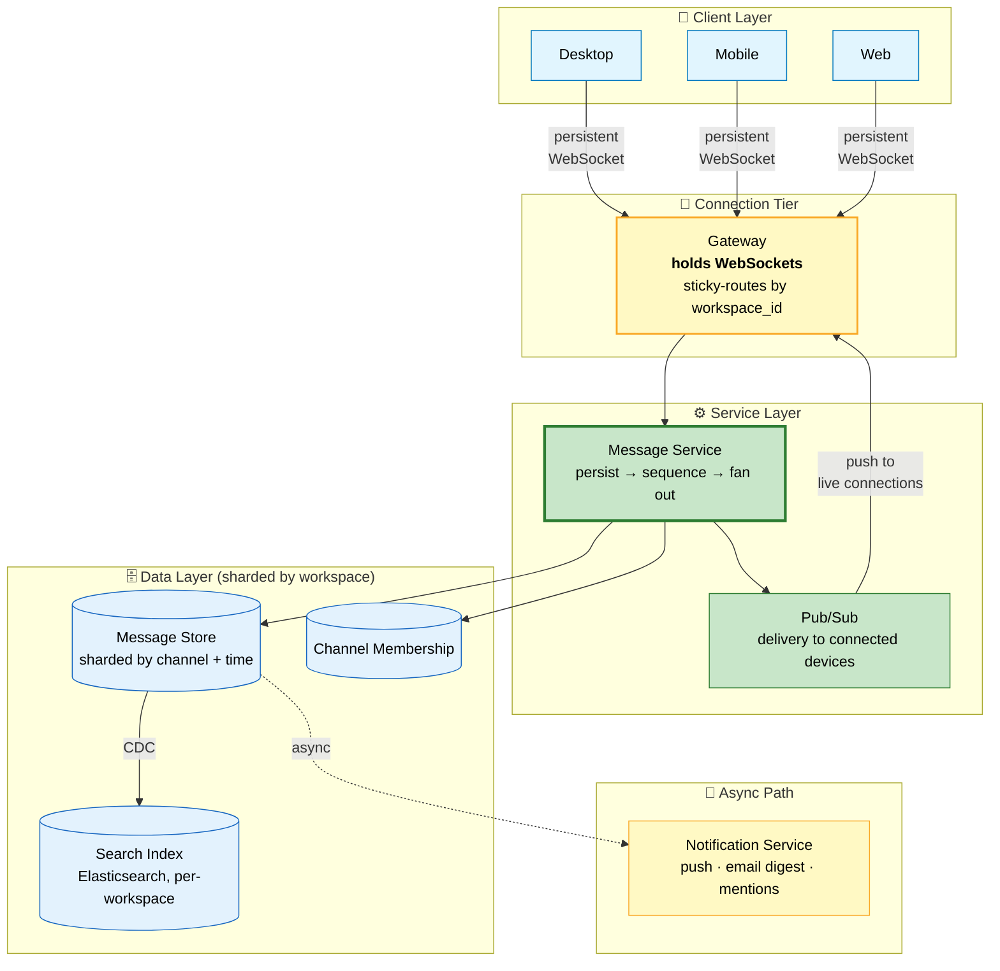
```mermaid
flowchart TD
    subgraph Client["📱 Client Layer"]
        D["Desktop"]
        M["Mobile"]
        W["Web"]
    end

    subgraph Gateway["🔌 Connection Tier"]
        GW["Gateway<br/><b>holds WebSockets</b><br/>sticky-routes by workspace_id"]
    end

    subgraph Service["⚙️ Service Layer"]
        MS["Message Service<br/>persist → sequence → fan out"]
        PS["Pub/Sub<br/>delivery to connected devices"]
    end

    subgraph Data["🗄️ Data Layer (sharded by workspace)"]
        MSTORE[("Message Store<br/>sharded by channel + time")]
        CM[("Channel Membership")]
        SEARCH[("Search Index<br/>Elasticsearch, per-workspace")]
    end

    subgraph Async["📣 Async Path"]
        NOTIF["Notification Service<br/>push · email digest · mentions"]
    end

    D & M & W -->|"persistent<br/>WebSocket"| GW
    GW --> MS
    MS --> MSTORE
    MS --> CM
    MS --> PS
    PS -->|"push to<br/>live connections"| GW
    MSTORE -->|"CDC"| SEARCH
    MSTORE -.->|"async"| NOTIF

    style D fill:#e1f5fe,stroke:#0277bd,color:#000
    style M fill:#e1f5fe,stroke:#0277bd,color:#000
    style W fill:#e1f5fe,stroke:#0277bd,color:#000
    style GW fill:#fff9c4,stroke:#f9a825,stroke-width:2px,color:#000
    style MS fill:#c8e6c9,stroke:#2e7d32,stroke-width:3px,color:#000
    style PS fill:#c8e6c9,stroke:#2e7d32,color:#000
    style MSTORE fill:#e3f2fd,stroke:#1565c0,color:#000
    style CM fill:#e3f2fd,stroke:#1565c0,color:#000
    style SEARCH fill:#e3f2fd,stroke:#1565c0,color:#000
    style NOTIF fill:#fff9c4,stroke:#f9a825,color:#000
```

### ⭐ Sharding by workspace

```
   THE KEY INSIGHT: workspaces are almost completely isolated.

   A message in Acme Corp's #general is never read by anyone at
   Globex. Cross-workspace queries essentially never happen
   (Slack Connect is the exception, and it's handled specially).

   → Shard EVERYTHING by workspace_id.

   ✅ Each workspace is a self-contained unit
   ✅ Huge workspaces can be isolated onto dedicated infrastructure
   ✅ A workspace's failure blast radius is that workspace
   ✅ Data residency (EU customers on EU infrastructure) is
      structural rather than policy
   ✅ Per-workspace search indexes stay small and fast

   ⭐ SAME PATTERN AS UBER'S GEOGRAPHIC SHARDING: find the natural
     isolation boundary in the domain and shard on it. It turns
     one global problem into N independent local ones.
```

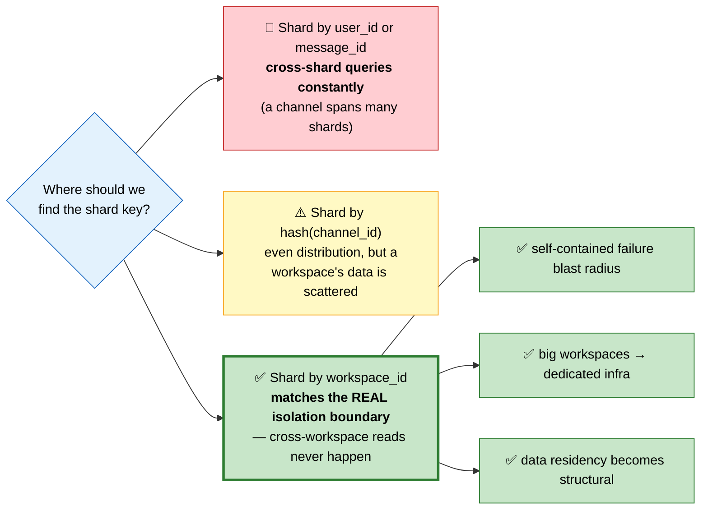
```mermaid
flowchart LR
    Q{"Where should we<br/>find the shard key?"}
    Q --> NAIVE["🐌 Shard by user_id or message_id<br/><b>cross-shard queries constantly</b><br/>(a channel spans many shards)"]
    Q --> BETTER["⚠️ Shard by hash(channel_id)<br/>even distribution, but a<br/>workspace's data is scattered"]
    Q --> BEST["✅ Shard by workspace_id<br/><b>matches the REAL isolation boundary</b><br/>— cross-workspace reads never happen"]

    BEST --> R1["✅ self-contained failure blast radius"]
    BEST --> R2["✅ big workspaces → dedicated infra"]
    BEST --> R3["✅ data residency becomes structural"]

    style Q fill:#e3f2fd,stroke:#1565c0,color:#000
    style NAIVE fill:#ffcdd2,stroke:#c62828,color:#000
    style BETTER fill:#fff9c4,stroke:#f9a825,color:#000
    style BEST fill:#c8e6c9,stroke:#2e7d32,stroke-width:3px,color:#000
    style R1 fill:#c8e6c9,stroke:#2e7d32,color:#000
    style R2 fill:#c8e6c9,stroke:#2e7d32,color:#000
    style R3 fill:#c8e6c9,stroke:#2e7d32,color:#000
```

## 5. Deep Dive — Channel Fan-Out

#### 💬 The problem returns

```
   A message in a 100,000-member channel must reach every
   connected member. That's the fan-out problem again — but with
   different constraints from Twitter.

   ⚠️ KEY DIFFERENCE FROM TWITTER

   Twitter: users pull their timeline when they open the app.
            Fan-out can be asynchronous and slightly delayed.

   Slack:   ⭐ delivery must be PUSHED in real time to already-
            connected clients. There's no "pull when you open it"
            — the client is already open and watching.
```

```
   THE HYBRID APPROACH

   ┌──────────────────────────────────────────────────────────────┐
   │ ① PERSIST FIRST                                              │
   │    Write the message to the channel's message store with a   │
   │    monotonic sequence number. ⭐ This is the source of truth  │
   │    and it establishes ORDER.                                 │
   ├──────────────────────────────────────────────────────────────┤
   │ ② PUSH TO CONNECTED MEMBERS ONLY                             │
   │    Look up which channel members currently have a live       │
   │    connection (typically a small fraction of members).       │
   │    Push to those connections via pub/sub.                    │
   │    ⭐ A 100K-member channel might have 3K people actually     │
   │      online — that's the number that matters, not 100K.      │
   ├──────────────────────────────────────────────────────────────┤
   │ ③ OFFLINE MEMBERS PULL ON RECONNECT                          │
   │    Client reconnects with "my last seen sequence for this    │
   │    channel is N" → server sends everything after N.          │
   │    ⭐ No per-user inbox needed. The channel log IS the        │
   │      shared state; each client tracks its own cursor.        │
   ├──────────────────────────────────────────────────────────────┤
   │ ④ NOTIFICATIONS ARE A SEPARATE, FILTERED PATH                │
   │    Push notifications go only to people who should be        │
   │    interrupted: @mentions, DMs, keyword matches — not        │
   │    every message in every channel.                           │
   └──────────────────────────────────────────────────────────────┘
```

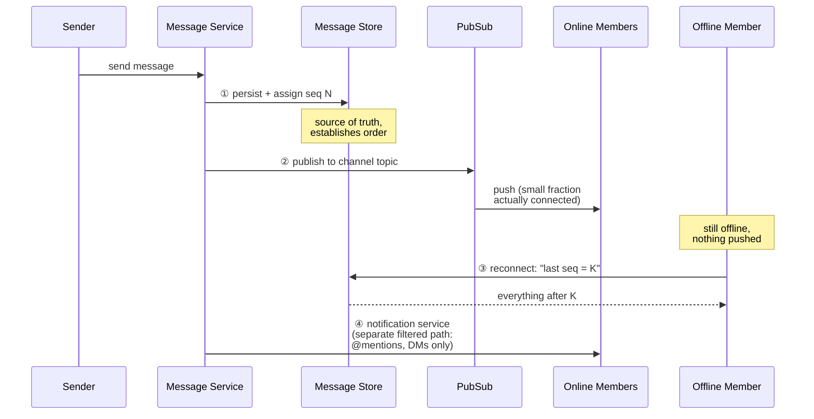
```mermaid
sequenceDiagram
    participant Sender
    participant MS as Message Service
    participant Store as Message Store
    participant PubSub
    participant Online as Online Members
    participant Offline as Offline Member

    Sender->>MS: send message
    MS->>Store: ① persist + assign seq N
    Note over Store: source of truth,<br/>establishes order
    MS->>PubSub: ② publish to channel topic
    PubSub->>Online: push (small fraction<br/>actually connected)
    Note over Offline: still offline,<br/>nothing pushed
    Offline->>Store: ③ reconnect: "last seq = K"
    Store-->>Offline: everything after K
    MS->>Online: ④ notification service<br/>(separate filtered path:<br/>@mentions, DMs only)
```

```
   ⭐ THE CURSOR MODEL IS THE ELEGANT PART

   Instead of maintaining a per-user copy of every message
   (Twitter's fan-out-on-write), Slack keeps ONE channel log
   and each user tracks a POSITION in it.

   channel #general:  [msg 1][msg 2][msg 3][msg 4][msg 5]
                                      ▲            ▲
                                   alice        bob
                                  (2 unread)   (0 unread)

   ✅ One copy of each message, regardless of channel size
   ✅ Unread counts are a subtraction, not a stored counter
   ✅ "Mark all as read" is one cursor update
   ✅ Joining a channel gives you full history instantly —
      you just start reading the existing log

   This works BECAUSE channels are a shared, ordered stream.
   Twitter timelines are per-user merges of many streams, which
   is why they need materialization.
```

## 6. Deep Dive — Multi-Device Consistency

```
   ⚠️ THE PROBLEM
   Alice reads a message on her phone. Her desktop must clear
   the unread badge immediately. She types on desktop; her phone
   shouldn't notify her.

   ⭐ SOLUTION: read state is SERVER-SIDE, not per-device.

   ┌────────────────────────────────────────────────────────────┐
   │  user_channel_state                                        │
   │    user_id · channel_id · last_read_seq · last_seen_at     │
   └────────────────────────────────────────────────────────────┘

   • Any device updating the cursor broadcasts to that user's
     OTHER devices over their WebSockets
   • Unread count = (channel latest_seq) − (user last_read_seq)
   • Notification suppression: if the user was active on ANY
     device within the last N seconds, suppress push
```

```
   ⚠️ THE "ACTIVE DEVICE" HEURISTIC IS SUBTLE

   Naive: "suppress push if any device is connected"
   → but a desktop left running overnight is connected and idle,
     so you'd suppress notifications the user genuinely wanted.

   Better: track ACTIVITY (focus, input, recent interaction) not
   just connection. Suppress only if a device is actively in use
   AND has that conversation visible.
```

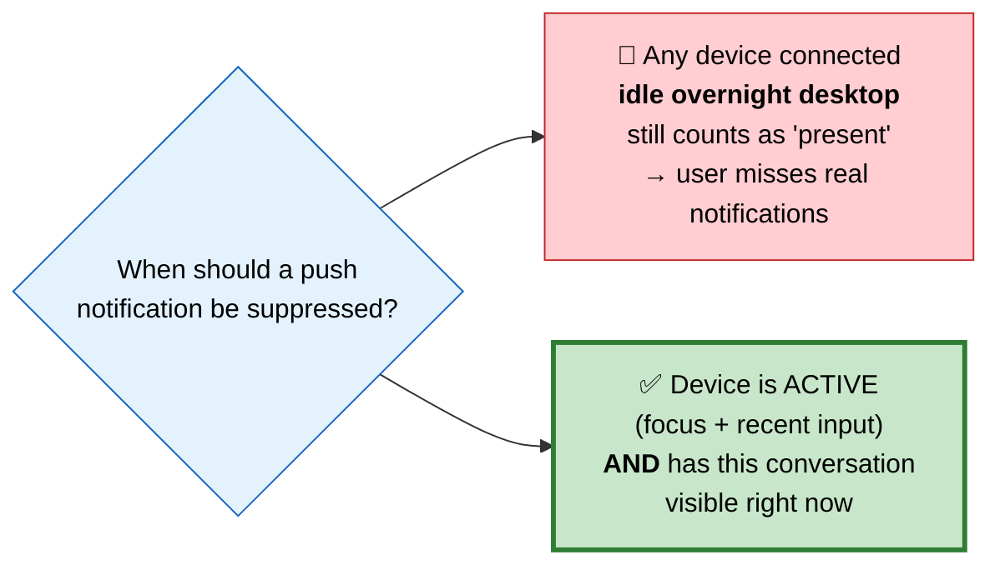
```mermaid
flowchart LR
    Q{"When should a push<br/>notification be suppressed?"}
    Q --> NAIVE["🐌 Any device connected<br/><b>idle overnight desktop</b><br/>still counts as 'present'<br/>→ user misses real notifications"]
    Q --> BEST["✅ Device is ACTIVE<br/>(focus + recent input)<br/><b>AND</b> has this conversation<br/>visible right now"]

    style Q fill:#e3f2fd,stroke:#1565c0,color:#000
    style NAIVE fill:#ffcdd2,stroke:#c62828,color:#000
    style BEST fill:#c8e6c9,stroke:#2e7d32,stroke-width:3px,color:#000
```

## 7. Deep Dive — Search

```
   ⭐ SEARCH IS A PRIMARY FEATURE, NOT AN ADD-ON

   Slack's value proposition is largely "your team's knowledge
   is searchable." That makes search a correctness-and-latency
   requirement, not a nice-to-have.

   ARCHITECTURE
   Message store ──CDC──▶ Indexing pipeline ──▶ Elasticsearch
                                                (per workspace)

   ⭐ PERMISSION FILTERING IS THE HARD PART

   A user must only see results from channels they can access:
     • public channels in their workspace
     • private channels they're a member of
     • their own DMs

   TWO APPROACHES:
   ① Filter at query time — attach the user's accessible channel
      list to the query. Simple, but the list can be thousands
      of channels, making queries slow.
   ② Index ACLs alongside documents and filter in the engine.
      Faster, but membership changes require reindexing.

   ⚠️ Getting this wrong leaks private conversations across a
     company. It's the single highest-severity bug class in
     a product like this.
```

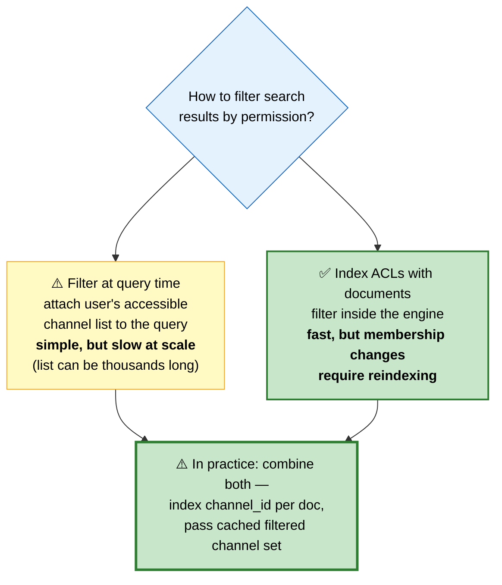
```mermaid
flowchart TD
    Q{"How to filter search<br/>results by permission?"}
    Q --> A["⚠️ Filter at query time<br/>attach user's accessible<br/>channel list to the query<br/><b>simple, but slow at scale</b><br/>(list can be thousands long)"]
    Q --> B["✅ Index ACLs with documents<br/>filter inside the engine<br/><b>fast, but membership changes<br/>require reindexing</b>"]
    A --> C["⚠️ In practice: combine both —<br/>index channel_id per doc,<br/>pass cached filtered channel set"]
    B --> C

    style Q fill:#e3f2fd,stroke:#1565c0,color:#000
    style A fill:#fff9c4,stroke:#f9a825,color:#000
    style B fill:#c8e6c9,stroke:#2e7d32,stroke-width:2px,color:#000
    style C fill:#c8e6c9,stroke:#2e7d32,stroke-width:3px,color:#000
```

## 🎤 Interview Follow-Ups

<details>
<summary><b>"How is Slack different from WhatsApp architecturally?"</b></summary>

Three differences drive everything else.

Permanent searchable history. WhatsApp deletes messages once delivered, which makes its storage problem nearly vanish. For Slack, history *is* the product, so storage is a first-class concern and search is a primary feature rather than an add-on.

That in turn means messages can't be end-to-end encrypted, because the server needs to read them for search, compliance, eDiscovery, and data-loss prevention. Enterprise customers require those capabilities, so the security model is fundamentally different.

And channel size. WhatsApp handles one-to-one and small groups; Slack has channels with a hundred thousand members, so fan-out becomes a real problem again — but with a twist. Twitter can fan out asynchronously because users pull when they open the app. Slack clients are already open and watching, so delivery must be pushed in real time.

The elegant part of Slack's answer is the cursor model: one channel log, and each user tracks a position in it. Unread counts are a subtraction rather than a stored counter, and joining a channel gives you full history instantly because you just start reading the existing log.
</details>

<details>
<summary><b>"How do you handle a message in a 100,000-member channel?"</b></summary>

The number that matters isn't 100,000 — it's how many members are currently connected, which might be three thousand.

The flow is: persist the message to the channel log with a monotonic sequence number, which establishes order and is the source of truth. Then look up which members have live connections and push only to those, via pub/sub. Offline members pull on reconnect by sending their last-seen sequence number, and the server returns everything after it.

That means there's no per-user inbox to materialize. One copy of each message exists, and each client tracks a cursor. Compare that with Twitter, where timelines are per-user merges of many different streams and therefore need materialization — Slack channels are a single shared ordered stream, which is what makes the cursor model work.

Notifications are a completely separate, filtered path. Push notifications go only to people who should be interrupted — mentions, DMs, keyword matches — not for every message in every channel, or the product would be unusable.
</details>

<details>
<summary><b>"How do you make search fast and correct?"</b></summary>

Architecturally it's a derived index fed by change data capture from the message store, with a separate Elasticsearch index per workspace. Per-workspace isolation keeps each index small and fast, and it means a huge customer can't degrade search for everyone else.

The hard part is permission filtering. A user must only see results from public channels in their workspace, private channels they belong to, and their own DMs. Getting that wrong leaks private conversations across a company, which is the highest-severity bug class in this kind of product.

Two approaches. Filter at query time by attaching the user's accessible channel list to the query — simple, but that list can be thousands of channels, which makes queries slow. Or index access control alongside documents and filter inside the engine — faster, but membership changes require reindexing.

In practice you'd combine them: index channel IDs with each document, and pass a filtered channel set for the user, with the set itself cached and invalidated on membership change.
</details>

---

# 🎵 Spotify

> **Teaches:** audio streaming economics, playlist architecture, and discovery at scale.

## 1. Requirements

```
   FUNCTIONAL
   • Stream music with instant playback
   • Search tracks, artists, albums, playlists
   • Create/share/collaborate on playlists
   • Personalized recommendations (Discover Weekly, radio)
   • Offline downloads
   • Cross-device playback control (Connect)

   NON-FUNCTIONAL
   SCALE          ~600M users · ~100M tracks · billions of streams/day
   ⭐ LATENCY      Playback start < 200ms — feels instant, and this
                  is genuinely the product's most important metric
   AVAILABILITY   99.95%
   ⭐ LICENSING    Rights vary by TERRITORY and change over time —
                  a track available in the US may not be in Japan
```

## 2. Estimation

```
   STREAMS        ~5B/day ÷ 86,400 ≈ 58,000/sec average

   AUDIO SIZE     3-minute track at ~160 kbps ≈ 3.5 MB
                  (Spotify uses Ogg Vorbis / AAC at several bitrates)

   CATALOGUE      100M tracks × ~4 bitrate variants × 3.5 MB
                  ≈ 1.4 PB  ⭐ notably SMALLER than video services

   BANDWIDTH      Concurrent listeners × bitrate
                  ~10M concurrent × 160 kbps ≈ 1.6 Tbps

   ⭐ COMPARED TO VIDEO, AUDIO IS TINY.
     Netflix: ~100 Tbps.  Spotify: ~1.6 Tbps.
     That's 60× less — which means Spotify can use commercial
     CDNs rather than needing to build its own network.
     ⭐ The economics of the medium determine the architecture.
```

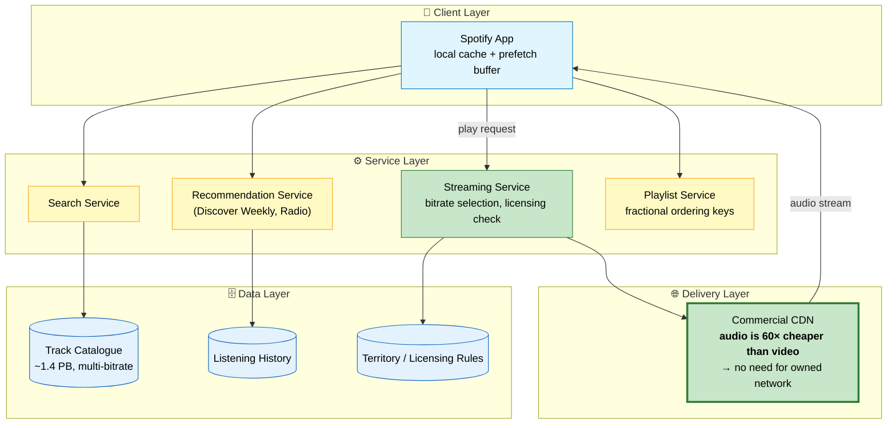
```mermaid
flowchart TD
    subgraph Client["📱 Client Layer"]
        App["Spotify App<br/>local cache + prefetch buffer"]
    end

    subgraph Edge["🌐 Delivery Layer"]
        CDN["Commercial CDN<br/><b>audio is 60× cheaper than video</b><br/>→ no need for owned network"]
    end

    subgraph Service["⚙️ Service Layer"]
        Stream["Streaming Service<br/>bitrate selection, licensing check"]
        Search["Search Service"]
        Rec["Recommendation Service<br/>(Discover Weekly, Radio)"]
        Playlist["Playlist Service<br/>fractional ordering keys"]
    end

    subgraph Data["🗄️ Data Layer"]
        Catalog[("Track Catalogue<br/>~1.4 PB, multi-bitrate")]
        UserData[("Listening History")]
        Territory[("Territory / Licensing Rules")]
    end

    App -->|"play request"| Stream
    Stream --> Territory
    Stream --> CDN
    CDN -->|"audio stream"| App
    App --> Search --> Catalog
    App --> Playlist
    App --> Rec --> UserData

    style App fill:#e1f5fe,stroke:#0277bd,color:#000
    style CDN fill:#c8e6c9,stroke:#2e7d32,stroke-width:3px,color:#000
    style Stream fill:#c8e6c9,stroke:#2e7d32,color:#000
    style Search fill:#fff9c4,stroke:#f9a825,color:#000
    style Rec fill:#fff9c4,stroke:#f9a825,color:#000
    style Playlist fill:#fff9c4,stroke:#f9a825,color:#000
    style Catalog fill:#e3f2fd,stroke:#1565c0,color:#000
    style UserData fill:#e3f2fd,stroke:#1565c0,color:#000
    style Territory fill:#e3f2fd,stroke:#1565c0,color:#000
```

## 3. Deep Dive — Instant Playback

#### 💬 Why sub-200ms matters so much

```
   Music is a "press play and it's already going" experience.
   A 2-second delay that's acceptable for video feels broken
   for audio. So the entire delivery path is optimized for
   TIME TO FIRST SOUND.

   ⭐ THE TECHNIQUES, in order of impact

   ┌──────────────────────────────────────────────────────────────┐
   │ 1. PREFETCH THE NEXT TRACK                                   │
   │    While the current track plays, download the beginning of  │
   │    the next one. Queue order is known, so this is essentially │
   │    free prediction.                                          │
   ├──────────────────────────────────────────────────────────────┤
   │ 2. CACHE AGGRESSIVELY ON DEVICE                              │
   │    ⭐ People replay the same music constantly. Local cache    │
   │    hit rates are very high — often 50%+ of plays never       │
   │    touch the network at all.                                 │
   ├──────────────────────────────────────────────────────────────┤
   │ 3. START PLAYING BEFORE FULLY DOWNLOADED                     │
   │    Buffer a few seconds, start audio, continue fetching.     │
   ├──────────────────────────────────────────────────────────────┤
   │ 4. CDN EDGE PROXIMITY                                        │
   │    Popular tracks sit at the edge. The long tail is fetched  │
   │    from origin — acceptable because it's rare.               │
   ├──────────────────────────────────────────────────────────────┤
   │ 5. ⭐ P2P (historically)                                      │
   │    Early Spotify used peer-to-peer distribution among        │
   │    desktop clients to cut CDN costs dramatically. Retired    │
   │    once CDN economics improved and mobile dominated —        │
   │    but it's a great example of exploiting the medium.        │
   └──────────────────────────────────────────────────────────────┘
```

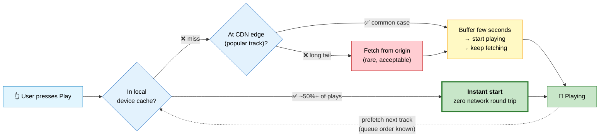
```mermaid
flowchart LR
    Press["👆 User presses Play"] --> Cache{"In local<br/>device cache?"}
    Cache -->|"✅ ~50%+ of plays"| Instant["<b>Instant start</b><br/>zero network round trip"]
    Cache -->|"❌ miss"| Edge{"At CDN edge<br/>(popular track)?"}
    Edge -->|"✅ common case"| Buffer["Buffer few seconds<br/>→ start playing<br/>→ keep fetching"]
    Edge -->|"❌ long tail"| Origin["Fetch from origin<br/>(rare, acceptable)"]
    Origin --> Buffer
    Buffer --> Playing["🎵 Playing"]
    Instant --> Playing
    Playing -.->|"prefetch next track<br/>(queue order known)"| Cache

    style Press fill:#e1f5fe,stroke:#0277bd,color:#000
    style Cache fill:#e3f2fd,stroke:#1565c0,color:#000
    style Edge fill:#e3f2fd,stroke:#1565c0,color:#000
    style Instant fill:#c8e6c9,stroke:#2e7d32,stroke-width:3px,color:#000
    style Buffer fill:#fff9c4,stroke:#f9a825,color:#000
    style Origin fill:#ffcdd2,stroke:#c62828,color:#000
    style Playing fill:#c8e6c9,stroke:#2e7d32,color:#000
```

## 4. Deep Dive — Playlists

```
   ⚠️ A PLAYLIST IS NOT JUST A LIST OF TRACK IDs

   Requirements that complicate it:
     • ordered, and reorderable by drag
     • collaborative — multiple people editing concurrently
     • can be huge (10,000+ tracks)
     • tracks can become unavailable (licensing changes)
     • needs full change history for undo

   ⭐ NAIVE: store an ordered array of track IDs.
     Reordering one track rewrites the whole array.
     Two people reordering concurrently = lost work.
```

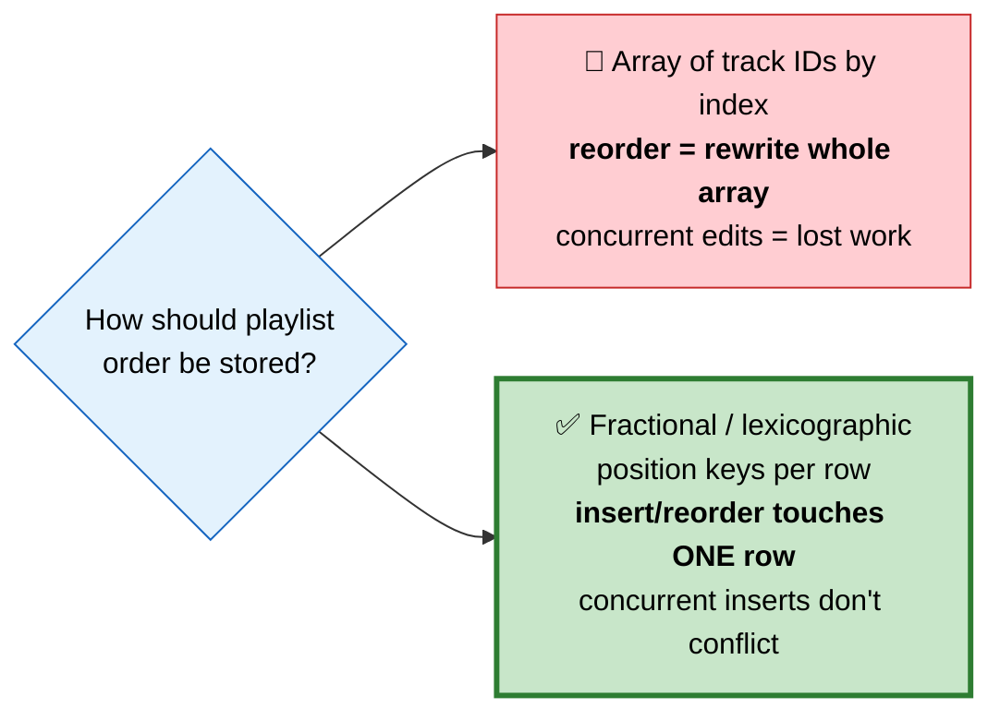
```mermaid
flowchart LR
    Q{"How should playlist<br/>order be stored?"}
    Q --> NAIVE["🐌 Array of track IDs by index<br/><b>reorder = rewrite whole array</b><br/>concurrent edits = lost work"]
    Q --> BEST["✅ Fractional / lexicographic<br/>position keys per row<br/><b>insert/reorder touches ONE row</b><br/>concurrent inserts don't conflict"]

    style Q fill:#e3f2fd,stroke:#1565c0,color:#000
    style NAIVE fill:#ffcdd2,stroke:#c62828,color:#000
    style BEST fill:#c8e6c9,stroke:#2e7d32,stroke-width:3px,color:#000
```

```
   ✅ BETTER: FRACTIONAL / LEXICOGRAPHIC ORDERING KEYS

   Each entry gets a sortable position key rather than an index:

   track A  → position "a"
   track B  → position "b"
   track C  → position "c"

   Insert between A and B → position "am"    ⭐ no other rows touched
   Insert between A and am → position "ag"

   ✅ Insert/reorder touches ONE row
   ✅ Concurrent inserts at different positions don't conflict
   ✅ Scales to very large playlists

   ⚠️ Keys grow in length with repeated insertions at the same
     spot; periodic rebalancing keeps them short.

   ⭐ This is the same idea as CRDT sequence IDs from
     [Google Docs](04-case-studies-2.md#4-solution-b--crdts) —
     replace positional indices with orderable identifiers,
     and concurrent edits stop conflicting.
```

## 5. Deep Dive — Discover Weekly

#### 💬 The feature that defined the product

```
   ⭐ THE CORE INSIGHT: PLAYLISTS ARE HUMAN-CURATED SIGNAL.

   Billions of user-made playlists encode "these songs go
   together" judgments made by real people. That's an
   extraordinarily rich training signal that Spotify has and
   most competitors don't.

   THREE SIGNAL SOURCES, COMBINED:

   ┌──────────────────────────────────────────────────────────────┐
   │ ① COLLABORATIVE FILTERING                                    │
   │    "People with similar taste to you also listen to X"       │
   │    Built from listening history + playlist co-occurrence.    │
   │    ✅ Captures taste patterns humans can't articulate         │
   │    ❌ ⭐ COLD START: a brand-new track has no co-occurrence    │
   ├──────────────────────────────────────────────────────────────┤
   │ ② NLP ON TEXT ABOUT MUSIC                                    │
   │    Blogs, reviews, articles, playlist titles and             │
   │    descriptions → "what words do people use about this?"     │
   │    ✅ Captures genre, mood, cultural context                  │
   ├──────────────────────────────────────────────────────────────┤
   │ ③ RAW AUDIO ANALYSIS                                         │
   │    CNN over spectrograms → tempo, key, energy,               │
   │    danceability, acousticness, timbre                        │
   │    ⭐ SOLVES COLD START: a track with zero listens can        │
   │      still be characterized and recommended, because the     │
   │      audio itself is the feature.                            │
   └──────────────────────────────────────────────────────────────┘

   ⭐ THE COMBINATION IS THE POINT. Collaborative filtering is
     most accurate but can't handle new content. Audio analysis
     is less precise but works from day zero. Together they
     cover each other's weakness.
```

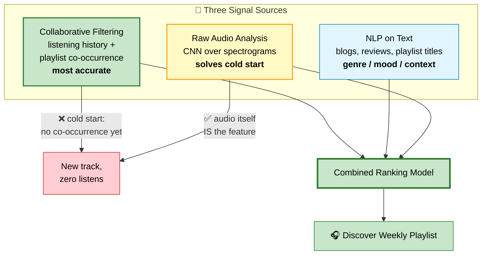
```mermaid
flowchart TD
    subgraph Signals["🎯 Three Signal Sources"]
        CF["Collaborative Filtering<br/>listening history +<br/>playlist co-occurrence<br/><b>most accurate</b>"]
        NLP["NLP on Text<br/>blogs, reviews, playlist titles<br/><b>genre / mood / context</b>"]
        Audio["Raw Audio Analysis<br/>CNN over spectrograms<br/><b>solves cold start</b>"]
    end

    CF -->|"❌ cold start:<br/>no co-occurrence yet"| Problem["New track,<br/>zero listens"]
    Audio -->|"✅ audio itself<br/>IS the feature"| Problem

    CF --> Blend["Combined Ranking Model"]
    NLP --> Blend
    Audio --> Blend
    Blend --> Weekly["🎧 Discover Weekly Playlist"]

    style CF fill:#c8e6c9,stroke:#2e7d32,stroke-width:2px,color:#000
    style NLP fill:#e1f5fe,stroke:#0277bd,color:#000
    style Audio fill:#fff9c4,stroke:#f9a825,stroke-width:2px,color:#000
    style Problem fill:#ffcdd2,stroke:#c62828,color:#000
    style Blend fill:#c8e6c9,stroke:#2e7d32,stroke-width:3px,color:#000
    style Weekly fill:#c8e6c9,stroke:#2e7d32,color:#000
```

```
   GENERATION PIPELINE (weekly batch)

   ① Build a taste profile per user from recent listening
   ② Generate candidates from all three signal sources
   ③ Filter out: already-heard tracks, disliked artists,
      tracks unavailable in the user's territory
   ④ Rank by predicted engagement
   ⑤ ⭐ Enforce DIVERSITY — no more than N tracks per artist,
      spread across genres. A playlist of 30 near-identical
      songs is a failure even if each is individually well-matched.
   ⑥ Materialize to a fast store; serve instantly on request
```

## 6. Deep Dive — Licensing

```
   ⚠️ THE CONSTRAINT THAT SHAPES EVERYTHING

   Rights are per-TERRITORY, per-TIME-WINDOW, and change
   without much notice.

   • A track available in the US may not be in Japan
   • A track can be pulled from the catalogue overnight
   • Playlists must handle tracks becoming unavailable
     without breaking (grey them out, don't delete the entry)
   • ⭐ Every serving path needs a territory filter, and it must
     be fast — it's on the hot path of every search and every
     playlist load
   • Royalty calculation requires accurate per-stream accounting
     per rights-holder per territory
     → ⭐ this is an append-only ledger problem, structurally
       identical to [Stripe's](04-case-studies-2.md#4-deep-dive--the-ledger)
```

## 🎤 Interview Follow-Ups

<details>
<summary><b>"How do you make playback feel instant?"</b></summary>

Several layers, and the cheapest ones matter most.

On-device caching is the biggest win, because people replay the same music constantly — cache hit rates are high enough that a large fraction of plays never touch the network. Prefetching the next track while the current one plays is nearly free, since queue order is known.

Then: start playing after buffering a few seconds rather than waiting for a full download, and keep popular tracks at CDN edges so the network fetch is short when it happens.

Historically Spotify also used peer-to-peer distribution among desktop clients to cut CDN costs substantially. It was retired as CDN economics improved and mobile came to dominate, but it's a good example of exploiting a medium's properties.

The framing that matters: audio is roughly sixty times cheaper to deliver than video in bandwidth terms, so Spotify can use commercial CDNs where Netflix had to build its own network. The economics of the medium determine the architecture.
</details>

<details>
<summary><b>"How do you store a playlist that supports concurrent reordering?"</b></summary>

Not as an ordered array of track IDs — reordering one track rewrites the whole array, and two people reordering concurrently lose each other's work.

Instead give each entry a fractional or lexicographic position key. Tracks might be at positions "a", "b", "c", and inserting between "a" and "b" produces "am" — touching exactly one row and leaving everything else untouched.

That means inserts and reorders are single-row operations, and concurrent edits at different positions don't conflict at all. It scales to very large playlists because no operation is proportional to playlist length.

The one maintenance concern is that keys grow in length with repeated insertions at the same spot, so periodic rebalancing keeps them short.

It's structurally the same idea as CRDT sequence identifiers in collaborative text editing — replace positional indices with orderable identifiers, and concurrent edits stop conflicting by construction.
</details>

<details>
<summary><b>"How does Discover Weekly work, and how do you handle new tracks?"</b></summary>

Three signal sources combined, and the combination is the point.

Collaborative filtering finds patterns in listening history and playlist co-occurrence — "people with taste like yours also listen to this." Spotify has an unusual advantage here: billions of user-made playlists are human judgments about which songs belong together, which is extraordinarily rich training signal.

Natural language processing over blogs, reviews, and playlist titles captures genre, mood, and cultural context that behaviour alone misses.

And raw audio analysis — convolutional networks over spectrograms extracting tempo, key, energy, danceability, timbre.

That third source is what solves cold start. Collaborative filtering is the most accurate signal but is useless for a track with no listening history. Audio analysis works from day zero because the audio itself is the feature, so a brand-new track can be characterized and recommended immediately.

The generation pipeline then filters by territory licensing and already-heard tracks, ranks by predicted engagement, and — critically — enforces diversity. Thirty near-identical songs is a failed playlist even if each track individually matches well.
</details>

---

# 🛵 DoorDash

> **Teaches:** three-sided marketplaces, real-time logistics optimization, and ETA prediction under uncertainty.

## 1. Requirements

```
   FUNCTIONAL
   • Browse restaurants, view menus, place orders
   • Real-time order tracking
   • Dasher (courier) assignment and routing
   • Merchant order management
   • Payments, tips, refunds

   NON-FUNCTIONAL
   SCALE          ~37M users · ~2M dashers · ~1M+ merchants
                  ~2M+ deliveries/day
   ⭐ THREE-SIDED  Consumers, merchants, AND couriers — all must
                  be satisfied simultaneously
   LATENCY        Dasher assignment < 30s · ETA accuracy critical
   ⭐ PERISHABLE   ⚠️ Food gets cold. Time is a HARD constraint,
                  not a soft preference.
```

## 2. Why three-sided is harder than two-sided

```
   ┌──────────────────────────────────────────────────────────────┐
   │            THE OPTIMIZATION IS SIMULTANEOUS                  │
   │                                                              │
   │   CONSUMER wants:  fast delivery, hot food, low fees         │
   │   MERCHANT wants:  orders timed to their kitchen capacity,   │
   │                    not 20 at once                            │
   │   DASHER wants:    high earnings per hour, minimal idle time,│
   │                    short unpaid waiting at restaurants       │
   │                                                              │
   │   ⚠️ These CONFLICT. Batching two orders to one dasher       │
   │     improves dasher earnings and platform efficiency but     │
   │     delays one consumer's food.                              │
   │                                                              │
   │   ⭐ There is no single objective to optimize. The system     │
   │     optimizes a WEIGHTED BLEND, and the weights are a        │
   │     business decision, not a technical one.                  │
   └──────────────────────────────────────────────────────────────┘

   COMPARE WITH UBER: two-sided, and the ride starts when the
   driver arrives. Here the FOOD starts cooking on a separate
   timeline, and the dasher must arrive at the right moment —
   too early and they wait unpaid, too late and the food is cold.
```

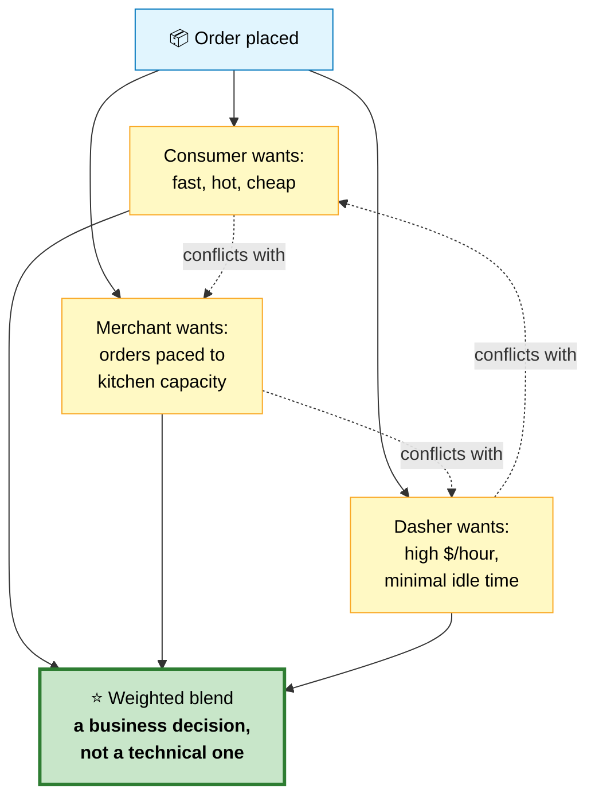
```mermaid
flowchart TD
    Order["📦 Order placed"] --> Consumer["Consumer wants:<br/>fast, hot, cheap"]
    Order --> Merchant["Merchant wants:<br/>orders paced to<br/>kitchen capacity"]
    Order --> Dasher["Dasher wants:<br/>high $/hour,<br/>minimal idle time"]

    Consumer -.->|"conflicts with"| Merchant
    Merchant -.->|"conflicts with"| Dasher
    Dasher -.->|"conflicts with"| Consumer

    Consumer & Merchant & Dasher --> Blend["⭐ Weighted blend<br/><b>a business decision,<br/>not a technical one</b>"]

    style Order fill:#e1f5fe,stroke:#0277bd,color:#000
    style Consumer fill:#fff9c4,stroke:#f9a825,color:#000
    style Merchant fill:#fff9c4,stroke:#f9a825,color:#000
    style Dasher fill:#fff9c4,stroke:#f9a825,color:#000
    style Blend fill:#c8e6c9,stroke:#2e7d32,stroke-width:3px,color:#000
```

## 3. Deep Dive — The Assignment Problem

#### 💬 Why this isn't just "nearest dasher"

```
   ⚠️ THE TIMING PROBLEM

   Order placed ──▶ Restaurant starts cooking (15 min)
                                    │
                    Dasher should ARRIVE around here ─┘
                    ↑                                  ↑
              too early:                          too late:
              dasher waits unpaid,                food sits and
              wasted capacity                     gets cold

   ⭐ So assignment isn't "find the closest dasher NOW" — it's
     "find the dasher who will BE AVAILABLE at approximately
     the food-ready time, accounting for travel."

   This requires predicting:
     • food preparation time (varies by restaurant, item,
       current kitchen load, time of day)
     • dasher travel time to the restaurant
     • dasher travel time to the customer
     • parking and hand-off time (surprisingly significant
       and highly location-dependent)
```

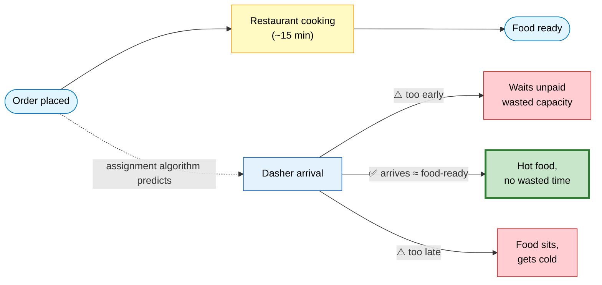
```mermaid
flowchart LR
    Placed(["Order placed"]) --> Cook["Restaurant cooking<br/>(~15 min)"]
    Cook --> Ready(["Food ready"])
    Placed -.->|"assignment algorithm predicts"| Dasher["Dasher arrival"]
    Dasher -->|"⚠️ too early"| Wait["Waits unpaid<br/>wasted capacity"]
    Dasher -->|"✅ arrives ≈ food-ready"| OnTime["Hot food,<br/>no wasted time"]
    Dasher -->|"⚠️ too late"| Cold["Food sits,<br/>gets cold"]

    style Placed fill:#e1f5fe,stroke:#0277bd,color:#000
    style Cook fill:#fff9c4,stroke:#f9a825,color:#000
    style Ready fill:#e1f5fe,stroke:#0277bd,color:#000
    style Dasher fill:#e3f2fd,stroke:#1565c0,color:#000
    style Wait fill:#ffcdd2,stroke:#c62828,color:#000
    style OnTime fill:#c8e6c9,stroke:#2e7d32,stroke-width:3px,color:#000
    style Cold fill:#ffcdd2,stroke:#c62828,color:#000
```

```
   BATCHING — the efficiency lever

   ┌──────────────────────────────────────────────────────────────┐
   │ If two orders are from nearby restaurants going to nearby    │
   │ destinations at similar times, one dasher can carry both.    │
   │                                                              │
   │   ✅ Dasher earns more per hour                               │
   │   ✅ Platform delivers more with the same supply              │
   │   ❌ ⚠️ One consumer waits longer                             │
   │                                                              │
   │ ⭐ The decision is a constrained optimization:                │
   │   batch only when the added delay to the second order        │
   │   stays under a threshold, and never batch orders where      │
   │   food quality is highly time-sensitive.                     │
   └──────────────────────────────────────────────────────────────┘
```

```
   THE ALGORITHM SHAPE

   ① Collect a small BATCH WINDOW of pending orders (~seconds)
      ⭐ Assigning each order greedily on arrival is worse than
        waiting briefly and optimizing across several at once.

   ② Build a cost matrix: (dasher × order) → cost
      Cost blends: travel time, predicted wait at restaurant,
      dasher's current load, fairness/earnings balance,
      predicted consumer delay

   ③ Solve the assignment
      Hungarian algorithm for optimal, or a greedy/heuristic
      approach at scale where optimal is too slow

   ④ Offer to the selected dashers; on decline, re-solve
```

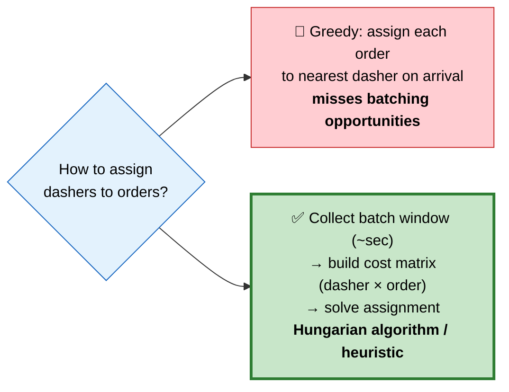
```mermaid
flowchart LR
    Q{"How to assign<br/>dashers to orders?"}
    Q --> GREEDY["🐌 Greedy: assign each order<br/>to nearest dasher on arrival<br/><b>misses batching opportunities</b>"]
    Q --> BATCH["✅ Collect batch window (~sec)<br/>→ build cost matrix<br/>(dasher × order)<br/>→ solve assignment<br/><b>Hungarian algorithm / heuristic</b>"]

    style Q fill:#e3f2fd,stroke:#1565c0,color:#000
    style GREEDY fill:#ffcdd2,stroke:#c62828,color:#000
    style BATCH fill:#c8e6c9,stroke:#2e7d32,stroke-width:3px,color:#000
```

## 4. Deep Dive — ETA Prediction

#### 💬 Why ETA is the product

```
   ⭐ ETA ACCURACY IS THE SINGLE MOST VISIBLE QUALITY SIGNAL.

   A consistently accurate 40-minute ETA beats an optimistic
   25-minute ETA that becomes 45. Predictability matters more
   than speed.

   THE ETA IS A SUM OF UNCERTAIN COMPONENTS:

   ┌──────────────────────────────────────────────────────────────┐
   │ ① ORDER → ASSIGNMENT      how long to find a dasher          │
   │      depends on local supply/demand right now                │
   ├──────────────────────────────────────────────────────────────┤
   │ ② FOOD PREPARATION   ⭐ the highest-variance component        │
   │      per-restaurant historical distributions, current        │
   │      kitchen load, item complexity, time of day              │
   ├──────────────────────────────────────────────────────────────┤
   │ ③ DASHER → RESTAURANT     road network routing               │
   ├──────────────────────────────────────────────────────────────┤
   │ ④ PICKUP TIME             parking + walking in + waiting     │
   │      ⚠️ highly location-specific: a mall food court is very   │
   │        different from a street-front restaurant              │
   ├──────────────────────────────────────────────────────────────┤
   │ ⑤ RESTAURANT → CUSTOMER   routing + traffic                  │
   ├──────────────────────────────────────────────────────────────┤
   │ ⑥ DROP-OFF                parking, apartment buildings,      │
   │      gated communities, elevator time                        │
   └──────────────────────────────────────────────────────────────┘
```

```
   ⭐ PREDICT A DISTRIBUTION, NOT A POINT

   The model outputs a probability distribution over arrival times.
   Then quote a value at a chosen percentile — often ~p70-80
   rather than the median.

   WHY: the cost of being LATE is much higher than the cost of
   being early. Quoting the median means being late half the time.
   Quoting p75 means arriving early most of the time, which
   consumers experience as reliability.

   ⭐ This asymmetric-loss framing is a genuinely senior insight
     and applies far beyond delivery.
```

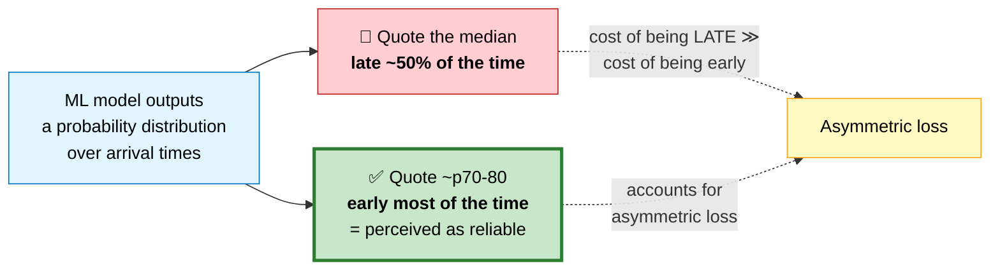
```mermaid
flowchart LR
    Model["ML model outputs<br/>a probability distribution<br/>over arrival times"] --> Median["🐌 Quote the median<br/><b>late ~50% of the time</b>"]
    Model --> P75["✅ Quote ~p70-80<br/><b>early most of the time</b><br/>= perceived as reliable"]

    Median -.->|"cost of being LATE ≫<br/>cost of being early"| Loss["Asymmetric loss"]
    P75 -.->|"accounts for<br/>asymmetric loss"| Loss

    style Model fill:#e1f5fe,stroke:#0277bd,color:#000
    style Median fill:#ffcdd2,stroke:#c62828,color:#000
    style P75 fill:#c8e6c9,stroke:#2e7d32,stroke-width:3px,color:#000
    style Loss fill:#fff9c4,stroke:#f9a825,color:#000
```

## 5. Architecture

```
   ┌──────────┐   ┌──────────┐   ┌──────────┐
   │ Consumer │   │ Merchant │   │  Dasher  │
   │   app    │   │  tablet  │   │   app    │
   └────┬─────┘   └────┬─────┘   └────┬─────┘
        │              │              │
        └──────────────┼──────────────┘
                       ▼
   ┌─────────────────────────────────────────────────────────────┐
   │                     API GATEWAY                             │
   └───┬──────────┬──────────┬──────────┬──────────┬─────────────┘
       ▼          ▼          ▼          ▼          ▼
   ┌────────┐┌────────┐┌──────────┐┌────────┐┌──────────────┐
   │ ORDER  ││MERCHANT││ASSIGNMENT││  ETA   ││   LOCATION   │
   │service ││ catalog││ (matching││ service││   tracking   │
   │        ││ + menu ││  engine) ││  (ML)  ││              │
   └───┬────┘└────────┘└────┬─────┘└────────┘└──────┬───────┘
       │                    │                       │
       ▼                    ▼                       ▼
   ┌────────────┐   ┌──────────────┐      ┌──────────────────┐
   │ Orders DB  │   │ Dasher supply│      │ Redis geo index  │
   │ (Postgres, │   │ state (Redis)│      │ + in-memory      │
   │  sharded   │   └──────────────┘      └──────────────────┘
   │  by region)│
   └─────┬──────┘
         │ Kafka
         ▼
   ┌──────────────────────────────────────────────────────────┐
   │ PAYMENTS · NOTIFICATIONS · ANALYTICS · FRAUD · SUPPORT   │
   └──────────────────────────────────────────────────────────┘

   ⭐ Sharded by REGION — same insight as Uber. A delivery in
     Chicago never involves data from Miami.
```

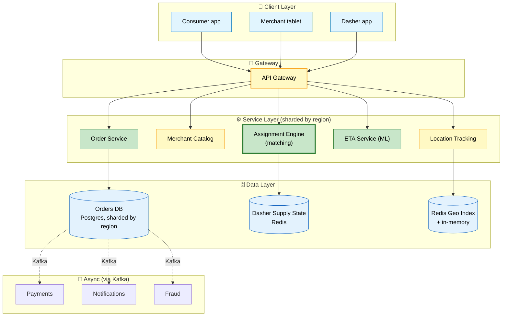
```mermaid
flowchart TD
    subgraph Client["📱 Client Layer"]
        C["Consumer app"]
        M["Merchant tablet"]
        D["Dasher app"]
    end

    subgraph GW["🔌 Gateway"]
        API["API Gateway"]
    end

    subgraph Service["⚙️ Service Layer (sharded by region)"]
        Ord["Order Service"]
        Cat["Merchant Catalog"]
        Assign["Assignment Engine<br/>(matching)"]
        ETA["ETA Service (ML)"]
        Loc["Location Tracking"]
    end

    subgraph Data["🗄️ Data Layer"]
        OrdDB[("Orders DB<br/>Postgres, sharded by region")]
        Supply[("Dasher Supply State<br/>Redis")]
        Geo[("Redis Geo Index<br/>+ in-memory")]
    end

    subgraph Async["📣 Async (via Kafka)"]
        Pay["Payments"]
        Notif["Notifications"]
        Fraud["Fraud"]
    end

    C & M & D --> API
    API --> Ord & Cat & Assign & ETA & Loc
    Ord --> OrdDB
    Assign --> Supply
    Loc --> Geo
    OrdDB -.->|"Kafka"| Pay & Notif & Fraud

    style C fill:#e1f5fe,stroke:#0277bd,color:#000
    style M fill:#e1f5fe,stroke:#0277bd,color:#000
    style D fill:#e1f5fe,stroke:#0277bd,color:#000
    style API fill:#fff9c4,stroke:#f9a825,stroke-width:2px,color:#000
    style Ord fill:#c8e6c9,stroke:#2e7d32,color:#000
    style Assign fill:#c8e6c9,stroke:#2e7d32,stroke-width:3px,color:#000
    style ETA fill:#c8e6c9,stroke:#2e7d32,color:#000
    style Cat fill:#fff9c4,stroke:#f9a825,color:#000
    style Loc fill:#fff9c4,stroke:#f9a825,color:#000
    style OrdDB fill:#e3f2fd,stroke:#1565c0,color:#000
    style Supply fill:#e3f2fd,stroke:#1565c0,color:#000
    style Geo fill:#e3f2fd,stroke:#1565c0,color:#000
```

## 6. Deep Dive — Merchant Integration

```
   ⚠️ THE UNGLAMOROUS PROBLEM THAT DOMINATES REAL WORK

   A million merchants, with wildly varying technical capability:

   ┌──────────────────────────────────────────────────────────────┐
   │ TABLET (most common)   DoorDash-provided device; orders      │
   │                        appear, merchant taps accept          │
   ├──────────────────────────────────────────────────────────────┤
   │ POS INTEGRATION        direct API into Toast/Square/etc.     │
   │                        ⭐ best experience, but dozens of      │
   │                        different POS systems to support      │
   ├──────────────────────────────────────────────────────────────┤
   │ PRINTER / FAX / PHONE  ⚠️ yes, really. Some merchants get    │
   │                        orders via an auto-dialed phone call. │
   └──────────────────────────────────────────────────────────────┘
```

```mermaid
flowchart LR
    Order["Order confirmed"] --> Route{"Merchant<br/>integration type?"}
    Route -->|"most common"| Tablet["✅ Tablet<br/>DoorDash-provided device<br/>merchant taps accept"]
    Route -->|"best experience"| POS["✅ POS Integration<br/>direct API (Toast/Square/etc.)<br/><b>dozens of systems to support</b>"]
    Route -->|"⚠️ still exists"| Fax["⚠️ Printer / Fax / Phone<br/>auto-dialed call to<br/>restaurants without computers"]

    style Order fill:#e1f5fe,stroke:#0277bd,color:#000
    style Route fill:#e3f2fd,stroke:#1565c0,color:#000
    style Tablet fill:#c8e6c9,stroke:#2e7d32,color:#000
    style POS fill:#c8e6c9,stroke:#2e7d32,stroke-width:3px,color:#000
    style Fax fill:#ffcdd2,stroke:#c62828,color:#000

   ⭐ MENU ACCURACY IS A CONSTANT BATTLE
     Prices change, items go out of stock, hours vary.
     A stale menu causes cancelled orders — the worst outcome
     for all three sides. Requires: merchant self-service tools,
     automated staleness detection, and reconciliation against
     actual order rejections.
```

## 🎤 Interview Follow-Ups

<details>
<summary><b>"How do you assign a dasher to an order?"</b></summary>

The naive answer — nearest available dasher — is wrong, because the food is on its own timeline. The dasher should arrive around when the food is ready. Too early and they wait unpaid, which wastes supply capacity; too late and the food is cold.

So assignment predicts several things: food preparation time, which varies by restaurant, item, current kitchen load, and time of day; dasher travel time to the restaurant; and travel plus handoff time to the customer.

Rather than assigning greedily as orders arrive, the system collects a short batch window of pending orders and solves an assignment problem across them — building a cost matrix over dasher-order pairs and solving it, optimally with something like the Hungarian algorithm or heuristically at scale. Optimizing across several orders at once is meaningfully better than greedy per-order assignment.

Batching is the efficiency lever: one dasher carrying two nearby orders earns more and delivers more per unit of supply. But it delays one consumer, so it's a constrained optimization — batch only when the added delay stays under a threshold.

The deeper point is that there's no single objective. Consumer speed, merchant kitchen pacing, and dasher earnings genuinely conflict, so the system optimizes a weighted blend and those weights are a business decision.
</details>

<details>
<summary><b>"How would you build the ETA system?"</b></summary>

I'd decompose it into components with separate models: time to find a dasher, food preparation time, travel to the restaurant, pickup time, travel to the customer, and drop-off time.

Food preparation is the highest-variance component and needs per-restaurant historical distributions conditioned on current kitchen load, item complexity, and time of day. Pickup and drop-off are more location-specific than people expect — a mall food court behaves nothing like a street-front restaurant, and an apartment building with an elevator adds real minutes.

The most important design decision is predicting a *distribution* rather than a point estimate, then quoting a value at roughly the 70th to 80th percentile rather than the median.

That's because the loss is asymmetric. Being late costs far more in customer trust than being early. Quoting the median means being late half the time. Quoting p75 means arriving early most of the time, which consumers experience as reliability. A consistently accurate forty-minute estimate beats an optimistic twenty-five that becomes forty-five.

I'd measure the system on calibration and on late-delivery rate, not on average error — average error rewards exactly the optimism you want to avoid.
</details>

<details>
<summary><b>"What makes a three-sided marketplace harder than two-sided?"</b></summary>

The objectives genuinely conflict, and there's no single quantity to maximize.

Consumers want fast delivery and hot food. Merchants want orders paced to their kitchen capacity rather than twenty arriving simultaneously. Dashers want high earnings per hour with minimal unpaid waiting. Batching orders improves dasher earnings and platform efficiency but delays a consumer. Sending a dasher early guarantees hot food but wastes their time.

So the system optimizes a weighted blend, and those weights are a business decision rather than a technical one — which means the architecture needs them to be tunable and measurable, not hardcoded.

There's also a supply problem on two sides simultaneously. Uber needs enough drivers; DoorDash needs enough dashers *and* enough merchants with accurate menus and functioning integrations. Merchant integration is genuinely one of the dominant engineering costs — supporting everything from proper POS APIs down to auto-dialed phone calls to restaurants without computers.

And the perishability constraint makes time a hard requirement rather than a preference. A ride that takes ten minutes longer is annoying; food that takes ten minutes longer may be inedible.
</details>

---

# 📦 Amazon

> **Teaches:** inventory correctness, cart architecture, and long-running order orchestration.

## 1. Requirements

```
   FUNCTIONAL
   • Browse/search a catalogue of hundreds of millions of items
   • Cart, checkout, payment
   • Inventory across many fulfillment centers
   • Order tracking, returns
   • Reviews, recommendations

   NON-FUNCTIONAL
   SCALE          ~300M+ customers · hundreds of millions of SKUs
                  peak (Prime Day / Black Friday) ~10× normal
   ⭐ AVAILABILITY Amazon's famous stance: ⭐ AVAILABILITY OVER
                  CONSISTENCY for the shopping path. A customer
                  who can't add to cart is lost revenue; a rare
                  oversell is a recoverable business problem.
   ⭐ CONSISTENCY  ...EXCEPT for payment and final inventory
                  commitment, which must be strongly consistent
   LATENCY        Page load < 100ms server-side
```

## 2. The Availability Philosophy

```
   ⭐ THE DYNAMO PAPER'S CENTRAL ARGUMENT

   "Customers should be able to add items to their cart even
    when disks are failing, network routes are flapping, or
    data centers are being destroyed by tornados."

   THE REASONING:
   • An unavailable cart = certain lost revenue, immediately
   • A conflicting cart = a rare, recoverable inconvenience
   • ⭐ Therefore: accept the write ALWAYS, reconcile later

   THIS IS AN AP CHOICE in CAP terms, and it's a BUSINESS
   decision expressed as an architectural one.

   ⚠️ BUT NOT EVERYWHERE. The final inventory decrement and
     the payment charge are strongly consistent. The system is
     deliberately heterogeneous — different consistency for
     different operations based on the cost of being wrong.
```

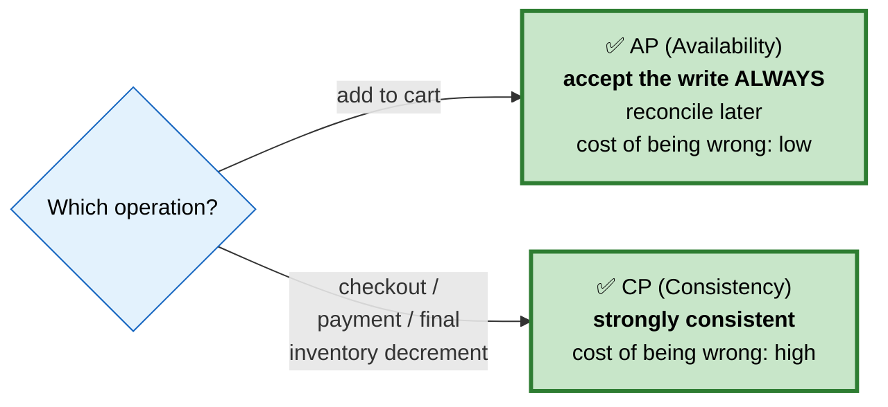
```mermaid
flowchart LR
    Op{"Which operation?"}
    Op -->|"add to cart"| AP["✅ AP (Availability)<br/><b>accept the write ALWAYS</b><br/>reconcile later<br/>cost of being wrong: low"]
    Op -->|"checkout /<br/>payment / final<br/>inventory decrement"| CP["✅ CP (Consistency)<br/><b>strongly consistent</b><br/>cost of being wrong: high"]

    style Op fill:#e3f2fd,stroke:#1565c0,color:#000
    style AP fill:#c8e6c9,stroke:#2e7d32,stroke-width:3px,color:#000
    style CP fill:#c8e6c9,stroke:#2e7d32,stroke-width:3px,color:#000
```

## 3. Deep Dive — The Cart

```
   ⭐ THE FAMOUS "ADD TO CART" CONFLICT

   A customer's cart is replicated. During a partition, they
   add item A on one replica and remove item B on another.
   The replicas now disagree.

   RESOLUTION: MERGE BY UNION (add wins)

   Replica 1: {book, laptop}        (added laptop)
   Replica 2: {book}                (removed laptop)
   Merged:    {book, laptop}        ⭐ the ADD wins

   ⚠️ RESULT: a deleted item can REAPPEAR in the cart.

   ⭐ WHY THIS IS THE RIGHT CHOICE:
     • Item reappears → customer removes it again. Minor annoyance.
     • Item vanishes  → customer doesn't buy it. Lost revenue.

     Amazon deliberately biases toward the recoverable failure.
     The business cost is asymmetric, so the merge rule is too.
```

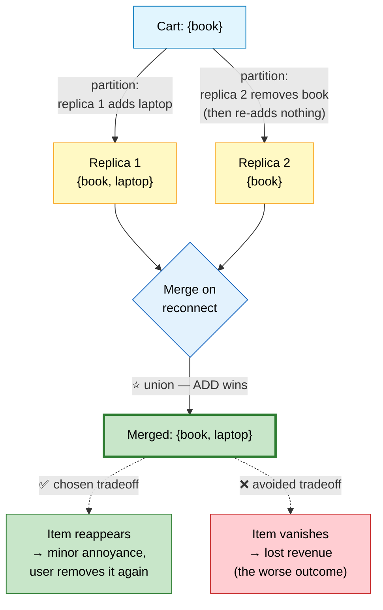
```mermaid
flowchart TD
    Base["Cart: {book}"] -->|"partition:<br/>replica 1 adds laptop"| R1["Replica 1<br/>{book, laptop}"]
    Base -->|"partition:<br/>replica 2 removes book<br/>(then re-adds nothing)"| R2["Replica 2<br/>{book}"]
    R1 --> Merge{"Merge on<br/>reconnect"}
    R2 --> Merge
    Merge -->|"⭐ union — ADD wins"| Result["Merged: {book, laptop}"]

    Result -.->|"✅ chosen tradeoff"| Good["Item reappears<br/>→ minor annoyance,<br/>user removes it again"]
    Result -.->|"❌ avoided tradeoff"| Bad["Item vanishes<br/>→ lost revenue<br/>(the worse outcome)"]

    style Base fill:#e1f5fe,stroke:#0277bd,color:#000
    style R1 fill:#fff9c4,stroke:#f9a825,color:#000
    style R2 fill:#fff9c4,stroke:#f9a825,color:#000
    style Merge fill:#e3f2fd,stroke:#1565c0,color:#000
    style Result fill:#c8e6c9,stroke:#2e7d32,stroke-width:3px,color:#000
    style Good fill:#c8e6c9,stroke:#2e7d32,color:#000
    style Bad fill:#ffcdd2,stroke:#c62828,color:#000
```

```
   THE MECHANISM: VECTOR CLOCKS

   Each replica tracks a version vector so the system can tell
   whether two versions are causally related or genuinely
   concurrent.

   Cart v[A:2, B:1]  and  Cart v[A:1, B:3]
        ▲                       ▲
        └─ neither dominates ───┘  → CONCURRENT
                                   → cannot auto-order them
                                   → apply the merge rule (union)

   Cart v[A:2, B:1]  and  Cart v[A:3, B:1]
                                   → the second DOMINATES
                                   → simply take the newer one

   ⭐ Vector clocks detect concurrency. They don't resolve it —
     resolution is an application-level policy decision, and for
     carts that policy is "union, add wins."
```

## 4. Deep Dive — Inventory

#### 💬 The hardest correctness problem in e-commerce

```
   ⚠️ THE TENSION

   • Showing "in stock" when it isn't → cancelled order, angry
     customer, wasted fulfillment work
   • Showing "out of stock" when it is → lost sale
   • Inventory lives across MANY fulfillment centers
   • ⭐ Physical reality drifts from the database: theft,
     damage, miscounts, items misplaced on shelves

   ⭐ THE KEY REALIZATION: inventory is NOT a simple counter.
     It has states.
```

```
   ┌──────────────────────────────────────────────────────────────┐
   │  INVENTORY STATES                                            │
   │                                                              │
   │   ON HAND        physically present in a fulfillment center  │
   │   RESERVED       allocated to a pending order (not yet       │
   │                  shipped) ⭐ this is the critical one         │
   │   AVAILABLE      = ON HAND − RESERVED                        │
   │   IN TRANSIT     inbound from a supplier                     │
   │   DAMAGED/HELD   present but not sellable                    │
   └──────────────────────────────────────────────────────────────┘
```

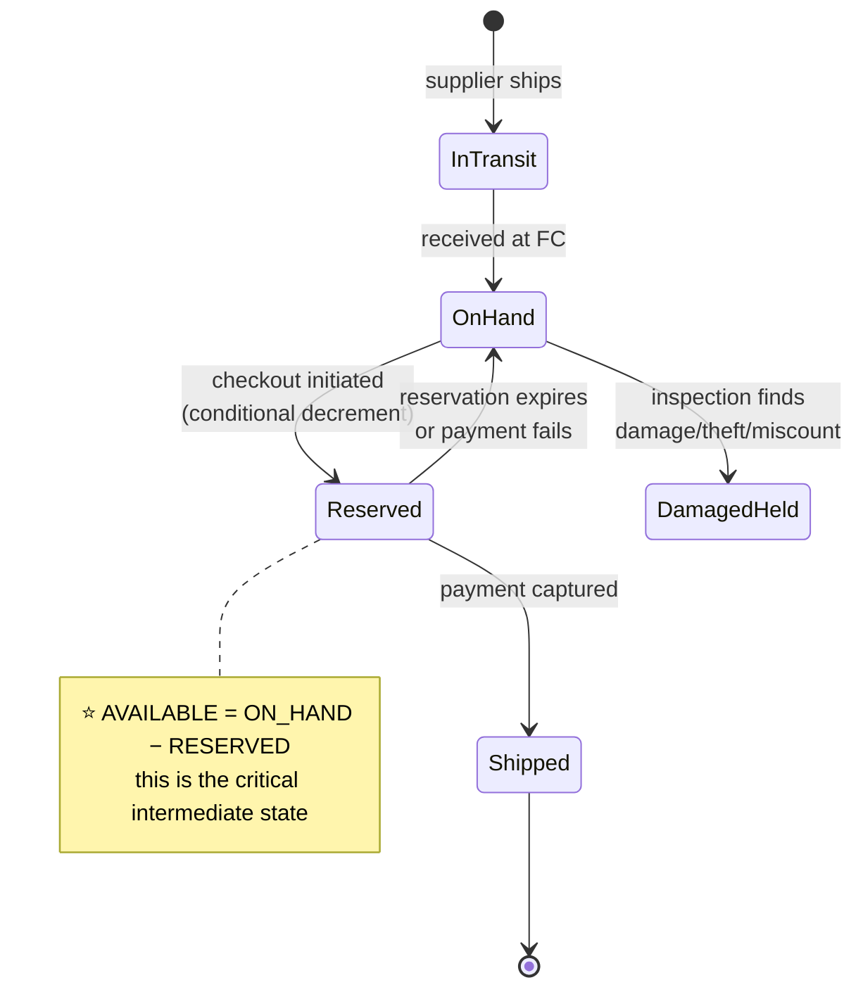
```mermaid
stateDiagram-v2
    [*] --> InTransit: supplier ships
    InTransit --> OnHand: received at FC
    OnHand --> Reserved: checkout initiated<br/>(conditional decrement)
    Reserved --> OnHand: reservation expires<br/>or payment fails
    Reserved --> Shipped: payment captured
    OnHand --> DamagedHeld: inspection finds<br/>damage/theft/miscount
    Shipped --> [*]

    note right of Reserved
        ⭐ AVAILABLE = ON_HAND − RESERVED
        this is the critical intermediate state
    end note
```

```
   THE FLOW — WHEN DOES INVENTORY ACTUALLY GET COMMITTED?

   ① BROWSE      show an APPROXIMATE availability signal
                 ⭐ cached, eventually consistent — "In Stock" is
                   a marketing statement, not a guarantee

   ② ADD TO CART ⭐ NO reservation. Carts are not commitments.
                 Reserving on add-to-cart would let anyone
                 deny inventory to everyone by filling carts.

   ③ CHECKOUT    ⭐ RESERVE — strongly consistent, atomic
                 conditional decrement:

                 UPDATE inventory
                 SET reserved = reserved + 1
                 WHERE sku = :sku
                   AND (on_hand - reserved) >= 1;   -- ⭐ the guard

                 → 0 rows affected = out of stock, fail cleanly

   ④ PAYMENT     if it fails → RELEASE the reservation

   ⑤ SHIP        on_hand decremented, reservation released

   ⭐ RESERVATIONS MUST EXPIRE. An abandoned checkout must not
     hold inventory forever. A background job releases stale
     reservations — same pattern as Airbnb's pending holds.
```

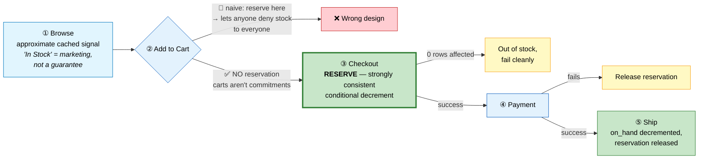
```mermaid
flowchart LR
    Browse["① Browse<br/>approximate cached signal<br/><i>'In Stock' = marketing,<br/>not a guarantee</i>"] --> Cart{"② Add to Cart"}
    Cart -->|"🐌 naive: reserve here<br/>→ lets anyone deny stock<br/>to everyone"| BadReserve["❌ Wrong design"]
    Cart -->|"✅ NO reservation<br/>carts aren't commitments"| Checkout["③ Checkout<br/><b>RESERVE</b> — strongly consistent<br/>conditional decrement"]
    Checkout -->|"0 rows affected"| Fail["Out of stock,<br/>fail cleanly"]
    Checkout -->|"success"| Payment["④ Payment"]
    Payment -->|"fails"| Release["Release reservation"]
    Payment -->|"success"| Ship["⑤ Ship<br/>on_hand decremented,<br/>reservation released"]

    style Browse fill:#e1f5fe,stroke:#0277bd,color:#000
    style Cart fill:#e3f2fd,stroke:#1565c0,color:#000
    style BadReserve fill:#ffcdd2,stroke:#c62828,color:#000
    style Checkout fill:#c8e6c9,stroke:#2e7d32,stroke-width:3px,color:#000
    style Fail fill:#fff9c4,stroke:#f9a825,color:#000
    style Payment fill:#e3f2fd,stroke:#1565c0,color:#000
    style Release fill:#fff9c4,stroke:#f9a825,color:#000
    style Ship fill:#c8e6c9,stroke:#2e7d32,color:#000
```

```
   ⚠️ OVERSELLING WILL STILL HAPPEN OCCASIONALLY

   Physical inventory drifts from the database. The system must
   handle it as a BUSINESS process, not pretend it can't occur:
     • detect at fulfillment time
     • source from another fulfillment center if possible
     • proactively notify the customer with options
     • offer compensation
     • feed the discrepancy back into inventory accuracy metrics

   ⭐ This is a mature framing: perfect inventory accuracy is
     physically impossible, so design the recovery path as a
     first-class feature.
```

## 5. Deep Dive — Order Orchestration

```
   ⭐ AN ORDER IS A LONG-RUNNING DISTRIBUTED WORKFLOW,
     not a single transaction. It spans minutes to weeks and
     touches a dozen services.

   ┌───────────┐
   │  PLACED   │
   └─────┬─────┘
         ▼
   ┌───────────┐  payment authorized, inventory reserved
   │ CONFIRMED │
   └─────┬─────┘
         ▼
   ┌───────────┐  fulfillment center picks and packs
   │ PROCESSING│
   └─────┬─────┘
         ▼
   ┌───────────┐  handed to carrier, payment CAPTURED
   │  SHIPPED  │  ⭐ capture happens at ship, not at order
   └─────┬─────┘
         ▼
   ┌───────────┐
   │ DELIVERED │
   └─────┬─────┘
         ▼
   ┌───────────┐  up to 30+ days later
   │ RETURNED  │
   └───────────┘

   AT EVERY STEP: cancellation, partial fulfillment, split
   shipment from multiple FCs, address change, payment failure.
```

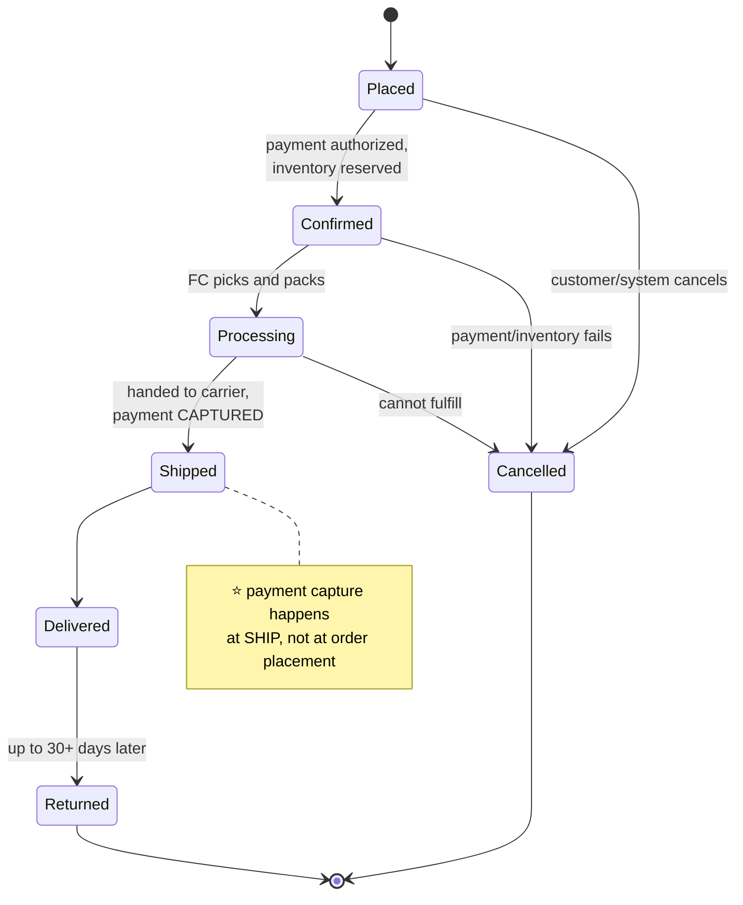
```mermaid
stateDiagram-v2
    [*] --> Placed
    Placed --> Confirmed: payment authorized,<br/>inventory reserved
    Confirmed --> Processing: FC picks and packs
    Processing --> Shipped: handed to carrier,<br/>payment CAPTURED
    Shipped --> Delivered
    Delivered --> Returned: up to 30+ days later

    Placed --> Cancelled: customer/system cancels
    Confirmed --> Cancelled: payment/inventory fails
    Processing --> Cancelled: cannot fulfill
    Cancelled --> [*]
    Returned --> [*]

    note right of Shipped
        ⭐ payment capture happens
        at SHIP, not at order placement
    end note
```

```
   ⭐ THIS IS A SAGA — see [Queues §12](../03-backend/queues-streaming.md#12-sagas)

   Each step is a local transaction with a COMPENSATING action:

   reserve inventory   ↔  release inventory
   authorize payment   ↔  void authorization
   allocate to FC      ↔  deallocate
   capture payment     ↔  refund

   ⚠️ COMPENSATIONS ARE NOT ROLLBACKS.
     You can't un-ship a package. You can only initiate a return.
     You can't un-send a confirmation email. You send a
     correction. The compensating action is a NEW business
     event, not an undo.

   ⭐ ORCHESTRATION over choreography here: an explicit order
     workflow service drives the steps, because the flow is
     complex, needs visibility for customer service, and must
     be resumable after any failure.
```

```mermaid
flowchart LR
    subgraph Forward["Forward Steps (Saga)"]
        S1["reserve inventory"] --> S2["authorize payment"] --> S3["allocate to FC"] --> S4["capture payment"]
    end
    subgraph Compensating["Compensating Actions (NOT rollbacks)"]
        C1["release inventory"]
        C2["void authorization"]
        C3["deallocate"]
        C4["refund<br/>(new business event,<br/>not an undo)"]
    end
    S1 -.->|"on failure"| C1
    S2 -.->|"on failure"| C2
    S3 -.->|"on failure"| C3
    S4 -.->|"on failure"| C4

    style S1 fill:#c8e6c9,stroke:#2e7d32,color:#000
    style S2 fill:#c8e6c9,stroke:#2e7d32,color:#000
    style S3 fill:#c8e6c9,stroke:#2e7d32,color:#000
    style S4 fill:#c8e6c9,stroke:#2e7d32,stroke-width:3px,color:#000
    style C1 fill:#fff9c4,stroke:#f9a825,color:#000
    style C2 fill:#fff9c4,stroke:#f9a825,color:#000
    style C3 fill:#fff9c4,stroke:#f9a825,color:#000
    style C4 fill:#fff9c4,stroke:#f9a825,color:#000
```

## 6. Deep Dive — Search & Recommendations

```
   SEARCH — a ranking problem, not a matching problem

   Signals: text relevance · sales velocity · conversion rate ·
            price competitiveness · reviews · Prime eligibility ·
            in-stock status · ⭐ sponsored placements

   ⭐ THE OBJECTIVE IS REVENUE-WEIGHTED, not pure relevance.
     A perfectly relevant out-of-stock item is worthless.
     This is why Amazon search behaves differently from
     a pure information-retrieval system.

   RECOMMENDATIONS — item-to-item collaborative filtering

   ⭐ Amazon's classic contribution: precompute a SIMILAR-ITEMS
     table rather than a user-to-user similarity matrix.

     "Customers who bought X also bought Y"

     ✅ The item-item matrix is stable — it changes slowly and
        can be computed offline
     ✅ Recommendations at request time are a simple lookup
        keyed on what the user is currently viewing
     ✅ ⭐ Scales independently of user count — the expensive
        computation is O(items²), not O(users²), and items
        change far more slowly than users
```

```mermaid
flowchart LR
    Q{"User-to-user or<br/>item-to-item similarity?"}
    Q --> UU["🐌 User-to-user matrix<br/>O(users²) — recomputed<br/>constantly as users churn"]
    Q --> II["✅ Item-to-item matrix<br/><b>O(items²), computed OFFLINE</b><br/>stable — changes slowly"]
    II --> Lookup["Request time: simple lookup<br/>keyed on item being viewed<br/>'customers who bought X<br/>also bought Y'"]

    style Q fill:#e3f2fd,stroke:#1565c0,color:#000
    style UU fill:#ffcdd2,stroke:#c62828,color:#000
    style II fill:#c8e6c9,stroke:#2e7d32,stroke-width:3px,color:#000
    style Lookup fill:#c8e6c9,stroke:#2e7d32,color:#000
```

## 🎤 Interview Follow-Ups

<details>
<summary><b>"Why does Amazon choose availability over consistency for the cart?"</b></summary>

Because the business costs are asymmetric. A customer who can't add an item to their cart is immediately lost revenue. A customer whose cart has a conflict sees a minor, recoverable inconvenience.

So the cart accepts writes always, even during partitions, and reconciles afterward. When two concurrent versions exist, the merge rule is union — add wins. The visible consequence is that a removed item can reappear, which is deliberately chosen because an item reappearing is an annoyance while an item vanishing is a lost sale.

Vector clocks are the mechanism for detecting whether two versions are causally related or genuinely concurrent. They detect the conflict; they don't resolve it. Resolution is an application-level policy, and for carts that policy is union.

The important nuance is that this is not a system-wide choice. Payment and final inventory commitment are strongly consistent, because there the cost of being wrong is high and not recoverable by the customer. The architecture is deliberately heterogeneous — different consistency guarantees for different operations, chosen by the cost of being wrong.
</details>

<details>
<summary><b>"How do you prevent overselling?"</b></summary>

Inventory isn't a counter, it's a set of states — on hand, reserved, available, in transit, damaged. Available is on-hand minus reserved.

The commitment point is checkout, not add-to-cart. Reserving at add-to-cart would let anyone deny inventory to everyone by filling carts, so carts are explicitly not commitments and browse-time availability is a cached, approximate signal.

At checkout, the reservation is a strongly consistent conditional update — increment reserved only where on-hand minus reserved is still at least the quantity requested. Zero rows affected means out of stock, and the checkout fails cleanly. That's the same pattern as Airbnb's exclusion constraint: the database enforces it, not application logic.

Reservations must expire, or an abandoned checkout holds inventory forever.

The mature part of the answer is accepting that overselling will still occasionally happen, because physical inventory drifts from the database through theft, damage, and miscounts. So the recovery path is a first-class feature — detect at fulfillment, source from another center if possible, proactively notify with options, and feed the discrepancy into inventory accuracy metrics.
</details>

<details>
<summary><b>"How do you model an order that spans weeks and a dozen services?"</b></summary>

As a saga with an explicit orchestrator, not as a transaction.

Each step is a local transaction paired with a compensating action: reserve inventory compensated by release, authorize payment by void, allocate to a fulfillment center by deallocate, capture by refund.

The critical framing is that compensations aren't rollbacks. You can't un-ship a package — you initiate a return. You can't un-send a confirmation email — you send a correction. Each compensating action is a new business event, which is why this can't be modeled as a distributed transaction.

I'd choose orchestration over choreography here. An explicit workflow service drives the steps, because the flow is complex, customer service needs visibility into exactly where an order is, and the process must be resumable after any failure. With choreography, no single place shows the whole flow, which is untenable when a human support agent needs to answer "where is my order."

State must be persisted at every transition with the reason, so a crash resumes rather than restarts, and so the history is auditable.
</details>

---

# 🎬 TikTok

> **Teaches:** the pure-recommendation feed — no social graph required, extreme cold start, and closing the feedback loop in near-real time.

## 1. Requirements

```
   FUNCTIONAL
   • Infinite scrolling video feed (For You Page)
   • Upload with editing tools, effects, music
   • Follow creators, like, comment, share
   • Search, hashtags, sounds

   NON-FUNCTIONAL
   SCALE          ~1B+ MAU · billions of video views/day
   ⭐ LATENCY      Next video must be ready INSTANTLY — the whole
                  product depends on zero perceived load time
   ⭐ FRESHNESS    New content must reach an audience within
                  MINUTES, not hours
   AVAILABILITY   99.9%
```

## 2. The Defining Architectural Difference

```
   ┌────────────────────────┬─────────────────────────────────────┐
   │ INSTAGRAM / TWITTER    │ TIKTOK                              │
   ├────────────────────────┼─────────────────────────────────────┤
   │ Feed is built from     │ ⭐ Feed is built from                │
   │ WHO YOU FOLLOW         │   CONTENT SIMILARITY + PREDICTED    │
   │                        │   ENGAGEMENT — the social graph is  │
   │                        │   an input, not the foundation      │
   ├────────────────────────┼─────────────────────────────────────┤
   │ Cold start = "follow   │ ⭐ Cold start = "watch 10 videos and │
   │ some people first"     │   we already know you"              │
   ├────────────────────────┼─────────────────────────────────────┤
   │ A new creator needs    │ ⭐ A new creator with zero followers │
   │ followers to get reach │   can reach millions immediately    │
   ├────────────────────────┼─────────────────────────────────────┤
   │ Fan-out is the         │ ⭐ RANKING is the hard problem.      │
   │ hard problem           │   There is no fan-out.              │
   └────────────────────────┴─────────────────────────────────────┘

   ⭐ THIS ELIMINATES THE ENTIRE FAN-OUT PROBLEM.
     No per-user timelines to materialize. No celebrity write
     amplification. Instead, ALL the difficulty moves into
     the ranking system and its latency budget.
```

```mermaid
flowchart LR
    Q{"What builds<br/>the feed?"}
    Q -->|"Instagram/Twitter"| Graph["⚠️ Social graph<br/><b>fan-out is the hard problem</b><br/>materialize per-user timelines,<br/>celebrity write amplification"]
    Q -->|"TikTok"| Rank["✅ Content similarity +<br/>predicted engagement<br/><b>ranking is the hard problem</b><br/>NO fan-out at all"]

    Graph -.->|"cold start"| G2["follow people first"]
    Rank -.->|"cold start"| R2["watch 10 videos,<br/>we already know you"]

    style Q fill:#e3f2fd,stroke:#1565c0,color:#000
    style Graph fill:#ffcdd2,stroke:#c62828,color:#000
    style Rank fill:#c8e6c9,stroke:#2e7d32,stroke-width:3px,color:#000
    style G2 fill:#fff9c4,stroke:#f9a825,color:#000
    style R2 fill:#c8e6c9,stroke:#2e7d32,color:#000
```

## 3. Deep Dive — The Recommendation Pipeline

```
   ┌──────────────────────────────────────────────────────────────┐
   │ ① CANDIDATE GENERATION   (billions → ~thousands)             │
   │                                                              │
   │   Multiple retrieval sources in parallel:                    │
   │     • ⭐ EMBEDDING SIMILARITY — approximate nearest neighbour │
   │       search over video embeddings vs the user's interest    │
   │       vector. This is the primary source.                    │
   │     • trending/viral content in the user's region+language   │
   │     • content from followed creators                         │
   │     • content similar to what the user recently engaged with │
   │     • ⭐ EXPLORATION BUCKET — deliberately unfamiliar content │
   │                                                              │
   │   Must complete in ~10ms. Uses precomputed embeddings and    │
   │   ANN indexes (HNSW/IVF), never a model forward pass.        │
   ├──────────────────────────────────────────────────────────────┤
   │ ② RANKING                (thousands → ~hundreds)             │
   │                                                              │
   │   A deep model predicting MULTIPLE objectives:               │
   │     P(watch to completion)  ⭐ the strongest signal           │
   │     P(rewatch / loop)       ⭐ extremely strong               │
   │     P(like) · P(comment) · P(share) ⭐ share = strongest      │
   │       positive signal, it implies real value                 │
   │     P(follow creator)                                        │
   │     P(skip immediately)     ⭐ heavily weighted NEGATIVE      │
   │                                                              │
   │   Combined into a single score with tuned weights.           │
   ├──────────────────────────────────────────────────────────────┤
   │ ③ RE-RANKING / POLICY     (hundreds → the next ~10)          │
   │     • diversity — don't show 5 near-identical videos         │
   │     • creator diversity — spread across creators             │
   │     • ⭐ freshness injection — guarantee some new content     │
   │     • integrity filters and policy enforcement               │
   │     • ad slots at defined intervals                          │
   └──────────────────────────────────────────────────────────────┘
```

```mermaid
flowchart TD
    Billions(["Billions of videos"]) --> CG["① Candidate Generation<br/>~10ms · ANN over embeddings<br/><b>never a model forward pass</b>"]
    CG --> Sources{"Parallel retrieval sources"}
    Sources --> Emb["Embedding similarity<br/>(primary source)"]
    Sources --> Trend["Trending in region/language"]
    Sources --> Follow["Followed creators"]
    Sources --> Recent["Similar to recent engagement"]
    Sources --> Explore["⭐ Exploration bucket<br/>deliberately unfamiliar"]

    Emb & Trend & Follow & Recent & Explore --> Thousands(["~thousands of candidates"])
    Thousands --> Rank["② Ranking<br/>deep model, multiple objectives"]
    Rank --> Hundreds(["~hundreds"])
    Hundreds --> Rerank["③ Re-ranking / Policy<br/>diversity, freshness, ads,<br/>integrity filters"]
    Rerank --> Next10(["Next ~10 videos<br/>served to user"])

    style Billions fill:#e1f5fe,stroke:#0277bd,color:#000
    style CG fill:#c8e6c9,stroke:#2e7d32,color:#000
    style Sources fill:#e3f2fd,stroke:#1565c0,color:#000
    style Explore fill:#fff9c4,stroke:#f9a825,stroke-width:2px,color:#000
    style Rank fill:#c8e6c9,stroke:#2e7d32,stroke-width:3px,color:#000
    style Rerank fill:#c8e6c9,stroke:#2e7d32,color:#000
    style Next10 fill:#c8e6c9,stroke:#2e7d32,stroke-width:2px,color:#000
```

```
   ⭐ WHY WATCH-COMPLETION AND REWATCH DOMINATE

   Likes are cheap, biased, and sparse. Watch time is
   involuntary and continuous — it measures what people
   actually do, not what they perform.

   Rewatching a short video is an extraordinarily strong signal
   because the format makes it nearly frictionless. Short videos
   make the signal density enormous: a user generates dozens of
   complete engagement signals per minute, versus a handful per
   session on a long-form platform.

   ⭐ THE FORMAT IS THE DATA ADVANTAGE. A 15-second video
     yields a full watch-completion signal in 15 seconds.
     That's the real reason the recommendations feel so sharp.
```

```mermaid
flowchart LR
    subgraph Strong["⭐ Strong signals"]
        Complete["P(watch to completion)"]
        Rewatch["P(rewatch / loop)"]
        Share["P(share)<br/><b>strongest positive signal</b>"]
    end
    subgraph Weak["Weaker / biased signals"]
        Like["P(like)"]
        Comment["P(comment)"]
    end
    subgraph Neg["⚠️ Heavily weighted negative"]
        Skip["P(skip immediately)"]
    end

    Strong --> Score["Combined Score<br/>(tuned weights)"]
    Weak --> Score
    Neg -->|"pulls score DOWN"| Score

    style Complete fill:#c8e6c9,stroke:#2e7d32,stroke-width:2px,color:#000
    style Rewatch fill:#c8e6c9,stroke:#2e7d32,stroke-width:2px,color:#000
    style Share fill:#c8e6c9,stroke:#2e7d32,stroke-width:3px,color:#000
    style Like fill:#fff9c4,stroke:#f9a825,color:#000
    style Comment fill:#fff9c4,stroke:#f9a825,color:#000
    style Skip fill:#ffcdd2,stroke:#c62828,stroke-width:2px,color:#000
    style Score fill:#e3f2fd,stroke:#1565c0,stroke-width:2px,color:#000
```

## 4. Deep Dive — Cold Start

```
   TWO COLD START PROBLEMS, BOTH SOLVED WELL

   ┌──────────────────────────────────────────────────────────────┐
   │ NEW USER — no history at all                                 │
   │                                                              │
   │   ① Start with broadly popular content in their region       │
   │      and language                                            │
   │   ② ⭐ Every interaction updates the interest model IN NEAR   │
   │      REAL TIME — not in a nightly batch                      │
   │   ③ After ~10-20 videos, the model has strong signal:        │
   │      what they watched fully, what they skipped in 1 second, │
   │      what they rewatched                                     │
   │                                                              │
   │   ⭐ Fast skips are as informative as full watches. Negative  │
   │     signal arrives just as quickly and is weighted heavily.  │
   ├──────────────────────────────────────────────────────────────┤
   │ NEW VIDEO — no engagement data                               │
   │                                                              │
   │   ① CONTENT UNDERSTANDING FIRST                              │
   │      Visual embeddings, audio/music identification, text     │
   │      (captions, OCR of on-screen text), hashtags, the        │
   │      creator's historical performance                        │
   │      → place it in embedding space WITHOUT any views         │
   │                                                              │
   │   ② ⭐ STAGED TRAFFIC EXPOSURE — the key mechanism            │
   │                                                              │
   │      show to ~200 users  ─── strong engagement? ──┐          │
   │              │ weak                               ▼          │
   │              ▼                          show to ~2,000       │
   │        stop promoting                        │               │
   │                                    strong?   ▼               │
   │                                        show to ~20,000       │
   │                                              │               │
   │                                              ▼               │
   │                                         ...viral             │
   │                                                              │
   │   ⭐ Each stage is a statistical test. Videos are promoted    │
   │     based on engagement RATE within their exposure cohort,   │
   │     not absolute counts — so a new creator competes fairly   │
   │     with an established one.                                 │
   └──────────────────────────────────────────────────────────────┘
```

```mermaid
flowchart TD
    New(["New video<br/>zero engagement data"]) --> CU["Content Understanding<br/>visual + audio embeddings,<br/>OCR, hashtags, creator history<br/><b>placed in embedding space<br/>with NO views needed</b>"]
    CU --> S1["Show to ~200 users"]
    S1 --> T1{"Engagement rate<br/>strong?"}
    T1 -->|"❌ weak"| Stop1["Stop promoting"]
    T1 -->|"✅ strong"| S2["Show to ~2,000 users"]
    S2 --> T2{"Still strong<br/>at this scale?"}
    T2 -->|"❌ weak"| Stop2["Stop promoting"]
    T2 -->|"✅ strong"| S3["Show to ~20,000 users"]
    S3 --> T3{"Still strong?"}
    T3 -->|"✅"| Viral(["... viral"])
    T3 -->|"❌"| Stop3["Stop promoting"]

    style New fill:#e1f5fe,stroke:#0277bd,color:#000
    style CU fill:#e3f2fd,stroke:#1565c0,stroke-width:2px,color:#000
    style S1 fill:#fff9c4,stroke:#f9a825,color:#000
    style S2 fill:#fff9c4,stroke:#f9a825,color:#000
    style S3 fill:#fff9c4,stroke:#f9a825,color:#000
    style T1 fill:#e3f2fd,stroke:#1565c0,color:#000
    style T2 fill:#e3f2fd,stroke:#1565c0,color:#000
    style T3 fill:#e3f2fd,stroke:#1565c0,color:#000
    style Stop1 fill:#ffcdd2,stroke:#c62828,color:#000
    style Stop2 fill:#ffcdd2,stroke:#c62828,color:#000
    style Stop3 fill:#ffcdd2,stroke:#c62828,color:#000
    style Viral fill:#c8e6c9,stroke:#2e7d32,stroke-width:3px,color:#000
```

```
   ⭐ THIS STAGED-EXPOSURE MECHANISM IS THE PRODUCT.

   It's why an unknown creator can go viral, which is why
   creators keep posting, which is what keeps the content
   supply flowing. The recommendation system is also the
   creator-acquisition system.
```

## 5. Deep Dive — Latency Budget

```
   ⚠️ THE HARD CONSTRAINT: the next video must be READY when
     the user swipes. Any perceptible wait breaks the experience.

   ┌──────────────────────────────────────────────────────────────┐
   │ ① PREFETCH AGGRESSIVELY                                      │
   │    ⭐ Don't fetch one video — fetch the next 3-5 and          │
   │      preload the first seconds of each. The user's swipe     │
   │      finds the video already buffered.                       │
   ├──────────────────────────────────────────────────────────────┤
   │ ② PRECOMPUTE THE RANKED QUEUE                                │
   │    Recommendations for the next batch are computed while     │
   │    the user watches the current video. Ranking never         │
   │    happens on the critical path of a swipe.                  │
   ├──────────────────────────────────────────────────────────────┤
   │ ③ EDGE-CACHED VIDEO                                          │
   │    Videos are small (a few MB) and highly skewed in          │
   │    popularity → excellent CDN hit rates.                     │
   ├──────────────────────────────────────────────────────────────┤
   │ ④ ADAPTIVE QUALITY                                           │
   │    Start with a lower bitrate for instant start, upgrade     │
   │    if bandwidth allows and the user keeps watching.          │
   └──────────────────────────────────────────────────────────────┘

   ⭐ THE PATTERN: move ALL work off the interaction path.
     Same principle as Netflix's precomputed personalization
     and Twitter's precomputed timelines — but with a much
     tighter budget, because the interaction is a swipe rather
     than a page load.
```

```mermaid
flowchart LR
    Swipe(["👆 User swipes"]) --> Check{"Next video<br/>already prefetched<br/>+ buffered?"}
    Check -->|"✅ yes (target state)"| Instant["Instant playback<br/>zero perceived latency"]
    Check -->|"❌ no — design failure"| Wait["Perceptible delay<br/>breaks the experience"]

    Watching["While watching<br/>current video"] -.->|"prefetch next 3-5<br/>+ precompute ranked queue"| Check

    style Swipe fill:#e1f5fe,stroke:#0277bd,color:#000
    style Check fill:#e3f2fd,stroke:#1565c0,color:#000
    style Instant fill:#c8e6c9,stroke:#2e7d32,stroke-width:3px,color:#000
    style Wait fill:#ffcdd2,stroke:#c62828,color:#000
    style Watching fill:#fff9c4,stroke:#f9a825,color:#000
```

## 6. Deep Dive — The Feedback Loop

```
   ⭐ THE SPEED OF THE LOOP IS THE COMPETITIVE ADVANTAGE

   ┌────────────────────────────────────────────────────────────┐
   │  User watches ──▶ signals emitted ──▶ stream processing    │
   │       ▲                                      │             │
   │       │                                      ▼             │
   │       │                            interest model updated  │
   │       │                                      │             │
   │       └──────── next recommendations ◀───────┘             │
   │                                                            │
   │        ⭐ This loop closes in SECONDS TO MINUTES,           │
   │          not in a nightly batch.                           │
   └────────────────────────────────────────────────────────────┘

   ⚠️ THE FILTER BUBBLE RISK IS STRUCTURAL

   A tight optimization loop naturally narrows: it keeps showing
   more of what worked, which narrows the signal, which narrows
   the recommendations further.

   COUNTERMEASURES that must be DELIBERATELY built in:
     • guaranteed exploration budget in every session
     • diversity constraints in re-ranking
     • ⭐ penalize excessive repetition of a topic even when
       predicted engagement is high
     • surface content outside the user's established cluster
       at a controlled rate

   ⭐ Without these, the system converges to a degenerate
     local optimum — high short-term engagement, declining
     long-term retention. This is a real and well-documented
     failure mode of engagement-optimized systems.
```

```mermaid
flowchart LR
    Watch["User watches"] --> Signal["Signals emitted"]
    Signal --> Stream["Stream processing"]
    Stream --> Model["Interest model updated<br/><b>closes in seconds-minutes</b>"]
    Model --> Next["Next recommendations"]
    Next -.->|"narrows further"| Watch

    Next -.->|"⚠️ unchecked loop"| Bubble["Filter bubble<br/>degenerate local optimum"]

    Explore["✅ Exploration budget"] -.->|"countermeasure"| Next
    Diversity["✅ Diversity constraints"] -.->|"countermeasure"| Next
    Penalty["✅ Penalize repetition"] -.->|"countermeasure"| Next

    style Watch fill:#e1f5fe,stroke:#0277bd,color:#000
    style Signal fill:#e3f2fd,stroke:#1565c0,color:#000
    style Stream fill:#e3f2fd,stroke:#1565c0,color:#000
    style Model fill:#c8e6c9,stroke:#2e7d32,color:#000
    style Next fill:#c8e6c9,stroke:#2e7d32,stroke-width:2px,color:#000
    style Bubble fill:#ffcdd2,stroke:#c62828,stroke-width:2px,color:#000
    style Explore fill:#fff9c4,stroke:#f9a825,color:#000
    style Diversity fill:#fff9c4,stroke:#f9a825,color:#000
    style Penalty fill:#fff9c4,stroke:#f9a825,color:#000
```

## 🎤 Interview Follow-Ups

<details>
<summary><b>"How is TikTok's feed architecturally different from Instagram's?"</b></summary>

Instagram builds a feed from who you follow, so fan-out is the hard problem — materializing per-user timelines, handling celebrity write amplification, all of that.

TikTok builds the feed from content similarity and predicted engagement. The social graph is one input among many, not the foundation. That eliminates fan-out entirely — there are no per-user timelines to materialize and no celebrity amplification problem.

All the difficulty moves into ranking, and into the latency budget around it. The feed is computed per request from a ranking pipeline rather than read from a precomputed list.

The consequences are what made the product work. A new user gets good recommendations after roughly ten videos rather than needing to follow people first. And a creator with zero followers can reach millions immediately, which is why creators keep posting — the recommendation system doubles as the creator acquisition system.
</details>

<details>
<summary><b>"How does a brand-new video get its first views?"</b></summary>

Content understanding first, then staged exposure.

Before any views exist, the video is placed in embedding space using visual embeddings, audio and music identification, text from captions and on-screen OCR, hashtags, and the creator's historical performance. So it can be matched to interested users with zero engagement data.

Then it's promoted in stages. Show it to a couple hundred users; if engagement rate within that cohort is strong, promote to a few thousand; then tens of thousands, and so on. Each stage is effectively a statistical test.

The critical detail is that promotion is based on engagement *rate* within the exposure cohort, not absolute counts. That's what lets a new creator compete fairly with an established one — a video shown to 200 people that 80% watch to completion beats a video shown to 200,000 that 5% finish.

This mechanism is arguably the product itself. It's why unknown creators can go viral, which sustains the content supply that the recommendation system depends on.
</details>

<details>
<summary><b>"How do you make the next video appear instantly?"</b></summary>

By moving all work off the interaction path.

Prefetch several videos ahead — not one — and preload the first seconds of each, so a swipe finds content already buffered. Precompute the ranked queue while the user watches the current video, so ranking never runs on the critical path of a swipe. Serve from CDN edge, which works well because videos are only a few megabytes and popularity is highly skewed. And start at a lower bitrate for instant playback, upgrading if bandwidth allows and the user keeps watching.

The general pattern is the same as Netflix's precomputed personalization and Twitter's precomputed timelines, but the budget is far tighter because the interaction is a swipe rather than a page load. There's essentially no tolerance for perceptible latency.

The interesting second-order effect is that prefetching several videos ahead means the ranking decision is committed early, so signals from the very last video can't influence the immediately next one. That's a real tradeoff between responsiveness of the model and responsiveness of the UI.
</details>

<details>
<summary><b>"What's the risk of optimizing purely for engagement?"</b></summary>

Filter bubbles, and it's structural rather than accidental. A tight optimization loop keeps showing more of what worked, which narrows the signal it receives, which narrows recommendations further. The system converges to a degenerate local optimum — high short-term engagement with declining long-term retention.

Countermeasures have to be deliberately built in, because the optimizer will not find them on its own. A guaranteed exploration budget in every session. Diversity constraints in re-ranking. Explicitly penalizing repetition of a topic even when predicted engagement is high. And surfacing content outside the user's established cluster at a controlled rate.

There's a broader version of this too: engagement-optimized systems tend to over-reward content that provokes rather than content that satisfies, because outrage and anxiety generate strong short-term signals. Which is why serious systems include integrity classifiers and weight negative feedback like "not interested" or fast skips heavily, and why the objective function is usually a blend that includes retention and satisfaction proxies rather than raw watch time alone.

The engineering point is that the objective function encodes a value judgment, and pretending it's purely technical is how these systems go wrong.
</details>

---

## 📋 Volume Summary

```
╔══════════════════════════════════════════════════════════════════════╗
║                   CASE STUDIES VOL. 3 — RECALL                       ║
╠══════════════════════════════════════════════════════════════════════╣
║ SLACK    permanent searchable history changes EVERYTHING vs WhatsApp ║
║   ⭐ shard by WORKSPACE (natural isolation, like Uber's geo sharding) ║
║   ⭐ CURSOR MODEL: one channel log + per-user position                ║
║     → unread = subtraction, no per-user inbox, instant full history  ║
║   push only to CONNECTED members; offline pull on reconnect          ║
║   read state is SERVER-side → multi-device consistency               ║
║   ⚠️ search permission filtering = highest-severity bug class         ║
╠══════════════════════════════════════════════════════════════════════╣
║ SPOTIFY  ⭐ audio is ~60× cheaper than video → commercial CDN is fine ║
║   instant playback: device cache (biggest win) + prefetch next       ║
║   ⭐ playlists: FRACTIONAL ORDERING KEYS, not array indices           ║
║     (same idea as CRDT sequence IDs)                                 ║
║   ⭐ Discover Weekly = collaborative filtering + NLP + RAW AUDIO      ║
║     audio analysis solves cold start (works with zero listens)       ║
║   licensing is per-territory + time-bounded → filter on every path   ║
╠══════════════════════════════════════════════════════════════════════╣
║ DOORDASH ⭐ THREE-sided: consumer/merchant/dasher objectives CONFLICT ║
║   assignment ≠ nearest dasher — match arrival to FOOD-READY time     ║
║   batch window + assignment problem beats greedy per-order           ║
║   ⭐ ETA: predict a DISTRIBUTION, quote ~p75 (asymmetric loss —       ║
║     late costs far more than early)                                  ║
║   merchant integration (tablet/POS/fax) dominates real eng cost      ║
╠══════════════════════════════════════════════════════════════════════╣
║ AMAZON   ⭐ AVAILABILITY over consistency for the CART (Dynamo)       ║
║     merge by UNION, add wins — deleted item may reappear             ║
║     because lost sale > minor annoyance (asymmetric business cost)   ║
║   vector clocks DETECT concurrency; app policy RESOLVES it           ║
║   ⭐ inventory is STATES not a counter: on_hand/reserved/available    ║
║     reserve at CHECKOUT (not cart) via conditional update            ║
║     reservations MUST expire · overselling recovery is a FEATURE     ║
║   order = SAGA with compensations (can't un-ship → return)           ║
║   ⭐ item-to-item CF: O(items²) offline, scales independent of users  ║
╠══════════════════════════════════════════════════════════════════════╣
║ TIKTOK   ⭐ NO FAN-OUT PROBLEM — feed is ranked, not graph-derived    ║
║     all difficulty moves into ranking + latency budget               ║
║   watch-completion and REWATCH dominate; share = strongest positive  ║
║   ⭐ short format = enormous SIGNAL DENSITY — the real advantage      ║
║   cold start: content embeddings + ⭐ STAGED EXPOSURE                 ║
║     promote on engagement RATE in cohort, not absolute counts        ║
║     → this IS the creator-acquisition mechanism                      ║
║   ⭐ feedback loop closes in MINUTES, not nightly batch               ║
║   ⚠️ filter bubble is STRUCTURAL → exploration + diversity must be    ║
║     deliberately built in, the optimizer won't find them             ║
╚══════════════════════════════════════════════════════════════════════╝
```

---

**Next:** [Distributed Systems Theory →](06-distributed-theory.md) · **Related:** [Vol. 1](03-case-studies-1.md) · [Vol. 2](04-case-studies-2.md) · [Framework](02-framework.md)
